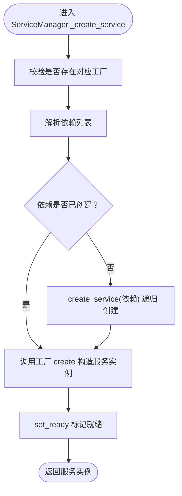

# 服务层架构

<cite>
**本文引用的文件**
- [src/backend/bisheng/services/__init__.py](file://src/backend/bisheng/services/__init__.py)
- [src/backend/bisheng/services/base.py](file://src/backend/bisheng/services/base.py)
- [src/backend/bisheng/services/factory.py](file://src/backend/bisheng/services/factory.py)
- [src/backend/bisheng/services/manager.py](file://src/backend/bisheng/services/manager.py)
- [src/backend/bisheng/services/schema.py](file://src/backend/bisheng/services/schema.py)
- [src/backend/bisheng/services/deps.py](file://src/backend/bisheng/services/deps.py)
- [src/backend/bisheng/services/auth/service.py](file://src/backend/bisheng/services/auth/service.py)
- [src/backend/bisheng/services/cache/service.py](file://src/backend/bisheng/services/cache/service.py)
- [src/backend/bisheng/services/session/service.py](file://src/backend/bisheng/services/session/service.py)
- [src/backend/bisheng/services/settings/service.py](file://src/backend/bisheng/services/settings/service.py)
- [src/backend/bisheng/services/task/service.py](file://src/backend/bisheng/services/task/service.py)
</cite>

## 目录
1. [引言](#引言)
2. [项目结构](#项目结构)
3. [核心组件](#核心组件)
4. [架构总览](#架构总览)
5. [详细组件分析](#详细组件分析)
6. [依赖关系分析](#依赖关系分析)
7. [性能考虑](#性能考虑)
8. [故障排查指南](#故障排查指南)
9. [结论](#结论)
10. [附录](#附录)

## 引言
本文件系统性梳理 Bisheng 的服务层架构，重点阐述服务工厂模式、依赖注入与服务抽象的设计思想；详解核心服务组件（认证、缓存、配置、会话、任务）的职责与协作方式；给出服务生命周期（初始化、配置、运行、销毁）的流程图与最佳实践；并通过依赖关系图与序列图展示服务间通信机制；最后提供扩展与自定义示例路径以及性能优化建议。

## 项目结构
服务层位于后端 Python 包 bisheng/services 下，采用“按功能域分包 + 统一入口导出”的组织方式：
- 抽象与基础设施：base.py（服务抽象）、factory.py（工厂基类）、schema.py（服务类型枚举）、manager.py（服务管理器）
- 服务实现：auth、cache、session、settings、task 等子模块
- 依赖注入入口：deps.py 提供 get_* 函数从服务管理器获取具体服务实例
- 统一导出：__init__.py 暴露 service_manager 与 ServiceType

图表来源
- [src/backend/bisheng/services/__init__.py](file://src/backend/bisheng/services/__init__.py#L1-L5)
- [src/backend/bisheng/services/base.py](file://src/backend/bisheng/services/base.py#L1-L13)
- [src/backend/bisheng/services/factory.py](file://src/backend/bisheng/services/factory.py#L1-L14)
- [src/backend/bisheng/services/schema.py](file://src/backend/bisheng/services/schema.py#L1-L20)
- [src/backend/bisheng/services/manager.py](file://src/backend/bisheng/services/manager.py#L1-L150)
- [src/backend/bisheng/services/deps.py](file://src/backend/bisheng/services/deps.py#L1-L50)

章节来源
- [src/backend/bisheng/services/__init__.py](file://src/backend/bisheng/services/__init__.py#L1-L5)
- [src/backend/bisheng/services/manager.py](file://src/backend/bisheng/services/manager.py#L1-L150)

## 核心组件
- 服务抽象 Service：定义服务名称与就绪状态，并提供 teardown 钩子与 set_ready 标记
- 工厂基类 ServiceFactory：约定 create 接口，由具体工厂负责构造服务实例
- 服务类型枚举 ServiceType：统一声明可用服务类型（当前暴露会话与任务两类）
- 服务管理器 ServiceManager：注册工厂、解析依赖、按需创建服务、统一销毁
- 依赖注入入口 deps：通过 get_* 方法从管理器获取服务实例，供上层模块使用

章节来源
- [src/backend/bisheng/services/base.py](file://src/backend/bisheng/services/base.py#L1-L13)
- [src/backend/bisheng/services/factory.py](file://src/backend/bisheng/services/factory.py#L1-L14)
- [src/backend/bisheng/services/schema.py](file://src/backend/bisheng/services/schema.py#L1-L20)
- [src/backend/bisheng/services/manager.py](file://src/backend/bisheng/services/manager.py#L1-L150)
- [src/backend/bisheng/services/deps.py](file://src/backend/bisheng/services/deps.py#L1-L50)

## 架构总览
服务层采用“工厂 + 管理器 + 枚举 + 依赖注入”的组合模式：
- 工厂负责实例化具体服务
- 管理器负责生命周期与依赖解析
- 枚举约束服务类型
- 依赖注入简化上层调用

图表来源
- [src/backend/bisheng/services/base.py](file://src/backend/bisheng/services/base.py#L1-L13)
- [src/backend/bisheng/services/factory.py](file://src/backend/bisheng/services/factory.py#L1-L14)
- [src/backend/bisheng/services/schema.py](file://src/backend/bisheng/services/schema.py#L1-L20)
- [src/backend/bisheng/services/manager.py](file://src/backend/bisheng/services/manager.py#L1-L150)
- [src/backend/bisheng/services/session/service.py](file://src/backend/bisheng/services/session/service.py#L1-L50)
- [src/backend/bisheng/services/task/service.py](file://src/backend/bisheng/services/task/service.py#L1-L74)
- [src/backend/bisheng/services/settings/service.py](file://src/backend/bisheng/services/settings/service.py#L1-L44)
- [src/backend/bisheng/services/auth/service.py](file://src/backend/bisheng/services/auth/service.py#L1-L14)
- [src/backend/bisheng/services/cache/service.py](file://src/backend/bisheng/services/cache/service.py#L1-L322)

## 详细组件分析

### 服务抽象与生命周期
- Service 抽象定义了服务名称与就绪标记，并提供 teardown 钩子，便于统一销毁资源
- ServiceManager 在创建完成后调用 set_ready 标记服务可用
- teardown 遍历已创建服务逐一调用 teardown 并清理内部状态

图表来源
- [src/backend/bisheng/services/manager.py](file://src/backend/bisheng/services/manager.py#L44-L64)
- [src/backend/bisheng/services/base.py](file://src/backend/bisheng/services/base.py#L8-L13)

章节来源
- [src/backend/bisheng/services/base.py](file://src/backend/bisheng/services/base.py#L1-L13)
- [src/backend/bisheng/services/manager.py](file://src/backend/bisheng/services/manager.py#L44-L96)

### 服务工厂模式
- ServiceFactory 作为抽象工厂，要求子类实现 create 方法以产出具体服务实例
- 具体服务（如 SessionService、TaskService、SettingsService、AuthService、InMemoryCache、RedisCache）均继承自 Service，体现统一接口与可替换性

章节来源
- [src/backend/bisheng/services/factory.py](file://src/backend/bisheng/services/factory.py#L1-L14)
- [src/backend/bisheng/services/session/service.py](file://src/backend/bisheng/services/session/service.py#L1-L50)
- [src/backend/bisheng/services/task/service.py](file://src/backend/bisheng/services/task/service.py#L1-L74)
- [src/backend/bisheng/services/settings/service.py](file://src/backend/bisheng/services/settings/service.py#L1-L44)
- [src/backend/bisheng/services/auth/service.py](file://src/backend/bisheng/services/auth/service.py#L1-L14)
- [src/backend/bisheng/services/cache/service.py](file://src/backend/bisheng/services/cache/service.py#L1-L322)

### 依赖注入与服务获取
- deps.py 提供 get_session_service、get_task_service 等便捷函数，内部通过 service_manager.get 获取服务实例
- 初始化阶段通过 initialize_session_service 等函数注册工厂与依赖，随后即可透明获取

图表来源
- [src/backend/bisheng/services/deps.py](file://src/backend/bisheng/services/deps.py#L38-L43)
- [src/backend/bisheng/services/manager.py](file://src/backend/bisheng/services/manager.py#L35-L64)

章节来源
- [src/backend/bisheng/services/deps.py](file://src/backend/bisheng/services/deps.py#L1-L50)
- [src/backend/bisheng/services/manager.py](file://src/backend/bisheng/services/manager.py#L135-L149)

### 认证服务（AuthService）
- 职责：基于 SettingsService 提供认证相关能力（当前实现中直接持有依赖）
- 依赖：SettingsService（通过构造注入）

章节来源
- [src/backend/bisheng/services/auth/service.py](file://src/backend/bisheng/services/auth/service.py#L1-L14)

### 缓存服务（InMemoryCache 与 RedisCache）
- InMemoryCache：基于有序字典实现 LRU 与过期淘汰，支持线程安全访问
- RedisCache：基于 redis-py 客户端，提供连接检查与序列化存储
- 均继承自 Service，便于统一生命周期管理

图表来源
- [src/backend/bisheng/services/cache/service.py](file://src/backend/bisheng/services/cache/service.py#L11-L322)

章节来源
- [src/backend/bisheng/services/cache/service.py](file://src/backend/bisheng/services/cache/service.py#L1-L322)

### 配置服务（SettingsService）
- 职责：从 YAML 加载配置并校验字段，同时生成认证相关设置对象
- 初始化：load_settings_from_yaml 将键转为大写并映射到 Settings 模型，确保 CONFIG_DIR 必填

章节来源
- [src/backend/bisheng/services/settings/service.py](file://src/backend/bisheng/services/settings/service.py#L1-L44)

### 会话服务（SessionService）
- 职责：基于缓存服务加载/构建工作流图与制品，支持生成唯一会话键、更新与清理
- 依赖：缓存客户端（通过同步 Redis 客户端封装）

图表来源
- [src/backend/bisheng/services/session/service.py](file://src/backend/bisheng/services/session/service.py#L16-L32)

章节来源
- [src/backend/bisheng/services/session/service.py](file://src/backend/bisheng/services/session/service.py#L1-L50)

### 任务服务（TaskService）
- 职责：统一任务执行后端（AnyIO 后端为默认），在可用时切换 Celery 后端
- 能力：launch_task、launch_and_await_task、get_task；对协程结果进行异步处理

图表来源
- [src/backend/bisheng/services/task/service.py](file://src/backend/bisheng/services/task/service.py#L38-L45)

章节来源
- [src/backend/bisheng/services/task/service.py](file://src/backend/bisheng/services/task/service.py#L1-L74)

## 依赖关系分析
- 服务类型：通过 ServiceType 统一枚举，当前启用 SESSION_SERVICE 与 TASK_SERVICE
- 依赖注册：ServiceManager.register_factory 支持为服务声明依赖列表
- 依赖解析：ServiceManager._create_service 递归创建依赖，再以依赖实例为关键字参数调用工厂 create
- 依赖注入：deps.py 通过 service_manager.get 获取服务，屏蔽管理细节

图表来源
- [src/backend/bisheng/services/schema.py](file://src/backend/bisheng/services/schema.py#L4-L20)
- [src/backend/bisheng/services/manager.py](file://src/backend/bisheng/services/manager.py#L21-L64)
- [src/backend/bisheng/services/deps.py](file://src/backend/bisheng/services/deps.py#L38-L43)

章节来源
- [src/backend/bisheng/services/schema.py](file://src/backend/bisheng/services/schema.py#L1-L20)
- [src/backend/bisheng/services/manager.py](file://src/backend/bisheng/services/manager.py#L1-L150)
- [src/backend/bisheng/services/deps.py](file://src/backend/bisheng/services/deps.py#L1-L50)

## 性能考虑
- 缓存策略
  - InMemoryCache 使用 LRU 与过期时间控制内存占用，适合本地/小规模场景
  - RedisCache 提供分布式缓存能力，注意连接检查与序列化开销
- 任务执行
  - 默认使用 AnyIO 后端，避免外部依赖；若启用 Celery，需评估队列与并发模型
- 会话加载
  - 利用缓存命中减少工作流重建成本；合理设计键生成策略以提升命中率
- 日志与异常
  - 管理器在销毁阶段捕获异常并记录日志，避免异常中断整体释放流程

[本节为通用指导，无需列出章节来源]

## 故障排查指南
- 无法创建服务
  - 现象：抛出“未注册工厂”错误
  - 排查：确认已通过 ServiceManager.register_factory 注册对应工厂
- 缓存不可用
  - 现象：Redis 连接失败或序列化异常
  - 排查：检查 Redis 地址/端口/DB；确认值可被 pickle 序列化
- 任务执行无响应
  - 现象：Celery 不可用时行为降级
  - 排查：检查 USE_CELERY 判断逻辑与后端可用性

章节来源
- [src/backend/bisheng/services/manager.py](file://src/backend/bisheng/services/manager.py#L66-L72)
- [src/backend/bisheng/services/cache/service.py](file://src/backend/bisheng/services/cache/service.py#L216-L226)
- [src/backend/bisheng/services/task/service.py](file://src/backend/bisheng/services/task/service.py#L10-L25)

## 结论
Bisheng 服务层通过抽象服务、工厂与管理器，实现了清晰的职责分离与可替换性；结合依赖注入与统一生命周期管理，提升了系统的可维护性与可测试性。当前已覆盖会话与任务两大核心服务，其他服务（认证、缓存、配置）亦遵循相同模式，便于横向扩展与定制。

[本节为总结，无需列出章节来源]

## 附录

### 扩展与自定义示例（路径指引）
- 新增服务类型
  - 在枚举中添加新项：[src/backend/bisheng/services/schema.py](file://src/backend/bisheng/services/schema.py#L4-L20)
- 实现服务与工厂
  - 服务类继承 Service 并实现业务逻辑：[src/backend/bisheng/services/session/service.py](file://src/backend/bisheng/services/session/service.py#L10-L50)
  - 工厂类实现 create 方法并绑定服务类：参考现有工厂实现
- 注册与初始化
  - 注册工厂与依赖：[src/backend/bisheng/services/manager.py](file://src/backend/bisheng/services/manager.py#L135-L149)
  - 通过依赖注入获取服务：[src/backend/bisheng/services/deps.py](file://src/backend/bisheng/services/deps.py#L38-L43)

### 最佳实践
- 明确服务边界：每个服务聚焦单一职责
- 依赖显式声明：通过 register_factory 的 dependencies 参数明确依赖链
- 生命周期可控：在 teardown 中释放资源，避免泄漏
- 可测试性：通过工厂与依赖注入，便于替换为测试替身

[本节为通用指导，无需列出章节来源]