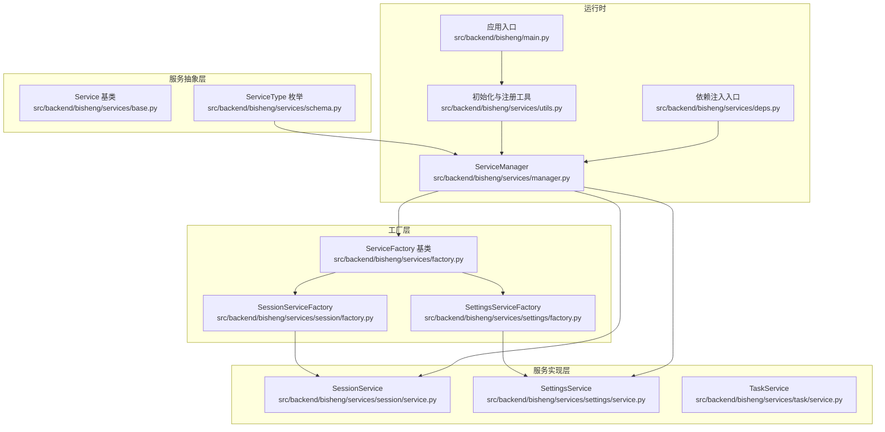
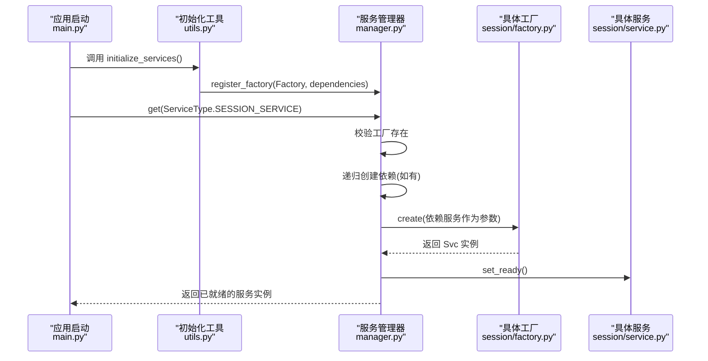
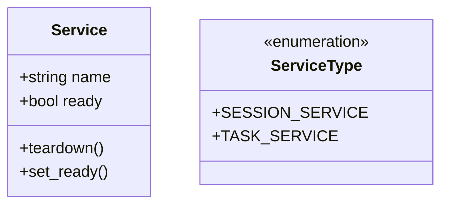
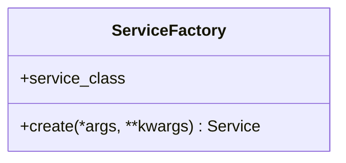
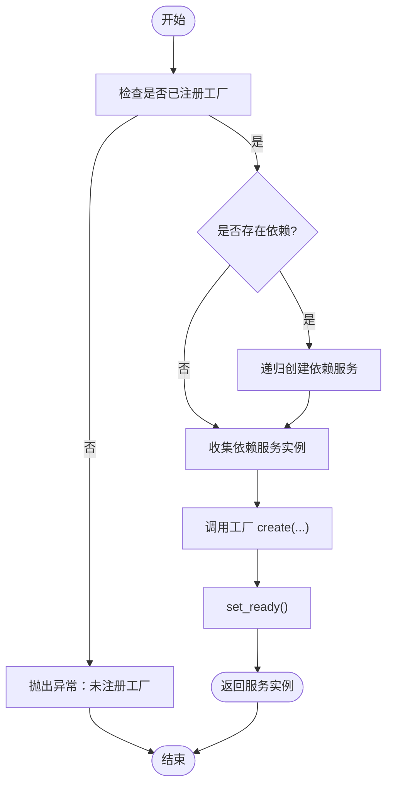
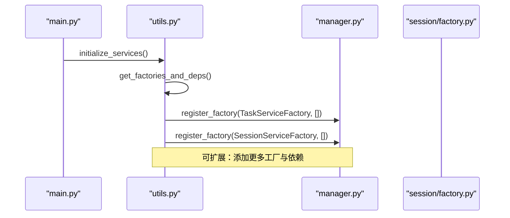
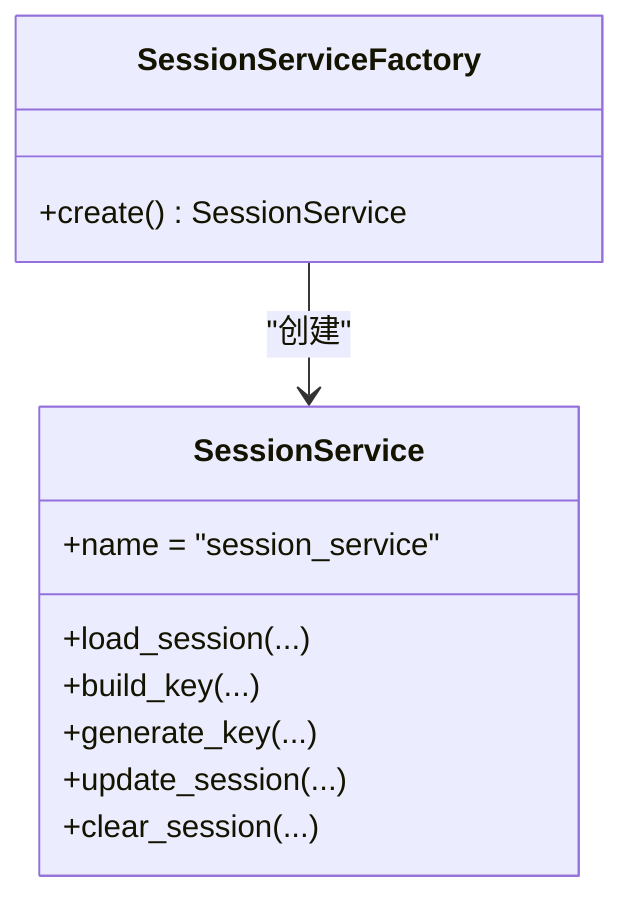
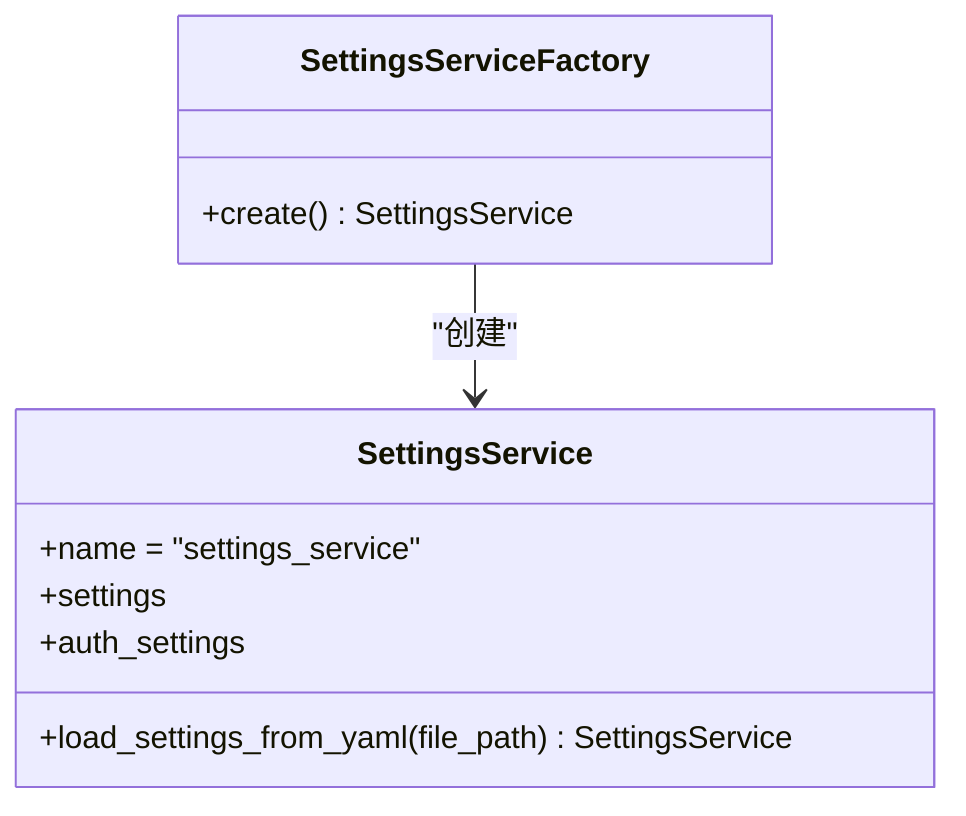
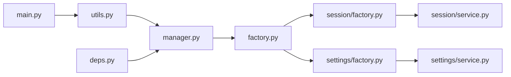

# 服务工厂模式

<cite>
**本文引用的文件**
- [src/backend/bisheng/services/factory.py](file://src/backend/bisheng/services/factory.py)
- [src/backend/bisheng/services/base.py](file://src/backend/bisheng/services/base.py)
- [src/backend/bisheng/services/schema.py](file://src/backend/bisheng/services/schema.py)
- [src/backend/bisheng/services/manager.py](file://src/backend/bisheng/services/manager.py)
- [src/backend/bisheng/services/utils.py](file://src/backend/bisheng/services/utils.py)
- [src/backend/bisheng/services/deps.py](file://src/backend/bisheng/services/deps.py)
- [src/backend/bisheng/services/session/service.py](file://src/backend/bisheng/services/session/service.py)
- [src/backend/bisheng/services/session/factory.py](file://src/backend/bisheng/services/session/factory.py)
- [src/backend/bisheng/services/task/service.py](file://src/backend/bisheng/services/task/service.py)
- [src/backend/bisheng/services/settings/service.py](file://src/backend/bisheng/services/settings/service.py)
- [src/backend/bisheng/services/settings/factory.py](file://src/backend/bisheng/services/settings/factory.py)
- [src/backend/bisheng/main.py](file://src/backend/bisheng/main.py)
</cite>

## 目录
1. [引言](#引言)
2. [项目结构](#项目结构)
3. [核心组件](#核心组件)
4. [架构总览](#架构总览)
5. [详细组件分析](#详细组件分析)
6. [依赖关系分析](#依赖关系分析)
7. [性能考量](#性能考量)
8. [故障排查指南](#故障排查指南)
9. [结论](#结论)
10. [附录](#附录)

## 引言
本文件系统性阐述 Bisheng 的“服务工厂模式”，围绕工厂方法模式与依赖注入机制展开，重点说明：
- 工厂类的实现架构：服务注册、实例化与生命周期管理
- 服务接口的抽象设计：基类定义与服务契约
- 工厂模式在服务层解耦中的作用：动态创建与替换能力
- 使用方式示例：服务注册、获取与配置流程
- 对系统可扩展性与可测试性的贡献

## 项目结构
Bisheng 的服务层采用“抽象基类 + 工厂 + 管理器”的分层组织方式：
- 抽象基类与枚举：定义服务契约与类型标识
- 工厂基类：约束具体工厂的创建行为
- 具体服务：实现业务功能
- 工厂实现：封装服务实例化细节
- 管理器：集中注册与按需创建服务，处理依赖顺序
- 初始化工具：批量注册工厂与依赖
- 依赖注入入口：对外暴露便捷获取函数

图表来源
- [src/backend/bisheng/services/base.py](file://src/backend/bisheng/services/base.py#L1-L13)
- [src/backend/bisheng/services/schema.py](file://src/backend/bisheng/services/schema.py#L1-L20)
- [src/backend/bisheng/services/factory.py](file://src/backend/bisheng/services/factory.py#L1-L14)
- [src/backend/bisheng/services/session/factory.py](file://src/backend/bisheng/services/session/factory.py)
- [src/backend/bisheng/services/settings/factory.py](file://src/backend/bisheng/services/settings/factory.py#L1-L14)
- [src/backend/bisheng/services/session/service.py](file://src/backend/bisheng/services/session/service.py#L1-L50)
- [src/backend/bisheng/services/settings/service.py](file://src/backend/bisheng/services/settings/service.py#L1-L44)
- [src/backend/bisheng/services/task/service.py](file://src/backend/bisheng/services/task/service.py#L1-L74)
- [src/backend/bisheng/services/manager.py](file://src/backend/bisheng/services/manager.py#L1-L149)
- [src/backend/bisheng/services/utils.py](file://src/backend/bisheng/services/utils.py#L1-L208)
- [src/backend/bisheng/services/deps.py](file://src/backend/bisheng/services/deps.py#L1-L50)
- [src/backend/bisheng/main.py](file://src/backend/bisheng/main.py#L1-L113)

章节来源
- [src/backend/bisheng/services/base.py](file://src/backend/bisheng/services/base.py#L1-L13)
- [src/backend/bisheng/services/schema.py](file://src/backend/bisheng/services/schema.py#L1-L20)
- [src/backend/bisheng/services/factory.py](file://src/backend/bisheng/services/factory.py#L1-L14)
- [src/backend/bisheng/services/manager.py](file://src/backend/bisheng/services/manager.py#L1-L149)
- [src/backend/bisheng/services/utils.py](file://src/backend/bisheng/services/utils.py#L1-L208)
- [src/backend/bisheng/services/deps.py](file://src/backend/bisheng/services/deps.py#L1-L50)
- [src/backend/bisheng/main.py](file://src/backend/bisheng/main.py#L1-L113)

## 核心组件
- 服务基类 Service：定义服务名称与就绪状态标记，提供统一的生命周期钩子（如 set_ready）与可选的 teardown 钩子。
- 服务类型枚举 ServiceType：以强类型枚举标识不同服务，便于管理器进行注册与检索。
- 工厂基类 ServiceFactory：定义 create 接口，约束具体工厂的实例化行为。
- 服务管理器 ServiceManager：负责工厂注册、依赖解析、服务创建与缓存、更新与销毁。
- 初始化工具 initialize_services：集中注册可用工厂及其依赖。
- 依赖注入入口：提供 get_* 函数，简化外部对服务的获取。

章节来源
- [src/backend/bisheng/services/base.py](file://src/backend/bisheng/services/base.py#L1-L13)
- [src/backend/bisheng/services/schema.py](file://src/backend/bisheng/services/schema.py#L1-L20)
- [src/backend/bisheng/services/factory.py](file://src/backend/bisheng/services/factory.py#L1-L14)
- [src/backend/bisheng/services/manager.py](file://src/backend/bisheng/services/manager.py#L1-L149)
- [src/backend/bisheng/services/utils.py](file://src/backend/bisheng/services/utils.py#L1-L208)
- [src/backend/bisheng/services/deps.py](file://src/backend/bisheng/services/deps.py#L1-L50)

## 架构总览
工厂模式在 Bisheng 中体现为“抽象工厂 + 具体工厂 + 具体服务 + 管理器”的协作架构。管理器承担以下职责：
- 注册阶段：接收工厂与依赖列表，建立映射关系
- 获取阶段：按需创建服务，先递归创建依赖，再调用对应工厂的 create 方法
- 更新阶段：移除旧实例并重新创建，保证配置变更生效
- 销毁阶段：在应用生命周期结束时统一 teardown

图表来源
- [src/backend/bisheng/main.py](file://src/backend/bisheng/main.py#L52-L61)
- [src/backend/bisheng/services/utils.py](file://src/backend/bisheng/services/utils.py#L182-L192)
- [src/backend/bisheng/services/manager.py](file://src/backend/bisheng/services/manager.py#L21-L64)
- [src/backend/bisheng/services/session/factory.py](file://src/backend/bisheng/services/session/factory.py)
- [src/backend/bisheng/services/session/service.py](file://src/backend/bisheng/services/session/service.py#L1-L50)

## 详细组件分析

### 抽象与契约：Service 与 ServiceType
- Service 抽象基类：约定服务名称字段与就绪状态，提供 set_ready 与可覆盖的 teardown 钩子，确保所有服务具备一致的生命周期管理接口。
- ServiceType 枚举：以字符串枚举标识服务类型，避免魔法字符串，提升类型安全与可维护性。

图表来源
- [src/backend/bisheng/services/base.py](file://src/backend/bisheng/services/base.py#L1-L13)
- [src/backend/bisheng/services/schema.py](file://src/backend/bisheng/services/schema.py#L1-L20)

章节来源
- [src/backend/bisheng/services/base.py](file://src/backend/bisheng/services/base.py#L1-L13)
- [src/backend/bisheng/services/schema.py](file://src/backend/bisheng/services/schema.py#L1-L20)

### 工厂基类：ServiceFactory
- 角色定位：定义 create 接口，要求具体工厂返回 Service 实例
- 关键点：持有 service_class（用于管理器注册时识别服务名）

图表来源
- [src/backend/bisheng/services/factory.py](file://src/backend/bisheng/services/factory.py#L1-L14)

章节来源
- [src/backend/bisheng/services/factory.py](file://src/backend/bisheng/services/factory.py#L1-L14)

### 管理器：ServiceManager
- 注册 register_factory：将工厂与依赖列表绑定，键为服务名（来自 service_class.name）
- 获取 get：若未创建则触发创建流程；否则直接返回缓存实例
- 创建 _create_service：校验工厂存在 → 递归创建依赖 → 收集依赖服务实例 → 调用工厂 create 并标记就绪
- 更新 update：删除旧实例后重新获取，实现配置热替换
- 错误处理：当无对应工厂时抛出明确异常

图表来源
- [src/backend/bisheng/services/manager.py](file://src/backend/bisheng/services/manager.py#L44-L64)

章节来源
- [src/backend/bisheng/services/manager.py](file://src/backend/bisheng/services/manager.py#L1-L149)

### 初始化与注册：initialize_services 与工厂清单
- get_factories_and_deps：集中声明可用工厂及依赖关系，当前包含任务服务与会话服务工厂
- initialize_services：遍历工厂清单，逐个注册到管理器
- 会话服务初始化：通过 utils 中的 initialize_session_service 将 SessionServiceFactory 注册到管理器

图表来源
- [src/backend/bisheng/main.py](file://src/backend/bisheng/main.py#L52-L61)
- [src/backend/bisheng/services/utils.py](file://src/backend/bisheng/services/utils.py#L8-L43)
- [src/backend/bisheng/services/utils.py](file://src/backend/bisheng/services/utils.py#L182-L192)
- [src/backend/bisheng/services/utils.py](file://src/backend/bisheng/services/utils.py#L165-L179)

章节来源
- [src/backend/bisheng/services/utils.py](file://src/backend/bisheng/services/utils.py#L1-L208)
- [src/backend/bisheng/services/manager.py](file://src/backend/bisheng/services/manager.py#L21-L33)

### 依赖注入入口：deps.py
- 提供 get_session_service、get_task_service 等便捷函数，内部通过 service_manager.get 获取服务实例
- 作用：降低上层模块对管理器的直接依赖，遵循依赖倒置原则

章节来源
- [src/backend/bisheng/services/deps.py](file://src/backend/bisheng/services/deps.py#L1-L50)

### 具体服务与工厂示例

#### 会话服务：SessionService 与 SessionServiceFactory
- SessionService：负责会话图构建、缓存读写与键生成等逻辑
- SessionServiceFactory：继承自 ServiceFactory，实现 create 以构造 SessionService 实例

图表来源
- [src/backend/bisheng/services/session/factory.py](file://src/backend/bisheng/services/session/factory.py)
- [src/backend/bisheng/services/session/service.py](file://src/backend/bisheng/services/session/service.py#L1-L50)

章节来源
- [src/backend/bisheng/services/session/service.py](file://src/backend/bisheng/services/session/service.py#L1-L50)
- [src/backend/bisheng/services/session/factory.py](file://src/backend/bisheng/services/session/factory.py)

#### 设置服务：SettingsService 与 SettingsServiceFactory
- SettingsService：从 YAML 加载配置，校验必要字段，组合设置对象与认证设置
- SettingsServiceFactory：继承自 ServiceFactory，实现 create 以加载并返回 SettingsService 实例

图表来源
- [src/backend/bisheng/services/settings/factory.py](file://src/backend/bisheng/services/settings/factory.py#L1-L14)
- [src/backend/bisheng/services/settings/service.py](file://src/backend/bisheng/services/settings/service.py#L1-L44)

章节来源
- [src/backend/bisheng/services/settings/service.py](file://src/backend/bisheng/services/settings/service.py#L1-L44)
- [src/backend/bisheng/services/settings/factory.py](file://src/backend/bisheng/services/settings/factory.py#L1-L14)

#### 任务服务：TaskService
- TaskService：根据可用性选择后端（AnyIO 或 Celery），提供任务启动与等待、查询等能力
- 该服务不直接暴露工厂类，而是通过工厂注册与管理器创建

章节来源
- [src/backend/bisheng/services/task/service.py](file://src/backend/bisheng/services/task/service.py#L1-L74)

## 依赖关系分析
- 组件内聚与耦合
  - 管理器与工厂：通过工厂类名与依赖列表解耦，新增服务只需提供工厂即可
  - 服务与工厂：通过工厂基类约束，服务实现无需关心创建细节
  - 外部依赖：SessionService 依赖缓存客户端；TaskService 依据可用性选择后端
- 直接与间接依赖
  - 初始化工具集中导入各工厂并注册
  - 依赖注入入口仅依赖管理器，不直接依赖具体工厂或服务
- 循环依赖风险
  - 当前结构通过管理器集中调度，避免了工厂与服务之间的循环引用

图表来源
- [src/backend/bisheng/services/utils.py](file://src/backend/bisheng/services/utils.py#L8-L43)
- [src/backend/bisheng/services/manager.py](file://src/backend/bisheng/services/manager.py#L16-L33)
- [src/backend/bisheng/services/factory.py](file://src/backend/bisheng/services/factory.py#L1-L14)
- [src/backend/bisheng/services/session/factory.py](file://src/backend/bisheng/services/session/factory.py)
- [src/backend/bisheng/services/settings/factory.py](file://src/backend/bisheng/services/settings/factory.py#L1-L14)
- [src/backend/bisheng/services/session/service.py](file://src/backend/bisheng/services/session/service.py#L1-L50)
- [src/backend/bisheng/services/settings/service.py](file://src/backend/bisheng/services/settings/service.py#L1-L44)
- [src/backend/bisheng/services/deps.py](file://src/backend/bisheng/services/deps.py#L1-L50)
- [src/backend/bisheng/main.py](file://src/backend/bisheng/main.py#L52-L61)

章节来源
- [src/backend/bisheng/services/utils.py](file://src/backend/bisheng/services/utils.py#L1-L208)
- [src/backend/bisheng/services/manager.py](file://src/backend/bisheng/services/manager.py#L1-L149)
- [src/backend/bisheng/services/deps.py](file://src/backend/bisheng/services/deps.py#L1-L50)
- [src/backend/bisheng/main.py](file://src/backend/bisheng/main.py#L1-L113)

## 性能考量
- 按需创建与缓存：管理器在首次请求时创建服务并缓存，后续 get 直接返回，避免重复实例化开销
- 依赖拓扑排序：通过递归创建依赖，确保前置服务就绪后再创建当前服务，减少运行期错误
- 后端选择策略：TaskService 在不可用时自动回退至轻量级后端，保障系统稳定性
- 建议
  - 对于高并发场景，建议在应用启动阶段预热关键服务，减少首次请求延迟
  - 对外部依赖（如缓存、数据库）增加连接池与健康检查，配合管理器的 teardown 进行资源回收

## 故障排查指南
- 未注册工厂
  - 现象：获取服务时报错提示未注册对应工厂
  - 排查：确认 initialize_services 是否已注册目标工厂；检查工厂与服务名是否匹配
- 依赖缺失
  - 现象：创建服务时因缺少依赖而失败
  - 排查：核对 get_factories_and_deps 中的依赖列表；确保被依赖服务优先注册
- 配置错误
  - 现象：SettingsService 加载失败或缺少必要字段
  - 排查：检查配置文件路径与键名；确保 CONFIG_DIR 等关键字段存在
- 生命周期问题
  - 现象：服务未就绪或资源未释放
  - 排查：确认管理器在应用关闭时调用 teardown；服务实现中正确覆盖 teardown

章节来源
- [src/backend/bisheng/services/manager.py](file://src/backend/bisheng/services/manager.py#L66-L71)
- [src/backend/bisheng/services/settings/service.py](file://src/backend/bisheng/services/settings/service.py#L37-L38)
- [src/backend/bisheng/services/utils.py](file://src/backend/bisheng/services/utils.py#L142-L153)

## 结论
Bisheng 的服务工厂模式通过抽象基类、工厂基类与管理器的协同，实现了服务的标准化创建、依赖管理与生命周期控制。该模式显著提升了系统的可扩展性（新增服务只需提供工厂）、可测试性（可通过替换工厂或注入替身服务）与可维护性（集中注册与按需创建）。结合依赖注入入口与应用生命周期钩子，整体架构在保持清晰职责边界的同时，提供了灵活的动态替换能力。

## 附录

### 使用示例（步骤说明）
- 注册服务工厂
  - 在初始化阶段调用注册函数，传入工厂实例与依赖列表
  - 示例路径参考：[注册工厂与依赖](file://src/backend/bisheng/services/utils.py#L8-L43)
- 获取服务实例
  - 通过依赖注入入口函数获取服务，内部由管理器完成创建与缓存
  - 示例路径参考：[依赖注入入口](file://src/backend/bisheng/services/deps.py#L38-L43)
- 应用生命周期集成
  - 在应用启动与关闭阶段分别调用初始化与销毁流程
  - 示例路径参考：[应用生命周期钩子](file://src/backend/bisheng/main.py#L52-L61)

### 扩展新服务的步骤
- 定义服务类：继承 Service，实现业务逻辑与必要的生命周期方法
  - 示例路径参考：[服务基类](file://src/backend/bisheng/services/base.py#L1-L13)
- 编写工厂类：继承 ServiceFactory，实现 create 返回服务实例
  - 示例路径参考：[工厂基类](file://src/backend/bisheng/services/factory.py#L1-L14)
- 在工厂清单中注册
  - 将新工厂加入工厂清单并声明依赖
  - 示例路径参考：[工厂清单与注册](file://src/backend/bisheng/services/utils.py#L8-L43)
- 通过依赖注入使用
  - 新增对应的 get_* 函数或直接使用管理器获取
  - 示例路径参考：[依赖注入入口](file://src/backend/bisheng/services/deps.py#L1-L50)