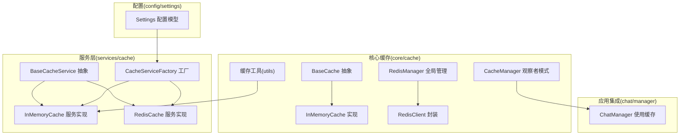
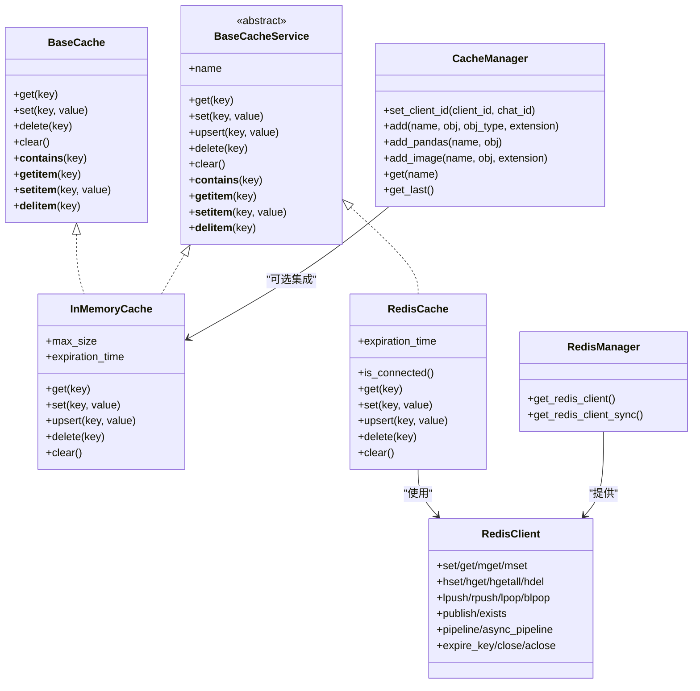
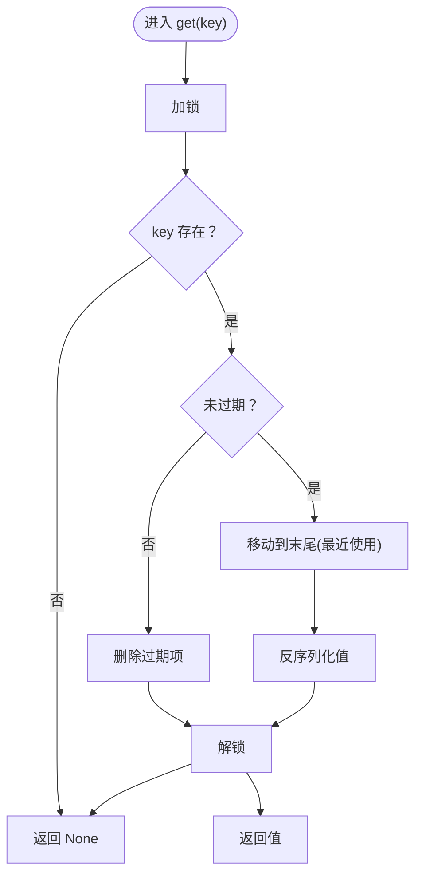
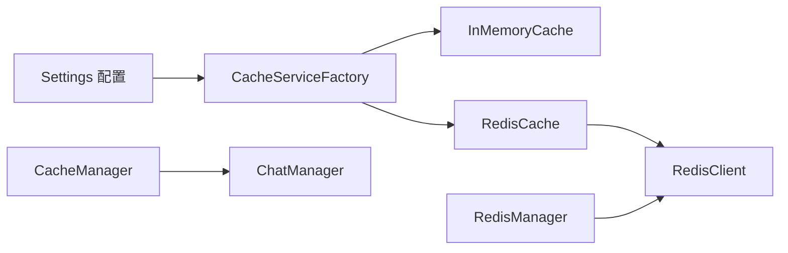

# 缓存服务

<cite>
**本文引用的文件**
- [src/backend/bisheng/core/cache/base.py](file://src/backend/bisheng/core/cache/base.py)
- [src/backend/bisheng/core/cache/flow.py](file://src/backend/bisheng/core/cache/flow.py)
- [src/backend/bisheng/core/cache/manager.py](file://src/backend/bisheng/core/cache/manager.py)
- [src/backend/bisheng/core/cache/redis_conn.py](file://src/backend/bisheng/core/cache/redis_conn.py)
- [src/backend/bisheng/core/cache/redis_manager.py](file://src/backend/bisheng/core/cache/redis_manager.py)
- [src/backend/bisheng/core/cache/utils.py](file://src/backend/bisheng/core/cache/utils.py)
- [src/backend/bisheng/services/cache/base.py](file://src/backend/bisheng/services/cache/base.py)
- [src/backend/bisheng/services/cache/service.py](file://src/backend/bisheng/services/cache/service.py)
- [src/backend/bisheng/services/cache/factory.py](file://src/backend/bisheng/services/cache/factory.py)
- [src/backend/bisheng/core/config/settings.py](file://src/backend/bisheng/core/config/settings.py)
- [src/backend/bisheng/chat/manager.py](file://src/backend/bisheng/chat/manager.py)
- [docker/redis/redis.conf](file://docker/redis/redis.conf)
</cite>

## 目录
1. [简介](#简介)
2. [项目结构](#项目结构)
3. [核心组件](#核心组件)
4. [架构总览](#架构总览)
5. [详细组件分析](#详细组件分析)
6. [依赖关系分析](#依赖关系分析)
7. [性能考量](#性能考量)
8. [故障排查指南](#故障排查指南)
9. [结论](#结论)
10. [附录：使用示例与最佳实践](#附录使用示例与最佳实践)

## 简介
本文件系统性梳理 Bisheng 的缓存服务，覆盖缓存策略（内存 LRU、过期淘汰）、数据存储与失效机制、配置项（缓存类型、过期时间、连接池等）、接口抽象（读写、批量、事务）、性能优化（降低数据库负载）、一致性与并发控制，并给出可操作的使用示例与最佳实践。

## 项目结构
缓存相关代码主要分布在以下模块：
- 核心层（core/cache）：定义缓存抽象、内存缓存实现、Redis 客户端封装、全局 Redis 管理器、客户端上下文管理、通用缓存工具
- 服务层（services/cache）：面向业务的服务抽象与具体实现（内存/Redis），工厂按配置动态选择
- 配置层（core/config/settings.py）：集中式配置，包含缓存类型、Redis 连接参数、过期时间等
- 应用集成（chat/manager.py）：在聊天场景中结合缓存与观察者模式进行对象缓存与消息推送

图示来源
- [src/backend/bisheng/core/cache/base.py](file://src/backend/bisheng/core/cache/base.py#L1-L85)
- [src/backend/bisheng/core/cache/flow.py](file://src/backend/bisheng/core/cache/flow.py#L1-L147)
- [src/backend/bisheng/core/cache/redis_conn.py](file://src/backend/bisheng/core/cache/redis_conn.py#L1-L515)
- [src/backend/bisheng/core/cache/redis_manager.py](file://src/backend/bisheng/core/cache/redis_manager.py#L1-L82)
- [src/backend/bisheng/core/cache/manager.py](file://src/backend/bisheng/core/cache/manager.py#L1-L156)
- [src/backend/bisheng/core/cache/utils.py](file://src/backend/bisheng/core/cache/utils.py#L1-L500)
- [src/backend/bisheng/services/cache/base.py](file://src/backend/bisheng/services/cache/base.py#L1-L99)
- [src/backend/bisheng/services/cache/service.py](file://src/backend/bisheng/services/cache/service.py#L1-L322)
- [src/backend/bisheng/services/cache/factory.py](file://src/backend/bisheng/services/cache/factory.py#L1-L34)
- [src/backend/bisheng/core/config/settings.py](file://src/backend/bisheng/core/config/settings.py#L210-L346)
- [src/backend/bisheng/chat/manager.py](file://src/backend/bisheng/chat/manager.py#L86-L113)

章节来源
- [src/backend/bisheng/core/cache/base.py](file://src/backend/bisheng/core/cache/base.py#L1-L85)
- [src/backend/bisheng/services/cache/base.py](file://src/backend/bisheng/services/cache/base.py#L1-L99)
- [src/backend/bisheng/services/cache/service.py](file://src/backend/bisheng/services/cache/service.py#L1-L322)
- [src/backend/bisheng/services/cache/factory.py](file://src/backend/bisheng/services/cache/factory.py#L1-L34)
- [src/backend/bisheng/core/cache/redis_conn.py](file://src/backend/bisheng/core/cache/redis_conn.py#L1-L515)
- [src/backend/bisheng/core/cache/redis_manager.py](file://src/backend/bisheng/core/cache/redis_manager.py#L1-L82)
- [src/backend/bisheng/core/cache/manager.py](file://src/backend/bisheng/core/cache/manager.py#L1-L156)
- [src/backend/bisheng/core/cache/utils.py](file://src/backend/bisheng/core/cache/utils.py#L1-L500)
- [src/backend/bisheng/core/config/settings.py](file://src/backend/bisheng/core/config/settings.py#L210-L346)
- [src/backend/bisheng/chat/manager.py](file://src/backend/bisheng/chat/manager.py#L86-L113)

## 核心组件
- 缓存抽象
  - 核心层：BaseCache 抽象定义 get/set/delete/clear 及容器协议方法
  - 服务层：BaseCacheService 抽象扩展 upsert 并统一服务命名
- 内存缓存
  - InMemoryCache：基于有序字典实现 LRU，支持最大容量与过期时间；线程安全锁保护
- Redis 缓存
  - RedisClient：封装同步/异步连接、单机/哨兵/集群模式、序列化与批量操作、管道
  - RedisCache：基于 RedisClient 的服务实现，支持过期时间与连接检测
  - RedisManager：全局生命周期管理，提供同步/异步获取客户端
- 缓存管理器
  - CacheManager：按客户端与会话维度隔离缓存，支持观察者通知
- 工厂与配置
  - CacheServiceFactory：根据 Settings 动态创建内存或 Redis 缓存实例
  - Settings：集中配置缓存类型、Redis 地址、过期时间等

章节来源
- [src/backend/bisheng/core/cache/base.py](file://src/backend/bisheng/core/cache/base.py#L1-L85)
- [src/backend/bisheng/services/cache/base.py](file://src/backend/bisheng/services/cache/base.py#L1-L99)
- [src/backend/bisheng/core/cache/flow.py](file://src/backend/bisheng/core/cache/flow.py#L1-L147)
- [src/backend/bisheng/services/cache/service.py](file://src/backend/bisheng/services/cache/service.py#L1-L322)
- [src/backend/bisheng/core/cache/redis_conn.py](file://src/backend/bisheng/core/cache/redis_conn.py#L1-L515)
- [src/backend/bisheng/core/cache/redis_manager.py](file://src/backend/bisheng/core/cache/redis_manager.py#L1-L82)
- [src/backend/bisheng/core/cache/manager.py](file://src/backend/bisheng/core/cache/manager.py#L1-L156)
- [src/backend/bisheng/services/cache/factory.py](file://src/backend/bisheng/services/cache/factory.py#L1-L34)
- [src/backend/bisheng/core/config/settings.py](file://src/backend/bisheng/core/config/settings.py#L210-L346)

## 架构总览
缓存服务采用“抽象接口 + 多实现 + 工厂选择 + 配置驱动”的分层设计。核心层提供统一抽象，服务层提供业务可用的缓存服务，工厂根据配置选择具体实现，Redis 客户端由全局管理器统一提供。

图示来源
- [src/backend/bisheng/core/cache/base.py](file://src/backend/bisheng/core/cache/base.py#L1-L85)
- [src/backend/bisheng/services/cache/base.py](file://src/backend/bisheng/services/cache/base.py#L1-L99)
- [src/backend/bisheng/core/cache/flow.py](file://src/backend/bisheng/core/cache/flow.py#L1-L147)
- [src/backend/bisheng/services/cache/service.py](file://src/backend/bisheng/services/cache/service.py#L1-L322)
- [src/backend/bisheng/core/cache/redis_conn.py](file://src/backend/bisheng/core/cache/redis_conn.py#L1-L515)
- [src/backend/bisheng/core/cache/redis_manager.py](file://src/backend/bisheng/core/cache/redis_manager.py#L1-L82)
- [src/backend/bisheng/core/cache/manager.py](file://src/backend/bisheng/core/cache/manager.py#L1-L156)

## 详细组件分析

### 缓存抽象与接口
- 核心抽象 BaseCache：定义标准缓存接口，确保不同实现的一致行为
- 服务抽象 BaseCacheService：在核心抽象基础上增加 upsert，并统一服务命名，便于工厂与依赖注入

章节来源
- [src/backend/bisheng/core/cache/base.py](file://src/backend/bisheng/core/cache/base.py#L1-L85)
- [src/backend/bisheng/services/cache/base.py](file://src/backend/bisheng/services/cache/base.py#L1-L99)

### 内存缓存 InMemoryCache
- 设计要点
  - 基于有序字典实现 LRU 淘汰，线程安全通过可重入锁保护
  - 支持最大容量与过期时间；过期检查在访问时触发
  - 提供 upsert 合并字典的能力
- 关键流程（访问）

图示来源
- [src/backend/bisheng/core/cache/flow.py](file://src/backend/bisheng/core/cache/flow.py#L47-L80)
- [src/backend/bisheng/services/cache/service.py](file://src/backend/bisheng/services/cache/service.py#L51-L80)

章节来源
- [src/backend/bisheng/core/cache/flow.py](file://src/backend/bisheng/core/cache/flow.py#L1-L147)
- [src/backend/bisheng/services/cache/service.py](file://src/backend/bisheng/services/cache/service.py#L1-L180)

### Redis 缓存与客户端
- RedisClient
  - 支持单机、哨兵、集群三种模式，自动选择主节点或集群节点
  - 提供同步/异步 set/get/mget/mset、哈希、列表、发布订阅等常用操作
  - 批量与管道：mset/mget、pipeline/async_pipeline 提升吞吐
  - 键空间过期：支持 expire_key 与主动过期策略
- RedisCache
  - 基于 RedisClient 的服务实现，支持连接检测与过期时间
  - upsert 合并字典，set 自动序列化
- RedisManager
  - 全局生命周期管理，提供同步/异步获取客户端
  - 从配置中心读取 redis_url，支持字符串或字典（哨兵/集群）

章节来源
- [src/backend/bisheng/core/cache/redis_conn.py](file://src/backend/bisheng/core/cache/redis_conn.py#L1-L515)
- [src/backend/bisheng/services/cache/service.py](file://src/backend/bisheng/services/cache/service.py#L182-L322)
- [src/backend/bisheng/core/cache/redis_manager.py](file://src/backend/bisheng/core/cache/redis_manager.py#L1-L82)

### 缓存管理器与观察者模式
- CacheManager
  - 按 client_id 与 chat_id 维度隔离缓存，支持上下文切换
  - 提供 add/add_pandas/add_image 等便捷方法，记录对象类型与扩展名
  - 通过观察者模式通知订阅者缓存变更，用于实时推送
- 应用集成
  - ChatManager 订阅 CacheManager，当有新缓存对象时生成文件响应并写入历史

章节来源
- [src/backend/bisheng/core/cache/manager.py](file://src/backend/bisheng/core/cache/manager.py#L1-L156)
- [src/backend/bisheng/chat/manager.py](file://src/backend/bisheng/chat/manager.py#L86-L113)

### 工厂与配置
- CacheServiceFactory
  - 根据 Settings 中的 CACHE_TYPE 选择 Redis 或内存缓存
  - Redis 模式下尝试连接，失败则回退内存缓存
- Settings
  - 包含 cache 字段（默认 InMemoryCache）、redis_url、celery_redis_url、过期时间等
  - 支持从环境变量解析加密密码与连接串

章节来源
- [src/backend/bisheng/services/cache/factory.py](file://src/backend/bisheng/services/cache/factory.py#L1-L34)
- [src/backend/bisheng/core/config/settings.py](file://src/backend/bisheng/core/config/settings.py#L210-L346)

## 依赖关系分析
- 耦合与内聚
  - 服务层对核心抽象依赖，实现解耦；Redis 客户端封装独立，便于替换
  - 工厂仅依赖 Settings 与抽象接口，降低外部依赖耦合
- 外部依赖
  - Redis 客户端库、异步 Redis 客户端库、连接池与重试机制
- 潜在循环依赖
  - 无直接循环；观察者回调在应用层使用，避免缓存层反向依赖

图示来源
- [src/backend/bisheng/services/cache/factory.py](file://src/backend/bisheng/services/cache/factory.py#L1-L34)
- [src/backend/bisheng/core/cache/redis_manager.py](file://src/backend/bisheng/core/cache/redis_manager.py#L1-L82)
- [src/backend/bisheng/core/cache/manager.py](file://src/backend/bisheng/core/cache/manager.py#L1-L156)
- [src/backend/bisheng/chat/manager.py](file://src/backend/bisheng/chat/manager.py#L86-L113)

章节来源
- [src/backend/bisheng/services/cache/factory.py](file://src/backend/bisheng/services/cache/factory.py#L1-L34)
- [src/backend/bisheng/core/cache/redis_manager.py](file://src/backend/bisheng/core/cache/redis_manager.py#L1-L82)
- [src/backend/bisheng/core/cache/manager.py](file://src/backend/bisheng/core/cache/manager.py#L1-L156)
- [src/backend/bisheng/chat/manager.py](file://src/backend/bisheng/chat/manager.py#L86-L113)

## 性能考量
- 内存缓存
  - LRU 淘汰 + 过期检查，适合高并发读取与低延迟场景
  - 注意 max_size 与 expiration_time 的权衡，避免频繁淘汰与过期扫描开销
- Redis 缓存
  - 批量与管道显著提升吞吐；键空间过期与主动过期策略平衡内存占用与 CPU
  - 连接池与重试机制降低网络抖动影响
- 降数据库负载
  - 对热点查询结果、会话元数据、中间计算结果进行缓存，减少重复查询
  - 结合 upsert 合并更新，降低写放大

[本节为通用指导，无需列出章节来源]

## 故障排查指南
- Redis 连接失败
  - 检查 RedisManager 初始化是否成功，确认 redis_url 配置正确
  - 若连接异常，工厂会回退到内存缓存，确认日志提示
- 序列化问题
  - Redis 客户端仅接受可 pickle 的值；确保写入对象可被序列化
- 过期与淘汰
  - 内存缓存过期在访问时触发；如出现“命中但为空”，检查过期时间设置
  - Redis 主动过期策略可通过配置调整，避免过多已过期键滞留
- 观察者未触发
  - 确认 CacheManager 的 attach 是否正确调用，以及上下文 set_client_id 是否生效

章节来源
- [src/backend/bisheng/services/cache/service.py](file://src/backend/bisheng/services/cache/service.py#L216-L228)
- [src/backend/bisheng/core/cache/redis_conn.py](file://src/backend/bisheng/core/cache/redis_conn.py#L57-L70)
- [src/backend/bisheng/core/cache/manager.py](file://src/backend/bisheng/core/cache/manager.py#L15-L29)
- [src/backend/bisheng/services/cache/factory.py](file://src/backend/bisheng/services/cache/factory.py#L27-L31)

## 结论
Bisheng 缓存服务以抽象统一接口、多实现灵活切换为核心，结合工厂与配置驱动，既满足本地开发的内存缓存需求，又可在生产环境无缝对接 Redis。通过 LRU、过期与批量/管道等机制，有效降低数据库负载并提升响应性能。配合观察者模式与上下文隔离，满足多客户端与会话场景下的缓存一致性与并发安全。

[本节为总结性内容，无需列出章节来源]

## 附录：使用示例与最佳实践

### 配置选项
- 缓存类型
  - 设置项：cache（默认 InMemoryCache）
  - 可选：内存或 Redis
- Redis 连接
  - redis_url：支持字符串或字典（哨兵/集群）
  - 过期时间：统一的 expiration_time 控制缓存有效期
- 其他
  - 最大容量：内存缓存 max_size 控制 LRU 容量
  - 连接池：Redis 客户端内置连接池与异步连接池

章节来源
- [src/backend/bisheng/core/config/settings.py](file://src/backend/bisheng/core/config/settings.py#L241-L241)
- [src/backend/bisheng/core/config/settings.py](file://src/backend/bisheng/core/config/settings.py#L237-L239)
- [src/backend/bisheng/services/cache/service.py](file://src/backend/bisheng/services/cache/service.py#L38-L49)
- [src/backend/bisheng/core/cache/redis_conn.py](file://src/backend/bisheng/core/cache/redis_conn.py#L52-L55)

### 接口与抽象
- 读写操作
  - get/set/upsert/delete/clear
  - 容器协议：__getitem__/__setitem__/__delitem__/__contains__
- 批量与事务
  - mset/mget：批量写入与读取
  - pipeline/async_pipeline：事务/流水线执行
- 会话与对象缓存
  - CacheManager 提供按 client_id 与 chat_id 的隔离缓存
  - add_pandas/add_image 等便捷方法，自动处理类型与扩展名

章节来源
- [src/backend/bisheng/core/cache/base.py](file://src/backend/bisheng/core/cache/base.py#L9-L84)
- [src/backend/bisheng/services/cache/base.py](file://src/backend/bisheng/services/cache/base.py#L13-L98)
- [src/backend/bisheng/core/cache/redis_conn.py](file://src/backend/bisheng/core/cache/redis_conn.py#L135-L173)
- [src/backend/bisheng/core/cache/manager.py](file://src/backend/bisheng/core/cache/manager.py#L83-L131)

### 使用示例（概念性步骤）
- 数据缓存
  - 读取：cache.get(key)
  - 写入：cache.set(key, value, expiration=秒)
  - 批量：mset/mget 或 pipeline
- 查询结果缓存
  - 将查询结果序列化后写入 Redis，设置合理过期时间
  - 读取时先命中缓存，未命中再查询数据库并回填
- 会话数据缓存
  - 使用 CacheManager 的 set_client_id 上下文，按会话隔离缓存
  - 新增对象：add(name, obj, obj_type)，自动通知观察者

章节来源
- [src/backend/bisheng/core/cache/redis_conn.py](file://src/backend/bisheng/core/cache/redis_conn.py#L135-L194)
- [src/backend/bisheng/core/cache/manager.py](file://src/backend/bisheng/core/cache/manager.py#L63-L105)
- [src/backend/bisheng/chat/manager.py](file://src/backend/bisheng/chat/manager.py#L101-L113)

### 一致性与并发控制
- 并发安全
  - 内存缓存使用线程锁；Redis 客户端内部线程安全
- 一致性
  - Redis 过期键主动回收与访问时清理，避免脏读
  - 观察者模式在对象缓存变更时及时通知，保障前端状态一致

章节来源
- [src/backend/bisheng/core/cache/flow.py](file://src/backend/bisheng/core/cache/flow.py#L42-L45)
- [src/backend/bisheng/core/cache/redis_conn.py](file://src/backend/bisheng/core/cache/redis_conn.py#L334-L346)
- [src/backend/bisheng/core/cache/manager.py](file://src/backend/bisheng/core/cache/manager.py#L23-L28)