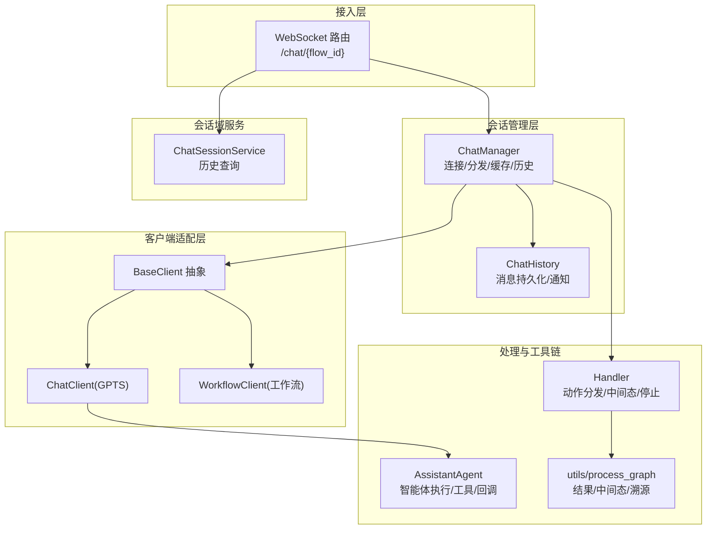
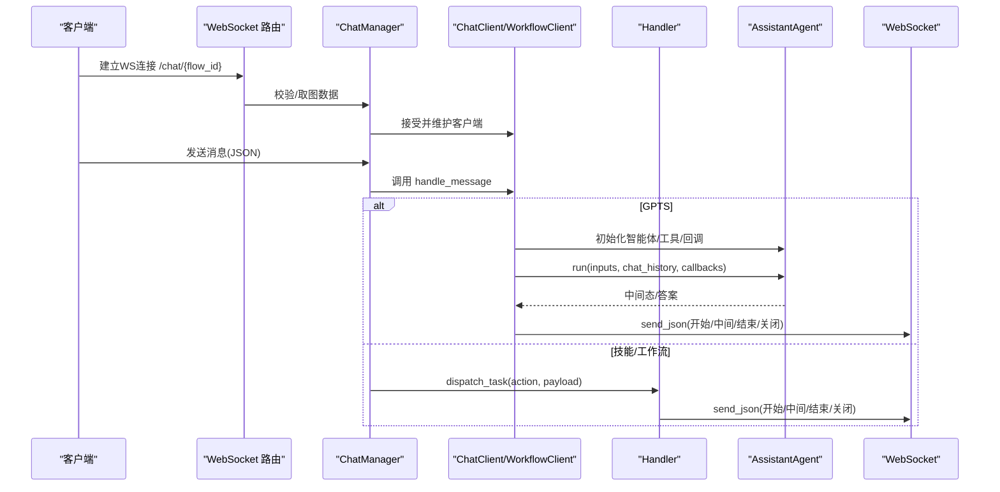
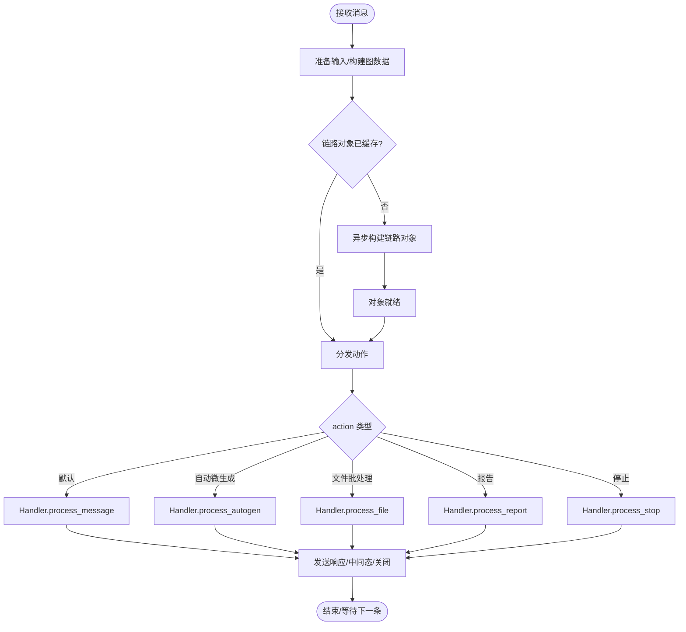
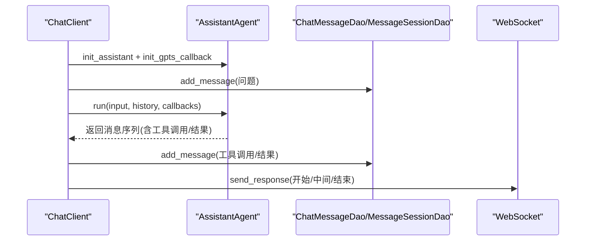
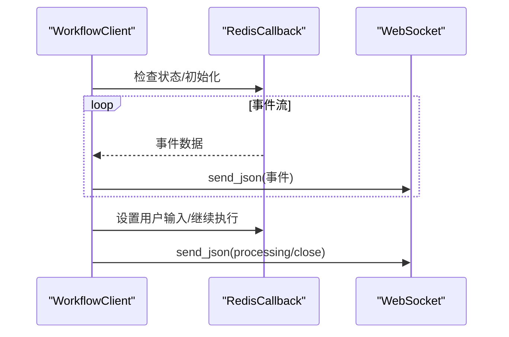
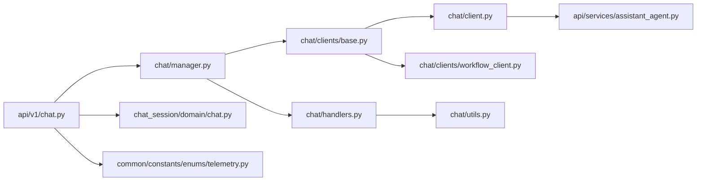

# 聊天服务

<cite>
**本文引用的文件**
- [src/backend/bisheng/chat/client.py](file://src/backend/bisheng/chat/client.py)
- [src/backend/bisheng/chat/clients/base.py](file://src/backend/bisheng/chat/clients/base.py)
- [src/backend/bisheng/chat/clients/workflow_client.py](file://src/backend/bisheng/chat/clients/workflow_client.py)
- [src/backend/bisheng/chat/handlers.py](file://src/backend/bisheng/chat/handlers.py)
- [src/backend/bisheng/chat/manager.py](file://src/backend/bisheng/chat/manager.py)
- [src/backend/bisheng/chat/types.py](file://src/backend/bisheng/chat/types.py)
- [src/backend/bisheng/chat/utils.py](file://src/backend/bisheng/chat/utils.py)
- [src/backend/bisheng/api/v1/chat.py](file://src/backend/bisheng/api/v1/chat.py)
- [src/backend/bisheng/api/services/assistant_agent.py](file://src/backend/bisheng/api/services/assistant_agent.py)
- [src/backend/bisheng/chat_session/domain/chat.py](file://src/backend/bisheng/chat_session/domain/chat.py)
- [src/backend/bisheng/api/v1/schema/chat_schema.py](file://src/backend/bisheng/api/v1/schema/chat_schema.py)
- [src/backend/bisheng/common/constants/enums/telemetry.py](file://src/backend/bisheng/common/constants/enums/telemetry.py)
- [docker/bisheng/config/config.yaml](file://docker/bisheng/config/config.yaml)
</cite>

## 目录
1. [简介](#简介)
2. [项目结构](#项目结构)
3. [核心组件](#核心组件)
4. [架构总览](#架构总览)
5. [详细组件分析](#详细组件分析)
6. [依赖关系分析](#依赖关系分析)
7. [性能考虑](#性能考虑)
8. [故障排查指南](#故障排查指南)
9. [结论](#结论)
10. [附录](#附录)

## 简介
本文件面向 Bisheng 的聊天服务，系统性阐述其架构设计、消息处理流程、会话管理与实时通信机制，并深入解析消息路由、状态同步与错误处理策略。同时，文档覆盖配置项（如消息保留策略、会话超时、并发限制）、与工作流引擎的集成方式、复杂聊天场景支持、扩展点（自定义消息处理器与第三方平台对接）、性能优化与大规模部署最佳实践。

## 项目结构
聊天服务由“API 接入层 → 会话管理器 → 客户端适配层 → 处理器与工具链”构成，辅以会话域服务与遥测埋点，形成完整的实时对话闭环。

图示来源
- [src/backend/bisheng/api/v1/chat.py](file://src/backend/bisheng/api/v1/chat.py#L510-L565)
- [src/backend/bisheng/chat/manager.py](file://src/backend/bisheng/chat/manager.py#L86-L288)
- [src/backend/bisheng/chat/clients/base.py](file://src/backend/bisheng/chat/clients/base.py#L18-L78)
- [src/backend/bisheng/chat/client.py](file://src/backend/bisheng/chat/client.py#L33-L107)
- [src/backend/bisheng/chat/clients/workflow_client.py](file://src/backend/bisheng/chat/clients/workflow_client.py#L23-L69)
- [src/backend/bisheng/chat/handlers.py](file://src/backend/bisheng/chat/handlers.py#L33-L77)
- [src/backend/bisheng/api/services/assistant_agent.py](file://src/backend/bisheng/api/services/assistant_agent.py#L34-L77)
- [src/backend/bisheng/chat/utils.py](file://src/backend/bisheng/chat/utils.py#L34-L68)
- [src/backend/bisheng/chat_session/domain/chat.py](file://src/backend/bisheng/chat_session/domain/chat.py#L10-L29)

章节来源
- [src/backend/bisheng/api/v1/chat.py](file://src/backend/bisheng/api/v1/chat.py#L510-L565)
- [src/backend/bisheng/chat/manager.py](file://src/backend/bisheng/chat/manager.py#L86-L288)

## 核心组件
- ChatManager：负责 WebSocket 连接、消息分发、对象缓存、会话历史持久化、并发任务调度与生命周期管理。
- BaseClient/ChatClient/WorkflowClient：抽象与具体客户端，分别处理 GPTS 智能体对话与工作流状态机交互。
- Handler：根据 action 分发至不同处理分支（默认/自动微生成/文件批处理/报告/停止），统一中间态与最终响应。
- AssistantAgent：封装智能体初始化、工具加载、执行与流式回调，支撑 GPTS 场景。
- utils/process_graph：统一封装链路执行、中间态抽取与溯源处理。
- ChatSessionService：会话历史查询与权限校验。
- 类型与常量：WorkType、IgnoreException；遥测事件类型等。

章节来源
- [src/backend/bisheng/chat/manager.py](file://src/backend/bisheng/chat/manager.py#L86-L288)
- [src/backend/bisheng/chat/clients/base.py](file://src/backend/bisheng/chat/clients/base.py#L18-L78)
- [src/backend/bisheng/chat/client.py](file://src/backend/bisheng/chat/client.py#L33-L107)
- [src/backend/bisheng/chat/clients/workflow_client.py](file://src/backend/bisheng/chat/clients/workflow_client.py#L23-L69)
- [src/backend/bisheng/chat/handlers.py](file://src/backend/bisheng/chat/handlers.py#L33-L77)
- [src/backend/bisheng/api/services/assistant_agent.py](file://src/backend/bisheng/api/services/assistant_agent.py#L34-L77)
- [src/backend/bisheng/chat/utils.py](file://src/backend/bisheng/chat/utils.py#L34-L68)
- [src/backend/bisheng/chat_session/domain/chat.py](file://src/backend/bisheng/chat_session/domain/chat.py#L10-L29)
- [src/backend/bisheng/chat/types.py](file://src/backend/bisheng/chat/types.py#L4-L23)
- [src/backend/bisheng/common/constants/enums/telemetry.py](file://src/backend/bisheng/common/constants/enums/telemetry.py#L39-L89)

## 架构总览
聊天服务采用“请求驱动 + 异步线程池 + 流式回调”的架构。WebSocket 接入后，ChatManager 将消息交由对应客户端或 Handler 处理；GPTS 场景通过 AssistantAgent 执行工具链与模型推理；技能/工作流场景通过链路构建与执行，结合中间态与溯源能力，最终通过 WebSocket 实时回传。

图示来源
- [src/backend/bisheng/api/v1/chat.py](file://src/backend/bisheng/api/v1/chat.py#L510-L565)
- [src/backend/bisheng/chat/manager.py](file://src/backend/bisheng/chat/manager.py#L204-L288)
- [src/backend/bisheng/chat/client.py](file://src/backend/bisheng/chat/client.py#L68-L107)
- [src/backend/bisheng/chat/handlers.py](file://src/backend/bisheng/chat/handlers.py#L46-L77)
- [src/backend/bisheng/api/services/assistant_agent.py](file://src/backend/bisheng/api/services/assistant_agent.py#L320-L344)

## 详细组件分析

### 组件A：ChatManager（会话与消息编排）
- 职责
  - 维护 WebSocket 连接映射与流式队列
  - 初始化/复用连接、准备输入、构建链路对象
  - 分发消息到客户端或处理器，统一异常与生命周期管理
  - 会话历史持久化与通知
- 关键流程
  - 连接建立与复用
  - 输入准备（文件/变量/节点数据）
  - 链路对象初始化（异步线程池）
  - 动作分发（默认/自动微生成/文件批处理/报告/停止）
  - 并发任务完成回调与异常转换
- 性能与并发
  - 使用线程池与异步任务管理，避免阻塞
  - 通过上下文字典与键空间控制多会话状态流转

图示来源
- [src/backend/bisheng/chat/manager.py](file://src/backend/bisheng/chat/manager.py#L448-L566)
- [src/backend/bisheng/chat/handlers.py](file://src/backend/bisheng/chat/handlers.py#L221-L331)

章节来源
- [src/backend/bisheng/chat/manager.py](file://src/backend/bisheng/chat/manager.py#L86-L288)
- [src/backend/bisheng/chat/manager.py](file://src/backend/bisheng/chat/manager.py#L448-L566)

### 组件B：ChatClient（GPTS 智能体对话）
- 职责
  - 维护 GPTS 会话上下文、历史消息与回调
  - 初始化智能体与工具链、拉取最新历史、执行推理
  - 流式输出聚合与断开恢复
- 关键流程
  - 初始化智能体与回调
  - 写入用户问题到数据库
  - 获取最新历史消息（含工具调用/结果）
  - 执行智能体 run，写入中间态与最终答案
  - 根据是否流式决定结束类型

图示来源
- [src/backend/bisheng/chat/client.py](file://src/backend/bisheng/chat/client.py#L171-L210)
- [src/backend/bisheng/chat/client.py](file://src/backend/bisheng/chat/client.py#L320-L372)
- [src/backend/bisheng/api/services/assistant_agent.py](file://src/backend/bisheng/api/services/assistant_agent.py#L320-L344)

章节来源
- [src/backend/bisheng/chat/client.py](file://src/backend/bisheng/chat/client.py#L33-L107)
- [src/backend/bisheng/chat/client.py](file://src/backend/bisheng/chat/client.py#L294-L372)
- [src/backend/bisheng/api/services/assistant_agent.py](file://src/backend/bisheng/api/services/assistant_agent.py#L34-L77)

### 组件C：WorkflowClient（工作流状态机）
- 职责
  - 管理工作流状态与 Redis 回调
  - 处理初始化数据、检查状态、用户输入、停止与清理
- 关键流程
  - 校验在线状态，初始化/复用工作流实例
  - 拉取事件流并转发到前端
  - 用户输入节点处理与继续执行

图示来源
- [src/backend/bisheng/chat/clients/workflow_client.py](file://src/backend/bisheng/chat/clients/workflow_client.py#L78-L128)
- [src/backend/bisheng/chat/clients/workflow_client.py](file://src/backend/bisheng/chat/clients/workflow_client.py#L161-L186)

章节来源
- [src/backend/bisheng/chat/clients/workflow_client.py](file://src/backend/bisheng/chat/clients/workflow_client.py#L23-L69)
- [src/backend/bisheng/chat/clients/workflow_client.py](file://src/backend/bisheng/chat/clients/workflow_client.py#L135-L186)

### 组件D：Handler（动作分发与中间态）
- 职责
  - 根据 action 分发到不同处理方法
  - 统一中间态日志、停止处理、报告生成、文件批处理
- 关键流程
  - 清空流式队列避免污染
  - 调用 process_* 方法，发送中间态与最终结果
  - 自动微生成/停止/报告/文件批处理分支

章节来源
- [src/backend/bisheng/chat/handlers.py](file://src/backend/bisheng/chat/handlers.py#L33-L77)
- [src/backend/bisheng/chat/handlers.py](file://src/backend/bisheng/chat/handlers.py#L221-L331)
- [src/backend/bisheng/chat/handlers.py](file://src/backend/bisheng/chat/handlers.py#L333-L392)
- [src/backend/bisheng/chat/handlers.py](file://src/backend/bisheng/chat/handlers.py#L136-L196)

### 组件E：utils/process_graph（链路执行与溯源）
- 职责
  - 设置流式选项、执行链路、抽取中间态与源文档
  - 判定溯源类型（文件/链接/QA/无权限/不支持）
  - 异步/同步保存召回片段与关键词
- 关键流程
  - try_setting_streaming_options
  - get_result_and_steps
  - judge_source 与 process_source_document

章节来源
- [src/backend/bisheng/chat/utils.py](file://src/backend/bisheng/chat/utils.py#L34-L68)
- [src/backend/bisheng/chat/utils.py](file://src/backend/bisheng/chat/utils.py#L174-L236)

### 组件F：会话域服务与历史查询
- ChatSessionService 提供按会话检索历史的能力，并进行权限校验与用户信息补充。

章节来源
- [src/backend/bisheng/chat_session/domain/chat.py](file://src/backend/bisheng/chat_session/domain/chat.py#L10-L29)
- [src/backend/bisheng/api/v1/schema/chat_schema.py](file://src/backend/bisheng/api/v1/schema/chat_schema.py#L87-L99)

## 依赖关系分析
- ChatManager 依赖 ChatClient/WorkflowClient、Handler、InMemoryCache、ChatHistory、线程池与 Redis 缓存
- ChatClient 依赖 AssistantAgent、AsyncGptsDebugCallbackHandler、消息/会话 DAO
- Handler 依赖 process_graph、judge_source、process_source_document、AutoGenChain
- AssistantAgent 依赖 LLMService、ToolExecutor、ConfigurableAssistant/LangGraph
- API 层负责鉴权、校验与 WebSocket 接入，随后委派给 ChatManager

图示来源
- [src/backend/bisheng/api/v1/chat.py](file://src/backend/bisheng/api/v1/chat.py#L510-L565)
- [src/backend/bisheng/chat/manager.py](file://src/backend/bisheng/chat/manager.py#L86-L288)
- [src/backend/bisheng/chat/clients/base.py](file://src/backend/bisheng/chat/clients/base.py#L18-L78)
- [src/backend/bisheng/chat/client.py](file://src/backend/bisheng/chat/client.py#L33-L107)
- [src/backend/bisheng/chat/clients/workflow_client.py](file://src/backend/bisheng/chat/clients/workflow_client.py#L23-L69)
- [src/backend/bisheng/chat/handlers.py](file://src/backend/bisheng/chat/handlers.py#L33-L77)
- [src/backend/bisheng/api/services/assistant_agent.py](file://src/backend/bisheng/api/services/assistant_agent.py#L34-L77)
- [src/backend/bisheng/chat/utils.py](file://src/backend/bisheng/chat/utils.py#L34-L68)
- [src/backend/bisheng/chat_session/domain/chat.py](file://src/backend/bisheng/chat_session/domain/chat.py#L10-L29)
- [src/backend/bisheng/common/constants/enums/telemetry.py](file://src/backend/bisheng/common/constants/enums/telemetry.py#L39-L89)

## 性能考虑
- 并发与限流
  - 使用线程池与异步任务管理，避免阻塞；通过任务键空间与上下文字典控制并发状态
  - 建议在网关层或上游接入层设置连接数与消息速率限制
- 缓存与对象复用
  - InMemoryCache 与 Redis 缓存图数据与构建对象，减少重复构建成本
- 流式与中间态
  - 通过流式回调与中间态日志，降低前端等待时间，提升感知性能
- 数据库与 IO
  - 批量插入与异步/同步双通道处理，尽量减少阻塞
- 部署建议
  - 前后端分离，WebSocket 与 HTTP 服务解耦
  - 使用负载均衡与水平扩展，结合 Redis 集群与 MySQL 主从
  - 对大模型调用增加超时与重试策略，避免级联失败

## 故障排查指南
- 常见错误类型与处理
  - 技能未上线/删除：返回业务错误并关闭 WS
  - 未知 action：抛出异常并记录日志
  - LLM 执行异常：捕获并转换为前端可读错误，发送 end/close
  - WebSocket 断开：优雅关闭并清理资源
- 日志与追踪
  - trace_id 注入与日志格式化，便于端到端追踪
  - 遥测事件记录会话新增、存活时长与处理耗时
- 停止与中断
  - 支持“停止”动作，清空流式队列并落库残留内容
  - 线程池取消任务，避免僵尸进程

章节来源
- [src/backend/bisheng/chat/manager.py](file://src/backend/bisheng/chat/manager.py#L406-L446)
- [src/backend/bisheng/chat/handlers.py](file://src/backend/bisheng/chat/handlers.py#L79-L135)
- [src/backend/bisheng/chat/clients/base.py](file://src/backend/bisheng/chat/clients/base.py#L116-L125)
- [src/backend/bisheng/common/constants/enums/telemetry.py](file://src/backend/bisheng/common/constants/enums/telemetry.py#L39-L89)

## 结论
Bisheng 聊天服务通过模块化设计与清晰的职责划分，实现了 GPTS 智能体与工作流/技能场景的统一接入。借助线程池、缓存与流式回调，系统在保证实时性的同时具备良好的扩展性。配合完善的错误处理与遥测埋点，能够满足复杂聊天场景与大规模部署需求。

## 附录

### 配置项与运行参数
- 数据库与缓存
  - 数据库连接字符串、Redis 连接、Celery Broker 与队列路由
- 对象存储
  - MinIO 访问凭据与公共/临时桶配置
- 日志
  - 控制台与文件输出、轮转与保留策略
- 环境
  - 环境标识与支持的文件类型列表

章节来源
- [docker/bisheng/config/config.yaml](file://docker/bisheng/config/config.yaml#L1-L88)

### 会话与消息保留策略
- 会话创建与审计日志
  - 新建会话时记录审计与遥测事件
- 消息持久化
  - 仅在存在 chat_id 且非流式片段时持久化
- 历史查询
  - ChatSessionService 提供按会话检索与权限校验

章节来源
- [src/backend/bisheng/chat/manager.py](file://src/backend/bisheng/chat/manager.py#L474-L502)
- [src/backend/bisheng/chat/manager.py](file://src/backend/bisheng/chat/manager.py#L51-L79)
- [src/backend/bisheng/chat_session/domain/chat.py](file://src/backend/bisheng/chat_session/domain/chat.py#L13-L29)

### 与工作流引擎的集成
- 工作流状态机
  - 通过 RedisCallback 维护状态与事件流
  - 支持用户输入节点与继续执行
- 会话复用
  - 多 chat_id 复用同一 flow_id 的连接与状态

章节来源
- [src/backend/bisheng/chat/clients/workflow_client.py](file://src/backend/bisheng/chat/clients/workflow_client.py#L78-L128)
- [src/backend/bisheng/chat/manager.py](file://src/backend/bisheng/chat/manager.py#L332-L374)

### 扩展点与第三方平台对接
- 自定义消息处理器
  - 在 Handler 中新增 action 分支，实现自定义处理逻辑
- 第三方聊天平台集成
  - 通过 WebSocket 接入层与 ChatManager 协同，复用现有消息编排与历史持久化能力
- 智能体扩展
  - AssistantAgent 支持工具链与模型配置扩展，便于接入第三方模型与工具

章节来源
- [src/backend/bisheng/chat/handlers.py](file://src/backend/bisheng/chat/handlers.py#L36-L42)
- [src/backend/bisheng/api/services/assistant_agent.py](file://src/backend/bisheng/api/services/assistant_agent.py#L122-L191)