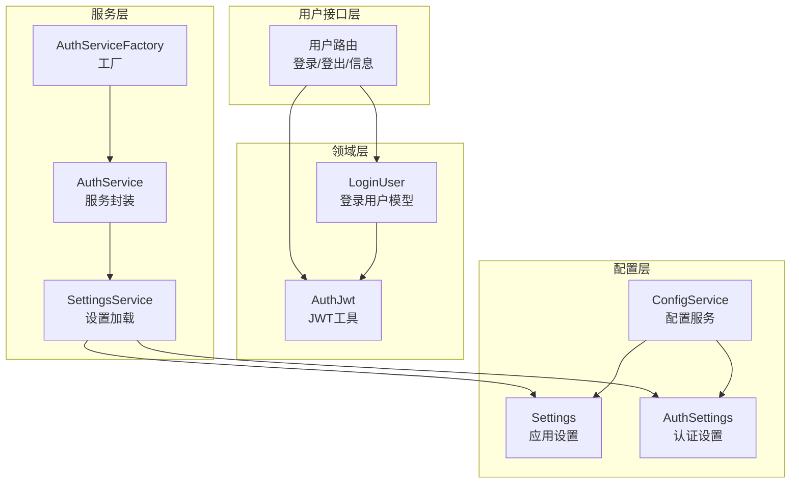
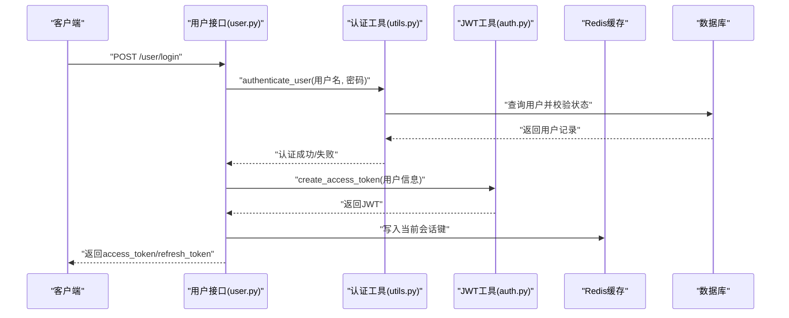
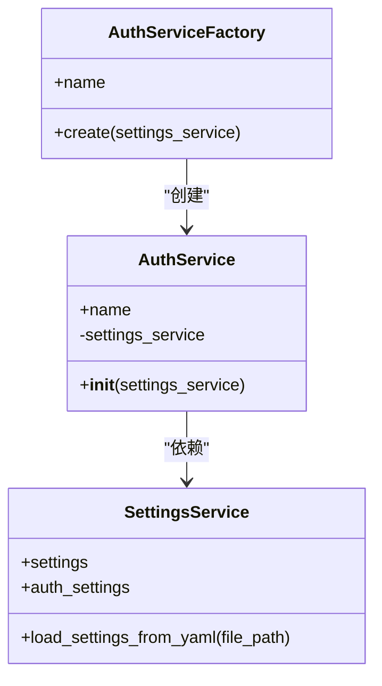
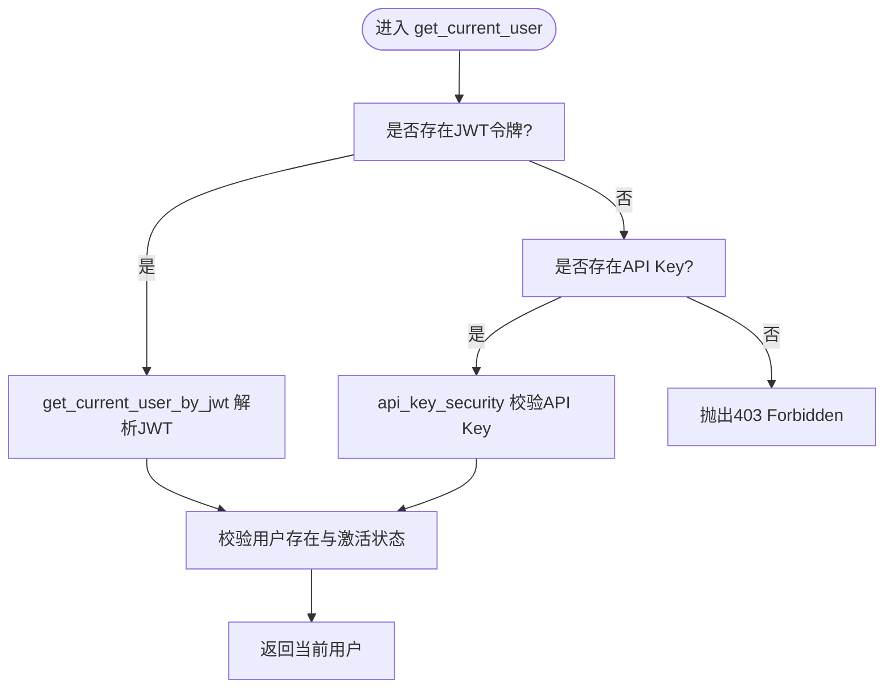
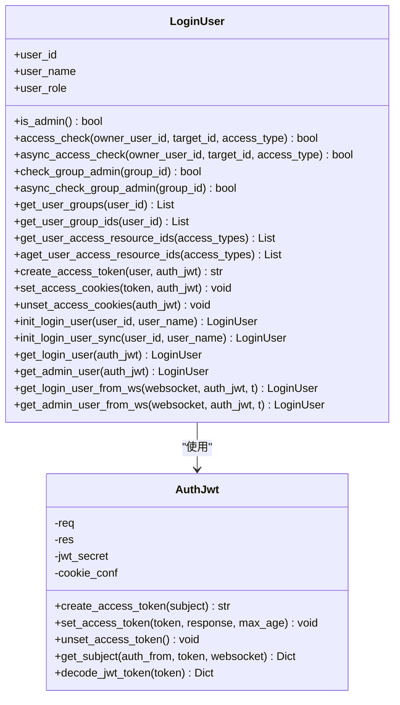
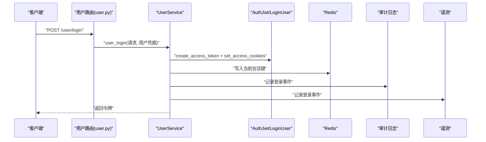
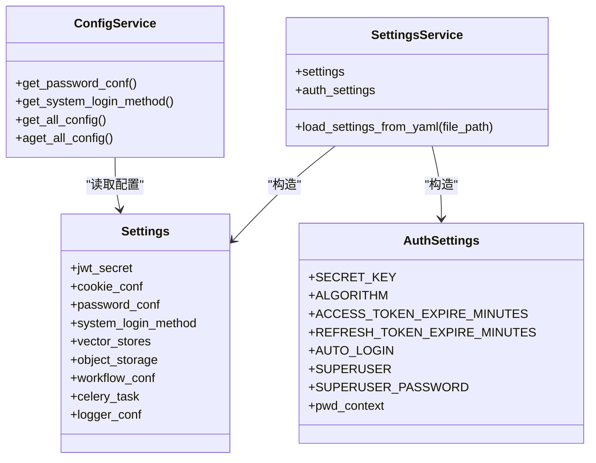
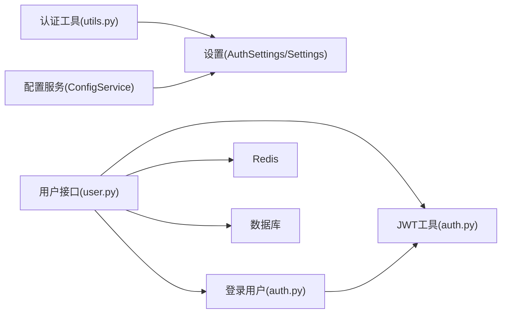

# 认证服务

<cite>
**本文引用的文件**
- [src/backend/bisheng/services/auth/service.py](file://src/backend/bisheng/services/auth/service.py)
- [src/backend/bisheng/services/auth/utils.py](file://src/backend/bisheng/services/auth/utils.py)
- [src/backend/bisheng/services/auth/factory.py](file://src/backend/bisheng/services/auth/factory.py)
- [src/backend/bisheng/user/domain/services/auth.py](file://src/backend/bisheng/user/domain/services/auth.py)
- [src/backend/bisheng/user/api/user.py](file://src/backend/bisheng/user/api/user.py)
- [src/backend/bisheng/user/domain/models/user.py](file://src/backend/bisheng/user/domain/models/user.py)
- [src/backend/bisheng/services/settings/service.py](file://src/backend/bisheng/services/settings/service.py)
- [src/backend/bisheng/services/settings/auth.py](file://src/backend/bisheng/services/settings/auth.py)
- [src/backend/bisheng/core/config/settings.py](file://src/backend/bisheng/core/config/settings.py)
- [src/backend/bisheng/common/services/config_service.py](file://src/backend/bisheng/common/services/config_service.py)
- [src/backend/bisheng/user/domain/const.py](file://src/backend/bisheng/user/domain/const.py)
</cite>

## 目录
1. [简介](#简介)
2. [项目结构](#项目结构)
3. [核心组件](#核心组件)
4. [架构总览](#架构总览)
5. [详细组件分析](#详细组件分析)
6. [依赖关系分析](#依赖关系分析)
7. [性能考量](#性能考量)
8. [故障排查指南](#故障排查指南)
9. [结论](#结论)
10. [附录](#附录)

## 简介
本文件面向 Bisheng 认证服务，系统性阐述其身份验证、令牌管理与会话控制机制，覆盖从用户登录到权限验证的完整流程；同时文档化配置项（密码策略、令牌过期时间、安全设置）、与用户管理系统的集成方式、扩展点（自定义认证提供程序与第三方集成），以及安全最佳实践与常见威胁防护。

## 项目结构
认证相关代码主要分布在以下模块：
- 服务层：认证服务封装、工厂与设置加载
- 领域层：JWT 工具、登录用户模型与权限检查
- 用户接口层：登录、登出、信息获取、密码变更等 API
- 配置层：应用设置、认证设置、密码策略与 Cookie 安全参数

图表来源
- [src/backend/bisheng/services/auth/service.py](file://src/backend/bisheng/services/auth/service.py#L1-L14)
- [src/backend/bisheng/services/auth/factory.py](file://src/backend/bisheng/services/auth/factory.py#L1-L12)
- [src/backend/bisheng/services/settings/service.py](file://src/backend/bisheng/services/settings/service.py#L1-L44)
- [src/backend/bisheng/user/domain/services/auth.py](file://src/backend/bisheng/user/domain/services/auth.py#L24-L93)
- [src/backend/bisheng/user/api/user.py](file://src/backend/bisheng/user/api/user.py#L107-L147)
- [src/backend/bisheng/core/config/settings.py](file://src/backend/bisheng/core/config/settings.py#L210-L259)
- [src/backend/bisheng/services/settings/auth.py](file://src/backend/bisheng/services/settings/auth.py#L13-L74)
- [src/backend/bisheng/common/services/config_service.py](file://src/backend/bisheng/common/services/config_service.py#L58-L237)

章节来源
- [src/backend/bisheng/services/auth/service.py](file://src/backend/bisheng/services/auth/service.py#L1-L14)
- [src/backend/bisheng/services/auth/factory.py](file://src/backend/bisheng/services/auth/factory.py#L1-L12)
- [src/backend/bisheng/services/settings/service.py](file://src/backend/bisheng/services/settings/service.py#L1-L44)
- [src/backend/bisheng/user/domain/services/auth.py](file://src/backend/bisheng/user/domain/services/auth.py#L24-L93)
- [src/backend/bisheng/user/api/user.py](file://src/backend/bisheng/user/api/user.py#L107-L147)
- [src/backend/bisheng/core/config/settings.py](file://src/backend/bisheng/core/config/settings.py#L210-L259)
- [src/backend/bisheng/services/settings/auth.py](file://src/backend/bisheng/services/settings/auth.py#L13-L74)
- [src/backend/bisheng/common/services/config_service.py](file://src/backend/bisheng/common/services/config_service.py#L58-L237)

## 核心组件
- 认证服务封装：提供统一的认证能力入口，依赖设置服务注入配置。
- 认证工具集：包含 JWT 生成与校验、API Key 校验、密码哈希与校验、刷新令牌、用户鉴权依赖等。
- JWT 工具与登录用户：负责将用户信息编码进 JWT 并写入 Cookie，支持从请求、WebSocket 或 Header 解码；提供权限检查与资源访问列表查询。
- 用户接口：提供登录、登出、获取用户信息、密码修改、SSO 登录等端点。
- 设置与配置：应用设置（含 Cookie 安全参数、密码策略、系统登录方式等）与认证设置（密钥、算法、令牌过期时间、自动登录等）由 SettingsService 加载；ConfigService 负责从数据库/缓存读取配置。

章节来源
- [src/backend/bisheng/services/auth/service.py](file://src/backend/bisheng/services/auth/service.py#L9-L14)
- [src/backend/bisheng/services/auth/utils.py](file://src/backend/bisheng/services/auth/utils.py#L17-L136)
- [src/backend/bisheng/user/domain/services/auth.py](file://src/backend/bisheng/user/domain/services/auth.py#L24-L93)
- [src/backend/bisheng/user/api/user.py](file://src/backend/bisheng/user/api/user.py#L107-L147)
- [src/backend/bisheng/services/settings/service.py](file://src/backend/bisheng/services/settings/service.py#L10-L44)
- [src/backend/bisheng/core/config/settings.py](file://src/backend/bisheng/core/config/settings.py#L51-L63)
- [src/backend/bisheng/services/settings/auth.py](file://src/backend/bisheng/services/settings/auth.py#L13-L74)

## 架构总览
认证服务采用“服务层 + 领域层 + 接口层 + 配置层”的分层设计，通过依赖注入与设置服务解耦配置与业务逻辑。登录流程以 JWT 为核心，结合 Cookie 存储与 Redis 会话缓存，实现跨请求的身份识别与权限判定。

图表来源
- [src/backend/bisheng/user/api/user.py](file://src/backend/bisheng/user/api/user.py#L107-L109)
- [src/backend/bisheng/services/auth/utils.py](file://src/backend/bisheng/services/auth/utils.py#L288-L299)
- [src/backend/bisheng/user/domain/services/auth.py](file://src/backend/bisheng/user/domain/services/auth.py#L257-L265)
- [src/backend/bisheng/user/domain/const.py](file://src/backend/bisheng/user/domain/const.py#L1-L4)

## 详细组件分析

### 组件A：认证服务封装与工厂
- AuthService 提供认证服务实例，持有 SettingsService 引用，用于按需读取认证配置。
- AuthServiceFactory 负责创建 AuthService 实例，便于在依赖注入容器中统一管理。

图表来源
- [src/backend/bisheng/services/auth/service.py](file://src/backend/bisheng/services/auth/service.py#L9-L14)
- [src/backend/bisheng/services/auth/factory.py](file://src/backend/bisheng/services/auth/factory.py#L5-L12)
- [src/backend/bisheng/services/settings/service.py](file://src/backend/bisheng/services/settings/service.py#L10-L44)

章节来源
- [src/backend/bisheng/services/auth/service.py](file://src/backend/bisheng/services/auth/service.py#L9-L14)
- [src/backend/bisheng/services/auth/factory.py](file://src/backend/bisheng/services/auth/factory.py#L5-L12)
- [src/backend/bisheng/services/settings/service.py](file://src/backend/bisheng/services/settings/service.py#L10-L44)

### 组件B：认证工具集（JWT/API Key/密码）
- JWT 生成与校验：基于 HS256 算法，使用 SECRET_KEY 与 ALGORITHM；支持过期时间控制与签发方校验。
- API Key 校验：支持查询参数或 Header 传递，自动登录模式下可直接返回超级用户。
- 密码处理：使用 bcrypt 上下文进行哈希与校验；支持长时令牌与加密 API Key 的加解密。
- 刷新令牌：解析刷新令牌，校验类型与用户 ID，重新发放新的访问令牌。
- 用户鉴权依赖：优先从 JWT 获取当前用户，否则回退到 API Key；支持活跃用户与超级用户校验。

图表来源
- [src/backend/bisheng/services/auth/utils.py](file://src/backend/bisheng/services/auth/utils.py#L66-L87)
- [src/backend/bisheng/services/auth/utils.py](file://src/backend/bisheng/services/auth/utils.py#L90-L130)
- [src/backend/bisheng/services/auth/utils.py](file://src/backend/bisheng/services/auth/utils.py#L25-L64)

章节来源
- [src/backend/bisheng/services/auth/utils.py](file://src/backend/bisheng/services/auth/utils.py#L17-L136)
- [src/backend/bisheng/services/auth/utils.py](file://src/backend/bisheng/services/auth/utils.py#L238-L286)

### 组件C：JWT 工具与登录用户模型
- AuthJwt：负责 JWT 编码与解码、Cookie 写入与删除、从不同来源（请求、WebSocket、Header）提取令牌主体。
- LoginUser：封装登录用户上下文，提供管理员判断、组管理员判断、权限检查、资源访问列表查询、异步权限检查等方法，并支持从 Cookie/WS 初始化登录用户。

图表来源
- [src/backend/bisheng/user/domain/services/auth.py](file://src/backend/bisheng/user/domain/services/auth.py#L24-L93)
- [src/backend/bisheng/user/domain/services/auth.py](file://src/backend/bisheng/user/domain/services/auth.py#L256-L338)

章节来源
- [src/backend/bisheng/user/domain/services/auth.py](file://src/backend/bisheng/user/domain/services/auth.py#L24-L93)
- [src/backend/bisheng/user/domain/services/auth.py](file://src/backend/bisheng/user/domain/services/auth.py#L256-L338)

### 组件D：用户接口（登录/登出/信息/密码）
- 登录：支持普通登录与 SSO 登录；登录成功后生成 JWT 并写入 Cookie，同时在 Redis 中记录当前会话，触发审计日志与遥测事件。
- 登出：清除 Cookie 中的访问令牌。
- 用户信息：返回角色、菜单权限与管理的用户组列表。
- 密码相关：支持重置他人密码（管理员）、修改本人密码、无需登录修改密码等场景。

图表来源
- [src/backend/bisheng/user/api/user.py](file://src/backend/bisheng/user/api/user.py#L107-L109)
- [src/backend/bisheng/user/domain/services/auth.py](file://src/backend/bisheng/user/domain/services/auth.py#L257-L274)
- [src/backend/bisheng/user/domain/const.py](file://src/backend/bisheng/user/domain/const.py#L3-L4)

章节来源
- [src/backend/bisheng/user/api/user.py](file://src/backend/bisheng/user/api/user.py#L107-L147)
- [src/backend/bisheng/user/api/user.py](file://src/backend/bisheng/user/api/user.py#L53-L94)
- [src/backend/bisheng/user/domain/services/auth.py](file://src/backend/bisheng/user/domain/services/auth.py#L257-L274)
- [src/backend/bisheng/user/domain/const.py](file://src/backend/bisheng/user/domain/const.py#L3-L4)

### 组件E：配置与设置
- SettingsService：从 YAML 加载应用设置与认证设置，构造 Settings 与 AuthSettings 实例。
- Settings（应用设置）：包含 Cookie 安全参数、密码策略、系统登录方式、向量存储、对象存储、工作流配置、Celery 任务调度、日志配置等。
- AuthSettings（认证设置）：包含 SECRET_KEY、ALGORITHM、ACCESS_TOKEN_EXPIRE_MINUTES、REFRESH_TOKEN_EXPIRE_MINUTES、AUTO_LOGIN、SUPERUSER、SUPERUSER_PASSWORD、API Key 相关参数等。
- ConfigService：从数据库/缓存读取初始化配置，支持异步与同步读取，提供密码策略、系统登录方式等便捷方法。

图表来源
- [src/backend/bisheng/services/settings/service.py](file://src/backend/bisheng/services/settings/service.py#L10-L44)
- [src/backend/bisheng/core/config/settings.py](file://src/backend/bisheng/core/config/settings.py#L210-L259)
- [src/backend/bisheng/services/settings/auth.py](file://src/backend/bisheng/services/settings/auth.py#L13-L74)
- [src/backend/bisheng/common/services/config_service.py](file://src/backend/bisheng/common/services/config_service.py#L58-L237)

章节来源
- [src/backend/bisheng/services/settings/service.py](file://src/backend/bisheng/services/settings/service.py#L10-L44)
- [src/backend/bisheng/core/config/settings.py](file://src/backend/bisheng/core/config/settings.py#L51-L63)
- [src/backend/bisheng/core/config/settings.py](file://src/backend/bisheng/core/config/settings.py#L185-L196)
- [src/backend/bisheng/services/settings/auth.py](file://src/backend/bisheng/services/settings/auth.py#L13-L74)
- [src/backend/bisheng/common/services/config_service.py](file://src/backend/bisheng/common/services/config_service.py#L192-L209)

## 依赖关系分析
- 认证服务依赖设置服务提供的密钥、算法与令牌过期时间等配置。
- 用户接口依赖 JWT 工具与登录用户模型进行身份识别与权限检查。
- 认证工具依赖设置服务中的密码上下文与密钥，以及数据库与 Redis 进行用户与会话数据的读写。
- 配置服务从数据库/缓存读取系统配置，为认证与业务提供统一的配置源。

图表来源
- [src/backend/bisheng/services/auth/utils.py](file://src/backend/bisheng/services/auth/utils.py#L17-L136)
- [src/backend/bisheng/user/api/user.py](file://src/backend/bisheng/user/api/user.py#L107-L147)
- [src/backend/bisheng/user/domain/services/auth.py](file://src/backend/bisheng/user/domain/services/auth.py#L24-L93)
- [src/backend/bisheng/common/services/config_service.py](file://src/backend/bisheng/common/services/config_service.py#L192-L209)

章节来源
- [src/backend/bisheng/services/auth/utils.py](file://src/backend/bisheng/services/auth/utils.py#L17-L136)
- [src/backend/bisheng/user/api/user.py](file://src/backend/bisheng/user/api/user.py#L107-L147)
- [src/backend/bisheng/user/domain/services/auth.py](file://src/backend/bisheng/user/domain/services/auth.py#L24-L93)
- [src/backend/bisheng/common/services/config_service.py](file://src/backend/bisheng/common/services/config_service.py#L192-L209)

## 性能考量
- 令牌过期时间：访问令牌与刷新令牌的过期时间由设置决定，建议根据业务风险与用户体验平衡配置。
- 密钥与算法：使用 HS256 算法，密钥由 AuthSettings 管理，建议定期轮换并妥善保存。
- 缓存与数据库：登录态与会话信息通过 Redis 缓存，减少数据库压力；审计日志与遥测事件异步记录，避免阻塞主流程。
- 权限检查：资源访问列表查询支持批量与异步操作，降低权限判定开销。

## 故障排查指南
- 401 未授权：检查 JWT 是否过期、密钥是否正确、签发方是否匹配；确认用户处于激活状态。
- 403 禁止访问：确认 API Key 是否有效且传入位置正确；检查用户是否具备所需权限。
- 登录失败：检查密码策略（如密码有效期、错误次数限制）与账户状态；查看 Redis 中的密码错误计数与当前会话键。
- 自动登录异常：确认 AUTO_LOGIN 开关与超级用户凭据配置是否正确。

章节来源
- [src/backend/bisheng/services/auth/utils.py](file://src/backend/bisheng/services/auth/utils.py#L90-L130)
- [src/backend/bisheng/services/auth/utils.py](file://src/backend/bisheng/services/auth/utils.py#L25-L64)
- [src/backend/bisheng/user/domain/const.py](file://src/backend/bisheng/user/domain/const.py#L1-L4)
- [src/backend/bisheng/services/settings/auth.py](file://src/backend/bisheng/services/settings/auth.py#L30-L35)

## 结论
Bisheng 认证服务通过清晰的分层设计与完善的配置体系，实现了从身份验证到权限控制的闭环。JWT 与 Cookie 的结合提供了良好的跨请求会话体验，配合 Redis 与数据库的缓存策略，兼顾了性能与一致性。通过设置服务与配置服务的抽象，认证能力具备良好的可扩展性与安全性。

## 附录

### 配置选项速查
- 认证设置（AuthSettings）
  - SECRET_KEY：JWT 密钥，支持从文件读取或随机生成
  - ALGORITHM：签名算法（默认 HS256）
  - ACCESS_TOKEN_EXPIRE_MINUTES：访问令牌过期时间（分钟）
  - REFRESH_TOKEN_EXPIRE_MINUTES：刷新令牌过期时间（分钟）
  - AUTO_LOGIN：自动登录开关
  - SUPERUSER/SUPERUSER_PASSWORD：超级用户与密码
  - API_KEY_SECRET_KEY/API_KEY_ALGORITHM：API Key 相关配置
- 应用设置（Settings）
  - cookie_conf：Cookie 安全参数（max_age、path、domain、secure、httponly、samesite、jwt_token_expire_time、jwt_iss）
  - password_conf：密码策略（password_valid_period、login_error_time_window、max_error_times）
  - system_login_method：系统登录方式（allow_multi_login 等）

章节来源
- [src/backend/bisheng/services/settings/auth.py](file://src/backend/bisheng/services/settings/auth.py#L13-L74)
- [src/backend/bisheng/core/config/settings.py](file://src/backend/bisheng/core/config/settings.py#L51-L63)
- [src/backend/bisheng/core/config/settings.py](file://src/backend/bisheng/core/config/settings.py#L185-L196)

### 扩展与集成示例
- 自定义认证提供程序：可在认证工具集中新增认证策略（如 LDAP/OAuth），并在用户接口中接入新策略的鉴权依赖。
- 第三方集成：通过 API Key 模式对接外部系统；使用加密 API Key 保障传输安全；结合自动登录模式简化内部系统接入。
- 会话管理：利用 Redis 会话键实现多端登录控制与强制下线；结合审计日志追踪会话生命周期。

章节来源
- [src/backend/bisheng/services/auth/utils.py](file://src/backend/bisheng/services/auth/utils.py#L25-L64)
- [src/backend/bisheng/user/domain/const.py](file://src/backend/bisheng/user/domain/const.py#L3-L4)

### 安全最佳实践
- 强制 HTTPS 与 HttpOnly Cookie：启用 secure 与 httponly，防止 XSS 与中间人攻击。
- 合理设置 SameSite：根据前端部署情况选择 Lax/Strict/None，避免 CSRF 风险。
- 密钥管理：定期轮换 SECRET_KEY，使用文件持久化并严格权限控制。
- 密码策略：启用密码有效期与错误次数限制，结合 Redis 记录错误尝试。
- 最小权限原则：通过 LoginUser 的权限检查与资源访问列表，确保用户仅能访问授权资源。

章节来源
- [src/backend/bisheng/core/config/settings.py](file://src/backend/bisheng/core/config/settings.py#L185-L196)
- [src/backend/bisheng/services/settings/auth.py](file://src/backend/bisheng/services/settings/auth.py#L44-L73)
- [src/backend/bisheng/services/auth/utils.py](file://src/backend/bisheng/services/auth/utils.py#L147-L154)
- [src/backend/bisheng/user/domain/services/auth.py](file://src/backend/bisheng/user/domain/services/auth.py#L154-L172)