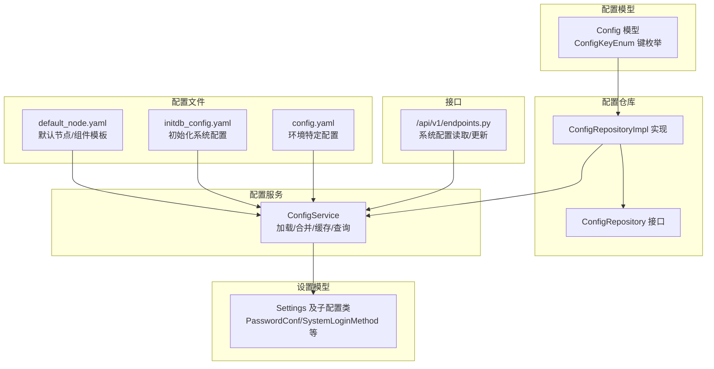
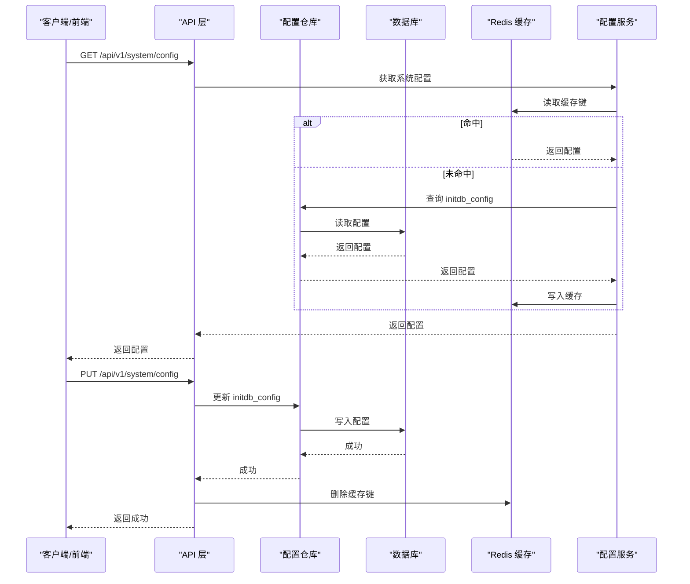
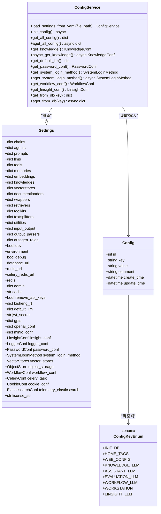
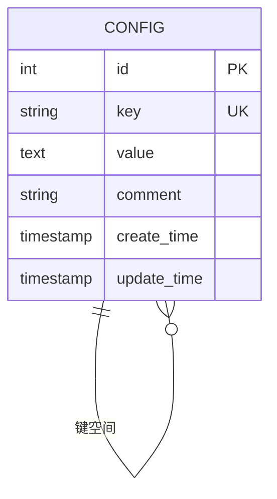
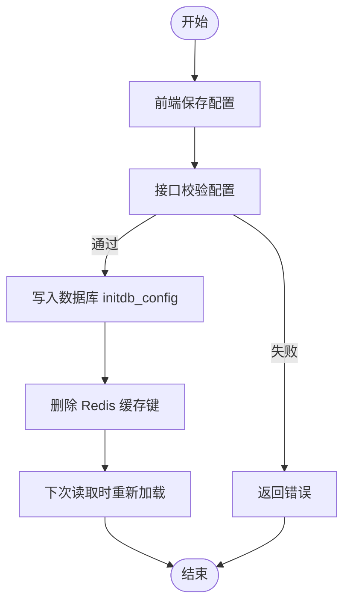
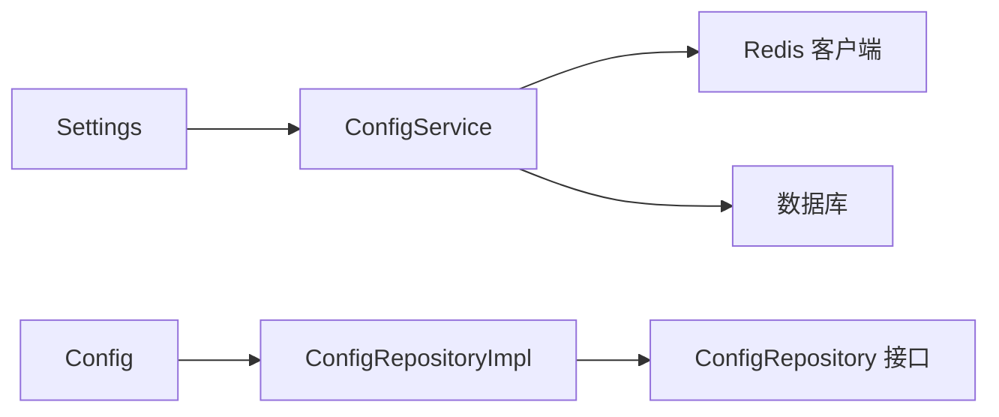

# 配置服务

<cite>
**本文引用的文件**
- [src/backend/bisheng/common/services/config_service.py](file://src/backend/bisheng/common/services/config_service.py)
- [src/backend/bisheng/core/config/settings.py](file://src/backend/bisheng/core/config/settings.py)
- [src/backend/bisheng/common/models/config.py](file://src/backend/bisheng/common/models/config.py)
- [src/backend/bisheng/common/repositories/implementations/config_repository_impl.py](file://src/backend/bisheng/common/repositories/implementations/config_repository_impl.py)
- [src/backend/bisheng/common/repositories/interfaces/config_repository.py](file://src/backend/bisheng/common/repositories/interfaces/config_repository.py)
- [docker/bisheng/config/config.yaml](file://docker/bisheng/config/config.yaml)
- [src/backend/bisheng/initdb_config.yaml](file://src/backend/bisheng/initdb_config.yaml)
- [src/backend/bisheng/default_node.yaml](file://src/backend/bisheng/default_node.yaml)
- [src/backend/bisheng/api/v1/endpoints.py](file://src/backend/bisheng/api/v1/endpoints.py)
- [src/backend/bisheng/core/cache/redis_conn.py](file://src/backend/bisheng/core/cache/redis_conn.py)
</cite>

## 目录
1. [简介](#简介)
2. [项目结构](#项目结构)
3. [核心组件](#核心组件)
4. [架构总览](#架构总览)
5. [详细组件分析](#详细组件分析)
6. [依赖关系分析](#依赖关系分析)
7. [性能考量](#性能考量)
8. [故障排查指南](#故障排查指南)
9. [结论](#结论)
10. [附录](#附录)

## 简介
本文件面向 Bisheng 配置服务，系统性阐述其设计原理、实现架构与使用方式。重点覆盖以下方面：
- 配置加载与优先级：默认配置、用户配置与环境特定配置的合并与覆盖策略
- 配置验证与约束：基于 Pydantic 的强类型校验、环境变量注入与敏感信息解密
- 热更新与持久化：数据库持久化、Redis 缓存与失效策略
- 版本管理与回滚：当前实现未提供版本与回滚能力，建议通过外部版本控制与备份策略实现
- 动态配置更新与监听：通过接口更新配置并触发缓存失效，前端编辑器支持实时保存
- 系统灵活性与可维护性：统一的配置模型、可扩展的键空间与清晰的职责分离

## 项目结构
配置服务涉及的关键模块与文件如下：
- 配置模型与枚举：定义配置键空间与数据模型
- 配置仓库：封装数据库访问
- 配置服务：负责加载、合并、缓存与对外提供配置
- 设置模型：定义各类配置项的类型、默认值与校验规则
- 配置文件：默认配置与环境特定配置
- 接口：提供配置的读取与更新能力

**图表来源**
- [src/backend/bisheng/common/models/config.py](file://src/backend/bisheng/common/models/config.py#L12-L55)
- [src/backend/bisheng/common/repositories/implementations/config_repository_impl.py](file://src/backend/bisheng/common/repositories/implementations/config_repository_impl.py#L8-L13)
- [src/backend/bisheng/common/repositories/interfaces/config_repository.py](file://src/backend/bisheng/common/repositories/interfaces/config_repository.py#L7-L10)
- [src/backend/bisheng/common/services/config_service.py](file://src/backend/bisheng/common/services/config_service.py#L58-L236)
- [src/backend/bisheng/core/config/settings.py](file://src/backend/bisheng/core/config/settings.py#L210-L346)
- [src/backend/bisheng/default_node.yaml](file://src/backend/bisheng/default_node.yaml#L1-L412)
- [src/backend/bisheng/initdb_config.yaml](file://src/backend/bisheng/initdb_config.yaml#L1-L81)
- [docker/bisheng/config/config.yaml](file://docker/bisheng/config/config.yaml#L1-L88)
- [src/backend/bisheng/api/v1/endpoints.py](file://src/backend/bisheng/api/v1/endpoints.py#L116-L138)

**章节来源**
- [src/backend/bisheng/common/models/config.py](file://src/backend/bisheng/common/models/config.py#L12-L55)
- [src/backend/bisheng/common/repositories/implementations/config_repository_impl.py](file://src/backend/bisheng/common/repositories/implementations/config_repository_impl.py#L8-L13)
- [src/backend/bisheng/common/repositories/interfaces/config_repository.py](file://src/backend/bisheng/common/repositories/interfaces/config_repository.py#L7-L10)
- [src/backend/bisheng/common/services/config_service.py](file://src/backend/bisheng/common/services/config_service.py#L58-L236)
- [src/backend/bisheng/core/config/settings.py](file://src/backend/bisheng/core/config/settings.py#L210-L346)
- [src/backend/bisheng/default_node.yaml](file://src/backend/bisheng/default_node.yaml#L1-L412)
- [src/backend/bisheng/initdb_config.yaml](file://src/backend/bisheng/initdb_config.yaml#L1-L81)
- [docker/bisheng/config/config.yaml](file://docker/bisheng/config/config.yaml#L1-L88)
- [src/backend/bisheng/api/v1/endpoints.py](file://src/backend/bisheng/api/v1/endpoints.py#L116-L138)

## 核心组件
- 配置模型与键空间
  - ConfigKeyEnum 定义了系统关键配置键，如初始化配置、前端定制配置、知识库/助手/工作流等默认模型配置键等
  - Config/ConfigBase 提供数据库表结构与基础字段（键、值、注释、时间戳）
- 配置仓库
  - ConfigRepository 接口抽象数据库操作
  - ConfigRepositoryImpl 基于 SQLModel 的实现，复用通用仓储基类
- 配置服务
  - ConfigService 继承 Settings，负责：
    - 从 YAML 加载配置，支持自定义构造器注入环境变量
    - 合并默认节点模板与用户配置
    - 初始化数据库中的系统默认配置，并在缓存中读取
    - 提供按子域获取配置的方法（如知识库、系统登录方式、工作流等）
    - 提供同步/异步读取与缓存失效
- 设置模型
  - Settings 及子类（PasswordConf、SystemLoginMethod、WorkflowConf、LinsightConf、ObjectStore、VectorStores 等）定义配置项的类型、默认值与校验逻辑
  - 支持从环境变量注入与解密敏感信息（如数据库/Redis 密码）

**章节来源**
- [src/backend/bisheng/common/models/config.py](file://src/backend/bisheng/common/models/config.py#L12-L55)
- [src/backend/bisheng/common/repositories/interfaces/config_repository.py](file://src/backend/bisheng/common/repositories/interfaces/config_repository.py#L7-L10)
- [src/backend/bisheng/common/repositories/implementations/config_repository_impl.py](file://src/backend/bisheng/common/repositories/implementations/config_repository_impl.py#L8-L13)
- [src/backend/bisheng/common/services/config_service.py](file://src/backend/bisheng/common/services/config_service.py#L58-L236)
- [src/backend/bisheng/core/config/settings.py](file://src/backend/bisheng/core/config/settings.py#L210-L346)

## 架构总览
配置服务采用“模型驱动 + 数据库持久化 + 缓存加速”的架构：
- 配置来源
  - 默认节点模板 default_node.yaml
  - 初始化系统配置 initdb_config.yaml
  - 环境特定配置 config.yaml（支持环境变量注入）
- 加载与合并
  - ConfigService.load_settings_from_yaml 将上述配置合并为 Settings 对象
  - 合并时校验键是否存在于 Settings 字段中
- 存储与读取
  - 初始化阶段将合并后的配置写入数据库（键为 initdb_config）
  - 运行期优先从 Redis 读取，未命中再从数据库读取并写入缓存
- 更新与失效
  - 通过接口更新配置后，删除 Redis 中对应缓存键，下次读取时重新加载

**图表来源**
- [src/backend/bisheng/common/services/config_service.py](file://src/backend/bisheng/common/services/config_service.py#L140-L173)
- [src/backend/bisheng/api/v1/endpoints.py](file://src/backend/bisheng/api/v1/endpoints.py#L116-L138)
- [src/backend/bisheng/core/cache/redis_conn.py](file://src/backend/bisheng/core/cache/redis_conn.py#L57-L70)

## 详细组件分析

### 配置服务类（ConfigService）
- 关键职责
  - 自定义 YAML 构造器：支持在配置中使用环境变量占位符，缺失时抛出异常
  - 合并策略：将 default_node.yaml 与用户配置合并，确保键空间一致
  - 初始化流程：首次运行时将 initdb_config.yaml 写入数据库，兼容旧配置
  - 读取与缓存：优先 Redis，未命中读数据库并写入缓存；提供同步/异步读取
  - 分域读取：提供知识库、系统登录方式、工作流、灵思等子配置的便捷方法
- 热更新机制
  - 更新接口写入数据库后删除 Redis 缓存键，下次读取触发重新加载
- 错误处理
  - 键不匹配时抛出异常
  - 数据库写入失败时回滚并记录异常

**图表来源**
- [src/backend/bisheng/common/services/config_service.py](file://src/backend/bisheng/common/services/config_service.py#L58-L236)
- [src/backend/bisheng/core/config/settings.py](file://src/backend/bisheng/core/config/settings.py#L210-L346)
- [src/backend/bisheng/common/models/config.py](file://src/backend/bisheng/common/models/config.py#L12-L55)

**章节来源**
- [src/backend/bisheng/common/services/config_service.py](file://src/backend/bisheng/common/services/config_service.py#L58-L236)
- [src/backend/bisheng/core/config/settings.py](file://src/backend/bisheng/core/config/settings.py#L210-L346)
- [src/backend/bisheng/common/models/config.py](file://src/backend/bisheng/common/models/config.py#L12-L55)

### 配置模型与键空间（ConfigKeyEnum）
- 键空间定义
  - INIT_DB：系统初始化配置（合并后的最终配置）
  - HOME_TAGS：首页标签
  - WEB_CONFIG：前端定制配置
  - KNOWLEDGE_LLM/ASSISTANT_LLM/EVALUATION_LLM/WORKFLOW_LLM/WORKSTATION/LINSIGHT_LLM：各业务域默认模型配置键
- 数据模型
  - Config/ConfigBase：包含键、值、注释与时间戳
  - ConfigDao：提供同步/异步读取与插入

**图表来源**
- [src/backend/bisheng/common/models/config.py](file://src/backend/bisheng/common/models/config.py#L24-L55)

**章节来源**
- [src/backend/bisheng/common/models/config.py](file://src/backend/bisheng/common/models/config.py#L12-L55)

### 配置仓库（Repository）
- 接口与实现
  - ConfigRepository 抽象配置仓库操作
  - ConfigRepositoryImpl 基于 AsyncSession 的实现，复用通用仓储基类
- 作用
  - 为配置服务提供统一的数据访问能力，屏蔽数据库细节

**章节来源**
- [src/backend/bisheng/common/repositories/interfaces/config_repository.py](file://src/backend/bisheng/common/repositories/interfaces/config_repository.py#L7-L10)
- [src/backend/bisheng/common/repositories/implementations/config_repository_impl.py](file://src/backend/bisheng/common/repositories/implementations/config_repository_impl.py#L8-L13)

### 设置模型（Settings 及子类）
- 类型与默认值
  - PasswordConf：密码有效期、登录错误时间窗、最大错误次数
  - SystemLoginMethod：是否商业版、管理员账号、是否允许多点登录
  - WorkflowConf：工作流最大步数、节点超时
  - LinsightConf：灵思调试开关、工具缓冲、最大步数、重试次数/间隔、文件/知识库上限、默认温度等
  - ObjectStore/MinioConf：对象存储类型与 MinIO 参数
  - VectorStores/ElasticsearchConf：向量库与 ES 配置
  - CookieConf/CeleryConf/LoggerConf 等
- 校验与环境注入
  - 支持从环境变量注入数据库/Redis URL 并解密密码
  - 支持将字符串配置转换为 crontab 等复杂类型

**章节来源**
- [src/backend/bisheng/core/config/settings.py](file://src/backend/bisheng/core/config/settings.py#L23-L346)

### 配置文件与优先级
- default_node.yaml：默认节点/组件模板，作为“默认配置”
- initdb_config.yaml：系统初始化配置，作为“用户配置”
- config.yaml：环境特定配置，支持环境变量注入（!env 占位符）
- 合并与优先级
  - 加载顺序：default_node.yaml → initdb_config.yaml → config.yaml
  - 合并策略：后者覆盖前者同名键；键不在 Settings 中时报错
  - 运行期：优先从 Redis 读取合并后的 initdb_config，未命中读数据库并写入缓存

**章节来源**
- [src/backend/bisheng/default_node.yaml](file://src/backend/bisheng/default_node.yaml#L1-L412)
- [src/backend/bisheng/initdb_config.yaml](file://src/backend/bisheng/initdb_config.yaml#L1-L81)
- [docker/bisheng/config/config.yaml](file://docker/bisheng/config/config.yaml#L1-L88)
- [src/backend/bisheng/common/services/config_service.py](file://src/backend/bisheng/common/services/config_service.py#L74-L96)
- [src/backend/bisheng/common/services/config_service.py](file://src/backend/bisheng/common/services/config_service.py#L140-L173)

### 动态配置更新与监听
- 更新流程
  - 前端提交新配置（YAML 字符串）
  - 接口写入数据库（覆盖 initdb_config）
  - 删除 Redis 缓存键，下次读取触发重新加载
- 监听机制
  - 当前实现未提供事件订阅或回调监听；可通过定时刷新或前端轮询实现“监听”效果

**图表来源**
- [src/backend/bisheng/api/v1/endpoints.py](file://src/backend/bisheng/api/v1/endpoints.py#L116-L138)
- [src/backend/bisheng/common/services/config_service.py](file://src/backend/bisheng/common/services/config_service.py#L140-L173)

**章节来源**
- [src/backend/bisheng/api/v1/endpoints.py](file://src/backend/bisheng/api/v1/endpoints.py#L116-L138)
- [src/backend/bisheng/common/services/config_service.py](file://src/backend/bisheng/common/services/config_service.py#L140-L173)

## 依赖关系分析
- 组件耦合
  - ConfigService 依赖 Settings、Config 模型、仓库实现与 Redis 客户端
  - 仓库实现依赖 SQLModel 与 AsyncSession
- 外部依赖
  - Redis：用于缓存系统配置
  - 数据库：持久化系统配置
  - Pydantic/YAML：配置解析与校验
- 循环依赖
  - 未发现循环依赖迹象

**图表来源**
- [src/backend/bisheng/core/config/settings.py](file://src/backend/bisheng/core/config/settings.py#L210-L346)
- [src/backend/bisheng/common/models/config.py](file://src/backend/bisheng/common/models/config.py#L12-L55)
- [src/backend/bisheng/common/repositories/implementations/config_repository_impl.py](file://src/backend/bisheng/common/repositories/implementations/config_repository_impl.py#L8-L13)
- [src/backend/bisheng/common/repositories/interfaces/config_repository.py](file://src/backend/bisheng/common/repositories/interfaces/config_repository.py#L7-L10)
- [src/backend/bisheng/common/services/config_service.py](file://src/backend/bisheng/common/services/config_service.py#L58-L236)

**章节来源**
- [src/backend/bisheng/core/config/settings.py](file://src/backend/bisheng/core/config/settings.py#L210-L346)
- [src/backend/bisheng/common/models/config.py](file://src/backend/bisheng/common/models/config.py#L12-L55)
- [src/backend/bisheng/common/repositories/implementations/config_repository_impl.py](file://src/backend/bisheng/common/repositories/implementations/config_repository_impl.py#L8-L13)
- [src/backend/bisheng/common/repositories/interfaces/config_repository.py](file://src/backend/bisheng/common/repositories/interfaces/config_repository.py#L7-L10)
- [src/backend/bisheng/common/services/config_service.py](file://src/backend/bisheng/common/services/config_service.py#L58-L236)

## 性能考量
- 缓存策略
  - Redis 缓存键带过期时间，避免热点配置重复读取数据库
  - 读取流程：先缓存后数据库，减少 IO 压力
- 初始化成本
  - 首次运行需合并 default_node.yaml 与 initdb_config.yaml，并写入数据库
- 异步支持
  - 提供异步读取方法，适合高并发场景
- 建议优化
  - 对频繁变更的配置项考虑更细粒度的缓存键
  - 对大型配置文件可考虑分片存储或增量更新

[本节为通用性能讨论，不直接分析具体文件]

## 故障排查指南
- 常见问题
  - 键不存在：当 YAML 中出现 Settings 未定义的键时会抛出异常
  - 环境变量缺失：!env 占位符对应的环境变量不存在会导致加载失败
  - 数据库写入失败：初始化或更新配置时异常会回滚并记录日志
  - 缓存未命中：检查 Redis 连接与缓存键是否存在
- 排查步骤
  - 检查 config.yaml 中的环境变量是否正确设置
  - 确认数据库中 initdb_config 是否存在且可读
  - 清理 Redis 缓存键后重试读取
  - 查看后端日志定位异常

**章节来源**
- [src/backend/bisheng/common/services/config_service.py](file://src/backend/bisheng/common/services/config_service.py#L74-L96)
- [src/backend/bisheng/common/services/config_service.py](file://src/backend/bisheng/common/services/config_service.py#L115-L124)
- [src/backend/bisheng/common/services/config_service.py](file://src/backend/bisheng/common/services/config_service.py#L140-L173)

## 结论
Bisheng 配置服务通过统一的模型、清晰的加载与合并策略、数据库持久化与 Redis 缓存，实现了系统配置的集中管理与高效访问。尽管当前未提供内置的版本与回滚能力，但通过外部版本控制与备份策略即可满足生产需求。整体设计在灵活性与可维护性之间取得良好平衡，便于后续扩展与演进。

[本节为总结性内容，不直接分析具体文件]

## 附录
- 使用示例（概述）
  - 动态配置更新：通过接口提交新的 YAML 配置，系统写入数据库并删除缓存键，下次读取生效
  - 配置监听：当前未提供事件监听，可通过前端轮询或定时刷新实现
- 最佳实践
  - 将敏感信息（如数据库/Redis 密码）通过环境变量注入并在配置中使用 !env 占位符
  - 对大型配置文件采用分块存储或分键管理
  - 在生产环境启用 Redis 缓存并合理设置过期时间

[本节为通用指导，不直接分析具体文件]