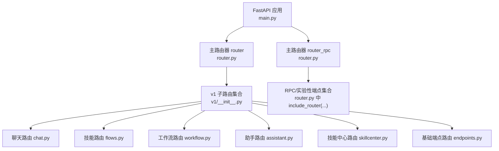
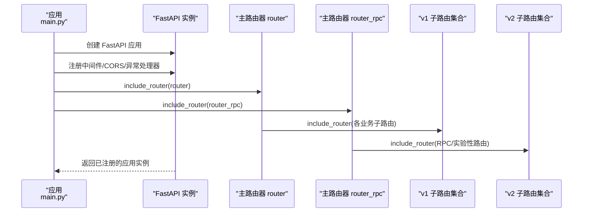
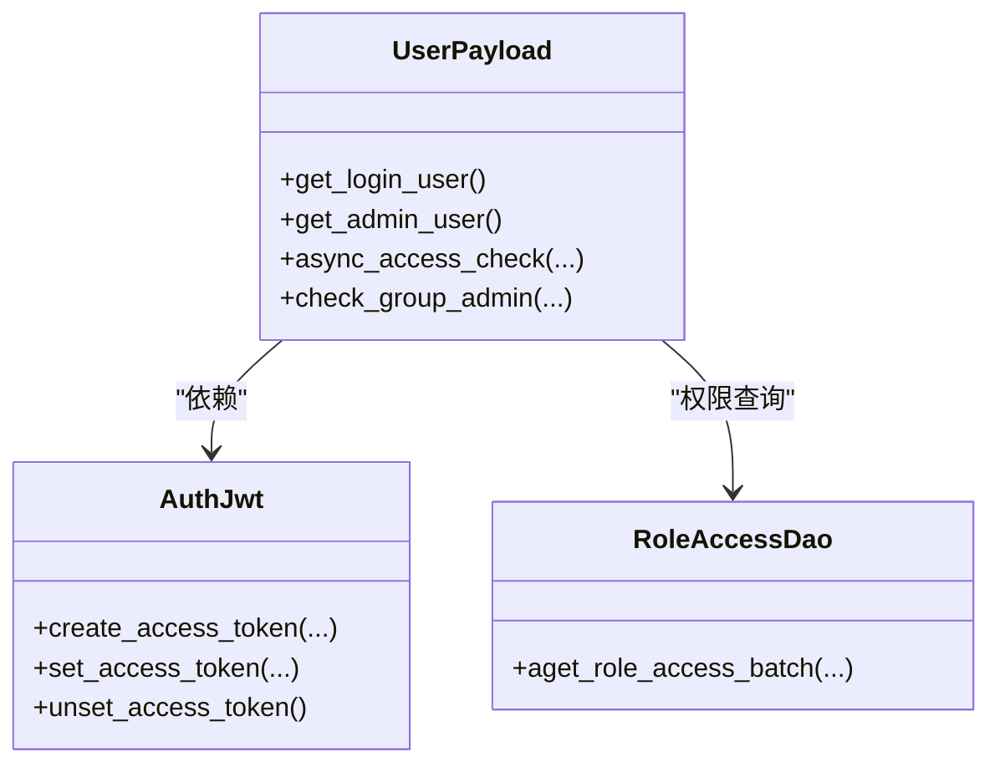
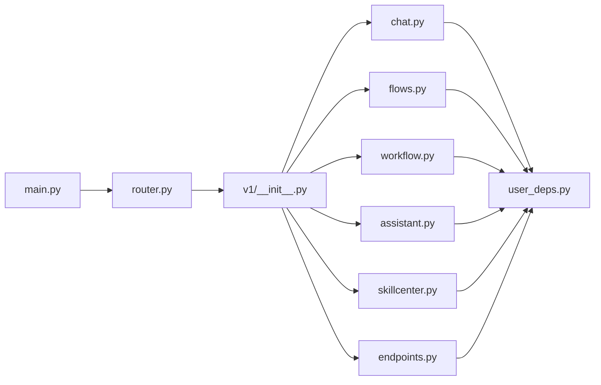

# 路由系统

<cite>
**本文引用的文件**
- [src/backend/bisheng/api/router.py](file://src/backend/bisheng/api/router.py)
- [src/backend/bisheng/api/v1/__init__.py](file://src/backend/bisheng/api/v1/__init__.py)
- [src/backend/bisheng/api/v1/endpoints.py](file://src/backend/bisheng/api/v1/endpoints.py)
- [src/backend/bisheng/api/v1/chat.py](file://src/backend/bisheng/api/v1/chat.py)
- [src/backend/bisheng/api/v1/flows.py](file://src/backend/bisheng/api/v1/flows.py)
- [src/backend/bisheng/api/v1/workflow.py](file://src/backend/bisheng/api/v1/workflow.py)
- [src/backend/bisheng/api/v1/assistant.py](file://src/backend/bisheng/api/v1/assistant.py)
- [src/backend/bisheng/api/v1/skillcenter.py](file://src/backend/bisheng/api/v1/skillcenter.py)
- [src/backend/bisheng/api/v1/schemas.py](file://src/backend/bisheng/api/v1/schemas.py)
- [src/backend/bisheng/common/dependencies/user_deps.py](file://src/backend/bisheng/common/dependencies/user_deps.py)
- [src/backend/bisheng/user/domain/services/auth.py](file://src/backend/bisheng/user/domain/services/auth.py)
- [src/backend/bisheng/main.py](file://src/backend/bisheng/main.py)
</cite>

## 目录
1. [简介](#简介)
2. [项目结构](#项目结构)
3. [核心组件](#核心组件)
4. [架构总览](#架构总览)
5. [详细组件分析](#详细组件分析)
6. [依赖关系分析](#依赖关系分析)
7. [性能考量](#性能考量)
8. [故障排查指南](#故障排查指南)
9. [结论](#结论)

## 简介
本文件系统性梳理 Bisheng 的 FastAPI 路由体系，重点覆盖：
- 主路由器与版本化路由器的组织方式
- v1 版本的路由分层与端点分类
- 路由装饰器用法（HTTP 方法、路径参数、查询参数、请求体）
- 安全机制（认证、授权、权限控制）
- 路由扩展与新增端点的最佳实践
- API 版本管理与向后兼容策略

## 项目结构
Bisheng 的路由采用“主路由器 + 多个子模块路由器”的分层设计，并通过版本前缀进行隔离：
- 主入口在应用层注册两个顶级路由器：/api/v1 与 /api/v2
- v1 路由器聚合大量业务子路由（聊天、技能、工作流、助手等）
- v2 路由器用于实验性或 RPC 类接口，保持与 v1 的并行演进

图表来源
- [src/backend/bisheng/main.py](file://src/backend/bisheng/main.py#L64-L102)
- [src/backend/bisheng/api/router.py](file://src/backend/bisheng/api/router.py#L23-L61)
- [src/backend/bisheng/api/v1/__init__.py](file://src/backend/bisheng/api/v1/__init__.py#L1-L42)

章节来源
- [src/backend/bisheng/main.py](file://src/backend/bisheng/main.py#L64-L102)
- [src/backend/bisheng/api/router.py](file://src/backend/bisheng/api/router.py#L23-L61)
- [src/backend/bisheng/api/v1/__init__.py](file://src/backend/bisheng/api/v1/__init__.py#L1-L42)

## 核心组件
- 主路由器（router）：挂载 v1 所有业务路由，统一前缀 /api/v1
- 版本化路由器（router_rpc）：挂载 v2 的 RPC/实验性端点，前缀 /api/v2
- v1 子路由：按领域拆分，如 chat、flows、workflow、assistant、skillcenter、endpoints 等
- 统一响应模型：resp_200/resp_500 与泛型 UnifiedResponseModel
- 用户依赖注入：UserPayload 作为登录用户载体，贯穿各路由依赖

章节来源
- [src/backend/bisheng/api/router.py](file://src/backend/bisheng/api/router.py#L23-L61)
- [src/backend/bisheng/api/v1/endpoints.py](file://src/backend/bisheng/api/v1/endpoints.py#L46-L98)
- [src/backend/bisheng/api/v1/schemas.py](file://src/backend/bisheng/api/v1/schemas.py#L69-L88)
- [src/backend/bisheng/common/dependencies/user_deps.py](file://src/backend/bisheng/common/dependencies/user_deps.py#L1-L6)

## 架构总览
下图展示从应用启动到路由注册的关键流程，以及 v1 与 v2 路由的并行关系。

图表来源
- [src/backend/bisheng/main.py](file://src/backend/bisheng/main.py#L64-L102)
- [src/backend/bisheng/api/router.py](file://src/backend/bisheng/api/router.py#L23-L61)

章节来源
- [src/backend/bisheng/main.py](file://src/backend/bisheng/main.py#L64-L102)
- [src/backend/bisheng/api/router.py](file://src/backend/bisheng/api/router.py#L23-L61)

## 详细组件分析

### 主路由器与版本化路由器
- 主路由器 router：包含 v1 的所有业务路由，统一前缀 /api/v1
- 主路由器 router_rpc：包含 v2 的 RPC/实验性路由，统一前缀 /api/v2
- 两者均通过 include_router 动态聚合，便于维护与扩展

章节来源
- [src/backend/bisheng/api/router.py](file://src/backend/bisheng/api/router.py#L23-L61)

### v1 路由分层与端点分类
v1 路由按领域进一步拆分为多个子模块，每个模块定义独立的 APIRouter 并标注 tags，便于文档生成与分类管理。

- 基础端点（endpoints.py）：环境信息、配置读取/保存、文件上传、版本查询等通用能力
- 聊天（chat.py）：会话列表、历史消息、消息增删改、点赞复制评论、在线技能查询、WebSocket 对话、构建状态与流式构建
- 技能（flows.py）：技能 CRUD、版本管理、版本对比（同步/流式）
- 工作流（workflow.py）：工作流写权限校验、报告模板文件管理、一次性节点执行、WebSocket 对话、工作流 CRUD、版本管理
- 助手（assistant.py）：助手 CRUD、状态变更、自动优化任务、提示词与技能/工具绑定、WebSocket 对话
- 技能中心（skillcenter.py）：模板 CRUD（含顺序号策略）
- 其他：审计、标签、变量、报表、工作站、邀请码、组件、验证等

章节来源
- [src/backend/bisheng/api/v1/endpoints.py](file://src/backend/bisheng/api/v1/endpoints.py#L46-L428)
- [src/backend/bisheng/api/v1/chat.py](file://src/backend/bisheng/api/v1/chat.py#L49-L719)
- [src/backend/bisheng/api/v1/flows.py](file://src/backend/bisheng/api/v1/flows.py#L26-L226)
- [src/backend/bisheng/api/v1/workflow.py](file://src/backend/bisheng/api/v1/workflow.py#L32-L312)
- [src/backend/bisheng/api/v1/assistant.py](file://src/backend/bisheng/api/v1/assistant.py#L23-L177)
- [src/backend/bisheng/api/v1/skillcenter.py](file://src/backend/bisheng/api/v1/skillcenter.py#L16-L110)
- [src/backend/bisheng/api/v1/__init__.py](file://src/backend/bisheng/api/v1/__init__.py#L1-L42)

### 路由装饰器与参数处理模式
- HTTP 方法装饰器：@router.get/@router.post/@router.put/@router.delete/@router.websocket
- 路径参数：Path(...)，如 /flows/{flow_id}
- 查询参数：Query(...)，如 page_size/page_num/status
- 请求体：Body(embed=True)，常用于将对象嵌入请求体，避免多层嵌套
- 依赖注入：Depends(UserPayload.get_login_user)，统一获取登录用户上下文
- 流式响应：StreamingResponse，用于 SSE 或长连接场景
- WebSocket：WebSocket 装饰器，配合自定义异常处理

示例要点（不展示具体代码）：
- 文件上传：UploadFile 参数 + 业务封装函数
- 版本对比：Query(...) 接收 JSON 字符串，再反序列化为请求模型
- 构建状态：Redis 缓存键管理，状态枚举 BuildStatus

章节来源
- [src/backend/bisheng/api/v1/chat.py](file://src/backend/bisheng/api/v1/chat.py#L510-L719)
- [src/backend/bisheng/api/v1/flows.py](file://src/backend/bisheng/api/v1/flows.py#L198-L226)
- [src/backend/bisheng/api/v1/workflow.py](file://src/backend/bisheng/api/v1/workflow.py#L146-L157)
- [src/backend/bisheng/api/v1/endpoints.py](file://src/backend/bisheng/api/v1/endpoints.py#L371-L421)

### 安全机制：认证、授权与权限控制
- 认证与会话
  - 登录用户模型：UserPayload 继承自 LoginUser，提供 get_login_user/get_admin_user 等依赖方法
  - JWT 签发与校验：AuthJwt 提供令牌签发、Cookie 设置、资源访问权限查询等
- 授权与权限
  - 角色与资源：RoleAccessDao/WebMenuResource 定义资源类型与访问类型
  - 写权限检查：不同资源（技能/工作流/助手）使用 AccessType 进行异步/同步权限校验
  - 分享链接：header_share_token_parser 解析分享令牌，绕过部分用户态校验
- 异常处理
  - 统一异常处理器：HTTPException、RequestValidationError、BaseErrorCode
  - WebSocket 异常：特定错误码与关闭原因，保障客户端体验

图表来源
- [src/backend/bisheng/common/dependencies/user_deps.py](file://src/backend/bisheng/common/dependencies/user_deps.py#L1-L6)
- [src/backend/bisheng/user/domain/services/auth.py](file://src/backend/bisheng/user/domain/services/auth.py#L24-L281)

章节来源
- [src/backend/bisheng/common/dependencies/user_deps.py](file://src/backend/bisheng/common/dependencies/user_deps.py#L1-L6)
- [src/backend/bisheng/user/domain/services/auth.py](file://src/backend/bisheng/user/domain/services/auth.py#L24-L281)
- [src/backend/bisheng/api/v1/chat.py](file://src/backend/bisheng/api/v1/chat.py#L163-L170)
- [src/backend/bisheng/api/v1/flows.py](file://src/backend/bisheng/api/v1/flows.py#L137-L139)
- [src/backend/bisheng/api/v1/workflow.py](file://src/backend/bisheng/api/v1/workflow.py#L261-L262)

### 路由扩展与新增端点示例
- 新增一个领域路由（以“模板”为例）
  - 在 v1 下新建模块文件（如 template.py），定义 APIRouter 与端点
  - 在 v1/__init__.py 中导出路由
  - 在主路由器中 include_router，确保前缀与命名规范一致
  - 使用统一响应模型 resp_200/resp_500 与依赖注入 UserPayload
- 示例参考
  - 模板 CRUD：skillcenter.py 展示了典型的 GET/POST/PUT/DELETE 模式与分页查询
  - 流式构建：flows/workflow/assistant 的 /stream 与 WebSocket 场景

章节来源
- [src/backend/bisheng/api/v1/skillcenter.py](file://src/backend/bisheng/api/v1/skillcenter.py#L16-L110)
- [src/backend/bisheng/api/v1/__init__.py](file://src/backend/bisheng/api/v1/__init__.py#L1-L42)
- [src/backend/bisheng/api/router.py](file://src/backend/bisheng/api/router.py#L23-L61)

### API 版本管理与向后兼容
- v1 与 v2 并行：v1 保持稳定，v2 用于实验性接口，避免破坏性变更影响现有客户端
- 向后兼容策略
  - 保留旧端点（如 endpoints 中的旧 process 接口）以兼容存量调用
  - 新接口尽量采用新的路径或版本前缀，避免冲突
  - 配置与异常处理统一收敛，减少客户端适配成本

章节来源
- [src/backend/bisheng/api/router.py](file://src/backend/bisheng/api/router.py#L53-L61)
- [src/backend/bisheng/api/v1/endpoints.py](file://src/backend/bisheng/api/v1/endpoints.py#L172-L170)

## 依赖关系分析
- 应用层依赖主路由器，主路由器再依赖 v1 子路由集合
- v1 子路由内部相互解耦，通过服务层（service）与数据层交互
- 安全依赖链：依赖注入 UserPayload → 权限校验 → 资源访问

图表来源
- [src/backend/bisheng/main.py](file://src/backend/bisheng/main.py#L64-L102)
- [src/backend/bisheng/api/router.py](file://src/backend/bisheng/api/router.py#L23-L61)
- [src/backend/bisheng/api/v1/__init__.py](file://src/backend/bisheng/api/v1/__init__.py#L1-L42)

章节来源
- [src/backend/bisheng/main.py](file://src/backend/bisheng/main.py#L64-L102)
- [src/backend/bisheng/api/router.py](file://src/backend/bisheng/api/router.py#L23-L61)
- [src/backend/bisheng/api/v1/__init__.py](file://src/backend/bisheng/api/v1/__init__.py#L1-L42)

## 性能考量
- 流式构建与 SSE：通过 StreamingResponse 降低大对象传输延迟，提升用户体验
- WebSocket：针对实时对话场景，结合缓存与状态机，避免重复构建
- Redis 缓存：构建状态、临时数据、任务缓存等，减少数据库压力
- 统一异常处理：快速失败与日志记录，避免未捕获异常导致的性能抖动

## 故障排查指南
- 常见问题定位
  - 401/403：检查 JWT Cookie/Header 是否正确传递，确认用户角色与资源权限
  - 404：核对路径参数与查询参数是否匹配，确认资源是否存在
  - 422：请求体格式不符合 Pydantic 校验，检查 Body(embed=True) 的嵌套结构
  - WebSocket 关闭：根据错误码判断是鉴权失败还是内部异常
- 日志与追踪
  - 统一异常处理器输出请求方法、URL 与异常摘要
  - trace_id_var 用于跨服务追踪，便于定位问题根因

章节来源
- [src/backend/bisheng/main.py](file://src/backend/bisheng/main.py#L21-L49)
- [src/backend/bisheng/api/v1/chat.py](file://src/backend/bisheng/api/v1/chat.py#L559-L565)

## 结论
Bisheng 的路由系统以清晰的分层与版本化设计实现了高可维护性与可扩展性。v1 作为稳定基线，v2 作为演进试验场，配合统一的依赖注入与安全框架，既保证了向后兼容，也为未来迭代提供了空间。建议在新增端点时遵循既有模式（依赖注入、统一响应、流式/WS 支持），并在变更前充分评估对 v1 的影响。