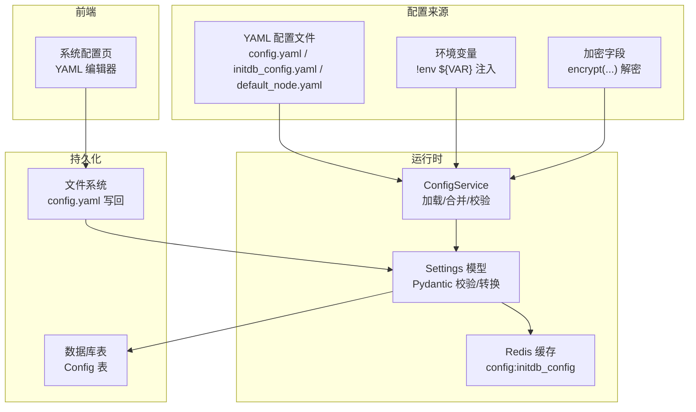
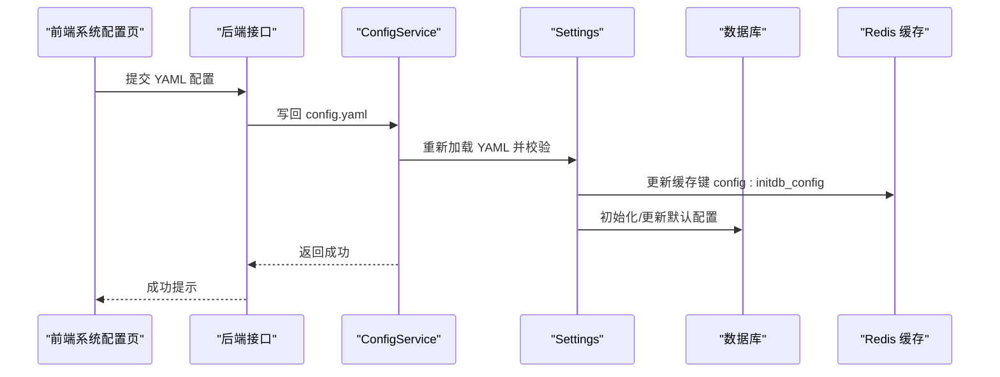
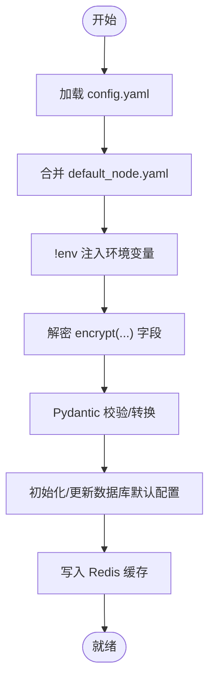
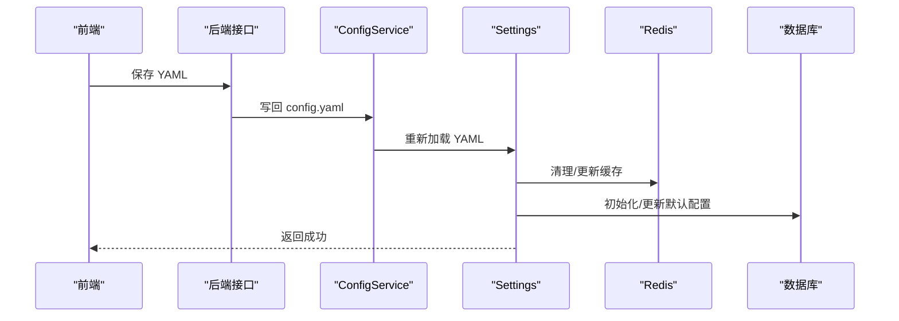
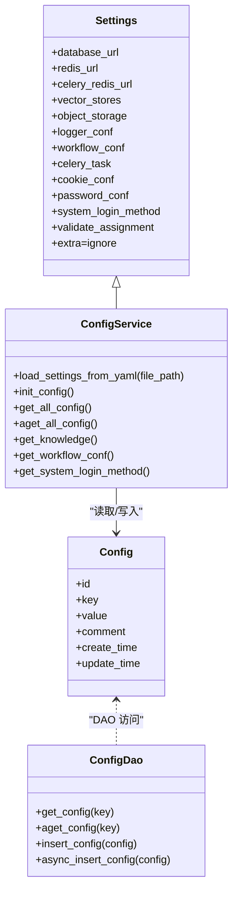

# 配置管理系统

<cite>
**本文引用的文件**
- [docker/bisheng/config/config.yaml](file://docker/bisheng/config/config.yaml)
- [src/backend/bisheng/core/config/settings.py](file://src/backend/bisheng/core/config/settings.py)
- [src/backend/bisheng/common/services/config_service.py](file://src/backend/bisheng/common/services/config_service.py)
- [src/backend/bisheng/common/models/config.py](file://src/backend/bisheng/common/models/config.py)
- [src/backend/bisheng/initdb_config.yaml](file://src/backend/bisheng/initdb_config.yaml)
- [src/backend/bisheng/default_node.yaml](file://src/backend/bisheng/default_node.yaml)
- [docker/docker-compose.yml](file://docker/docker-compose.yml)
- [src/frontend/platform/src/pages/SystemPage/components/Config.tsx](file://src/frontend/platform/src/pages/SystemPage/components/Config.tsx)
</cite>

## 目录
1. [简介](#简介)
2. [项目结构](#项目结构)
3. [核心组件](#核心组件)
4. [架构总览](#架构总览)
5. [详细组件分析](#详细组件分析)
6. [依赖关系分析](#依赖关系分析)
7. [性能考量](#性能考量)
8. [故障排查指南](#故障排查指南)
9. [结论](#结论)
10. [附录](#附录)

## 简介
本文件面向 Bisheng 配置管理系统，系统性阐述配置文件的层次结构与优先级、核心配置项的语义与作用、动态更新与热重载机制、多环境差异与最佳实践、容器化与云环境适配策略、以及配置验证与错误处理机制。目标读者既包括后端工程师，也包括运维与平台使用者。

## 项目结构
配置系统由三部分协同构成：
- 运行时配置：通过 YAML 文件加载并校验，结合环境变量注入与解密。
- 数据库存储：系统默认配置以 YAML 形式初始化并持久化至数据库，支持运行时读取与缓存。
- 前端管理：提供可视化编辑界面，保存为 YAML 并落盘，触发服务端热更新。

**图表来源**
- [docker/bisheng/config/config.yaml](file://docker/bisheng/config/config.yaml#L1-L88)
- [src/backend/bisheng/core/config/settings.py](file://src/backend/bisheng/core/config/settings.py#L210-L346)
- [src/backend/bisheng/common/services/config_service.py](file://src/backend/bisheng/common/services/config_service.py#L74-L96)
- [src/backend/bisheng/common/models/config.py](file://src/backend/bisheng/common/models/config.py#L34-L89)
- [src/frontend/platform/src/pages/SystemPage/components/Config.tsx](file://src/frontend/platform/src/pages/SystemPage/components/Config.tsx#L1-L40)

**章节来源**
- [docker/bisheng/config/config.yaml](file://docker/bisheng/config/config.yaml#L1-L88)
- [src/backend/bisheng/core/config/settings.py](file://src/backend/bisheng/core/config/settings.py#L210-L346)
- [src/backend/bisheng/common/services/config_service.py](file://src/backend/bisheng/common/services/config_service.py#L74-L96)
- [src/backend/bisheng/common/models/config.py](file://src/backend/bisheng/common/models/config.py#L34-L89)
- [src/frontend/platform/src/pages/SystemPage/components/Config.tsx](file://src/frontend/platform/src/pages/SystemPage/components/Config.tsx#L1-L40)

## 核心组件
- Settings：统一的配置模型，负责字段校验、类型转换、默认值与环境变量注入，支持加密字段解密与复杂对象转换。
- ConfigService：负责从 YAML 加载配置、合并默认节点模板、校验键名合法性、初始化数据库默认配置、提供运行时读取与缓存。
- Config/ConfigDao：数据库模型与 DAO，用于系统默认配置的持久化与查询。
- 前端 Config 页面：提供 YAML 编辑与保存能力，保存后触发后端热更新。

**章节来源**
- [src/backend/bisheng/core/config/settings.py](file://src/backend/bisheng/core/config/settings.py#L210-L346)
- [src/backend/bisheng/common/services/config_service.py](file://src/backend/bisheng/common/services/config_service.py#L58-L96)
- [src/backend/bisheng/common/models/config.py](file://src/backend/bisheng/common/models/config.py#L12-L89)
- [src/frontend/platform/src/pages/SystemPage/components/Config.tsx](file://src/frontend/platform/src/pages/SystemPage/components/Config.tsx#L1-L40)

## 架构总览
配置加载与更新的关键流程如下：

**图表来源**
- [src/frontend/platform/src/pages/SystemPage/components/Config.tsx](file://src/frontend/platform/src/pages/SystemPage/components/Config.tsx#L18-L40)
- [src/backend/bisheng/common/services/config_service.py](file://src/backend/bisheng/common/services/config_service.py#L98-L124)
- [src/backend/bisheng/core/config/settings.py](file://src/backend/bisheng/core/config/settings.py#L210-L346)

## 详细组件分析

### 配置层次与优先级
- 文件优先：YAML 文件作为主配置源，包含数据库、缓存、向量库、对象存储、日志、Celery 等核心配置。
- 环境变量注入：YAML 中使用自定义构造器 !env ${VAR} 注入环境变量；若变量缺失则抛出异常，确保配置完整性。
- 加密字段解密：数据库 URL、Redis URL、Celery Redis URL 等支持 encrypt(...) 包裹的密文，启动时自动解密还原明文。
- 默认节点模板：default_node.yaml 作为默认节点能力清单，与用户 YAML 合并，保证节点可用性。
- 运行时覆盖：Settings 的 model_validator 与 field_validator 在加载阶段完成类型转换、默认值填充与环境变量注入。

**图表来源**
- [src/backend/bisheng/common/services/config_service.py](file://src/backend/bisheng/common/services/config_service.py#L74-L96)
- [src/backend/bisheng/core/config/settings.py](file://src/backend/bisheng/core/config/settings.py#L262-L323)
- [src/backend/bisheng/default_node.yaml](file://src/backend/bisheng/default_node.yaml#L1-L412)

**章节来源**
- [docker/bisheng/config/config.yaml](file://docker/bisheng/config/config.yaml#L34-L57)
- [src/backend/bisheng/core/config/settings.py](file://src/backend/bisheng/core/config/settings.py#L262-L323)
- [src/backend/bisheng/common/services/config_service.py](file://src/backend/bisheng/common/services/config_service.py#L74-L96)

### 核心配置项与含义
- 数据库连接 database_url
  - 支持环境变量回退与明文/密文切换；启动时自动解密。
  - 未提供时回退为本地 sqlite。
- 缓存与队列 redis_url/celery_redis_url
  - 支持普通、集群、哨兵模式；密码可加密存储。
- 向量存储 vector_stores
  - Milvus：连接参数、分区开关与后缀（已标注弃用）。
  - Elasticsearch：URL 与 SSL 参数，支持字符串表达式转字面量。
- 对象存储 object_storage
  - MinIO：schema、证书校验、endpoint、public/tmp bucket 等。
- 日志 logger_conf
  - 支持多 handler，sink 支持环境变量插值，filter 支持字符串表达式转函数。
- 工作流与任务 workflow_conf/celery_task
  - 最大步数、超时、任务路由与定时任务计划。
- 安全与登录 password_conf/system_login_method
  - 密码有效期、登录错误窗口与封禁阈值；是否允许多端登录。
- 其他：jwt_cookie、telemetry_elasticsearch、bisheng_rt 等。

**章节来源**
- [docker/bisheng/config/config.yaml](file://docker/bisheng/config/config.yaml#L1-L88)
- [src/backend/bisheng/core/config/settings.py](file://src/backend/bisheng/core/config/settings.py#L23-L346)

### 动态更新与热重载
- 前端保存 YAML 后，后端写回 config.yaml 并触发重新加载。
- Settings 在加载阶段完成字段校验与转换，确保运行时一致性。
- 默认配置 initdb_config 通过数据库持久化，并在读取时缓存于 Redis，降低查询开销。
- 系统登录方法中的 bisheng_pro 字段受环境变量控制，实现“无重启”特性。

**图表来源**
- [src/frontend/platform/src/pages/SystemPage/components/Config.tsx](file://src/frontend/platform/src/pages/SystemPage/components/Config.tsx#L25-L40)
- [src/backend/bisheng/common/services/config_service.py](file://src/backend/bisheng/common/services/config_service.py#L98-L124)
- [src/backend/bisheng/core/config/settings.py](file://src/backend/bisheng/core/config/settings.py#L200-L202)

**章节来源**
- [src/backend/bisheng/common/services/config_service.py](file://src/backend/bisheng/common/services/config_service.py#L98-L124)
- [src/backend/bisheng/core/config/settings.py](file://src/backend/bisheng/core/config/settings.py#L200-L202)

### 多环境差异与最佳实践
- 开发/生产环境
  - 开发：可使用 sqlite 回退；日志级别较低；对象存储可指向本地或测试实例。
  - 生产：强制使用 MySQL；Redis/ES/Milvus/MinIO 使用稳定集群；启用 SSL 与证书校验；严格日志分级与轮转。
- 环境变量注入
  - 所有敏感配置建议通过环境变量注入，避免硬编码在 YAML 中。
- 加密策略
  - 数据库与缓存密码使用 encrypt(...) 包裹，启动时自动解密。
- 日志配置
  - 使用 sink 环境变量插值与 filter 函数，按需输出到文件、标准输出与统计通道。

**章节来源**
- [docker/bisheng/config/config.yaml](file://docker/bisheng/config/config.yaml#L1-L88)
- [src/backend/bisheng/core/config/settings.py](file://src/backend/bisheng/core/config/settings.py#L23-L48)

### 容器化与云环境适配
- Docker Compose
  - MySQL/Redis/Elasticsearch/Milvus/MinIO 等服务通过 compose 编排，backend/worker 分离。
  - 环境变量集中注入，如 ES URL、MinIO 凭据、Milvus 连接参数等。
  - 后端容器挂载 config.yaml 与入口脚本，数据目录映射到宿主机。
- 云环境
  - 建议使用托管数据库与缓存服务，通过环境变量注入连接信息。
  - 对象存储使用云厂商提供的兼容 S3 的服务，调整 schema/cert_check/endpoint。
  - 日志通过 stdout 输出，由云原生日志系统收集。

**章节来源**
- [docker/docker-compose.yml](file://docker/docker-compose.yml#L46-L94)
- [docker/docker-compose.yml](file://docker/docker-compose.yml#L124-L201)

### 配置验证与错误处理
- YAML 键名校验：ConfigService 在加载时检查 YAML 键是否存在于 Settings 模型字段，否则抛出异常。
- 环境变量缺失：!env 构造器在变量不存在时抛出异常，阻止启动。
- 加密字段解密：若密文不合法或解密失败，将在启动阶段暴露问题。
- 日志处理器：sink 支持环境变量插值，filter 支持字符串表达式 eval，确保灵活性与安全性。
- 数据库默认配置：首次启动时从 initdb_config.yaml 初始化，合并旧配置，失败回滚并记录异常。

**章节来源**
- [src/backend/bisheng/common/services/config_service.py](file://src/backend/bisheng/common/services/config_service.py#L65-L72)
- [src/backend/bisheng/common/services/config_service.py](file://src/backend/bisheng/common/services/config_service.py#L92-L94)
- [src/backend/bisheng/core/config/settings.py](file://src/backend/bisheng/core/config/settings.py#L39-L48)

## 依赖关系分析

**图表来源**
- [src/backend/bisheng/core/config/settings.py](file://src/backend/bisheng/core/config/settings.py#L210-L346)
- [src/backend/bisheng/common/services/config_service.py](file://src/backend/bisheng/common/services/config_service.py#L58-L236)
- [src/backend/bisheng/common/models/config.py](file://src/backend/bisheng/common/models/config.py#L34-L89)

**章节来源**
- [src/backend/bisheng/core/config/settings.py](file://src/backend/bisheng/core/config/settings.py#L210-L346)
- [src/backend/bisheng/common/services/config_service.py](file://src/backend/bisheng/common/services/config_service.py#L58-L236)
- [src/backend/bisheng/common/models/config.py](file://src/backend/bisheng/common/models/config.py#L34-L89)

## 性能考量
- 缓存命中：默认配置读取优先命中 Redis 缓存，减少数据库与文件 IO。
- 启动时一次性解密与转换：避免运行时重复计算。
- 日志多 handler：合理配置 rotation/retention，避免磁盘 IO 峰值。
- Celery 任务路由：按任务类型拆分队列，提升并发与稳定性。

[本节为通用指导，无需列出具体文件来源]

## 故障排查指南
- 环境变量缺失导致启动失败
  - 症状：启动时报错提示某环境变量未找到。
  - 排查：确认 YAML 中 !env ${VAR} 对应的环境变量是否注入。
- 加密字段解密失败
  - 症状：数据库/缓存连接报错或无法建立连接。
  - 排查：确认 encrypt(...) 内容是否正确，密钥是否一致。
- YAML 键名错误
  - 症状：加载阶段抛出键名不在模型字段的异常。
  - 排查：对照 Settings 模型字段修正键名。
- 日志 sink 插值或 filter 异常
  - 症状：日志输出异常或过滤器不生效。
  - 排查：检查 sink 中的环境变量是否存在，filter 表达式是否可被 eval。

**章节来源**
- [src/backend/bisheng/common/services/config_service.py](file://src/backend/bisheng/common/services/config_service.py#L65-L72)
- [src/backend/bisheng/common/services/config_service.py](file://src/backend/bisheng/common/services/config_service.py#L92-L94)
- [src/backend/bisheng/core/config/settings.py](file://src/backend/bisheng/core/config/settings.py#L39-L48)

## 结论
Bisheng 配置系统通过“文件 + 环境变量 + 加密字段”的组合，实现了灵活、安全且可演进的配置管理。配合数据库持久化与 Redis 缓存，系统在多环境下具备良好的一致性与性能表现。前端可视化编辑进一步降低了运维门槛，结合严格的校验与错误处理机制，保障了配置变更的安全与可靠。

[本节为总结性内容，无需列出具体文件来源]

## 附录

### 配置项速查表
- 数据库：database_url（支持环境变量回退与解密）
- 缓存：redis_url、celery_redis_url（支持集群/哨兵与解密）
- 向量库：vector_stores.milvus、vector_stores.elasticsearch
- 对象存储：object_storage.minio.*
- 日志：logger_conf.handlers.*（支持环境变量插值与 filter 函数）
- 工作流/Celery：workflow_conf、celery_task.task_routers、beat_schedule
- 安全：password_conf、system_login_method、cookie_conf
- 其他：telemetry_elasticsearch、bisheng_rt

**章节来源**
- [docker/bisheng/config/config.yaml](file://docker/bisheng/config/config.yaml#L1-L88)
- [src/backend/bisheng/core/config/settings.py](file://src/backend/bisheng/core/config/settings.py#L23-L346)