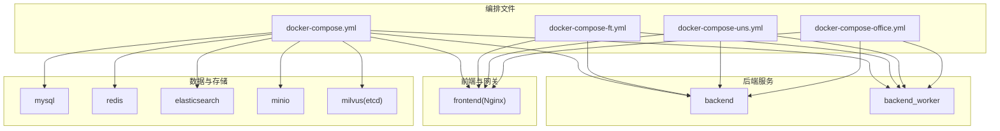
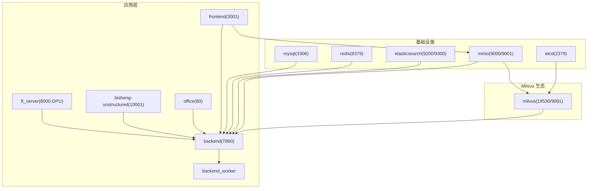
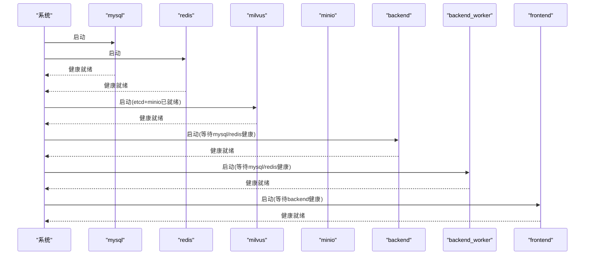
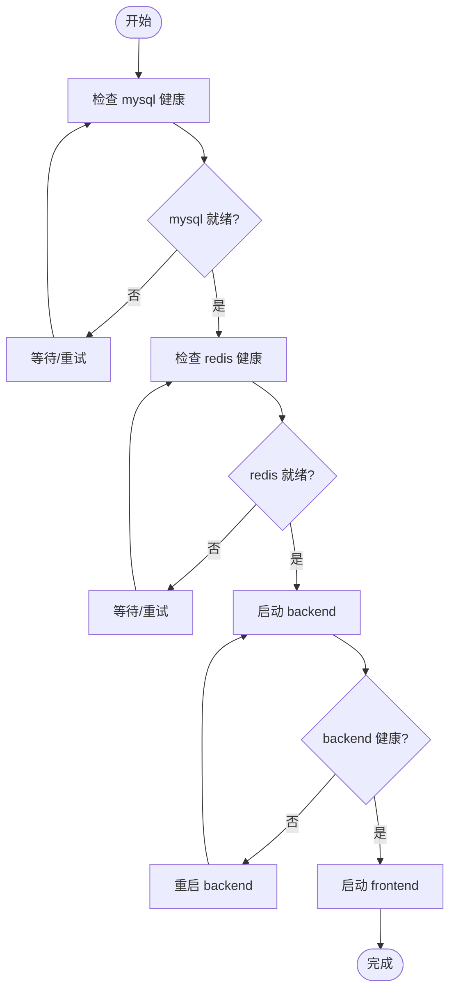

# Docker Compose 编排配置

<cite>
**本文引用的文件**
- [docker-compose.yml](file://docker/docker-compose.yml)
- [docker-compose-ft.yml](file://docker/docker-compose-ft.yml)
- [docker-compose-uns.yml](file://docker/docker-compose-uns.yml)
- [docker-compose-office.yml](file://docker/docker-compose-office.yml)
- [config.yaml（后端）](file://docker/bisheng/config/config.yaml)
- [config.yaml（微调）](file://docker/bisheng-ft/config.yaml)
- [入口脚本（后端）](file://docker/bisheng/entrypoint.sh)
- [Nginx 主配置](file://docker/nginx/nginx.conf)
- [Nginx 默认站点配置](file://docker/nginx/conf.d/default.conf)
- [Nginx WebSocket 配置](file://docker/nginx/conf.d/websocket.conf)
- [MySQL 配置](file://docker/mysql/conf/my.cnf)
- [Redis 配置](file://docker/redis/redis.conf)
- [Office 插件配置](file://docker/office/bisheng/config.json)
- [Office 插件入口页面](file://docker/office/bisheng/index.html)
- [Office 插件 JS](file://docker/office/bisheng/all.js)
- [Office 插件最小 JS](file://docker/office/bisheng/bisheng.js)
</cite>

## 目录
1. [简介](#简介)
2. [项目结构](#项目结构)
3. [核心组件](#核心组件)
4. [架构总览](#架构总览)
5. [组件详解](#组件详解)
6. [依赖关系分析](#依赖关系分析)
7. [性能与扩展性](#性能与扩展性)
8. [运维与排障指南](#运维与排障指南)
9. [结论](#结论)
10. [附录：Compose 命令速查](#附录compose-命令速查)

## 简介
本文件面向运维与开发工程师，系统化梳理 Bisheng 的 Docker Compose 多服务编排设计与实现细节，覆盖服务依赖与启动顺序、健康检查、网络与通信、配置参数（环境变量、端口映射、卷挂载）、以及不同部署场景（标准版、微调版、未标注版、办公版）的差异化配置。同时提供扩缩容、负载均衡与故障恢复建议，并给出常用 Compose 命令与排障清单。

## 项目结构
Bisheng 的编排以 docker 目录为核心，按“服务类型”组织：
- 标准版编排：docker-compose.yml，包含后端、前端、数据库、缓存、向量/搜索、对象存储、消息队列等
- 微调版编排：docker-compose-ft.yml，新增微调推理服务
- 未标注版编排：docker-compose-uns.yml，新增非结构化解析服务
- 办公版编排：docker-compose-office.yml，新增 OnlyOffice 文档服务
- 配置与脚本：各服务的配置文件与入口脚本位于 docker/<service>/ 目录

图表来源
- [docker-compose.yml](file://docker/docker-compose.yml#L1-L201)
- [docker-compose-ft.yml](file://docker/docker-compose-ft.yml#L1-L31)
- [docker-compose-uns.yml](file://docker/docker-compose-uns.yml#L1-L22)
- [docker-compose-office.yml](file://docker/docker-compose-office.yml#L1-L15)

章节来源
- [docker-compose.yml](file://docker/docker-compose.yml#L1-L201)
- [docker-compose-ft.yml](file://docker/docker-compose-ft.yml#L1-L31)
- [docker-compose-uns.yml](file://docker/docker-compose-uns.yml#L1-L22)
- [docker-compose-office.yml](file://docker/docker-compose-office.yml#L1-L15)

## 核心组件
- MySQL：关系型数据库，提供持久化存储；通过健康检查保障可用性
- Redis：缓存与消息队列（Celery Broker），支持独立配置文件
- Backend API：主业务服务，提供 REST API 与健康检查
- Backend Worker：Celery 异步任务处理，支持多队列与 Beat
- Frontend：Nginx 反向代理，统一暴露 API 与静态资源
- Elasticsearch：全文检索与分析
- Milvus：向量数据库，依赖 etcd 与 MinIO
- MinIO：对象存储，提供 S3 兼容接口
- 微调服务（ft）：GPU 推理服务，支持 GPU 设备直通
- 未标注服务（uns）：非结构化解析服务
- OnlyOffice：文档在线编辑插件

章节来源
- [docker-compose.yml](file://docker/docker-compose.yml#L1-L201)
- [docker-compose-ft.yml](file://docker/docker-compose-ft.yml#L1-L31)
- [docker-compose-uns.yml](file://docker/docker-compose-uns.yml#L1-L22)
- [docker-compose-office.yml](file://docker/docker-compose-office.yml#L1-L15)

## 架构总览
下图展示服务间依赖与通信路径，强调“先底座、后上层”的启动顺序与健康检查约束。

图表来源
- [docker-compose.yml](file://docker/docker-compose.yml#L1-L201)
- [docker-compose-ft.yml](file://docker/docker-compose-ft.yml#L1-L31)
- [docker-compose-uns.yml](file://docker/docker-compose-uns.yml#L1-L22)
- [docker-compose-office.yml](file://docker/docker-compose-office.yml#L1-L15)

## 组件详解

### 后端服务（backend）
- 启动方式：入口脚本支持多种模式，API 模式默认启动 Uvicorn 服务
- 健康检查：对外提供 /health 探针
- 依赖：需等待 mysql 与 redis 健康后启动
- 关键环境变量：向量库、ES、MinIO 等连接参数通过环境变量注入
- 卷挂载：挂载配置文件、入口脚本与本地数据目录

章节来源
- [docker-compose.yml](file://docker/docker-compose.yml#L41-L78)
- [入口脚本（后端）](file://docker/bisheng/entrypoint.sh#L1-L67)
- [config.yaml（后端）](file://docker/bisheng/config/config.yaml#L1-L88)

### 后端工作线程（backend_worker）
- 启动方式：入口脚本启动多类 Celery worker（知识库、工作流、默认、Beat）
- 依赖：同样依赖 mysql 与 redis 健康
- 关键环境变量：与 backend 共享向量库、ES、MinIO 参数

章节来源
- [docker-compose.yml](file://docker/docker-compose.yml#L79-L108)
- [入口脚本（后端）](file://docker/bisheng/entrypoint.sh#L1-L67)

### 前端与反向代理（frontend/Nginx）
- 监听端口：3001
- 作用：代理 /api 到 backend；代理 /bisheng|/tmp-dir 到 minio；支持静态资源与缓存控制
- WebSocket：通过 default.conf 中的升级头透传

章节来源
- [docker-compose.yml](file://docker/docker-compose.yml#L110-L123)
- [Nginx 主配置](file://docker/nginx/nginx.conf#L1-L32)
- [Nginx 默认站点配置](file://docker/nginx/conf.d/default.conf#L1-L65)
- [Nginx WebSocket 配置](file://docker/nginx/conf.d/websocket.conf#L1-L29)

### 数据库（MySQL）
- 版本：8.0
- 端口：3306
- 健康检查：通过 mysql 客户端连接验证
- 配置：字符集、排序规则、SQL 模式等在 my.cnf 中集中管理

章节来源
- [docker-compose.yml](file://docker/docker-compose.yml#L2-L21)
- [MySQL 配置](file://docker/mysql/conf/my.cnf#L1-L13)

### 缓存（Redis）
- 版本：7.0.4
- 端口：6379
- 健康检查：通过 redis-cli ping
- 配置：独立 redis.conf，示例中关闭保护模式以便本地调试

章节来源
- [docker-compose.yml](file://docker/docker-compose.yml#L23-L39)
- [Redis 配置](file://docker/redis/redis.conf#L111-L111)

### 搜索引擎（Elasticsearch）
- 版本：8.12.0
- 端口：9200/9300
- 数据目录：持久化至宿主机

章节来源
- [docker-compose.yml](file://docker/docker-compose.yml#L124-L135)

### 向量数据库（Milvus）
- 依赖：etcd（2379）、minio（9000）
- 端口：19530（客户端）、9091（健康探针）
- 健康检查：curl 探测 /healthz

章节来源
- [docker-compose.yml](file://docker/docker-compose.yml#L137-L201)

### 对象存储（MinIO）
- 端口：9000/9001
- 健康检查：curl 探测 /minio/health/live
- 数据目录：持久化至宿主机

章节来源
- [docker-compose.yml](file://docker/docker-compose.yml#L156-L175)

### 微调服务（ft_server）
- 端口：8000
- GPU：通过 deploy.resources.devices 指定全部 GPU
- 模型与输出目录：挂载至宿主机，便于训练与推理资源复用

章节来源
- [docker-compose-ft.yml](file://docker/docker-compose-ft.yml#L1-L31)

### 未标注服务（bisheng-unstructured）
- 端口：10001
- 配置：挂载配置文件
- 健康检查：/health

章节来源
- [docker-compose-uns.yml](file://docker/docker-compose-uns.yml#L1-L22)

### 办公服务（OnlyOffice）
- 端口：80（映射至宿主 8701）
- 环境：禁用 JWT
- 卷：挂载插件目录，使 OnlyOffice 可加载 Bisheng 插件

章节来源
- [docker-compose-office.yml](file://docker/docker-compose-office.yml#L1-L15)
- [Office 插件配置](file://docker/office/bisheng/config.json#L1-L35)
- [Office 插件入口页面](file://docker/office/bisheng/index.html#L1-L12)
- [Office 插件 JS](file://docker/office/bisheng/all.js#L1-L488)
- [Office 插件最小 JS](file://docker/office/bisheng/bisheng.js#L1-L15)

## 依赖关系分析

### 启动顺序与健康检查
- backend 依赖 mysql 与 redis 健康
- backend_worker 依赖 mysql 与 redis 健康
- frontend 依赖 backend
- milvus 依赖 etcd 与 minio
- ft_server 依赖宿主 GPU

图表来源
- [docker-compose.yml](file://docker/docker-compose.yml#L73-L123)
- [docker-compose.yml](file://docker/docker-compose.yml#L189-L201)

### 网络与通信
- 内部网络：所有服务运行在同一 Docker 网络，容器间通过服务名互访
- 外部访问：
  - 前端：3001 -> /api 代理到 backend:7860
  - MinIO：/bisheng|/tmp-dir 代理到 minio:9000
  - OnlyOffice：8701 -> 80
  - Milvus：19530/9091
  - ft_server：8000
  - unstructured：10001

章节来源
- [docker-compose.yml](file://docker/docker-compose.yml#L41-L123)
- [Nginx 默认站点配置](file://docker/nginx/conf.d/default.conf#L46-L65)
- [Nginx WebSocket 配置](file://docker/nginx/conf.d/websocket.conf#L18-L29)
- [docker-compose-office.yml](file://docker/docker-compose-office.yml#L5-L6)

### 配置参数总览（关键项）
- 环境变量（后端）：向量库、ES、MinIO、Milvus 分区等参数通过环境变量注入
- 端口映射：见上述“外部访问”
- 卷挂载：配置文件、脚本、数据目录、日志目录等

章节来源
- [docker-compose.yml](file://docker/docker-compose.yml#L46-L62)
- [config.yaml（后端）](file://docker/bisheng/config/config.yaml#L35-L57)

## 性能与扩展性

### 启动顺序与健康检查
- 使用 depends_on + service_healthy 确保数据库与缓存就绪后再启动业务
- 建议在生产环境为每个服务配置合理的 start_period、interval、timeout、retries，避免误判

章节来源
- [docker-compose.yml](file://docker/docker-compose.yml#L73-L78)
- [docker-compose.yml](file://docker/docker-compose.yml#L103-L108)

### 扩缩容与负载均衡
- 后端 API：可通过增加副本数提升并发处理能力（注意共享资源如数据库、缓存的容量）
- Celery Worker：按任务类型拆分队列，分别扩容对应 worker
- Nginx：作为单一入口，建议配合外部负载均衡器（如 Ingress/SLB）实现高可用
- Milvus：水平扩展需评估 etcd 与 MinIO 的容量与延迟

章节来源
- [入口脚本（后端）](file://docker/bisheng/entrypoint.sh#L8-L30)
- [docker-compose.yml](file://docker/docker-compose.yml#L189-L198)

### 故障恢复
- 健康检查失败自动重启（restart: on-failure）
- 建议启用日志采集与告警，结合探针状态定位问题
- 数据持久化：确保关键目录挂载至宿主机，避免容器重建导致数据丢失

章节来源
- [docker-compose.yml](file://docker/docker-compose.yml#L15-L21)
- [docker-compose.yml](file://docker/docker-compose.yml#L34-L39)
- [docker-compose.yml](file://docker/docker-compose.yml#L67-L72)

## 运维与排障指南

### 常见问题与排查步骤
- 无法访问 /api
  - 检查 frontend 是否依赖 backend 健康
  - 检查 Nginx 代理配置与超时设置
- 后端 500 或连接数据库失败
  - 检查 mysql 健康与密码一致性
  - 检查后端配置文件中的 database_url 加密串是否正确
- Redis 连接异常
  - 检查 redis 健康与密码（如启用认证）
- Milvus 不可用
  - 检查 etcd 与 minio 健康，确认端口映射与数据卷
- MinIO 访问异常
  - 检查 /minio/health/live 探针与桶权限
- OnlyOffice 插件加载失败
  - 检查挂载目录与 config.json 的 GUID、图标路径
- 微调服务无法使用 GPU
  - 检查宿主机驱动与 compose 中 deploy.resources.devices 配置

章节来源
- [docker-compose.yml](file://docker/docker-compose.yml#L156-L175)
- [docker-compose.yml](file://docker/docker-compose.yml#L189-L198)
- [docker-compose-office.yml](file://docker/docker-compose-office.yml#L10-L13)
- [docker-compose-ft.yml](file://docker/docker-compose-ft.yml#L24-L31)

### 健康检查流程示意

图表来源
- [docker-compose.yml](file://docker/docker-compose.yml#L73-L123)

## 结论
Bisheng 的 Compose 编排遵循“基础设施先行、业务服务随后”的原则，通过健康检查与启动顺序保障系统稳定性。标准版覆盖完整链路，微调版、未标注版与办公版通过独立 compose 文件满足专项场景需求。生产部署建议结合外部负载均衡、完善的监控与日志体系，并对数据卷与 GPU 资源进行容量规划。

## 附录：Compose 命令速查
- 启动（标准版）：docker compose -f docker/docker-compose.yml up -d
- 启动（微调版）：docker compose -f docker/docker-compose-ft.yml up -d
- 启动（未标注版）：docker compose -f docker/docker-compose-uns.yml up -d
- 启动（办公版）：docker compose -f docker/docker-compose-office.yml up -d
- 查看日志：docker compose logs -f <服务名>
- 停止：docker compose down
- 仅停止并保留数据卷：docker compose stop