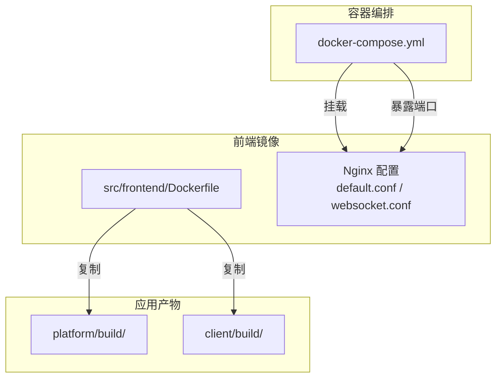
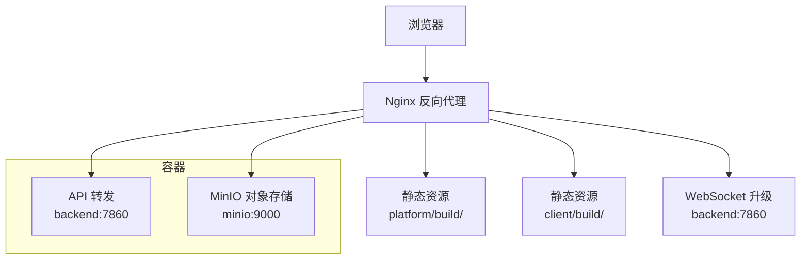
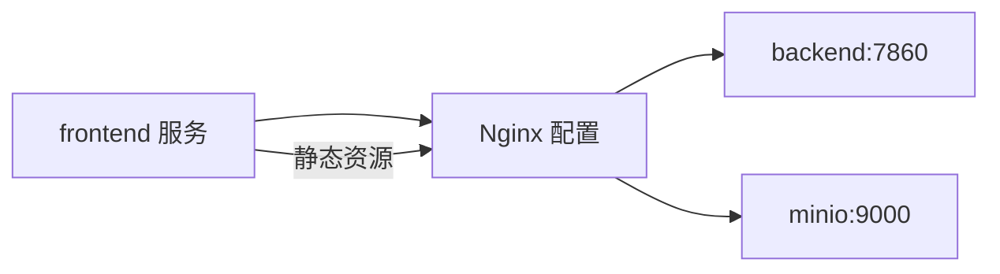

# 前端服务容器化

<cite>
**本文引用的文件**
- [docker/nginx/nginx.conf](file://docker/nginx/nginx.conf)
- [docker/nginx/conf.d/default.conf](file://docker/nginx/conf.d/default.conf)
- [docker/nginx/conf.d/websocket.conf](file://docker/nginx/conf.d/websocket.conf)
- [src/frontend/Dockerfile](file://src/frontend/Dockerfile)
- [src/frontend/nginx.conf](file://src/frontend/nginx.conf)
- [docker/docker-compose.yml](file://docker/docker-compose.yml)
- [src/frontend/client/package.json](file://src/frontend/client/package.json)
- [src/frontend/platform/package.json](file://src/frontend/platform/package.json)
- [src/frontend/client/vite.config.ts](file://src/frontend/client/vite.config.ts)
- [src/frontend/platform/vite.config.mts](file://src/frontend/platform/vite.config.mts)
</cite>

## 目录
1. [简介](#简介)
2. [项目结构](#项目结构)
3. [核心组件](#核心组件)
4. [架构总览](#架构总览)
5. [组件详解](#组件详解)
6. [依赖关系分析](#依赖关系分析)
7. [性能优化建议](#性能优化建议)
8. [故障排查指南](#故障排查指南)
9. [结论](#结论)
10. [附录](#附录)

## 简介
本文件面向运维与开发团队，系统性阐述 Bisheng 前端服务的容器化方案，重点覆盖以下方面：
- Nginx 反向代理配置设计：静态资源服务、API 转发、WebSocket 支持与缓存策略
- 前端应用容器化部署：多阶段构建、产物复制、Nginx 配置注入与版本管理
- Nginx 配置文件结构：默认站点、WebSocket 升级映射、CORS 与安全头
- 前端与后端通信机制：代理转发、跨域与认证传递
- 性能优化：gzip 压缩、缓存头、资源压缩与分块策略
- 运维日志分析与故障排除方法

## 项目结构
Bisheng 前端由两套独立的单页应用组成（platform 与 client），通过 Nginx 提供统一入口与反向代理。容器化采用双阶段构建：Node 构建产物 → Nginx 镜像，再由 docker-compose 编排运行。

图表来源
- [docker/docker-compose.yml](file://docker/docker-compose.yml#L110-L123)
- [src/frontend/Dockerfile](file://src/frontend/Dockerfile#L8-L12)
- [docker/nginx/conf.d/default.conf](file://docker/nginx/conf.d/default.conf#L19-L65)
- [docker/nginx/conf.d/websocket.conf](file://docker/nginx/conf.d/websocket.conf#L17-L29)

章节来源
- [docker/docker-compose.yml](file://docker/docker-compose.yml#L110-L123)
- [src/frontend/Dockerfile](file://src/frontend/Dockerfile#L1-L12)

## 核心组件
- Nginx 默认站点与静态资源服务：分别服务 platform 与 client 的构建产物，并对 index.html 设置无缓存头以避免浏览器缓存。
- API 与 MinIO 资源转发：统一将 /api 与 /bisheng、/tmp-dir 请求转发至后端与 MinIO。
- WebSocket 支持：通过升级映射与代理头实现长连接。
- 前端构建与分发：多阶段 Dockerfile 将平台与客户端构建产物复制到 Nginx 静态目录。
- 容器编排：docker-compose 暴露前端端口并挂载 Nginx 配置。

章节来源
- [docker/nginx/conf.d/default.conf](file://docker/nginx/conf.d/default.conf#L19-L65)
- [docker/nginx/conf.d/websocket.conf](file://docker/nginx/conf.d/websocket.conf#L17-L29)
- [src/frontend/Dockerfile](file://src/frontend/Dockerfile#L8-L12)
- [docker/docker-compose.yml](file://docker/docker-compose.yml#L110-L123)

## 架构总览
下图展示从浏览器到后端与 MinIO 的完整请求链路，以及 Nginx 的静态资源与代理职责。

图表来源
- [docker/nginx/conf.d/default.conf](file://docker/nginx/conf.d/default.conf#L21-L65)
- [docker/nginx/conf.d/websocket.conf](file://docker/nginx/conf.d/websocket.conf#L17-L29)
- [docker/docker-compose.yml](file://docker/docker-compose.yml#L41-L66)
- [docker/docker-compose.yml](file://docker/docker-compose.yml#L156-L174)

## 组件详解

### Nginx 默认站点与静态资源
- 站点监听与 gzip：在默认站点中启用 gzip 压缩与基础类型，提升传输效率。
- 平台与工作区路径：
  - / 根路径指向 platform 构建产物，使用 try_files 回退到 index.html，确保 SPA 路由生效；对 /index.html 设置严格的无缓存头。
  - /workspace/ 指向 client 构建产物，同样回退到 /workspace/index.html。
- 安全头：统一添加 X-Frame-Options SAMEORIGIN，降低点击劫持风险。

章节来源
- [docker/nginx/conf.d/default.conf](file://docker/nginx/conf.d/default.conf#L19-L32)
- [docker/nginx/conf.d/default.conf](file://docker/nginx/conf.d/default.conf#L34-L44)

### API 转发与认证传递
- 路由规则：/api 与 /workspace/api 统一转发至 backend:7860。
- 关键代理头：
  - Host、X-Real-IP、X-Forwarded-For 用于后端识别真实来源。
  - Upgrade 与 Connection 用于 WebSocket 升级。
  - proxy_http_version 1.1 保证长连接。
  - client_max_body_size 控制上传大小。
- CORS 头：为 API 响应添加 Access-Control-Allow-Origin，便于前端跨域访问。

章节来源
- [docker/nginx/conf.d/default.conf](file://docker/nginx/conf.d/default.conf#L46-L59)

### MinIO 对象存储直连
- 路由规则：/bisheng 与 /tmp-dir 直接转发至 minio:9000，用于文件上传与下载。
- 与 API 路由配合，形成统一的前端资源访问入口。

章节来源
- [docker/nginx/conf.d/default.conf](file://docker/nginx/conf.d/default.conf#L61-L65)

### WebSocket 支持
- 升级映射：通过 map $http_upgrade $connection_upgrade 实现 Upgrade/Connection 头的正确传递。
- 代理头：在 /api 下开启 proxy_set_header Upgrade 与 Connection，配合 proxy_http_version 1.1。
- 超时与大小：proxy_read_timeout 与 client_max_body_size 适配长连接与大文件场景。

章节来源
- [docker/nginx/conf.d/default.conf](file://docker/nginx/conf.d/default.conf#L3-L6)
- [docker/nginx/conf.d/default.conf](file://docker/nginx/conf.d/default.conf#L53-L56)
- [docker/nginx/conf.d/websocket.conf](file://docker/nginx/conf.d/websocket.conf#L3-L6)
- [docker/nginx/conf.d/websocket.conf](file://docker/nginx/conf.d/websocket.conf#L20-L28)

### 前端容器化与构建优化
- 多阶段构建：
  - 第一阶段：使用 node:20-alpine 安装依赖并构建 platform 与 client。
  - 第二阶段：基于官方 Nginx 镜像，将两个构建产物复制到 /usr/share/nginx/html/platform 与 /usr/share/nginx/html/client。
  - 最终将宿主 Nginx 配置复制到 /etc/nginx/conf.d/default.conf 注入运行时。
- 版本管理：
  - 前端镜像标签使用 v2.4.0-beta1，便于追踪与回滚。
  - docker-compose 中 frontend 服务映射宿主 Nginx 配置，便于热更新或调试。

章节来源
- [src/frontend/Dockerfile](file://src/frontend/Dockerfile#L1-L12)
- [docker/docker-compose.yml](file://docker/docker-compose.yml#L110-L123)

### 前端与后端通信机制
- 开发期代理：
  - platform/vite.config.mts 配置了 API 与文件服务的代理，支持 ws 与 withCredentials，便于本地联调。
  - client/vite.config.ts 针对 /workspace 前缀进行路径重写，确保与生产环境一致。
- 生产期转发：
  - Nginx 将 /api 与 /workspace/api 转发至 backend:7860，保持 Host、X-Real-IP、X-Forwarded-For 等头部，保障后端鉴权与审计。
  - MinIO 路由直连，避免额外中间层。

章节来源
- [src/frontend/platform/vite.config.mts](file://src/frontend/platform/vite.config.mts#L16-L48)
- [src/frontend/client/vite.config.ts](file://src/frontend/client/vite.config.ts#L32-L62)
- [docker/nginx/conf.d/default.conf](file://docker/nginx/conf.d/default.conf#L46-L59)
- [docker/nginx/conf.d/default.conf](file://docker/nginx/conf.d/default.conf#L61-L65)

### Nginx 配置文件结构
- 主配置：定义日志格式、access_log、keepalive_timeout、include 子配置等。
- 默认站点：包含 gzip、静态资源根目录、try_files、CORS 与安全头、API/MinIO 转发。
- WebSocket 配置：独立 server 块，复用升级映射与代理头，适配高并发长连接。

章节来源
- [docker/nginx/nginx.conf](file://docker/nginx/nginx.conf#L14-L32)
- [docker/nginx/conf.d/default.conf](file://docker/nginx/conf.d/default.conf#L1-L65)
- [docker/nginx/conf.d/websocket.conf](file://docker/nginx/conf.d/websocket.conf#L1-L29)

## 依赖关系分析
- 组件耦合：
  - Nginx 依赖后端与 MinIO 的可达性；API 与 MinIO 路由需与后端/对象存储端口一致。
  - 前端镜像与 docker-compose 的卷挂载关系决定 Nginx 配置的可热更新能力。
- 外部依赖：
  - 后端服务 backend:7860
  - 对象存储 minio:9000
  - MySQL、Redis、Elasticsearch、Milvus 等（非前端直接依赖）

图表来源
- [docker/docker-compose.yml](file://docker/docker-compose.yml#L110-L123)
- [docker/nginx/conf.d/default.conf](file://docker/nginx/conf.d/default.conf#L46-L65)

章节来源
- [docker/docker-compose.yml](file://docker/docker-compose.yml#L110-L123)
- [docker/nginx/conf.d/default.conf](file://docker/nginx/conf.d/default.conf#L46-L65)

## 性能优化建议
- Nginx 层面
  - 启用 gzip：已在默认站点启用，可按需扩展 gzip_types 以覆盖更多文本资源。
  - 缓存策略：对静态资源文件名带哈希的产物设置长期缓存头；对 index.html 保持无缓存。
  - keepalive：维持合理的 keepalive_timeout，减少握手开销。
  - 传输优化：根据带宽与延迟调整 proxy_read_timeout 与 client_max_body_size。
- 构建层面
  - 分块与懒加载：利用 Vite/Rollup 的 manualChunks 与动态 import，拆分 vendor 与业务代码。
  - 压缩与体积控制：启用 vite-plugin-compression2，合理设置阈值；关注 chunkSizeWarningLimit。
  - 资源内联：对小资源进行内联或静态复制，减少请求数量。
- 运行层面
  - CDN/边缘缓存：对静态资源走 CDN，减轻 Nginx 压力。
  - 并发与超时：结合业务峰值流量调整 worker_connections 与代理超时参数。

章节来源
- [docker/nginx/conf.d/default.conf](file://docker/nginx/conf.d/default.conf#L10-L17)
- [src/frontend/client/vite.config.ts](file://src/frontend/client/vite.config.ts#L129-L131)
- [src/frontend/client/vite.config.ts](file://src/frontend/client/vite.config.ts#L153-L305)
- [src/frontend/platform/vite.config.mts](file://src/frontend/platform/vite.config.mts#L65-L93)

## 故障排查指南
- 访问 404 或路由异常
  - 检查 try_files 是否正确回退到 index.html 或 /workspace/index.html。
  - 确认 /workspace 前缀是否与前端构建 base 一致。
- API 403/CORS 错误
  - 核对 Access-Control-Allow-Origin 是否与前端期望一致。
  - 确认后端是否要求特定认证头（如 Authorization）随请求转发。
- WebSocket 连接失败
  - 确认 Upgrade/Connection 头已正确传递。
  - 检查 proxy_http_version 1.1 与 proxy_read_timeout 是否足够。
- 静态资源无法加载
  - 确认 Dockerfile 已将构建产物复制到对应目录。
  - 检查 docker-compose 是否正确挂载 Nginx 配置。
- 日志分析
  - Nginx 访问日志与错误日志位于 /var/log/nginx/，结合请求路径与状态码定位问题。
  - 关注代理上游（backend/minio）返回的状态与响应头。

章节来源
- [docker/nginx/conf.d/default.conf](file://docker/nginx/conf.d/default.conf#L30-L31)
- [docker/nginx/conf.d/default.conf](file://docker/nginx/conf.d/default.conf#L46-L59)
- [docker/nginx/conf.d/websocket.conf](file://docker/nginx/conf.d/websocket.conf#L17-L29)
- [docker/nginx/nginx.conf](file://docker/nginx/nginx.conf#L18-L22)
- [docker/docker-compose.yml](file://docker/docker-compose.yml#L117-L120)

## 结论
本文档从架构、配置、构建与运维四个维度梳理了 Bisheng 前端服务容器化方案。通过 Nginx 的静态资源服务、API 与 MinIO 转发、WebSocket 支持与多阶段构建，实现了稳定高效的前端交付与运行。建议在生产环境中进一步完善缓存策略、监控告警与灰度发布流程，持续优化用户体验与系统稳定性。

## 附录
- 版本与镜像
  - 前端镜像标签：v2.4.0-beta1
  - Nginx 配置挂载：frontend 服务挂载宿主 /etc/nginx/nginx.conf 与 /etc/nginx/conf.d
- 关键端口
  - 前端：3001
  - 后端：7860
  - MinIO：9000/9001

章节来源
- [docker/docker-compose.yml](file://docker/docker-compose.yml#L110-L123)
- [docker/nginx/conf.d/default.conf](file://docker/nginx/conf.d/default.conf#L19-L29)
- [docker/docker-compose.yml](file://docker/docker-compose.yml#L41-L66)
- [docker/docker-compose.yml](file://docker/docker-compose.yml#L156-L174)