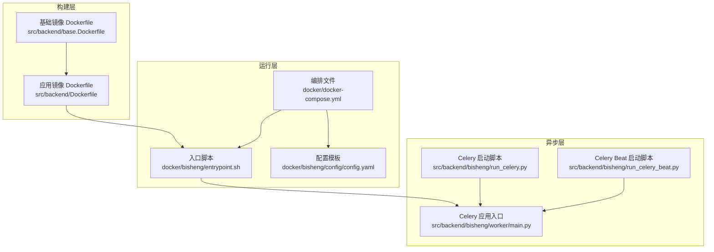
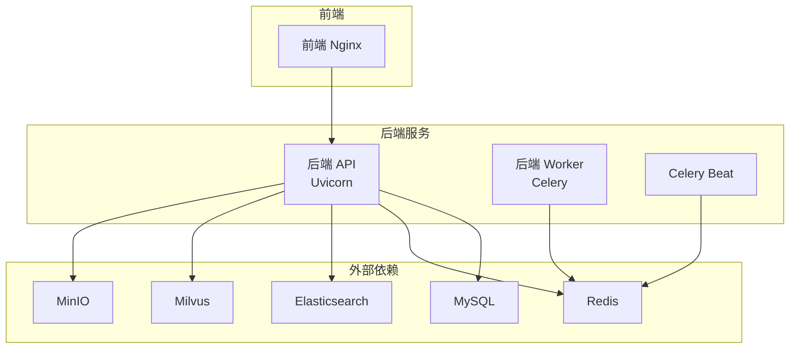
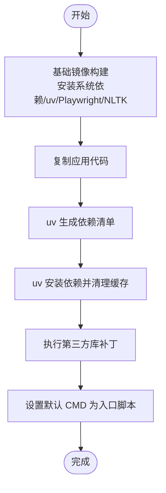
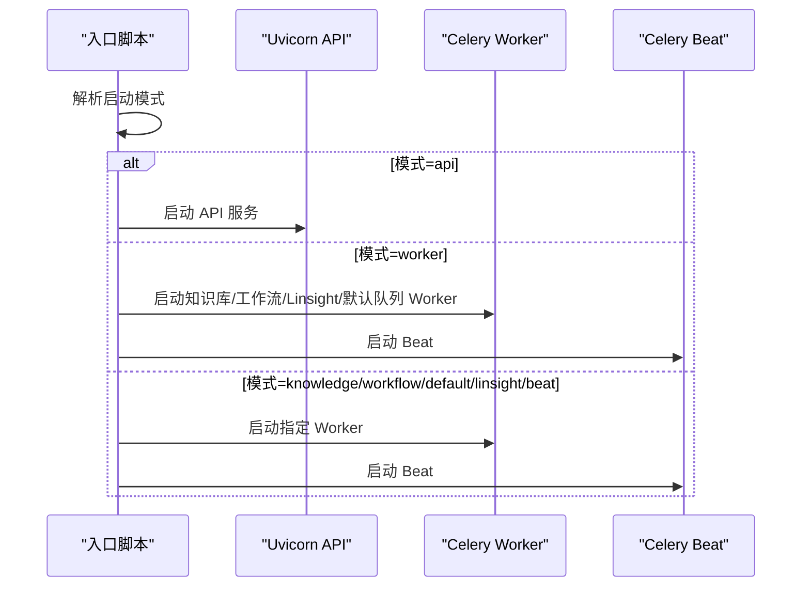
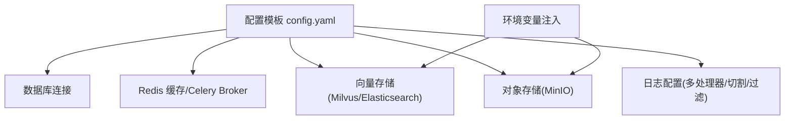
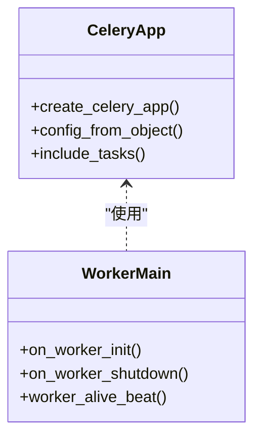
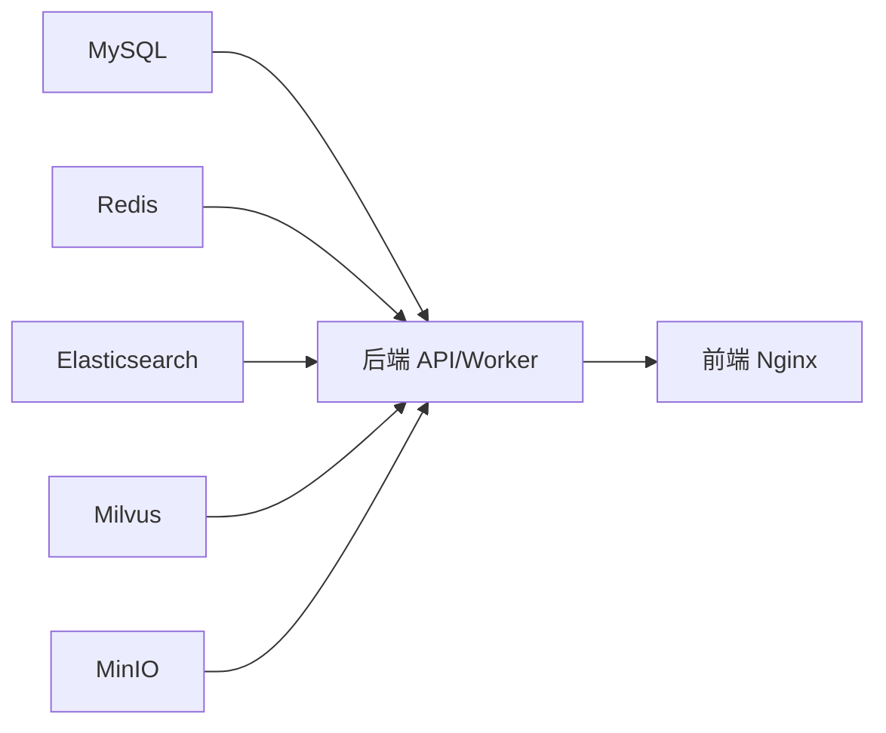

# 后端服务容器化

<cite>
**本文引用的文件**
- [src/backend/Dockerfile](file://src/backend/Dockerfile)
- [src/backend/base.Dockerfile](file://src/backend/base.Dockerfile)
- [docker/bisheng/entrypoint.sh](file://docker/bisheng/entrypoint.sh)
- [docker/bisheng/config/config.yaml](file://docker/bisheng/config/config.yaml)
- [docker/docker-compose.yml](file://docker/docker-compose.yml)
- [docker/docker-compose-uns.yml](file://docker/docker-compose-uns.yml)
- [docker/docker-compose-ft.yml](file://docker/docker-compose-ft.yml)
- [src/backend/bisheng/worker/main.py](file://src/backend/bisheng/worker/main.py)
- [src/backend/bisheng/run_celery.py](file://src/backend/bisheng/run_celery.py)
- [src/backend/bisheng/run_celery_beat.py](file://src/backend/bisheng/run_celery_beat.py)
</cite>

## 目录
1. [简介](#简介)
2. [项目结构](#项目结构)
3. [核心组件](#核心组件)
4. [架构总览](#架构总览)
5. [详细组件分析](#详细组件分析)
6. [依赖关系分析](#依赖关系分析)
7. [性能考虑](#性能考虑)
8. [故障排查指南](#故障排查指南)
9. [结论](#结论)
10. [附录](#附录)

## 简介
本文件面向 Bisheng 后端服务的容器化部署，系统性阐述以下主题：
- Dockerfile 多阶段构建：基础镜像选择、依赖安装策略与运行时优化
- 容器启动脚本执行流程：入口参数、环境变量注入、配置挂载与服务启动顺序
- 配置管理：数据库、缓存、向量存储、对象存储与日志等
- Celery Worker 容器化：异步任务拆分、队列管理与心跳上报
- 资源限制、性能调优与安全加固建议
- 本地开发与调试的容器化环境配置方法

## 项目结构
后端容器化相关的关键文件分布如下：
- 构建层：基础镜像与应用镜像的 Dockerfile
- 运行层：入口脚本、Compose 编排与配置模板
- 异步层：Celery 应用与任务路由

图表来源
- [src/backend/base.Dockerfile](file://src/backend/base.Dockerfile#L1-L61)
- [src/backend/Dockerfile](file://src/backend/Dockerfile#L1-L19)
- [docker/docker-compose.yml](file://docker/docker-compose.yml#L1-L201)
- [docker/bisheng/entrypoint.sh](file://docker/bisheng/entrypoint.sh#L1-L67)
- [docker/bisheng/config/config.yaml](file://docker/bisheng/config/config.yaml#L1-L88)
- [src/backend/bisheng/worker/main.py](file://src/backend/bisheng/worker/main.py#L1-L69)
- [src/backend/bisheng/run_celery.py](file://src/backend/bisheng/run_celery.py#L1-L13)
- [src/backend/bisheng/run_celery_beat.py](file://src/backend/bisheng/run_celery_beat.py#L1-L12)

章节来源
- [src/backend/base.Dockerfile](file://src/backend/base.Dockerfile#L1-L61)
- [src/backend/Dockerfile](file://src/backend/Dockerfile#L1-L19)
- [docker/docker-compose.yml](file://docker/docker-compose.yml#L1-L201)
- [docker/bisheng/entrypoint.sh](file://docker/bisheng/entrypoint.sh#L1-L67)
- [docker/bisheng/config/config.yaml](file://docker/bisheng/config/config.yaml#L1-L88)
- [src/backend/bisheng/worker/main.py](file://src/backend/bisheng/worker/main.py#L1-L69)
- [src/backend/bisheng/run_celery.py](file://src/backend/bisheng/run_celery.py#L1-L13)
- [src/backend/bisheng/run_celery_beat.py](file://src/backend/bisheng/run_celery_beat.py#L1-L12)

## 核心组件
- 基础镜像构建：在 slim 基础上安装系统依赖、FFmpeg、Pandoc、uv、Playwright 等，预编译并安装 Python 依赖，提升后续构建效率与运行稳定性
- 应用镜像构建：基于基础镜像，拷贝项目代码，使用 uv 生成并安装依赖，打补丁以适配第三方库，设置默认 CMD
- 入口脚本：统一入口，支持多种启动模式（API、Worker、Beat、Linsight 等），按需启动 Uvicorn 或 Celery 子进程
- 配置管理：通过 YAML 模板集中管理数据库、Redis、Celery、向量存储、对象存储与日志；支持环境变量注入
- Celery 异步层：定义任务路由与队列，提供心跳上报、生命周期钩子与多类 Worker 并行执行

章节来源
- [src/backend/base.Dockerfile](file://src/backend/base.Dockerfile#L1-L61)
- [src/backend/Dockerfile](file://src/backend/Dockerfile#L1-L19)
- [docker/bisheng/entrypoint.sh](file://docker/bisheng/entrypoint.sh#L1-L67)
- [docker/bisheng/config/config.yaml](file://docker/bisheng/config/config.yaml#L1-L88)
- [src/backend/bisheng/worker/main.py](file://src/backend/bisheng/worker/main.py#L1-L69)

## 架构总览
后端容器化由 Compose 统一编排，包含 MySQL、Redis、Elasticsearch、Milvus、MinIO、Nginx 前端与后端 API/Worker 服务。入口脚本根据启动模式选择不同的进程组合。

图表来源
- [docker/docker-compose.yml](file://docker/docker-compose.yml#L1-L201)
- [docker/bisheng/entrypoint.sh](file://docker/bisheng/entrypoint.sh#L32-L66)

章节来源
- [docker/docker-compose.yml](file://docker/docker-compose.yml#L1-L201)
- [docker/bisheng/entrypoint.sh](file://docker/bisheng/entrypoint.sh#L1-L67)

## 详细组件分析

### Dockerfile 多阶段构建
- 基础镜像（base.Dockerfile）
  - 使用精简基础镜像，安装系统级依赖（编译工具、图形库、LibreOffice、FFmpeg、Pandoc）
  - 使用 uv 预编译并安装 Python 依赖，清理缓存，减少镜像体积
  - 安装 NLTK 数据与 Playwright Chromium，确保运行期能力完整
- 应用镜像（Dockerfile）
  - 基于基础镜像，复制项目代码，使用 uv 生成并安装依赖
  - 执行补丁命令以兼容第三方库
  - 设置默认 CMD 为入口脚本，便于统一启动

图表来源
- [src/backend/base.Dockerfile](file://src/backend/base.Dockerfile#L1-L61)
- [src/backend/Dockerfile](file://src/backend/Dockerfile#L1-L19)

章节来源
- [src/backend/base.Dockerfile](file://src/backend/base.Dockerfile#L1-L61)
- [src/backend/Dockerfile](file://src/backend/Dockerfile#L1-L19)

### 容器启动脚本执行流程
入口脚本支持多种启动模式，按模式选择不同的进程组合：
- api：启动 Uvicorn API 服务
- worker：同时启动知识库、工作流、Linsight 与默认队列的 Celery Worker，并启动 Beat
- knowledge/workflow/default/linsight/beat：分别启动对应子任务 Worker 或 Beat

图表来源
- [docker/bisheng/entrypoint.sh](file://docker/bisheng/entrypoint.sh#L6-L66)

章节来源
- [docker/bisheng/entrypoint.sh](file://docker/bisheng/entrypoint.sh#L1-L67)

### 配置管理
- 数据库连接：通过加密的连接串指向 MySQL
- 缓存与 Celery Broker：Redis 地址与集群/哨兵模式配置示例
- 向量存储：Milvus 与 Elasticsearch 的连接参数通过环境变量注入
- 对象存储：MinIO 的 schema、证书校验、endpoint、密钥与公共/临时桶配置
- 日志：多处理器配置，支持文件切割与过滤

图表来源
- [docker/bisheng/config/config.yaml](file://docker/bisheng/config/config.yaml#L1-L88)

章节来源
- [docker/bisheng/config/config.yaml](file://docker/bisheng/config/config.yaml#L1-L88)

### Celery Worker 容器化部署
- 应用入口：创建 Celery 实例，加载配置，注册信号钩子
- 心跳机制：Worker 初始化后启动心跳线程，周期性将存活时间戳写入 Redis 哈希
- 队列与路由：通过配置将不同类型任务路由至不同队列（知识库、工作流、默认）
- 启动方式：入口脚本按模式启动 Worker/Beat；也可通过独立脚本直接启动

图表来源
- [src/backend/bisheng/worker/main.py](file://src/backend/bisheng/worker/main.py#L1-L69)

章节来源
- [src/backend/bisheng/worker/main.py](file://src/backend/bisheng/worker/main.py#L1-L69)
- [docker/bisheng/entrypoint.sh](file://docker/bisheng/entrypoint.sh#L8-L30)
- [src/backend/bisheng/run_celery.py](file://src/backend/bisheng/run_celery.py#L1-L13)
- [src/backend/bisheng/run_celery_beat.py](file://src/backend/bisheng/run_celery_beat.py#L1-L12)

## 依赖关系分析
- Compose 服务依赖健康检查，确保 MySQL、Redis 就绪后再启动后端
- 后端 API 依赖 MySQL、Redis、Elasticsearch、Milvus、MinIO
- Worker/Beat 依赖 Redis 作为 Broker
- 前端 Nginx 依赖后端 API 提供接口

图表来源
- [docker/docker-compose.yml](file://docker/docker-compose.yml#L1-L201)

章节来源
- [docker/docker-compose.yml](file://docker/docker-compose.yml#L1-L201)

## 性能考虑
- 依赖安装优化：使用 uv 预编译与系统安装，避免重复下载与缓存膨胀
- 运行时并发：Uvicorn 多进程与 Celery 多队列并行，结合线程池与队列隔离
- 资源预留：Milvus、MinIO、FT 服务可通过 Compose 的资源限制与 GPU 设备保留进行约束
- 日志切割：按天轮转与分级过滤，降低磁盘 IO 与日志体积

## 故障排查指南
- 健康检查失败
  - 后端 API：确认健康端点可达，检查依赖服务状态
  - Redis/Mysql/Milvus/MinIO：查看健康检查命令返回
- 启动模式错误
  - 入口脚本仅支持指定模式，确认传参正确
- Celery 任务堆积
  - 检查队列路由与 Worker 数量，确认 Beat 正常运行
  - 查看 Redis 中 Worker 存活键是否更新

章节来源
- [docker/docker-compose.yml](file://docker/docker-compose.yml#L67-L77)
- [docker/bisheng/entrypoint.sh](file://docker/bisheng/entrypoint.sh#L63-L66)
- [src/backend/bisheng/worker/main.py](file://src/backend/bisheng/worker/main.py#L33-L47)

## 结论
该容器化方案通过基础镜像预装运行期依赖、应用镜像统一打包与入口脚本统一启动，实现了后端服务的快速部署与稳定运行。配合 Celery 多队列与心跳机制，满足异步任务的高可用与可观测性。通过 Compose 编排与环境变量注入，实现配置即插即用与跨环境一致性。

## 附录

### 本地开发与调试
- 使用 Compose 启动完整栈，映射必要端口与卷
- 在入口脚本中切换启动模式（如 api、worker），验证服务链路
- 通过环境变量覆盖配置模板中的敏感项与外部服务地址
- 使用独立的 FT/Unstructured 服务编排文件进行专项调试

章节来源
- [docker/docker-compose.yml](file://docker/docker-compose.yml#L1-L201)
- [docker/docker-compose-ft.yml](file://docker/docker-compose-ft.yml#L1-L31)
- [docker/docker-compose-uns.yml](file://docker/docker-compose-uns.yml#L1-L22)
- [docker/bisheng/entrypoint.sh](file://docker/bisheng/entrypoint.sh#L1-L67)