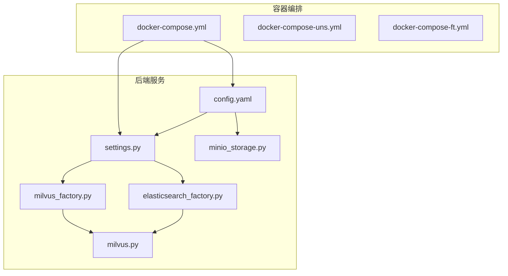
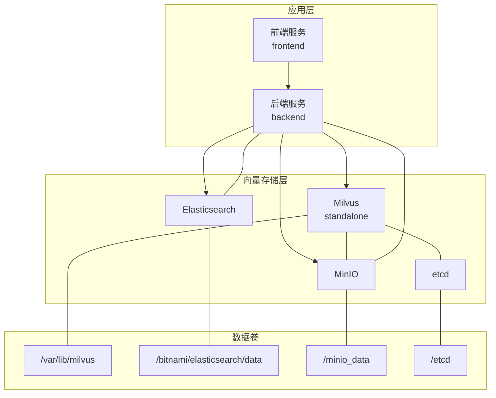
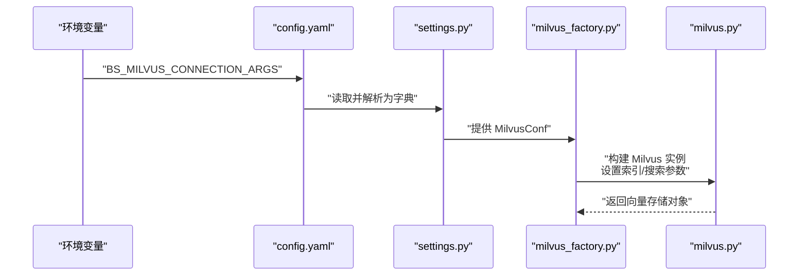
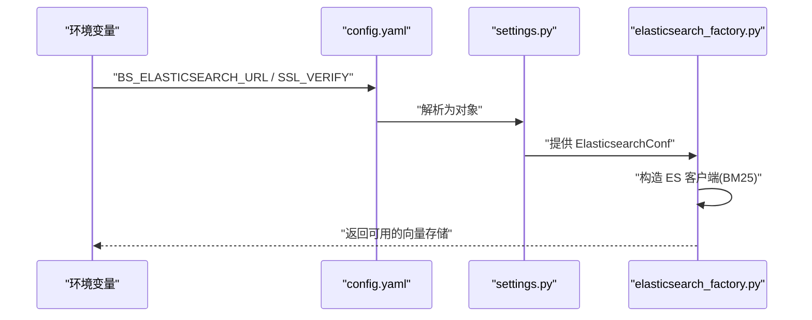
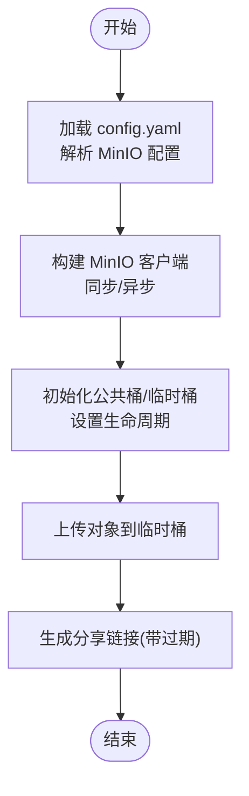
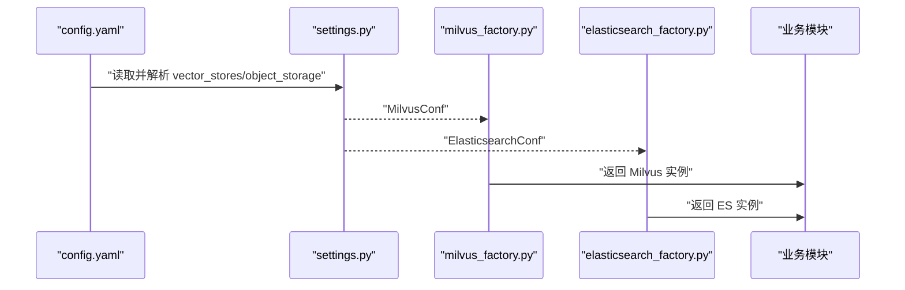
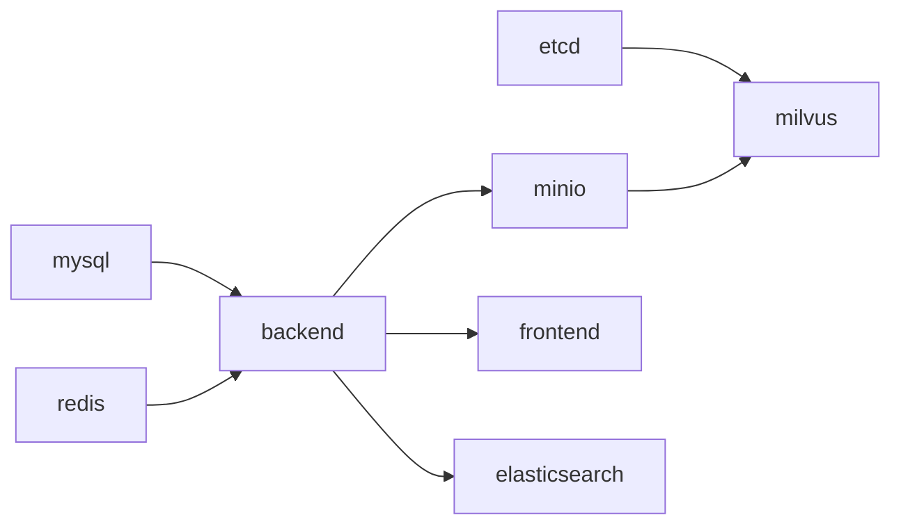

# 向量存储服务

<cite>
**本文引用的文件**   
- [docker-compose.yml](file://docker/docker-compose.yml)
- [config.yaml](file://docker/bisheng/config/config.yaml)
- [settings.py](file://src/backend/bisheng/core/config/settings.py)
- [milvus_factory.py](file://src/backend/bisheng/knowledge/rag/milvus_factory.py)
- [elasticsearch_factory.py](file://src/backend/bisheng/knowledge/rag/elasticsearch_factory.py)
- [milvus.py](file://src/backend/bisheng_langchain/vectorstores/milvus.py)
- [custom.py](file://src/backend/bisheng/interface/vector_store/custom.py)
- [minio_storage.py](file://src/backend/bisheng/core/storage/minio/minio_storage.py)
- [base_executor.py](file://src/backend/bisheng_langchain/gpts/tools/code_interpreter/base_executor.py)
- [vectorstore_metadata.py](file://src/backend/bisheng/common/constants/vectorstore_metadata.py)
- [docker-compose-uns.yml](file://docker/docker-compose-uns.yml)
- [docker-compose-ft.yml](file://docker/docker-compose-ft.yml)
</cite>

## 目录
1. [简介](#简介)
2. [项目结构](#项目结构)
3. [核心组件](#核心组件)
4. [架构总览](#架构总览)
5. [组件详解](#组件详解)
6. [依赖关系分析](#依赖关系分析)
7. [性能与调优](#性能与调优)
8. [运维与监控](#运维与监控)
9. [故障排查](#故障排查)
10. [结论](#结论)
11. [附录](#附录)

## 简介
本文件面向运维与开发人员，系统性梳理 Bisheng 在容器化场景下的向量存储服务部署与集成方案。重点覆盖：
- Milvus 向量数据库的 standalone 容器化部署、etcd 依赖与数据卷挂载
- Elasticsearch 的容器化配置、索引映射与安全认证
- MinIO 对象存储的容器化部署、桶与密钥配置、API/控制台端点
- 向量存储与应用服务的连接参数、初始化流程与故障转移思路
- 性能调优（索引、查询、存储空间）
- 监控、备份恢复与容量规划实践

## 项目结构
本仓库采用“后端服务 + 前端 + 容器编排”的组织方式，向量存储相关的关键位置如下：
- 容器编排：docker/docker-compose.yml 定义了 MySQL、Redis、后端、前端、Elasticsearch、etcd、MinIO、Milvus 等服务及其依赖关系
- 应用配置：docker/bisheng/config/config.yaml 提供向量存储与对象存储的运行时配置入口
- 配置解析与校验：src/backend/bisheng/core/config/settings.py 将 YAML 中的环境变量转换为强类型配置
- 向量存储工厂：milvus_factory.py、elasticsearch_factory.py 负责按配置初始化 Milvus 与 ES 客户端
- 向量存储实现：src/backend/bisheng_langchain/vectorstores/milvus.py 提供 Milvus 的具体封装
- MinIO 存储：src/backend/bisheng/core/storage/minio/minio_storage.py 提供 MinIO 的同步/异步客户端与分享链接生成
- 元数据字段：src/backend/bisheng/common/constants/vectorstore_metadata.py 定义知识库向量索引的元数据字段

**图表来源**
- [docker-compose.yml](file://docker/docker-compose.yml#L1-L201)
- [config.yaml](file://docker/bisheng/config/config.yaml#L34-L57)
- [settings.py](file://src/backend/bisheng/core/config/settings.py#L73-L114)
- [milvus_factory.py](file://src/backend/bisheng/knowledge/rag/milvus_factory.py#L13-L60)
- [elasticsearch_factory.py](file://src/backend/bisheng/knowledge/rag/elasticsearch_factory.py#L44-L80)
- [milvus.py](file://src/backend/bisheng_langchain/vectorstores/milvus.py#L123-L184)
- [minio_storage.py](file://src/backend/bisheng/core/storage/minio/minio_storage.py#L20-L43)

**章节来源**
- [docker-compose.yml](file://docker/docker-compose.yml#L1-L201)
- [config.yaml](file://docker/bisheng/config/config.yaml#L34-L57)

## 核心组件
- Milvus 向量数据库（standalone）
  - 通过 etcd 作为元数据与租约协调，通过 MinIO 提供对象存储（集合文件、备份等）
  - 默认以 standalone 模式运行，端口映射 19530（服务）、9091（健康检查）
- Elasticsearch
  - 提供关键词检索与 BM25 策略；支持 SSL 验证参数注入
- MinIO 对象存储
  - 提供同步/异步客户端、分享链接生成、生命周期规则（过期删除）
- 后端配置与工厂
  - settings.py 将 YAML 中的字符串配置转换为字典/对象
  - milvus_factory.py、elasticsearch_factory.py 根据配置构造向量存储实例
  - milvus.py 内置默认索引参数与搜索参数，支持自动降级为 AUTOINDEX
  - minio_storage.py 统一封装 MinIO 访问、桶初始化与分享链接

**章节来源**
- [settings.py](file://src/backend/bisheng/core/config/settings.py#L73-L114)
- [milvus_factory.py](file://src/backend/bisheng/knowledge/rag/milvus_factory.py#L10-L10)
- [milvus.py](file://src/backend/bisheng_langchain/vectorstores/milvus.py#L123-L184)
- [minio_storage.py](file://src/backend/bisheng/core/storage/minio/minio_storage.py#L20-L43)

## 架构总览
下图展示容器化部署中各组件的交互关系与数据流向。

**图表来源**
- [docker-compose.yml](file://docker/docker-compose.yml#L124-L201)
- [milvus.py](file://src/backend/bisheng_langchain/vectorstores/milvus.py#L123-L184)
- [minio_storage.py](file://src/backend/bisheng/core/storage/minio/minio_storage.py#L20-L43)

## 组件详解

### Milvus 容器化与 standalone 配置
- 服务定义
  - 使用镜像 milvusdb/milvus:v2.5.10，以 standalone 模式启动
  - 端口映射：19530（服务端口）、9091（健康检查）
  - 依赖 etcd 与 MinIO，通过环境变量传递 etcd 地址与 MinIO 地址
- etcd 依赖管理
  - etcd 作为独立容器，开启自动压缩、配额与快照计数
  - Milvus 通过 ETCD_ENDPOINTS 指定 etcd 地址
- 存储卷挂载
  - Milvus 数据目录映射至宿主机，确保重启不丢数据
- 连接参数与初始化
  - 后端通过环境变量 BS_MILVUS_CONNECTION_ARGS 注入连接参数（host/port/secure 等）
  - settings.py 将该字符串解析为字典，milvus_factory.py 读取并构造 Milvus 实例
  - milvus.py 内置默认索引参数（如 HNSW），并在失败时回退为 AUTOINDEX

**图表来源**
- [docker-compose.yml](file://docker/docker-compose.yml#L48-L50)
- [config.yaml](file://docker/bisheng/config/config.yaml#L36-L39)
- [settings.py](file://src/backend/bisheng/core/config/settings.py#L73-L78)
- [milvus_factory.py](file://src/backend/bisheng/knowledge/rag/milvus_factory.py#L17-L22)
- [milvus.py](file://src/backend/bisheng_langchain/vectorstores/milvus.py#L400-L428)

**章节来源**
- [docker-compose.yml](file://docker/docker-compose.yml#L176-L201)
- [config.yaml](file://docker/bisheng/config/config.yaml#L36-L39)
- [settings.py](file://src/backend/bisheng/core/config/settings.py#L73-L78)
- [milvus_factory.py](file://src/backend/bisheng/knowledge/rag/milvus_factory.py#L10-L10)
- [milvus.py](file://src/backend/bisheng_langchain/vectorstores/milvus.py#L123-L184)

### Elasticsearch 容器化与配置
- 服务定义
  - 使用 bitnamilegacy/elasticsearch:8.12.0，暴露 9200/9300 端口
  - 数据目录映射至宿主机
- 连接与安全
  - 后端通过 BS_ELASTICSEARCH_URL 设置 ES 地址
  - 通过 BS_ELASTICSEARCH_SSL_VERIFY 注入 SSL 验证参数（如 basic_auth）
  - settings.py 将字符串形式的 ssl_verify 解析为字典
- 初始化流程
  - elasticsearch_factory.py 从配置读取 URL 与 ssl_verify，构造 Elasticsearch/AsyncElasticsearch 客户端
  - 支持基于 BM25 的关键词检索策略

**图表来源**
- [docker-compose.yml](file://docker/docker-compose.yml#L51-L52)
- [config.yaml](file://docker/bisheng/config/config.yaml#L40-L42)
- [settings.py](file://src/backend/bisheng/core/config/settings.py#L81-L93)
- [elasticsearch_factory.py](file://src/backend/bisheng/knowledge/rag/elasticsearch_factory.py#L44-L80)

**章节来源**
- [docker-compose.yml](file://docker/docker-compose.yml#L124-L135)
- [config.yaml](file://docker/bisheng/config/config.yaml#L40-L42)
- [settings.py](file://src/backend/bisheng/core/config/settings.py#L81-L93)
- [elasticsearch_factory.py](file://src/backend/bisheng/knowledge/rag/elasticsearch_factory.py#L44-L80)

### MinIO 容器化与对象存储
- 服务定义
  - 使用 minio/minio:RELEASE.2023-03-20T20-16-18Z，暴露 9000/9001 端口
  - 环境变量设置访问密钥与私有密钥
  - 数据目录映射至宿主机
- 配置与使用
  - 后端通过 BS_MINIO_* 系列环境变量配置 schema/cert_check/endpoint/sharepoint/access_key/secret_key
  - config.yaml 中定义 public_bucket 与 tmp_bucket，并在 settings.py 中映射为 MinioConf
  - minio_storage.py 提供同步/异步客户端、生命周期规则、分享链接生成
  - base_executor.py 展示如何使用 MinIO 客户端上传对象并生成分享链接

**图表来源**
- [config.yaml](file://docker/bisheng/config/config.yaml#L45-L57)
- [settings.py](file://src/backend/bisheng/core/config/settings.py#L102-L114)
- [minio_storage.py](file://src/backend/bisheng/core/storage/minio/minio_storage.py#L20-L43)
- [base_executor.py](file://src/backend/bisheng_langchain/gpts/tools/code_interpreter/base_executor.py#L28-L58)

**章节来源**
- [docker-compose.yml](file://docker/docker-compose.yml#L156-L175)
- [config.yaml](file://docker/bisheng/config/config.yaml#L45-L57)
- [settings.py](file://src/backend/bisheng/core/config/settings.py#L102-L114)
- [minio_storage.py](file://src/backend/bisheng/core/storage/minio/minio_storage.py#L20-L43)
- [base_executor.py](file://src/backend/bisheng_langchain/gpts/tools/code_interpreter/base_executor.py#L28-L58)

### 向量存储与应用服务的集成
- 连接参数配置
  - 后端通过环境变量注入 Milvus/ES/MinIO 的连接信息
  - config.yaml 使用 !env 引用环境变量，settings.py 负责解析与校验
- 初始化流程
  - Milvus：milvus_factory.py 读取配置，构造 Milvus 实例，设置默认索引与搜索参数
  - Elasticsearch：elasticsearch_factory.py 读取配置，构造 ES 客户端与 BM25 策略
- 多租户分区
  - Milvus 支持 partition_key 字段用于多租户隔离，初始化时可按知识库 ID 设置分区键

**图表来源**
- [config.yaml](file://docker/bisheng/config/config.yaml#L35-L57)
- [settings.py](file://src/backend/bisheng/core/config/settings.py#L96-L114)
- [milvus_factory.py](file://src/backend/bisheng/knowledge/rag/milvus_factory.py#L17-L22)
- [elasticsearch_factory.py](file://src/backend/bisheng/knowledge/rag/elasticsearch_factory.py#L48-L59)

**章节来源**
- [config.yaml](file://docker/bisheng/config/config.yaml#L35-L57)
- [settings.py](file://src/backend/bisheng/core/config/settings.py#L96-L114)
- [milvus_factory.py](file://src/backend/bisheng/knowledge/rag/milvus_factory.py#L17-L22)
- [elasticsearch_factory.py](file://src/backend/bisheng/knowledge/rag/elasticsearch_factory.py#L48-L59)

## 依赖关系分析
- 容器依赖
  - Milvus 依赖 etcd 与 MinIO，需先于 Milvus 启动
  - 后端服务依赖 MySQL 与 Redis，且需等待其健康检查通过
  - 前端依赖后端服务
- 配置依赖
  - config.yaml 通过 !env 引用 docker-compose.yml 中的环境变量
  - settings.py 将字符串配置转换为对象，供工厂模块使用

**图表来源**
- [docker-compose.yml](file://docker/docker-compose.yml#L73-L77)
- [docker-compose.yml](file://docker/docker-compose.yml#L198-L200)
- [docker-compose.yml](file://docker/docker-compose.yml#L121-L122)

**章节来源**
- [docker-compose.yml](file://docker/docker-compose.yml#L73-L77)
- [docker-compose.yml](file://docker/docker-compose.yml#L121-L122)
- [docker-compose.yml](file://docker/docker-compose.yml#L198-L200)

## 性能与调优
- Milvus 索引与查询
  - 默认索引类型为 HNSW，支持自动降级为 AUTOINDEX
  - 搜索参数包含多种索引类型对应的 nprobe/ef/search_k 等参数，可根据数据规模与延迟目标调整
  - 支持按 partition_key 进行分区过滤，降低查询范围
- Elasticsearch 关键词检索
  - 使用 BM25 策略，metadata_mappings 支持文本/数值/布尔/JSON 等字段类型映射
  - 可结合 ssl_verify 参数启用安全连接
- 存储空间与生命周期
  - MinIO 支持生命周期规则（过期删除），建议为 tmp_bucket 配置合理的过期时间
  - 定期清理无用对象，避免存储膨胀
- 并发与资源
  - Milvus standalone 适合单节点场景；生产建议评估分片/副本与资源配额
  - ES 需关注分片数量与副本数，平衡查询吞吐与资源占用

**章节来源**
- [milvus.py](file://src/backend/bisheng_langchain/vectorstores/milvus.py#L123-L184)
- [milvus.py](file://src/backend/bisheng_langchain/vectorstores/milvus.py#L400-L428)
- [elasticsearch_factory.py](file://src/backend/bisheng/knowledge/rag/elasticsearch_factory.py#L10-L41)
- [minio_storage.py](file://src/backend/bisheng/core/storage/minio/minio_storage.py#L14-L14)

## 运维与监控
- 健康检查
  - Milvus：9091 健康检查端口
  - etcd：使用 etcdctl endpoint health
  - MinIO：9000 live 健康检查
  - 后端：/health 接口
- 监控指标
  - Milvus：可通过其健康检查与日志观察状态
  - ES：关注索引大小、文档数量、查询延迟
  - MinIO：对象数量、存储使用量、请求错误率
- 备份与恢复
  - Milvus：定期备份 /var/lib/milvus 数据目录
  - ES：快照到共享存储或对象存储
  - MinIO：对象版本化与跨区域复制（如需）
- 容量规划
  - 估算向量维度、索引类型与数据量，预留磁盘与内存
  - ES 分片数量与副本数随数据增长线性扩展
  - MinIO 桶数量与对象生命周期策略需与业务匹配

**章节来源**
- [docker-compose.yml](file://docker/docker-compose.yml#L189-L194)
- [docker-compose.yml](file://docker/docker-compose.yml#L150-L154)
- [docker-compose.yml](file://docker/docker-compose.yml#L170-L174)
- [docker-compose.yml](file://docker/docker-compose.yml#L67-L72)

## 故障排查
- Milvus 无法连接
  - 检查 ETCD_ENDPOINTS 是否指向 etcd:2379
  - 确认 MINIO_ADDRESS 指向 minio:9000
  - 查看健康检查端口 9091 与数据卷挂载
- Elasticsearch 无法访问
  - 校验 BS_ELASTICSEARCH_URL 与 ssl_verify 格式
  - 确认 ES 数据卷与端口映射
- MinIO 无法访问
  - 校验 ACCESS_KEY/SECRET_KEY 与端口映射
  - 检查数据卷与生命周期规则
- 后端健康检查失败
  - 等待 MySQL/Redis 健康后再启动后端
  - 检查 config.yaml 中的连接参数是否与环境变量一致

**章节来源**
- [docker-compose.yml](file://docker/docker-compose.yml#L182-L184)
- [docker-compose.yml](file://docker/docker-compose.yml#L189-L194)
- [docker-compose.yml](file://docker/docker-compose.yml#L150-L154)
- [docker-compose.yml](file://docker/docker-compose.yml#L170-L174)
- [docker-compose.yml](file://docker/docker-compose.yml#L67-L72)

## 结论
通过 docker-compose.yml 的统一编排，Bisheng 将 Milvus、Elasticsearch、MinIO、etcd 等向量存储与对象存储组件以容器化方式整合，配合 config.yaml 与 settings.py 的配置解析，实现了灵活的连接参数注入与初始化流程。在性能方面，Milvus 的索引与搜索参数、ES 的 BM25 策略以及 MinIO 的生命周期管理共同构成可扩展的向量检索与对象存储方案。运维层面，健康检查、监控与备份恢复策略是保障系统稳定性的关键。

## 附录
- 其他相关编排
  - unstructured 服务：bisheng-unstructured
  - 微调服务：bisheng-ft-server（GPU 设备）

**章节来源**
- [docker-compose-uns.yml](file://docker/docker-compose-uns.yml#L1-L22)
- [docker-compose-ft.yml](file://docker/docker-compose-ft.yml#L1-L31)