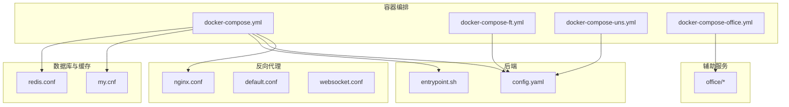
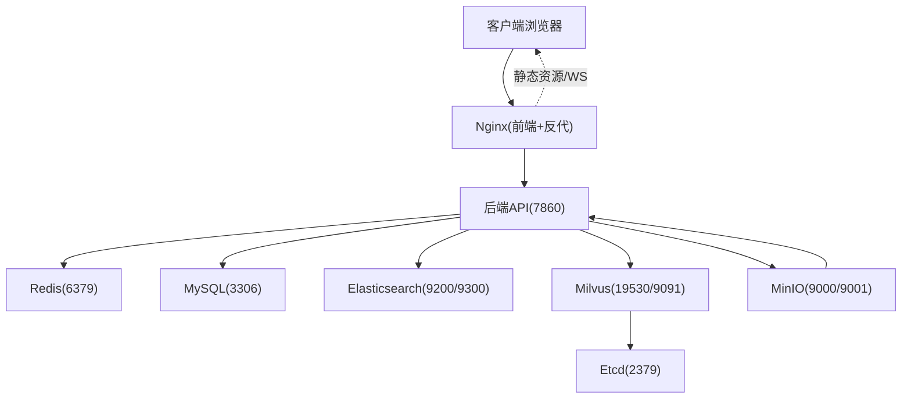
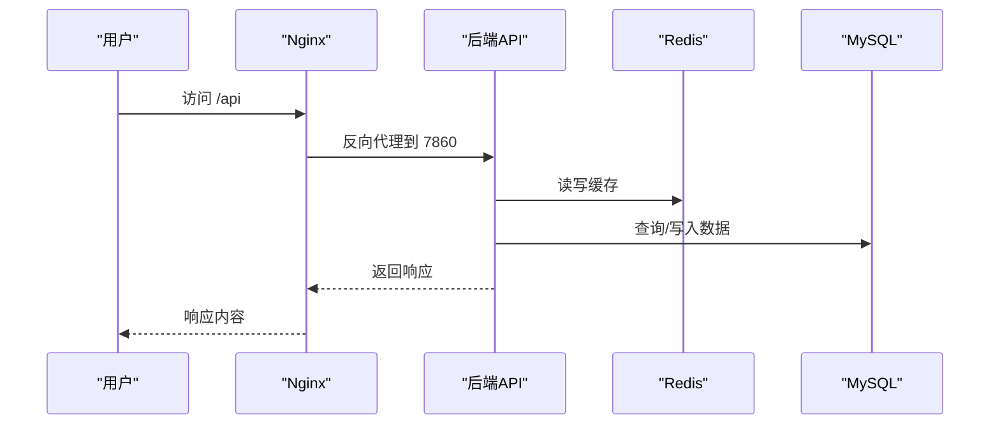
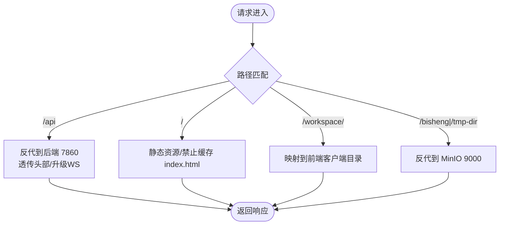
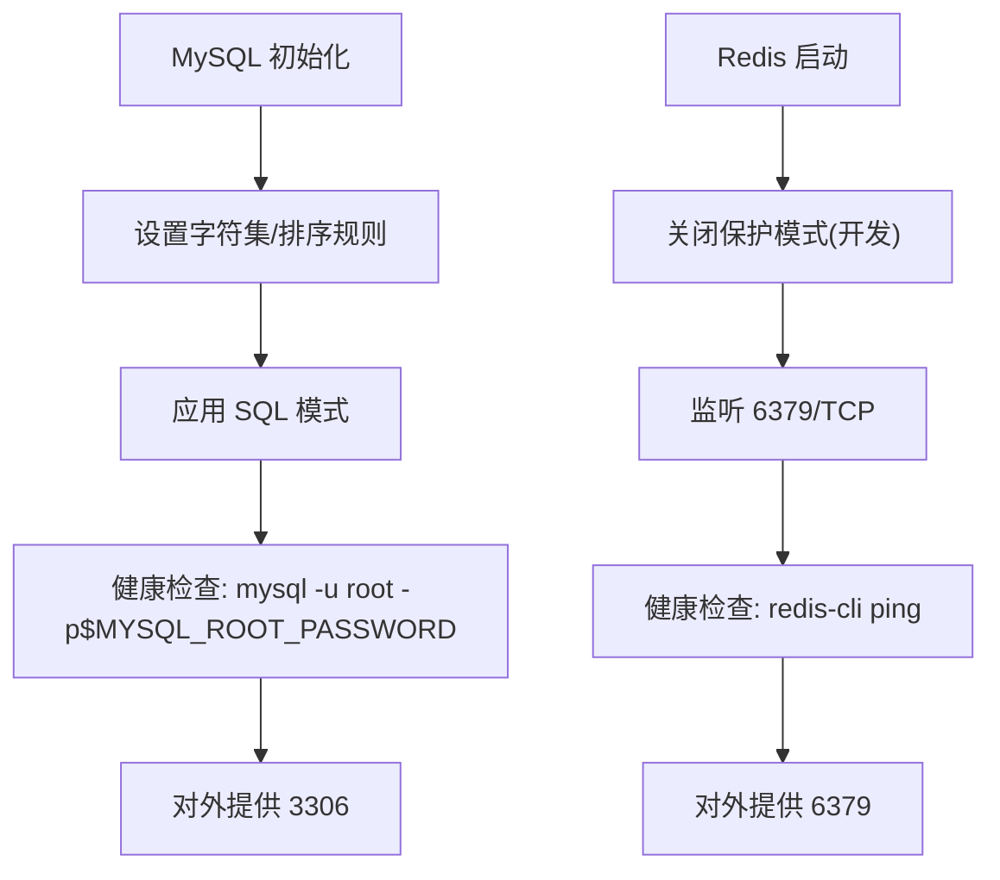
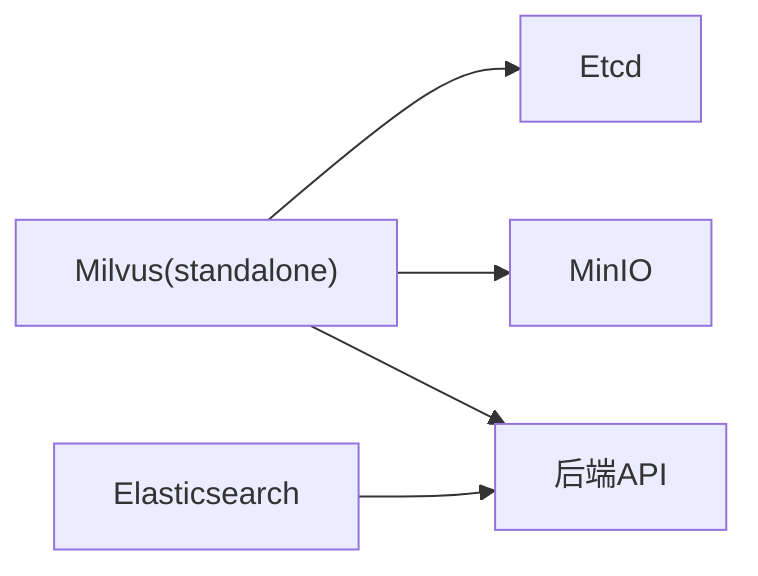
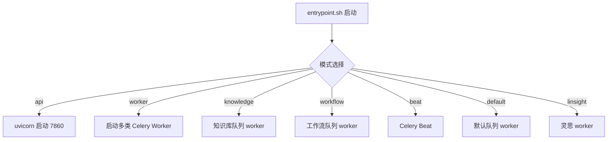
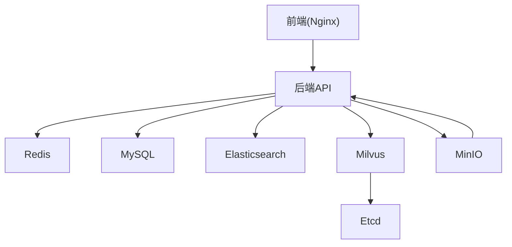

# 容器化部署

<cite>
**本文引用的文件**
- [docker-compose.yml](file://docker/docker-compose.yml)
- [docker-compose-ft.yml](file://docker/docker-compose-ft.yml)
- [docker-compose-uns.yml](file://docker/docker-compose-uns.yml)
- [docker-compose-office.yml](file://docker/docker-compose-office.yml)
- [nginx.conf](file://docker/nginx/nginx.conf)
- [default.conf](file://docker/nginx/conf.d/default.conf)
- [websocket.conf](file://docker/nginx/conf.d/websocket.conf)
- [my.cnf](file://docker/mysql/conf/my.cnf)
- [redis.conf](file://docker/redis/redis.conf)
- [config.yaml](file://docker/bisheng/config/config.yaml)
- [entrypoint.sh](file://docker/bisheng/entrypoint.sh)
- [config.yaml](file://docker/bisheng-ft/config.yaml)
- [config.json](file://docker/office/bisheng/config.json)
- [index.html](file://docker/office/bisheng/index.html)
- [all.js](file://docker/office/bisheng/all.js)
</cite>

## 目录
1. [简介](#简介)
2. [项目结构](#项目结构)
3. [核心组件](#核心组件)
4. [架构总览](#架构总览)
5. [组件详解](#组件详解)
6. [依赖关系分析](#依赖关系分析)
7. [性能与优化建议](#性能与优化建议)
8. [故障排除指南](#故障排除指南)
9. [结论](#结论)
10. [附录：部署场景与最佳实践](#附录部署场景与最佳实践)

## 简介
本文件面向运维与开发工程师，系统性阐述 Bisheng 在容器化环境中的设计与实现，覆盖 Docker 多阶段构建思路、镜像优化与依赖管理；基于 Docker Compose 的服务编排、网络与卷策略；Nginx 反向代理的负载均衡、SSL 终止与静态资源服务；数据库与缓存服务（MySQL、Redis）的容器化配置与优化；以及单机、集群与云平台三类部署场景的配置要点与运维实践。

## 项目结构
围绕容器化部署的关键目录与文件如下：
- docker/docker-compose.yml：主编排文件，定义后端、前端、数据库、缓存、搜索、对象存储、向量库等服务
- docker/nginx/*：Nginx 核心配置与站点配置，包含默认站点、WebSocket 支持与 gzip
- docker/mysql/conf/my.cnf：MySQL 字符集与 SQL 模式优化
- docker/redis/redis.conf：Redis 安全与性能相关配置示例
- docker/bisheng/config/config.yaml：后端运行期配置（数据库、缓存、向量库、对象存储、日志）
- docker/bisheng/entrypoint.sh：后端入口脚本，统一管理 API 与多种 Celery Worker 的启动
- docker/bisheng-ft/docker-compose-ft.yml：微调服务编排（含 GPU 设备直通）
- docker/bisheng-uns/docker-compose-uns.yml：非结构化文档服务编排
- docker/office/*：OnlyOffice 插件与前端集成资源

**图示来源**
- [docker-compose.yml](file://docker/docker-compose.yml#L1-L201)
- [nginx.conf](file://docker/nginx/nginx.conf#L1-L32)
- [default.conf](file://docker/nginx/conf.d/default.conf#L1-L65)
- [websocket.conf](file://docker/nginx/conf.d/websocket.conf#L1-L29)
- [config.yaml](file://docker/bisheng/config/config.yaml#L1-L88)
- [entrypoint.sh](file://docker/bisheng/entrypoint.sh#L1-L67)
- [my.cnf](file://docker/mysql/conf/my.cnf#L1-L13)
- [redis.conf](file://docker/redis/redis.conf#L1-L800)
- [docker-compose-ft.yml](file://docker/docker-compose-ft.yml#L1-L31)
- [docker-compose-uns.yml](file://docker/docker-compose-uns.yml#L1-L22)
- [docker-compose-office.yml](file://docker/docker-compose-office.yml#L1-L15)

**章节来源**
- [docker-compose.yml](file://docker/docker-compose.yml#L1-L201)
- [nginx.conf](file://docker/nginx/nginx.conf#L1-L32)
- [default.conf](file://docker/nginx/conf.d/default.conf#L1-L65)
- [websocket.conf](file://docker/nginx/conf.d/websocket.conf#L1-L29)
- [config.yaml](file://docker/bisheng/config/config.yaml#L1-L88)
- [entrypoint.sh](file://docker/bisheng/entrypoint.sh#L1-L67)
- [my.cnf](file://docker/mysql/conf/my.cnf#L1-L13)
- [redis.conf](file://docker/redis/redis.conf#L1-L800)
- [docker-compose-ft.yml](file://docker/docker-compose-ft.yml#L1-L31)
- [docker-compose-uns.yml](file://docker/docker-compose-uns.yml#L1-L22)
- [docker-compose-office.yml](file://docker/docker-compose-office.yml#L1-L15)

## 核心组件
- 后端服务（API 与 Worker）
  - 使用统一镜像，通过入口脚本按模式启动 API 或多种 Worker（知识库、工作流、默认任务、Beat、灵思）
  - 通过环境变量注入向量库、ES、MinIO 等外部依赖地址与凭据
- 前端与 Nginx
  - 提供静态资源服务与反向代理，转发 /api 到后端，支持 WebSocket
- 数据库与缓存
  - MySQL：字符集与 SQL 模式优化，健康检查
  - Redis：安全模式关闭、端口与超时等基础配置
- 搜索与向量库
  - Elasticsearch：数据目录挂载与端口映射
  - Milvus：独立模式，依赖 etcd 与 MinIO
- 对象存储
  - MinIO：提供对象存储能力，挂载本地目录
- 微调、非结构化与 OnlyOffice
  - 分别提供独立编排文件，支持 GPU 直通与插件资源挂载

**章节来源**
- [docker-compose.yml](file://docker/docker-compose.yml#L41-L201)
- [entrypoint.sh](file://docker/bisheng/entrypoint.sh#L32-L66)
- [config.yaml](file://docker/bisheng/config/config.yaml#L34-L57)
- [my.cnf](file://docker/mysql/conf/my.cnf#L7-L13)
- [redis.conf](file://docker/redis/redis.conf#L111-L111)

## 架构总览
下图展示容器化部署的整体交互：Nginx 作为统一入口，将请求分发至后端 API；后端通过 Redis 与 MySQL 提供缓存与持久化；向量检索与全文检索分别对接 Milvus 与 Elasticsearch；对象存储由 MinIO 提供；各辅助服务（微调、非结构化、OnlyOffice）按需启用。

**图示来源**
- [docker-compose.yml](file://docker/docker-compose.yml#L1-L201)
- [nginx.conf](file://docker/nginx/nginx.conf#L1-L32)
- [default.conf](file://docker/nginx/conf.d/default.conf#L46-L64)

## 组件详解

### Docker Compose 编排
- 服务分层
  - 基础设施：MySQL、Redis、Elasticsearch、Etcd、MinIO、Milvus
  - 应用：后端 API、后端 Worker、前端 Nginx
  - 辅助：微调服务、非结构化服务、OnlyOffice
- 健康检查
  - MySQL、Redis、Milvus、MinIO、Nginx 均配置健康检查，确保依赖可用后再启动上层服务
- 卷与环境
  - 数据目录统一挂载到宿主机，便于持久化与备份
  - 环境变量集中注入，避免硬编码敏感信息
- 依赖顺序
  - 后端 API 与 Worker 依赖 MySQL 与 Redis 健康
  - Milvus 依赖 Etcd 与 MinIO

**图示来源**
- [docker-compose.yml](file://docker/docker-compose.yml#L41-L123)
- [default.conf](file://docker/nginx/conf.d/default.conf#L46-L59)

**章节来源**
- [docker-compose.yml](file://docker/docker-compose.yml#L1-L201)

### Nginx 反向代理
- 配置要点
  - gzip 压缩、keepalive、日志格式与访问日志
  - 站点配置中：
    - /api 转发到后端 API，并透传 Host、X-Real-IP、X-Forwarded-For
    - /workspace/ 映射到前端客户端目录
    - /bisheng 与 /tmp-dir 转发到 MinIO
    - WebSocket 支持通过 $http_upgrade 与 $connection_upgrade
- 安全头
  - 添加 X-Frame-Options 与跨域响应头

**图示来源**
- [nginx.conf](file://docker/nginx/nginx.conf#L14-L32)
- [default.conf](file://docker/nginx/conf.d/default.conf#L19-L64)
- [websocket.conf](file://docker/nginx/conf.d/websocket.conf#L17-L29)

**章节来源**
- [nginx.conf](file://docker/nginx/nginx.conf#L1-L32)
- [default.conf](file://docker/nginx/conf.d/default.conf#L1-L65)
- [websocket.conf](file://docker/nginx/conf.d/websocket.conf#L1-L29)

### 数据库与缓存服务
- MySQL
  - 字符集与排序规则：utf8mb4
  - SQL 模式：严格模式，减少脏数据风险
  - 健康检查：通过命令行工具检测连通性
- Redis
  - 安全模式关闭（便于本地开发），生产建议开启并配置密码
  - 端口、超时、TCP backlog 等参数可按并发调整

**图示来源**
- [my.cnf](file://docker/mysql/conf/my.cnf#L7-L13)
- [docker-compose.yml](file://docker/docker-compose.yml#L15-L21)
- [redis.conf](file://docker/redis/redis.conf#L111-L111)
- [docker-compose.yml](file://docker/docker-compose.yml#L34-L39)

**章节来源**
- [my.cnf](file://docker/mysql/conf/my.cnf#L1-L13)
- [redis.conf](file://docker/redis/redis.conf#L111-L111)
- [docker-compose.yml](file://docker/docker-compose.yml#L15-L39)

### 向量库与搜索
- Milvus（独立模式）
  - 依赖 Etcd 与 MinIO，健康检查验证 /healthz
  - 数据目录挂载，端口映射 19530/9091
- Elasticsearch
  - 数据目录挂载，端口映射 9200/9300
  - 环境变量注入 URL 与 SSL 校验参数

**图示来源**
- [docker-compose.yml](file://docker/docker-compose.yml#L124-L201)

**章节来源**
- [docker-compose.yml](file://docker/docker-compose.yml#L124-L201)

### 对象存储与静态资源
- MinIO
  - 端口映射 9000/9001，控制台与服务端口分离
  - 健康检查：/minio/health/live
- Nginx 静态资源
  - /workspace/ 指向前端客户端目录
  - /bisheng 与 /tmp-dir 指向 MinIO

**章节来源**
- [docker-compose.yml](file://docker/docker-compose.yml#L156-L175)
- [default.conf](file://docker/nginx/conf.d/default.conf#L34-L64)

### 后端入口与多 Worker 模式
- 入口脚本
  - 支持 api、worker、knowledge、workflow、beat、default、linsight 等模式
  - API 使用 Uvicorn，Worker 使用 Celery，Beat 用于定时任务
- 配置注入
  - 通过环境变量注入 Milvus、ES、MinIO 地址与凭据
  - 日志配置输出到挂载目录，支持按天切割与保留策略

**图示来源**
- [entrypoint.sh](file://docker/bisheng/entrypoint.sh#L1-L67)
- [config.yaml](file://docker/bisheng/config/config.yaml#L34-L57)

**章节来源**
- [entrypoint.sh](file://docker/bisheng/entrypoint.sh#L1-L67)
- [config.yaml](file://docker/bisheng/config/config.yaml#L1-L88)

### 微调、非结构化与 OnlyOffice
- 微调服务（FT）
  - GPU 设备直通（nvidia），共享内存设置，模型与输出目录挂载
- 非结构化服务（Unstructured）
  - 健康检查与配置挂载
- OnlyOffice
  - 插件资源挂载，禁用 JWT，端口映射 80

**章节来源**
- [docker-compose-ft.yml](file://docker/docker-compose-ft.yml#L1-L31)
- [docker-compose-uns.yml](file://docker/docker-compose-uns.yml#L1-L22)
- [docker-compose-office.yml](file://docker/docker-compose-office.yml#L1-L15)

## 依赖关系分析
- 服务耦合
  - 后端 API 与 Worker 强依赖 MySQL 与 Redis
  - Milvus 与 Elasticsearch 为可选但关键的检索依赖
  - Nginx 依赖后端 API 正常运行
- 外部依赖
  - MinIO 为对象存储与静态资源提供支撑
  - OnlyOffice 与前端插件配合使用

**图示来源**
- [docker-compose.yml](file://docker/docker-compose.yml#L1-L201)

**章节来源**
- [docker-compose.yml](file://docker/docker-compose.yml#L1-L201)

## 性能与优化建议
- 镜像与构建
  - 多阶段构建：将编译产物与运行时分离，减小最终镜像体积
  - 缓存层优化：合理利用 Docker 层缓存，提升 CI/CD 速度
- 资源限制
  - 为后端 API 与 Worker 设置 CPU/内存限额，避免资源争抢
  - Milvus 与 ES 根据数据规模调整堆大小与 JVM 参数
- 网络与存储
  - 将数据卷挂载到高性能磁盘，开启异步 IO
  - Nginx 开启 gzip 与 keepalive，降低带宽占用
- 并发与队列
  - 根据业务峰值调整 Worker 并发度与队列数量
  - 对高频任务拆分队列，避免阻塞

[本节为通用建议，无需列出具体文件来源]

## 故障排除指南
- 健康检查失败
  - MySQL：确认 root 密码与初始化脚本执行
  - Redis：确认保护模式与认证配置
  - Milvus/MinIO：检查依赖服务是否就绪
- 端口冲突
  - 修改 docker-compose 中的 ports 映射，避免宿主机端口占用
- 权限问题
  - 确认挂载目录权限与 SELinux/AppArmor 策略
- 日志定位
  - 查看后端日志文件与 Nginx 访问/错误日志，结合 trace_id 定位问题
- 依赖不可达
  - 检查容器间网络与 DNS 解析，确认服务名与端口正确

**章节来源**
- [docker-compose.yml](file://docker/docker-compose.yml#L15-L21)
- [docker-compose.yml](file://docker/docker-compose.yml#L34-L39)
- [docker-compose.yml](file://docker/docker-compose.yml#L189-L194)
- [config.yaml](file://docker/bisheng/config/config.yaml#L63-L88)
- [nginx.conf](file://docker/nginx/nginx.conf#L5-L6)

## 结论
通过上述容器化方案，Bisheng 实现了前后端分离、依赖解耦与弹性扩展的基础能力。建议在生产环境中进一步完善安全策略（如启用 Redis 密码、TLS、最小权限 RBAC）、引入服务网格与可观测性体系，并针对不同场景进行资源与网络优化。

[本节为总结性内容，无需列出具体文件来源]

## 附录：部署场景与最佳实践

### 单机部署
- 适用：开发测试、演示环境
- 关键点
  - 使用默认 docker-compose.yml 启动全部服务
  - 将数据卷挂载到本地目录，便于调试与备份
  - 关闭不必要的服务（如 FT/Uns/Office）以节省资源

**章节来源**
- [docker-compose.yml](file://docker/docker-compose.yml#L1-L201)

### 集群部署
- 适用：高可用与生产环境
- 关键点
  - Redis 集群或哨兵模式（在配置中启用相应字段）
  - MySQL 主从复制或高可用方案
  - Nginx 前置 HAProxy/LB，多实例后端 API 与 Worker
  - Milvus 使用分布式模式（与 Etcd/MinIO 集群配合）

**章节来源**
- [config.yaml](file://docker/bisheng/config/config.yaml#L11-L22)
- [docker-compose.yml](file://docker/docker-compose.yml#L124-L201)

### 云平台部署
- 适用：公有云或混合云
- 关键点
  - 使用云厂商提供的托管数据库与缓存服务，减少运维复杂度
  - 对象存储使用云厂商的 S3 兼容接口，或继续使用 MinIO
  - 通过云负载均衡与自动伸缩组实现弹性扩容
  - 配置 TLS 证书与 WAF，强化安全防护

**章节来源**
- [config.yaml](file://docker/bisheng/config/config.yaml#L45-L57)
- [default.conf](file://docker/nginx/conf.d/default.conf#L19-L64)