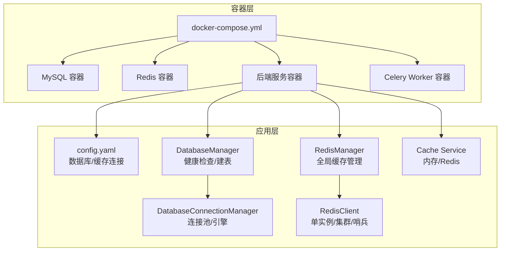
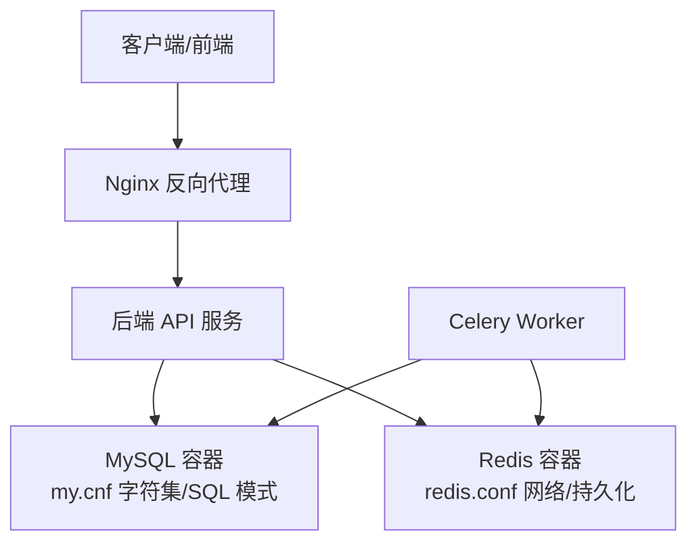
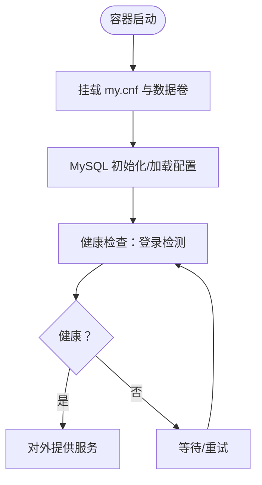
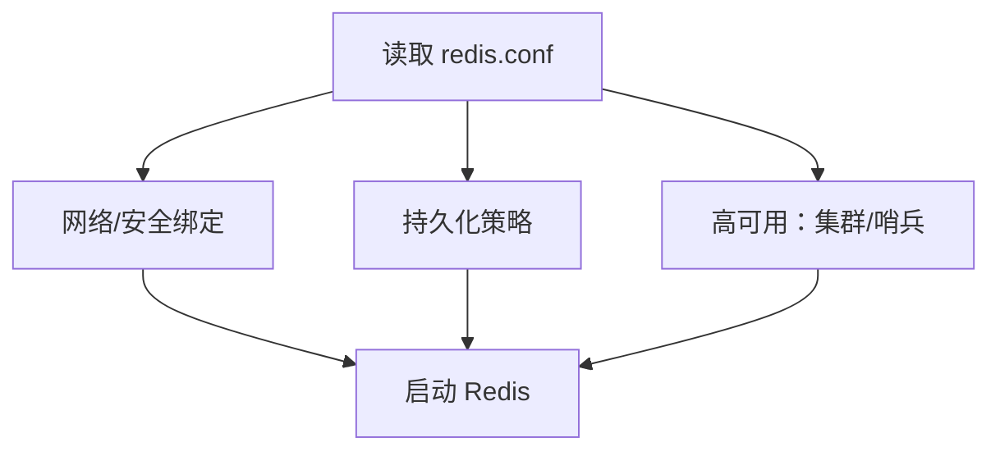
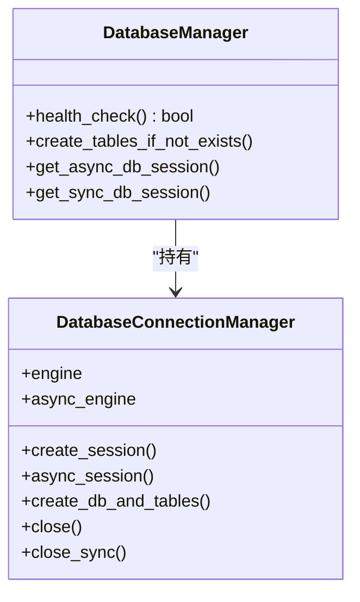
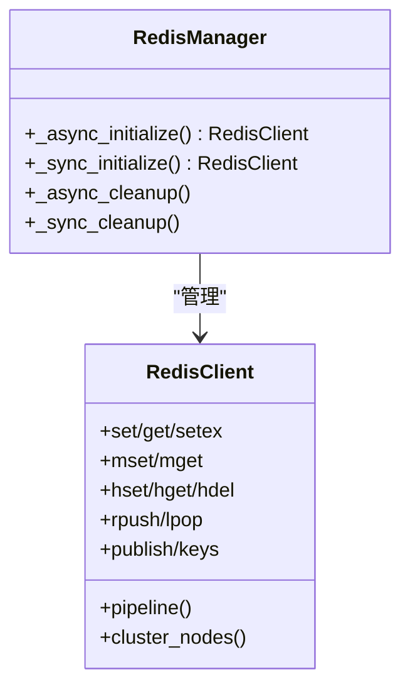
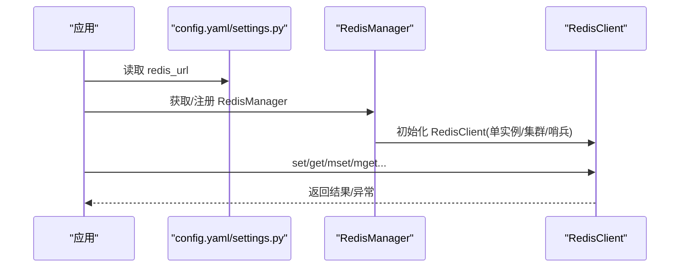
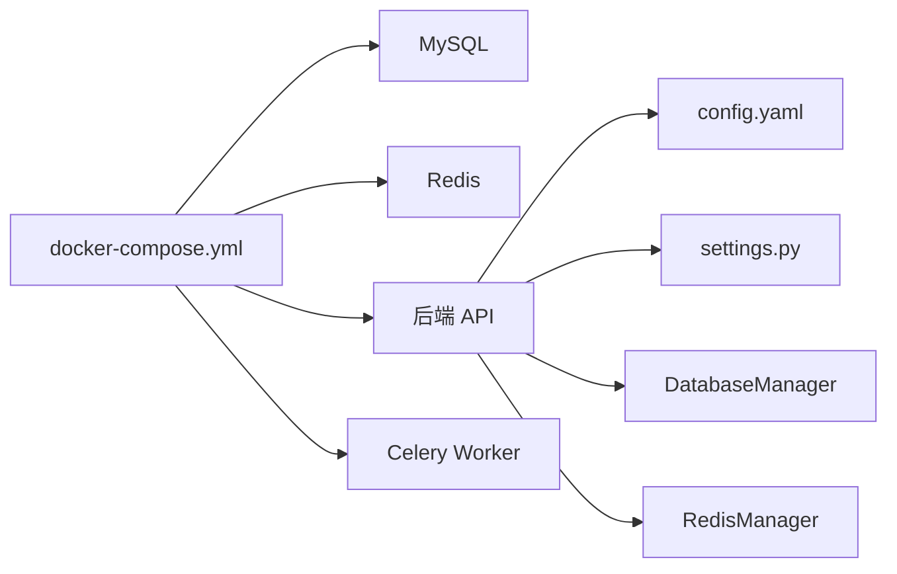

# 数据库和缓存服务

<cite>
**本文引用的文件**
- [docker/mysql/conf/my.cnf](file://docker/mysql/conf/my.cnf)
- [docker/redis/redis.conf](file://docker/redis/redis.conf)
- [docker/docker-compose.yml](file://docker/docker-compose.yml)
- [docker/bisheng/config/config.yaml](file://docker/bisheng/config/config.yaml)
- [src/backend/bisheng/core/database/connection.py](file://src/backend/bisheng/core/database/connection.py)
- [src/backend/bisheng/core/database/manager.py](file://src/backend/bisheng/core/database/manager.py)
- [src/backend/bisheng/core/cache/redis_conn.py](file://src/backend/bisheng/core/cache/redis_conn.py)
- [src/backend/bisheng/core/cache/redis_manager.py](file://src/backend/bisheng/core/cache/redis_manager.py)
- [src/backend/bisheng/core/config/settings.py](file://src/backend/bisheng/core/config/settings.py)
- [src/backend/bisheng/services/cache/service.py](file://src/backend/bisheng/services/cache/service.py)
- [src/backend/bisheng/core/cache/flow.py](file://src/backend/bisheng/core/cache/flow.py)
- [docker/bisheng/entrypoint.sh](file://docker/bisheng/entrypoint.sh)
</cite>

## 目录
1. [简介](#简介)
2. [项目结构](#项目结构)
3. [核心组件](#核心组件)
4. [架构总览](#架构总览)
5. [详细组件分析](#详细组件分析)
6. [依赖关系分析](#依赖关系分析)
7. [性能考量](#性能考量)
8. [故障排查指南](#故障排查指南)
9. [结论](#结论)
10. [附录](#附录)

## 简介
本文件面向运维与开发人员，系统化梳理 Bisheng 在容器化场景下的数据库与缓存服务配置与运行机制，覆盖以下主题：
- MySQL 容器化配置：字符集、SQL 模式、健康检查与备份建议
- Redis 容器化配置：网络绑定、持久化、高可用模式与安全加固
- 数据库连接池：连接超时、最大连接数、预热与回收策略
- 缓存策略：过期时间、批量操作、序列化与集群/哨兵支持
- 监控指标：连接数、内存使用、慢查询与延迟
- 运维实操：备份恢复、性能调优与常见故障处理

## 项目结构
围绕数据库与缓存的关键目录与文件如下：
- 容器编排与服务
  - docker/docker-compose.yml：定义 mysql、redis、backend、backend_worker、frontend、elasticsearch、etcd、minio、milvus 等服务
  - docker/bisheng/config/config.yaml：应用侧数据库与缓存连接字符串、队列路由等
  - docker/bisheng/entrypoint.sh：后端服务入口脚本，包含 worker 启动方式
- 数据库侧
  - docker/mysql/conf/my.cnf：MySQL 字符集与 SQL 模式配置
  - src/backend/bisheng/core/database/connection.py：连接池默认参数与引擎配置
  - src/backend/bisheng/core/database/manager.py：健康检查、表初始化、会话管理
- 缓存侧
  - docker/redis/redis.conf：Redis 网络、持久化、高可用与性能相关配置片段
  - src/backend/bisheng/core/cache/redis_conn.py：Redis 客户端封装，支持单实例、集群、哨兵
  - src/backend/bisheng/core/cache/redis_manager.py：全局缓存管理器
  - src/backend/bisheng/services/cache/service.py：内存缓存与 Redis 缓存实现
  - src/backend/bisheng/core/cache/flow.py：内存缓存 LRU 实现
  - src/backend/bisheng/core/config/settings.py：配置解密与 URL 解析

**图表来源**
- [docker/docker-compose.yml](file://docker/docker-compose.yml#L1-L201)
- [docker/bisheng/config/config.yaml](file://docker/bisheng/config/config.yaml#L1-L88)
- [src/backend/bisheng/core/database/manager.py](file://src/backend/bisheng/core/database/manager.py#L1-L174)
- [src/backend/bisheng/core/database/connection.py](file://src/backend/bisheng/core/database/connection.py#L1-L175)
- [src/backend/bisheng/core/cache/redis_manager.py](file://src/backend/bisheng/core/cache/redis_manager.py#L1-L82)
- [src/backend/bisheng/core/cache/redis_conn.py](file://src/backend/bisheng/core/cache/redis_conn.py#L1-L515)
- [src/backend/bisheng/services/cache/service.py](file://src/backend/bisheng/services/cache/service.py#L1-L322)

**章节来源**
- [docker/docker-compose.yml](file://docker/docker-compose.yml#L1-L201)
- [docker/bisheng/config/config.yaml](file://docker/bisheng/config/config.yaml#L1-L88)

## 核心组件
- MySQL 容器化
  - 使用官方镜像，暴露 3306 端口；通过挂载 my.cnf 设置字符集与 SQL 模式；健康检查基于命令行登录
  - 字符集：utf8mb4；排序规则：utf8mb4_unicode_ci；SQL 模式启用严格模式
- Redis 容器化
  - 使用自定义 redis.conf，开启持久化与网络绑定控制；支持单实例、集群与哨兵模式
  - 网络：默认监听本地回环以降低暴露面；可通过 bind 调整
  - 持久化：RDB 快照与 AOF 增量刷盘选项存在配置片段
- 应用侧数据库连接
  - 默认连接池：pool_size=100、max_overflow=20、pool_timeout=30、pool_pre_ping=True、pool_recycle=3600
  - MySQL 特殊：自动注入 charset=utf8mb4
  - 提供同步与异步会话上下文管理，支持健康检查与建表
- 应用侧缓存
  - RedisClient 支持单实例、RedisCluster、Sentinel 三种模式；批量设置/获取、哈希、列表、发布订阅等常用操作
  - RedisManager 提供全局生命周期管理与上下文注册
  - 内存缓存 InMemoryCache 提供 LRU 与过期控制，线程安全

**章节来源**
- [docker/mysql/conf/my.cnf](file://docker/mysql/conf/my.cnf#L1-L13)
- [docker/docker-compose.yml](file://docker/docker-compose.yml#L1-L201)
- [docker/redis/redis.conf](file://docker/redis/redis.conf#L1-L800)
- [src/backend/bisheng/core/database/connection.py](file://src/backend/bisheng/core/database/connection.py#L40-L79)
- [src/backend/bisheng/core/database/manager.py](file://src/backend/bisheng/core/database/manager.py#L64-L95)
- [src/backend/bisheng/core/cache/redis_conn.py](file://src/backend/bisheng/core/cache/redis_conn.py#L18-L56)
- [src/backend/bisheng/core/cache/redis_manager.py](file://src/backend/bisheng/core/cache/redis_manager.py#L19-L46)
- [src/backend/bisheng/services/cache/service.py](file://src/backend/bisheng/services/cache/service.py#L11-L179)

## 架构总览
下图展示容器化环境下数据库与缓存的交互关系及关键配置点。

**图表来源**
- [docker/docker-compose.yml](file://docker/docker-compose.yml#L1-L201)
- [docker/mysql/conf/my.cnf](file://docker/mysql/conf/my.cnf#L1-L13)
- [docker/redis/redis.conf](file://docker/redis/redis.conf#L1-L800)

## 详细组件分析

### MySQL 容器化配置
- 字符集与排序规则
  - 服务器字符集与排序规则统一为 utf8mb4_unicode_ci，确保多语言与表情符号兼容
  - 客户端与连接阶段显式设置字符集，避免握手阶段差异
- SQL 模式
  - 启用严格事务表模式，禁止零日期与除零错误，提升数据一致性
- 健康检查
  - 通过 CMD-SHELL 执行登录检测，具备启动延时、轮询间隔与重试次数
- 备份策略建议
  - 基于容器卷挂载的数据持久化，结合 mysqldump 或物理备份工具定期导出
  - 结合业务低峰时段执行全量备份，并验证恢复流程

**图表来源**
- [docker/docker-compose.yml](file://docker/docker-compose.yml#L15-L21)
- [docker/mysql/conf/my.cnf](file://docker/mysql/conf/my.cnf#L1-L13)

**章节来源**
- [docker/mysql/conf/my.cnf](file://docker/mysql/conf/my.cnf#L1-L13)
- [docker/docker-compose.yml](file://docker/docker-compose.yml#L15-L21)

### Redis 容器化配置
- 网络与安全
  - 默认仅监听回环接口，降低直接暴露风险；生产环境可按需放开并设置密码
  - 保护模式关闭示例可见配置文件片段，需谨慎启用
- 持久化
  - RDB 快照策略与错误停止行为、压缩与校验开关
  - AOF 增量刷盘与重写增量刷盘选项存在配置片段
- 性能与高可用
  - HZ 自适应与主动 rehash，平衡空闲 CPU 占用与过期键清理响应性
  - 支持集群与哨兵模式，满足高可用与扩展需求

**图表来源**
- [docker/redis/redis.conf](file://docker/redis/redis.conf#L111-L111)
- [docker/redis/redis.conf](file://docker/redis/redis.conf#L412-L448)
- [docker/redis/redis.conf](file://docker/redis/redis.conf#L2082-L2125)
- [docker/redis/redis.conf](file://docker/redis/redis.conf#L1985-L2003)

**章节来源**
- [docker/redis/redis.conf](file://docker/redis/redis.conf#L111-L111)
- [docker/redis/redis.conf](file://docker/redis/redis.conf#L412-L448)
- [docker/redis/redis.conf](file://docker/redis/redis.conf#L2082-L2125)
- [docker/redis/redis.conf](file://docker/redis/redis.conf#L1985-L2003)

### 数据库连接池配置
- 默认参数
  - pool_size=100、max_overflow=20、pool_timeout=30、pool_pre_ping=True、pool_recycle=3600
  - MySQL 注入 charset=utf8mb4
- 生命周期与会话
  - 提供同步与异步 Session 上下文管理，异常自动回滚与关闭
  - 健康检查通过简单查询验证连接有效性
  - 支持首次建表（metadata.create_all）

**图表来源**
- [src/backend/bisheng/core/database/connection.py](file://src/backend/bisheng/core/database/connection.py#L17-L175)
- [src/backend/bisheng/core/database/manager.py](file://src/backend/bisheng/core/database/manager.py#L19-L174)

**章节来源**
- [src/backend/bisheng/core/database/connection.py](file://src/backend/bisheng/core/database/connection.py#L40-L79)
- [src/backend/bisheng/core/database/manager.py](file://src/backend/bisheng/core/database/manager.py#L64-L95)

### 缓存策略设计
- 过期时间
  - 多数写入方法支持 expiration 参数，默认约 1 小时；可按业务调整
- 批量操作
  - 支持 mset/mget、管道批设过期；列表 push/rpush、lrange、lrem 等
- 序列化
  - 统一使用 pickle 序列化，确保跨类型缓存能力
- 集群/哨兵
  - 单实例：ConnectionPool.from_url
  - 集群：RedisCluster.from_url，支持重试与节点选择
  - 哨兵：Sentinel 获取主节点连接，支持密码认证

**图表来源**
- [src/backend/bisheng/core/cache/redis_conn.py](file://src/backend/bisheng/core/cache/redis_conn.py#L18-L515)
- [src/backend/bisheng/core/cache/redis_manager.py](file://src/backend/bisheng/core/cache/redis_manager.py#L10-L82)

**章节来源**
- [src/backend/bisheng/core/cache/redis_conn.py](file://src/backend/bisheng/core/cache/redis_conn.py#L57-L173)
- [src/backend/bisheng/core/cache/redis_conn.py](file://src/backend/bisheng/core/cache/redis_conn.py#L196-L223)
- [src/backend/bisheng/core/cache/redis_conn.py](file://src/backend/bisheng/core/cache/redis_conn.py#L504-L515)
- [src/backend/bisheng/core/cache/redis_manager.py](file://src/backend/bisheng/core/cache/redis_manager.py#L19-L46)

### 缓存实现与使用
- 内存缓存 InMemoryCache
  - LRU 驱逐、过期时间、线程安全锁；支持字典合并 upsert
- Redis 缓存 RedisCache
  - 基于 redis-py 的连接封装，提供 ping 连接检查与 setex 序列化写入
- 应用侧配置
  - config.yaml 中定义 redis_url 与 celery_redis_url，支持普通、集群、哨兵三种模式
  - settings.py 解析配置并解密加密密码

**图表来源**
- [docker/bisheng/config/config.yaml](file://docker/bisheng/config/config.yaml#L6-L25)
- [src/backend/bisheng/core/config/settings.py](file://src/backend/bisheng/core/config/settings.py#L285-L323)
- [src/backend/bisheng/core/cache/redis_manager.py](file://src/backend/bisheng/core/cache/redis_manager.py#L29-L63)
- [src/backend/bisheng/core/cache/redis_conn.py](file://src/backend/bisheng/core/cache/redis_conn.py#L20-L56)

**章节来源**
- [src/backend/bisheng/services/cache/service.py](file://src/backend/bisheng/services/cache/service.py#L11-L179)
- [src/backend/bisheng/services/cache/service.py](file://src/backend/bisheng/services/cache/service.py#L182-L322)
- [docker/bisheng/config/config.yaml](file://docker/bisheng/config/config.yaml#L6-L25)
- [src/backend/bisheng/core/config/settings.py](file://src/backend/bisheng/core/config/settings.py#L285-L323)

## 依赖关系分析
- 服务依赖
  - backend 与 backend_worker 依赖 mysql 与 redis 的健康状态
  - 健康检查分别针对 MySQL 登录与 Redis PING
- 配置依赖
  - config.yaml 提供数据库与缓存连接字符串；settings.py 解析并解密
  - docker-compose.yml 将配置文件与卷挂载至容器

**图表来源**
- [docker/docker-compose.yml](file://docker/docker-compose.yml#L73-L77)
- [docker/docker-compose.yml](file://docker/docker-compose.yml#L34-L38)
- [docker/bisheng/config/config.yaml](file://docker/bisheng/config/config.yaml#L1-L88)
- [src/backend/bisheng/core/config/settings.py](file://src/backend/bisheng/core/config/settings.py#L262-L283)

**章节来源**
- [docker/docker-compose.yml](file://docker/docker-compose.yml#L73-L77)
- [docker/docker-compose.yml](file://docker/docker-compose.yml#L34-L38)
- [docker/bisheng/config/config.yaml](file://docker/bisheng/config/config.yaml#L1-L88)
- [src/backend/bisheng/core/config/settings.py](file://src/backend/bisheng/core/config/settings.py#L262-L283)

## 性能考量
- MySQL
  - 连接池：pool_size 与 max_overflow 控制并发与溢出；pool_pre_ping 降低连接失效导致的失败
  - 字符集：utf8mb4 提升兼容性但可能增加存储与索引开销，需评估字段长度与索引策略
  - SQL 模式：严格模式减少脏数据，但需在应用层做好边界条件处理
- Redis
  - HZ 自适应与动态 HZ 提升空闲与繁忙场景的响应性
  - 活跃 rehash 与增量 fsync 减少大对象迁移与快照写盘的抖动
  - 管道与批量操作降低 RTT 开销
- 应用侧
  - 连接池参数可在 engine_kwargs 中覆盖
  - 缓存过期时间应结合热点数据与更新频率设定，避免频繁重建

[本节为通用指导，无需具体文件引用]

## 故障排查指南
- MySQL
  - 健康检查失败：确认容器内 my.cnf 是否正确挂载、root 密码是否匹配、网络连通性
  - 字符集问题：检查客户端连接是否携带 charset=utf8mb4
  - 备份恢复：优先使用容器卷挂载的数据目录进行备份；恢复时先停止服务再还原
- Redis
  - 无法连接：检查 bind 与 protected-mode 配置；确认密码与 ACL 设置
  - 集群/哨兵异常：核对 startup_nodes/sentinel_hosts 与 master 名称；关注重试与节点选择逻辑
  - 性能抖动：观察 HZ 与 active rehash 设置；评估持久化策略与内存上限
- 应用侧
  - 数据库连接异常：查看连接池回收与超时参数；确认 pool_pre_ping 生效
  - 缓存异常：确认 pickle 序列化支持；检查过期时间与批量操作的原子性

**章节来源**
- [docker/docker-compose.yml](file://docker/docker-compose.yml#L15-L21)
- [docker/docker-compose.yml](file://docker/docker-compose.yml#L34-L38)
- [docker/mysql/conf/my.cnf](file://docker/mysql/conf/my.cnf#L1-L13)
- [docker/redis/redis.conf](file://docker/redis/redis.conf#L111-L111)
- [src/backend/bisheng/core/database/connection.py](file://src/backend/bisheng/core/database/connection.py#L40-L79)
- [src/backend/bisheng/core/cache/redis_conn.py](file://src/backend/bisheng/core/cache/redis_conn.py#L20-L56)

## 结论
本文从容器化视角系统梳理了 Bisheng 的数据库与缓存配置与实现要点，明确了字符集与 SQL 模式的落地、连接池参数与健康检查机制、缓存的多种模式与序列化策略，并给出了备份恢复与性能调优的实践建议。建议在生产环境中结合业务流量特征进一步细化参数，并建立完善的监控与演练体系。

[本节为总结性内容，无需具体文件引用]

## 附录
- 运维脚本与入口
  - 后端服务入口脚本支持 api、worker、knowledge、workflow、beat、default、linsight 等模式
- 配置解密
  - settings.py 支持对加密的数据库与缓存密码进行解密，确保明文不落盘

**章节来源**
- [docker/bisheng/entrypoint.sh](file://docker/bisheng/entrypoint.sh#L1-L67)
- [src/backend/bisheng/core/config/settings.py](file://src/backend/bisheng/core/config/settings.py#L15-L21)
- [src/backend/bisheng/core/config/settings.py](file://src/backend/bisheng/core/config/settings.py#L262-L283)
- [src/backend/bisheng/core/config/settings.py](file://src/backend/bisheng/core/config/settings.py#L285-L323)