# 工作流图引擎

<cite>
**本文引用的文件**   
- [graph_engine.py](file://src/backend/bisheng/workflow/graph/graph_engine.py)
- [graph_state.py](file://src/backend/bisheng/workflow/graph/graph_state.py)
- [base.py](file://src/backend/bisheng/workflow/nodes/base.py)
- [edges.py](file://src/backend/bisheng/workflow/edges/edges.py)
- [node_manage.py](file://src/backend/bisheng/workflow/nodes/node_manage.py)
- [node.py](file://src/backend/bisheng/workflow/common/node.py)
- [output_fake.py](file://src/backend/bisheng/workflow/nodes/output/output_fake.py)
- [condition.py](file://src/backend/bisheng/workflow/nodes/condition/condition.py)
</cite>

## 目录
1. [简介](#简介)
2. [项目结构](#项目结构)
3. [核心组件](#核心组件)
4. [架构总览](#架构总览)
5. [详细组件分析](#详细组件分析)
6. [依赖关系分析](#依赖关系分析)
7. [性能考量](#性能考量)
8. [故障排查指南](#故障排查指南)
9. [结论](#结论)
10. [附录](#附录)

## 简介
本技术文档围绕基于 LangGraph 的工作流图引擎展开，系统性阐述 StateGraph 的初始化、节点图构建、条件边与普通边的处理逻辑，以及核心方法的实现原理与执行流程。重点覆盖以下内容：
- 初始化与编译：StateGraph 的构建、检查点与中断节点配置
- 节点构建：build_nodes()、add_node_edge()、build_more_fan_in_node() 的职责与协作
- 多输入节点等待机制与分支策略：parse_fan_in_node() 的判定逻辑
- 异步与同步执行：run()/arun() 的差异与适用场景
- 配置参数详解：recursion_limit、checkpointer 等关键参数的作用与调优建议
- 扩展与自定义：如何新增节点类型与自定义路由策略

## 项目结构
工作流图引擎位于后端模块中，核心代码集中在 workflow/graph 与 workflow/nodes、workflow/edges、workflow/common 等子包。下图给出与本文相关的模块关系概览。

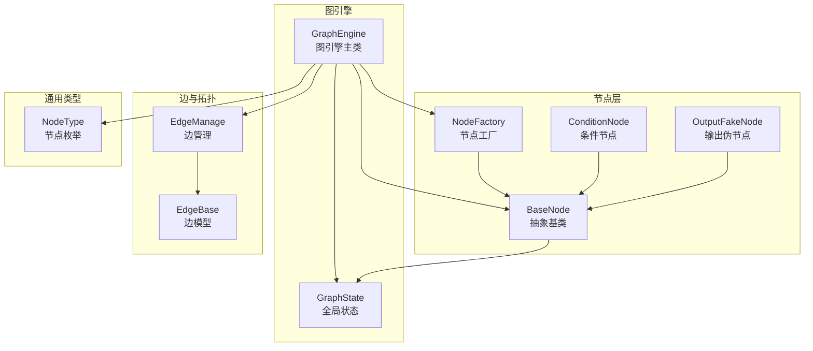

**图表来源**
- [graph_engine.py](file://src/backend/bisheng/workflow/graph/graph_engine.py#L27-L70)
- [graph_state.py](file://src/backend/bisheng/workflow/graph/graph_state.py#L8-L16)
- [base.py](file://src/backend/bisheng/workflow/nodes/base.py#L20-L60)
- [node_manage.py](file://src/backend/bisheng/workflow/nodes/node_manage.py#L33-L44)
- [condition.py](file://src/backend/bisheng/workflow/nodes/condition/condition.py#L8-L18)
- [output_fake.py](file://src/backend/bisheng/workflow/nodes/output/output_fake.py#L7-L14)
- [edges.py](file://src/backend/bisheng/workflow/edges/edges.py#L6-L22)
- [node.py](file://src/backend/bisheng/workflow/common/node.py#L8-L26)

**章节来源**
- [graph_engine.py](file://src/backend/bisheng/workflow/graph/graph_engine.py#L27-L70)
- [edges.py](file://src/backend/bisheng/workflow/edges/edges.py#L18-L58)
- [node_manage.py](file://src/backend/bisheng/workflow/nodes/node_manage.py#L33-L44)
- [node.py](file://src/backend/bisheng/workflow/common/node.py#L8-L26)

## 核心组件
- GraphEngine：图引擎主类，负责从工作流数据构建 StateGraph，编译并执行；维护节点映射、扇入信息、层级、条件节点集合等；提供 run/arun/continue_run 等执行接口。
- GraphState：全局状态容器，统一管理对话历史与节点变量池，支持按节点键值访问与索引访问。
- BaseNode：所有节点的抽象基类，定义运行入口 run()/arun()、停止控制、回调事件、变量解析与消息拼接等通用能力。
- NodeFactory：根据节点类型映射到具体节点类，实例化节点。
- EdgeManage/EdgeBase：对边进行建模与查询，提供目标/源节点、下游扩展、全路径分支等查询能力。
- ConditionNode：条件节点，依据条件表达式选择下一跳节点，并通过 route_node() 返回目标节点 ID。
- OutputFakeNode：输出伪节点，用于在输出节点后插入以触发中断与用户输入回调。

**章节来源**
- [graph_engine.py](file://src/backend/bisheng/workflow/graph/graph_engine.py#L27-L70)
- [graph_state.py](file://src/backend/bisheng/workflow/graph/graph_state.py#L8-L16)
- [base.py](file://src/backend/bisheng/workflow/nodes/base.py#L20-L60)
- [node_manage.py](file://src/backend/bisheng/workflow/nodes/node_manage.py#L33-L44)
- [edges.py](file://src/backend/bisheng/workflow/edges/edges.py#L18-L58)
- [condition.py](file://src/backend/bisheng/workflow/nodes/condition/condition.py#L8-L18)
- [output_fake.py](file://src/backend/bisheng/workflow/nodes/output/output_fake.py#L7-L14)

## 架构总览
下图展示从工作流数据到 LangGraph 编译与执行的关键步骤，以及与全局状态、节点工厂、边管理的交互。

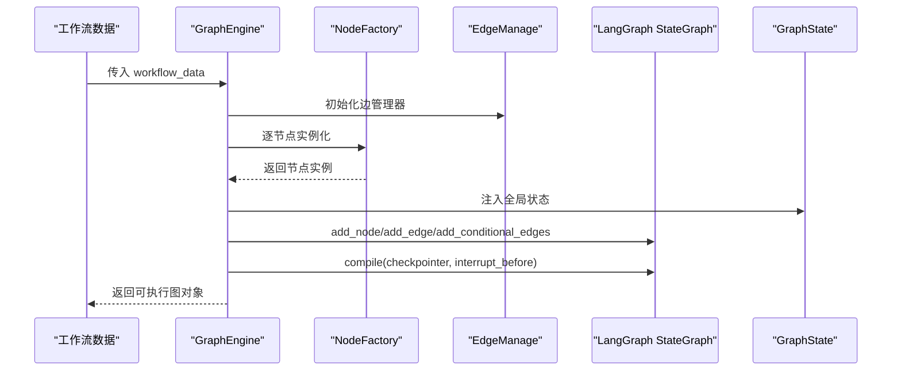

**图表来源**
- [graph_engine.py](file://src/backend/bisheng/workflow/graph/graph_engine.py#L69-L70)
- [graph_engine.py](file://src/backend/bisheng/workflow/graph/graph_engine.py#L253-L281)
- [node_manage.py](file://src/backend/bisheng/workflow/nodes/node_manage.py#L33-L44)
- [edges.py](file://src/backend/bisheng/workflow/edges/edges.py#L18-L58)

## 详细组件分析

### 图引擎初始化与编译
- 初始化阶段
  - 解析工作流数据，建立边管理器 EdgeManage
  - 构建节点映射 nodes_map、扇入 nodes_fan_in、扇出 nodes_next_nodes
  - 记录条件节点 condition_nodes 列表
  - 创建临时状态类型 TempState 并初始化 StateGraph
  - 设置默认 graph_config（包含线程标识与递归限制）
- 编译阶段
  - 添加起止边：START->首个节点；末尾节点->END
  - 计算节点层级 build_node_level()
  - 连接节点边 add_node_edge() 与多输入等待 build_more_fan_in_node()
  - 编译 LangGraph：compile(checkpointer=MemorySaver(), interrupt_before=...)
  - 动态调整 recursion_limit

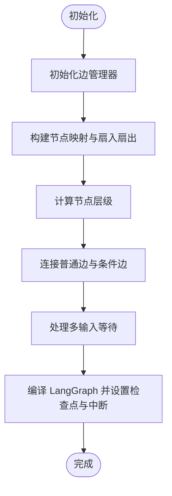

**图表来源**
- [graph_engine.py](file://src/backend/bisheng/workflow/graph/graph_engine.py#L69-L70)
- [graph_engine.py](file://src/backend/bisheng/workflow/graph/graph_engine.py#L253-L281)

**章节来源**
- [graph_engine.py](file://src/backend/bisheng/workflow/graph/graph_engine.py#L29-L70)
- [graph_engine.py](file://src/backend/bisheng/workflow/graph/graph_engine.py#L253-L281)

### 节点构建与边连接：build_nodes()、add_node_edge()
- build_nodes()
  - 校验节点列表非空
  - 调用 init_nodes() 实例化节点，记录起止/中断节点
  - 添加 START->首节点 与 末尾节点->END 边
  - 计算节点层级
  - 遍历节点调用 add_node_edge() 进行边连接
  - 调用 build_more_fan_in_node() 处理多输入等待
  - 编译 LangGraph，动态设置 recursion_limit
- add_node_edge()
  - 忽略 END 与 FAKE_OUTPUT 类型节点
  - 输出节点 OUTPUT 后追加 FAKE_OUTPUT 节点，形成“输出中断”链路，并使用条件边分发到目标节点
  - 条件节点 CONDITION 使用 route_node() 作为条件路由函数，连接到目标节点
  - 普通节点仅在目标节点未发生多输入时直接添加普通边

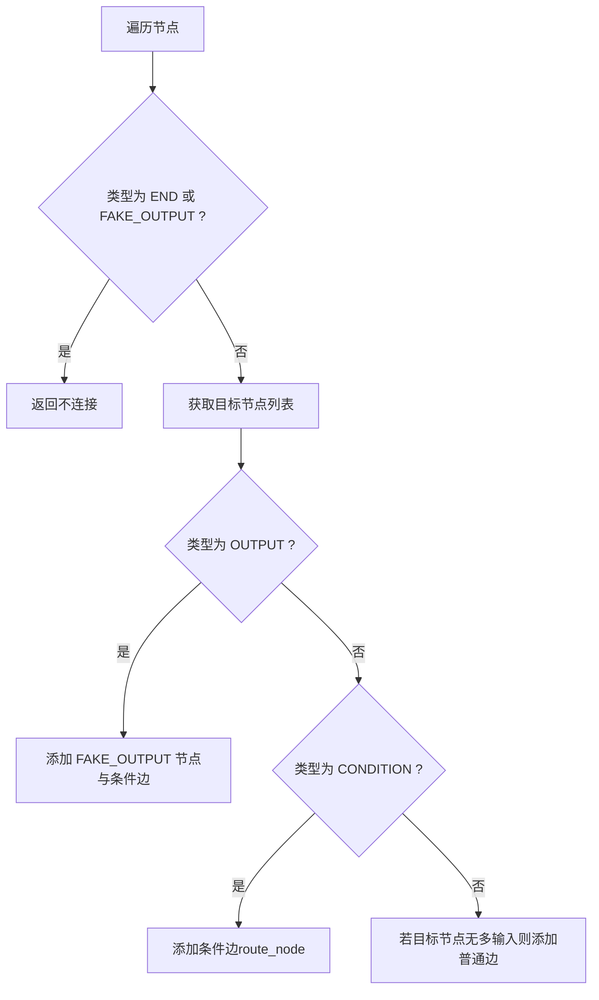

**图表来源**
- [graph_engine.py](file://src/backend/bisheng/workflow/graph/graph_engine.py#L76-L118)

**章节来源**
- [graph_engine.py](file://src/backend/bisheng/workflow/graph/graph_engine.py#L253-L281)
- [graph_engine.py](file://src/backend/bisheng/workflow/graph/graph_engine.py#L76-L118)

### 多输入节点等待机制：build_more_fan_in_node() 与 parse_fan_in_node()
- 目标：当某节点存在多个前置节点时，需要判断是否需要等待全部前置节点执行完毕再进入该节点。
- 判定依据
  - 若所有前置节点的层级均不大于当前节点，则视为“同级或更浅”，可直接并行到达，无需等待
  - 若存在前置节点层级大于当前节点，则需进一步判断是否存在互斥分支（即两条不同路径到达当前节点）
  - 若存在互斥分支，说明当前节点是互斥汇聚，无需等待
  - 否则，需要等待所有前置节点执行完毕，必要时将输出节点的 FAKE_OUTPUT 节点加入等待链路
- 结果
  - 返回两组节点集合：需要等待的前置节点 wait_nodes 与无需等待的前置节点 no_wait_nodes
  - 将 wait_nodes 与当前节点之间添加边，形成等待链路

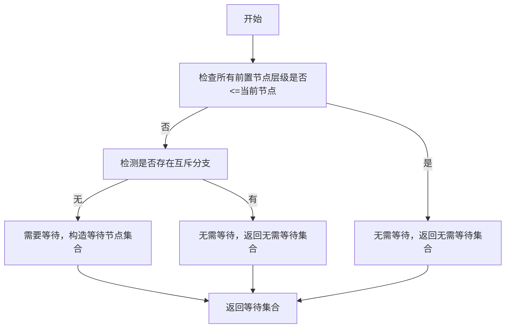

**图表来源**
- [graph_engine.py](file://src/backend/bisheng/workflow/graph/graph_engine.py#L119-L177)

**章节来源**
- [graph_engine.py](file://src/backend/bisheng/workflow/graph/graph_engine.py#L119-L177)

### 节点层级计算：build_node_level()
- 采用深度优先遍历，从起始节点出发，记录每个可达节点的最大层级
- 通过标记已访问节点避免环路
- 为后续多输入等待判定提供层级比较依据

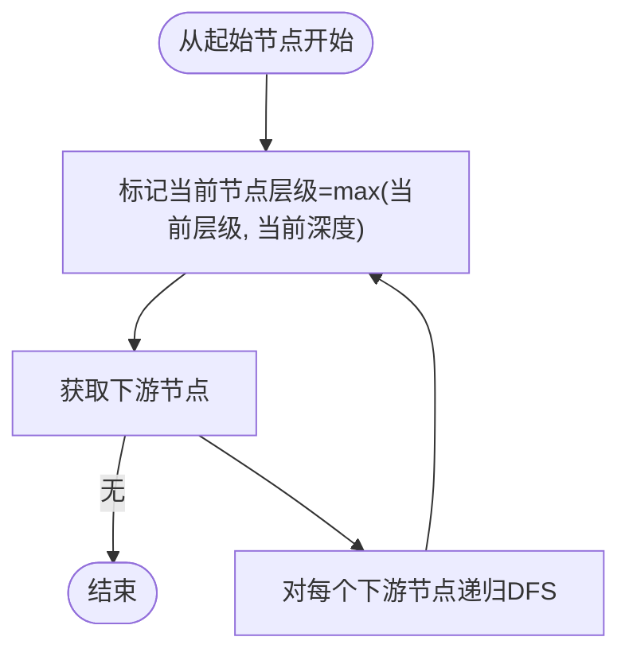

**图表来源**
- [graph_engine.py](file://src/backend/bisheng/workflow/graph/graph_engine.py#L179-L198)

**章节来源**
- [graph_engine.py](file://src/backend/bisheng/workflow/graph/graph_engine.py#L179-L198)

### 条件边与普通边处理：ConditionNode 与 OutputFakeNode
- ConditionNode
  - 在 _run() 中评估条件，确定下一跳节点 ID
  - route_node() 返回该 ID，供 LangGraph 条件边使用
  - parse_log() 可输出变量计算日志
- OutputFakeNode
  - 仅用于触发输出中断与回调，不执行业务逻辑
  - 在 run() 中上报输出节点结束事件，以便正确记录日志

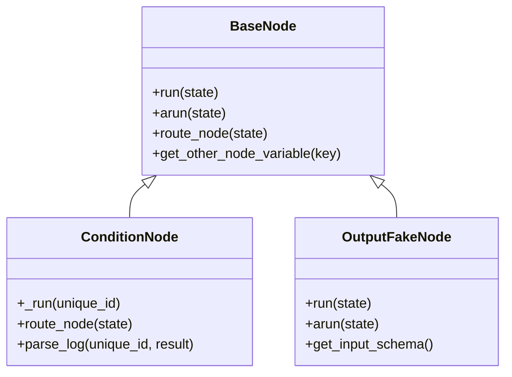

**图表来源**
- [base.py](file://src/backend/bisheng/workflow/nodes/base.py#L20-L60)
- [condition.py](file://src/backend/bisheng/workflow/nodes/condition/condition.py#L8-L47)
- [output_fake.py](file://src/backend/bisheng/workflow/nodes/output/output_fake.py#L7-L33)

**章节来源**
- [condition.py](file://src/backend/bisheng/workflow/nodes/condition/condition.py#L8-L47)
- [output_fake.py](file://src/backend/bisheng/workflow/nodes/output/output_fake.py#L7-L33)

### 异步执行支持：run()/arun() 与 continue_run()/acontinue_run()
- run()/arun()
  - run() 使用 graph.stream() 同步流式执行
  - arun() 使用 graph.astream() 异步流式执行
  - 两者均通过 judge_status() 判断最终状态
- continue_run()/acontinue_run()
  - 接收用户输入数据，写入对应节点参数
  - 继续执行图，直至再次遇到中断（输入/输出）

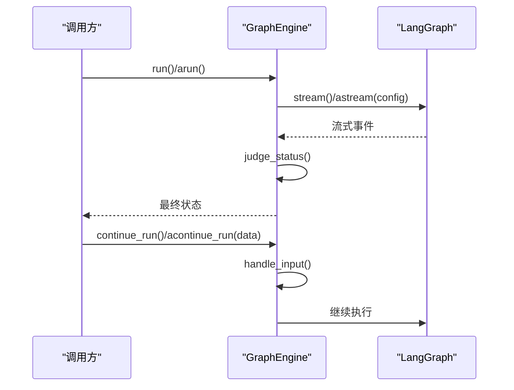

**图表来源**
- [graph_engine.py](file://src/backend/bisheng/workflow/graph/graph_engine.py#L288-L357)

**章节来源**
- [graph_engine.py](file://src/backend/bisheng/workflow/graph/graph_engine.py#L288-L357)

### 全局状态管理：GraphState
- 提供历史对话缓冲、全局变量池、变量读取/写入与数组/字典索引访问
- 支持按节点 ID 与键名存取变量，便于节点间共享结果
- 支持将变量以“node_id.key”形式导出，便于模板渲染与外部消费

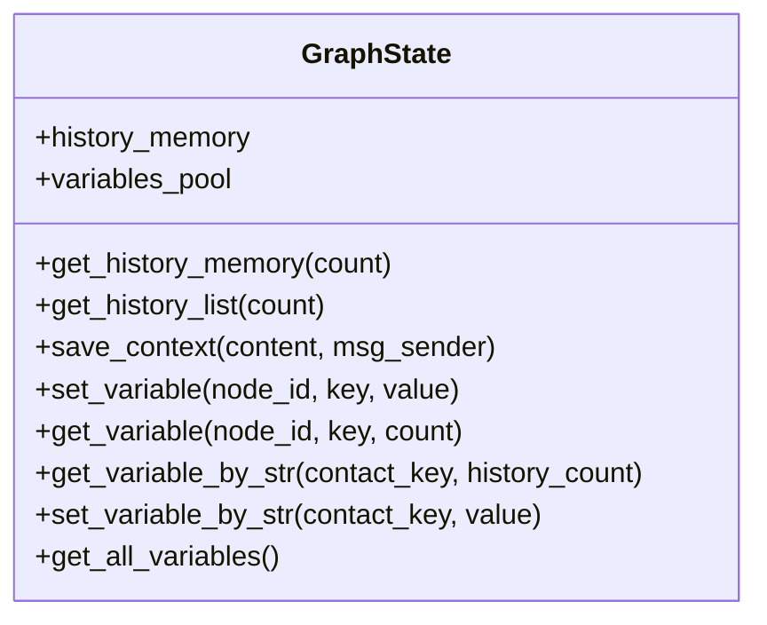

**图表来源**
- [graph_state.py](file://src/backend/bisheng/workflow/graph/graph_state.py#L8-L109)

**章节来源**
- [graph_state.py](file://src/backend/bisheng/workflow/graph/graph_state.py#L8-L109)

### 边管理：EdgeManage 与 EdgeBase
- EdgeBase：边的最小模型，包含源/目标节点 ID 与句柄
- EdgeManage：提供目标/源节点查询、目标边/源边查询、全路径分支查询、下游扩展查询等
- 为图引擎的边连接与多输入等待判定提供底层支撑

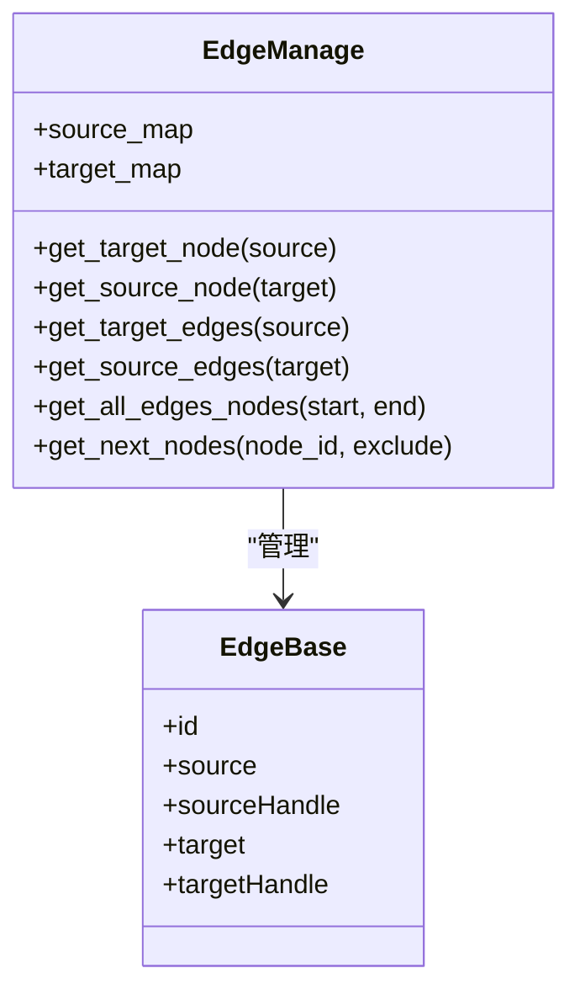

**图表来源**
- [edges.py](file://src/backend/bisheng/workflow/edges/edges.py#L6-L22)
- [edges.py](file://src/backend/bisheng/workflow/edges/edges.py#L36-L104)

**章节来源**
- [edges.py](file://src/backend/bisheng/workflow/edges/edges.py#L18-L104)

### 节点工厂与类型映射：NodeFactory 与 NodeType
- NodeFactory：根据 NodeType 映射到具体节点类并实例化
- NodeType：定义所有节点类型枚举，包括 START/END/INPUT/OUTPUT/CONDITION/LLM/TOOL/RAG/AGENT/REPORT/QA_RETRIEVER/KNOWLEDGE_RETRIEVER/NOTE 等

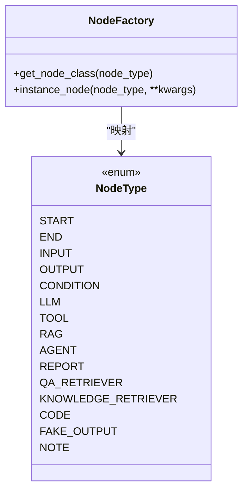

**图表来源**
- [node_manage.py](file://src/backend/bisheng/workflow/nodes/node_manage.py#L33-L44)
- [node.py](file://src/backend/bisheng/workflow/common/node.py#L8-L26)

**章节来源**
- [node_manage.py](file://src/backend/bisheng/workflow/nodes/node_manage.py#L33-L44)
- [node.py](file://src/backend/bisheng/workflow/common/node.py#L8-L26)

## 依赖关系分析
- 耦合与内聚
  - GraphEngine 对 EdgeManage、NodeFactory、GraphState 存在强依赖，负责协调它们之间的交互
  - BaseNode 抽象了所有节点的共同行为，降低各节点实现的耦合度
  - ConditionNode 与 OutputFakeNode 分别承担条件路由与输出中断职责，职责清晰
- 外部依赖
  - LangGraph StateGraph：图构建与执行核心
  - MemorySaver：检查点持久化
  - 回调系统：节点生命周期事件与用户输入事件

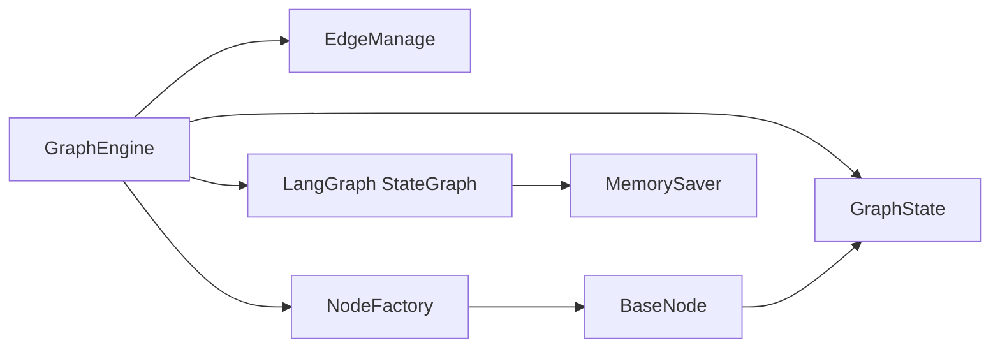

**图表来源**
- [graph_engine.py](file://src/backend/bisheng/workflow/graph/graph_engine.py#L62-L64)
- [base.py](file://src/backend/bisheng/workflow/nodes/base.py#L20-L60)

**章节来源**
- [graph_engine.py](file://src/backend/bisheng/workflow/graph/graph_engine.py#L62-L64)
- [base.py](file://src/backend/bisheng/workflow/nodes/base.py#L20-L60)

## 性能考量
- recursion_limit 调整
  - 默认值为固定常量，实际运行中会根据节点数、末端节点数与最大步数动态计算，确保不会过早截断长链路
  - 建议：在复杂图中适当提高 max_steps 与 recursion_limit，避免因递归深度不足导致的提前终止
- 检查点与中断
  - 使用 MemorySaver 保存中间状态，适合短时会话与调试；生产环境可考虑替换为持久化检查点
  - interrupt_before 用于在输入/输出节点处暂停，便于用户交互与可观测性
- 多输入等待
  - 通过层级比较与互斥分支检测减少不必要的等待，提升并发度；若图中存在大量互斥汇聚，可显著缩短等待时间

[本节为通用性能建议，不直接分析特定文件]

## 故障排查指南
- 节点无边错误
  - 现象：节点既无上游也无下游边时抛出异常
  - 排查：确认工作流数据中边的连通性，确保至少存在一条边
- 目标节点缺失
  - 现象：连接的目标节点不存在时抛出异常
  - 排查：核对目标节点 ID 是否正确，确认节点列表完整性
- 递归深度不足
  - 现象：长链路或深嵌套图提前终止
  - 排查：检查 recursion_limit 设置，必要时增大 max_steps 或手动提高 recursion_limit
- 用户输入未触发
  - 现象：期望在输入/输出节点处暂停但未收到回调
  - 排查：确认中断节点列表是否包含对应节点；检查回调是否正确注册

**章节来源**
- [graph_engine.py](file://src/backend/bisheng/workflow/graph/graph_engine.py#L84-L87)
- [graph_engine.py](file://src/backend/bisheng/workflow/graph/graph_engine.py#L112-L114)
- [graph_engine.py](file://src/backend/bisheng/workflow/graph/graph_engine.py#L280-L281)

## 结论
本工作流图引擎以 LangGraph 为核心，结合全局状态与节点工厂，实现了从工作流数据到可执行图的完整转换。其关键特性包括：
- 清晰的节点构建与边连接流程，支持条件边与普通边的混合图
- 基于层级与互斥分支的多输入等待机制，平衡并发与一致性
- 异步/同步双模式执行，满足不同场景需求
- 可扩展的节点体系与回调机制，便于二次开发与定制

## 附录

### 关键配置参数说明与调优建议
- recursion_limit
  - 作用：限制图执行的递归深度，防止无限循环或栈溢出
  - 调优：根据节点数量、末端节点数量与最大步数动态计算；复杂图建议适当提高
- checkpointer
  - 作用：保存中间状态，支持断点恢复与调试
  - 调优：开发/调试使用 MemorySaver；生产建议使用持久化检查点
- interrupt_before
  - 作用：在指定节点前暂停，触发用户输入或外部干预
  - 调优：将 INPUT/OUTPUT 节点加入中断列表，确保交互体验

**章节来源**
- [graph_engine.py](file://src/backend/bisheng/workflow/graph/graph_engine.py#L64-L64)
- [graph_engine.py](file://src/backend/bisheng/workflow/graph/graph_engine.py#L278-L279)
- [graph_engine.py](file://src/backend/bisheng/workflow/graph/graph_engine.py#L280-L281)