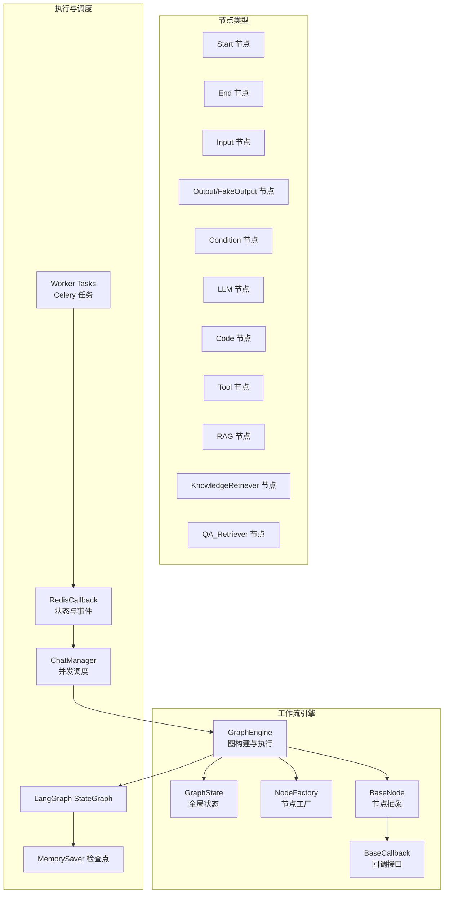
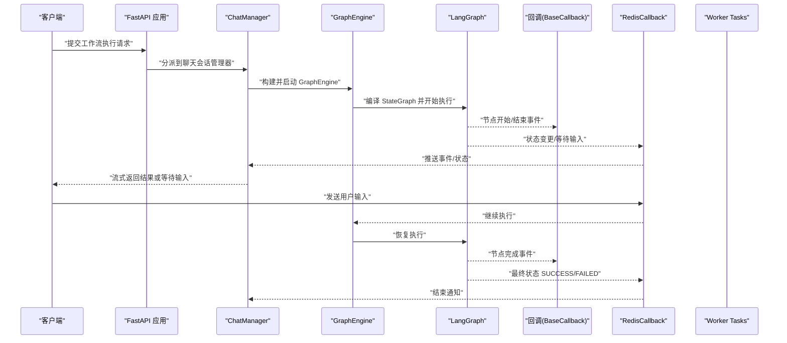
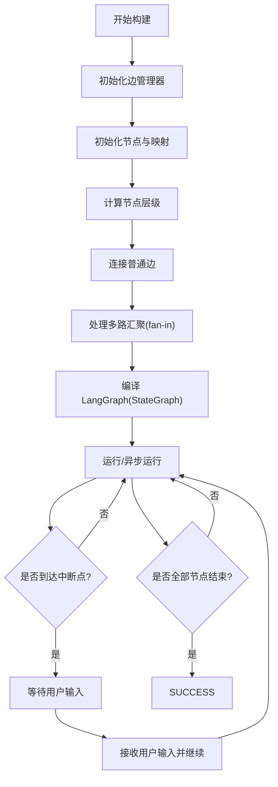
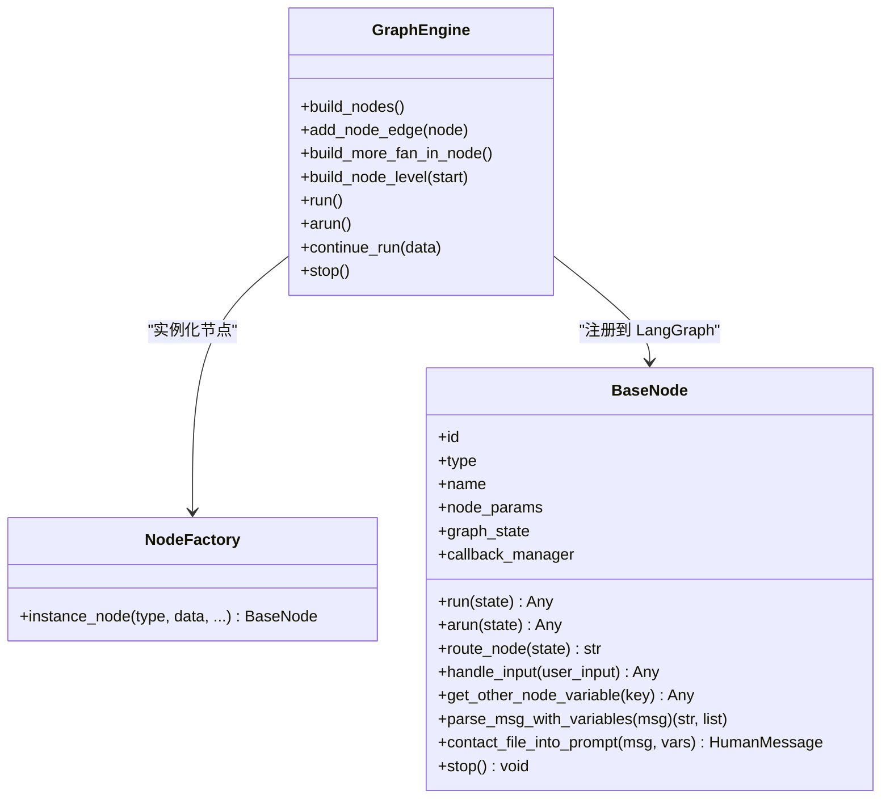
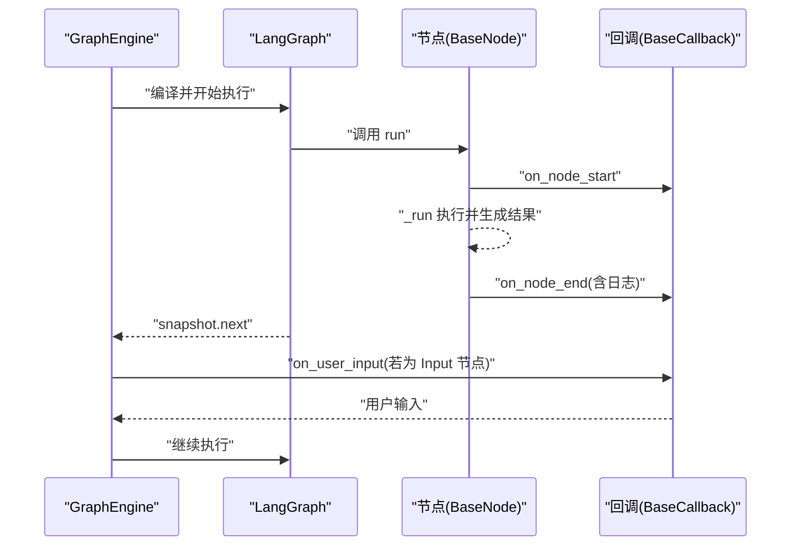
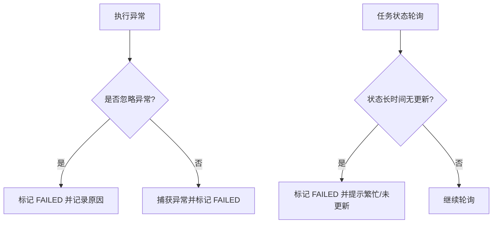
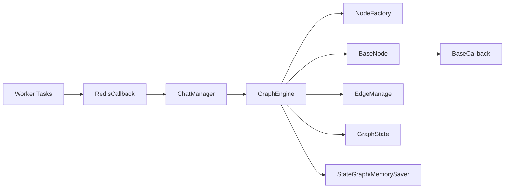

# 工作流引擎

<cite>
**本文引用的文件**
- [src/backend/bisheng/workflow/graph/graph_engine.py](file://src/backend/bisheng/workflow/graph/graph_engine.py)
- [src/backend/bisheng/workflow/nodes/base.py](file://src/backend/bisheng/workflow/nodes/base.py)
- [src/backend/bisheng/workflow/common/node.py](file://src/backend/bisheng/workflow/common/node.py)
- [src/backend/bisheng/workflow/callback/base_callback.py](file://src/backend/bisheng/workflow/callback/base_callback.py)
- [src/backend/bisheng/worker/workflow/redis_callback.py](file://src/backend/bisheng/worker/workflow/redis_callback.py)
- [src/backend/bisheng/worker/workflow/tasks.py](file://src/backend/bisheng/worker/workflow/tasks.py)
- [src/backend/bisheng/chat/manager.py](file://src/backend/bisheng/chat/manager.py)
- [src/backend/bisheng/main.py](file://src/backend/bisheng/main.py)
</cite>

## 目录
1. [引言](#引言)
2. [项目结构](#项目结构)
3. [核心组件](#核心组件)
4. [架构总览](#架构总览)
5. [组件详解](#组件详解)
6. [依赖关系分析](#依赖关系分析)
7. [性能与并发特性](#性能与并发特性)
8. [故障排查指南](#故障排查指南)
9. [结论](#结论)
10. [附录：最佳实践与扩展指南](#附录最佳实践与扩展指南)

## 引言
本技术文档面向 Bisheng 工作流引擎（基于 LangGraph 的执行引擎），系统性阐述其架构设计、图构建算法、节点调度机制、异步执行支持、状态管理、回调系统、错误处理策略，以及人类干预、条件分支、并行汇聚、循环控制等高级能力的实现原理。同时提供可操作的开发与运维最佳实践，帮助开发者高效扩展与定制节点及工作流。

## 项目结构
工作流引擎位于后端模块中，核心目录组织如下：
- workflow/graph：LangGraph 图构建与执行引擎
- workflow/nodes：节点体系（抽象基类、工厂与各类节点）
- workflow/common：通用模型与枚举（节点类型、参数结构）
- workflow/callback：回调接口与事件定义
- worker/workflow：Celery 任务与 Redis 回调桥接
- chat/manager：聊天会话与多工作流并发调度
- main：FastAPI 应用入口与全局异常处理

图表来源
- [src/backend/bisheng/workflow/graph/graph_engine.py](file://src/backend/bisheng/workflow/graph/graph_engine.py#L27-L71)
- [src/backend/bisheng/workflow/nodes/base.py](file://src/backend/bisheng/workflow/nodes/base.py#L20-L67)
- [src/backend/bisheng/workflow/common/node.py](file://src/backend/bisheng/workflow/common/node.py#L8-L26)
- [src/backend/bisheng/chat/manager.py](file://src/backend/bisheng/chat/manager.py#L358-L373)
- [src/backend/bisheng/worker/workflow/tasks.py](file://src/backend/bisheng/worker/workflow/tasks.py#L34-L61)
- [src/backend/bisheng/worker/workflow/redis_callback.py](file://src/backend/bisheng/worker/workflow/redis_callback.py#L156-L268)

章节来源
- [src/backend/bisheng/workflow/graph/graph_engine.py](file://src/backend/bisheng/workflow/graph/graph_engine.py#L27-L71)
- [src/backend/bisheng/workflow/nodes/base.py](file://src/backend/bisheng/workflow/nodes/base.py#L20-L67)
- [src/backend/bisheng/workflow/common/node.py](file://src/backend/bisheng/workflow/common/node.py#L8-L26)
- [src/backend/bisheng/chat/manager.py](file://src/backend/bisheng/chat/manager.py#L358-L373)
- [src/backend/bisheng/worker/workflow/tasks.py](file://src/backend/bisheng/worker/workflow/tasks.py#L34-L61)
- [src/backend/bisheng/worker/workflow/redis_callback.py](file://src/backend/bisheng/worker/workflow/redis_callback.py#L156-L268)

## 核心组件
- 图引擎 GraphEngine：负责从工作流数据构建 LangGraph，编译 StateGraph，驱动同步/异步执行，处理人类干预与中断，维护状态与原因。
- 节点抽象 BaseNode：统一节点生命周期（初始化、运行、停止、输入处理）、变量解析与注入、日志与回调上报。
- 节点工厂 NodeFactory：根据节点类型实例化具体节点，传递上下文与回调。
- 回调接口 BaseCallback：定义节点开始/结束、用户输入、流式消息、输出选择/输入等事件钩子。
- 执行与调度：LangGraph StateGraph + MemorySaver；ChatManager 并发调度多个工作流；Celery Worker + RedisCallback 管理任务状态与超时。

章节来源
- [src/backend/bisheng/workflow/graph/graph_engine.py](file://src/backend/bisheng/workflow/graph/graph_engine.py#L27-L71)
- [src/backend/bisheng/workflow/nodes/base.py](file://src/backend/bisheng/workflow/nodes/base.py#L20-L67)
- [src/backend/bisheng/workflow/callback/base_callback.py](file://src/backend/bisheng/workflow/callback/base_callback.py#L8-L47)

## 架构总览
下图展示从请求到执行再到回调的整体链路，以及与 Celery/Redis 的集成：

图表来源
- [src/backend/bisheng/main.py](file://src/backend/bisheng/main.py#L64-L102)
- [src/backend/bisheng/chat/manager.py](file://src/backend/bisheng/chat/manager.py#L358-L373)
- [src/backend/bisheng/workflow/graph/graph_engine.py](file://src/backend/bisheng/workflow/graph/graph_engine.py#L288-L323)
- [src/backend/bisheng/worker/workflow/redis_callback.py](file://src/backend/bisheng/worker/workflow/redis_callback.py#L156-L268)
- [src/backend/bisheng/worker/workflow/tasks.py](file://src/backend/bisheng/worker/workflow/tasks.py#L34-L61)

## 组件详解

### 图构建与执行引擎（GraphEngine）
- 职责
  - 解析工作流数据，构建边管理器 EdgeManage，记录入度/出度与层级。
  - 实例化节点，注册到 LangGraph StateGraph，设置 START/END 边与条件边。
  - 处理多路汇聚（fan-in）场景，自动插入等待边或直接连接，避免竞态。
  - 支持同步/异步执行（run/arun），并行/串行由图拓扑决定。
  - 人类干预：在 Input/Output 节点处设置中断，等待用户输入后继续。
  - 停止：向所有节点广播停止信号。
- 关键算法
  - 节点层级计算：从起始节点出发，深度遍历并记录最大层级，用于 fan-in 判定。
  - fan-in 分支判定：若存在互斥分支（如 condition/output），则无需等待；否则需要等待所有前置节点完成。
  - 条件边路由：Condition 节点通过 route_node 提供路由函数，LangGraph 条件边按目标节点映射。
- 执行流程
  - 编译前配置 recursion_limit，避免深递归栈溢出。
  - stream/astream 驱动执行，周期性检查 snapshot.next 决定是否成功或进入等待。

图表来源
- [src/backend/bisheng/workflow/graph/graph_engine.py](file://src/backend/bisheng/workflow/graph/graph_engine.py#L72-L131)
- [src/backend/bisheng/workflow/graph/graph_engine.py](file://src/backend/bisheng/workflow/graph/graph_engine.py#L179-L198)
- [src/backend/bisheng/workflow/graph/graph_engine.py](file://src/backend/bisheng/workflow/graph/graph_engine.py#L253-L286)
- [src/backend/bisheng/workflow/graph/graph_engine.py](file://src/backend/bisheng/workflow/graph/graph_engine.py#L288-L323)
- [src/backend/bisheng/workflow/graph/graph_engine.py](file://src/backend/bisheng/workflow/graph/graph_engine.py#L358-L387)

章节来源
- [src/backend/bisheng/workflow/graph/graph_engine.py](file://src/backend/bisheng/workflow/graph/graph_engine.py#L27-L71)
- [src/backend/bisheng/workflow/graph/graph_engine.py](file://src/backend/bisheng/workflow/graph/graph_engine.py#L72-L131)
- [src/backend/bisheng/workflow/graph/graph_engine.py](file://src/backend/bisheng/workflow/graph/graph_engine.py#L179-L198)
- [src/backend/bisheng/workflow/graph/graph_engine.py](file://src/backend/bisheng/workflow/graph/graph_engine.py#L253-L286)
- [src/backend/bisheng/workflow/graph/graph_engine.py](file://src/backend/bisheng/workflow/graph/graph_engine.py#L288-L323)
- [src/backend/bisheng/workflow/graph/graph_engine.py](file://src/backend/bisheng/workflow/graph/graph_engine.py#L358-L387)

### 节点系统与工厂模式
- 抽象基类 BaseNode
  - 生命周期：init_data → run/arun → 结束回调 → 变量写入 GraphState。
  - 输入处理：handle_input 合并用户输入到 node_params。
  - 变量解析：parse_msg_with_variables 将模板变量替换为其他节点输出。
  - 文件注入：contact_file_into_prompt 将图片变量转为多模态内容。
  - 停止机制：stop 设置标志位，后续执行抛出忽略异常。
- 节点类型
  - 控制流：Start/End/Input/Output/FakeOutput/Condition。
  - 业务节点：LLM/Code/Tool/RAG/KnowledgeRetriever/QA_Retriever/Agent/Report。
- 工厂 NodeFactory
  - 根据节点类型与数据构造具体节点实例，注入 graph_state、target_edges、callback、max_steps 等上下文。

图表来源
- [src/backend/bisheng/workflow/nodes/base.py](file://src/backend/bisheng/workflow/nodes/base.py#L20-L67)
- [src/backend/bisheng/workflow/nodes/base.py](file://src/backend/bisheng/workflow/nodes/base.py#L189-L230)
- [src/backend/bisheng/workflow/graph/graph_engine.py](file://src/backend/bisheng/workflow/graph/graph_engine.py#L200-L251)

章节来源
- [src/backend/bisheng/workflow/nodes/base.py](file://src/backend/bisheng/workflow/nodes/base.py#L20-L67)
- [src/backend/bisheng/workflow/nodes/base.py](file://src/backend/bisheng/workflow/nodes/base.py#L189-L230)
- [src/backend/bisheng/workflow/common/node.py](file://src/backend/bisheng/workflow/common/node.py#L8-L26)
- [src/backend/bisheng/workflow/graph/graph_engine.py](file://src/backend/bisheng/workflow/graph/graph_engine.py#L200-L251)

### 状态管理与回调系统
- 状态管理
  - GraphState：全局变量存储，节点输出以 {node_id: {key: value}} 形式写入，供下游节点读取。
  - GraphEngine.judge_status：通过 snapshot.next 判断是否完成、是否进入 INPUT/WAITING。
- 回调系统
  - BaseCallback 定义节点开始/结束、用户输入、引导词/问题、流式消息、输出选择/输入等事件。
  - BaseNode 在 run 中触发 on_node_start/on_node_end，并在非 Output 节点时上报日志。
- 人类干预
  - Input 节点：GraphEngine 在编译时将中断节点加入 interrupt_before，执行到该节点时暂停并上报 UserInputData。
  - Output 节点：通过 FakeOutput 节点实现中断，等待用户确认后再路由到下一节点。

图表来源
- [src/backend/bisheng/workflow/graph/graph_engine.py](file://src/backend/bisheng/workflow/graph/graph_engine.py#L358-L387)
- [src/backend/bisheng/workflow/nodes/base.py](file://src/backend/bisheng/workflow/nodes/base.py#L201-L223)
- [src/backend/bisheng/workflow/callback/base_callback.py](file://src/backend/bisheng/workflow/callback/base_callback.py#L13-L46)

章节来源
- [src/backend/bisheng/workflow/graph/graph_engine.py](file://src/backend/bisheng/workflow/graph/graph_engine.py#L358-L387)
- [src/backend/bisheng/workflow/nodes/base.py](file://src/backend/bisheng/workflow/nodes/base.py#L201-L223)
- [src/backend/bisheng/workflow/callback/base_callback.py](file://src/backend/bisheng/workflow/callback/base_callback.py#L13-L46)

### 错误处理与超时策略
- 忽略异常：节点侧 stop 或超过最大步数时抛出忽略异常，GraphEngine 捕获并标记 FAILED。
- 任务级错误：Worker 侧根据状态 reason 解析具体错误类型（如节点参数错误、版本更新、最大次数限制、等待超时等）。
- 超时与忙碌检测：若长时间无状态更新，标记 FAILED 并提示繁忙或状态未更新。

图表来源
- [src/backend/bisheng/workflow/graph/graph_engine.py](file://src/backend/bisheng/workflow/graph/graph_engine.py#L294-L301)
- [src/backend/bisheng/worker/workflow/redis_callback.py](file://src/backend/bisheng/worker/workflow/redis_callback.py#L156-L176)
- [src/backend/bisheng/worker/workflow/redis_callback.py](file://src/backend/bisheng/worker/workflow/redis_callback.py#L249-L268)

章节来源
- [src/backend/bisheng/workflow/graph/graph_engine.py](file://src/backend/bisheng/workflow/graph/graph_engine.py#L294-L301)
- [src/backend/bisheng/worker/workflow/redis_callback.py](file://src/backend/bisheng/worker/workflow/redis_callback.py#L156-L176)
- [src/backend/bisheng/worker/workflow/redis_callback.py](file://src/backend/bisheng/worker/workflow/redis_callback.py#L249-L268)

### 并发、循环与条件分支
- 并发与汇聚
  - 多路汇聚（fan-in）：GraphEngine 自动识别互斥分支与非互斥分支，决定是否插入等待边。
  - 层级比较：通过节点层级判断是否需要等待所有上游节点完成。
- 条件分支
  - Condition 节点提供 route_node 函数，LangGraph 条件边按目标节点映射进行路由。
- 循环控制
  - 通过层级遍历与回边检测，避免无限递归；recursion_limit 动态计算，防止栈溢出。

章节来源
- [src/backend/bisheng/workflow/graph/graph_engine.py](file://src/backend/bisheng/workflow/graph/graph_engine.py#L120-L177)
- [src/backend/bisheng/workflow/graph/graph_engine.py](file://src/backend/bisheng/workflow/graph/graph_engine.py#L179-L198)
- [src/backend/bisheng/workflow/graph/graph_engine.py](file://src/backend/bisheng/workflow/graph/graph_engine.py#L277-L281)

### 异步执行支持
- GraphEngine 支持同步 run 与异步 arun，底层使用 LangGraph 的 stream/astream。
- 节点层 BaseNode 默认 run 实现，异步通过 arun 调用 run（可按需覆盖）。
- 适用于高吞吐场景，结合 ChatManager 的并发调度与 Worker 任务队列。

章节来源
- [src/backend/bisheng/workflow/graph/graph_engine.py](file://src/backend/bisheng/workflow/graph/graph_engine.py#L303-L322)
- [src/backend/bisheng/workflow/nodes/base.py](file://src/backend/bisheng/workflow/nodes/base.py#L225-L226)

### 人类干预机制
- Input 节点：编译时加入中断，执行到该节点时暂停并上报 UserInputData，等待用户输入后继续。
- Output 节点：通过 FakeOutput 节点实现中断，等待用户确认后再路由到下一节点。
- 回调：BaseCallback.on_user_input 用于前端交互与表单渲染。

章节来源
- [src/backend/bisheng/workflow/graph/graph_engine.py](file://src/backend/bisheng/workflow/graph/graph_engine.py#L370-L383)
- [src/backend/bisheng/workflow/callback/base_callback.py](file://src/backend/bisheng/workflow/callback/base_callback.py#L21-L23)

## 依赖关系分析
- 组件耦合
  - GraphEngine 依赖 NodeFactory、BaseNode、EdgeManage、GraphState、LangGraph。
  - BaseNode 依赖 GraphState、回调、变量解析工具。
  - Worker/RedisCallback 与 ChatManager 协同，形成任务级状态机。
- 外部依赖
  - LangGraph StateGraph、MemorySaver。
  - Celery 任务队列与 Redis 存储。

图表来源
- [src/backend/bisheng/workflow/graph/graph_engine.py](file://src/backend/bisheng/workflow/graph/graph_engine.py#L27-L71)
- [src/backend/bisheng/workflow/nodes/base.py](file://src/backend/bisheng/workflow/nodes/base.py#L20-L67)
- [src/backend/bisheng/chat/manager.py](file://src/backend/bisheng/chat/manager.py#L358-L373)
- [src/backend/bisheng/worker/workflow/tasks.py](file://src/backend/bisheng/worker/workflow/tasks.py#L34-L61)
- [src/backend/bisheng/worker/workflow/redis_callback.py](file://src/backend/bisheng/worker/workflow/redis_callback.py#L156-L268)

章节来源
- [src/backend/bisheng/workflow/graph/graph_engine.py](file://src/backend/bisheng/workflow/graph/graph_engine.py#L27-L71)
- [src/backend/bisheng/workflow/nodes/base.py](file://src/backend/bisheng/workflow/nodes/base.py#L20-L67)
- [src/backend/bisheng/chat/manager.py](file://src/backend/bisheng/chat/manager.py#L358-L373)
- [src/backend/bisheng/worker/workflow/tasks.py](file://src/backend/bisheng/worker/workflow/tasks.py#L34-L61)
- [src/backend/bisheng/worker/workflow/redis_callback.py](file://src/backend/bisheng/worker/workflow/redis_callback.py#L156-L268)

## 性能与并发特性
- 并发调度：ChatManager 对同一会话内的多个工作流进行并发处理，避免阻塞。
- 异步执行：GraphEngine 支持异步运行，LangGraph 的 astream 降低阻塞。
- 递归限制：根据节点数量动态计算 recursion_limit，平衡深度与稳定性。
- 检查点：MemorySaver 提供轻量检查点，便于中断恢复与状态追踪。
- 资源控制：节点层 stop 与最大步数限制，防止资源滥用。

章节来源
- [src/backend/bisheng/chat/manager.py](file://src/backend/bisheng/chat/manager.py#L358-L373)
- [src/backend/bisheng/workflow/graph/graph_engine.py](file://src/backend/bisheng/workflow/graph/graph_engine.py#L277-L281)
- [src/backend/bisheng/workflow/nodes/base.py](file://src/backend/bisheng/workflow/nodes/base.py#L194-L197)

## 故障排查指南
- 常见错误类型
  - 节点参数错误：解析失败或字段缺失。
  - 版本更新：节点被更新导致执行失败。
  - 最大执行次数：超过 max_steps 触发忽略异常。
  - 等待超时：长时间无状态更新，标记 FAILED。
  - 任务繁忙：Worker 线程池满，无法及时响应。
- 排查步骤
  - 查看 GraphEngine.reason 与回调日志。
  - 检查 RedisCallback 的状态与错误映射。
  - 确认 Input/Output 节点是否正确设置中断。
  - 校验边连接与 fan-in 分支逻辑。

章节来源
- [src/backend/bisheng/worker/workflow/redis_callback.py](file://src/backend/bisheng/worker/workflow/redis_callback.py#L156-L176)
- [src/backend/bisheng/worker/workflow/redis_callback.py](file://src/backend/bisheng/worker/workflow/redis_callback.py#L249-L268)
- [src/backend/bisheng/workflow/graph/graph_engine.py](file://src/backend/bisheng/workflow/graph/graph_engine.py#L294-L301)

## 结论
Bisheng 工作流引擎以 LangGraph 为核心，结合节点工厂模式与回调系统，实现了可控、可观测、可扩展的工作流执行框架。通过严格的 fan-in/fan-out 语义、条件路由与人类干预机制，满足复杂业务场景下的编排需求。配合 Celery/Redis 的任务与状态管理，具备良好的并发与容错能力。

## 附录：最佳实践与扩展指南

### 设计与开发最佳实践
- 节点设计
  - 明确职责单一，避免在节点内做过多 IO；将耗时操作下沉至工具或外部服务。
  - 使用变量解析与文件注入能力，提升节点复用性。
  - 正确设置 Input/Output 中断点，保证用户体验与一致性。
- 图构建
  - 合理规划 fan-in 分支，尽量减少不必要的等待边，提高并发度。
  - 条件节点仅做“选择”，不承载复杂逻辑，保持图清晰。
- 回调与日志
  - 在节点中按轮次记录关键动作与参数，便于审计与回放。
  - 使用回调上报流式消息，前端实时反馈。

### 性能优化建议
- 优先使用异步执行与并发调度，减少阻塞。
- 合理设置 max_steps 与 recursion_limit，避免深度图导致的性能问题。
- 利用检查点与中断恢复，缩短重试时间。
- 控制节点粒度，避免过长链路与过度嵌套。

### 调试技巧
- 开启回调日志，定位节点执行阶段与耗时。
- 使用快照（snapshot）观察 next 节点与状态变化。
- 逐步缩小问题范围：先验证边连接，再验证条件路由，最后验证节点逻辑。

### 自定义节点开发与扩展
- 新增节点类型
  - 继承 BaseNode，实现 _run、route_node（条件节点）、handle_input（需要交互的节点）。
  - 在 NodeFactory 注册新类型，确保 GraphEngine 能正确实例化。
- 扩展回调
  - 继承 BaseCallback，实现特定事件处理（如埋点、告警、通知）。
- 工作流扩展
  - 通过 EdgeManage 与 GraphEngine 的边连接能力，组合已有节点实现复杂流程。
  - 使用 FakeOutput 与 Input 节点实现灵活的人机协作。

章节来源
- [src/backend/bisheng/workflow/nodes/base.py](file://src/backend/bisheng/workflow/nodes/base.py#L82-L134)
- [src/backend/bisheng/workflow/graph/graph_engine.py](file://src/backend/bisheng/workflow/graph/graph_engine.py#L200-L251)
- [src/backend/bisheng/workflow/callback/base_callback.py](file://src/backend/bisheng/workflow/callback/base_callback.py#L8-L47)