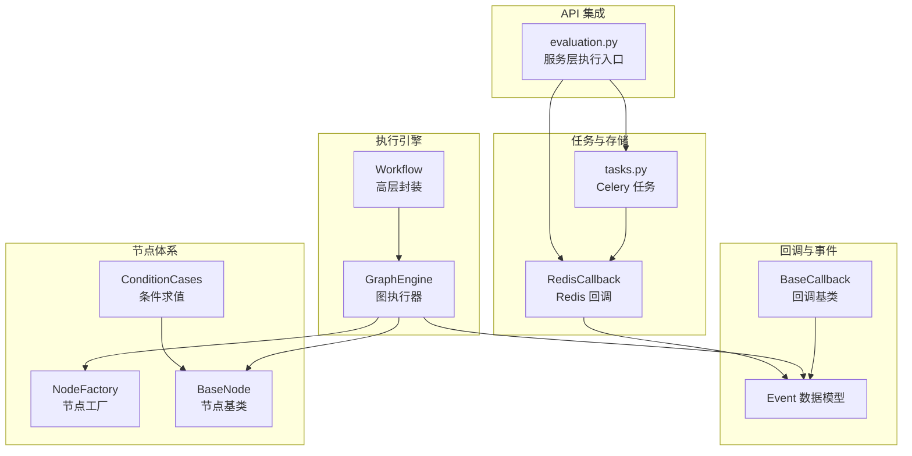
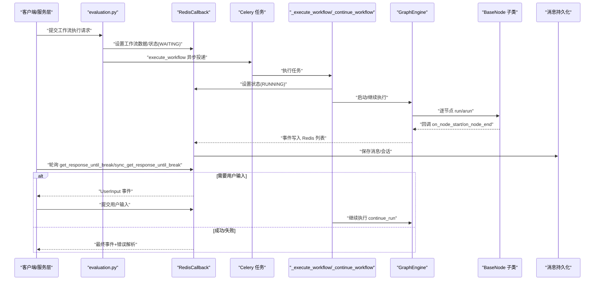
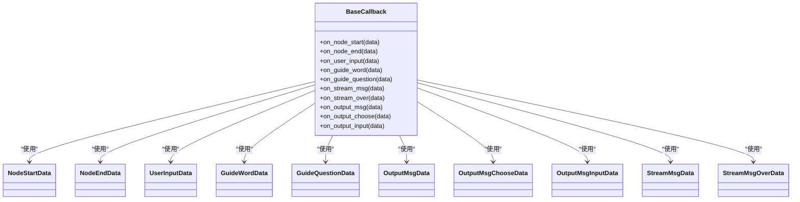
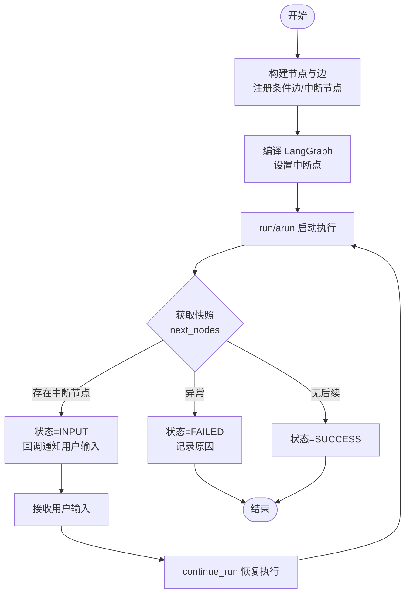
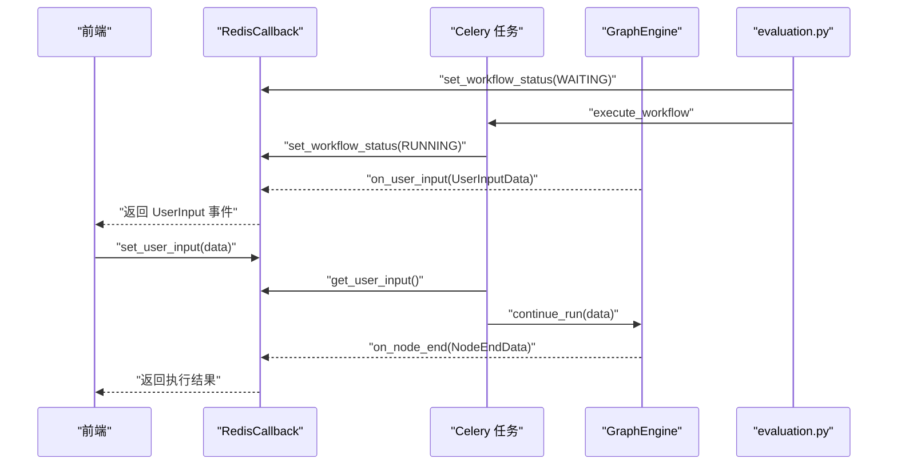
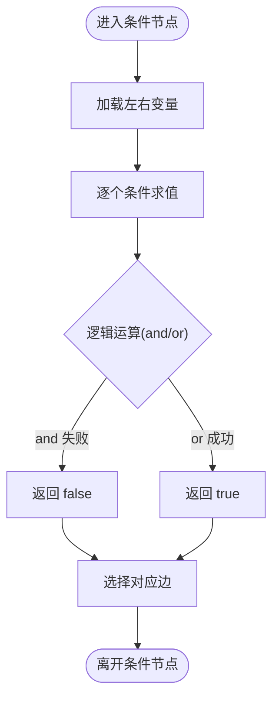
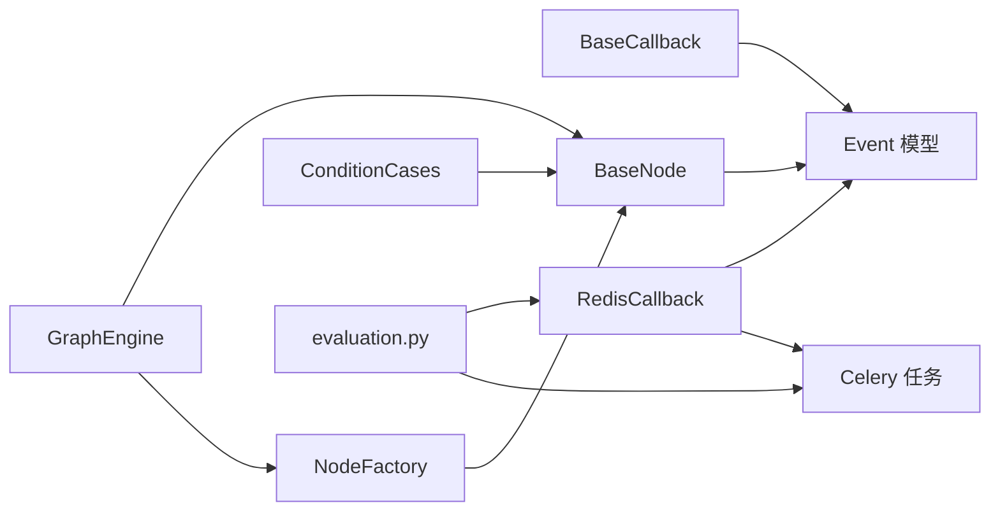

# 工作流执行控制

<cite>
**本文引用的文件**
- [src/backend/bisheng/workflow/callback/base_callback.py](file://src/backend/bisheng/workflow/callback/base_callback.py)
- [src/backend/bisheng/workflow/callback/event.py](file://src/backend/bisheng/workflow/callback/event.py)
- [src/backend/bisheng/workflow/common/workflow.py](file://src/backend/bisheng/workflow/common/workflow.py)
- [src/backend/bisheng/workflow/common/condition.py](file://src/backend/bisheng/workflow/common/condition.py)
- [src/backend/bisheng/workflow/graph/graph_engine.py](file://src/backend/bisheng/workflow/graph/graph_engine.py)
- [src/backend/bisheng/workflow/graph/workflow.py](file://src/backend/bisheng/workflow/graph/workflow.py)
- [src/backend/bisheng/workflow/nodes/base.py](file://src/backend/bisheng/workflow/nodes/base.py)
- [src/backend/bisheng/workflow/nodes/node_manage.py](file://src/backend/bisheng/workflow/nodes/node_manage.py)
- [src/backend/bisheng/workflow/nodes/condition/conidition_case.py](file://src/backend/bisheng/workflow/nodes/condition/conidition_case.py)
- [src/backend/bisheng/worker/workflow/redis_callback.py](file://src/backend/bisheng/worker/workflow/redis_callback.py)
- [src/backend/bisheng/worker/workflow/tasks.py](file://src/backend/bisheng/worker/workflow/tasks.py)
- [src/backend/bisheng/api/services/evaluation.py](file://src/backend/bisheng/api/services/evaluation.py)
</cite>

## 目录
1. [引言](#引言)
2. [项目结构](#项目结构)
3. [核心组件](#核心组件)
4. [架构总览](#架构总览)
5. [详细组件分析](#详细组件分析)
6. [依赖关系分析](#依赖关系分析)
7. [性能考量](#性能考量)
8. [故障排查指南](#故障排查指南)
9. [结论](#结论)
10. [附录](#附录)

## 引言
本技术文档围绕 Bisheng 的工作流执行控制系统，系统性阐述回调系统设计与实现、执行控制模式（同步/异步/中断恢复）、人类干预机制（用户输入收集、交互式暂停与手动继续）、条件判断与分支控制、执行监控与状态查询，并提供扩展指南与性能优化建议。目标是帮助开发者快速理解并高效扩展工作流引擎。

## 项目结构
工作流执行控制主要分布在以下模块：
- 回调与事件模型：定义统一的回调接口与事件数据结构
- 执行引擎：基于 LangGraph 的图执行器，支持同步/异步运行与中断恢复
- 节点体系：节点工厂与各类节点（输入/输出/条件/工具/RAG/LLM/Agent/代码等）
- 任务与存储：Celery 任务调度、Redis 状态与消息队列、数据库消息持久化
- API 集成：服务层触发执行、前端轮询结果

图表来源
- [src/backend/bisheng/workflow/callback/base_callback.py](file://src/backend/bisheng/workflow/callback/base_callback.py#L1-L47)
- [src/backend/bisheng/workflow/callback/event.py](file://src/backend/bisheng/workflow/callback/event.py#L1-L72)
- [src/backend/bisheng/workflow/graph/graph_engine.py](file://src/backend/bisheng/workflow/graph/graph_engine.py#L1-L388)
- [src/backend/bisheng/workflow/graph/workflow.py](file://src/backend/bisheng/workflow/graph/workflow.py#L1-L91)
- [src/backend/bisheng/workflow/nodes/base.py](file://src/backend/bisheng/workflow/nodes/base.py#L1-L230)
- [src/backend/bisheng/workflow/nodes/node_manage.py](file://src/backend/bisheng/workflow/nodes/node_manage.py#L1-L44)
- [src/backend/bisheng/workflow/nodes/condition/conidition_case.py](file://src/backend/bisheng/workflow/nodes/condition/conidition_case.py#L1-L86)
- [src/backend/bisheng/worker/workflow/redis_callback.py](file://src/backend/bisheng/worker/workflow/redis_callback.py#L1-L601)
- [src/backend/bisheng/worker/workflow/tasks.py](file://src/backend/bisheng/worker/workflow/tasks.py#L1-L132)
- [src/backend/bisheng/api/services/evaluation.py](file://src/backend/bisheng/api/services/evaluation.py#L241-L258)

章节来源
- [src/backend/bisheng/workflow/callback/base_callback.py](file://src/backend/bisheng/workflow/callback/base_callback.py#L1-L47)
- [src/backend/bisheng/workflow/callback/event.py](file://src/backend/bisheng/workflow/callback/event.py#L1-L72)
- [src/backend/bisheng/workflow/graph/graph_engine.py](file://src/backend/bisheng/workflow/graph/graph_engine.py#L1-L388)
- [src/backend/bisheng/workflow/graph/workflow.py](file://src/backend/bisheng/workflow/graph/workflow.py#L1-L91)
- [src/backend/bisheng/workflow/nodes/base.py](file://src/backend/bisheng/workflow/nodes/base.py#L1-L230)
- [src/backend/bisheng/workflow/nodes/node_manage.py](file://src/backend/bisheng/workflow/nodes/node_manage.py#L1-L44)
- [src/backend/bisheng/workflow/nodes/condition/conidition_case.py](file://src/backend/bisheng/workflow/nodes/condition/conidition_case.py#L1-L86)
- [src/backend/bisheng/worker/workflow/redis_callback.py](file://src/backend/bisheng/worker/workflow/redis_callback.py#L1-L601)
- [src/backend/bisheng/worker/workflow/tasks.py](file://src/backend/bisheng/worker/workflow/tasks.py#L1-L132)
- [src/backend/bisheng/api/services/evaluation.py](file://src/backend/bisheng/api/services/evaluation.py#L241-L258)

## 核心组件
- 回调系统与事件模型
  - BaseCallback 定义节点开始/结束、用户输入、引导词/问题、流式消息、输出消息、选择输入等事件钩子
  - Event 数据模型定义各事件的数据载体（如 NodeStartData、NodeEndData、UserInputData、OutputMsgData、StreamMsgData 等）
- 执行引擎
  - GraphEngine 基于 LangGraph 构建 StateGraph，编译后在运行时按边规则推进，支持同步/异步流式执行
  - Workflow 对 GraphEngine 进行高层封装，提供 run/continue_run/arun/acontinue_run/status/reason/stop 等能力
- 节点体系
  - BaseNode 统一节点生命周期：初始化参数、变量解析、执行入口 run/arun、回调上报、停止标志
  - NodeFactory 提供节点类型到类的映射，动态实例化节点
  - 条件节点 ConditionCases 支持多条件组合与逻辑运算（and/or），比较操作符覆盖常见场景
- 任务与存储
  - RedisCallback 实现 BaseCallback，负责将事件写入 Redis 列表，维护状态键、输入键、停止键，提供同步/异步轮询接口
  - Celery 任务 execute_workflow/_execute_workflow/_continue_workflow 负责拉起执行、恢复执行与状态判定
- API 集成
  - 服务层通过 RedisCallback 初始化工作流数据与状态，投递 Celery 任务，并通过 sync_get_response_until_break 持续监听结果

章节来源
- [src/backend/bisheng/workflow/callback/base_callback.py](file://src/backend/bisheng/workflow/callback/base_callback.py#L1-L47)
- [src/backend/bisheng/workflow/callback/event.py](file://src/backend/bisheng/workflow/callback/event.py#L1-L72)
- [src/backend/bisheng/workflow/graph/graph_engine.py](file://src/backend/bisheng/workflow/graph/graph_engine.py#L1-L388)
- [src/backend/bisheng/workflow/graph/workflow.py](file://src/backend/bisheng/workflow/graph/workflow.py#L1-L91)
- [src/backend/bisheng/workflow/nodes/base.py](file://src/backend/bisheng/workflow/nodes/base.py#L1-L230)
- [src/backend/bisheng/workflow/nodes/node_manage.py](file://src/backend/bisheng/workflow/nodes/node_manage.py#L1-L44)
- [src/backend/bisheng/workflow/nodes/condition/conidition_case.py](file://src/backend/bisheng/workflow/nodes/condition/conidition_case.py#L1-L86)
- [src/backend/bisheng/worker/workflow/redis_callback.py](file://src/backend/bisheng/worker/workflow/redis_callback.py#L1-L601)
- [src/backend/bisheng/worker/workflow/tasks.py](file://src/backend/bisheng/worker/workflow/tasks.py#L1-L132)
- [src/backend/bisheng/api/services/evaluation.py](file://src/backend/bisheng/api/services/evaluation.py#L241-L258)

## 架构总览
下图展示从 API 触发到执行完成的关键流程，包括同步/异步模式、人类干预与状态监控。

图表来源
- [src/backend/bisheng/api/services/evaluation.py](file://src/backend/bisheng/api/services/evaluation.py#L241-L258)
- [src/backend/bisheng/worker/workflow/redis_callback.py](file://src/backend/bisheng/worker/workflow/redis_callback.py#L178-L275)
- [src/backend/bisheng/worker/workflow/tasks.py](file://src/backend/bisheng/worker/workflow/tasks.py#L53-L132)
- [src/backend/bisheng/workflow/graph/graph_engine.py](file://src/backend/bisheng/workflow/graph/graph_engine.py#L288-L357)
- [src/backend/bisheng/workflow/nodes/base.py](file://src/backend/bisheng/workflow/nodes/base.py#L189-L223)

## 详细组件分析

### 回调系统与事件模型
- BaseCallback 抽象了节点生命周期与交互事件，便于接入多种输出通道（如 WebSocket、消息队列、日志等）
- Event 数据模型为前端与服务端提供一致的消息格式，包含唯一执行 ID、节点信息、输出内容、源文档等

图表来源
- [src/backend/bisheng/workflow/callback/base_callback.py](file://src/backend/bisheng/workflow/callback/base_callback.py#L1-L47)
- [src/backend/bisheng/workflow/callback/event.py](file://src/backend/bisheng/workflow/callback/event.py#L1-L72)

章节来源
- [src/backend/bisheng/workflow/callback/base_callback.py](file://src/backend/bisheng/workflow/callback/base_callback.py#L1-L47)
- [src/backend/bisheng/workflow/callback/event.py](file://src/backend/bisheng/workflow/callback/event.py#L1-L72)

### 执行引擎与执行模式
- GraphEngine
  - 构建节点与边，注册条件边与“需要中断”的节点（输入/输出 Fake），编译为 LangGraph 并设置中断点
  - 提供 run/arun 与 continue_run/acontinue_run，支持在收到用户输入后恢复执行
  - 在节点执行前后通过回调上报事件；根据快照判断成功/输入等待/异常等状态
- Workflow
  - 封装 GraphEngine，提供高层 run/stop/status/reason 接口；异步模式下持续驱动直到非 RUNNING 状态

图表来源
- [src/backend/bisheng/workflow/graph/graph_engine.py](file://src/backend/bisheng/workflow/graph/graph_engine.py#L277-L388)
- [src/backend/bisheng/workflow/graph/workflow.py](file://src/backend/bisheng/workflow/graph/workflow.py#L67-L91)

章节来源
- [src/backend/bisheng/workflow/graph/graph_engine.py](file://src/backend/bisheng/workflow/graph/graph_engine.py#L1-L388)
- [src/backend/bisheng/workflow/graph/workflow.py](file://src/backend/bisheng/workflow/graph/workflow.py#L1-L91)

### 人类干预机制（用户输入、交互式暂停、手动继续）
- 输入节点与输出 Fake 节点
  - 输入节点在执行前暴露输入模式；输出节点后插入 Fake 节点以拦截并等待用户确认/选择
- RedisCallback 与 Celery 协同
  - 服务层设置状态为 WAITING，投递任务；任务中设置 RUNNING 并开始执行
  - 当引擎进入 INPUT 状态时，回调触发用户输入事件；前端轮询获取事件
  - 用户输入通过 Redis 键传递，任务侧检测到输入后调用 continue_workflow 恢复执行
- 输入校验与历史消息更新
  - 支持对输入模式进行校验；可更新旧消息中的用户输入或选择项

图表来源
- [src/backend/bisheng/worker/workflow/redis_callback.py](file://src/backend/bisheng/worker/workflow/redis_callback.py#L178-L275)
- [src/backend/bisheng/worker/workflow/tasks.py](file://src/backend/bisheng/worker/workflow/tasks.py#L110-L132)
- [src/backend/bisheng/api/services/evaluation.py](file://src/backend/bisheng/api/services/evaluation.py#L241-L258)

章节来源
- [src/backend/bisheng/worker/workflow/redis_callback.py](file://src/backend/bisheng/worker/workflow/redis_callback.py#L1-L601)
- [src/backend/bisheng/worker/workflow/tasks.py](file://src/backend/bisheng/worker/workflow/tasks.py#L1-L132)
- [src/backend/bisheng/api/services/evaluation.py](file://src/backend/bisheng/api/services/evaluation.py#L241-L258)

### 条件判断与分支控制
- 条件节点
  - ConditionCases 表示一组条件（and/or）；ConditionOne 支持多种比较操作符（等于/不等于/包含/正则等）
  - 节点执行时，先解析其他节点变量，再按逻辑组合计算结果，决定路由到哪条边
- 与 LangGraph 条件边配合
  - GraphEngine 在构建边时为条件节点注册条件边，由节点自身 route_node 决定下一跳

图表来源
- [src/backend/bisheng/workflow/nodes/condition/conidition_case.py](file://src/backend/bisheng/workflow/nodes/condition/conidition_case.py#L1-L86)
- [src/backend/bisheng/workflow/common/condition.py](file://src/backend/bisheng/workflow/common/condition.py#L1-L20)
- [src/backend/bisheng/workflow/graph/graph_engine.py](file://src/backend/bisheng/workflow/graph/graph_engine.py#L96-L108)

章节来源
- [src/backend/bisheng/workflow/nodes/condition/conidition_case.py](file://src/backend/bisheng/workflow/nodes/condition/conidition_case.py#L1-L86)
- [src/backend/bisheng/workflow/common/condition.py](file://src/backend/bisheng/workflow/common/condition.py#L1-L20)
- [src/backend/bisheng/workflow/graph/graph_engine.py](file://src/backend/bisheng/workflow/graph/graph_engine.py#L96-L108)

### 执行监控与状态查询
- 状态枚举
  - WAITING/RUNNING/SUCCESS/FAILED/INPUT/INPUT_OVER 六态管理
- Redis 回调
  - 维护状态键、事件列表、用户输入键、停止键；提供同步/异步轮询接口
  - 超时/忙碌/异常等场景下生成错误事件并清理资源
- 服务层集成
  - 通过 evaluation.py 的同步轮询接口持续获取事件，直至成功或失败

章节来源
- [src/backend/bisheng/workflow/common/workflow.py](file://src/backend/bisheng/workflow/common/workflow.py#L1-L11)
- [src/backend/bisheng/worker/workflow/redis_callback.py](file://src/backend/bisheng/worker/workflow/redis_callback.py#L105-L275)
- [src/backend/bisheng/api/services/evaluation.py](file://src/backend/bisheng/api/services/evaluation.py#L241-L258)

### 节点生命周期与停止机制
- BaseNode.run/arun
  - 执行前检查停止标志与最大步数限制；执行后通过回调上报节点结束事件
- GraphEngine.stop
  - 遍历所有节点设置停止标志，节点在下次检查时抛出忽略异常，从而安全终止

章节来源
- [src/backend/bisheng/workflow/nodes/base.py](file://src/backend/bisheng/workflow/nodes/base.py#L189-L230)
- [src/backend/bisheng/workflow/graph/graph_engine.py](file://src/backend/bisheng/workflow/graph/graph_engine.py#L385-L388)

## 依赖关系分析
- 回调与事件
  - BaseCallback 依赖 Event 数据模型；RedisCallback 实现回调接口并将事件序列化为 ChatResponse 写入 Redis
- 执行引擎
  - GraphEngine 依赖 NodeFactory 动态创建节点；节点继承 BaseNode 并通过回调上报事件
  - 条件节点与通用比较/逻辑类型配合，决定条件边路由
- 任务与存储
  - Celery 任务依赖 RedisCallback 与 GraphEngine；服务层通过 evaluation.py 触发任务并轮询结果

图表来源
- [src/backend/bisheng/workflow/callback/base_callback.py](file://src/backend/bisheng/workflow/callback/base_callback.py#L1-L47)
- [src/backend/bisheng/workflow/callback/event.py](file://src/backend/bisheng/workflow/callback/event.py#L1-L72)
- [src/backend/bisheng/workflow/graph/graph_engine.py](file://src/backend/bisheng/workflow/graph/graph_engine.py#L1-L388)
- [src/backend/bisheng/workflow/nodes/base.py](file://src/backend/bisheng/workflow/nodes/base.py#L1-L230)
- [src/backend/bisheng/workflow/nodes/node_manage.py](file://src/backend/bisheng/workflow/nodes/node_manage.py#L1-L44)
- [src/backend/bisheng/workflow/nodes/condition/conidition_case.py](file://src/backend/bisheng/workflow/nodes/condition/conidition_case.py#L1-L86)
- [src/backend/bisheng/worker/workflow/redis_callback.py](file://src/backend/bisheng/worker/workflow/redis_callback.py#L1-L601)
- [src/backend/bisheng/worker/workflow/tasks.py](file://src/backend/bisheng/worker/workflow/tasks.py#L1-L132)
- [src/backend/bisheng/api/services/evaluation.py](file://src/backend/bisheng/api/services/evaluation.py#L241-L258)

章节来源
- [src/backend/bisheng/workflow/graph/graph_engine.py](file://src/backend/bisheng/workflow/graph/graph_engine.py#L1-L388)
- [src/backend/bisheng/workflow/nodes/node_manage.py](file://src/backend/bisheng/workflow/nodes/node_manage.py#L1-L44)
- [src/backend/bisheng/worker/workflow/redis_callback.py](file://src/backend/bisheng/worker/workflow/redis_callback.py#L1-L601)
- [src/backend/bisheng/worker/workflow/tasks.py](file://src/backend/bisheng/worker/workflow/tasks.py#L1-L132)
- [src/backend/bisheng/api/services/evaluation.py](file://src/backend/bisheng/api/services/evaluation.py#L241-L258)

## 性能考量
- 流式与批量
  - 使用 Redis 列表作为事件队列，避免频繁写盘；注意在流式场景下减少轮询频率，避免阻塞停止判断
- 节点并发与等待
  - 多路汇聚节点需合理设置等待策略，避免不必要的阻塞；条件互斥路径应尽量减少重复计算
- 资源清理
  - 成功/失败后及时删除临时键，防止内存泄漏；停止时尽快释放锁与资源
- 超时与重试
  - 设置合理的 WAITING 超时与忙碌检测，避免任务堆积；对异常进行分类与降级处理

## 故障排查指南
- 常见错误与定位
  - 最大运行次数超限：节点抛出忽略异常，状态置为 FAILED，前端收到对应错误事件
  - 等待用户输入超时：状态置为 FAILED，前端收到等待超时错误
  - 参数更新/版本变更：状态原因包含特定标记，前端收到版本更新错误
  - 任务繁忙：长时间未更新状态，提示任务繁忙并停止
- 排查步骤
  - 查看 Redis 状态键与事件列表是否正常增长
  - 检查 Celery 任务日志与异常堆栈
  - 确认节点输入模式与前端传参一致性
  - 核对条件节点变量解析与比较表达式

章节来源
- [src/backend/bisheng/worker/workflow/redis_callback.py](file://src/backend/bisheng/worker/workflow/redis_callback.py#L156-L219)
- [src/backend/bisheng/worker/workflow/tasks.py](file://src/backend/bisheng/worker/workflow/tasks.py#L34-L51)

## 结论
Bisheng 的工作流执行控制系统以回调与事件模型为核心，结合 LangGraph 的图执行能力，实现了高扩展性的同步/异步执行、人类干预与分支控制。通过 Redis 与 Celery 的解耦设计，系统具备良好的可观测性与可运维性。开发者可在现有基础上扩展新节点类型、优化条件求值与路由策略，并针对业务场景进一步完善监控与告警机制。

## 附录
- 扩展指南
  - 新增节点：在 NodeFactory 映射中注册新节点类，实现 BaseNode 的 _run 与可选的 route_node
  - 新增回调：继承 BaseCallback 并实现所需事件钩子，接入新的输出通道
  - 新增条件：在 ConditionCases 中组织条件组与逻辑，必要时扩展 ComparisonType
- 性能优化建议
  - 减少事件序列化开销，批量推送事件
  - 合理设置 recursion_limit 与 max_steps，避免深度遍历导致的性能问题
  - 对热点节点引入缓存与预热策略