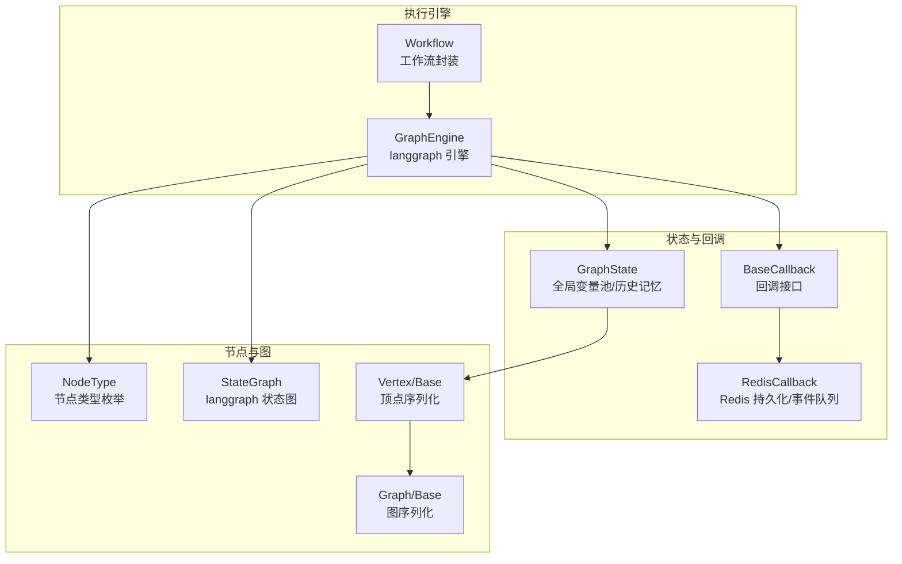
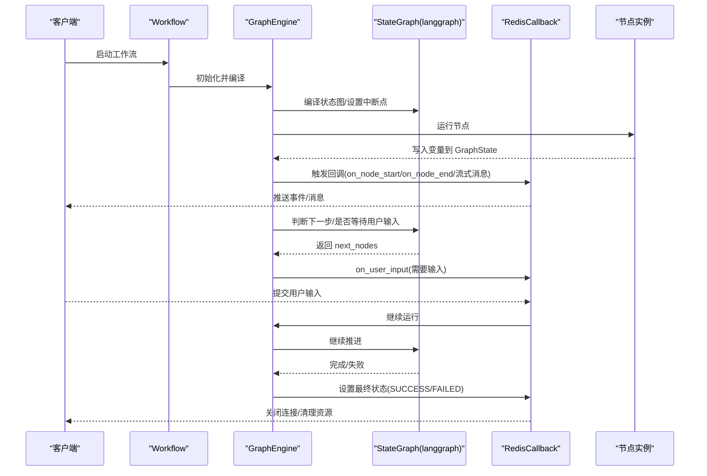
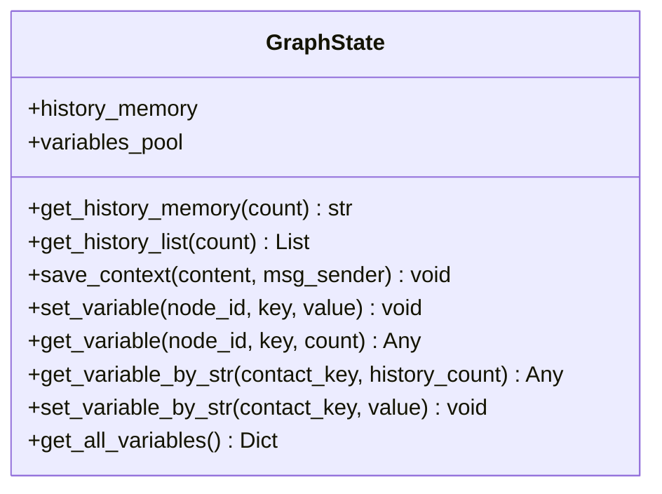
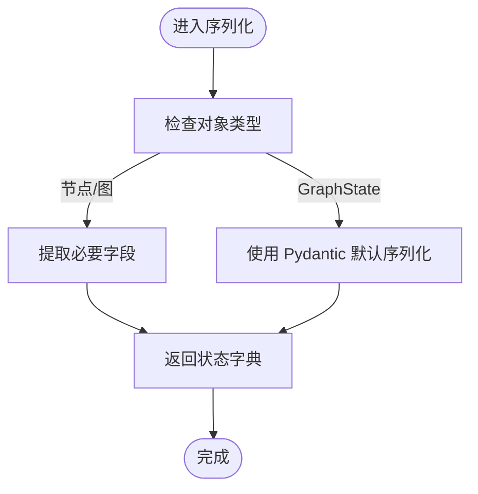
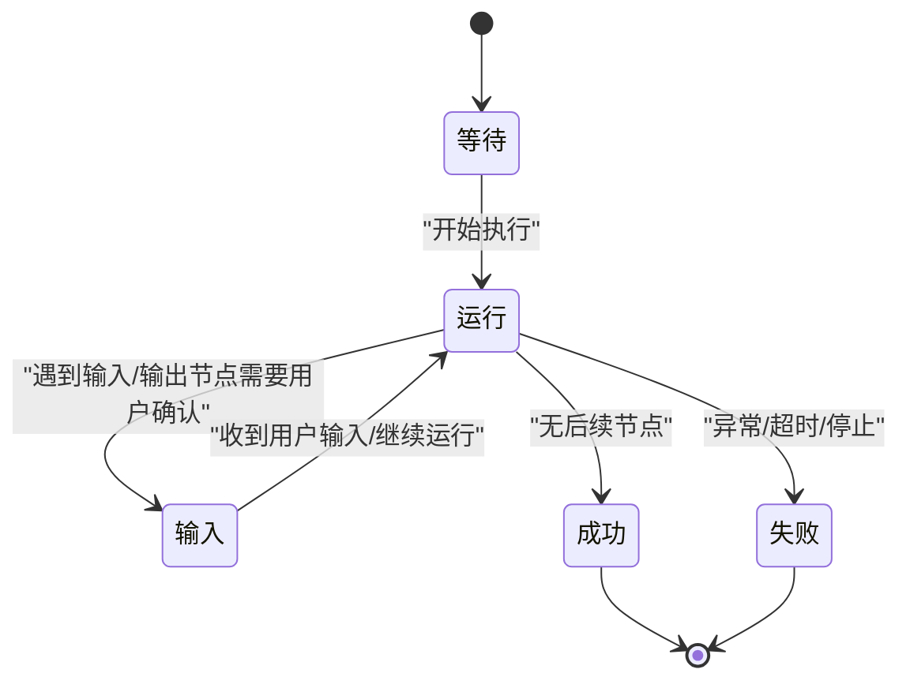
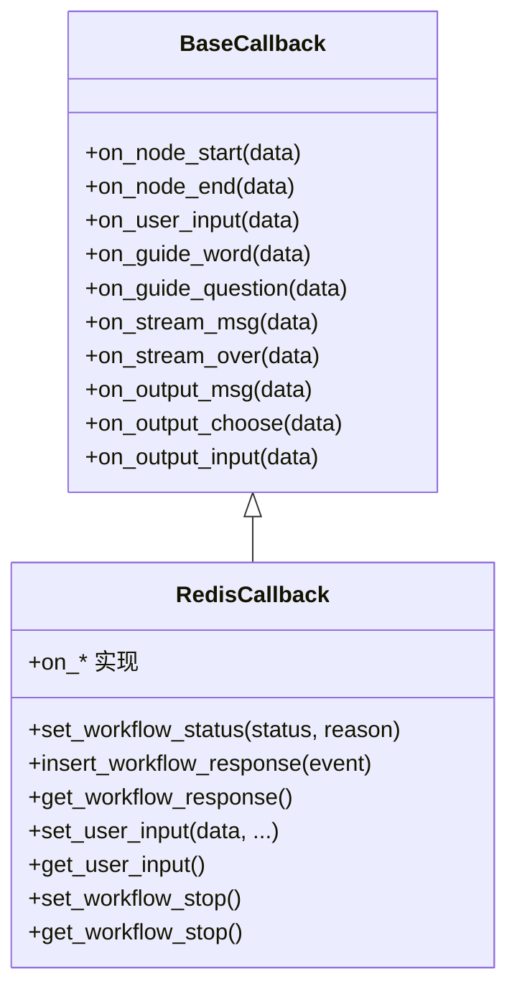
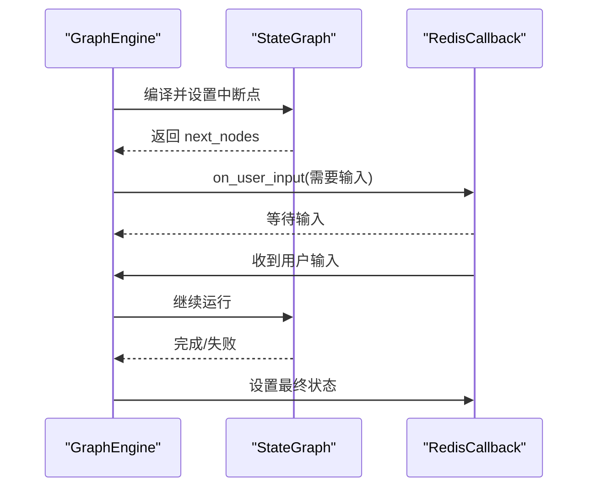
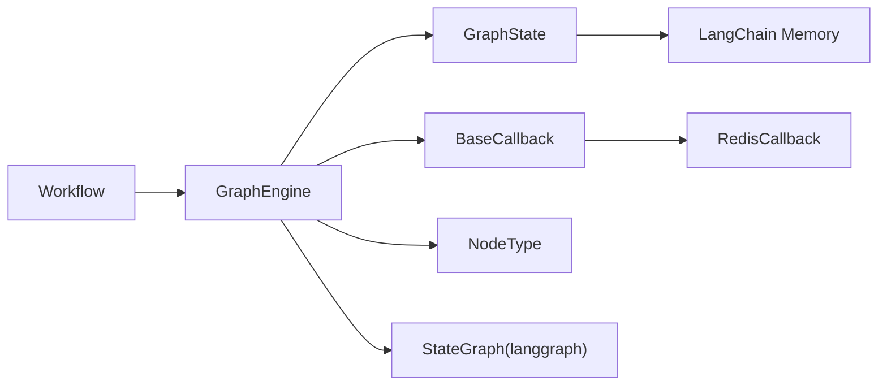

# 工作流状态管理

<cite>
**本文引用的文件**
- [graph_state.py](file://src/backend/bisheng/workflow/graph/graph_state.py)
- [graph_engine.py](file://src/backend/bisheng/workflow/graph/graph_engine.py)
- [workflow.py](file://src/backend/bisheng/workflow/graph/workflow.py)
- [base_callback.py](file://src/backend/bisheng/workflow/callback/base_callback.py)
- [redis_callback.py](file://src/backend/bisheng/worker/workflow/redis_callback.py)
- [workflow.py](file://src/backend/bisheng/workflow/common/workflow.py)
- [node.py](file://src/backend/bisheng/workflow/common/node.py)
- [base.py](file://src/backend/bisheng/graph/vertex/base.py)
- [base.py](file://src/backend/bisheng/graph/graph/base.py)
</cite>

## 目录
1. [简介](#简介)
2. [项目结构](#项目结构)
3. [核心组件](#核心组件)
4. [架构总览](#架构总览)
5. [详细组件分析](#详细组件分析)
6. [依赖关系分析](#依赖关系分析)
7. [性能考量](#性能考量)
8. [故障排查指南](#故障排查指南)
9. [结论](#结论)

## 简介
本文件面向 Bisheng 工作流状态管理系统，聚焦于 GraphState 的设计与实现、状态数据的存储与访问、序列化/反序列化机制、工作流状态生命周期（创建、更新、持久化、清理）、状态变更监听与回调系统、事件传播、执行状态定义与转换、以及状态恢复与检查点技术实现。文档同时提供最佳实践与性能优化建议，帮助开发者在复杂工作流场景中稳定地管理状态。

## 项目结构
围绕工作流状态管理的关键代码主要分布在以下模块：
- 状态模型与全局变量池：GraphState
- 图执行引擎：GraphEngine（基于 langgraph）
- 工作流封装：Workflow
- 回调接口与 Redis 回调：BaseCallback、RedisCallback
- 状态枚举与节点类型：WorkflowStatus、NodeType
- 节点与图对象的序列化支持：节点与图的基础类

图表来源
- [graph_state.py](file://src/backend/bisheng/workflow/graph/graph_state.py#L8-L109)
- [graph_engine.py](file://src/backend/bisheng/workflow/graph/graph_engine.py#L27-L69)
- [workflow.py](file://src/backend/bisheng/workflow/graph/workflow.py#L10-L36)
- [base_callback.py](file://src/backend/bisheng/workflow/callback/base_callback.py#L8-L47)
- [redis_callback.py](file://src/backend/bisheng/worker/workflow/redis_callback.py#L33-L133)
- [node.py](file://src/backend/bisheng/workflow/common/node.py#L8-L26)
- [base.py](file://src/backend/bisheng/graph/vertex/base.py#L47-L79)
- [base.py](file://src/backend/bisheng/graph/graph/base.py#L36-L77)

章节来源
- [graph_state.py](file://src/backend/bisheng/workflow/graph/graph_state.py#L8-L109)
- [graph_engine.py](file://src/backend/bisheng/workflow/graph/graph_engine.py#L27-L69)
- [workflow.py](file://src/backend/bisheng/workflow/graph/workflow.py#L10-L36)
- [base_callback.py](file://src/backend/bisheng/workflow/callback/base_callback.py#L8-L47)
- [redis_callback.py](file://src/backend/bisheng/worker/workflow/redis_callback.py#L33-L133)
- [node.py](file://src/backend/bisheng/workflow/common/node.py#L8-L26)
- [base.py](file://src/backend/bisheng/graph/vertex/base.py#L47-L79)
- [base.py](file://src/backend/bisheng/graph/graph/base.py#L36-L77)

## 核心组件
- GraphState：全局状态容器，包含对话历史记忆与节点级变量池，提供变量存取、历史读取与聚合导出能力。
- GraphEngine：工作流执行引擎，负责构建节点与边、编译 langgraph、驱动运行、处理用户输入中断、判断最终状态。
- Workflow：对外封装的工作流入口，持有 GraphEngine 并暴露运行、继续运行、停止等接口。
- BaseCallback/RedisCallback：回调抽象与 Redis 实现，负责事件上报、消息持久化、状态同步、用户输入通知与清理。
- WorkflowStatus/NodeType：状态与节点类型的枚举定义，支撑状态机与节点行为控制。

章节来源
- [graph_state.py](file://src/backend/bisheng/workflow/graph/graph_state.py#L8-L109)
- [graph_engine.py](file://src/backend/bisheng/workflow/graph/graph_engine.py#L27-L69)
- [workflow.py](file://src/backend/bisheng/workflow/graph/workflow.py#L10-L36)
- [base_callback.py](file://src/backend/bisheng/workflow/callback/base_callback.py#L8-L47)
- [redis_callback.py](file://src/backend/bisheng/worker/workflow/redis_callback.py#L33-L133)
- [workflow.py](file://src/backend/bisheng/workflow/common/workflow.py#L4-L11)
- [node.py](file://src/backend/bisheng/workflow/common/node.py#L8-L26)

## 架构总览
工作流状态管理采用“状态模型 + 执行引擎 + 回调持久化”的分层架构：
- GraphState 作为全局状态中心，被所有节点共享；节点执行结果写入 GraphState 的变量池，供下游节点读取。
- GraphEngine 基于 langgraph 构建状态图，编译后按拓扑顺序推进，遇到需要用户输入的节点会暂停并触发回调。
- RedisCallback 将运行事件与状态写入 Redis，前端通过 SSE/WS 推送实时消息，并在必要时下发用户输入或停止指令。

图表来源
- [workflow.py](file://src/backend/bisheng/workflow/graph/workflow.py#L10-L36)
- [graph_engine.py](file://src/backend/bisheng/workflow/graph/graph_engine.py#L27-L69)
- [graph_engine.py](file://src/backend/bisheng/workflow/graph/graph_engine.py#L288-L387)
- [redis_callback.py](file://src/backend/bisheng/worker/workflow/redis_callback.py#L33-L133)
- [redis_callback.py](file://src/backend/bisheng/worker/workflow/redis_callback.py#L481-L601)

## 详细组件分析

### GraphState 设计与实现
- 全局变量池：以 {node_id: {key: value}} 结构存储各节点输出，支持数组/字典索引读取与批量导出。
- 对话历史：基于 ConversationBufferWindowMemory，提供字符串与消息列表两种历史读取方式。
- 变量访问：支持通过 node_id.key 或 node_id.key#index 的统一访问语法，自动处理数组/字典索引越界与类型不匹配异常。

图表来源
- [graph_state.py](file://src/backend/bisheng/workflow/graph/graph_state.py#L8-L109)

章节来源
- [graph_state.py](file://src/backend/bisheng/workflow/graph/graph_state.py#L8-L109)

### 状态数据的存储、序列化与反序列化
- 节点序列化：顶点类提供 __getstate__/__setstate__，用于 pickle 序列化时仅保留必要字段，避免重复构建对象。
- 图对象序列化：图类提供 __getstate__/__setstate__，便于从原始图数据重建图对象。
- GraphState 不直接参与 pickle，但其内部字段（如 ConversationBufferWindowMemory）需可序列化以配合节点持久化。

图表来源
- [base.py](file://src/backend/bisheng/graph/vertex/base.py#L47-L79)
- [base.py](file://src/backend/bisheng/graph/graph/base.py#L36-L41)

章节来源
- [base.py](file://src/backend/bisheng/graph/vertex/base.py#L47-L79)
- [base.py](file://src/backend/bisheng/graph/graph/base.py#L36-L41)
- [graph_state.py](file://src/backend/bisheng/workflow/graph/graph_state.py#L8-L109)

### 工作流状态生命周期管理
- 创建：Workflow 初始化 GraphEngine，GraphEngine 构建节点映射、边关系、计算层级、注册条件边与中断点。
- 更新：节点执行将结果写入 GraphState 变量池；回调持续上报事件与中间态。
- 持久化：RedisCallback 将状态、事件、输入、停止标志写入 Redis，设置过期时间。
- 清理：成功/失败后清理 data/input 键；停止时删除事件队列并触发节点停止。

图表来源
- [workflow.py](file://src/backend/bisheng/workflow/common/workflow.py#L4-L11)
- [graph_engine.py](file://src/backend/bisheng/workflow/graph/graph_engine.py#L358-L387)
- [redis_callback.py](file://src/backend/bisheng/worker/workflow/redis_callback.py#L87-L121)

章节来源
- [workflow.py](file://src/backend/bisheng/workflow/graph/workflow.py#L10-L36)
- [graph_engine.py](file://src/backend/bisheng/workflow/graph/graph_engine.py#L27-L69)
- [workflow.py](file://src/backend/bisheng/workflow/common/workflow.py#L4-L11)
- [redis_callback.py](file://src/backend/bisheng/worker/workflow/redis_callback.py#L87-L121)

### 状态变更监听机制与回调系统
- BaseCallback 抽象定义了节点开始/结束、用户输入、引导词/问题、流式消息、输出消息、选择/输入等回调方法。
- RedisCallback 实现具体逻辑：将事件写入 Redis 队列，保存消息到数据库，根据状态设置过期与清理策略；在流式结束时替换分享前缀；支持异步/同步接口。
- GraphEngine 在运行过程中调用回调，例如 on_user_input 通知前端等待用户输入。

图表来源
- [base_callback.py](file://src/backend/bisheng/workflow/callback/base_callback.py#L8-L47)
- [redis_callback.py](file://src/backend/bisheng/worker/workflow/redis_callback.py#L33-L133)
- [redis_callback.py](file://src/backend/bisheng/worker/workflow/redis_callback.py#L481-L601)

章节来源
- [base_callback.py](file://src/backend/bisheng/workflow/callback/base_callback.py#L8-L47)
- [redis_callback.py](file://src/backend/bisheng/worker/workflow/redis_callback.py#L33-L133)
- [redis_callback.py](file://src/backend/bisheng/worker/workflow/redis_callback.py#L481-L601)
- [graph_engine.py](file://src/backend/bisheng/workflow/graph/graph_engine.py#L367-L387)

### 事件传播机制
- 事件来源：节点执行期间通过回调发送各类事件（开始/结束、流式消息、输出消息、选择/输入、用户输入）。
- 事件去向：RedisCallback 将事件写入 Redis 列表，前端通过 SSE/WS 拉取并渲染；同时持久化消息到数据库并记录溯源信息。
- 中断与恢复：当检测到 next_nodes 包含需要用户输入的节点时，设置状态为 INPUT 并触发 on_user_input；前端提交输入后，GraphEngine 继续运行。

章节来源
- [redis_callback.py](file://src/backend/bisheng/worker/workflow/redis_callback.py#L123-L142)
- [redis_callback.py](file://src/backend/bisheng/worker/workflow/redis_callback.py#L227-L275)
- [graph_engine.py](file://src/backend/bisheng/workflow/graph/graph_engine.py#L367-L387)

### 执行状态定义与转换
- 状态枚举：WAITING、RUNNING、SUCCESS、FAILED、INPUT、INPUT_OVER。
- 转换规则：
  - 初始为 RUNNING；
  - 无后续节点则为 SUCCESS；
  - 遇到 INPUT/FakeOutput 节点且存在输入 schema，则置为 INPUT 并回调通知；
  - 异常捕获后置为 FAILED 并记录原因；
  - 用户停止或超时也会导致 FAILED。

章节来源
- [workflow.py](file://src/backend/bisheng/workflow/common/workflow.py#L4-L11)
- [graph_engine.py](file://src/backend/bisheng/workflow/graph/graph_engine.py#L288-L317)
- [graph_engine.py](file://src/backend/bisheng/workflow/graph/graph_engine.py#L358-L387)

### 状态恢复与检查点机制
- 检查点：GraphEngine 使用 MemorySaver 作为检查点存储，结合 langgraph 的中断点（interrupt_before）实现断点续跑。
- 断点续跑：当状态为 INPUT 时，将工作流对象放入内存或持久化（示例中对 INPUT 状态进行保留），前端提交输入后调用 continue_run/acontinue_run 继续执行。
- 回滚与清理：RedisCallback 在成功/失败后清理 data/input 键；停止时删除事件队列；超时或异常时设置失败状态并清理。

图表来源
- [graph_engine.py](file://src/backend/bisheng/workflow/graph/graph_engine.py#L277-L282)
- [graph_engine.py](file://src/backend/bisheng/workflow/graph/graph_engine.py#L324-L357)
- [redis_callback.py](file://src/backend/bisheng/worker/workflow/redis_callback.py#L87-L121)

章节来源
- [graph_engine.py](file://src/backend/bisheng/workflow/graph/graph_engine.py#L277-L282)
- [graph_engine.py](file://src/backend/bisheng/workflow/graph/graph_engine.py#L324-L357)
- [redis_callback.py](file://src/backend/bisheng/worker/workflow/redis_callback.py#L87-L121)

### 节点类型与状态关联
- 节点类型：START、END、INPUT、AGENT、CODE、CONDITION、LLM、OUTPUT、FAKE_OUTPUT、QA_RETRIEVER、RAG、REPORT、TOOL、KNOWLEDGE_RETRIEVER、NOTE。
- 与状态的关系：INPUT/FakeOutput 节点触发 INPUT 状态；END 节点作为终止；CONDITION 节点决定分支路径；START 节点作为起点。

章节来源
- [node.py](file://src/backend/bisheng/workflow/common/node.py#L8-L26)
- [graph_engine.py](file://src/backend/bisheng/workflow/graph/graph_engine.py#L88-L108)

## 依赖关系分析
- GraphEngine 依赖 GraphState、BaseCallback、NodeType、EdgeManage、NodeFactory、langgraph StateGraph。
- Workflow 依赖 GraphEngine。
- RedisCallback 依赖 BaseCallback、Redis 客户端、消息模型、错误码与配置服务。
- GraphState 依赖 LangChain ConversationBufferWindowMemory 与 Pydantic。

图表来源
- [workflow.py](file://src/backend/bisheng/workflow/graph/workflow.py#L10-L36)
- [graph_engine.py](file://src/backend/bisheng/workflow/graph/graph_engine.py#L27-L69)
- [base_callback.py](file://src/backend/bisheng/workflow/callback/base_callback.py#L8-L47)
- [redis_callback.py](file://src/backend/bisheng/worker/workflow/redis_callback.py#L33-L133)
- [node.py](file://src/backend/bisheng/workflow/common/node.py#L8-L26)
- [graph_state.py](file://src/backend/bisheng/workflow/graph/graph_state.py#L8-L109)

章节来源
- [workflow.py](file://src/backend/bisheng/workflow/graph/workflow.py#L10-L36)
- [graph_engine.py](file://src/backend/bisheng/workflow/graph/graph_engine.py#L27-L69)
- [base_callback.py](file://src/backend/bisheng/workflow/callback/base_callback.py#L8-L47)
- [redis_callback.py](file://src/backend/bisheng/worker/workflow/redis_callback.py#L33-L133)
- [node.py](file://src/backend/bisheng/workflow/common/node.py#L8-L26)
- [graph_state.py](file://src/backend/bisheng/workflow/graph/graph_state.py#L8-L109)

## 性能考量
- 事件推送频率：流式消息应避免过于频繁查询 Redis，可在回调中跳过停止判断，减少阻塞。
- 状态轮询超时：长时间无状态更新应主动标记失败并清理，避免资源泄漏。
- 变量池规模：避免在变量池中存放过大对象；必要时拆分为多个键或落盘。
- 检查点与内存：MemorySaver 适合小到中型工作流；大规模工作流可考虑自定义检查点存储。
- 并发与锁：前端并发拉取事件时注意幂等性与去重。

## 故障排查指南
- 状态未更新：若超过阈值仍未更新状态，回调会标记失败并设置停止键，前端应据此提示“任务繁忙”或“超时”。
- 用户输入未生效：确认 Redis 中 workflow:{id}:input 是否存在且正确解析；核对输入 schema 校验逻辑。
- 流式消息中断：检查停止键是否被设置；确保回调在非流式消息时才进行停止判断。
- 节点参数错误：失败原因中可能包含“节点参数错误”，前端可根据错误码展示具体提示。

章节来源
- [redis_callback.py](file://src/backend/bisheng/worker/workflow/redis_callback.py#L156-L177)
- [redis_callback.py](file://src/backend/bisheng/worker/workflow/redis_callback.py#L205-L220)
- [redis_callback.py](file://src/backend/bisheng/worker/workflow/redis_callback.py#L255-L262)
- [redis_callback.py](file://src/backend/bisheng/worker/workflow/redis_callback.py#L406-L411)

## 结论
Bisheng 的工作流状态管理以 GraphState 为核心，结合 GraphEngine 的 langgraph 执行与 RedisCallback 的事件持久化，实现了从状态创建、更新、持久化到清理的完整生命周期管理。通过回调系统与事件传播，前端可实时感知节点执行与用户交互；通过检查点与中断机制，支持断点续跑与状态恢复。遵循本文的最佳实践与性能建议，可在复杂场景下获得稳定、可观测且高性能的工作流体验。