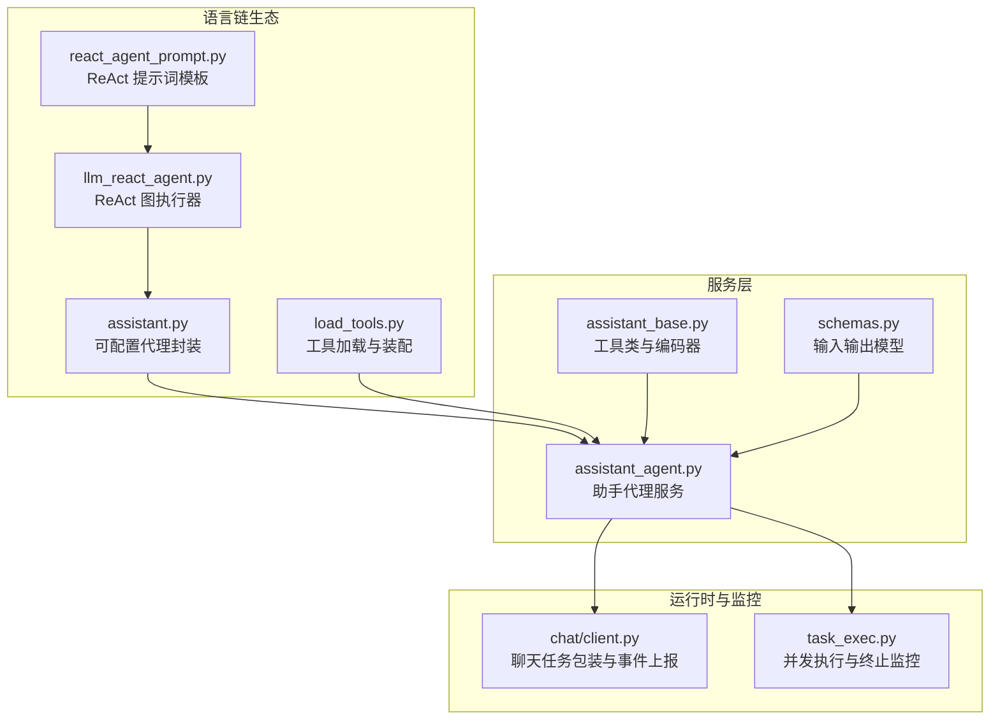
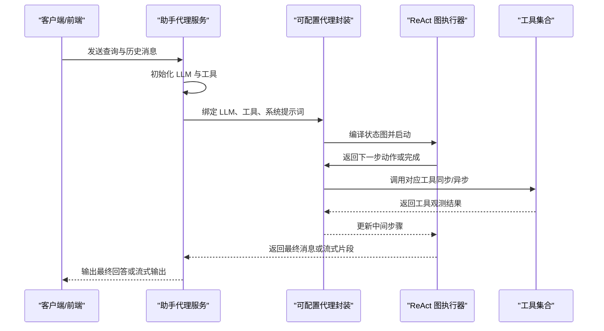
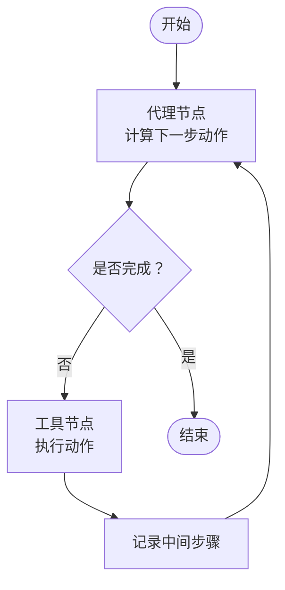
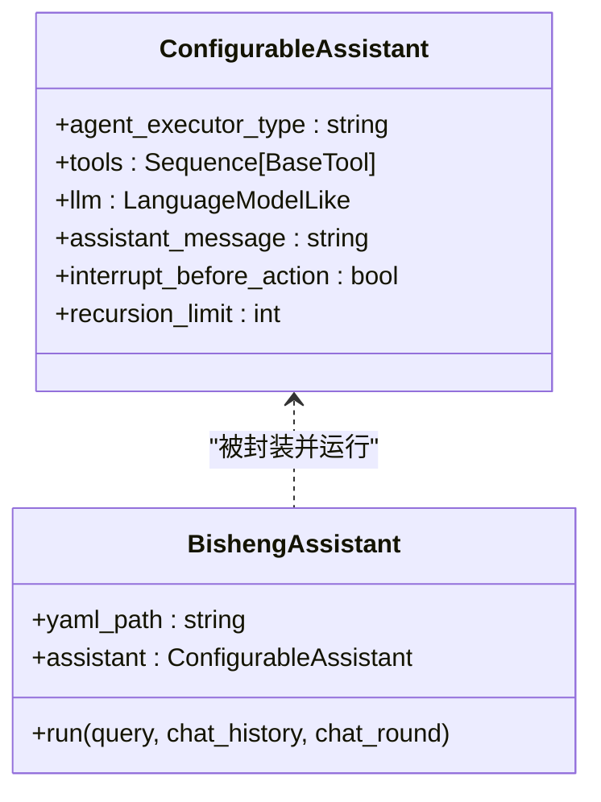
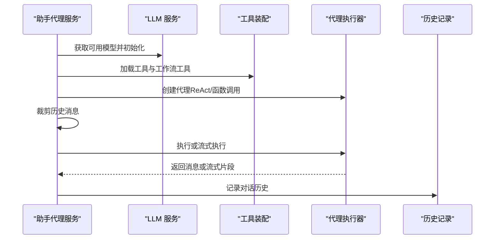
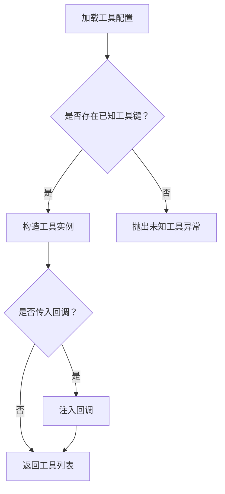
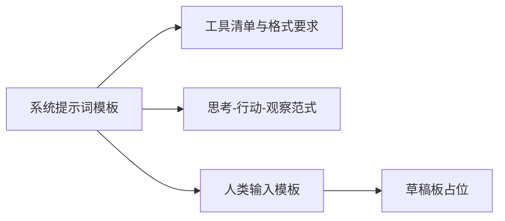
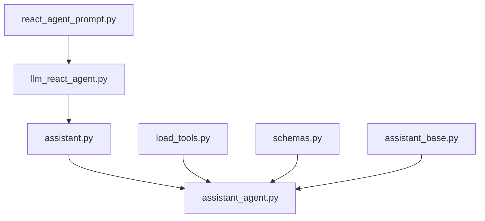

# Agent 节点

<cite>
**本文引用的文件**
- [src/backend/bisheng_langchain/gpts/agent_types/llm_react_agent.py](file://src/backend/bisheng_langchain/gpts/agent_types/llm_react_agent.py)
- [src/backend/bisheng_langchain/gpts/assistant.py](file://src/backend/bisheng_langchain/gpts/assistant.py)
- [src/backend/bisheng/api/services/assistant_agent.py](file://src/backend/bisheng/api/services/assistant_agent.py)
- [src/backend/bisheng/api/services/assistant_base.py](file://src/backend/bisheng/api/services/assistant_base.py)
- [src/backend/bisheng_langchain/gpts/prompts/react_agent_prompt.py](file://src/backend/bisheng_langchain/gpts/prompts/react_agent_prompt.py)
- [src/backend/bisheng_langchain/gpts/load_tools.py](file://src/backend/bisheng_langchain/gpts/load_tools.py)
- [src/backend/bisheng/api/v1/schemas.py](file://src/backend/bisheng/api/v1/schemas.py)
- [src/backend/bisheng/chat/client.py](file://src/backend/bisheng/chat/client.py)
- [src/backend/bisheng/linsight/domain/task_exec.py](file://src/backend/bisheng/linsight/domain/task_exec.py)
- [src/backend/bisheng/api/services/assistant_agent.py](file://src/backend/bisheng/api/services/assistant_agent.py#L171-L190)
- [src/backend/bisheng/api/services/assistant_agent.py](file://src/backend/bisheng/api/services/assistant_agent.py#L320-L344)
- [src/backend/bisheng/api/services/assistant_agent.py](file://src/backend/bisheng/api/services/assistant_agent.py#L346-L406)
- [src/backend/bisheng/api/services/assistant_agent.py](file://src/backend/bisheng/api/services/assistant_agent.py#L407-L421)
- [src/backend/bisheng_langchain/gpts/agent_types/llm_react_agent.py](file://src/backend/bisheng_langchain/gpts/agent_types/llm_react_agent.py#L55-L173)
- [src/backend/bisheng_langchain/gpts/assistant.py](file://src/backend/bisheng_langchain/gpts/assistant.py#L17-L53)
- [src/backend/bisheng_langchain/gpts/prompts/react_agent_prompt.py](file://src/backend/bisheng_langchain/gpts/prompts/react_agent_prompt.py#L12-L68)
- [src/backend/bisheng_langchain/gpts/load_tools.py](file://src/backend/bisheng_langchain/gpts/load_tools.py#L164-L213)
- [src/backend/bisheng/api/v1/schemas.py](file://src/backend/bisheng/api/v1/schemas.py#L53-L58)
- [src/backend/bisheng/chat/client.py](file://src/backend/bisheng/chat/client.py#L81-L101)
- [src/backend/bisheng/linsight/domain/task_exec.py](file://src/backend/bisheng/linsight/domain/task_exec.py#L328-L363)
</cite>

## 目录
1. [简介](#简介)
2. [项目结构](#项目结构)
3. [核心组件](#核心组件)
4. [架构总览](#架构总览)
5. [组件详解](#组件详解)
6. [依赖关系分析](#依赖关系分析)
7. [性能考量](#性能考量)
8. [故障排查指南](#故障排查指南)
9. [结论](#结论)
10. [附录](#附录)

## 简介
本文件面向开发者与运维人员，系统性阐述 Bisheng 中“Agent 节点”的设计与实现，覆盖以下关键主题：
- 智能代理的创建、配置与执行机制
- 参数配置：代理类型、工具集成、提示词模板、记忆与上下文管理
- 执行流程：任务分解、工具调用、中间步骤记录与结果聚合
- 与其他节点的交互：输入输出、状态传递、错误恢复
- 性能优化：并发执行、缓存策略、资源管理
- 调试与故障排除：日志、回调、流式输出与异常处理

## 项目结构
围绕 Agent 的核心代码主要分布在后端 Python 语言链生态模块与服务层：
- 语言链生态与提示词模板：负责构建 ReAct 式代理、提示词模板与工具加载
- 服务层：负责模型初始化、工具装配、代理执行、消息裁剪与历史记录
- 前端交互：Agent 选择、工具管理、动作管理等（在本文件中作为外部集成参考）

图示来源
- [src/backend/bisheng_langchain/gpts/agent_types/llm_react_agent.py](file://src/backend/bisheng_langchain/gpts/agent_types/llm_react_agent.py#L55-L173)
- [src/backend/bisheng_langchain/gpts/assistant.py](file://src/backend/bisheng_langchain/gpts/assistant.py#L17-L53)
- [src/backend/bisheng_langchain/gpts/prompts/react_agent_prompt.py](file://src/backend/bisheng_langchain/gpts/prompts/react_agent_prompt.py#L12-L68)
- [src/backend/bisheng_langchain/gpts/load_tools.py](file://src/backend/bisheng_langchain/gpts/load_tools.py#L164-L213)
- [src/backend/bisheng/api/services/assistant_agent.py](file://src/backend/bisheng/api/services/assistant_agent.py#L320-L406)
- [src/backend/bisheng/api/services/assistant_base.py](file://src/backend/bisheng/api/services/assistant_base.py#L10-L37)
- [src/backend/bisheng/api/v1/schemas.py](file://src/backend/bisheng/api/v1/schemas.py#L53-L58)
- [src/backend/bisheng/chat/client.py](file://src/backend/bisheng/chat/client.py#L81-L101)
- [src/backend/bisheng/linsight/domain/task_exec.py](file://src/backend/bisheng/linsight/domain/task_exec.py#L328-L363)

章节来源
- [src/backend/bisheng_langchain/gpts/agent_types/llm_react_agent.py](file://src/backend/bisheng_langchain/gpts/agent_types/llm_react_agent.py#L55-L173)
- [src/backend/bisheng_langchain/gpts/assistant.py](file://src/backend/bisheng_langchain/gpts/assistant.py#L17-L53)
- [src/backend/bisheng_langchain/gpts/prompts/react_agent_prompt.py](file://src/backend/bisheng_langchain/gpts/prompts/react_agent_prompt.py#L12-L68)
- [src/backend/bisheng_langchain/gpts/load_tools.py](file://src/backend/bisheng_langchain/gpts/load_tools.py#L164-L213)
- [src/backend/bisheng/api/services/assistant_agent.py](file://src/backend/bisheng/api/services/assistant_agent.py#L320-L406)
- [src/backend/bisheng/api/services/assistant_base.py](file://src/backend/bisheng/api/services/assistant_base.py#L10-L37)
- [src/backend/bisheng/api/v1/schemas.py](file://src/backend/bisheng/api/v1/schemas.py#L53-L58)
- [src/backend/bisheng/chat/client.py](file://src/backend/bisheng/chat/client.py#L81-L101)
- [src/backend/bisheng/linsight/domain/task_exec.py](file://src/backend/bisheng/linsight/domain/task_exec.py#L328-L363)

## 核心组件
- ReAct 图执行器：基于状态图的代理与工具循环执行，支持同步与异步工具调用，并记录中间步骤
- 可配置代理封装：通过动态导入代理执行器类型，绑定工具、LLM 与系统提示词
- 助手代理服务：负责 LLM 初始化、工具装配（含工作流工具）、代理初始化、消息裁剪、执行与流式输出
- 工具加载：集中注册基础工具、LLM 相关工具、额外参数工具与 API 工具，统一校验与装配
- 提示词模板：定义 ReAct 的系统提示词与人类输入占位，确保代理按规范格式进行思考-行动-观察
- 输入输出模型：统一请求与响应结构，支撑前端与后端的数据契约

章节来源
- [src/backend/bisheng_langchain/gpts/agent_types/llm_react_agent.py](file://src/backend/bisheng_langchain/gpts/agent_types/llm_react_agent.py#L55-L173)
- [src/backend/bisheng_langchain/gpts/assistant.py](file://src/backend/bisheng_langchain/gpts/assistant.py#L17-L53)
- [src/backend/bisheng/api/services/assistant_agent.py](file://src/backend/bisheng/api/services/assistant_agent.py#L122-L190)
- [src/backend/bisheng_langchain/gpts/load_tools.py](file://src/backend/bisheng_langchain/gpts/load_tools.py#L164-L213)
- [src/backend/bisheng_langchain/gpts/prompts/react_agent_prompt.py](file://src/backend/bisheng_langchain/gpts/prompts/react_agent_prompt.py#L12-L68)
- [src/backend/bisheng/api/v1/schemas.py](file://src/backend/bisheng/api/v1/schemas.py#L53-L58)

## 架构总览
Agent 节点的执行路径从服务层开始，经由可配置代理封装，进入 ReAct 图执行器，再驱动工具执行与消息聚合，最终返回给调用方或前端。

图示来源
- [src/backend/bisheng/api/services/assistant_agent.py](file://src/backend/bisheng/api/services/assistant_agent.py#L320-L406)
- [src/backend/bisheng_langchain/gpts/assistant.py](file://src/backend/bisheng_langchain/gpts/assistant.py#L17-L53)
- [src/backend/bisheng_langchain/gpts/agent_types/llm_react_agent.py](file://src/backend/bisheng_langchain/gpts/agent_types/llm_react_agent.py#L55-L173)
- [src/backend/bisheng_langchain/gpts/load_tools.py](file://src/backend/bisheng_langchain/gpts/load_tools.py#L164-L213)

## 组件详解

### ReAct 图执行器（状态图）
- 状态结构：包含输入字符串、对话历史、最近一次代理结果、中间步骤列表
- 控制流：根据代理结果决定继续调用工具或结束；工具执行后回写中间步骤，再回到代理
- 并发与异步：提供同步与异步工具调用分支，适配不同工具能力
- 中间步骤记录：以动作-观测对形式累积，便于回溯与调试

图示来源
- [src/backend/bisheng_langchain/gpts/agent_types/llm_react_agent.py](file://src/backend/bisheng_langchain/gpts/agent_types/llm_react_agent.py#L55-L173)

章节来源
- [src/backend/bisheng_langchain/gpts/agent_types/llm_react_agent.py](file://src/backend/bisheng_langchain/gpts/agent_types/llm_react_agent.py#L55-L173)

### 可配置代理封装
- 动态导入：根据代理执行器类型动态导入具体实现
- 配置绑定：将 LLM、工具集、系统提示词与递归深度等参数绑定到可运行对象
- 运行时配置：支持设置递归上限，避免无限循环

图示来源
- [src/backend/bisheng_langchain/gpts/assistant.py](file://src/backend/bisheng_langchain/gpts/assistant.py#L17-L53)

章节来源
- [src/backend/bisheng_langchain/gpts/assistant.py](file://src/backend/bisheng_langchain/gpts/assistant.py#L17-L53)

### 助手代理服务（LLM、工具、执行）
- LLM 初始化：从配置中选择默认或指定模型，设置温度、流式与应用类型
- 工具装配：支持直接工具、知识库工具与“离线工作流工具”，离线工作流会触发回调通知
- 代理初始化：根据模型配置选择 ReAct 或函数调用模式，并设置递归上限
- 消息裁剪：使用分词器统计长度，超过阈值则丢弃旧消息
- 执行与流式输出：支持非流式与流式两种模式，流式模式按消息粒度输出

图示来源
- [src/backend/bisheng/api/services/assistant_agent.py](file://src/backend/bisheng/api/services/assistant_agent.py#L78-L121)
- [src/backend/bisheng/api/services/assistant_agent.py](file://src/backend/bisheng/api/services/assistant_agent.py#L122-L190)
- [src/backend/bisheng/api/services/assistant_agent.py](file://src/backend/bisheng/api/services/assistant_agent.py#L192-L223)
- [src/backend/bisheng/api/services/assistant_agent.py](file://src/backend/bisheng/api/services/assistant_agent.py#L294-L318)
- [src/backend/bisheng/api/services/assistant_agent.py](file://src/backend/bisheng/api/services/assistant_agent.py#L320-L406)

章节来源
- [src/backend/bisheng/api/services/assistant_agent.py](file://src/backend/bisheng/api/services/assistant_agent.py#L78-L121)
- [src/backend/bisheng/api/services/assistant_agent.py](file://src/backend/bisheng/api/services/assistant_agent.py#L122-L190)
- [src/backend/bisheng/api/services/assistant_agent.py](file://src/backend/bisheng/api/services/assistant_agent.py#L192-L223)
- [src/backend/bisheng/api/services/assistant_agent.py](file://src/backend/bisheng/api/services/assistant_agent.py#L294-L318)
- [src/backend/bisheng/api/services/assistant_agent.py](file://src/backend/bisheng/api/services/assistant_agent.py#L320-L406)

### 工具加载与装配
- 工具注册：基础工具、LLM 相关工具、额外参数工具、API 工具统一注册
- 参数校验：缺失必要参数时抛出异常，保证工具可用性
- 回调注入：可将回调注入工具，用于前端可观测性

图示来源
- [src/backend/bisheng_langchain/gpts/load_tools.py](file://src/backend/bisheng_langchain/gpts/load_tools.py#L164-L213)

章节来源
- [src/backend/bisheng_langchain/gpts/load_tools.py](file://src/backend/bisheng_langchain/gpts/load_tools.py#L164-L213)

### 提示词模板（ReAct）
- 系统提示词：包含工具清单、动作格式与思考-行动-观察范式
- 占位符：支持工具名称、工具描述、聊天历史与草稿板
- 人类输入：包含问题与草稿板占位

图示来源
- [src/backend/bisheng_langchain/gpts/prompts/react_agent_prompt.py](file://src/backend/bisheng_langchain/gpts/prompts/react_agent_prompt.py#L12-L68)

章节来源
- [src/backend/bisheng_langchain/gpts/prompts/react_agent_prompt.py](file://src/backend/bisheng_langchain/gpts/prompts/react_agent_prompt.py#L12-L68)

### 输入输出模型
- 请求模型：统一输入请求结构，如“输入文本”
- 响应模型：统一响应结构，支持流式类型枚举与中间步骤字段

章节来源
- [src/backend/bisheng/api/v1/schemas.py](file://src/backend/bisheng/api/v1/schemas.py#L53-L58)
- [src/backend/bisheng/api/v1/schemas.py](file://src/backend/bisheng/api/v1/schemas.py#L159-L177)

## 依赖关系分析
- 低耦合高内聚：ReAct 执行器与代理封装相互独立，通过接口解耦
- 工具中心化：工具加载模块集中管理工具注册与参数校验，降低上层复杂度
- 服务层编排：助手代理服务负责 LLM、工具与代理的组装与执行，形成清晰的控制流

图示来源
- [src/backend/bisheng_langchain/gpts/agent_types/llm_react_agent.py](file://src/backend/bisheng_langchain/gpts/agent_types/llm_react_agent.py#L55-L173)
- [src/backend/bisheng_langchain/gpts/assistant.py](file://src/backend/bisheng_langchain/gpts/assistant.py#L17-L53)
- [src/backend/bisheng/api/services/assistant_agent.py](file://src/backend/bisheng/api/services/assistant_agent.py#L122-L190)
- [src/backend/bisheng_langchain/gpts/load_tools.py](file://src/backend/bisheng_langchain/gpts/load_tools.py#L164-L213)
- [src/backend/bisheng_langchain/gpts/prompts/react_agent_prompt.py](file://src/backend/bisheng_langchain/gpts/prompts/react_agent_prompt.py#L12-L68)
- [src/backend/bisheng/api/v1/schemas.py](file://src/backend/bisheng/api/v1/schemas.py#L53-L58)
- [src/backend/bisheng/api/services/assistant_base.py](file://src/backend/bisheng/api/services/assistant_base.py#L10-L37)

章节来源
- [src/backend/bisheng_langchain/gpts/agent_types/llm_react_agent.py](file://src/backend/bisheng_langchain/gpts/agent_types/llm_react_agent.py#L55-L173)
- [src/backend/bisheng_langchain/gpts/assistant.py](file://src/backend/bisheng_langchain/gpts/assistant.py#L17-L53)
- [src/backend/bisheng/api/services/assistant_agent.py](file://src/backend/bisheng/api/services/assistant_agent.py#L122-L190)
- [src/backend/bisheng_langchain/gpts/load_tools.py](file://src/backend/bisheng_langchain/gpts/load_tools.py#L164-L213)
- [src/backend/bisheng_langchain/gpts/prompts/react_agent_prompt.py](file://src/backend/bisheng_langchain/gpts/prompts/react_agent_prompt.py#L12-L68)
- [src/backend/bisheng/api/v1/schemas.py](file://src/backend/bisheng/api/v1/schemas.py#L53-L58)
- [src/backend/bisheng/api/services/assistant_base.py](file://src/backend/bisheng/api/services/assistant_base.py#L10-L37)

## 性能考量
- 并发执行
  - 在更高层可采用并发任务模式，等待任一任务完成（例如代理执行或用户终止监控），并在完成后取消未完成任务，减少资源占用
- 流式输出
  - 函数调用模式支持按消息粒度流式输出，降低首字延迟并提升用户体验
- 消息裁剪
  - 使用分词器统计消息长度，超过阈值自动丢弃旧消息，避免上下文溢出
- 缓存与会话
  - 会话级缓存可用于存储中间结果或上下文摘要，减少重复计算
- 递归限制
  - 设置合理的递归上限，防止代理陷入无限循环

章节来源
- [src/backend/bisheng/linsight/domain/task_exec.py](file://src/backend/bisheng/linsight/domain/task_exec.py#L328-L363)
- [src/backend/bisheng/api/services/assistant_agent.py](file://src/backend/bisheng/api/services/assistant_agent.py#L346-L406)
- [src/backend/bisheng/api/services/assistant_agent.py](file://src/backend/bisheng/api/services/assistant_agent.py#L294-L318)
- [src/backend/bisheng/chat/client.py](file://src/backend/bisheng/chat/client.py#L81-L101)

## 故障排查指南
- 工作流工具离线
  - 当工作流未上线或构建失败时，服务层会通过回调向前端发送“离线”通知，便于用户感知
- 工具调用异常
  - 工具调用失败会被捕获并记录简短错误信息，同时继续执行后续步骤
- 流式输出异常
  - 若流式循环未产生任何片段，需检查代理实现与回调配置
- 会话清理
  - 任务结束后清理会话缓存，避免脏数据影响后续请求

章节来源
- [src/backend/bisheng/api/services/assistant_agent.py](file://src/backend/bisheng/api/services/assistant_agent.py#L171-L190)
- [src/backend/bisheng/api/services/assistant_agent.py](file://src/backend/bisheng/api/services/assistant_agent.py#L346-L406)
- [src/backend/bisheng/chat/client.py](file://src/backend/bisheng/chat/client.py#L81-L101)

## 结论
Agent 节点通过“可配置代理封装 + ReAct 图执行器 + 工具中心化装配”的架构，在保持灵活性的同时提供了稳定的执行与可观测性。结合流式输出、消息裁剪与并发控制，可在复杂场景下实现高效、可控的智能代理执行。

## 附录
- 关键参数与配置要点
  - 代理类型：ReAct 或函数调用
  - 工具来源：内置工具、LLM 相关工具、额外参数工具、API 工具、工作流工具
  - 提示词模板：系统提示词与人类输入模板
  - 执行模式：同步/异步工具调用、流式输出
  - 上下文管理：消息长度裁剪、历史记录、会话缓存