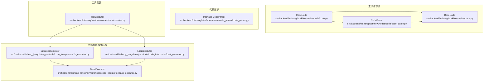
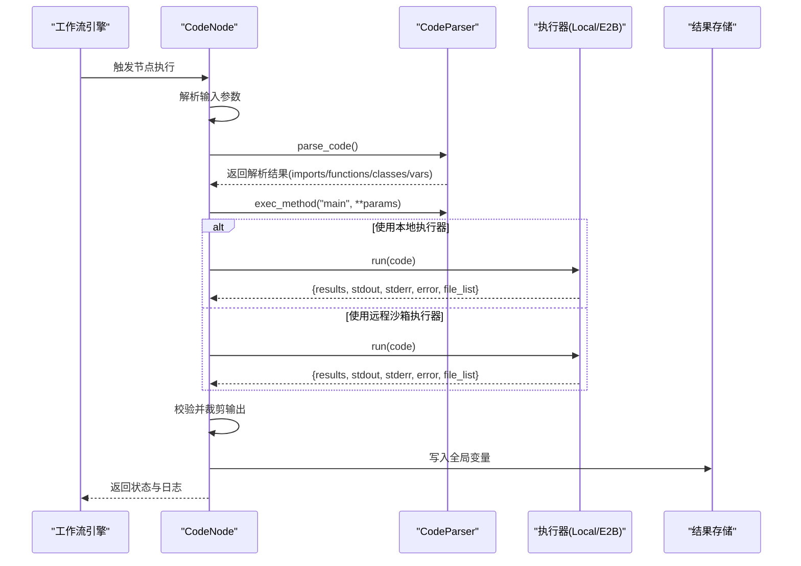
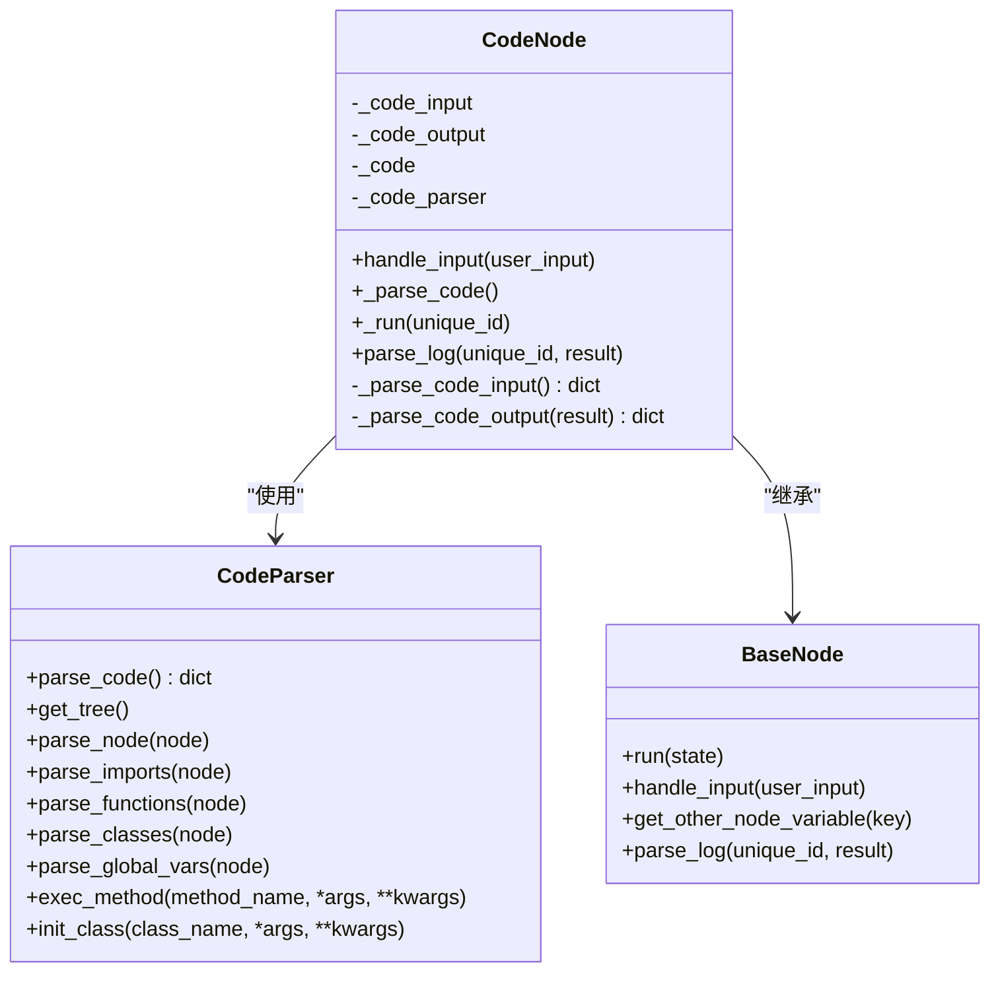
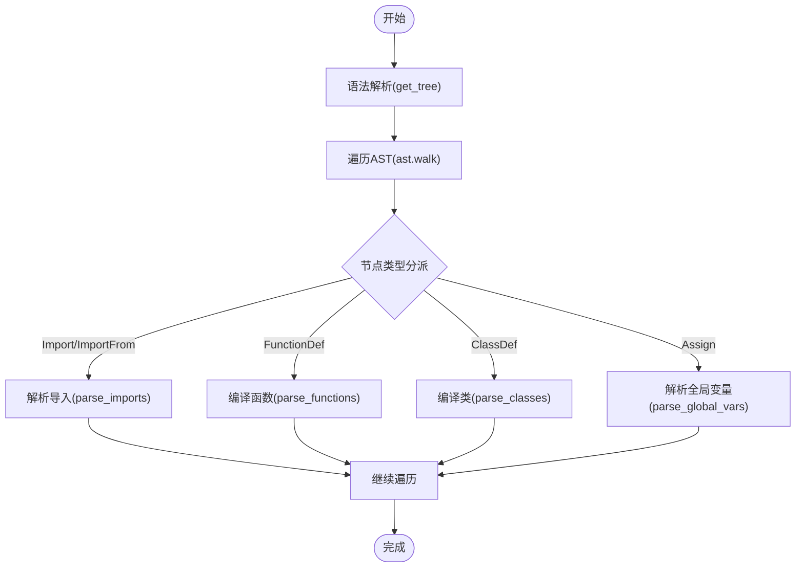
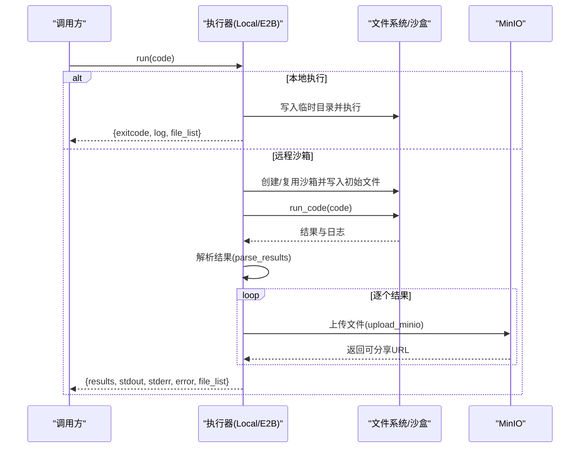
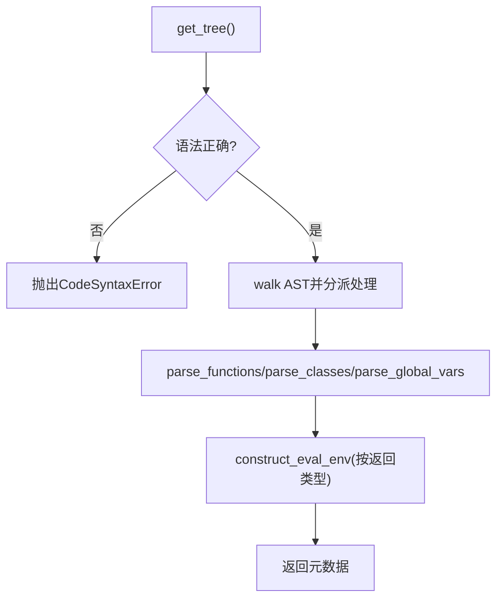
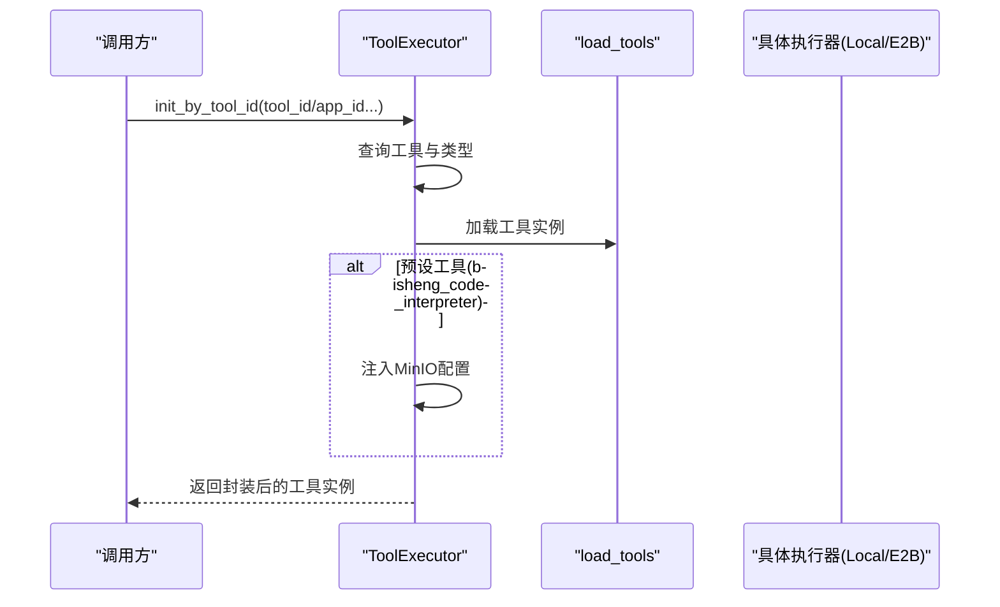
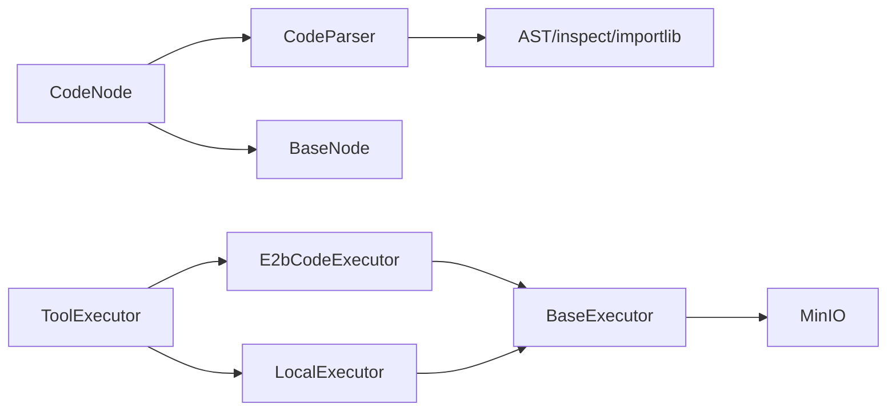

# Code 节点

<cite>
**本文引用的文件**
- [src/backend/bisheng/workflow/nodes/code/code.py](file://src/backend/bisheng/workflow/nodes/code/code.py)
- [src/backend/bisheng/workflow/nodes/code/code_parse.py](file://src/backend/bisheng/workflow/nodes/code/code_parse.py)
- [src/backend/bisheng/workflow/nodes/base.py](file://src/backend/bisheng/workflow/nodes/base.py)
- [src/backend/bisheng/interface/custom/code_parser/code_parser.py](file://src/backend/bisheng/interface/custom/code_parser/code_parser.py)
- [src/backend/bisheng_langchain/gpts/tools/code_interpreter/e2b_executor.py](file://src/backend/bisheng_langchain/gpts/tools/code_interpreter/e2b_executor.py)
- [src/backend/bisheng_langchain/gpts/tools/code_interpreter/local_executor.py](file://src/backend/bisheng_langchain/gpts/tools/code_interpreter/local_executor.py)
- [src/backend/bisheng_langchain/gpts/tools/code_interpreter/base_executor.py](file://src/backend/bisheng_langchain/gpts/tools/code_interpreter/base_executor.py)
- [src/backend/bisheng/tool/domain/services/executor.py](file://src/backend/bisheng/tool/domain/services/executor.py)
</cite>

## 目录
1. [简介](#简介)
2. [项目结构](#项目结构)
3. [核心组件](#核心组件)
4. [架构总览](#架构总览)
5. [详细组件分析](#详细组件分析)
6. [依赖关系分析](#依赖关系分析)
7. [性能考量](#性能考量)
8. [故障排查指南](#故障排查指南)
9. [结论](#结论)
10. [附录：调试与安全最佳实践](#附录调试与安全最佳实践)

## 简介
本文件面向 Bisheng 的“Code 节点”，系统性阐述其设计理念、实现机制与运行流程，覆盖以下关键主题：
- 代码执行环境的创建与管理（本地与远程沙箱）
- 安全隔离与资源约束（超时、文件访问、最小权限）
- 执行上下文与输入输出处理（参数映射、结果校验、日志记录）
- 代码解析与执行流程（语法分析、依赖检查、动态编译、运行时执行）
- 调试方法与性能监控建议
- 安全编程指南与最佳实践

## 项目结构
围绕 Code 节点的相关模块主要分布在后端工作流节点与“代码解释器”工具链两部分：
- 工作流节点层：定义 Code 节点的输入输出、参数解析与执行入口
- 代码解析层：对用户提供的 Python 源码进行 AST 解析与动态执行环境准备
- 执行器层：提供本地与远程沙箱两种执行方式，统一抽象接口并支持文件上传与结果回传

**图表来源**
- [src/backend/bisheng/workflow/nodes/code/code.py](file://src/backend/bisheng/workflow/nodes/code/code.py#L1-L63)
- [src/backend/bisheng/workflow/nodes/code/code_parse.py](file://src/backend/bisheng/workflow/nodes/code/code_parse.py#L1-L127)
- [src/backend/bisheng/workflow/nodes/base.py](file://src/backend/bisheng/workflow/nodes/base.py#L1-L230)
- [src/backend/bisheng/interface/custom/code_parser/code_parser.py](file://src/backend/bisheng/interface/custom/code_parser/code_parser.py#L1-L320)
- [src/backend/bisheng_langchain/gpts/tools/code_interpreter/base_executor.py](file://src/backend/bisheng_langchain/gpts/tools/code_interpreter/base_executor.py#L1-L62)
- [src/backend/bisheng_langchain/gpts/tools/code_interpreter/local_executor.py](file://src/backend/bisheng_langchain/gpts/tools/code_interpreter/local_executor.py#L1-L288)
- [src/backend/bisheng_langchain/gpts/tools/code_interpreter/e2b_executor.py](file://src/backend/bisheng_langchain/gpts/tools/code_interpreter/e2b_executor.py#L1-L199)
- [src/backend/bisheng/tool/domain/services/executor.py](file://src/backend/bisheng/tool/domain/services/executor.py#L1-L305)

**章节来源**
- [src/backend/bisheng/workflow/nodes/code/code.py](file://src/backend/bisheng/workflow/nodes/code/code.py#L1-L63)
- [src/backend/bisheng/workflow/nodes/code/code_parse.py](file://src/backend/bisheng/workflow/nodes/code/code_parse.py#L1-L127)
- [src/backend/bisheng/workflow/nodes/base.py](file://src/backend/bisheng/workflow/nodes/base.py#L1-L230)
- [src/backend/bisheng/interface/custom/code_parser/code_parser.py](file://src/backend/bisheng/interface/custom/code_parser/code_parser.py#L1-L320)
- [src/backend/bisheng_langchain/gpts/tools/code_interpreter/base_executor.py](file://src/backend/bisheng_langchain/gpts/tools/code_interpreter/base_executor.py#L1-L62)
- [src/backend/bisheng_langchain/gpts/tools/code_interpreter/local_executor.py](file://src/backend/bisheng_langchain/gpts/tools/code_interpreter/local_executor.py#L1-L288)
- [src/backend/bisheng_langchain/gpts/tools/code_interpreter/e2b_executor.py](file://src/backend/bisheng_langchain/gpts/tools/code_interpreter/e2b_executor.py#L1-L199)
- [src/backend/bisheng/tool/domain/services/executor.py](file://src/backend/bisheng/tool/domain/services/executor.py#L1-L305)

## 核心组件
- CodeNode：工作流中的代码节点，负责参数解析、调用 CodeParser 执行 main 方法、输出结果校验与日志记录
- CodeParser（工作流侧）：基于 AST 对源码进行解析，提取 import、函数、类、全局变量，构建可执行的 exec 环境
- BaseNode：工作流节点基类，提供统一的 run 生命周期、回调、全局变量写入与最大步数限制
- Interface CodeParser：前端/接口侧的代码解析器，用于提取函数签名、返回类型、类定义等元数据
- 执行器（BaseExecutor、LocalExecutor、E2bCodeExecutor）：提供本地或远程沙箱执行能力，支持超时、文件上传、结果解析与本地同步
- ToolExecutor：工具封装层，负责根据工具配置初始化具体执行器实例（含 MinIO 配置注入）

**章节来源**
- [src/backend/bisheng/workflow/nodes/code/code.py](file://src/backend/bisheng/workflow/nodes/code/code.py#L7-L63)
- [src/backend/bisheng/workflow/nodes/code/code_parse.py](file://src/backend/bisheng/workflow/nodes/code/code_parse.py#L7-L127)
- [src/backend/bisheng/workflow/nodes/base.py](file://src/backend/bisheng/workflow/nodes/base.py#L20-L230)
- [src/backend/bisheng/interface/custom/code_parser/code_parser.py](file://src/backend/bisheng/interface/custom/code_parser/code_parser.py#L29-L320)
- [src/backend/bisheng_langchain/gpts/tools/code_interpreter/base_executor.py](file://src/backend/bisheng_langchain/gpts/tools/code_interpreter/base_executor.py#L9-L62)
- [src/backend/bisheng_langchain/gpts/tools/code_interpreter/local_executor.py](file://src/backend/bisheng_langchain/gpts/tools/code_interpreter/local_executor.py#L40-L288)
- [src/backend/bisheng_langchain/gpts/tools/code_interpreter/e2b_executor.py](file://src/backend/bisheng_langchain/gpts/tools/code_interpreter/e2b_executor.py#L13-L199)
- [src/backend/bisheng/tool/domain/services/executor.py](file://src/backend/bisheng/tool/domain/services/executor.py#L63-L305)

## 架构总览
Code 节点在工作流中的职责是“解析并执行一段用户提供的 Python 代码”，其执行路径如下：
- 输入参数解析：从上游节点或用户输入收集 main 函数所需参数
- 代码解析：通过 CodeParser（AST）解析 import、函数、类、全局变量，构建执行环境
- 动态执行：在安全上下文中调用 main 方法，获取字典结果
- 输出校验：按节点定义的输出字段进行裁剪与校验
- 日志记录：记录输入参数与输出结果，便于审计与排障

**图表来源**
- [src/backend/bisheng/workflow/nodes/code/code.py](file://src/backend/bisheng/workflow/nodes/code/code.py#L19-L63)
- [src/backend/bisheng/workflow/nodes/code/code_parse.py](file://src/backend/bisheng/workflow/nodes/code/code_parse.py#L35-L118)
- [src/backend/bisheng_langchain/gpts/tools/code_interpreter/local_executor.py](file://src/backend/bisheng_langchain/gpts/tools/code_interpreter/local_executor.py#L239-L257)
- [src/backend/bisheng_langchain/gpts/tools/code_interpreter/e2b_executor.py](file://src/backend/bisheng_langchain/gpts/tools/code_interpreter/e2b_executor.py#L58-L98)

## 详细组件分析

### 组件一：CodeNode（工作流节点）
- 设计要点
  - 参数输入：支持 ref 引用上游节点变量与直接值
  - 代码解析：委托给 CodeParser 完成 AST 解析与执行环境准备
  - 执行入口：调用 main 方法并进行输出字段校验
  - 日志记录：以结构化形式记录输入参数与输出结果
- 关键流程
  - handle_input：合并用户输入更新节点参数
  - _parse_code：触发 CodeParser.parse_code
  - _run：组装 main 入参、调用 exec_method、裁剪输出
  - parse_log：构造日志条目

**图表来源**
- [src/backend/bisheng/workflow/nodes/code/code.py](file://src/backend/bisheng/workflow/nodes/code/code.py#L7-L63)
- [src/backend/bisheng/workflow/nodes/code/code_parse.py](file://src/backend/bisheng/workflow/nodes/code/code_parse.py#L7-L127)
- [src/backend/bisheng/workflow/nodes/base.py](file://src/backend/bisheng/workflow/nodes/base.py#L20-L230)

**章节来源**
- [src/backend/bisheng/workflow/nodes/code/code.py](file://src/backend/bisheng/workflow/nodes/code/code.py#L19-L63)

### 组件二：CodeParser（工作流侧）
- 设计要点
  - 基于 AST 的静态解析：import/import from、函数、类、全局变量
  - 动态编译与执行：将函数/类编译进 exec_globals/exec_locals，供后续调用
  - 错误处理：模块导入失败抛出明确异常
- 关键流程
  - get_tree：语法验证
  - parse_node：分派到对应处理器
  - parse_imports：记录导入并尝试实际导入模块
  - parse_functions/parse_classes：编译并注入命名空间
  - exec_method：按名称查找并调用方法

**图表来源**
- [src/backend/bisheng/workflow/nodes/code/code_parse.py](file://src/backend/bisheng/workflow/nodes/code/code_parse.py#L35-L118)

**章节来源**
- [src/backend/bisheng/workflow/nodes/code/code_parse.py](file://src/backend/bisheng/workflow/nodes/code/code_parse.py#L35-L118)

### 组件三：执行器（BaseExecutor、LocalExecutor、E2bCodeExecutor）
- 设计要点
  - BaseExecutor：抽象接口与通用能力（MinIO 上传、本地同步路径）
  - LocalExecutor：本地子进程执行，支持超时、临时目录、文件上传与本地同步
  - E2bCodeExecutor：远程沙箱执行，支持复用沙箱、文件同步、结果解析与 MinIO 上传
- 关键流程
  - run：统一入口；本地执行器按块提取与执行；远程执行器通过 SDK 运行并解析结果
  - parse_results：将多格式结果（文本、HTML、JSON、图像等）标准化
  - upload_minio：上传生成文件至 MinIO 并返回可分享链接
  - 文件同步：将沙盒/临时目录中的文件同步到本地

**图表来源**
- [src/backend/bisheng_langchain/gpts/tools/code_interpreter/local_executor.py](file://src/backend/bisheng_langchain/gpts/tools/code_interpreter/local_executor.py#L239-L257)
- [src/backend/bisheng_langchain/gpts/tools/code_interpreter/e2b_executor.py](file://src/backend/bisheng_langchain/gpts/tools/code_interpreter/e2b_executor.py#L58-L138)
- [src/backend/bisheng_langchain/gpts/tools/code_interpreter/base_executor.py](file://src/backend/bisheng_langchain/gpts/tools/code_interpreter/base_executor.py#L19-L58)

**章节来源**
- [src/backend/bisheng_langchain/gpts/tools/code_interpreter/base_executor.py](file://src/backend/bisheng_langchain/gpts/tools/code_interpreter/base_executor.py#L9-L62)
- [src/backend/bisheng_langchain/gpts/tools/code_interpreter/local_executor.py](file://src/backend/bisheng_langchain/gpts/tools/code_interpreter/local_executor.py#L40-L288)
- [src/backend/bisheng_langchain/gpts/tools/code_interpreter/e2b_executor.py](file://src/backend/bisheng_langchain/gpts/tools/code_interpreter/e2b_executor.py#L13-L199)

### 组件四：接口侧 CodeParser（元数据提取）
- 设计要点
  - 面向前端/接口的代码解析器，提取函数签名、参数默认值、返回类型、类定义等
  - 使用 TTL 缓存加速常见导入环境的构造
  - 语法错误包装为 HTTP 异常，便于上层处理
- 关键流程
  - get_tree：语法解析并捕获 SyntaxError
  - parse_callable_details：解析函数签名、返回类型、体内容
  - construct_eval_env：按返回类型字符串构造导入环境

**图表来源**
- [src/backend/bisheng/interface/custom/code_parser/code_parser.py](file://src/backend/bisheng/interface/custom/code_parser/code_parser.py#L59-L161)

**章节来源**
- [src/backend/bisheng/interface/custom/code_parser/code_parser.py](file://src/backend/bisheng/interface/custom/code_parser/code_parser.py#L29-L320)

### 组件五：ToolExecutor（工具封装）
- 设计要点
  - 根据工具类型（预设/API/MCP）加载具体工具实例
  - 对“bisheng_code_interpreter”工具注入 MinIO 配置
  - 包装 _run/_arun，统一注入 config/run_manager 并记录遥测事件
- 关键流程
  - init_by_tool_id：查询工具与类型，初始化具体工具实例
  - parse_preset_tool_params：特殊处理 bisheng_code_interpreter，注入 MinIO 配置

**图表来源**
- [src/backend/bisheng/tool/domain/services/executor.py](file://src/backend/bisheng/tool/domain/services/executor.py#L167-L180)
- [src/backend/bisheng/tool/domain/services/executor.py](file://src/backend/bisheng/tool/domain/services/executor.py#L108-L110)

**章节来源**
- [src/backend/bisheng/tool/domain/services/executor.py](file://src/backend/bisheng/tool/domain/services/executor.py#L63-L305)

## 依赖关系分析
- CodeNode 依赖 CodeParser 完成代码解析与动态执行
- CodeParser 依赖 AST 与 importlib 实现静态解析与动态编译
- 执行器层提供统一抽象，LocalExecutor 与 E2bCodeExecutor 分别面向本地与远程沙箱
- ToolExecutor 负责工具初始化与配置注入，确保 MinIO 等外部依赖可用
- BaseNode 提供统一的生命周期管理、回调与全局变量写入

**图表来源**
- [src/backend/bisheng/workflow/nodes/code/code.py](file://src/backend/bisheng/workflow/nodes/code/code.py#L3-L17)
- [src/backend/bisheng/workflow/nodes/code/code_parse.py](file://src/backend/bisheng/workflow/nodes/code/code_parse.py#L12-L33)
- [src/backend/bisheng/tool/domain/services/executor.py](file://src/backend/bisheng/tool/domain/services/executor.py#L108-L110)
- [src/backend/bisheng_langchain/gpts/tools/code_interpreter/base_executor.py](file://src/backend/bisheng_langchain/gpts/tools/code_interpreter/base_executor.py#L19-L58)

**章节来源**
- [src/backend/bisheng/workflow/nodes/code/code.py](file://src/backend/bisheng/workflow/nodes/code/code.py#L3-L17)
- [src/backend/bisheng/workflow/nodes/code/code_parse.py](file://src/backend/bisheng/workflow/nodes/code/code_parse.py#L12-L33)
- [src/backend/bisheng/tool/domain/services/executor.py](file://src/backend/bisheng/tool/domain/services/executor.py#L108-L110)
- [src/backend/bisheng_langchain/gpts/tools/code_interpreter/base_executor.py](file://src/backend/bisheng_langchain/gpts/tools/code_interpreter/base_executor.py#L19-L58)

## 性能考量
- 本地执行器
  - 使用线程池与超时控制，Windows 下无 SIGALRM，采用同步等待
  - 临时目录清理，避免磁盘膨胀
- 远程沙箱执行器
  - 支持复用沙箱减少冷启动开销
  - 文件同步采用增量策略，仅下载修改过的文件
- 代码解析
  - 接口侧使用 TTL 缓存导入环境，降低重复解析成本
- 结果解析与上传
  - 图像等二进制结果先落盘再上传，避免大对象直接传输

**章节来源**
- [src/backend/bisheng_langchain/gpts/tools/code_interpreter/local_executor.py](file://src/backend/bisheng_langchain/gpts/tools/code_interpreter/local_executor.py#L134-L176)
- [src/backend/bisheng_langchain/gpts/tools/code_interpreter/e2b_executor.py](file://src/backend/bisheng_langchain/gpts/tools/code_interpreter/e2b_executor.py#L47-L98)
- [src/backend/bisheng/interface/custom/code_parser/code_parser.py](file://src/backend/bisheng/interface/custom/code_parser/code_parser.py#L38-L57)

## 故障排查指南
- 语法错误
  - 接口侧解析器会将 SyntaxError 包装为 HTTP 异常，检查报错位置与堆栈
- 模块导入失败
  - 工作流侧解析器在导入模块时抛出异常，确认依赖是否安装与可用
- 执行超时
  - 本地执行器默认超时，远程执行器可通过 timeout 参数控制
- 文件未生成或无法读取
  - 确认代码输出目录为约定路径，且执行器具备写权限
- 结果为空或类型不符
  - CodeNode 要求 main 返回字典并包含指定字段，否则抛出异常

**章节来源**
- [src/backend/bisheng/interface/custom/code_parser/code_parser.py](file://src/backend/bisheng/interface/custom/code_parser/code_parser.py#L64-L70)
- [src/backend/bisheng/workflow/nodes/code/code_parse.py](file://src/backend/bisheng/workflow/nodes/code/code_parse.py#L71-L85)
- [src/backend/bisheng/workflow/nodes/code/code.py](file://src/backend/bisheng/workflow/nodes/code/code.py#L54-L62)
- [src/backend/bisheng_langchain/gpts/tools/code_interpreter/local_executor.py](file://src/backend/bisheng_langchain/gpts/tools/code_interpreter/local_executor.py#L162-L165)

## 结论
Code 节点通过“静态解析 + 动态执行”的组合，在保证灵活性的同时兼顾安全性与可观测性。结合本地与远程两种执行器，既满足开发调试需求，又能在生产环境中通过沙箱与资源限制保障稳定运行。

## 附录：调试与安全最佳实践
- 调试建议
  - 使用 parse_log 记录输入参数与输出结果，便于回放与定位问题
  - 在本地执行器模式下开启本地同步目录，实时查看中间产物
  - 利用 ToolExecutor 的遥测事件，追踪工具调用链路与耗时
- 安全建议
  - 优先使用远程沙箱执行器，限制网络与文件系统访问
  - 明确超时与内存上限，防止长时间占用
  - 严格校验 main 返回值类型与字段，避免下游节点解析异常
  - 对外暴露的工具需最小权限原则，仅开放必要依赖