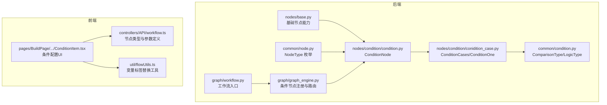
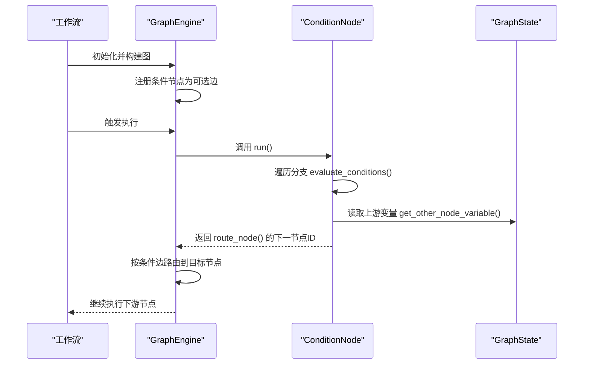
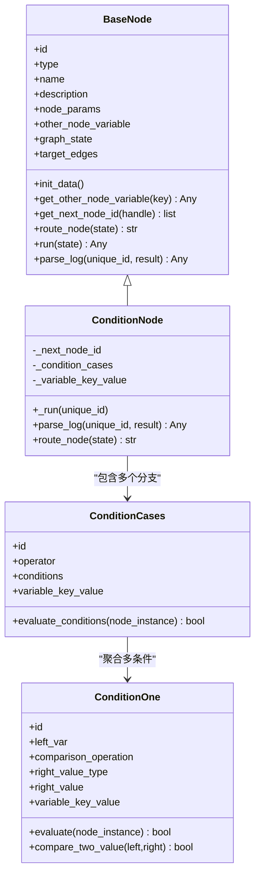
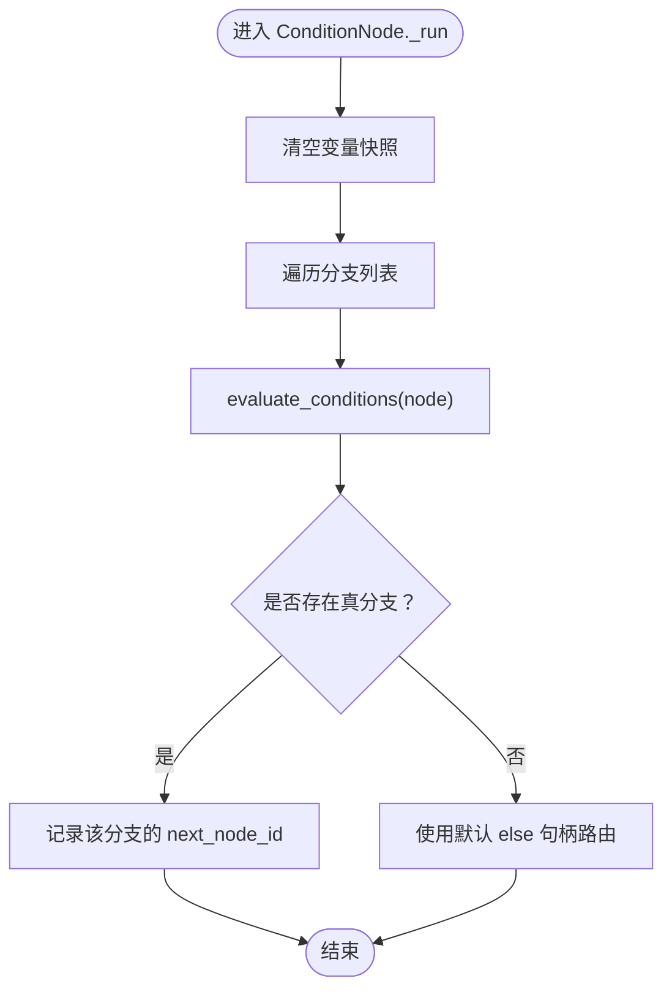
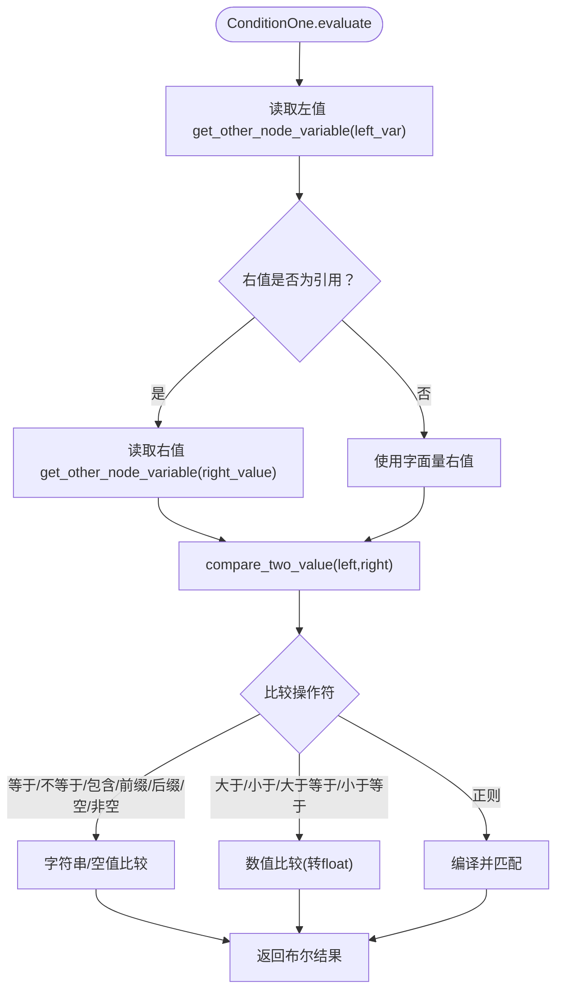
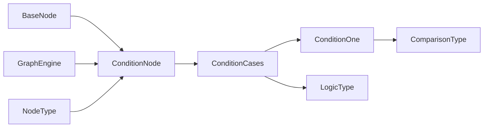

# Condition 条件节点

<cite>
**本文引用的文件**
- [src/backend/bisheng/workflow/nodes/condition/condition.py](file://src/backend/bisheng/workflow/nodes/condition/condition.py)
- [src/backend/bisheng/workflow/nodes/condition/conidition_case.py](file://src/backend/bisheng/workflow/nodes/condition/conidition_case.py)
- [src/backend/bisheng/workflow/common/condition.py](file://src/backend/bisheng/workflow/common/condition.py)
- [src/backend/bisheng/workflow/nodes/base.py](file://src/backend/bisheng/workflow/nodes/base.py)
- [src/backend/bisheng/workflow/common/node.py](file://src/backend/bisheng/workflow/common/node.py)
- [src/backend/bisheng/workflow/graph/graph_engine.py](file://src/backend/bisheng/workflow/graph/graph_engine.py)
- [src/backend/bisheng/workflow/graph/workflow.py](file://src/backend/bisheng/workflow/graph/workflow.py)
- [src/frontend/platform/src/pages/BuildPage/flow/FlowNode/component/ConditionItem.tsx](file://src/frontend/platform/src/pages/BuildPage/flow/FlowNode/component/ConditionItem.tsx)
- [src/frontend/platform/src/controllers/API/workflow.ts](file://src/frontend/platform/src/controllers/API/workflow.ts)
- [src/frontend/platform/src/util/flowUtils.ts](file://src/frontend/platform/src/util/flowUtils.ts)
</cite>

## 目录
1. [简介](#简介)
2. [项目结构](#项目结构)
3. [核心组件](#核心组件)
4. [架构总览](#架构总览)
5. [组件详解](#组件详解)
6. [依赖关系分析](#依赖关系分析)
7. [性能考量](#性能考量)
8. [故障排查指南](#故障排查指南)
9. [结论](#结论)
10. [附录](#附录)

## 简介
本文件系统性地阐述 Bisheng 工作流中 Condition 条件节点的设计与实现，覆盖以下方面：
- 设计架构与决策机制：条件表达式解析、逻辑判断执行、分支路由选择
- 配置方式：条件规则定义、比较操作符、数据类型处理、嵌套条件
- 执行流程：条件评估、结果计算、目标节点选择
- 在工作流中的作用：流程控制、业务逻辑分支、动态路由
- 性能优化：条件缓存、快速路径、短路求值
- 调试方法与复杂条件表达式编写指南

## 项目结构
Condition 条件节点位于后端工作流引擎的节点体系中，前端提供可视化配置界面。核心文件分布如下：
- 后端节点实现：nodes/condition 下的 ConditionNode、ConditionCases、ConditionOne
- 公共常量：common/condition 定义比较与逻辑类型
- 基类与通用能力：nodes/base 提供变量访问、日志、路由等通用能力
- 图执行引擎：graph_engine 将条件节点注册为可选边，驱动路由
- 前端配置：BuildPage 的 ConditionItem 组件用于构建条件分支与条件项

图表来源
- [src/backend/bisheng/workflow/nodes/condition/condition.py](file://src/backend/bisheng/workflow/nodes/condition/condition.py#L1-L47)
- [src/backend/bisheng/workflow/nodes/condition/conidition_case.py](file://src/backend/bisheng/workflow/nodes/condition/conidition_case.py#L1-L86)
- [src/backend/bisheng/workflow/common/condition.py](file://src/backend/bisheng/workflow/common/condition.py#L1-L20)
- [src/backend/bisheng/workflow/nodes/base.py](file://src/backend/bisheng/workflow/nodes/base.py#L1-L230)
- [src/backend/bisheng/workflow/common/node.py](file://src/backend/bisheng/workflow/common/node.py#L1-L73)
- [src/backend/bisheng/workflow/graph/graph_engine.py](file://src/backend/bisheng/workflow/graph/graph_engine.py#L1-L388)
- [src/backend/bisheng/workflow/graph/workflow.py](file://src/backend/bisheng/workflow/graph/workflow.py#L1-L91)
- [src/frontend/platform/src/pages/BuildPage/flow/FlowNode/component/ConditionItem.tsx](file://src/frontend/platform/src/pages/BuildPage/flow/FlowNode/component/ConditionItem.tsx#L158-L364)
- [src/frontend/platform/src/controllers/API/workflow.ts](file://src/frontend/platform/src/controllers/API/workflow.ts#L1011-L1049)
- [src/frontend/platform/src/util/flowUtils.ts](file://src/frontend/platform/src/util/flowUtils.ts#L491-L513)

章节来源
- [src/backend/bisheng/workflow/nodes/condition/condition.py](file://src/backend/bisheng/workflow/nodes/condition/condition.py#L1-L47)
- [src/backend/bisheng/workflow/nodes/condition/conidition_case.py](file://src/backend/bisheng/workflow/nodes/condition/conidition_case.py#L1-L86)
- [src/backend/bisheng/workflow/common/condition.py](file://src/backend/bisheng/workflow/common/condition.py#L1-L20)
- [src/backend/bisheng/workflow/nodes/base.py](file://src/backend/bisheng/workflow/nodes/base.py#L1-L230)
- [src/backend/bisheng/workflow/common/node.py](file://src/backend/bisheng/workflow/common/node.py#L1-L73)
- [src/backend/bisheng/workflow/graph/graph_engine.py](file://src/backend/bisheng/workflow/graph/graph_engine.py#L1-L388)
- [src/backend/bisheng/workflow/graph/workflow.py](file://src/backend/bisheng/workflow/graph/workflow.py#L1-L91)
- [src/frontend/platform/src/pages/BuildPage/flow/FlowNode/component/ConditionItem.tsx](file://src/frontend/platform/src/pages/BuildPage/flow/FlowNode/component/ConditionItem.tsx#L158-L364)
- [src/frontend/platform/src/controllers/API/workflow.ts](file://src/frontend/platform/src/controllers/API/workflow.ts#L1011-L1049)
- [src/frontend/platform/src/util/flowUtils.ts](file://src/frontend/platform/src/util/flowUtils.ts#L491-L513)

## 核心组件
- ConditionNode：条件节点主体，负责遍历条件分支、短路求值、默认分支回退、记录变量快照、输出路由目标
- ConditionCases：分支级逻辑，支持“and/or”聚合；空条件视为通过
- ConditionOne：单条条件，支持多种比较操作符；右值可为字面量或来自其他节点变量的引用
- BaseNode：所有节点的基类，提供变量读取、回调、日志、路由接口、边连接等通用能力
- GraphEngine：图执行引擎，将条件节点注册为条件边，依据节点 route_node 决策下一跳
- NodeType/ComparisonType/LogicType：节点类型与比较/逻辑运算枚举

章节来源
- [src/backend/bisheng/workflow/nodes/condition/condition.py](file://src/backend/bisheng/workflow/nodes/condition/condition.py#L8-L47)
- [src/backend/bisheng/workflow/nodes/condition/conidition_case.py](file://src/backend/bisheng/workflow/nodes/condition/conidition_case.py#L11-L86)
- [src/backend/bisheng/workflow/common/condition.py](file://src/backend/bisheng/workflow/common/condition.py#L1-L20)
- [src/backend/bisheng/workflow/nodes/base.py](file://src/backend/bisheng/workflow/nodes/base.py#L20-L230)
- [src/backend/bisheng/workflow/common/node.py](file://src/backend/bisheng/workflow/common/node.py#L8-L26)
- [src/backend/bisheng/workflow/graph/graph_engine.py](file://src/backend/bisheng/workflow/graph/graph_engine.py#L102-L108)

## 架构总览
Condition 节点在工作流中的定位是“可选边”的决策点。执行时，GraphEngine 将其注册为条件边，调用节点的 route_node 方法返回下一个节点 ID，从而实现动态路由。

图表来源
- [src/backend/bisheng/workflow/graph/graph_engine.py](file://src/backend/bisheng/workflow/graph/graph_engine.py#L102-L108)
- [src/backend/bisheng/workflow/nodes/condition/condition.py](file://src/backend/bisheng/workflow/nodes/condition/condition.py#L19-L46)
- [src/backend/bisheng/workflow/nodes/base.py](file://src/backend/bisheng/workflow/nodes/base.py#L108-L141)

## 组件详解

### 类关系图

图表来源
- [src/backend/bisheng/workflow/nodes/base.py](file://src/backend/bisheng/workflow/nodes/base.py#L20-L230)
- [src/backend/bisheng/workflow/nodes/condition/condition.py](file://src/backend/bisheng/workflow/nodes/condition/condition.py#L8-L47)
- [src/backend/bisheng/workflow/nodes/condition/conidition_case.py](file://src/backend/bisheng/workflow/nodes/condition/conidition_case.py#L63-L86)
- [src/backend/bisheng/workflow/nodes/condition/conidition_case.py](file://src/backend/bisheng/workflow/nodes/condition/conidition_case.py#L11-L61)

#### 执行流程与决策机制
- 分支评估顺序：按分支顺序依次 evaluate_conditions，遇到首个为真的分支即短路返回，记录该分支的变量快照
- 默认分支：若无分支通过，则使用“else”句柄进行回退路由
- 变量快照：每个分支独立维护 variable_key_value，最终由 ConditionNode 汇总输出日志
- 路由选择：route_node 返回下一节点 ID，GraphEngine 依据条件边完成跳转

图表来源
- [src/backend/bisheng/workflow/nodes/condition/condition.py](file://src/backend/bisheng/workflow/nodes/condition/condition.py#L19-L46)
- [src/backend/bisheng/workflow/nodes/condition/conidition_case.py](file://src/backend/bisheng/workflow/nodes/condition/conidition_case.py#L71-L86)

#### 条件表达式解析与比较
- 左值：从全局状态读取，格式为“节点ID.变量键”
- 右值：支持字面量与“ref”引用两种类型；当为 ref 时，右值同样从全局状态读取
- 比较操作符：等于、不等于、包含/不包含、前缀/后缀、大小比较、空/非空、正则匹配
- 数据类型处理：数值比较统一转换为浮点数；字符串比较保持原语义

图表来源
- [src/backend/bisheng/workflow/nodes/condition/conidition_case.py](file://src/backend/bisheng/workflow/nodes/condition/conidition_case.py#L19-L60)
- [src/backend/bisheng/workflow/common/condition.py](file://src/backend/bisheng/workflow/common/condition.py#L1-L20)

#### 分支聚合逻辑
- operator 支持 and/or
- 空条件集合视为通过
- and：任一 false 则整体 false（短路）
- or：任一 true 则整体 true（短路）

章节来源
- [src/backend/bisheng/workflow/nodes/condition/conidition_case.py](file://src/backend/bisheng/workflow/nodes/condition/conidition_case.py#L63-L86)

#### 路由与边连接
- GraphEngine 将条件节点注册为条件边，调用 node_instance.route_node(state) 获取下一节点 ID
- 条件边的目标节点集由节点的 target_edges 中的 sourceHandle 决定

章节来源
- [src/backend/bisheng/workflow/graph/graph_engine.py](file://src/backend/bisheng/workflow/graph/graph_engine.py#L102-L108)
- [src/backend/bisheng/workflow/nodes/base.py](file://src/backend/bisheng/workflow/nodes/base.py#L136-L141)

#### 日志与变量快照
- ConditionNode.parse_log 输出当前已计算的变量键值对，类型标记为 variable
- 变量键名遵循“节点ID.变量键”的格式，便于前端展示与调试

章节来源
- [src/backend/bisheng/workflow/nodes/condition/condition.py](file://src/backend/bisheng/workflow/nodes/condition/condition.py#L36-L43)
- [src/frontend/platform/src/util/flowUtils.ts](file://src/frontend/platform/src/util/flowUtils.ts#L491-L513)

#### 前端配置与可视化
- BuildPage 的 ConditionItem.tsx 提供添加分支、切换逻辑运算符、增删条件项的交互
- API 定义了 condition 节点的参数结构，其中 condition 字段为数组，每项包含 id、operator、conditions 等
- flowUtils 对变量标签进行节点名称替换，提升可读性

章节来源
- [src/frontend/platform/src/pages/BuildPage/flow/FlowNode/component/ConditionItem.tsx](file://src/frontend/platform/src/pages/BuildPage/flow/FlowNode/component/ConditionItem.tsx#L158-L364)
- [src/frontend/platform/src/controllers/API/workflow.ts](file://src/frontend/platform/src/controllers/API/workflow.ts#L1011-L1049)
- [src/frontend/platform/src/util/flowUtils.ts](file://src/frontend/platform/src/util/flowUtils.ts#L491-L513)

## 依赖关系分析
- ConditionNode 依赖 BaseNode 提供变量读取、边连接、回调与运行框架
- ConditionCases/ConditionOne 依赖 ComparisonType/LogicType 进行比较与聚合
- GraphEngine 将条件节点注册为条件边，依赖节点的 route_node 实现动态路由
- NodeType 枚举标识条件节点类型，确保正确识别与处理

图表来源
- [src/backend/bisheng/workflow/nodes/base.py](file://src/backend/bisheng/workflow/nodes/base.py#L20-L230)
- [src/backend/bisheng/workflow/nodes/condition/condition.py](file://src/backend/bisheng/workflow/nodes/condition/condition.py#L8-L47)
- [src/backend/bisheng/workflow/nodes/condition/conidition_case.py](file://src/backend/bisheng/workflow/nodes/condition/conidition_case.py#L63-L86)
- [src/backend/bisheng/workflow/common/condition.py](file://src/backend/bisheng/workflow/common/condition.py#L1-L20)
- [src/backend/bisheng/workflow/graph/graph_engine.py](file://src/backend/bisheng/workflow/graph/graph_engine.py#L102-L108)
- [src/backend/bisheng/workflow/common/node.py](file://src/backend/bisheng/workflow/common/node.py#L8-L26)

## 性能考量
- 条件缓存
  - 可在 ConditionOne.evaluate 中引入缓存层，以节点ID+变量键为键缓存左值与右值，避免重复读取
  - 对于频繁引用的上游变量，建议在节点初始化阶段预取并缓存
- 快速路径
  - 对空条件集合直接返回真，减少不必要的比较开销
  - and/or 的短路求值已在 evaluate_conditions 中实现，无需额外改动
- 短路求值
  - 分支级 and：遇假即停
  - 分支级 or：遇真即停
- 正则匹配
  - 编译正则表达式一次即可复用，避免在 compare_two_value 中重复编译
- 变量读取
  - get_other_node_variable 会写入 other_node_variable，可在上层缓存以降低重复查询成本

章节来源
- [src/backend/bisheng/workflow/nodes/condition/conidition_case.py](file://src/backend/bisheng/workflow/nodes/condition/conidition_case.py#L71-L86)
- [src/backend/bisheng/workflow/nodes/base.py](file://src/backend/bisheng/workflow/nodes/base.py#L108-L112)

## 故障排查指南
- 常见问题
  - 条件未命中：检查分支顺序与逻辑运算符；确认是否存在默认 else 分支
  - 变量引用错误：核对“节点ID.变量键”格式；确认上游节点已产生该变量
  - 比较类型不匹配：数值比较需保证输入可转为浮点数；字符串比较注意大小写与空白
  - 正则不生效：确认正则表达式语法；必要时在 compare_two_value 中增加异常捕获
- 调试建议
  - 使用 parse_log 输出变量快照，核对 left_var/right_value 的实际值
  - 在 evaluate/compare_two_value 中增加日志，定位具体失败分支
  - 前端查看变量标签替换后的显示，确认引用是否正确
- 前端辅助
  - ConditionItem 支持批量增删条件与切换逻辑运算符，便于快速验证不同组合
  - flowUtils 的标签替换有助于理解变量来源

章节来源
- [src/backend/bisheng/workflow/nodes/condition/condition.py](file://src/backend/bisheng/workflow/nodes/condition/condition.py#L36-L43)
- [src/backend/bisheng/workflow/nodes/condition/conidition_case.py](file://src/backend/bisheng/workflow/nodes/condition/conidition_case.py#L19-L60)
- [src/frontend/platform/src/pages/BuildPage/flow/FlowNode/component/ConditionItem.tsx](file://src/frontend/platform/src/pages/BuildPage/flow/FlowNode/component/ConditionItem.tsx#L314-L337)
- [src/frontend/platform/src/util/flowUtils.ts](file://src/frontend/platform/src/util/flowUtils.ts#L491-L513)

## 结论
Condition 条件节点通过清晰的分支与条件抽象、短路求值与默认回退机制，在工作流中实现了灵活且高效的动态路由。结合前端可视化配置与日志快照能力，开发者可以快速构建复杂的业务分支逻辑，并在性能与可维护性之间取得良好平衡。

## 附录

### 配置要点与最佳实践
- 分支设计
  - 使用 and/or 明确分支间的聚合关系
  - 将最可能命中的分支置于前面，利用短路求值提升性能
- 条件书写
  - 优先使用精确比较（如 equals/not_equals）而非模糊匹配（contains/regex）
  - 数值比较统一使用 greater_than 系列，避免隐式类型转换带来的歧义
- 引用变量
  - 严格遵循“节点ID.变量键”的命名规范
  - 对高频引用变量进行缓存，减少重复读取
- 默认分支
  - 始终提供 else 分支，明确兜底逻辑，避免意外的静默失败

### 复杂条件表达式编写指南
- 嵌套与组合
  - 通过多分支与多条件组合实现复杂判定树
  - 使用“或”分支承载互斥场景，“与”分支承载多条件同时满足
- 可读性
  - 为每个分支设置清晰的 id，便于日志与调试
  - 在前端 UI 中合理组织条件项，必要时拆分为更小的子条件
- 可观测性
  - 依赖 parse_log 输出变量快照，核对关键中间值
  - 对正则等高成本操作增加日志与超时保护