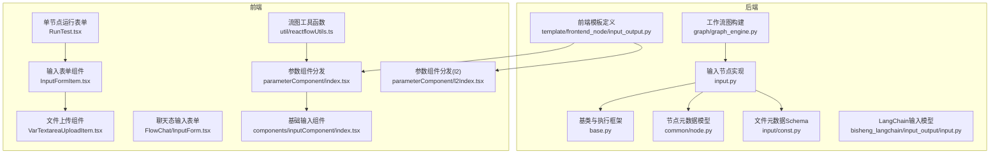
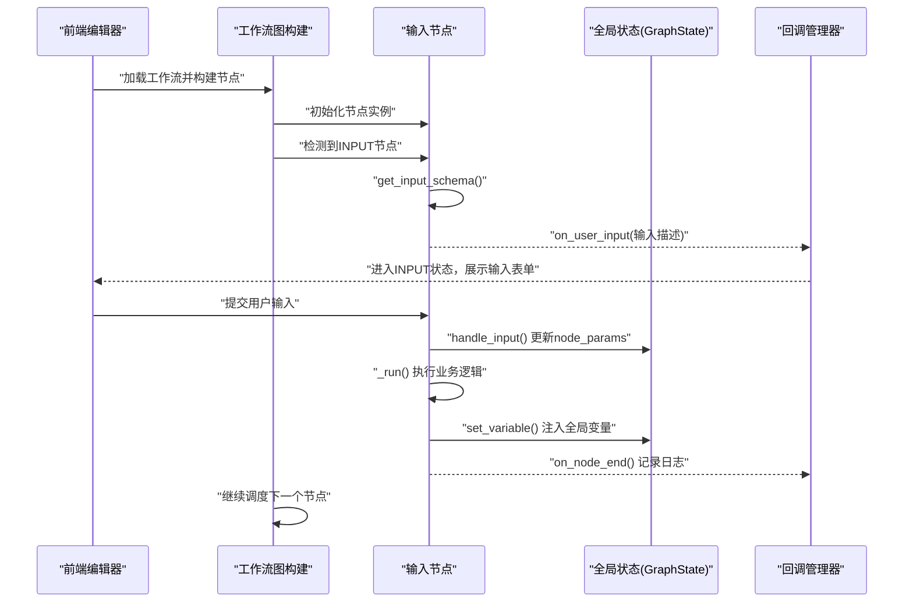
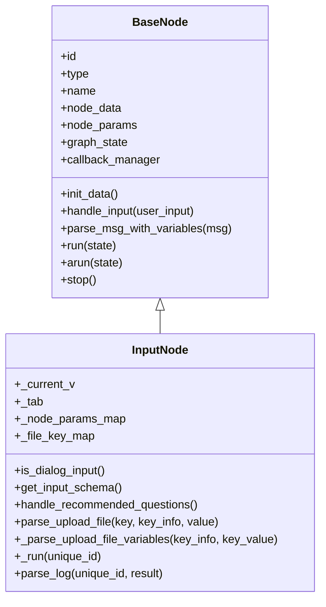
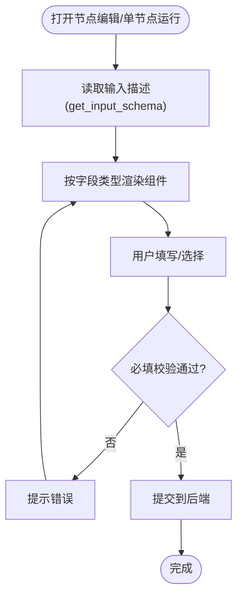
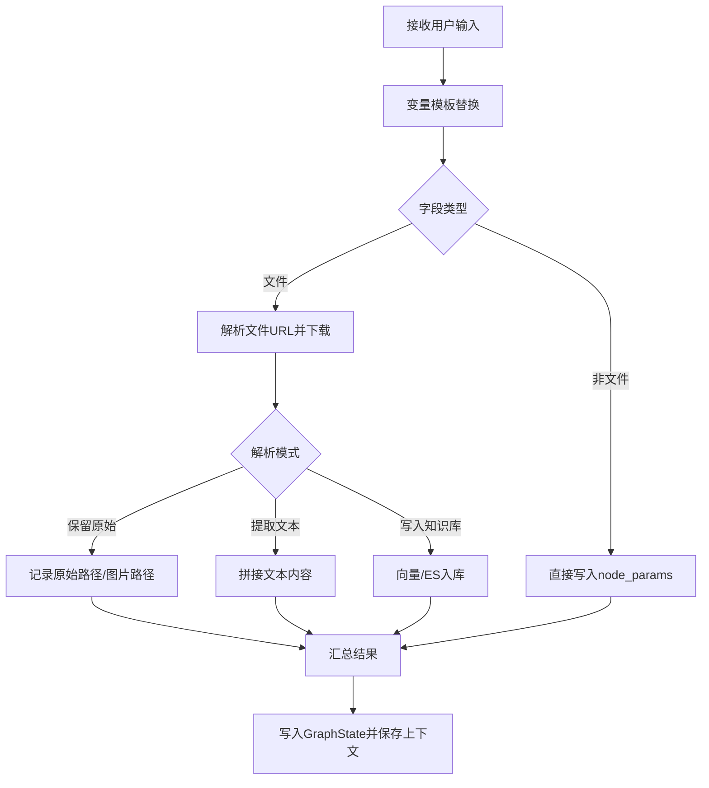
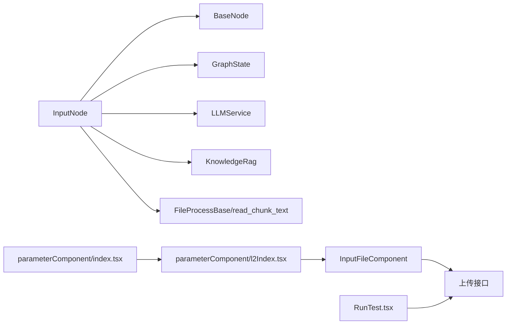

# 输入节点

<cite>
**本文引用的文件**
- [src/backend/bisheng/workflow/nodes/input/input.py](file://src/backend/bisheng/workflow/nodes/input/input.py)
- [src/backend/bisheng/workflow/nodes/base.py](file://src/backend/bisheng/workflow/nodes/base.py)
- [src/backend/bisheng/workflow/common/node.py](file://src/backend/bisheng/workflow/common/node.py)
- [src/backend/bisheng/workflow/nodes/input/const.py](file://src/backend/bisheng/workflow/nodes/input/const.py)
- [src/backend/bisheng/template/frontend_node/input_output.py](file://src/backend/bisheng/template/frontend_node/input_output.py)
- [src/backend/bisheng_langchain/input_output/input.py](file://src/backend/bisheng_langchain/input_output/input.py)
- [src/backend/bisheng/workflow/graph/graph_engine.py](file://src/backend/bisheng/workflow/graph/graph_engine.py)
- [src/frontend/platform/src/CustomNodes/GenericNode/components/parameterComponent/index.tsx](file://src/frontend/platform/src/CustomNodes/GenericNode/components/parameterComponent/index.tsx)
- [src/frontend/platform/src/CustomNodes/GenericNode/components/parameterComponent/l2Index.tsx](file://src/frontend/platform/src/CustomNodes/GenericNode/components/parameterComponent/l2Index.tsx)
- [src/frontend/platform/src/pages/BuildPage/flow/FlowNode/RunTest.tsx](file://src/frontend/platform/src/pages/BuildPage/flow/FlowNode/RunTest.tsx)
- [src/frontend/platform/src/pages/BuildPage/flow/FlowNode/component/InputFormItem.tsx](file://src/frontend/platform/src/pages/BuildPage/flow/FlowNode/component/InputFormItem.tsx)
- [src/frontend/platform/src/pages/BuildPage/flow/FlowNode/component/VarTextareaUploadItem.tsx](file://src/frontend/platform/src/pages/BuildPage/flow/FlowNode/component/VarTextareaUploadItem.tsx)
- [src/frontend/platform/src/pages/BuildPage/flow/FlowChat/InputForm.tsx](file://src/frontend/platform/src/pages/BuildPage/flow/FlowChat/InputForm.tsx)
- [src/frontend/platform/src/components/inputComponent/index.tsx](file://src/frontend/platform/src/components/inputComponent/index.tsx)
- [src/frontend/platform/src/util/reactflowUtils.ts](file://src/frontend/platform/src/util/reactflowUtils.ts)
</cite>

## 目录
1. [简介](#简介)
2. [项目结构](#项目结构)
3. [核心组件](#核心组件)
4. [架构总览](#架构总览)
5. [组件详解](#组件详解)
6. [依赖关系分析](#依赖关系分析)
7. [性能考量](#性能考量)
8. [故障排查指南](#故障排查指南)
9. [结论](#结论)
10. [附录](#附录)

## 简介
本文件系统性阐述 Bisheng 工作流中的“输入节点”（Input Node）：从设计理念、前后端实现、数据处理流程到在工作流中的角色定位，再到扩展开发与最佳实践。输入节点负责接收用户交互或静态参数，并将结果注入全局变量上下文，供后续节点消费；同时支持对话式输入与表单式输入两种模式，以及文件上传解析与向量/ES索引写入能力。

## 项目结构
围绕输入节点的关键代码分布在后端工作流引擎与前端可视化编辑器两部分：
- 后端
  - 输入节点实现：src/backend/bisheng/workflow/nodes/input/input.py
  - 基类与通用执行框架：src/backend/bisheng/workflow/nodes/base.py
  - 节点元数据模型：src/backend/bisheng/workflow/common/node.py
  - 输入节点文件元数据Schema：src/backend/bisheng/workflow/nodes/input/const.py
  - 前端模板与字段定义：src/backend/bisheng/template/frontend_node/input_output.py
  - LangChain侧输入模型：src/backend/bisheng_langchain/input_output/input.py
  - 工作流图构建与中断机制：src/backend/bisheng/workflow/graph/graph_engine.py
- 前端
  - 参数编辑组件与类型分发：src/frontend/platform/src/CustomNodes/GenericNode/components/parameterComponent/index.tsx、l2Index.tsx
  - 单节点运行与输入表单：src/frontend/platform/src/pages/BuildPage/flow/FlowNode/RunTest.tsx、InputFormItem.tsx
  - 文件上传与进度处理：src/frontend/platform/src/pages/BuildPage/flow/FlowNode/component/VarTextareaUploadItem.tsx
  - 聊天态输入表单：src/frontend/platform/src/pages/BuildPage/flow/FlowChat/InputForm.tsx
  - 基础输入组件：src/frontend/platform/src/components/inputComponent/index.tsx
  - 流图工具函数：src/frontend/platform/src/util/reactflowUtils.ts

图表来源
- [src/backend/bisheng/workflow/nodes/input/input.py](file://src/backend/bisheng/workflow/nodes/input/input.py#L1-L347)
- [src/backend/bisheng/workflow/nodes/base.py](file://src/backend/bisheng/workflow/nodes/base.py#L1-L230)
- [src/backend/bisheng/workflow/common/node.py](file://src/backend/bisheng/workflow/common/node.py#L1-L73)
- [src/backend/bisheng/workflow/nodes/input/const.py](file://src/backend/bisheng/workflow/nodes/input/const.py#L1-L20)
- [src/backend/bisheng/template/frontend_node/input_output.py](file://src/backend/bisheng/template/frontend_node/input_output.py#L1-L155)
- [src/backend/bisheng_langchain/input_output/input.py](file://src/backend/bisheng_langchain/input_output/input.py#L1-L45)
- [src/backend/bisheng/workflow/graph/graph_engine.py](file://src/backend/bisheng/workflow/graph/graph_engine.py#L230-L387)
- [src/frontend/platform/src/CustomNodes/GenericNode/components/parameterComponent/index.tsx](file://src/frontend/platform/src/CustomNodes/GenericNode/components/parameterComponent/index.tsx#L1-L200)
- [src/frontend/platform/src/CustomNodes/GenericNode/components/parameterComponent/l2Index.tsx](file://src/frontend/platform/src/CustomNodes/GenericNode/components/parameterComponent/l2Index.tsx#L103-L170)
- [src/frontend/platform/src/pages/BuildPage/flow/FlowNode/RunTest.tsx](file://src/frontend/platform/src/pages/BuildPage/flow/FlowNode/RunTest.tsx#L2-L254)
- [src/frontend/platform/src/pages/BuildPage/flow/FlowNode/component/InputFormItem.tsx](file://src/frontend/platform/src/pages/BuildPage/flow/FlowNode/component/InputFormItem.tsx#L784-L817)
- [src/frontend/platform/src/pages/BuildPage/flow/FlowNode/component/VarTextareaUploadItem.tsx](file://src/frontend/platform/src/pages/BuildPage/flow/FlowNode/component/VarTextareaUploadItem.tsx#L92-L127)
- [src/frontend/platform/src/pages/BuildPage/flow/FlowChat/InputForm.tsx](file://src/frontend/platform/src/pages/BuildPage/flow/FlowChat/InputForm.tsx#L1-L36)
- [src/frontend/platform/src/components/inputComponent/index.tsx](file://src/frontend/platform/src/components/inputComponent/index.tsx#L64-L101)
- [src/frontend/platform/src/util/reactflowUtils.ts](file://src/frontend/platform/src/util/reactflowUtils.ts#L1116-L1157)

章节来源
- [src/backend/bisheng/workflow/nodes/input/input.py](file://src/backend/bisheng/workflow/nodes/input/input.py#L1-L347)
- [src/backend/bisheng/workflow/nodes/base.py](file://src/backend/bisheng/workflow/nodes/base.py#L1-L230)
- [src/backend/bisheng/workflow/common/node.py](file://src/backend/bisheng/workflow/common/node.py#L1-L73)
- [src/backend/bisheng/workflow/nodes/input/const.py](file://src/backend/bisheng/workflow/nodes/input/const.py#L1-L20)
- [src/backend/bisheng/template/frontend_node/input_output.py](file://src/backend/bisheng/template/frontend_node/input_output.py#L1-L155)
- [src/backend/bisheng_langchain/input_output/input.py](file://src/backend/bisheng_langchain/input_output/input.py#L1-L45)
- [src/backend/bisheng/workflow/graph/graph_engine.py](file://src/backend/bisheng/workflow/graph/graph_engine.py#L230-L387)
- [src/frontend/platform/src/CustomNodes/GenericNode/components/parameterComponent/index.tsx](file://src/frontend/platform/src/CustomNodes/GenericNode/components/parameterComponent/index.tsx#L1-L200)
- [src/frontend/platform/src/CustomNodes/GenericNode/components/parameterComponent/l2Index.tsx](file://src/frontend/platform/src/CustomNodes/GenericNode/components/parameterComponent/l2Index.tsx#L103-L170)
- [src/frontend/platform/src/pages/BuildPage/flow/FlowNode/RunTest.tsx](file://src/frontend/platform/src/pages/BuildPage/flow/FlowNode/RunTest.tsx#L2-L254)
- [src/frontend/platform/src/pages/BuildPage/flow/FlowNode/component/InputFormItem.tsx](file://src/frontend/platform/src/pages/BuildPage/flow/FlowNode/component/InputFormItem.tsx#L784-L817)
- [src/frontend/platform/src/pages/BuildPage/flow/FlowNode/component/VarTextareaUploadItem.tsx](file://src/frontend/platform/src/pages/BuildPage/flow/FlowNode/component/VarTextareaUploadItem.tsx#L92-L127)
- [src/frontend/platform/src/pages/BuildPage/flow/FlowChat/InputForm.tsx](file://src/frontend/platform/src/pages/BuildPage/flow/FlowChat/InputForm.tsx#L1-L36)
- [src/frontend/platform/src/components/inputComponent/index.tsx](file://src/frontend/platform/src/components/inputComponent/index.tsx#L64-L101)
- [src/frontend/platform/src/util/reactflowUtils.ts](file://src/frontend/platform/src/util/reactflowUtils.ts#L1116-L1157)

## 核心组件
- 输入节点实现（后端）
  - 负责解析表单/对话输入、文件解析与入库、向量/ES索引写入、推荐问题生成、日志记录与全局变量注入。
- 基类与执行框架（后端）
  - 提供统一的节点生命周期、回调、变量解析与注入、最大步数保护等。
- 节点元数据模型（后端）
  - 定义节点类型、参数组、版本号、变量查询等。
- 输入节点文件元数据Schema（后端）
  - 定义上传文件在向量/ES索引中的元数据字段。
- 前端模板与字段定义（前端）
  - 定义输入节点的字段类型、显示名、占位符、是否必填、文件类型/后缀等。
- LangChain输入模型（后端）
  - 用于序列化/反序列化输入节点的Pydantic模型。
- 工作流图构建（后端）
  - 在遇到输入节点时，会触发“等待用户输入”的中断机制，通过回调通知前端。
- 前端参数组件（前端）
  - 根据字段类型渲染不同输入组件（文本、整型、浮点、布尔、下拉、代码、文件、提示词等），并处理变更与保存。
- 单节点运行与输入表单（前端）
  - 支持对任意节点进行单节点调试运行，收集输入并调用后端接口。
- 文件上传组件（前端）
  - 处理文件选择、上传进度、多文件管理与回填路径。

章节来源
- [src/backend/bisheng/workflow/nodes/input/input.py](file://src/backend/bisheng/workflow/nodes/input/input.py#L33-L103)
- [src/backend/bisheng/workflow/nodes/base.py](file://src/backend/bisheng/workflow/nodes/base.py#L20-L88)
- [src/backend/bisheng/workflow/common/node.py](file://src/backend/bisheng/workflow/common/node.py#L48-L73)
- [src/backend/bisheng/workflow/nodes/input/const.py](file://src/backend/bisheng/workflow/nodes/input/const.py#L4-L19)
- [src/backend/bisheng/template/frontend_node/input_output.py](file://src/backend/bisheng/template/frontend_node/input_output.py#L80-L131)
- [src/backend/bisheng_langchain/input_output/input.py](file://src/backend/bisheng_langchain/input_output/input.py#L7-L45)
- [src/backend/bisheng/workflow/graph/graph_engine.py](file://src/backend/bisheng/workflow/graph/graph_engine.py#L230-L387)
- [src/frontend/platform/src/CustomNodes/GenericNode/components/parameterComponent/index.tsx](file://src/frontend/platform/src/CustomNodes/GenericNode/components/parameterComponent/index.tsx#L109-L122)
- [src/frontend/platform/src/pages/BuildPage/flow/FlowNode/RunTest.tsx](file://src/frontend/platform/src/pages/BuildPage/flow/FlowNode/RunTest.tsx#L244-L254)

## 架构总览
输入节点在工作流中的职责与交互如下：

图表来源
- [src/backend/bisheng/workflow/graph/graph_engine.py](file://src/backend/bisheng/workflow/graph/graph_engine.py#L367-L384)
- [src/backend/bisheng/workflow/nodes/base.py](file://src/backend/bisheng/workflow/nodes/base.py#L189-L223)
- [src/backend/bisheng/workflow/nodes/input/input.py](file://src/backend/bisheng/workflow/nodes/input/input.py#L82-L103)

## 组件详解

### 输入节点实现（后端）
- 设计要点
  - 支持两种输入模式：对话式（dialog_input）与表单式（form_input），通过 tab 字段区分。
  - 对文件类型的字段，支持三种解析模式：保留原始文件、提取文本、写入知识库（向量/ES）。
  - 推荐问题生成：基于历史对话与LLM生成候选问题，通过回调事件下发给前端。
  - 全局变量注入：将处理后的键值对写入GraphState，供下游节点引用。
- 关键方法
  - is_dialog_input()/get_input_schema()：决定输入形态与返回前端的输入描述。
  - handle_recommended_questions()：生成推荐问题并回调。
  - parse_upload_file()/_parse_upload_file_variables()：文件解析与返回值映射。
  - _run()：主执行流程，拼装人类可读输入并保存上下文。
  - parse_log()：仅记录非文件字段的日志，避免泄露敏感信息。
- 数据结构
  - node_params：经处理后的可用参数字典。
  - _node_params_map/_file_key_map：字段元信息与文件键映射，便于解析与回填。

图表来源
- [src/backend/bisheng/workflow/nodes/base.py](file://src/backend/bisheng/workflow/nodes/base.py#L20-L88)
- [src/backend/bisheng/workflow/nodes/input/input.py](file://src/backend/bisheng/workflow/nodes/input/input.py#L33-L103)

章节来源
- [src/backend/bisheng/workflow/nodes/input/input.py](file://src/backend/bisheng/workflow/nodes/input/input.py#L33-L103)
- [src/backend/bisheng/workflow/nodes/base.py](file://src/backend/bisheng/workflow/nodes/base.py#L20-L88)

### 前端参数组件与输入表单
- 参数组件分发
  - 根据字段类型渲染对应组件（str/int/float/bool/select/code/prompt/file等），并处理值变更与保存。
  - 数值类型自动转为数字；文件类型通过 onFileChange 回填路径。
- 单节点运行
  - 读取节点的输入描述（来自 get_input_schema），动态生成表单项，支持必填校验与自动填充标记。
- 文件上传
  - 触发本地文件选择，调用上传接口，回填相对路径；支持多文件与移除操作。
- 基础输入组件
  - 文本输入、密码可见切换、只读/禁用状态等。

图表来源
- [src/frontend/platform/src/pages/BuildPage/flow/FlowNode/RunTest.tsx](file://src/frontend/platform/src/pages/BuildPage/flow/FlowNode/RunTest.tsx#L244-L254)
- [src/frontend/platform/src/CustomNodes/GenericNode/components/parameterComponent/l2Index.tsx](file://src/frontend/platform/src/CustomNodes/GenericNode/components/parameterComponent/l2Index.tsx#L144-L156)
- [src/frontend/platform/src/pages/BuildPage/flow/FlowNode/component/VarTextareaUploadItem.tsx](file://src/frontend/platform/src/pages/BuildPage/flow/FlowNode/component/VarTextareaUploadItem.tsx#L92-L127)

章节来源
- [src/frontend/platform/src/CustomNodes/GenericNode/components/parameterComponent/index.tsx](file://src/frontend/platform/src/CustomNodes/GenericNode/components/parameterComponent/index.tsx#L109-L122)
- [src/frontend/platform/src/CustomNodes/GenericNode/components/parameterComponent/l2Index.tsx](file://src/frontend/platform/src/CustomNodes/GenericNode/components/parameterComponent/l2Index.tsx#L103-L170)
- [src/frontend/platform/src/pages/BuildPage/flow/FlowNode/RunTest.tsx](file://src/frontend/platform/src/pages/BuildPage/flow/FlowNode/RunTest.tsx#L244-L254)
- [src/frontend/platform/src/pages/BuildPage/flow/FlowNode/component/VarTextareaUploadItem.tsx](file://src/frontend/platform/src/pages/BuildPage/flow/FlowNode/component/VarTextareaUploadItem.tsx#L92-L127)
- [src/frontend/platform/src/components/inputComponent/index.tsx](file://src/frontend/platform/src/components/inputComponent/index.tsx#L64-L101)

### 配置方式与字段定义
- 前端模板定义
  - 通过 TemplateField 指定字段类型、是否必填、是否显示、默认值、占位符、显示名、帮助信息、文件类型/后缀等。
  - 支持根据节点名称动态调整字段显示与类型（如 AudioInputNode/FileInputNode 的文件类型约束）。
- LangChain模型
  - Pydantic模型定义输入节点的结构，确保序列化/反序列化一致性。
- 节点元数据
  - BaseNodeData 包含节点类型、版本、参数组、tab配置等，get_variable_info用于查询变量信息。

章节来源
- [src/backend/bisheng/template/frontend_node/input_output.py](file://src/backend/bisheng/template/frontend_node/input_output.py#L80-L131)
- [src/backend/bisheng_langchain/input_output/input.py](file://src/backend/bisheng_langchain/input_output/input.py#L7-L45)
- [src/backend/bisheng/workflow/common/node.py](file://src/backend/bisheng/workflow/common/node.py#L48-L73)

### 数据处理流程
- 接收与解析
  - 用户输入通过 handle_input 写入 node_params；变量模板通过 parse_msg_with_variables 替换为实际值。
- 文件处理
  - 解析文件URL，下载至本地；根据解析模式提取文本或写入向量/ES；记录元数据与原始路径。
- 存储与注入
  - 将非文件字段写入 GraphState，形成全局变量；记录日志时排除文件字段。
- 上下文保存
  - 对话模式下将用户输入与文件内容合并保存为人类消息上下文。

图表来源
- [src/backend/bisheng/workflow/nodes/base.py](file://src/backend/bisheng/workflow/nodes/base.py#L143-L158)
- [src/backend/bisheng/workflow/nodes/input/input.py](file://src/backend/bisheng/workflow/nodes/input/input.py#L174-L216)
- [src/backend/bisheng/workflow/nodes/input/input.py](file://src/backend/bisheng/workflow/nodes/input/input.py#L264-L346)

章节来源
- [src/backend/bisheng/workflow/nodes/base.py](file://src/backend/bisheng/workflow/nodes/base.py#L143-L158)
- [src/backend/bisheng/workflow/nodes/input/input.py](file://src/backend/bisheng/workflow/nodes/input/input.py#L174-L216)
- [src/backend/bisheng/workflow/nodes/input/input.py](file://src/backend/bisheng/workflow/nodes/input/input.py#L264-L346)

### 在工作流中的作用
- 数据准备：将用户输入与文件内容标准化，形成下游节点可消费的变量。
- 参数注入：通过 GraphState.set_variable 将键值对注入全局上下文，其他节点可通过变量引用使用。
- 用户交互：当遇到 INPUT 节点时，工作流进入 INPUT 状态，前端弹出输入表单，待用户提交后继续执行。
- 推荐问题：在对话模式下，可基于历史上下文与LLM生成候选问题，提升交互体验。

章节来源
- [src/backend/bisheng/workflow/graph/graph_engine.py](file://src/backend/bisheng/workflow/graph/graph_engine.py#L367-L384)
- [src/backend/bisheng/workflow/nodes/input/input.py](file://src/backend/bisheng/workflow/nodes/input/input.py#L105-L149)

### 扩展开发指南
- 自定义输入类型
  - 在前端模板中新增 TemplateField 并指定字段类型与显示属性；必要时在 format_field 中按节点名做差异化处理。
  - 在 LangChain 模型中补充对应字段，保证序列化一致。
- 特殊验证逻辑
  - 在前端参数组件中增加校验与错误提示；在后端 _run 中补充业务校验并抛出异常以中断流程。
- 数据映射
  - 通过 _parse_upload_file_variables 或 node_params 映射，确保返回值与下游节点期望一致。
- 文件解析策略
  - 根据业务需求调整解析模式（保留原始/提取文本/写入知识库），并配置 file_content_size 与 fileTypes/suffixes。

章节来源
- [src/backend/bisheng/template/frontend_node/input_output.py](file://src/backend/bisheng/template/frontend_node/input_output.py#L80-L131)
- [src/backend/bisheng_langchain/input_output/input.py](file://src/backend/bisheng_langchain/input_output/input.py#L7-L45)
- [src/backend/bisheng/workflow/nodes/input/input.py](file://src/backend/bisheng/workflow/nodes/input/input.py#L151-L172)

### 用户体验优化与错误处理最佳实践
- 体验优化
  - 必填字段明确标红与提示；文件上传支持多选、进度反馈与预览；对话模式下提供推荐问题卡片。
  - 表单组件按字段类型自动适配，减少用户学习成本。
- 错误处理
  - 前端：单节点运行时捕获请求错误并提示；文件上传失败需给出具体原因与重试建议。
  - 后端：对不支持的文件类型进行降级处理；JSON修复用于容错；最大步数保护防止死循环。
  - 日志：仅记录非敏感字段；文件字段不写入日志，避免泄露路径与内容。

章节来源
- [src/frontend/platform/src/pages/BuildPage/flow/FlowNode/RunTest.tsx](file://src/frontend/platform/src/pages/BuildPage/flow/FlowNode/RunTest.tsx#L244-L254)
- [src/frontend/platform/src/pages/BuildPage/flow/FlowNode/component/VarTextareaUploadItem.tsx](file://src/frontend/platform/src/pages/BuildPage/flow/FlowNode/component/VarTextareaUploadItem.tsx#L92-L127)
- [src/backend/bisheng/workflow/nodes/input/input.py](file://src/backend/bisheng/workflow/nodes/input/input.py#L128-L136)
- [src/backend/bisheng/workflow/nodes/input/input.py](file://src/backend/bisheng/workflow/nodes/input/input.py#L218-L225)

## 依赖关系分析
- 后端
  - InputNode 继承 BaseNode，复用统一的执行框架与回调机制。
  - 依赖 GraphState 进行变量注入与上下文保存；依赖 LLMService 与 KnowledgeRag 进行推荐问题与向量/ES写入。
  - 依赖 FileProcessBase 与 read_chunk_text 进行文件分块与文本抽取。
- 前端
  - 参数组件根据字段类型分发渲染；文件组件负责上传与回填；单节点运行表单负责收集输入并调用后端API。
  - reactflowUtils 提供流图工具函数，如移除文件名、生成类型映射等。

图表来源
- [src/backend/bisheng/workflow/nodes/input/input.py](file://src/backend/bisheng/workflow/nodes/input/input.py#L12-L24)
- [src/backend/bisheng/workflow/nodes/base.py](file://src/backend/bisheng/workflow/nodes/base.py#L1-L230)
- [src/frontend/platform/src/CustomNodes/GenericNode/components/parameterComponent/index.tsx](file://src/frontend/platform/src/CustomNodes/GenericNode/components/parameterComponent/index.tsx#L1-L50)
- [src/frontend/platform/src/CustomNodes/GenericNode/components/parameterComponent/l2Index.tsx](file://src/frontend/platform/src/CustomNodes/GenericNode/components/parameterComponent/l2Index.tsx#L144-L156)
- [src/frontend/platform/src/pages/BuildPage/flow/FlowNode/RunTest.tsx](file://src/frontend/platform/src/pages/BuildPage/flow/FlowNode/RunTest.tsx#L2-L25)

章节来源
- [src/backend/bisheng/workflow/nodes/input/input.py](file://src/backend/bisheng/workflow/nodes/input/input.py#L12-L24)
- [src/backend/bisheng/workflow/nodes/base.py](file://src/backend/bisheng/workflow/nodes/base.py#L1-L230)
- [src/frontend/platform/src/CustomNodes/GenericNode/components/parameterComponent/index.tsx](file://src/frontend/platform/src/CustomNodes/GenericNode/components/parameterComponent/index.tsx#L1-L50)
- [src/frontend/platform/src/CustomNodes/GenericNode/components/parameterComponent/l2Index.tsx](file://src/frontend/platform/src/CustomNodes/GenericNode/components/parameterComponent/l2Index.tsx#L144-L156)
- [src/frontend/platform/src/pages/BuildPage/flow/FlowNode/RunTest.tsx](file://src/frontend/platform/src/pages/BuildPage/flow/FlowNode/RunTest.tsx#L2-L25)

## 性能考量
- 文件解析与写入
  - 控制单次文件内容长度（file_content_size），避免超长文本影响性能与内存占用。
  - 向量/ES入库采用批量写入，注意分片与并发度配置。
- 变量模板替换
  - 预先解析变量模板，减少重复计算；对大文本进行截断或分页处理。
- 回调与日志
  - 日志仅记录必要字段，避免频繁I/O；推荐问题生成应限制历史轮数与LLM调用频率。

## 故障排查指南
- 输入节点未触发用户输入
  - 检查工作流图构建是否正确识别 INPUT 节点并设置状态为 INPUT；确认回调 on_user_input 是否被调用。
- 文件上传失败或内容为空
  - 检查文件类型/后缀配置与上传接口返回；确认文件解析模式与分块规则；关注不支持文件类型的降级日志。
- 推荐问题未显示
  - 检查推荐问题开关、LLM配置与历史轮数；确认 JSON/修复逻辑是否成功。
- 单节点运行无响应
  - 检查前端表单是否正确收集输入并调用后端API；查看网络请求与错误提示。

章节来源
- [src/backend/bisheng/workflow/graph/graph_engine.py](file://src/backend/bisheng/workflow/graph/graph_engine.py#L367-L384)
- [src/backend/bisheng/workflow/nodes/input/input.py](file://src/backend/bisheng/workflow/nodes/input/input.py#L128-L136)
- [src/frontend/platform/src/pages/BuildPage/flow/FlowNode/RunTest.tsx](file://src/frontend/platform/src/pages/BuildPage/flow/FlowNode/RunTest.tsx#L244-L254)

## 结论
输入节点作为工作流的入口与交互中枢，承担了用户输入接收、文件解析与知识入库、变量注入与上下文维护等多重职责。通过前后端协同与可扩展的字段体系，它能够灵活适配多种输入场景，并在保证性能与安全的前提下提供良好的用户体验。开发者可在模板定义、验证逻辑与数据映射等方面进行扩展，以满足更复杂的业务需求。

## 附录
- 常用字段与配置参考
  - 字段类型：str/int/float/bool/select/code/prompt/file 等
  - 显示选项：required/show/name/display_name/info/placeholder/options
  - 文件类型：fileTypes/suffixes；解析模式：keep_raw/extract_text/ingest_to_temp_kb
- 关键流程路径
  - 输入节点实现：src/backend/bisheng/workflow/nodes/input/input.py
  - 基类与执行框架：src/backend/bisheng/workflow/nodes/base.py
  - 节点元数据模型：src/backend/bisheng/workflow/common/node.py
  - 前端模板定义：src/backend/bisheng/template/frontend_node/input_output.py
  - LangChain输入模型：src/backend/bisheng_langchain/input_output/input.py
  - 工作流图构建：src/backend/bisheng/workflow/graph/graph_engine.py
  - 前端参数组件：src/frontend/platform/src/CustomNodes/GenericNode/components/parameterComponent/index.tsx、l2Index.tsx
  - 单节点运行表单：src/frontend/platform/src/pages/BuildPage/flow/FlowNode/RunTest.tsx
  - 文件上传组件：src/frontend/platform/src/pages/BuildPage/flow/FlowNode/component/VarTextareaUploadItem.tsx
  - 基础输入组件：src/frontend/platform/src/components/inputComponent/index.tsx
  - 流图工具函数：src/frontend/platform/src/util/reactflowUtils.ts