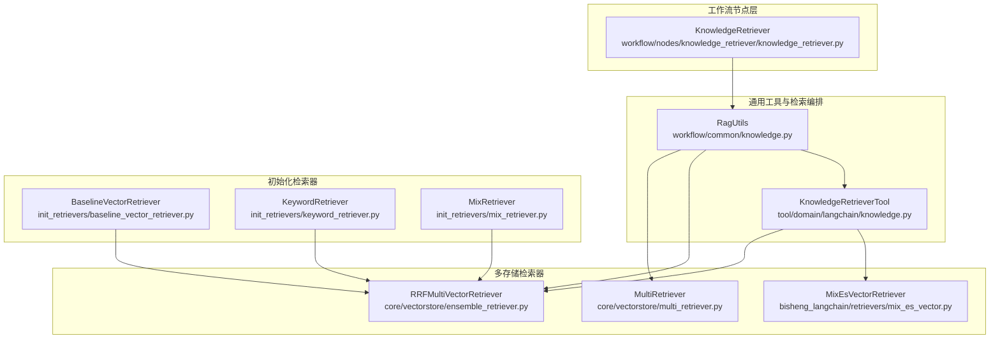
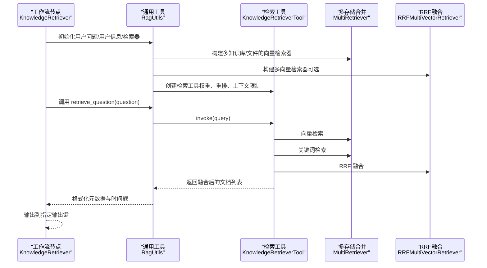
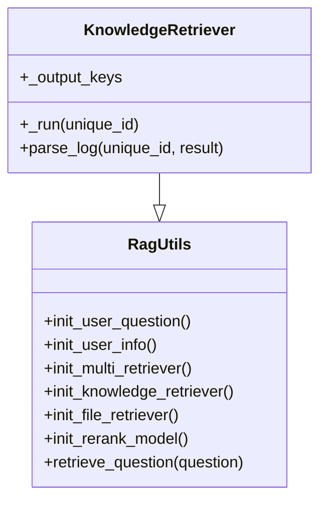
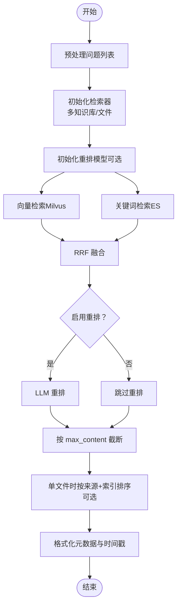
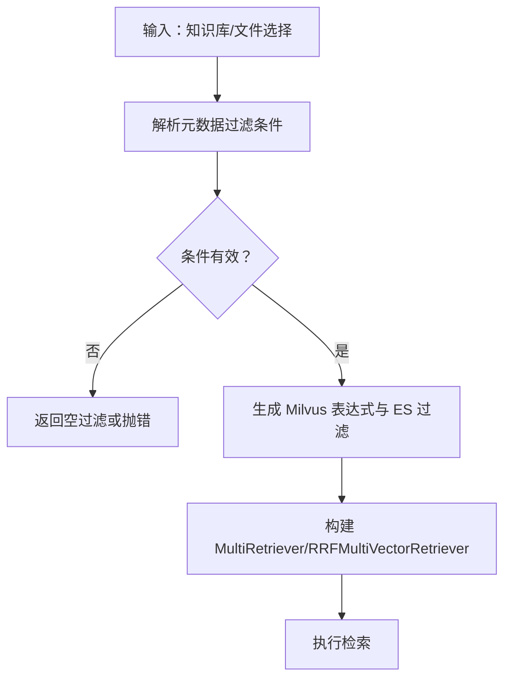
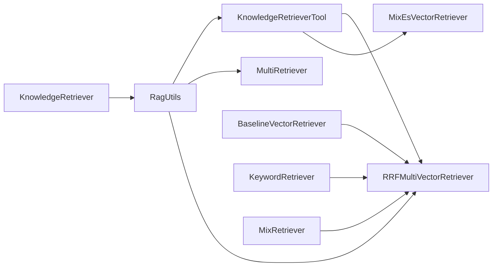

# KnowledgeRetriever 知识检索节点

<cite>
**本文引用的文件**
- [src/backend/bisheng/workflow/nodes/knowledge_retriever/knowledge_retriever.py](file://src/backend/bisheng/workflow/nodes/knowledge_retriever/knowledge_retriever.py)
- [src/backend/bisheng/workflow/common/knowledge.py](file://src/backend/bisheng/workflow/common/knowledge.py)
- [src/backend/bisheng/tool/domain/langchain/knowledge.py](file://src/backend/bisheng/tool/domain/langchain/knowledge.py)
- [src/backend/bisheng/core/vectorstore/multi_retriever.py](file://src/backend/bisheng/core/vectorstore/multi_retriever.py)
- [src/backend/bisheng/core/vectorstore/ensemble_retriever.py](file://src/backend/bisheng/core/vectorstore/ensemble_retriever.py)
- [src/backend/bisheng_langchain/retrievers/mix_es_vector.py](file://src/backend/bisheng_langchain/retrievers/mix_es_vector.py)
- [src/backend/bisheng_langchain/rag/init_retrievers/baseline_vector_retriever.py](file://src/backend/bisheng_langchain/rag/init_retrievers/baseline_vector_retriever.py)
- [src/backend/bisheng_langchain/rag/init_retrievers/keyword_retriever.py](file://src/backend/bisheng_langchain/rag/init_retrievers/keyword_retriever.py)
- [src/backend/bisheng_langchain/rag/init_retrievers/mix_retriever.py](file://src/backend/bisheng_langchain/rag/init_retrievers/mix_retriever.py)
- [src/backend/bisheng/knowledge/domain/models/knowledge_file.py](file://src/backend/bisheng/knowledge/domain/models/knowledge_file.py)
- [src/frontend/platform/src/util/flowCompatible.ts](file://src/frontend/platform/src/util/flowCompatible.ts)
</cite>

## 目录
1. [简介](#简介)
2. [项目结构](#项目结构)
3. [核心组件](#核心组件)
4. [架构总览](#架构总览)
5. [详细组件分析](#详细组件分析)
6. [依赖关系分析](#依赖关系分析)
7. [性能考量](#性能考量)
8. [故障排查指南](#故障排查指南)
9. [结论](#结论)
10. [附录](#附录)

## 简介
本文件为 Bisheng 中“知识检索节点（KnowledgeRetriever）”的深度技术文档，面向开发者与运维人员，系统阐述该节点的设计架构、实现机制与使用方法。重点覆盖：
- 向量检索、关键词匹配与混合检索策略
- 节点配置参数（知识库选择、检索模式、相似度阈值、返回数量、重排开关等）
- 执行流程（查询预处理、向量计算、排序筛选、结果组装）
- 与知识库系统的集成（连接配置、查询优化、缓存策略）
- 性能优化技巧（索引优化、查询加速、内存管理）
- 调试方法与效果评估

## 项目结构
知识检索节点位于工作流节点层，通过通用工具类完成多知识库/多存储后端的检索与融合，并由工具类封装最终的 RRF 融合与可选重排。

图表来源
- [src/backend/bisheng/workflow/nodes/knowledge_retriever/knowledge_retriever.py](file://src/backend/bisheng/workflow/nodes/knowledge_retriever/knowledge_retriever.py#L1-L60)
- [src/backend/bisheng/workflow/common/knowledge.py](file://src/backend/bisheng/workflow/common/knowledge.py#L176-L350)
- [src/backend/bisheng/tool/domain/langchain/knowledge.py](file://src/backend/bisheng/tool/domain/langchain/knowledge.py#L34-L98)
- [src/backend/bisheng/core/vectorstore/multi_retriever.py](file://src/backend/bisheng/core/vectorstore/multi_retriever.py#L10-L48)
- [src/backend/bisheng/core/vectorstore/ensemble_retriever.py](file://src/backend/bisheng/core/vectorstore/ensemble_retriever.py#L26-L139)
- [src/backend/bisheng_langchain/retrievers/mix_es_vector.py](file://src/backend/bisheng_langchain/retrievers/mix_es_vector.py#L8-L113)
- [src/backend/bisheng_langchain/rag/init_retrievers/baseline_vector_retriever.py](file://src/backend/bisheng_langchain/rag/init_retrievers/baseline_vector_retriever.py#L10-L58)
- [src/backend/bisheng_langchain/rag/init_retrievers/keyword_retriever.py](file://src/backend/bisheng_langchain/rag/init_retrievers/keyword_retriever.py#L10-L58)
- [src/backend/bisheng_langchain/rag/init_retrievers/mix_retriever.py](file://src/backend/bisheng_langchain/rag/init_retrievers/mix_retriever.py#L10-L103)

章节来源
- [src/backend/bisheng/workflow/nodes/knowledge_retriever/knowledge_retriever.py](file://src/backend/bisheng/workflow/nodes/knowledge_retriever/knowledge_retriever.py#L1-L60)
- [src/backend/bisheng/workflow/common/knowledge.py](file://src/backend/bisheng/workflow/common/knowledge.py#L176-L350)

## 核心组件
- KnowledgeRetriever（工作流节点）
  - 继承自 RagUtils，负责解析输入、初始化检索器、调用检索与结果格式化。
- RagUtils（通用工具）
  - 负责解析高级检索开关、元数据过滤、多知识库/文件检索器初始化、最终检索与结果后处理。
- KnowledgeRetrieverTool（检索工具）
  - 封装 Milvus 与 ES 的检索、RRF 融合、可选重排、最大内容长度限制与按来源+索引排序。
- MultiRetriever（多存储合并）
  - 将多个向量库检索结果合并，按分数排序并截断。
- RRFMultiVectorRetriever（RRF 多向量融合）
  - 基于 Reciprocal Rank Fusion 对多检索器结果进行重排，支持上下文长度裁剪。
- MixEsVectorRetriever（关键词与向量混合）
  - 提供关键词优先、向量优先、混排三种组合策略。
- 初始化检索器（BaselineVectorRetriever、KeywordRetriever、MixRetriever）
  - 面向不同场景的检索器初始化与文档入库/检索逻辑。

章节来源
- [src/backend/bisheng/workflow/nodes/knowledge_retriever/knowledge_retriever.py](file://src/backend/bisheng/workflow/nodes/knowledge_retriever/knowledge_retriever.py#L8-L60)
- [src/backend/bisheng/workflow/common/knowledge.py](file://src/backend/bisheng/workflow/common/knowledge.py#L176-L350)
- [src/backend/bisheng/tool/domain/langchain/knowledge.py](file://src/backend/bisheng/tool/domain/langchain/knowledge.py#L34-L98)
- [src/backend/bisheng/core/vectorstore/multi_retriever.py](file://src/backend/bisheng/core/vectorstore/multi_retriever.py#L10-L48)
- [src/backend/bisheng/core/vectorstore/ensemble_retriever.py](file://src/backend/bisheng/core/vectorstore/ensemble_retriever.py#L26-L139)
- [src/backend/bisheng_langchain/retrievers/mix_es_vector.py](file://src/backend/bisheng_langchain/retrievers/mix_es_vector.py#L8-L113)
- [src/backend/bisheng_langchain/rag/init_retrievers/baseline_vector_retriever.py](file://src/backend/bisheng_langchain/rag/init_retrievers/baseline_vector_retriever.py#L10-L58)
- [src/backend/bisheng_langchain/rag/init_retrievers/keyword_retriever.py](file://src/backend/bisheng_langchain/rag/init_retrievers/keyword_retriever.py#L10-L58)
- [src/backend/bisheng_langchain/rag/init_retrievers/mix_retriever.py](file://src/backend/bisheng_langchain/rag/init_retrievers/mix_retriever.py#L10-L103)

## 架构总览
下图展示从工作流节点到最终检索输出的关键交互：

图表来源
- [src/backend/bisheng/workflow/nodes/knowledge_retriever/knowledge_retriever.py](file://src/backend/bisheng/workflow/nodes/knowledge_retriever/knowledge_retriever.py#L13-L48)
- [src/backend/bisheng/workflow/common/knowledge.py](file://src/backend/bisheng/workflow/common/knowledge.py#L221-L250)
- [src/backend/bisheng/tool/domain/langchain/knowledge.py](file://src/backend/bisheng/tool/domain/langchain/knowledge.py#L47-L97)
- [src/backend/bisheng/core/vectorstore/multi_retriever.py](file://src/backend/bisheng/core/vectorstore/multi_retriever.py#L16-L47)
- [src/backend/bisheng/core/vectorstore/ensemble_retriever.py](file://src/backend/bisheng/core/vectorstore/ensemble_retriever.py#L64-L112)

## 详细组件分析

### KnowledgeRetriever 工作流节点
- 输入解析：从节点参数中提取用户问题与输出键映射。
- 生命周期：
  - 初始化用户问题与用户信息
  - 初始化多检索器（知识库或临时文件）
  - 对每个问题初始化重排模型（可选）
  - 调用检索并格式化输出
- 输出：按输出键组织的问答结果列表，包含文本与元数据。

图表来源
- [src/backend/bisheng/workflow/nodes/knowledge_retriever/knowledge_retriever.py](file://src/backend/bisheng/workflow/nodes/knowledge_retriever/knowledge_retriever.py#L8-L60)
- [src/backend/bisheng/workflow/common/knowledge.py](file://src/backend/bisheng/workflow/common/knowledge.py#L252-L350)

章节来源
- [src/backend/bisheng/workflow/nodes/knowledge_retriever/knowledge_retriever.py](file://src/backend/bisheng/workflow/nodes/knowledge_retriever/knowledge_retriever.py#L13-L48)

### 检索执行流程（查询预处理 → 向量/关键词检索 → RRF 融合 → 结果组装）
- 查询预处理：将多路输入问题转为字符串列表。
- 向量检索：基于 Milvus 的 similarity_search_with_score 或 as_retriever。
- 关键词检索：基于 Elasticsearch 的 similarity_search。
- RRF 融合：对向量与关键词结果进行 Reciprocal Rank Fusion。
- 可选重排：使用 LLM 重排模型对融合结果进行二次排序。
- 上下文长度限制：根据 max_content 截断，避免超长上下文。
- 结果组装：统一输出文本与元数据（含时间戳格式化与用户元数据格式化）。

图表来源
- [src/backend/bisheng/workflow/common/knowledge.py](file://src/backend/bisheng/workflow/common/knowledge.py#L221-L250)
- [src/backend/bisheng/tool/domain/langchain/knowledge.py](file://src/backend/bisheng/tool/domain/langchain/knowledge.py#L73-L97)
- [src/backend/bisheng/core/vectorstore/ensemble_retriever.py](file://src/backend/bisheng/core/vectorstore/ensemble_retriever.py#L64-L112)

章节来源
- [src/backend/bisheng/workflow/common/knowledge.py](file://src/backend/bisheng/workflow/common/knowledge.py#L221-L250)
- [src/backend/bisheng/tool/domain/langchain/knowledge.py](file://src/backend/bisheng/tool/domain/langchain/knowledge.py#L47-L97)

### 元数据过滤与知识库选择
- 元数据过滤：
  - 支持预设字段与用户自定义字段
  - 支持多种比较操作（等于、不等于、包含、前缀、后缀、空值判断、数值比较）
  - 将条件转换为 MySQL 条件与 ES 过滤
- 知识库选择：
  - 知识库模式：按知识库 ID 列表构建多向量/关键词检索器
  - 文件模式：按上传文件 ID 动态构建临时集合的 Milvus/ES 检索器

图表来源
- [src/backend/bisheng/workflow/common/knowledge.py](file://src/backend/bisheng/workflow/common/knowledge.py#L131-L174)
- [src/backend/bisheng/knowledge/domain/models/knowledge_file.py](file://src/backend/bisheng/knowledge/domain/models/knowledge_file.py#L356-L404)

章节来源
- [src/backend/bisheng/workflow/common/knowledge.py](file://src/backend/bisheng/workflow/common/knowledge.py#L131-L174)
- [src/backend/bisheng/knowledge/domain/models/knowledge_file.py](file://src/backend/bisheng/knowledge/domain/models/knowledge_file.py#L356-L404)

### 检索策略与配置参数
- 知识库选择
  - knowledge.type: "knowledge" 或 "file"
  - knowledge.value: 知识库 ID 列表或文件元数据列表
- 检索模式与权重
  - advanced_retrieval_switch.user_auth: 是否校验用户权限
  - advanced_retrieval_switch.max_chunk_size: 最大上下文长度
  - advanced_retrieval_switch.keyword_weight / vector_weight: 关键词与向量权重（用于 RRF）
  - advanced_retrieval_switch.rerank_flag / rerank_model: 是否启用重排及重排模型 ID
- 检索参数
  - k: 返回候选数
  - ef/efConstruction 等：向量检索参数
- 元数据过滤
  - metadata_filter: 条件组（conditions）、逻辑运算符（and/or）、启用开关

章节来源
- [src/backend/bisheng/workflow/common/knowledge.py](file://src/backend/bisheng/workflow/common/knowledge.py#L185-L208)
- [src/backend/bisheng/tool/domain/langchain/knowledge.py](file://src/backend/bisheng/tool/domain/langchain/knowledge.py#L42-L46)

### 与知识库系统的集成
- 连接配置
  - Milvus/ES 连接参数由知识库域服务统一管理
  - 临时文件模式下动态构造集合名并绑定默认嵌入模型
- 查询优化
  - 多检索器并发执行（异步 gather）
  - RRF 融合平滑不同检索器的排序偏差
  - 可选重排提升相关性
- 缓存策略
  - 未见显式缓存层；可通过上层缓存工具或外部缓存组件接入

章节来源
- [src/backend/bisheng/workflow/common/knowledge.py](file://src/backend/bisheng/workflow/common/knowledge.py#L276-L349)
- [src/backend/bisheng/core/vectorstore/ensemble_retriever.py](file://src/backend/bisheng/core/vectorstore/ensemble_retriever.py#L85-L112)

### 混合检索与组合策略
- MixEsVectorRetriever：关键词优先、向量优先、混排
- MixRetriever：向量与关键词分别分片后混排
- RRFMultiVectorRetriever：多向量库统一 RRF 融合

章节来源
- [src/backend/bisheng_langchain/retrievers/mix_es_vector.py](file://src/backend/bisheng_langchain/retrievers/mix_es_vector.py#L8-L113)
- [src/backend/bisheng_langchain/rag/init_retrievers/mix_retriever.py](file://src/backend/bisheng_langchain/rag/init_retrievers/mix_retriever.py#L10-L103)
- [src/backend/bisheng/core/vectorstore/ensemble_retriever.py](file://src/backend/bisheng/core/vectorstore/ensemble_retriever.py#L26-L139)

## 依赖关系分析

图表来源
- [src/backend/bisheng/workflow/nodes/knowledge_retriever/knowledge_retriever.py](file://src/backend/bisheng/workflow/nodes/knowledge_retriever/knowledge_retriever.py#L8-L11)
- [src/backend/bisheng/workflow/common/knowledge.py](file://src/backend/bisheng/workflow/common/knowledge.py#L270-L322)
- [src/backend/bisheng/tool/domain/langchain/knowledge.py](file://src/backend/bisheng/tool/domain/langchain/knowledge.py#L34-L98)
- [src/backend/bisheng/core/vectorstore/multi_retriever.py](file://src/backend/bisheng/core/vectorstore/multi_retriever.py#L10-L48)
- [src/backend/bisheng/core/vectorstore/ensemble_retriever.py](file://src/backend/bisheng/core/vectorstore/ensemble_retriever.py#L26-L62)
- [src/backend/bisheng_langchain/retrievers/mix_es_vector.py](file://src/backend/bisheng_langchain/retrievers/mix_es_vector.py#L8-L23)
- [src/backend/bisheng_langchain/rag/init_retrievers/baseline_vector_retriever.py](file://src/backend/bisheng_langchain/rag/init_retrievers/baseline_vector_retriever.py#L10-L16)
- [src/backend/bisheng_langchain/rag/init_retrievers/keyword_retriever.py](file://src/backend/bisheng_langchain/rag/init_retrievers/keyword_retriever.py#L10-L16)
- [src/backend/bisheng_langchain/rag/init_retrievers/mix_retriever.py](file://src/backend/bisheng_langchain/rag/init_retrievers/mix_retriever.py#L10-L20)

章节来源
- [src/backend/bisheng/workflow/common/knowledge.py](file://src/backend/bisheng/workflow/common/knowledge.py#L270-L322)
- [src/backend/bisheng/tool/domain/langchain/knowledge.py](file://src/backend/bisheng/tool/domain/langchain/knowledge.py#L34-L98)

## 性能考量
- 索引优化
  - 合理设置 ef/efConstruction、index_type、metric_type
  - 分片与副本策略配合查询并发
- 查询加速
  - 并发检索：多检索器异步执行
  - RRF 融合：减少无效排序开销
  - 上下文长度限制：避免超长拼接带来的 LLM 推理压力
- 内存管理
  - 控制返回候选数 k 与 max_content
  - 单文件场景下的排序仅在必要时开启
- 重排成本
  - 重排模型推理成本较高，建议按需启用并合理控制候选规模

## 故障排查指南
- 常见错误与定位
  - 无嵌入模型配置：文件模式下默认嵌入不可用会报错
  - 元数据字段不匹配：条件字段不在知识库元数据中会抛出异常
  - 过滤条件为空：可能导致 Milvus/ES 过滤为空，返回空结果
- 日志与可观测性
  - 工作流节点捕获异常并回填错误信息
  - 多检索器失败会记录日志但不影响其他检索器继续执行
- 调试建议
  - 逐步缩小问题范围：先验证 Milvus/ES 可用性，再验证检索器权重与过滤条件
  - 使用较小 k 与 max_content 快速验证流程
  - 在前端兼容层检查 metadata_filter 参数是否存在

章节来源
- [src/backend/bisheng/workflow/nodes/knowledge_retriever/knowledge_retriever.py](file://src/backend/bisheng/workflow/nodes/knowledge_retriever/knowledge_retriever.py#L43-L47)
- [src/backend/bisheng/workflow/common/knowledge.py](file://src/backend/bisheng/workflow/common/knowledge.py#L324-L349)
- [src/backend/bisheng/core/vectorstore/ensemble_retriever.py](file://src/backend/bisheng/core/vectorstore/ensemble_retriever.py#L75-L78)

## 结论
KnowledgeRetriever 通过“多知识库/文件检索器 + RRF 融合 + 可选重排”的架构，实现了高灵活性与高性能的知识检索能力。结合元数据过滤与上下文长度控制，可在不同业务场景下取得稳定的效果。建议在生产环境中配合缓存与监控体系，持续优化检索参数与重排策略。

## 附录
- 前端兼容性
  - 流程兼容脚本会自动注入 metadata_filter 参数，确保旧版本节点可用

章节来源
- [src/frontend/platform/src/util/flowCompatible.ts](file://src/frontend/platform/src/util/flowCompatible.ts#L87-L97)