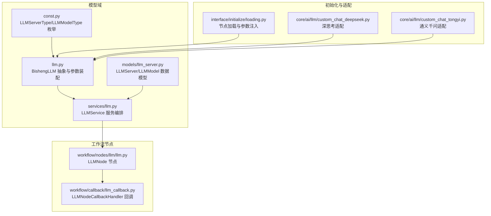
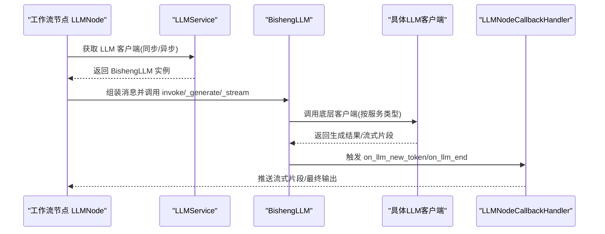
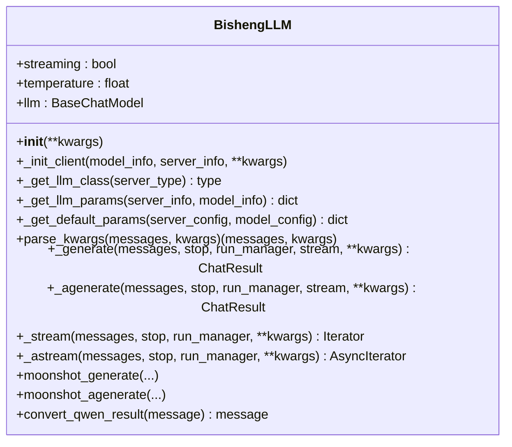
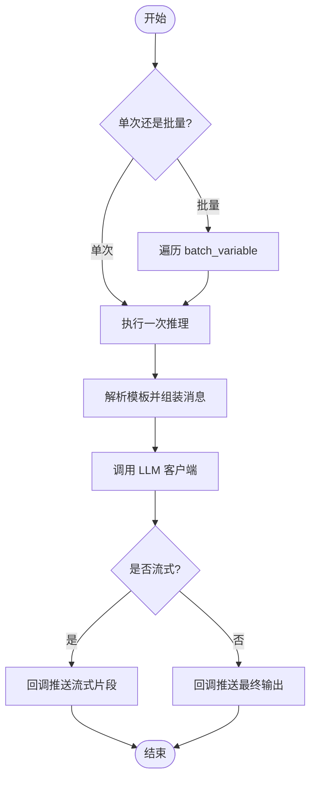
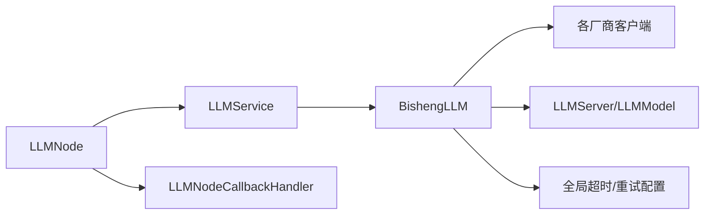

# LLM 节点

<cite>
**本文引用的文件**
- [src/backend/bisheng/llm/domain/llm/llm.py](file://src/backend/bisheng/llm/domain/llm/llm.py)
- [src/backend/bisheng/llm/domain/models/llm_server.py](file://src/backend/bisheng/llm/domain/models/llm_server.py)
- [src/backend/bisheng/llm/domain/const.py](file://src/backend/bisheng/llm/domain/const.py)
- [src/backend/bisheng/llm/domain/services/llm.py](file://src/backend/bisheng/llm/domain/services/llm.py)
- [src/backend/bisheng/workflow/nodes/llm/llm.py](file://src/backend/bisheng/workflow/nodes/llm/llm.py)
- [src/backend/bisheng/workflow/callback/llm_callback.py](file://src/backend/bisheng/workflow/callback/llm_callback.py)
- [src/backend/bisheng/interface/initialize/loading.py](file://src/backend/bisheng/interface/initialize/loading.py)
- [src/backend/bisheng/core/ai/llm/custom_chat_deepseek.py](file://src/backend/bisheng/core/ai/llm/custom_chat_deepseek.py)
- [src/backend/bisheng/core/ai/llm/custom_chat_tongyi.py](file://src/backend/bisheng/core/ai/llm/custom_chat_tongyi.py)
- [src/backend/bisheng/utils/constants.py](file://src/backend/bisheng/utils/constants.py)
</cite>

## 目录
1. [引言](#引言)
2. [项目结构](#项目结构)
3. [核心组件](#核心组件)
4. [架构总览](#架构总览)
5. [详细组件分析](#详细组件分析)
6. [依赖分析](#依赖分析)
7. [性能考虑](#性能考虑)
8. [故障排查指南](#故障排查指南)
9. [结论](#结论)
10. [附录](#附录)

## 引言
本文件面向开发者与运维人员，系统性阐述 Bisheng 中“LLM 节点”的设计与实现，覆盖以下主题：
- 大语言模型集成：统一抽象与多厂商适配（含本地推理框架与官方 API）。
- 配置管理：服务端与模型配置、在线状态、默认模型策略。
- 推理执行：同步/异步生成、流式输出、工具调用、多模态消息转换。
- 执行流程：输入预处理、模型调用、输出后处理、回调与事件分发。
- 流式响应与批量处理：节点级单次与批量变量执行、流式增量输出。
- 错误重试与健壮性：请求超时与重试配置注入、异常处理与日志。
- 性能优化：模型缓存、批处理优化、内存与连接池管理建议。
- 调试技巧与最佳实践：参数优先级、回调链路、工具使用注意事项。

## 项目结构
围绕 LLM 节点的关键目录与文件如下：
- 模型域与服务层：LLM 抽象、服务编排、模型/服务配置持久化。
- 工作流节点层：LLM 节点封装、提示词模板解析、回调与事件输出。
- 初始化与加载：节点实例化、参数注入（超时、重试）、兼容性处理。
- 自定义适配器：针对特定厂商（如深思考、通义千问）的定制实现。

图表来源
- [src/backend/bisheng/llm/domain/llm/llm.py](file://src/backend/bisheng/llm/domain/llm/llm.py#L181-L459)
- [src/backend/bisheng/llm/domain/models/llm_server.py](file://src/backend/bisheng/llm/domain/models/llm_server.py#L43-L309)
- [src/backend/bisheng/llm/domain/const.py](file://src/backend/bisheng/llm/domain/const.py#L6-L41)
- [src/backend/bisheng/llm/domain/services/llm.py](file://src/backend/bisheng/llm/domain/services/llm.py#L440-L447)
- [src/backend/bisheng/workflow/nodes/llm/llm.py](file://src/backend/bisheng/workflow/nodes/llm/llm.py#L14-L135)
- [src/backend/bisheng/workflow/callback/llm_callback.py](file://src/backend/bisheng/workflow/callback/llm_callback.py#L10-L130)
- [src/backend/bisheng/interface/initialize/loading.py](file://src/backend/bisheng/interface/initialize/loading.py#L267-L291)
- [src/backend/bisheng/core/ai/llm/custom_chat_deepseek.py](file://src/backend/bisheng/core/ai/llm/custom_chat_deepseek.py)
- [src/backend/bisheng/core/ai/llm/custom_chat_tongyi.py](file://src/backend/bisheng/core/ai/llm/custom_chat_tongyi.py)

章节来源
- [src/backend/bisheng/llm/domain/llm/llm.py](file://src/backend/bisheng/llm/domain/llm/llm.py#L1-L459)
- [src/backend/bisheng/llm/domain/models/llm_server.py](file://src/backend/bisheng/llm/domain/models/llm_server.py#L1-L309)
- [src/backend/bisheng/llm/domain/const.py](file://src/backend/bisheng/llm/domain/const.py#L1-L41)
- [src/backend/bisheng/llm/domain/services/llm.py](file://src/backend/bisheng/llm/domain/services/llm.py#L1-L710)
- [src/backend/bisheng/workflow/nodes/llm/llm.py](file://src/backend/bisheng/workflow/nodes/llm/llm.py#L1-L135)
- [src/backend/bisheng/workflow/callback/llm_callback.py](file://src/backend/bisheng/workflow/callback/llm_callback.py#L1-L130)
- [src/backend/bisheng/interface/initialize/loading.py](file://src/backend/bisheng/interface/initialize/loading.py#L267-L291)

## 核心组件
- BishengLLM：统一的 LLM 抽象与客户端工厂，负责根据服务类型选择具体实现、装配参数、执行生成与流式输出，并对特殊模型（如通义、月之暗面）做结果转换与工具调用循环。
- LLMService：服务编排入口，提供同步/异步获取 LLM 客户端、测试模型可用性、设置默认模型、知识库/助手/评估等场景下的模型绑定。
- LLMNode：工作流中的 LLM 节点，负责解析系统/用户提示词模板、拼装消息、触发回调、支持单次与批量变量执行。
- LLMNodeCallbackHandler：LangChain 回调处理器，负责流式增量输出、工具调用事件、结束事件与推理内容透传。
- LLMServer/LLMModel：模型与服务提供方的数据模型，包含类型、配置、在线状态、限制等。
- LLMServerType/LLMModelType：枚举定义支持的服务类型与模型类型。
- 初始化与参数注入：在节点加载阶段注入请求超时与重试次数等全局配置。

章节来源
- [src/backend/bisheng/llm/domain/llm/llm.py](file://src/backend/bisheng/llm/domain/llm/llm.py#L181-L459)
- [src/backend/bisheng/llm/domain/services/llm.py](file://src/backend/bisheng/llm/domain/services/llm.py#L440-L447)
- [src/backend/bisheng/workflow/nodes/llm/llm.py](file://src/backend/bisheng/workflow/nodes/llm/llm.py#L14-L135)
- [src/backend/bisheng/workflow/callback/llm_callback.py](file://src/backend/bisheng/workflow/callback/llm_callback.py#L10-L130)
- [src/backend/bisheng/llm/domain/models/llm_server.py](file://src/backend/bisheng/llm/domain/models/llm_server.py#L43-L309)
- [src/backend/bisheng/llm/domain/const.py](file://src/backend/bisheng/llm/domain/const.py#L6-L41)
- [src/backend/bisheng/interface/initialize/loading.py](file://src/backend/bisheng/interface/initialize/loading.py#L267-L291)

## 架构总览
下图展示从工作流节点到 LLM 抽象、再到具体客户端的调用链路，以及流式输出与回调事件的传播路径。

图表来源
- [src/backend/bisheng/workflow/nodes/llm/llm.py](file://src/backend/bisheng/workflow/nodes/llm/llm.py#L39-L134)
- [src/backend/bisheng/llm/domain/services/llm.py](file://src/backend/bisheng/llm/domain/services/llm.py#L440-L447)
- [src/backend/bisheng/llm/domain/llm/llm.py](file://src/backend/bisheng/llm/domain/llm/llm.py#L332-L459)
- [src/backend/bisheng/workflow/callback/llm_callback.py](file://src/backend/bisheng/workflow/callback/llm_callback.py#L80-L130)

## 详细组件分析

### BishengLLM：统一 LLM 抽象与参数装配
- 参数优先级与默认值
  - 最高优先级：构造时传入的 streaming/temperature 等参数。
  - 其次：模型高级配置中的 user_kwargs；若未显式设置 streaming，则默认启用。
  - 最低优先级：模型配置中的 max_tokens。
- 服务类型到客户端映射
  - 通过 _llm_node_type 将 LLMServerType 映射到具体客户端类与参数处理器，覆盖本地推理（Ollama/Xinference/LlamaCPP/vLLM）与官方 API（OpenAI/Azure/Qwen/Minimax/Anthropic/DeepSeek/Spark/Tencent/Moonshot/VolcEngine/Silicon/MindIE）。
- 特殊模型处理
  - 通义千问：将多模态内容合并为文本；支持增量输出。
  - 月之暗面：工具调用循环，直到 finish_reason 不再是 tool_calls。
  - Minimax/WebSearch：自动注入工具列表以启用网络搜索。
- 同步/异步生成与流式输出
  - _generate/_agenerate：委托底层客户端生成，必要时进行结果转换。
  - _stream/_astream：逐片产出流式片段，必要时进行内容转换。
- 错误处理
  - 初始化失败抛出统一异常；运行期异常由上层捕获与记录。

图表来源
- [src/backend/bisheng/llm/domain/llm/llm.py](file://src/backend/bisheng/llm/domain/llm/llm.py#L181-L459)

章节来源
- [src/backend/bisheng/llm/domain/llm/llm.py](file://src/backend/bisheng/llm/domain/llm/llm.py#L35-L178)
- [src/backend/bisheng/llm/domain/llm/llm.py](file://src/backend/bisheng/llm/domain/llm/llm.py#L208-L234)
- [src/backend/bisheng/llm/domain/llm/llm.py](file://src/backend/bisheng/llm/domain/llm/llm.py#L332-L459)

### LLMService：服务编排与默认模型策略
- 提供同步/异步获取 LLM 客户端的方法，贯穿不同应用上下文（工作流、知识库、助手、评估、Linsight 等）。
- 测试模型可用性：对新增或更新的模型尝试调用以检测状态，失败则标记为异常。
- 默认模型设置：首次添加某类型模型时，将其设为默认；并为知识库、评估、助手等模块设置默认模型。
- 知识库/助手/评估/工作台模型配置：集中管理与持久化。

章节来源
- [src/backend/bisheng/llm/domain/services/llm.py](file://src/backend/bisheng/llm/domain/services/llm.py#L440-L447)
- [src/backend/bisheng/llm/domain/services/llm.py](file://src/backend/bisheng/llm/domain/services/llm.py#L154-L184)
- [src/backend/bisheng/llm/domain/services/llm.py](file://src/backend/bisheng/llm/domain/services/llm.py#L186-L241)

### LLMNode：工作流节点与批量执行
- 单次与批量模式
  - 单次：直接执行一次推理。
  - 批量：遍历 batch_variable 列表，逐个替换占位变量并执行，收集输出与日志。
- 提示词模板解析
  - 使用 PromptTemplateParser 提取与格式化 system_prompt 与 user_prompt，支持变量映射。
- 消息组装与回调
  - 组装 SystemMessage 与 HumanMessage（支持图片），注入 LLMNodeCallbackHandler，触发流式输出与工具事件。
- 输出控制
  - 可选将结果写入图状态供用户查看。

图表来源
- [src/backend/bisheng/workflow/nodes/llm/llm.py](file://src/backend/bisheng/workflow/nodes/llm/llm.py#L46-L134)

章节来源
- [src/backend/bisheng/workflow/nodes/llm/llm.py](file://src/backend/bisheng/workflow/nodes/llm/llm.py#L14-L135)

### LLMNodeCallbackHandler：流式输出与工具事件
- on_llm_new_token：累计输出长度，向回调管理器推送流式片段，同时透传 reasoning_content。
- on_llm_end：在非取消情况下，补齐最终输出；若发生流式，发送流式结束事件。
- 工具事件：on_tool_start/on_tool_end/on_tool_error 记录工具调用生命周期，SQL Agent 场景可临时关闭输出。

章节来源
- [src/backend/bisheng/workflow/callback/llm_callback.py](file://src/backend/bisheng/workflow/callback/llm_callback.py#L10-L130)

### 参数配置与优先级
- 参数来源与优先级
  - 构造时传入（最高）→ 模型高级配置（user_kwargs）→ 模型默认配置（max_tokens/temperature/streaming）。
- 常用参数
  - 模型选择：model_name 来自模型配置。
  - 温度：temperature。
  - 最大令牌数：max_tokens。
  - 流式输出：streaming（默认开启）。
  - 供应商特有参数：如 Qwen 的 enable_web_search、model_kwargs；Minimax 的 base_url 与 /chat/completions 路径修正。
- 全局超时与重试
  - 在节点加载阶段从数据库配置中读取 request_timeout 与 max_retries 并注入到 LLM 客户端属性。

章节来源
- [src/backend/bisheng/llm/domain/llm/llm.py](file://src/backend/bisheng/llm/domain/llm/llm.py#L251-L271)
- [src/backend/bisheng/llm/domain/llm/llm.py](file://src/backend/bisheng/llm/domain/llm/llm.py#L36-L178)
- [src/backend/bisheng/interface/initialize/loading.py](file://src/backend/bisheng/interface/initialize/loading.py#L281-L289)

### 执行流程详解
- 输入预处理
  - 解析模板变量，组装 SystemMessage/HumanMessage；对 Minimax/Moonshot/WebSearch 进行工具注入；对通义多模态内容进行文本化。
- 模型调用
  - 根据服务类型选择客户端，调用 _generate/_agenerate 或 _stream/_astream。
- 输出后处理
  - 对通义结果进行内容归一化；在流式结束后补发最终输出；透传 reasoning_content。
- 回调与事件
  - 通过 LLMNodeCallbackHandler 将增量输出与结束事件推送到工作流回调管理器。

章节来源
- [src/backend/bisheng/llm/domain/llm/llm.py](file://src/backend/bisheng/llm/domain/llm/llm.py#L277-L331)
- [src/backend/bisheng/llm/domain/llm/llm.py](file://src/backend/bisheng/llm/domain/llm/llm.py#L332-L459)
- [src/backend/bisheng/workflow/callback/llm_callback.py](file://src/backend/bisheng/workflow/callback/llm_callback.py#L80-L130)

### 流式响应与批量处理
- 流式响应
  - LLM 客户端返回流式片段时，回调处理器逐段推送；结束时发送流式结束事件。
- 批量处理
  - LLMNode 支持批量变量执行，逐条替换并执行，汇总输出与日志。

章节来源
- [src/backend/bisheng/workflow/nodes/llm/llm.py](file://src/backend/bisheng/workflow/nodes/llm/llm.py#L53-L66)
- [src/backend/bisheng/workflow/callback/llm_callback.py](file://src/backend/bisheng/workflow/callback/llm_callback.py#L80-L130)

### 错误重试机制与健壮性
- 请求超时与重试
  - 从配置中心读取 request_timeout 与 max_retries 注入到 LLM 客户端属性，提升外部调用稳定性。
- 异常处理
  - 初始化失败抛出统一异常；运行期异常交由上层捕获与记录；测试模型可用性时捕获并标记异常状态。

章节来源
- [src/backend/bisheng/interface/initialize/loading.py](file://src/backend/bisheng/interface/initialize/loading.py#L281-L289)
- [src/backend/bisheng/llm/domain/services/llm.py](file://src/backend/bisheng/llm/domain/services/llm.py#L111-L116)
- [src/backend/bisheng/llm/domain/llm/llm.py](file://src/backend/bisheng/llm/domain/llm/llm.py#L229-L233)

## 依赖分析
- 组件耦合
  - LLMNode 依赖 LLMService 获取 BishengLLM 实例；BishengLLM 依赖 LLMServerType 映射到具体客户端；回调处理器依赖 LangChain 回调接口。
- 外部依赖
  - 多厂商 LLM 客户端（OpenAI/Azure/Qwen/Minimax/Anthropic/DeepSeek/Spark/Tencent/Moonshot/VolcEngine/Silicon/MindIE）。
  - 数据库与配置中心（LLMServer/LLMModel、全局请求超时与重试配置）。
- 潜在循环依赖
  - 通过延迟导入与服务编排避免节点与客户端之间的直接循环依赖。

图表来源
- [src/backend/bisheng/workflow/nodes/llm/llm.py](file://src/backend/bisheng/workflow/nodes/llm/llm.py#L39-L44)
- [src/backend/bisheng/llm/domain/services/llm.py](file://src/backend/bisheng/llm/domain/services/llm.py#L440-L447)
- [src/backend/bisheng/llm/domain/llm/llm.py](file://src/backend/bisheng/llm/domain/llm/llm.py#L156-L178)
- [src/backend/bisheng/workflow/callback/llm_callback.py](file://src/backend/bisheng/workflow/callback/llm_callback.py#L10-L36)
- [src/backend/bisheng/llm/domain/models/llm_server.py](file://src/backend/bisheng/llm/domain/models/llm_server.py#L43-L54)
- [src/backend/bisheng/interface/initialize/loading.py](file://src/backend/bisheng/interface/initialize/loading.py#L281-L289)

## 性能考虑
- 模型缓存
  - 通过 LLMService 的默认模型策略减少重复初始化开销；结合应用上下文（工作流/知识库/助手）复用客户端实例。
- 批处理优化
  - 批量执行时尽量合并相似请求，减少客户端初始化与网络往返；合理设置 max_tokens 与温度以平衡质量与速度。
- 内存与连接管理
  - 控制流式输出的缓冲区大小，避免长时间占用内存；对外部 API 调用使用连接池与合理的超时设置。
- 日志与可观测性
  - 利用回调处理器记录推理内容与工具调用，便于定位性能瓶颈与异常。

## 故障排查指南
- 常见问题
  - 模型未上线或配置缺失：检查 LLMServer/LLMModel 的 online 与 config 字段。
  - 参数冲突：确认构造参数、模型高级配置与默认配置的优先级顺序。
  - 流式输出为空：确认 streaming 开启且客户端支持；检查回调处理器是否被禁用。
  - 工具调用循环未结束：月之暗面模型会持续工具调用直至 finish_reason 非 tool_calls。
- 调试步骤
  - 启用详细日志，观察初始化与生成过程。
  - 使用 LLMService 的测试方法验证模型可用性。
  - 逐步缩小问题范围：先验证单次调用，再验证批量执行。

章节来源
- [src/backend/bisheng/llm/domain/llm/llm.py](file://src/backend/bisheng/llm/domain/llm/llm.py#L213-L221)
- [src/backend/bisheng/llm/domain/services/llm.py](file://src/backend/bisheng/llm/domain/services/llm.py#L154-L184)
- [src/backend/bisheng/workflow/callback/llm_callback.py](file://src/backend/bisheng/workflow/callback/llm_callback.py#L80-L130)

## 结论
Bisheng 的 LLM 节点通过统一抽象与多厂商适配，实现了灵活的模型集成与稳定的推理执行。借助服务编排、回调链路与参数优先级策略，开发者可以在不同场景下快速配置与部署 LLM 能力，并通过流式输出与批量处理满足交互与吞吐需求。配合性能优化与完善的错误处理，可在生产环境中获得可靠的体验。

## 附录
- 支持的模型类型与厂商
  - 本地推理：Ollama、Xinference、LlamaCPP、vLLM。
  - 官方 API：OpenAI、Azure OpenAI、Qwen、QianFan、Zhipu、Minimax、Anthropic、DeepSeek、Spark、Tencent、Moonshot、VolcEngine、Silicon、MindIE。
- 常用模型名称参考
  - OpenAI：gpt-3.5-turbo、gpt-4 系列等。
  - Anthropic：claude 系列。
  - 其他厂商模型名称请参考相应客户端与配置。

章节来源
- [src/backend/bisheng/llm/domain/const.py](file://src/backend/bisheng/llm/domain/const.py#L6-L26)
- [src/backend/bisheng/utils/constants.py](file://src/backend/bisheng/utils/constants.py#L3-L34)