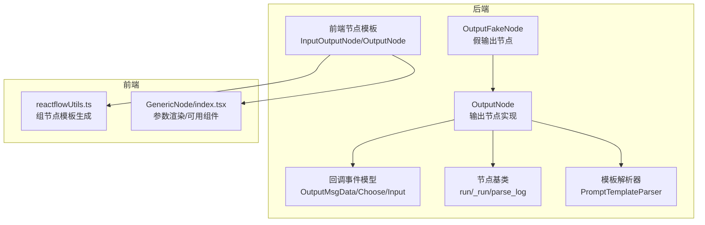
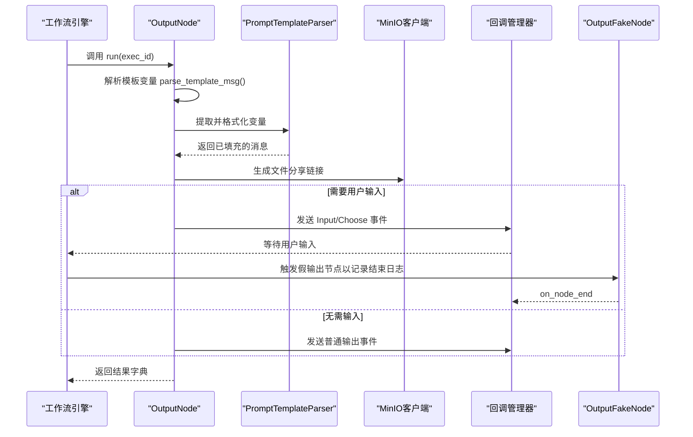
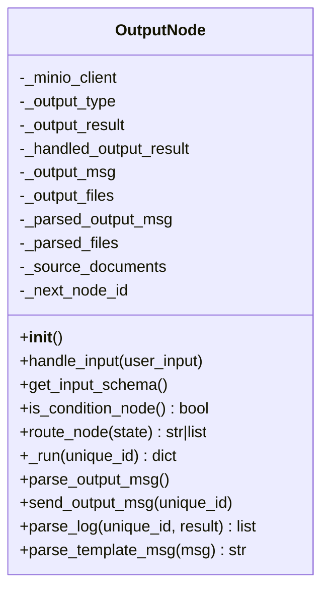
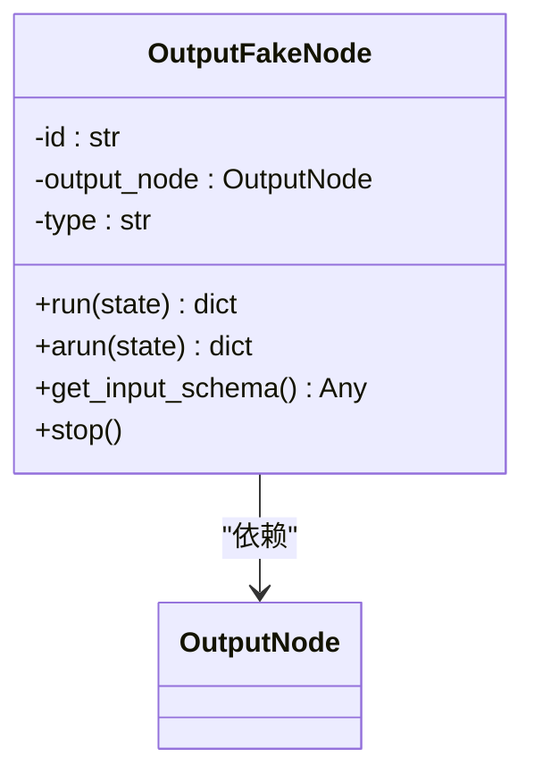
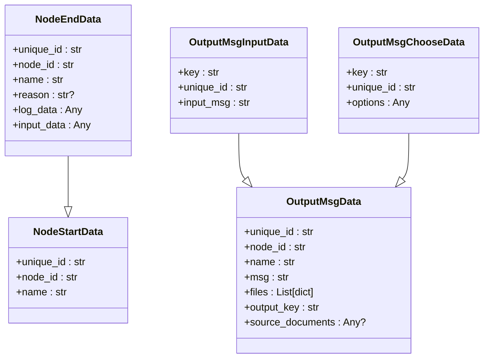
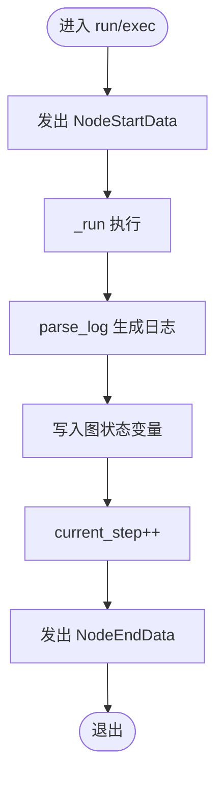
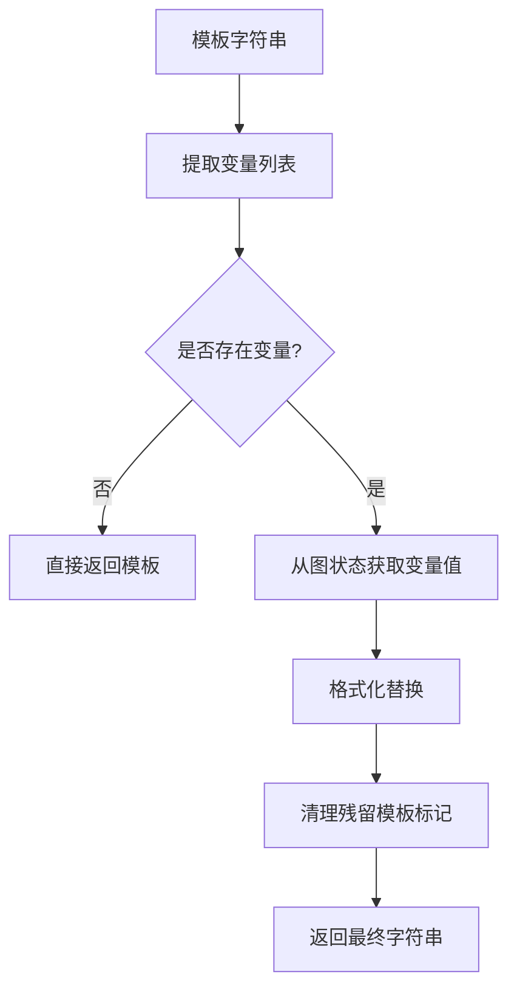
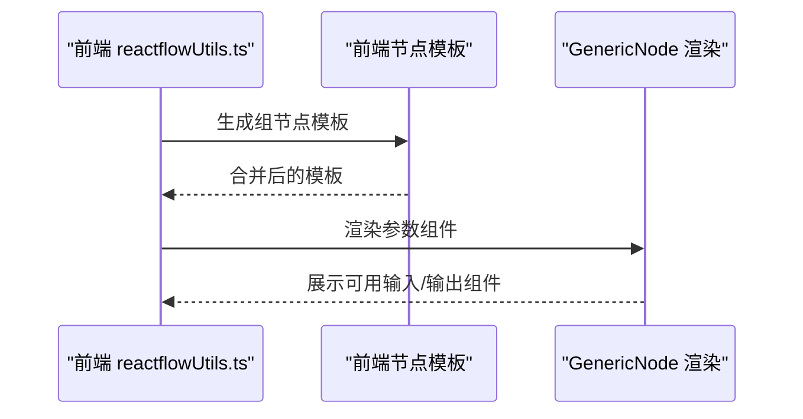
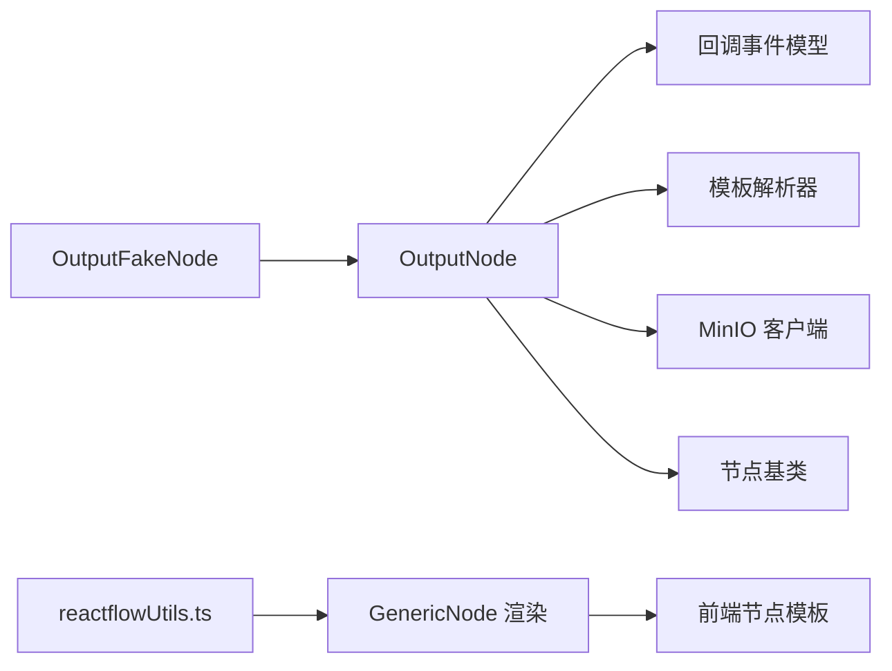
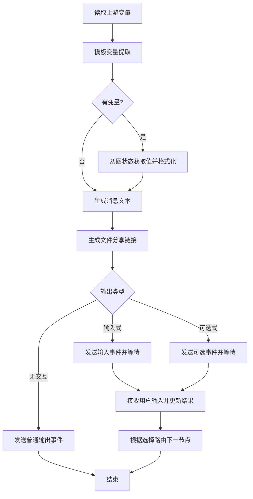

# Output 输出节点

<cite>
**本文引用的文件**
- [src/backend/bisheng/workflow/nodes/output/output.py](file://src/backend/bisheng/workflow/nodes/output/output.py)
- [src/backend/bisheng/workflow/nodes/output/output_fake.py](file://src/backend/bisheng/workflow/nodes/output/output_fake.py)
- [src/backend/bisheng/workflow/callback/event.py](file://src/backend/bisheng/workflow/callback/event.py)
- [src/backend/bisheng/workflow/nodes/base.py](file://src/backend/bisheng/workflow/nodes/base.py)
- [src/backend/bisheng/workflow/nodes/prompt_template.py](file://src/backend/bisheng/workflow/nodes/prompt_template.py)
- [src/backend/bisheng/template/frontend_node/input_output.py](file://src/backend/bisheng/template/frontend_node/input_output.py)
- [src/backend/bisheng/api/v1/chat.py](file://src/backend/bisheng/api/v1/chat.py)
- [src/backend/bisheng/graph/graph/utils.py](file://src/backend/bisheng/graph/graph/utils.py)
- [src/backend/bisheng/graph/utils.py](file://src/backend/bisheng/graph/utils.py)
- [src/frontend/platform/src/util/reactflowUtils.ts](file://src/frontend/platform/src/util/reactflowUtils.ts)
- [src/frontend/platform/src/CustomNodes/GenericNode/index.tsx](file://src/frontend/platform/src/CustomNodes/GenericNode/index.tsx)
</cite>

## 目录
1. [简介](#简介)
2. [项目结构](#项目结构)
3. [核心组件](#核心组件)
4. [架构总览](#架构总览)
5. [详细组件分析](#详细组件分析)
6. [依赖关系分析](#依赖关系分析)
7. [性能考量](#性能考量)
8. [故障排查指南](#故障排查指南)
9. [结论](#结论)
10. [附录：配置与扩展指南](#附录配置与扩展指南)

## 简介
本文件系统性地文档化 Bisheng 工作流中的“输出节点”（Output），涵盖其设计目标、实现机制、配置项、执行流程、与上下游节点的协作方式、定制化开发指南以及调试与性能优化建议。输出节点负责在工作流末尾进行结果收集、变量替换与模板渲染、文件分享链接生成、消息分发与交互式选择，并根据用户输入决定后续路由。

## 项目结构
输出节点位于后端工作流节点层，配合前端模板与回调事件系统共同完成最终输出展示与交互。关键位置如下：
- 后端节点实现：src/backend/bisheng/workflow/nodes/output/output.py
- 假输出节点（用于中断判定）：src/backend/bisheng/workflow/nodes/output/output_fake.py
- 回调事件模型：src/backend/bisheng/workflow/callback/event.py
- 节点基类与运行框架：src/backend/bisheng/workflow/nodes/base.py
- 模板变量解析器：src/backend/bisheng/workflow/nodes/prompt_template.py
- 前端模板与节点定义：src/backend/bisheng/template/frontend_node/input_output.py
- 前端节点组装与组节点生成：src/frontend/platform/src/util/reactflowUtils.ts
- 前端通用节点渲染：src/frontend/platform/src/CustomNodes/GenericNode/index.tsx
- 图模板更新工具：src/backend/bisheng/graph/graph/utils.py、src/backend/bisheng/graph/utils.py
- 输入节点与交互式输入：src/backend/bisheng/api/v1/chat.py

**图表来源**
- [src/backend/bisheng/workflow/nodes/output/output.py](file://src/backend/bisheng/workflow/nodes/output/output.py#L10-L137)
- [src/backend/bisheng/workflow/nodes/output/output_fake.py](file://src/backend/bisheng/workflow/nodes/output/output_fake.py#L7-L33)
- [src/backend/bisheng/workflow/callback/event.py](file://src/backend/bisheng/workflow/callback/event.py#L39-L72)
- [src/backend/bisheng/workflow/nodes/base.py](file://src/backend/bisheng/workflow/nodes/base.py#L200-L230)
- [src/backend/bisheng/workflow/nodes/prompt_template.py](file://src/backend/bisheng/workflow/nodes/prompt_template.py#L8-L49)
- [src/backend/bisheng/template/frontend_node/input_output.py](file://src/backend/bisheng/template/frontend_node/input_output.py#L134-L155)
- [src/frontend/platform/src/util/reactflowUtils.ts](file://src/frontend/platform/src/util/reactflowUtils.ts#L848-L879)
- [src/frontend/platform/src/CustomNodes/GenericNode/index.tsx](file://src/frontend/platform/src/CustomNodes/GenericNode/index.tsx#L168-L195)

**章节来源**
- [src/backend/bisheng/workflow/nodes/output/output.py](file://src/backend/bisheng/workflow/nodes/output/output.py#L1-L137)
- [src/backend/bisheng/template/frontend_node/input_output.py](file://src/backend/bisheng/template/frontend_node/input_output.py#L134-L155)

## 核心组件
- OutputNode：工作流末端节点，负责消息模板解析、变量注入、文件分享链接生成、消息发送与交互式输入/选择、条件路由与日志记录。
- OutputFakeNode：轻量占位节点，用于在需要用户输入时提前触发中断并正确记录输出节点结束日志。
- 回调事件模型：封装输出消息的数据结构，支持普通消息、输入式消息、可选式消息三类事件。
- 节点基类：统一的 run/arun 生命周期、日志记录、全局变量存储、停止控制。
- 模板解析器：提取并格式化模板变量，支持特殊上下文变量与嵌套节点变量引用。
- 前端模板与渲染：定义输出节点的前端模板、字段显示规则、组节点模板合并与生成。

**章节来源**
- [src/backend/bisheng/workflow/nodes/output/output.py](file://src/backend/bisheng/workflow/nodes/output/output.py#L10-L137)
- [src/backend/bisheng/workflow/nodes/output/output_fake.py](file://src/backend/bisheng/workflow/nodes/output/output_fake.py#L7-L33)
- [src/backend/bisheng/workflow/callback/event.py](file://src/backend/bisheng/workflow/callback/event.py#L39-L72)
- [src/backend/bisheng/workflow/nodes/base.py](file://src/backend/bisheng/workflow/nodes/base.py#L200-L230)
- [src/backend/bisheng/workflow/nodes/prompt_template.py](file://src/backend/bisheng/workflow/nodes/prompt_template.py#L8-L49)
- [src/backend/bisheng/template/frontend_node/input_output.py](file://src/backend/bisheng/template/frontend_node/input_output.py#L134-L155)

## 架构总览
输出节点在工作流中的职责是：
- 在节点执行前解析模板变量，从图状态中获取上游节点输出作为变量值。
- 将消息与文件列表通过回调事件发送给前端或下游节点。
- 根据交互类型（无交互/输入式/可选式）决定是否等待用户输入及如何路由到下一节点。
- 记录日志以便审计与回放。

**图表来源**
- [src/backend/bisheng/workflow/nodes/output/output.py](file://src/backend/bisheng/workflow/nodes/output/output.py#L63-L137)
- [src/backend/bisheng/workflow/nodes/output/output_fake.py](file://src/backend/bisheng/workflow/nodes/output/output_fake.py#L15-L33)
- [src/backend/bisheng/workflow/callback/event.py](file://src/backend/bisheng/workflow/callback/event.py#L39-L72)
- [src/backend/bisheng/workflow/nodes/prompt_template.py](file://src/backend/bisheng/workflow/nodes/prompt_template.py#L26-L44)

## 详细组件分析

### OutputNode 组件
- 初始化与状态
  - 保存 MinIO 客户端实例，用于生成文件分享链接。
  - 读取输出类型（无交互/输入式/可选式）、默认输出结果、原始消息与文件列表。
  - 记录源文档（用于溯源）与下一跳节点 ID 列表。
- 处理用户输入
  - 接收用户提交的 output_result，写入图状态并更新已处理结果。
- 输入模式与路由
  - get_input_schema：当输出类型为输入式或可选式时返回交互 schema。
  - is_condition_node：可选式输出节点具备条件路由能力。
  - route_node：根据用户输入选择下一节点或返回预设下一节点集合。
- 执行流程
  - _run：解析输出消息、发送输出消息、返回包含消息与结果的字典。
  - parse_output_msg：对消息模板进行变量替换；对文件列表生成分享链接。
  - send_output_msg：根据输出类型发送不同类型的回调事件。
  - parse_log：记录输出消息与可选的输出键值，便于审计。
  - parse_template_msg：提取模板变量，从图状态中获取对应节点变量值，支持知识检索节点溯源。

**图表来源**
- [src/backend/bisheng/workflow/nodes/output/output.py](file://src/backend/bisheng/workflow/nodes/output/output.py#L10-L137)

**章节来源**
- [src/backend/bisheng/workflow/nodes/output/output.py](file://src/backend/bisheng/workflow/nodes/output/output.py#L10-L137)

### OutputFakeNode 组件
- 作用：在需要用户输入的场景下，通过发送节点结束事件来标记输出节点阶段的完成，确保日志与状态正确推进。
- 行为：不执行实际逻辑，仅转发输出节点的日志信息并通过回调管理器发出结束事件。

**图表来源**
- [src/backend/bisheng/workflow/nodes/output/output_fake.py](file://src/backend/bisheng/workflow/nodes/output/output_fake.py#L7-L33)

**章节来源**
- [src/backend/bisheng/workflow/nodes/output/output_fake.py](file://src/backend/bisheng/workflow/nodes/output/output_fake.py#L7-L33)

### 回调事件模型
- OutputMsgData：普通输出消息的基础结构，包含唯一执行 ID、节点 ID、名称、消息文本、文件列表、溯源文档等。
- OutputMsgInputData：输入式输出消息，增加变量键与默认输入提示。
- OutputMsgChooseData：可选式输出消息，增加选项列表供用户选择。
- NodeStartData/NodeEndData：节点生命周期事件，用于记录开始与结束日志。
- StreamMsgData/StreamMsgOverData：流式输出相关事件（与输出节点协同）。

**图表来源**
- [src/backend/bisheng/workflow/callback/event.py](file://src/backend/bisheng/workflow/callback/event.py#L6-L72)

**章节来源**
- [src/backend/bisheng/workflow/callback/event.py](file://src/backend/bisheng/workflow/callback/event.py#L39-L72)

### 节点基类与运行框架
- run/arun：统一入口，记录开始事件、调用内部 _run、解析日志、写入全局变量、推进步骤、最终发出结束事件。
- parse_log：子类可覆盖以输出特定日志条目。
- 全局变量存储：将节点输出写入图状态，供下游节点通过模板变量引用。

**图表来源**
- [src/backend/bisheng/workflow/nodes/base.py](file://src/backend/bisheng/workflow/nodes/base.py#L200-L230)

**章节来源**
- [src/backend/bisheng/workflow/nodes/base.py](file://src/backend/bisheng/workflow/nodes/base.py#L200-L230)

### 模板变量解析器
- 支持的变量语法与规则：双花括号包裹、特殊上下文变量与节点变量引用。
- 提供提取变量、格式化替换、移除模板变量等能力，保证输出消息的动态渲染。

**图表来源**
- [src/backend/bisheng/workflow/nodes/prompt_template.py](file://src/backend/bisheng/workflow/nodes/prompt_template.py#L26-L48)

**章节来源**
- [src/backend/bisheng/workflow/nodes/prompt_template.py](file://src/backend/bisheng/workflow/nodes/prompt_template.py#L8-L49)

### 前端模板与渲染
- 前端节点模板：定义输出节点的字段、显示名、是否必填、多行文本等。
- 组节点模板生成：将工作流中的多个节点合并为一个“组节点”，并在模板中保留字段与显示规则。
- 参数渲染：根据节点模板动态渲染参数面板，区分输入/输出组件。

**图表来源**
- [src/frontend/platform/src/util/reactflowUtils.ts](file://src/frontend/platform/src/util/reactflowUtils.ts#L848-L879)
- [src/frontend/platform/src/CustomNodes/GenericNode/index.tsx](file://src/frontend/platform/src/CustomNodes/GenericNode/index.tsx#L168-L195)
- [src/backend/bisheng/template/frontend_node/input_output.py](file://src/backend/bisheng/template/frontend_node/input_output.py#L134-L155)

**章节来源**
- [src/frontend/platform/src/util/reactflowUtils.ts](file://src/frontend/platform/src/util/reactflowUtils.ts#L848-L879)
- [src/frontend/platform/src/CustomNodes/GenericNode/index.tsx](file://src/frontend/platform/src/CustomNodes/GenericNode/index.tsx#L168-L195)
- [src/backend/bisheng/template/frontend_node/input_output.py](file://src/backend/bisheng/template/frontend_node/input_output.py#L134-L155)

## 依赖关系分析
- 输出节点依赖：
  - 回调事件模型：用于发送不同类型的消息事件。
  - 模板解析器：用于变量提取与格式化。
  - MinIO 客户端：用于生成文件分享链接。
  - 节点基类：统一生命周期与日志记录。
  - 假输出节点：在需要用户输入时触发结束事件。
- 前端依赖：
  - 组节点模板生成与参数渲染：保证输出节点在复杂工作流中的可见性与可配置性。

**图表来源**
- [src/backend/bisheng/workflow/nodes/output/output.py](file://src/backend/bisheng/workflow/nodes/output/output.py#L1-L137)
- [src/backend/bisheng/workflow/nodes/output/output_fake.py](file://src/backend/bisheng/workflow/nodes/output/output_fake.py#L1-L33)
- [src/backend/bisheng/workflow/callback/event.py](file://src/backend/bisheng/workflow/callback/event.py#L1-L72)
- [src/backend/bisheng/workflow/nodes/prompt_template.py](file://src/backend/bisheng/workflow/nodes/prompt_template.py#L1-L49)
- [src/frontend/platform/src/util/reactflowUtils.ts](file://src/frontend/platform/src/util/reactflowUtils.ts#L848-L879)
- [src/frontend/platform/src/CustomNodes/GenericNode/index.tsx](file://src/frontend/platform/src/CustomNodes/GenericNode/index.tsx#L168-L195)
- [src/backend/bisheng/template/frontend_node/input_output.py](file://src/backend/bisheng/template/frontend_node/input_output.py#L134-L155)

**章节来源**
- [src/backend/bisheng/workflow/nodes/output/output.py](file://src/backend/bisheng/workflow/nodes/output/output.py#L1-L137)
- [src/backend/bisheng/workflow/nodes/output/output_fake.py](file://src/backend/bisheng/workflow/nodes/output/output_fake.py#L1-L33)
- [src/backend/bisheng/workflow/callback/event.py](file://src/backend/bisheng/workflow/callback/event.py#L1-L72)
- [src/backend/bisheng/workflow/nodes/prompt_template.py](file://src/backend/bisheng/workflow/nodes/prompt_template.py#L1-L49)
- [src/frontend/platform/src/util/reactflowUtils.ts](file://src/frontend/platform/src/util/reactflowUtils.ts#L848-L879)
- [src/frontend/platform/src/CustomNodes/GenericNode/index.tsx](file://src/frontend/platform/src/CustomNodes/GenericNode/index.tsx#L168-L195)
- [src/backend/bisheng/template/frontend_node/input_output.py](file://src/backend/bisheng/template/frontend_node/input_output.py#L134-L155)

## 性能考量
- 变量解析成本：模板变量越多、层级越深，解析与格式化开销越大。建议：
  - 控制模板变量数量与深度。
  - 对重复使用的变量进行缓存（如 MinIO 分享链接生成可在上层缓存）。
- 文件分享链接生成：网络请求与签名生成可能成为瓶颈，建议：
  - 批量生成并复用链接。
  - 使用 CDN 或本地缓存减少重复签名。
- 日志与状态写入：频繁写入图状态会带来额外 IO，建议：
  - 合并日志条目，避免冗余字段。
  - 仅在必要时写入全局变量，减少跨节点访问。

[本节为通用指导，无需具体文件引用]

## 故障排查指南
- 无法收到输出消息
  - 检查输出类型是否正确设置（无交互/输入式/可选式）。
  - 确认回调管理器是否正常发送事件。
  - 查看节点结束事件是否被假输出节点正确触发。
- 模板变量未生效
  - 确认变量命名与引用格式符合规则。
  - 检查上游节点是否已写入图状态变量。
- 文件分享链接失效
  - 检查 MinIO 客户端初始化与权限。
  - 确认文件路径与过期策略。
- 路由异常
  - 检查可选式输出的选项列表与用户选择逻辑。
  - 确认下一跳节点 ID 是否正确配置。

**章节来源**
- [src/backend/bisheng/workflow/nodes/output/output.py](file://src/backend/bisheng/workflow/nodes/output/output.py#L41-L137)
- [src/backend/bisheng/workflow/nodes/output/output_fake.py](file://src/backend/bisheng/workflow/nodes/output/output_fake.py#L15-L33)
- [src/backend/bisheng/workflow/callback/event.py](file://src/backend/bisheng/workflow/callback/event.py#L39-L72)
- [src/backend/bisheng/workflow/nodes/prompt_template.py](file://src/backend/bisheng/workflow/nodes/prompt_template.py#L26-L48)

## 结论
输出节点作为工作流的“门面”，承担了最终结果呈现、交互式输入与可选路由的关键职责。通过模板变量解析、文件分享链接生成与回调事件分发，它实现了与前端的无缝衔接。借助假输出节点与节点基类的统一生命周期管理，系统能够在需要用户输入时正确中断并记录日志。合理配置输出类型、字段映射与模板变量，可显著提升用户体验与可观测性。

[本节为总结，无需具体文件引用]

## 附录：配置与扩展指南

### 配置选项总览
- 输出类型（output_result.type）
  - 无交互：直接输出消息与结果，不等待用户输入。
  - 输入式：发送输入事件，等待用户提交 output_result。
  - 可选式：发送可选事件，根据用户选择路由到不同下一节点。
- 默认输出结果（output_result.value）
  - 作为初始值或默认占位，可在输入式模式下展示给用户。
- 输出消息模板（message/msg）
  - 支持模板变量，引用上游节点输出或特殊上下文变量。
- 文件列表（files）
  - 自动为每个文件生成分享链接，便于外部访问。
- 下一跳节点（target_edges）
  - 非可选式时的默认下一节点；可选式时由用户选择决定。

**章节来源**
- [src/backend/bisheng/workflow/nodes/output/output.py](file://src/backend/bisheng/workflow/nodes/output/output.py#L18-L39)
- [src/backend/bisheng/workflow/callback/event.py](file://src/backend/bisheng/workflow/callback/event.py#L39-L72)

### 字段映射与数据转换
- 模板变量映射
  - 使用解析器提取变量并从图状态中获取对应值。
  - 特殊节点（如知识检索）可携带溯源文档，用于审计与回溯。
- 数据转换
  - 非字符串变量会被转换为字符串后再注入模板。
  - 可选移除模板变量标记，保留纯文本。

**章节来源**
- [src/backend/bisheng/workflow/nodes/output/output.py](file://src/backend/bisheng/workflow/nodes/output/output.py#L89-L137)
- [src/backend/bisheng/workflow/nodes/prompt_template.py](file://src/backend/bisheng/workflow/nodes/prompt_template.py#L30-L48)

### 样式与展示定制
- 前端模板字段
  - 通过前端节点模板定义字段显示、必填、多行等属性。
- 组节点模板
  - 将多个节点合并为组，保持字段与显示规则一致。
- 参数渲染
  - 动态渲染可用输入/输出组件，提升可视化与易用性。

**章节来源**
- [src/backend/bisheng/template/frontend_node/input_output.py](file://src/backend/bisheng/template/frontend_node/input_output.py#L134-L155)
- [src/frontend/platform/src/util/reactflowUtils.ts](file://src/frontend/platform/src/util/reactflowUtils.ts#L848-L879)
- [src/frontend/platform/src/CustomNodes/GenericNode/index.tsx](file://src/frontend/platform/src/CustomNodes/GenericNode/index.tsx#L168-L195)

### 执行流程详解
- 结果聚合
  - 从图状态读取上游节点输出，形成变量映射。
- 格式化渲染
  - 模板解析器按规则替换变量，生成最终消息文本。
- 文件处理
  - 为文件生成分享链接，加入输出文件列表。
- 最终展示
  - 根据输出类型发送不同事件，驱动前端展示或等待用户输入。
- 条件路由
  - 可选式输出依据用户选择决定下一节点。

**图表来源**
- [src/backend/bisheng/workflow/nodes/output/output.py](file://src/backend/bisheng/workflow/nodes/output/output.py#L63-L137)
- [src/backend/bisheng/workflow/callback/event.py](file://src/backend/bisheng/workflow/callback/event.py#L39-L72)

### 与其他节点的协作
- 输入节点与交互式输入
  - 输入节点提供 schema，输出节点在需要时等待用户输入。
- 组节点与模板更新
  - 前端工具将工作流节点合并为组节点，模板更新工具保留字段显示与高级设置。
- 知识检索溯源
  - 当引用知识检索节点变量时，输出节点可携带检索结果作为溯源文档。

**章节来源**
- [src/backend/bisheng/api/v1/chat.py](file://src/backend/bisheng/api/v1/chat.py#L678-L698)
- [src/backend/bisheng/graph/graph/utils.py](file://src/backend/bisheng/graph/graph/utils.py#L115-L141)
- [src/backend/bisheng/graph/utils.py](file://src/backend/bisheng/graph/utils.py#L141-L171)
- [src/backend/bisheng/workflow/nodes/output/output.py](file://src/backend/bisheng/workflow/nodes/output/output.py#L124-L137)

### 定制化开发指南
- 自定义输出类型
  - 在前端模板中扩展输出类型字段，后端通过回调事件模型新增对应事件类型。
- 特殊处理逻辑
  - 在 parse_template_msg 中增加对特定节点 ID 的分支处理，实现差异化变量注入或溯源。
- 扩展接口
  - 通过继承节点基类，重写 _run、parse_log 等方法，实现自定义日志与路由逻辑。
- 前端集成
  - 使用组节点模板生成与参数渲染组件，确保新功能在可视化编辑器中可配置。

**章节来源**
- [src/backend/bisheng/workflow/nodes/output/output.py](file://src/backend/bisheng/workflow/nodes/output/output.py#L63-L137)
- [src/backend/bisheng/workflow/nodes/base.py](file://src/backend/bisheng/workflow/nodes/base.py#L200-L230)
- [src/backend/bisheng/template/frontend_node/input_output.py](file://src/backend/bisheng/template/frontend_node/input_output.py#L134-L155)
- [src/frontend/platform/src/util/reactflowUtils.ts](file://src/frontend/platform/src/util/reactflowUtils.ts#L848-L879)

### 调试方法与性能优化策略
- 调试
  - 关注节点开始/结束事件与日志条目，定位执行阶段。
  - 在 parse_template_msg 中打印变量映射，验证上游节点输出是否正确注入。
  - 使用假输出节点确认输出阶段结束事件是否正确发出。
- 性能优化
  - 减少模板变量数量与层级，避免深层嵌套。
  - 缓存 MinIO 分享链接与常用变量值。
  - 合并日志条目，避免冗余字段写入图状态。

**章节来源**
- [src/backend/bisheng/workflow/nodes/output/output.py](file://src/backend/bisheng/workflow/nodes/output/output.py#L73-L87)
- [src/backend/bisheng/workflow/nodes/output/output_fake.py](file://src/backend/bisheng/workflow/nodes/output/output_fake.py#L15-L33)
- [src/backend/bisheng/workflow/nodes/base.py](file://src/backend/bisheng/workflow/nodes/base.py#L200-L230)