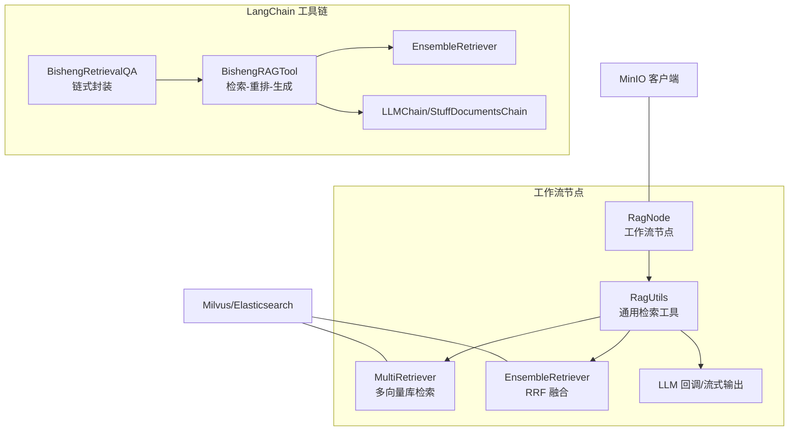
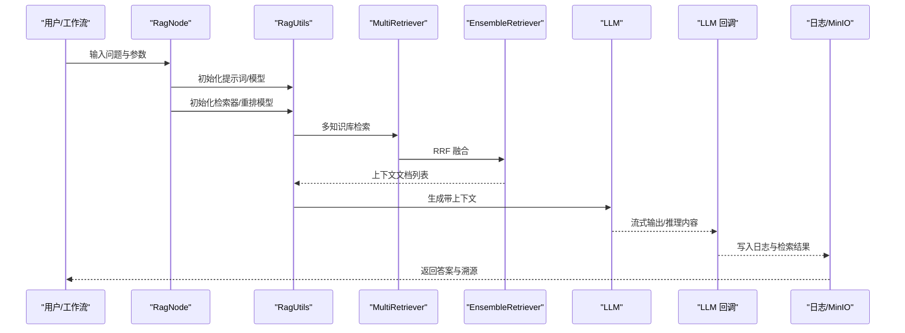
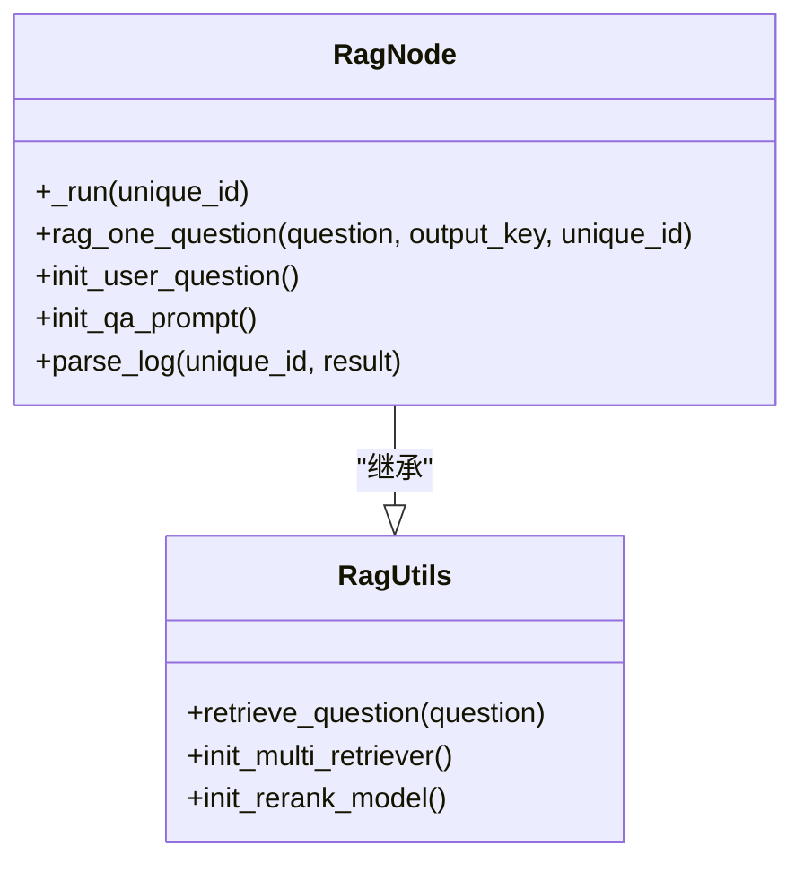
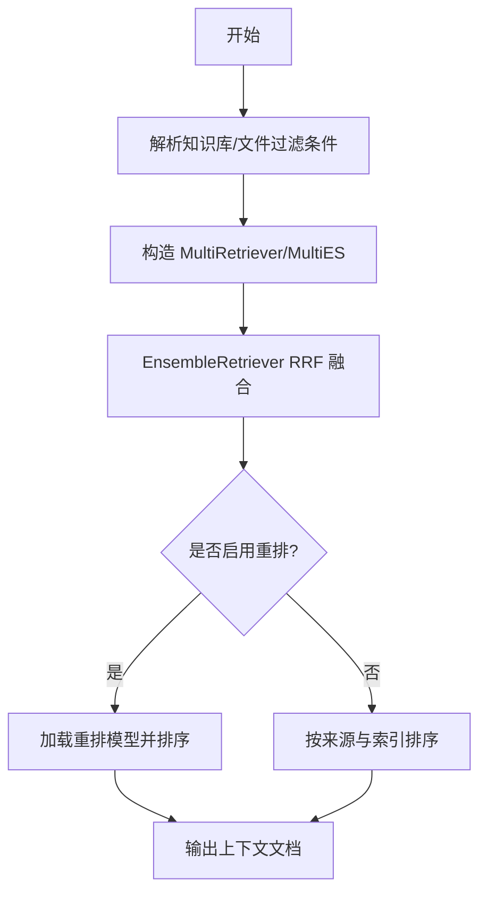
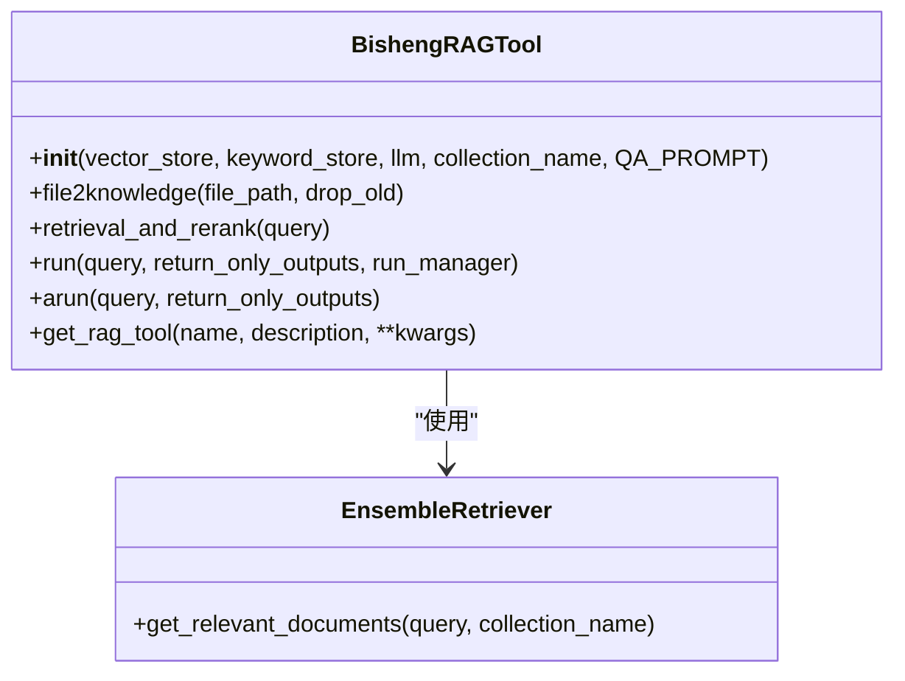
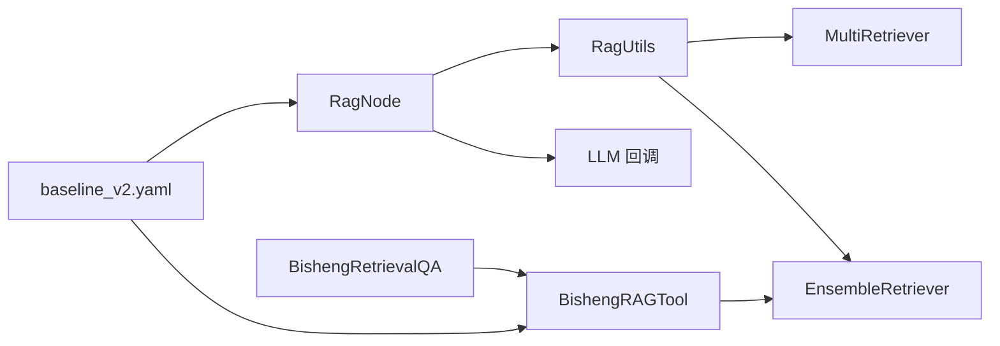
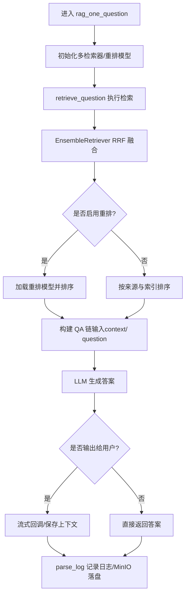

# RAG 节点

<cite>
**本文引用的文件**
- [src/backend/bisheng/workflow/nodes/rag/rag.py](file://src/backend/bisheng/workflow/nodes/rag/rag.py)
- [src/backend/bisheng/workflow/common/knowledge.py](file://src/backend/bisheng/workflow/common/knowledge.py)
- [src/backend/bisheng/common/schemas/rag_schema.py](file://src/backend/bisheng/common/schemas/rag_schema.py)
- [src/backend/bisheng_langchain/rag/bisheng_rag_chain.py](file://src/backend/bisheng_langchain/rag/bisheng_rag_chain.py)
- [src/backend/bisheng_langchain/rag/bisheng_rag_tool.py](file://src/backend/bisheng_langchain/rag/bisheng_rag_tool.py)
- [src/backend/bisheng_langchain/rag/bisheng_rag_pipeline.py](file://src/backend/bisheng_langchain/rag/bisheng_rag_pipeline.py)
- [src/backend/bisheng_langchain/rag/config/baseline_v2.yaml](file://src/backend/bisheng_langchain/rag/config/baseline_v2.yaml)
- [src/backend/bisheng_langchain/retrievers/ensemble.py](file://src/backend/bisheng_langchain/retrievers/ensemble.py)
- [src/backend/bisheng/core/vectorstore/multi_retriever.py](file://src/backend/bisheng/core/vectorstore/multi_retriever.py)
</cite>

## 目录
1. [简介](#简介)
2. [项目结构](#项目结构)
3. [核心组件](#核心组件)
4. [架构总览](#架构总览)
5. [组件详解](#组件详解)
6. [依赖关系分析](#依赖关系分析)
7. [性能考量](#性能考量)
8. [故障排查指南](#故障排查指南)
9. [结论](#结论)
10. [附录](#附录)

## 简介
本文件面向开发者与运维人员，系统化阐述 Bisheng RAG 节点的设计理念、实现架构与使用方法。RAG 节点以“检索-重排-生成”为主线，结合多源检索器（向量与关键词）、可插拔提示词模板、以及流式回调机制，实现从用户查询到最终答案的完整链路。文档覆盖：
- 检索模块：多知识库/文件检索、RRF 融合、可选重排、上下文构建
- 生成模块：提示词模板、LLM 调用、流式输出与日志记录
- 融合策略：权重融合、内容长度控制、按来源与索引排序
- 配置体系：YAML 参数、提示词类型、检索器组合、评测指标
- 执行流程：查询解析、检索、上下文裁剪、答案生成、日志落盘
- 外部集成：Milvus 向量库、Elasticsearch 关键词检索、MinIO 日志存储
- 性能优化：检索并发、上下文截断、重排开关、代理与超时
- 调试与评估：日志字段、最小化示例、评估脚本

## 项目结构
RAG 节点在后端分为两类实现路径：
- 工作流节点路径：RagNode 作为工作流节点，负责提示词拼装、多知识库检索、流式回调与日志落盘
- LangChain 工具链路径：BishengRAGTool/BishengRetrievalQA 提供可复用的检索-生成链路，支持批量处理与评测

图表来源
- [src/backend/bisheng/workflow/nodes/rag/rag.py](file://src/backend/bisheng/workflow/nodes/rag/rag.py#L22-L125)
- [src/backend/bisheng/workflow/common/knowledge.py](file://src/backend/bisheng/workflow/common/knowledge.py#L176-L350)
- [src/backend/bisheng_langchain/rag/bisheng_rag_chain.py](file://src/backend/bisheng_langchain/rag/bisheng_rag_chain.py#L46-L155)
- [src/backend/bisheng_langchain/rag/bisheng_rag_tool.py](file://src/backend/bisheng_langchain/rag/bisheng_rag_tool.py#L36-L272)
- [src/backend/bisheng_langchain/retrievers/ensemble.py](file://src/backend/bisheng_langchain/retrievers/ensemble.py#L18-L191)
- [src/backend/bisheng/core/vectorstore/multi_retriever.py](file://src/backend/bisheng/core/vectorstore/multi_retriever.py#L10-L48)

章节来源
- [src/backend/bisheng/workflow/nodes/rag/rag.py](file://src/backend/bisheng/workflow/nodes/rag/rag.py#L1-L197)
- [src/backend/bisheng/workflow/common/knowledge.py](file://src/backend/bisheng/workflow/common/knowledge.py#L176-L350)
- [src/backend/bisheng_langchain/rag/bisheng_rag_chain.py](file://src/backend/bisheng_langchain/rag/bisheng_rag_chain.py#L1-L155)
- [src/backend/bisheng_langchain/rag/bisheng_rag_tool.py](file://src/backend/bisheng_langchain/rag/bisheng_rag_tool.py#L1-L317)
- [src/backend/bisheng_langchain/retrievers/ensemble.py](file://src/backend/bisheng_langchain/retrievers/ensemble.py#L1-L191)
- [src/backend/bisheng/core/vectorstore/multi_retriever.py](file://src/backend/bisheng/core/vectorstore/multi_retriever.py#L1-L48)

## 核心组件
- RagNode：工作流节点，负责提示词模板解析、多知识库检索、流式输出与日志记录
- RagUtils：通用检索工具，封装 MultiRetriever、EnsembleRetriever、重排模型初始化与检索执行
- BishengRAGTool：LangChain 工具，统一初始化 LLM、向量/关键词检索器、提示词与 QA 链
- BishengRetrievalQA：LangChain Chain 封装，简化检索-生成调用
- EnsembleRetriever：基于加权 Reciprocal Rank Fusion 的多检索器融合
- MultiRetriever：多向量库相似度检索与合并
- baseline_v2.yaml：RAG 参数配置模板，定义嵌入、LLM、加载器、检索器、后处理与评测

章节来源
- [src/backend/bisheng/workflow/nodes/rag/rag.py](file://src/backend/bisheng/workflow/nodes/rag/rag.py#L22-L125)
- [src/backend/bisheng/workflow/common/knowledge.py](file://src/backend/bisheng/workflow/common/knowledge.py#L176-L350)
- [src/backend/bisheng_langchain/rag/bisheng_rag_chain.py](file://src/backend/bisheng_langchain/rag/bisheng_rag_chain.py#L46-L155)
- [src/backend/bisheng_langchain/rag/bisheng_rag_tool.py](file://src/backend/bisheng_langchain/rag/bisheng_rag_tool.py#L36-L272)
- [src/backend/bisheng_langchain/retrievers/ensemble.py](file://src/backend/bisheng_langchain/retrievers/ensemble.py#L18-L191)
- [src/backend/bisheng/core/vectorstore/multi_retriever.py](file://src/backend/bisheng/core/vectorstore/multi_retriever.py#L10-L48)
- [src/backend/bisheng_langchain/rag/config/baseline_v2.yaml](file://src/backend/bisheng_langchain/rag/config/baseline_v2.yaml#L1-L91)

## 架构总览
RAG 节点的执行由两条主线构成：
- 工作流节点主线：RagNode → RagUtils → 多知识库检索 → LLM 生成 → 流式回调/日志
- LangChain 工具链主线：BishengRetrievalQA → BishengRAGTool → EnsembleRetriever → LLM 生成

图表来源
- [src/backend/bisheng/workflow/nodes/rag/rag.py](file://src/backend/bisheng/workflow/nodes/rag/rag.py#L56-L125)
- [src/backend/bisheng/workflow/common/knowledge.py](file://src/backend/bisheng/workflow/common/knowledge.py#L221-L250)
- [src/backend/bisheng/core/vectorstore/multi_retriever.py](file://src/backend/bisheng/core/vectorstore/multi_retriever.py#L16-L47)
- [src/backend/bisheng_langchain/retrievers/ensemble.py](file://src/backend/bisheng_langchain/retrievers/ensemble.py#L88-L191)

## 组件详解

### 组件 A：RagNode（工作流节点）
- 角色定位：工作流中的 RAG 执行单元，负责提示词模板解析、多问题批处理、流式输出与日志落盘
- 关键职责
  - 解析系统/用户提示词模板，注入变量（问题、上下文等）
  - 初始化 LLM 与 MinIO 客户端
  - 批量处理用户问题，逐条执行检索-生成
  - 通过 LLM 回调处理器输出流式消息并记录推理内容
  - 将检索结果写入 MinIO 并返回共享链接（当结果过大时）

图表来源
- [src/backend/bisheng/workflow/nodes/rag/rag.py](file://src/backend/bisheng/workflow/nodes/rag/rag.py#L22-L125)
- [src/backend/bisheng/workflow/common/knowledge.py](file://src/backend/bisheng/workflow/common/knowledge.py#L176-L250)

章节来源
- [src/backend/bisheng/workflow/nodes/rag/rag.py](file://src/backend/bisheng/workflow/nodes/rag/rag.py#L22-L125)
- [src/backend/bisheng/workflow/common/knowledge.py](file://src/backend/bisheng/workflow/common/knowledge.py#L176-L250)

### 组件 B：RagUtils（通用检索工具）
- 角色定位：RAG 节点的检索与重排核心，屏蔽多知识库/文件差异
- 关键能力
  - 多知识库检索：按知识 ID 组合 Milvus/ES 过滤条件，构造 MultiRetriever
  - 多检索器融合：EnsembleRetriever 使用加权 RRF 融合
  - 重排模型：按需加载 rerank 模型（如启用）
  - 上下文构建：限制最大内容长度、按来源与索引排序，确保连贯性

图表来源
- [src/backend/bisheng/workflow/common/knowledge.py](file://src/backend/bisheng/workflow/common/knowledge.py#L270-L350)
- [src/backend/bisheng/core/vectorstore/multi_retriever.py](file://src/backend/bisheng/core/vectorstore/multi_retriever.py#L16-L47)
- [src/backend/bisheng_langchain/retrievers/ensemble.py](file://src/backend/bisheng_langchain/retrievers/ensemble.py#L88-L191)

章节来源
- [src/backend/bisheng/workflow/common/knowledge.py](file://src/backend/bisheng/workflow/common/knowledge.py#L176-L350)
- [src/backend/bisheng/core/vectorstore/multi_retriever.py](file://src/backend/bisheng/core/vectorstore/multi_retriever.py#L1-L48)
- [src/backend/bisheng_langchain/retrievers/ensemble.py](file://src/backend/bisheng_langchain/retrievers/ensemble.py#L1-L191)

### 组件 C：BishengRAGTool（LangChain 工具）
- 角色定位：可复用的检索-重排-生成工具，支持同步/异步调用
- 关键能力
  - 初始化 LLM、嵌入模型、Milvus、ES 关键词检索
  - 动态加载提示词模板，构建 StuffDocumentsChain
  - 检索与重排：EnsembleRetriever 召回 → 去重/截断 → 排序
  - 提供 run/arun 接口，支持返回答案或答案+上下文

图表来源
- [src/backend/bisheng_langchain/rag/bisheng_rag_tool.py](file://src/backend/bisheng_langchain/rag/bisheng_rag_tool.py#L36-L272)
- [src/backend/bisheng_langchain/retrievers/ensemble.py](file://src/backend/bisheng_langchain/retrievers/ensemble.py#L18-L191)

章节来源
- [src/backend/bisheng_langchain/rag/bisheng_rag_tool.py](file://src/backend/bisheng_langchain/rag/bisheng_rag_tool.py#L36-L272)
- [src/backend/bisheng_langchain/retrievers/ensemble.py](file://src/backend/bisheng_langchain/retrievers/ensemble.py#L1-L191)

### 组件 D：BishengRetrievalQA（LangChain Chain）
- 角色定位：对 BishengRAGTool 的链式封装，便于在 LangChain 场景中直接调用
- 关键能力
  - 支持同步/异步调用
  - 可选返回源文档
  - 默认提示词模板与中文问答规则

章节来源
- [src/backend/bisheng_langchain/rag/bisheng_rag_chain.py](file://src/backend/bisheng_langchain/rag/bisheng_rag_chain.py#L46-L155)

### 组件 E：EnsembleRetriever（多检索器融合）
- 角色定位：基于加权 Reciprocal Rank Fusion 的多检索器融合器
- 关键能力
  - 对多个检索器的结果进行去重与加权 RRF 融合
  - 支持同步/异步获取相关文档

章节来源
- [src/backend/bisheng_langchain/retrievers/ensemble.py](file://src/backend/bisheng_langchain/retrievers/ensemble.py#L18-L191)

### 组件 F：MultiRetriever（多向量库检索）
- 角色定位：聚合多个向量库的相似度检索结果
- 关键能力
  - 并发执行相似度检索
  - 合并与排序，截断至 finally_k

章节来源
- [src/backend/bisheng/core/vectorstore/multi_retriever.py](file://src/backend/bisheng/core/vectorstore/multi_retriever.py#L10-L48)

## 依赖关系分析
- RagNode 依赖 RagUtils 提供的检索与重排能力，并通过 LLM 回调实现流式输出
- RagUtils 依赖 MultiRetriever 与 EnsembleRetriever 实现多源检索与融合
- BishengRAGTool 依赖 EnsembleRetriever 与 LLMChain/StuffDocumentsChain 实现检索-生成
- BishengRetrievalQA 依赖 BishengRAGTool，提供链式封装
- baseline_v2.yaml 为上述组件提供统一的配置入口

图表来源
- [src/backend/bisheng/workflow/nodes/rag/rag.py](file://src/backend/bisheng/workflow/nodes/rag/rag.py#L22-L125)
- [src/backend/bisheng/workflow/common/knowledge.py](file://src/backend/bisheng/workflow/common/knowledge.py#L176-L350)
- [src/backend/bisheng_langchain/rag/bisheng_rag_chain.py](file://src/backend/bisheng_langchain/rag/bisheng_rag_chain.py#L46-L155)
- [src/backend/bisheng_langchain/rag/bisheng_rag_tool.py](file://src/backend/bisheng_langchain/rag/bisheng_rag_tool.py#L36-L272)
- [src/backend/bisheng_langchain/rag/config/baseline_v2.yaml](file://src/backend/bisheng_langchain/rag/config/baseline_v2.yaml#L1-L91)

章节来源
- [src/backend/bisheng/workflow/nodes/rag/rag.py](file://src/backend/bisheng/workflow/nodes/rag/rag.py#L1-L197)
- [src/backend/bisheng/workflow/common/knowledge.py](file://src/backend/bisheng/workflow/common/knowledge.py#L1-L350)
- [src/backend/bisheng_langchain/rag/bisheng_rag_chain.py](file://src/backend/bisheng_langchain/rag/bisheng_rag_chain.py#L1-L155)
- [src/backend/bisheng_langchain/rag/bisheng_rag_tool.py](file://src/backend/bisheng_langchain/rag/bisheng_rag_tool.py#L1-L317)
- [src/backend/bisheng_langchain/rag/config/baseline_v2.yaml](file://src/backend/bisheng_langchain/rag/config/baseline_v2.yaml#L1-L91)

## 性能考量
- 检索效率
  - RRF 融合权重：通过向量/关键词权重平衡召回质量与速度
  - finally_k 截断：减少下游 LLM 上下文长度与计算开销
  - 多库并发：MultiRetriever 并行相似度检索
- 生成质量
  - 提示词模板：内置中文问答模板，支持自定义
  - 上下文排序：按来源与 chunk_index 排序，提升连贯性
  - 重排开关：可选启用重排模型，进一步提升相关性
- 资源控制
  - 最大内容长度：限制上下文总长度，避免超限
  - 代理与超时：嵌入与 LLM 初始化支持代理配置
  - 日志落盘：大体量检索结果写入 MinIO 并返回链接，避免内存压力

章节来源
- [src/backend/bisheng/workflow/common/knowledge.py](file://src/backend/bisheng/workflow/common/knowledge.py#L221-L250)
- [src/backend/bisheng/core/vectorstore/multi_retriever.py](file://src/backend/bisheng/core/vectorstore/multi_retriever.py#L42-L47)
- [src/backend/bisheng_langchain/rag/bisheng_rag_tool.py](file://src/backend/bisheng_langchain/rag/bisheng_rag_tool.py#L208-L232)
- [src/backend/bisheng_langchain/rag/config/baseline_v2.yaml](file://src/backend/bisheng_langchain/rag/config/baseline_v2.yaml#L65-L81)

## 故障排查指南
- 检索异常
  - 现象：检索阶段抛出异常，返回包含错误内容的文档
  - 处理：RagNode 在异常时仍构造文档并继续生成，便于定位问题
- 重排模型
  - 现象：未启用重排或模型 ID 为空
  - 处理：RagUtils 条件初始化，避免无效调用
- 日志体积
  - 现象：检索结果过大导致日志写入失败
  - 处理：超过阈值自动转存 MinIO 并返回分享链接
- LLM 回调
  - 现象：流式输出结束事件缺失
  - 处理：RagNode 在流式结束时触发 StreamMsgOverData，确保前端渲染

章节来源
- [src/backend/bisheng/workflow/nodes/rag/rag.py](file://src/backend/bisheng/workflow/nodes/rag/rag.py#L75-L125)
- [src/backend/bisheng/workflow/common/knowledge.py](file://src/backend/bisheng/workflow/common/knowledge.py#L259-L268)
- [src/backend/bisheng/workflow/nodes/rag/rag.py](file://src/backend/bisheng/workflow/nodes/rag/rag.py#L127-L158)

## 结论
RAG 节点通过“工作流节点 + LangChain 工具链”的双轨设计，在保证易用性的同时提供了强大的扩展能力。其核心优势在于：
- 多源检索与 RRF 融合，兼顾召回广度与相关性
- 可插拔提示词与重排策略，适配不同业务场景
- 流式回调与日志落盘，兼顾用户体验与可观测性
- YAML 配置中心化，便于快速迭代与规模化部署

## 附录

### 配置项速览（来自 baseline_v2.yaml）
- 数据与评测
  - data.origin_file_path：原始文件路径
  - data.question：问题 Excel 路径
  - data.save_answer：答案保存路径
  - metric.*：评测指标配置
- 向量与关键词
  - milvus.host/port：Milvus 连接参数
  - elasticsearch.url/ssl_verify：ES 连接参数
  - embedding.type/model：嵌入模型配置
  - chat_llm.type/model/temperature：LLM 配置
- 加载器与分片
  - loader.type/unstructured_api_url：文档加载器
  - retriever.retrievers[*].splitter：文本分片策略
  - retriever.retrievers[*].retrieval：检索参数
- 后处理
  - post_retrieval.delete_duplicate：去重开关
  - post_retrieval.with_rank/rerank：重排开关与参数
  - post_retrieval.sort_by_source_and_index：排序策略
- 生成
  - generate.with_retrieval/max_content/chain_type/prompt_type：生成策略

章节来源
- [src/backend/bisheng_langchain/rag/config/baseline_v2.yaml](file://src/backend/bisheng_langchain/rag/config/baseline_v2.yaml#L1-L91)

### 提示词模板与变量
- 用户提示词变量
  - $$question$$ → 实际问题
  - $$context$$ → 检索到的上下文
  - 其他变量通过模板解析注入
- 系统提示词
  - 中文问答规则模板，强调事实性与细节性

章节来源
- [src/backend/bisheng/workflow/nodes/rag/rag.py](file://src/backend/bisheng/workflow/nodes/rag/rag.py#L167-L197)

### 执行流程（代码级）

图表来源
- [src/backend/bisheng/workflow/nodes/rag/rag.py](file://src/backend/bisheng/workflow/nodes/rag/rag.py#L75-L125)
- [src/backend/bisheng/workflow/common/knowledge.py](file://src/backend/bisheng/workflow/common/knowledge.py#L221-L250)
- [src/backend/bisheng_langchain/retrievers/ensemble.py](file://src/backend/bisheng_langchain/retrievers/ensemble.py#L88-L191)

### 外部知识库集成
- Milvus：向量检索，支持多集合与过滤表达式
- Elasticsearch：关键词检索，支持元数据过滤
- MinIO：日志与大体量检索结果的临时存储与分享

章节来源
- [src/backend/bisheng/workflow/nodes/rag/rag.py](file://src/backend/bisheng/workflow/nodes/rag/rag.py#L14-L41)
- [src/backend/bisheng/workflow/common/knowledge.py](file://src/backend/bisheng/workflow/common/knowledge.py#L311-L350)

### 调试与效果评估
- 调试
  - 查看系统/用户提示词日志
  - 检查检索结果数量与排序
  - 关注流式回调与推理内容
- 评估
  - 使用 BishengRagPipeline 的 question_answering 与 score 方法
  - 支持 Ragas 等指标，可配置列名与批大小

章节来源
- [src/backend/bisheng/workflow/nodes/rag/rag.py](file://src/backend/bisheng/workflow/nodes/rag/rag.py#L127-L158)
- [src/backend/bisheng_langchain/rag/bisheng_rag_pipeline.py](file://src/backend/bisheng_langchain/rag/bisheng_rag_pipeline.py#L226-L303)