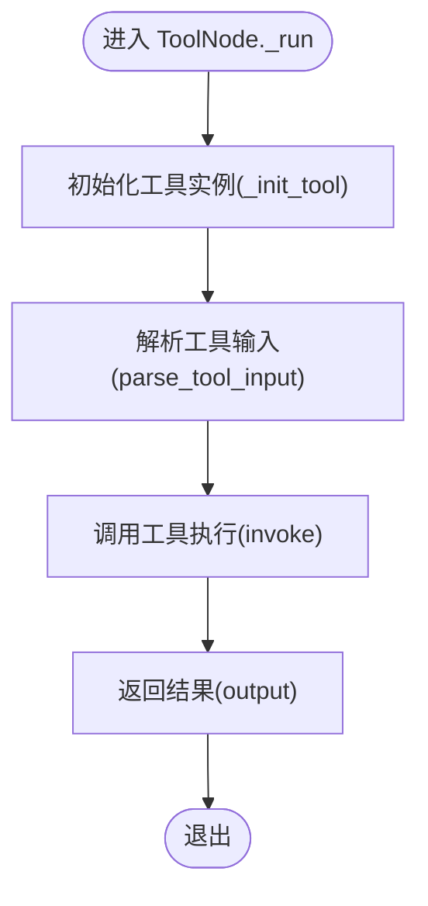

# Tool 工具节点

<cite>
**本文引用的文件**
- [src/backend/bisheng/workflow/nodes/tool/tool.py](file://src/backend/bisheng/workflow/nodes/tool/tool.py)
- [src/backend/bisheng/tool/domain/services/executor.py](file://src/backend/bisheng/tool/domain/services/executor.py)
- [src/backend/bisheng/tool/domain/models/gpts_tools.py](file://src/backend/bisheng/tool/domain/models/gpts_tools.py)
- [src/backend/bisheng/tool/api/tool.py](file://src/backend/bisheng/tool/api/tool.py)
- [src/backend/bisheng/tool/domain/services/tool.py](file://src/backend/bisheng/tool/domain/services/tool.py)
- [src/backend/bisheng/workflow/nodes/base.py](file://src/backend/bisheng/workflow/nodes/base.py)
- [src/backend/bisheng/tool/domain/const.py](file://src/backend/bisheng/tool/domain/const.py)
- [src/backend/bisheng/default_node.yaml](file://src/backend/bisheng/default_node.yaml)
</cite>

## 目录
1. [简介](#简介)
2. [项目结构](#项目结构)
3. [核心组件](#核心组件)
4. [架构总览](#架构总览)
5. [详细组件分析](#详细组件分析)
6. [依赖关系分析](#依赖关系分析)
7. [性能考量](#性能考量)
8. [故障排查指南](#故障排查指南)
9. [结论](#结论)
10. [附录](#附录)

## 简介
本文件系统性阐述 Bisheng 的 Tool 工具节点设计与实现，覆盖工具注册、调用机制、结果处理、配置方式（工具选择、参数传递、权限控制、安全检查）、执行流程（工具查找、参数验证、调用执行、结果解析）、与外部工具系统的集成（API 调用、SDK 使用、错误处理），并提供扩展开发指南与调试、性能优化建议。

## 项目结构
围绕 Tool 工具节点的关键后端模块分布如下：
- 工作流节点层：ToolNode 实现具体节点行为，负责参数解析、模板变量注入、调用 ToolExecutor 执行工具。
- 工具域服务层：ToolExecutor 提供工具实例化、初始化、调用包装与遥测记录。
- 工具数据模型层：GptsTools/GptsToolsType 及 DAO 提供工具与工具类别的持久化与查询。
- 工具服务 API 层：提供工具列表、新增/更新/删除工具类别、Schema 解析、测试工具、MCP 刷新等接口。
- 基类节点：BaseNode 定义通用节点生命周期、参数处理、日志格式化、变量注入等能力。

图表来源
- [src/backend/bisheng/workflow/nodes/tool/tool.py](file://src/backend/bisheng/workflow/nodes/tool/tool.py#L1-L73)
- [src/backend/bisheng/workflow/nodes/base.py](file://src/backend/bisheng/workflow/nodes/base.py#L1-L200)
- [src/backend/bisheng/tool/domain/services/executor.py](file://src/backend/bisheng/tool/domain/services/executor.py#L1-L305)
- [src/backend/bisheng/tool/domain/services/tool.py](file://src/backend/bisheng/tool/domain/services/tool.py#L1-L515)
- [src/backend/bisheng/tool/domain/models/gpts_tools.py](file://src/backend/bisheng/tool/domain/models/gpts_tools.py#L1-L463)
- [src/backend/bisheng/tool/api/tool.py](file://src/backend/bisheng/tool/api/tool.py#L1-L132)
- [src/backend/bisheng/tool/domain/const.py](file://src/backend/bisheng/tool/domain/const.py#L1-L19)
- [src/backend/bisheng/default_node.yaml](file://src/backend/bisheng/default_node.yaml#L278-L337)

章节来源
- [src/backend/bisheng/workflow/nodes/tool/tool.py](file://src/backend/bisheng/workflow/nodes/tool/tool.py#L1-L73)
- [src/backend/bisheng/workflow/nodes/base.py](file://src/backend/bisheng/workflow/nodes/base.py#L1-L200)
- [src/backend/bisheng/tool/domain/services/executor.py](file://src/backend/bisheng/tool/domain/services/executor.py#L1-L305)
- [src/backend/bisheng/tool/domain/services/tool.py](file://src/backend/bisheng/tool/domain/services/tool.py#L1-L515)
- [src/backend/bisheng/tool/domain/models/gpts_tools.py](file://src/backend/bisheng/tool/domain/models/gpts_tools.py#L1-L463)
- [src/backend/bisheng/tool/api/tool.py](file://src/backend/bisheng/tool/api/tool.py#L1-L132)
- [src/backend/bisheng/tool/domain/const.py](file://src/backend/bisheng/tool/domain/const.py#L1-L19)
- [src/backend/bisheng/default_node.yaml](file://src/backend/bisheng/default_node.yaml#L278-L337)

## 核心组件
- ToolNode：工作流中的具体工具节点，负责从节点参数中解析输入、注入模板变量、调用 ToolExecutor 执行工具并返回输出。
- ToolExecutor：封装 LangChain BaseTool，支持预置工具、API 工具、MCP 工具三类初始化路径，统一包装同步/异步调用并记录遥测事件。
- GptsTools/GptsToolsType/GptsToolsDao：工具与工具类别的数据模型与 DAO，支撑工具查询、类型管理、权限过滤、敏感信息脱敏等。
- ToolServices：工具服务编排，提供工具列表、新增/更新/删除工具类别、Schema 解析（OpenAPI/MCP）、测试工具、刷新 MCP 工具等。
- BaseNode：工作流节点基类，提供参数初始化、变量注入、回调、日志格式化、文件处理等通用能力。
- 常量：ToolPresetType、AuthMethod、AuthType 定义工具类型与鉴权方式。

章节来源
- [src/backend/bisheng/workflow/nodes/tool/tool.py](file://src/backend/bisheng/workflow/nodes/tool/tool.py#L10-L73)
- [src/backend/bisheng/tool/domain/services/executor.py](file://src/backend/bisheng/tool/domain/services/executor.py#L63-L305)
- [src/backend/bisheng/tool/domain/models/gpts_tools.py](file://src/backend/bisheng/tool/domain/models/gpts_tools.py#L53-L90)
- [src/backend/bisheng/tool/domain/services/tool.py](file://src/backend/bisheng/tool/domain/services/tool.py#L32-L86)
- [src/backend/bisheng/workflow/nodes/base.py](file://src/backend/bisheng/workflow/nodes/base.py#L20-L200)
- [src/backend/bisheng/tool/domain/const.py](file://src/backend/bisheng/tool/domain/const.py#L4-L19)

## 架构总览
Tool 工具节点在工作流中的调用链路如下：

图表来源
- [src/backend/bisheng/workflow/nodes/tool/tool.py](file://src/backend/bisheng/workflow/nodes/tool/tool.py#L12-L34)
- [src/backend/bisheng/tool/domain/services/executor.py](file://src/backend/bisheng/tool/domain/services/executor.py#L167-L230)
- [src/backend/bisheng/tool/domain/models/gpts_tools.py](file://src/backend/bisheng/tool/domain/models/gpts_tools.py#L452-L462)
- [src/backend/bisheng/tool/api/tool.py](file://src/backend/bisheng/tool/api/tool.py#L28-L55)
- [src/backend/bisheng/tool/domain/services/tool.py](file://src/backend/bisheng/tool/domain/services/tool.py#L88-L117)

## 详细组件分析

### ToolNode 组件
- 职责
  - 通过 tool_key 获取工具元信息，若不存在则抛出异常。
  - 延迟初始化 ToolExecutor，传入应用上下文（应用ID/名称/类型、用户ID）。
  - 解析节点参数，支持模板变量注入，调用工具执行并返回结果。
  - 日志解析：将输入参数与输出以结构化形式记录，便于审计与可视化。
- 关键点
  - 参数解析：跳过 output 字段，对其他字段进行模板变量提取与替换。
  - 模板变量：基于 PromptTemplateParser 提取变量，从全局状态中获取对应值。
  - 结果封装：统一返回包含 output 的字典，供下游节点使用。

图表来源
- [src/backend/bisheng/workflow/nodes/tool/tool.py](file://src/backend/bisheng/workflow/nodes/tool/tool.py#L10-L73)
- [src/backend/bisheng/workflow/nodes/base.py](file://src/backend/bisheng/workflow/nodes/base.py#L20-L168)

章节来源
- [src/backend/bisheng/workflow/nodes/tool/tool.py](file://src/backend/bisheng/workflow/nodes/tool/tool.py#L10-L73)

### ToolExecutor 组件
- 职责
  - 将 LangChain BaseTool 包装为可记录遥测的工具实例，携带应用与用户上下文。
  - 支持三类工具初始化：
    - 预置工具：从内置工具集合加载。
    - API 工具：基于 OpenAPI Schema 动态生成工具。
    - MCP 工具：通过 MCP 客户端发现并构造工具。
  - 同步/异步调用包装，自动注入 config/run_manager 参数。
  - 记录工具调用事件，包含状态、TraceID、工具类型等。
- 关键点
  - 参数解析：预置工具与 API 工具分别有独立的参数解析逻辑，API 工具会合并额外配置与认证信息。
  - 类型分发：根据工具 is_preset 字段选择不同初始化分支。
  - 遥测：统一通过装饰器记录成功/失败状态。

图表来源
- [src/backend/bisheng/tool/domain/services/executor.py](file://src/backend/bisheng/tool/domain/services/executor.py#L63-L305)

章节来源
- [src/backend/bisheng/tool/domain/services/executor.py](file://src/backend/bisheng/tool/domain/services/executor.py#L63-L305)

### 工具数据模型与服务
- 数据模型
  - GptsTools：工具实体，包含名称、描述、tool_key、类型、额外配置、是否预置等。
  - GptsToolsType：工具类别，包含名称、描述、额外配置、服务器地址、认证方式、是否预置等。
  - DAO：提供工具与类别的查询、更新、删除、分页、权限过滤等能力。
- 服务编排
  - 工具列表：按用户访问权限与预置类型过滤，支持写权限标记与敏感信息脱敏。
  - Schema 解析：支持 OpenAPI YAML/JSON 与 MCP 配置解析，生成工具类别与工具列表。
  - 测试工具：构造临时工具并执行请求参数，返回响应。
  - 刷新 MCP：批量连接 MCP 服务，拉取最新工具列表并更新数据库。

图表来源
- [src/backend/bisheng/tool/domain/services/tool.py](file://src/backend/bisheng/tool/domain/services/tool.py#L39-L86)

章节来源
- [src/backend/bisheng/tool/domain/models/gpts_tools.py](file://src/backend/bisheng/tool/domain/models/gpts_tools.py#L53-L90)
- [src/backend/bisheng/tool/domain/services/tool.py](file://src/backend/bisheng/tool/domain/services/tool.py#L39-L86)

### API 接口与工具管理
- 工具列表：支持按预置类型筛选，返回带写权限标记与脱敏后的工具类别树。
- 新增/更新/删除：校验名称合法性、权限、Schema 合法性，支持批量资源关联与审计日志。
- Schema 解析：下载/解析 OpenAPI 或 MCP 配置，生成工具类别与工具列表。
- 测试工具：构造临时工具执行请求参数，返回响应。
- 刷新 MCP：批量刷新用户拥有的 MCP 工具列表。

章节来源
- [src/backend/bisheng/tool/api/tool.py](file://src/backend/bisheng/tool/api/tool.py#L19-L132)
- [src/backend/bisheng/tool/domain/services/tool.py](file://src/backend/bisheng/tool/domain/services/tool.py#L88-L117)
- [src/backend/bisheng/tool/domain/services/tool.py](file://src/backend/bisheng/tool/domain/services/tool.py#L176-L266)
- [src/backend/bisheng/tool/domain/services/tool.py](file://src/backend/bisheng/tool/domain/services/tool.py#L379-L420)

## 依赖关系分析
- 组件耦合
  - ToolNode 依赖 ToolExecutor 与 GptsToolsDao，负责节点级参数解析与调用。
  - ToolExecutor 依赖 DAO、OpenAPI Schema、MCP 客户端与 LangChain 工具集合。
  - ToolServices 作为门面，协调 DAO 与外部解析器，提供业务能力。
- 外部依赖
  - LangChain BaseTool 生态：工具统一包装与调用。
  - OpenAPI 规范：动态生成 API 工具。
  - MCP 协议：远程工具发现与调用。
- 循环依赖
  - 未见直接循环依赖；各层职责清晰，API → 服务 → DAO → 工具实例。

图表来源
- [src/backend/bisheng/tool/api/tool.py](file://src/backend/bisheng/tool/api/tool.py#L1-L132)
- [src/backend/bisheng/tool/domain/services/tool.py](file://src/backend/bisheng/tool/domain/services/tool.py#L1-L515)
- [src/backend/bisheng/tool/domain/services/executor.py](file://src/backend/bisheng/tool/domain/services/executor.py#L1-L305)
- [src/backend/bisheng/workflow/nodes/tool/tool.py](file://src/backend/bisheng/workflow/nodes/tool/tool.py#L1-L73)

章节来源
- [src/backend/bisheng/tool/api/tool.py](file://src/backend/bisheng/tool/api/tool.py#L1-L132)
- [src/backend/bisheng/tool/domain/services/tool.py](file://src/backend/bisheng/tool/domain/services/tool.py#L1-L515)
- [src/backend/bisheng/tool/domain/services/executor.py](file://src/backend/bisheng/tool/domain/services/executor.py#L1-L305)
- [src/backend/bisheng/workflow/nodes/tool/tool.py](file://src/backend/bisheng/workflow/nodes/tool/tool.py#L1-L73)

## 性能考量
- 工具初始化缓存
  - ToolNode 对已初始化的工具实例进行缓存，避免重复初始化开销。
- 异步与并发
  - ToolExecutor 提供同步与异步两种调用路径，优先使用异步以提升吞吐。
- 参数解析与模板渲染
  - 模板变量仅在需要时解析，避免不必要的字符串处理。
- 遥测与可观测性
  - 调用前后记录状态与 TraceID，便于定位慢调用与失败原因。
- I/O 优化
  - OpenAPI/MCP Schema 下载与解析应尽量复用缓存，减少网络与解析成本。

## 故障排查指南
- 工具不存在
  - 现象：ToolNode 初始化时报错“工具不存在”。
  - 排查：确认 tool_key 是否正确，工具是否被逻辑删除，是否属于当前用户可见范围。
- 工具类型不匹配
  - 现象：初始化失败或调用报错。
  - 排查：核对 is_preset 字段与工具类型，确保选择正确的初始化路径。
- OpenAPI/MCP Schema 错误
  - 现象：解析失败或工具列表为空。
  - 排查：检查 Schema 格式、URL 可达性、认证配置、服务端协议前缀。
- 权限不足
  - 现象：无法查看/更新工具类别。
  - 排查：确认用户对工具类别的访问权限与写权限，检查资源组绑定。
- 调用失败
  - 现象：工具执行异常或超时。
  - 排查：查看遥测日志中的状态与 TraceID，检查外部服务可用性与认证配置。

章节来源
- [src/backend/bisheng/workflow/nodes/tool/tool.py](file://src/backend/bisheng/workflow/nodes/tool/tool.py#L14-L17)
- [src/backend/bisheng/tool/domain/services/executor.py](file://src/backend/bisheng/tool/domain/services/executor.py#L154-L163)
- [src/backend/bisheng/tool/domain/services/tool.py](file://src/backend/bisheng/tool/domain/services/tool.py#L176-L230)
- [src/backend/bisheng/tool/domain/services/tool.py](file://src/backend/bisheng/tool/domain/services/tool.py#L338-L341)

## 结论
Tool 工具节点通过清晰的三层架构（节点层、服务层、数据层）与标准化的工具初始化与调用流程，实现了对预置工具、API 工具与 MCP 工具的统一接入。配合完善的权限控制、Schema 解析与遥测记录，既保证了易用性，也兼顾了安全性与可观测性。扩展新工具时，遵循现有初始化路径与参数解析规范，即可快速集成。

## 附录

### 工具节点配置要点
- 工具选择
  - 在工作流中选择 Tool 节点，设置 tool_key，确保该工具对当前用户可见。
- 参数传递
  - 在节点参数中填写必填字段；支持模板变量语法，变量将从上游节点输出中解析。
- 权限控制
  - 工具类别支持读/写权限控制，写权限由用户资源组与访问控制决定。
- 安全检查
  - 工具类别额外配置在返回前会进行敏感信息脱敏；OpenAPI/MCP Schema 解析阶段会进行格式与协议校验。

章节来源
- [src/backend/bisheng/workflow/nodes/tool/tool.py](file://src/backend/bisheng/workflow/nodes/tool/tool.py#L52-L72)
- [src/backend/bisheng/tool/domain/services/tool.py](file://src/backend/bisheng/tool/domain/services/tool.py#L71-L84)
- [src/backend/bisheng/tool/domain/models/gpts_tools.py](file://src/backend/bisheng/tool/domain/models/gpts_tools.py#L82-L89)
- [src/backend/bisheng/tool/domain/services/tool.py](file://src/backend/bisheng/tool/domain/services/tool.py#L176-L230)

### 执行流程图（代码级）

图表来源
- [src/backend/bisheng/workflow/nodes/tool/tool.py](file://src/backend/bisheng/workflow/nodes/tool/tool.py#L28-L34)
- [src/backend/bisheng/workflow/nodes/tool/tool.py](file://src/backend/bisheng/workflow/nodes/tool/tool.py#L52-L72)

### 扩展开发指南
- 自定义工具实现
  - 若为预置工具：在 LangChain 工具集合中注册，或通过 ToolExecutor 的预置工具路径加载。
  - 若为 API 工具：准备 OpenAPI Schema，使用 ToolServices 解析并保存为工具类别，再在工作流中引用。
  - 若为 MCP 工具：准备 MCP 服务配置，使用 ToolServices 解析并保存，或通过测试接口验证。
- 工具注册
  - 通过 Tool API 的新增/更新接口完成工具类别与工具列表的注册与维护。
- 调用协议
  - 统一通过 ToolExecutor 的同步/异步调用接口；如需回调或配置，确保传入 config/run_manager 参数。

章节来源
- [src/backend/bisheng/tool/domain/services/executor.py](file://src/backend/bisheng/tool/domain/services/executor.py#L127-L165)
- [src/backend/bisheng/tool/domain/services/tool.py](file://src/backend/bisheng/tool/domain/services/tool.py#L88-L117)
- [src/backend/bisheng/tool/api/tool.py](file://src/backend/bisheng/tool/api/tool.py#L28-L55)

### 调试方法
- 参数校验
  - 使用前端构建校验工具对节点参数进行实时校验，定位缺失或非法字段。
- 日志与遥测
  - 查看工具调用日志与 TraceID，结合后端日志定位问题。
- 测试接口
  - 使用工具测试接口对单个工具进行快速验证，排除外部服务问题。

章节来源
- [src/backend/bisheng/tool/api/tool.py](file://src/backend/bisheng/tool/api/tool.py#L89-L114)
- [src/backend/bisheng/workflow/nodes/base.py](file://src/backend/bisheng/workflow/nodes/base.py#L90-L106)