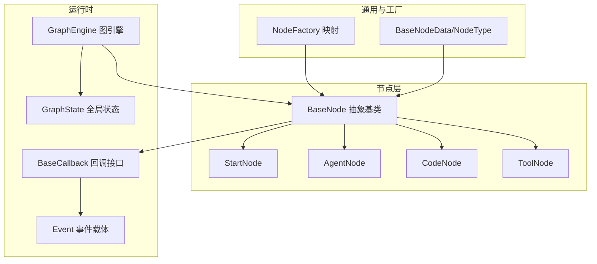
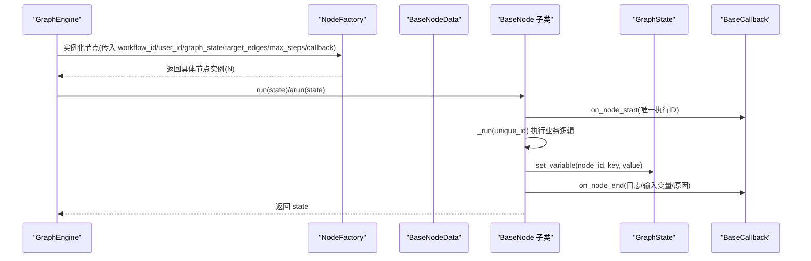
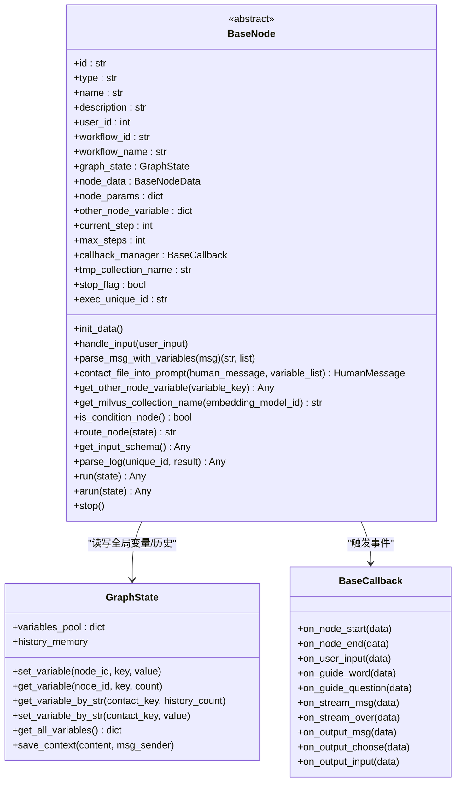
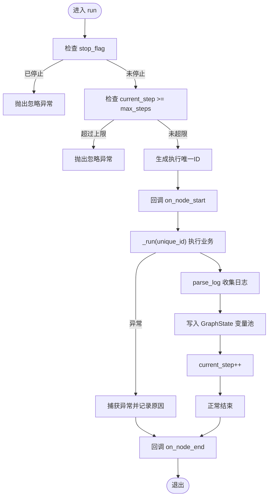
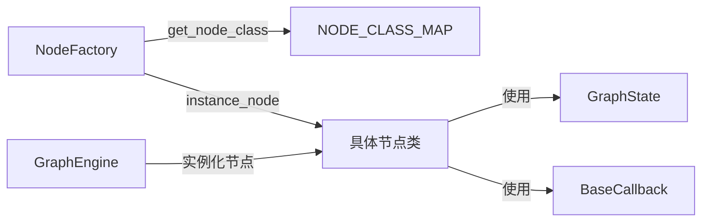

# 基础节点架构

<cite>
**本文引用的文件**
- [src/backend/bisheng/workflow/nodes/base.py](file://src/backend/bisheng/workflow/nodes/base.py)
- [src/backend/bisheng/workflow/common/node.py](file://src/backend/bisheng/workflow/common/node.py)
- [src/backend/bisheng/workflow/nodes/node_manage.py](file://src/backend/bisheng/workflow/nodes/node_manage.py)
- [src/backend/bisheng/workflow/graph/graph_engine.py](file://src/backend/bisheng/workflow/graph/graph_engine.py)
- [src/backend/bisheng/workflow/graph/graph_state.py](file://src/backend/bisheng/workflow/graph/graph_state.py)
- [src/backend/bisheng/workflow/callback/base_callback.py](file://src/backend/bisheng/workflow/callback/base_callback.py)
- [src/backend/bisheng/workflow/callback/event.py](file://src/backend/bisheng/workflow/callback/event.py)
- [src/backend/bisheng/workflow/nodes/start/start.py](file://src/backend/bisheng/workflow/nodes/start/start.py)
- [src/backend/bisheng/workflow/nodes/agent/agent.py](file://src/backend/bisheng/workflow/nodes/agent/agent.py)
- [src/backend/bisheng/workflow/nodes/code/code.py](file://src/backend/bisheng/workflow/nodes/code/code.py)
- [src/backend/bisheng/workflow/nodes/tool/tool.py](file://src/backend/bisheng/workflow/nodes/tool/tool.py)
</cite>

## 目录
1. [引言](#引言)
2. [项目结构](#项目结构)
3. [核心组件](#核心组件)
4. [架构总览](#架构总览)
5. [详细组件分析](#详细组件分析)
6. [依赖关系分析](#依赖关系分析)
7. [性能考量](#性能考量)
8. [故障排查指南](#故障排查指南)
9. [结论](#结论)
10. [附录：从零开始编写自定义节点](#附录从零开始编写自定义节点)

## 引言
本文件面向开发者，系统性阐述 Bisheng 工作流基础节点架构，重点围绕抽象基类 BaseNode 的设计理念与实现细节展开，覆盖节点生命周期管理、构造函数参数作用、属性初始化流程；run/arun 同步/异步执行机制；节点参数处理、输入输出管理、全局变量存储系统；回调系统、错误处理与停止标志控制；节点状态管理、最大执行次数限制、临时数据存储等核心能力，并提供继承 BaseNode 开发自定义节点的完整实践指南。

## 项目结构
- 节点体系位于后端模块 bisheng/workflow 下，按职责划分为：
  - nodes：节点实现层（如 start、agent、code、tool 等）
  - common：通用模型与枚举（如 BaseNodeData、NodeType）
  - nodes/node_manage.py：节点类型到类的映射与工厂
  - graph：图引擎与状态管理（graph_engine.py、graph_state.py）
  - callback：回调接口与事件载体（base_callback.py、event.py）

图表来源
- [src/backend/bisheng/workflow/nodes/base.py](file://src/backend/bisheng/workflow/nodes/base.py#L20-L230)
- [src/backend/bisheng/workflow/nodes/node_manage.py](file://src/backend/bisheng/workflow/nodes/node_manage.py#L33-L44)
- [src/backend/bisheng/workflow/common/node.py](file://src/backend/bisheng/workflow/common/node.py#L48-L73)
- [src/backend/bisheng/workflow/graph/graph_engine.py](file://src/backend/bisheng/workflow/graph/graph_engine.py#L212-L228)
- [src/backend/bisheng/workflow/graph/graph_state.py](file://src/backend/bisheng/workflow/graph/graph_state.py#L8-L109)
- [src/backend/bisheng/workflow/callback/base_callback.py](file://src/backend/bisheng/workflow/callback/base_callback.py#L8-L47)
- [src/backend/bisheng/workflow/callback/event.py](file://src/backend/bisheng/workflow/callback/event.py#L6-L72)

章节来源
- [src/backend/bisheng/workflow/nodes/base.py](file://src/backend/bisheng/workflow/nodes/base.py#L20-L230)
- [src/backend/bisheng/workflow/nodes/node_manage.py](file://src/backend/bisheng/workflow/nodes/node_manage.py#L33-L44)
- [src/backend/bisheng/workflow/common/node.py](file://src/backend/bisheng/workflow/common/node.py#L48-L73)

## 核心组件
- BaseNode 抽象基类：定义节点生命周期、参数处理、执行入口、回调与错误处理、状态与停止标志、临时数据存储等统一接口与默认行为。
- NodeFactory：根据节点类型映射到具体节点类并实例化。
- BaseNodeData/NodeType：描述节点元数据与类型枚举。
- GraphState：全局变量池与历史消息管理。
- BaseCallback/Event：节点执行期间的事件回调与数据载体。

章节来源
- [src/backend/bisheng/workflow/nodes/base.py](file://src/backend/bisheng/workflow/nodes/base.py#L20-L230)
- [src/backend/bisheng/workflow/nodes/node_manage.py](file://src/backend/bisheng/workflow/nodes/node_manage.py#L33-L44)
- [src/backend/bisheng/workflow/common/node.py](file://src/backend/bisheng/workflow/common/node.py#L48-L73)
- [src/backend/bisheng/workflow/graph/graph_state.py](file://src/backend/bisheng/workflow/graph/graph_state.py#L8-L109)
- [src/backend/bisheng/workflow/callback/base_callback.py](file://src/backend/bisheng/workflow/callback/base_callback.py#L8-L47)
- [src/backend/bisheng/workflow/callback/event.py](file://src/backend/bisheng/workflow/callback/event.py#L6-L72)

## 架构总览
下图展示节点在图引擎中的装配与执行路径，以及与全局状态、回调系统的关系。

图表来源
- [src/backend/bisheng/workflow/graph/graph_engine.py](file://src/backend/bisheng/workflow/graph/graph_engine.py#L212-L228)
- [src/backend/bisheng/workflow/nodes/node_manage.py](file://src/backend/bisheng/workflow/nodes/node_manage.py#L33-L44)
- [src/backend/bisheng/workflow/nodes/base.py](file://src/backend/bisheng/workflow/nodes/base.py#L189-L223)
- [src/backend/bisheng/workflow/graph/graph_state.py](file://src/backend/bisheng/workflow/graph/graph_state.py#L43-L47)
- [src/backend/bisheng/workflow/callback/base_callback.py](file://src/backend/bisheng/workflow/callback/base_callback.py#L13-L19)

## 详细组件分析

### BaseNode 抽象基类设计与实现
- 构造函数参数与职责
  - 接收 BaseNodeData、workflow_id、user_id、GraphState、目标边集合、最大步数、回调对象等，完成节点标识、用户上下文、全局状态、参数池、临时数据名、停止标志、执行唯一ID等初始化。
  - 初始化阶段会调用 init_data，将 BaseNodeData 中的 group_params 深拷贝到 node_params，作为节点可直接使用的参数字典。
- 生命周期与执行入口
  - run：同步执行入口，负责 stop_flag 与 max_steps 的检查、生成执行唯一ID、触发 on_node_start、调用 _run、收集 parse_log、写入 GraphState 变量池、递增 current_step、最终 on_node_end。
  - arun：当前直接委托 run，体现对异步执行的预留支持。
  - stop：设置 stop_flag，后续 run 将抛出忽略异常，中断执行。
- 参数处理与模板解析
  - handle_input：允许外部在运行前更新 node_params。
  - parse_msg_with_variables：基于模板解析器提取并替换消息中的变量占位符，支持跨节点变量引用。
  - contact_file_into_prompt：将其他节点输出的文件变量转为消息内容中的图片元素（base64）。
- 全局变量与历史管理
  - get_other_node_variable：通过 GraphState 的 get_variable_by_str 获取任意节点的输出值（支持数组/字典索引）。
  - GraphState 提供 set/get 变量池、历史消息缓冲、聚合所有变量键值等能力。
- 回调系统与日志
  - on_node_start/on_node_end：在执行前后上报事件，包含唯一ID、节点信息、日志与输入变量。
  - parse_log：子类可重写以输出结构化的执行日志（轮次级）。
- 条件节点与路由
  - is_condition_node：判断是否为条件节点。
  - route_node：特殊节点可实现分支路由逻辑（未在 BaseNode 中实现）。
- 临时数据存储
  - tmp_collection_name：用于向量/ES等临时数据集合命名，结合 embedding 模型ID生成唯一集合名。
- 错误处理与停止标志
  - run 内部捕获异常并记录原因，finally 中确保 on_node_end 触发；stop 将导致后续 run 抛出忽略异常。

图表来源
- [src/backend/bisheng/workflow/nodes/base.py](file://src/backend/bisheng/workflow/nodes/base.py#L20-L230)
- [src/backend/bisheng/workflow/graph/graph_state.py](file://src/backend/bisheng/workflow/graph/graph_state.py#L8-L109)
- [src/backend/bisheng/workflow/callback/base_callback.py](file://src/backend/bisheng/workflow/callback/base_callback.py#L8-L47)

章节来源
- [src/backend/bisheng/workflow/nodes/base.py](file://src/backend/bisheng/workflow/nodes/base.py#L20-L230)
- [src/backend/bisheng/workflow/graph/graph_state.py](file://src/backend/bisheng/workflow/graph/graph_state.py#L8-L109)
- [src/backend/bisheng/workflow/callback/base_callback.py](file://src/backend/bisheng/workflow/callback/base_callback.py#L8-L47)

### run/arun 方法：同步与异步支持
- run：执行前校验 stop_flag 与 current_step/max_steps；生成 exec_unique_id；on_node_start；调用 _run；parse_log；写入 GraphState；current_step++；异常捕获并记录原因；finally 触发 on_node_end。
- arun：当前直接返回 run，便于未来扩展为真正的异步执行。

图表来源
- [src/backend/bisheng/workflow/nodes/base.py](file://src/backend/bisheng/workflow/nodes/base.py#L189-L223)

章节来源
- [src/backend/bisheng/workflow/nodes/base.py](file://src/backend/bisheng/workflow/nodes/base.py#L189-L229)

### 节点参数处理与输入输出管理
- 参数来源：BaseNodeData.group_params 经 init_data 深拷贝到 node_params，供节点直接使用。
- 输入处理：handle_input 可在运行前合并用户输入；parse_msg_with_variables 支持模板变量替换；contact_file_into_prompt 支持将文件变量注入消息内容。
- 输出管理：_run 返回字典，BaseNode.run 自动写入 GraphState；get_other_node_variable 支持跨节点读取任意变量（含数组/字典索引）。

章节来源
- [src/backend/bisheng/workflow/nodes/base.py](file://src/backend/bisheng/workflow/nodes/base.py#L68-L112)
- [src/backend/bisheng/workflow/common/node.py](file://src/backend/bisheng/workflow/common/node.py#L48-L73)
- [src/backend/bisheng/workflow/graph/graph_state.py](file://src/backend/bisheng/workflow/graph/graph_state.py#L43-L83)

### 全局变量存储系统
- GraphState.variables_pool：按 node_id 分组的键值池，支持 set/get/get_by_str/set_by_str。
- get_variable_by_str 支持 node_id.key 或 node_id.key#index 形式访问数组/字典元素。
- get_all_variables 聚合所有变量键值，便于前端或导出使用。

章节来源
- [src/backend/bisheng/workflow/graph/graph_state.py](file://src/backend/bisheng/workflow/graph/graph_state.py#L43-L109)

### 回调系统与事件
- BaseCallback 定义节点执行期间的事件钩子（开始/结束、用户输入、引导词/问题、流式消息等）。
- BaseNode 在 run 中触发 on_node_start/on_node_end，并传递日志与输入变量。
- 事件载体 Event 定义了各事件的数据结构。

章节来源
- [src/backend/bisheng/workflow/callback/base_callback.py](file://src/backend/bisheng/workflow/callback/base_callback.py#L8-L47)
- [src/backend/bisheng/workflow/callback/event.py](file://src/backend/bisheng/workflow/callback/event.py#L6-L72)
- [src/backend/bisheng/workflow/nodes/base.py](file://src/backend/bisheng/workflow/nodes/base.py#L201-L222)

### 错误处理与停止标志控制
- run 中捕获异常并记录 reason，finally 确保 on_node_end 触发。
- stop 设置 stop_flag，后续 run 将抛出忽略异常，中断执行。
- GraphEngine 在遍历下游节点时，遇到需要用户输入的节点（INPUT/FAKE_OUTPUT）会置工作流状态为 INPUT 并回调通知。

章节来源
- [src/backend/bisheng/workflow/nodes/base.py](file://src/backend/bisheng/workflow/nodes/base.py#L194-L229)
- [src/backend/bisheng/workflow/graph/graph_engine.py](file://src/backend/bisheng/workflow/graph/graph_engine.py#L367-L387)

### 节点状态管理与最大执行次数限制
- BaseNode 维护 current_step 与 max_steps，超过上限即抛出忽略异常。
- GraphEngine 在实例化节点时将 max_steps 传入，保证全图一致的限制策略。

章节来源
- [src/backend/bisheng/workflow/nodes/base.py](file://src/backend/bisheng/workflow/nodes/base.py#L48-L50)
- [src/backend/bisheng/workflow/graph/graph_engine.py](file://src/backend/bisheng/workflow/graph/graph_engine.py#L212-L220)

### 临时数据存储
- BaseNode 定义 tmp_collection_name，并提供 get_milvus_collection_name(embedding_model_id) 生成集合名，便于向量/ES等临时数据隔离。

章节来源
- [src/backend/bisheng/workflow/nodes/base.py](file://src/backend/bisheng/workflow/nodes/base.py#L55-L57)
- [src/backend/bisheng/workflow/nodes/base.py](file://src/backend/bisheng/workflow/nodes/base.py#L122-L123)

### 典型节点实现示例

#### StartNode：初始化与引导
- 在构造中设置当前时间、聊天历史窗口大小、用户信息等。
- _run 返回预设问题、用户信息、自定义变量等，供后续节点使用。
- parse_log 输出参数级别的日志。

章节来源
- [src/backend/bisheng/workflow/nodes/start/start.py](file://src/backend/bisheng/workflow/nodes/start/start.py#L17-L95)

#### AgentNode：智能体执行
- 解析系统/用户提示模板，构建工具与知识检索工具，选择 ReAct 或函数调用执行器。
- _run 支持单轮与批量变量两种模式，维护工具调用日志与推理内容。
- parse_log 输出系统提示、用户提示、工具调用详情与输出变量。

章节来源
- [src/backend/bisheng/workflow/nodes/agent/agent.py](file://src/backend/bisheng/workflow/nodes/agent/agent.py#L50-L405)

#### CodeNode：代码执行
- 从 node_params 解析输入/输出字段与代码主体，CodeParser 解析并执行 main 方法。
- _run 返回指定输出键值，parse_log 记录输入与输出。

章节来源
- [src/backend/bisheng/workflow/nodes/code/code.py](file://src/backend/bisheng/workflow/nodes/code/code.py#L7-L63)

#### ToolNode：工具调用
- 通过 tool_key 获取工具配置，初始化 ToolExecutor。
- _run 解析模板参数，调用工具并返回结果，parse_log 记录输入与输出。

章节来源
- [src/backend/bisheng/workflow/nodes/tool/tool.py](file://src/backend/bisheng/workflow/nodes/tool/tool.py#L10-L73)

## 依赖关系分析
- 类型映射与实例化
  - NodeFactory 将 NodeType 映射到具体节点类，实例化时传入 workflow_id、user_id、graph_state、target_edges、max_steps、callback 等参数。
- 图引擎装配
  - GraphEngine 在构建节点时，将 max_steps 与 callback 注入节点，同时记录条件节点 ID 与节点邻接关系。

图表来源
- [src/backend/bisheng/workflow/nodes/node_manage.py](file://src/backend/bisheng/workflow/nodes/node_manage.py#L16-L30)
- [src/backend/bisheng/workflow/nodes/node_manage.py](file://src/backend/bisheng/workflow/nodes/node_manage.py#L33-L44)
- [src/backend/bisheng/workflow/graph/graph_engine.py](file://src/backend/bisheng/workflow/graph/graph_engine.py#L212-L228)

章节来源
- [src/backend/bisheng/workflow/nodes/node_manage.py](file://src/backend/bisheng/workflow/nodes/node_manage.py#L16-L44)
- [src/backend/bisheng/workflow/graph/graph_engine.py](file://src/backend/bisheng/workflow/graph/graph_engine.py#L212-L228)

## 性能考量
- 参数深拷贝：init_data 对 group_params 进行深拷贝，避免共享引用带来的副作用，但需注意大对象的内存占用。
- 日志结构化：parse_log 返回轮次级日志，建议仅记录必要字段，避免过大数据传输。
- 临时数据集合：get_milvus_collection_name 以 embedding_model_id 作为集合名的一部分，有助于隔离与复用，但需关注集合数量与清理策略。
- 回调开销：回调事件在 run 前后触发，若回调链路复杂，应评估对吞吐的影响。

## 故障排查指南
- 节点未执行或提前终止
  - 检查 stop_flag 是否被设置（调用 stop 后）。
  - 检查 current_step 与 max_steps 的关系，确认是否达到上限。
- 回调未触发
  - 确认 callback_manager 是否正确注入，且 BaseNode.run 的回调调用路径未被重写覆盖。
- 变量取值异常
  - 使用 get_other_node_variable 或 get_variable_by_str，确认 contact_key 格式（node_id.key 或 node_id.key#index），并检查索引越界。
- 日志缺失
  - 确认 _run 返回值非空，BaseNode.run 会在有结果时写入 GraphState；parse_log 需返回结构化日志。

章节来源
- [src/backend/bisheng/workflow/nodes/base.py](file://src/backend/bisheng/workflow/nodes/base.py#L194-L229)
- [src/backend/bisheng/workflow/graph/graph_state.py](file://src/backend/bisheng/workflow/graph/graph_state.py#L58-L83)

## 结论
BaseNode 通过统一的生命周期、参数处理、回调与状态管理，为各类节点提供了稳定一致的执行框架。配合 GraphState 的全局变量池与 NodeFactory 的类型映射，实现了可扩展、可观测、可控的节点体系。开发者可基于 BaseNode 快速实现自定义节点，同时遵循参数模板化、日志结构化、回调事件化与状态受控的原则，确保节点在工作流中的可靠性与可维护性。

## 附录：从零开始编写自定义节点
- 步骤
  - 新建类继承 BaseNode，并在构造函数中完成 node_params 的解析与初始化。
  - 实现 _run(unique_id)：执行业务逻辑并返回字典；返回值将写入 GraphState。
  - 如需记录日志，重写 parse_log(unique_id, result)。
  - 如需用户输入，重写 get_input_schema() 并在 arun/run 中处理输入。
  - 如需文件变量注入消息，可使用 contact_file_into_prompt。
  - 如需条件路由，重写 route_node(state)。
  - 如需临时数据集合，使用 get_milvus_collection_name(embedding_model_id)。
- 最佳实践
  - 严格遵守 BaseNode.run 的执行流程，不要破坏回调与状态管理。
  - 对外暴露的参数尽量使用 node_params，避免硬编码。
  - 日志与变量命名保持语义清晰，便于调试与可视化。
  - 控制 parse_log 的体量，避免冗余字段影响性能。
  - 在需要时调用 stop 主动中断执行，避免无限循环或资源浪费。

章节来源
- [src/backend/bisheng/workflow/nodes/base.py](file://src/backend/bisheng/workflow/nodes/base.py#L68-L112)
- [src/backend/bisheng/workflow/nodes/base.py](file://src/backend/bisheng/workflow/nodes/base.py#L189-L229)
- [src/backend/bisheng/workflow/nodes/base.py](file://src/backend/bisheng/workflow/nodes/base.py#L225-L229)