# 工作流节点系统

<cite>
**本文引用的文件**
- [src/backend/bisheng/workflow/nodes/base.py](file://src/backend/bisheng/workflow/nodes/base.py)
- [src/backend/bisheng/workflow/nodes/node_manage.py](file://src/backend/bisheng/workflow/nodes/node_manage.py)
- [src/backend/bisheng/workflow/common/node.py](file://src/backend/bisheng/workflow/common/node.py)
- [src/backend/bisheng/workflow/graph/graph_engine.py](file://src/backend/bisheng/workflow/graph/graph_engine.py)
- [src/backend/bisheng/workflow/graph/graph_state.py](file://src/backend/bisheng/workflow/graph/graph_state.py)
- [src/backend/bisheng/workflow/callback/base_callback.py](file://src/backend/bisheng/workflow/callback/base_callback.py)
- [src/backend/bisheng/workflow/nodes/agent/agent.py](file://src/backend/bisheng/workflow/nodes/agent/agent.py)
- [src/backend/bisheng/workflow/nodes/llm/llm.py](file://src/backend/bisheng/workflow/nodes/llm/llm.py)
- [src/backend/bisheng/workflow/nodes/code/code.py](file://src/backend/bisheng/workflow/nodes/code/code.py)
- [src/backend/bisheng/workflow/nodes/code/code_parse.py](file://src/backend/bisheng/workflow/nodes/code/code_parse.py)
- [src/backend/bisheng/workflow/nodes/condition/condition.py](file://src/backend/bisheng/workflow/nodes/condition/condition.py)
- [src/backend/bisheng/workflow/nodes/output/output.py](file://src/backend/bisheng/workflow/nodes/output/output.py)
- [src/backend/bisheng/workflow/nodes/tool/tool.py](file://src/backend/bisheng/workflow/nodes/tool/tool.py)
- [src/backend/bisheng/workflow/nodes/input/input.py](file://src/backend/bisheng/workflow/nodes/input/input.py)
- [src/backend/bisheng/workflow/nodes/prompt_template.py](file://src/backend/bisheng/workflow/nodes/prompt_template.py)
- [src/backend/bisheng/api/services/workflow.py](file://src/backend/bisheng/api/services/workflow.py)
</cite>

## 目录
1. [简介](#简介)
2. [项目结构](#项目结构)
3. [核心组件](#核心组件)
4. [架构总览](#架构总览)
5. [详细组件分析](#详细组件分析)
6. [依赖关系分析](#依赖关系分析)
7. [性能考量](#性能考量)
8. [故障排查指南](#故障排查指南)
9. [结论](#结论)
10. [附录：自定义节点开发指南](#附录自定义节点开发指南)

## 简介
本文件面向 Bisheng 工作流节点系统，系统性阐述节点工厂模式的设计与实现、BaseNode 基类的生命周期与运行机制、各类节点（Agent、LLM、Code、Condition、Output、Tool、Input 等）的功能与使用场景，并解释节点间依赖关系、条件路由与并行执行策略。同时提供自定义节点开发指南、性能优化建议与调试技巧，帮助开发者快速上手并扩展工作流能力。

## 项目结构
工作流节点系统主要位于后端模块 src/backend/bisheng 下，核心目录与职责如下：
- workflow/nodes：节点实现与工厂
- workflow/common：节点类型与数据模型
- workflow/graph：图引擎与状态管理
- workflow/callback：回调事件体系
- api/services：服务层对节点实例化的调用入口

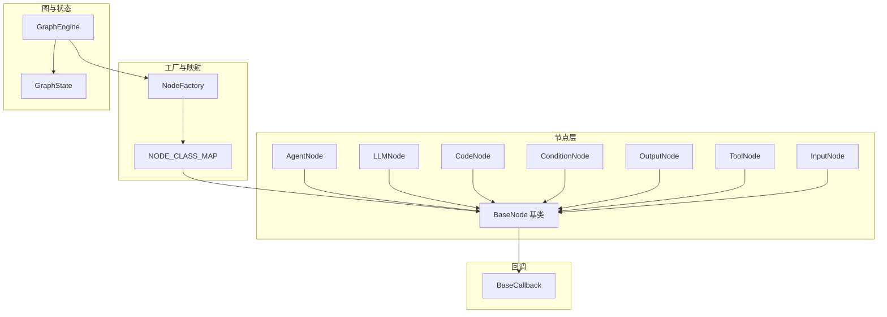

图表来源
- [src/backend/bisheng/workflow/nodes/base.py](file://src/backend/bisheng/workflow/nodes/base.py#L20-L230)
- [src/backend/bisheng/workflow/nodes/node_manage.py](file://src/backend/bisheng/workflow/nodes/node_manage.py#L16-L44)
- [src/backend/bisheng/workflow/graph/graph_engine.py](file://src/backend/bisheng/workflow/graph/graph_engine.py#L27-L200)
- [src/backend/bisheng/workflow/graph/graph_state.py](file://src/backend/bisheng/workflow/graph/graph_state.py#L8-L109)
- [src/backend/bisheng/workflow/callback/base_callback.py](file://src/backend/bisheng/workflow/callback/base_callback.py#L8-L47)

章节来源
- [src/backend/bisheng/workflow/nodes/base.py](file://src/backend/bisheng/workflow/nodes/base.py#L20-L230)
- [src/backend/bisheng/workflow/nodes/node_manage.py](file://src/backend/bisheng/workflow/nodes/node_manage.py#L16-L44)
- [src/backend/bisheng/workflow/graph/graph_engine.py](file://src/backend/bisheng/workflow/graph/graph_engine.py#L27-L200)
- [src/backend/bisheng/workflow/graph/graph_state.py](file://src/backend/bisheng/workflow/graph/graph_state.py#L8-L109)
- [src/backend/bisheng/workflow/callback/base_callback.py](file://src/backend/bisheng/workflow/callback/base_callback.py#L8-L47)

## 核心组件
- 节点工厂 NodeFactory：通过 NODE_CLASS_MAP 将节点类型字符串映射到具体类，并负责实例化节点。
- BaseNode 基类：统一节点生命周期、输入输出处理、变量解析、日志记录、回调通知与停止控制；提供 run/arun 入口与抽象 _run 实现。
- 图引擎 GraphEngine：构建节点与边的关系，维护 fan-in/fan-out、条件节点与选择交互节点的路由逻辑，支持多路汇聚与等待策略。
- 全局状态 GraphState：维护对话历史与全局变量池，支持按 node_id.key 或带索引的访问方式。
- 回调体系 BaseCallback：在节点开始/结束、输出消息、用户输入、流式消息等阶段触发事件，便于前端渲染与审计。

章节来源
- [src/backend/bisheng/workflow/nodes/base.py](file://src/backend/bisheng/workflow/nodes/base.py#L20-L230)
- [src/backend/bisheng/workflow/nodes/node_manage.py](file://src/backend/bisheng/workflow/nodes/node_manage.py#L33-L44)
- [src/backend/bisheng/workflow/graph/graph_engine.py](file://src/backend/bisheng/workflow/graph/graph_engine.py#L27-L200)
- [src/backend/bisheng/workflow/graph/graph_state.py](file://src/backend/bisheng/workflow/graph/graph_state.py#L8-L109)
- [src/backend/bisheng/workflow/callback/base_callback.py](file://src/backend/bisheng/workflow/callback/base_callback.py#L8-L47)

## 架构总览
下图展示从 API 层到节点实例化、图构建与执行的关键流程：

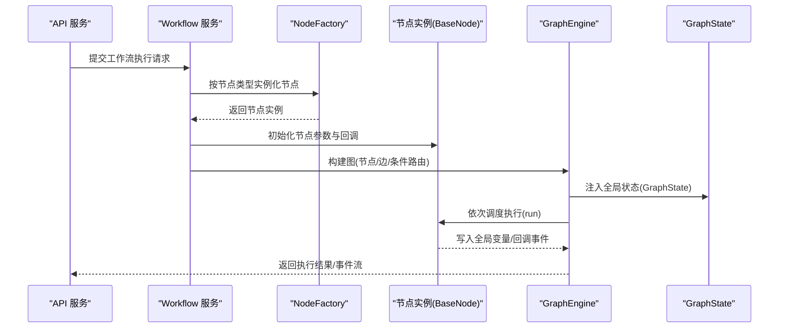

图表来源
- [src/backend/bisheng/api/services/workflow.py](file://src/backend/bisheng/api/services/workflow.py#L120-L150)
- [src/backend/bisheng/workflow/nodes/node_manage.py](file://src/backend/bisheng/workflow/nodes/node_manage.py#L33-L44)
- [src/backend/bisheng/workflow/graph/graph_engine.py](file://src/backend/bisheng/workflow/graph/graph_engine.py#L27-L200)
- [src/backend/bisheng/workflow/graph/graph_state.py](file://src/backend/bisheng/workflow/graph/graph_state.py#L8-L109)
- [src/backend/bisheng/workflow/nodes/base.py](file://src/backend/bisheng/workflow/nodes/base.py#L189-L226)

## 详细组件分析

### 节点工厂模式与动态加载
- 设计要点
  - 使用字典映射 NodeType 到具体节点类，集中管理节点注册。
  - 提供 get_node_class 与 instance_node 两个方法，前者用于查询类，后者完成实例化并传入上下文参数。
- 动态加载机制
  - 通过导入各节点模块并在 NODE_CLASS_MAP 中注册，实现“新增节点无需修改工厂”的扩展性。
- 错误处理
  - 当未知节点类型时抛出异常，提示上层进行容错或回退。

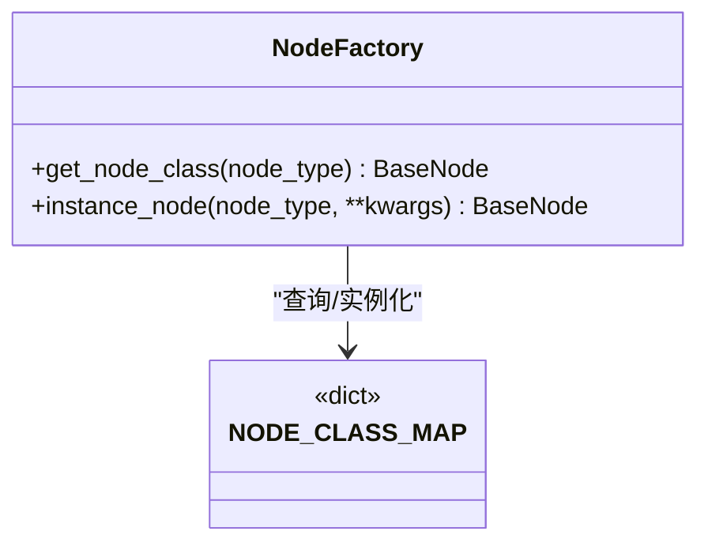

图表来源
- [src/backend/bisheng/workflow/nodes/node_manage.py](file://src/backend/bisheng/workflow/nodes/node_manage.py#L16-L44)

章节来源
- [src/backend/bisheng/workflow/nodes/node_manage.py](file://src/backend/bisheng/workflow/nodes/node_manage.py#L16-L44)

### BaseNode 基类设计与生命周期
- 生命周期
  - 初始化：接收 BaseNodeData、GraphState、回调、用户与工作流上下文，解析 group_params 为 node_params。
  - 执行入口：run(state) 负责校验停止标志与最大步数、触发 on_node_start、调用 _run、写入全局变量、回调 on_node_end。
  - 异步入口：arun(state) 默认委托给 run，便于异步扩展。
  - 停止控制：stop() 设置 stop_flag，后续 run 将抛出忽略异常。
- 输入输出处理
  - handle_input：合并用户输入到 node_params。
  - 变量解析：parse_msg_with_variables 与 PromptTemplateParser 支持 {{#node_id.key#}} 变量替换。
  - 文件注入：contact_file_into_prompt 支持将图片等文件转为 base64 并拼接到消息内容中。
- 日志与回调
  - parse_log：默认空实现，子类可返回每轮日志明细，包含参数、工具调用、变量等。
  - 回调：on_node_start/on_node_end/on_stream_over 等由 BaseCallback 子类消费。
- 条件节点判定
  - is_condition_node：判断是否为互斥条件节点，影响图构建时的条件边配置。

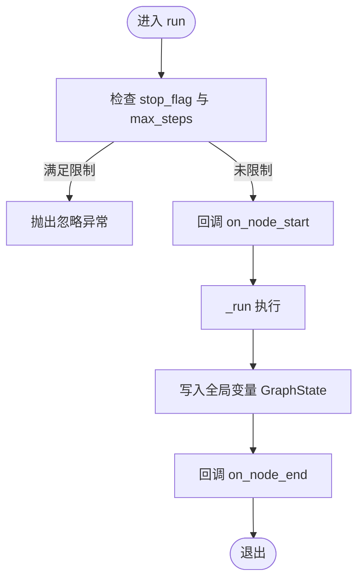

图表来源
- [src/backend/bisheng/workflow/nodes/base.py](file://src/backend/bisheng/workflow/nodes/base.py#L189-L226)

章节来源
- [src/backend/bisheng/workflow/nodes/base.py](file://src/backend/bisheng/workflow/nodes/base.py#L20-L230)

### Agent 节点
- 核心能力
  - 支持 ReAct/函数调用两种代理执行器类型，按助手模型配置自动选择。
  - 组合工具链：函数工具、知识检索工具、SQL Agent 工具。
  - 支持单轮与批量执行，批量时记录每个样本的系统/用户提示、推理内容与工具调用日志。
- 输入输出
  - 输入：system_prompt/user_prompt（模板变量解析）、模型参数、工具列表、知识库 ID 或临时文件元数据。
  - 输出：AI 回复文本、可选保存到对话历史。
- 日志
  - 记录 system_prompt、user_prompt、工具调用详情、推理内容与最终变量。

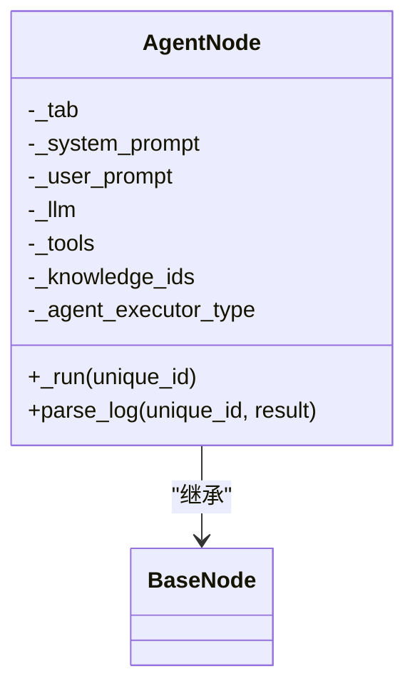

图表来源
- [src/backend/bisheng/workflow/nodes/agent/agent.py](file://src/backend/bisheng/workflow/nodes/agent/agent.py#L50-L405)

章节来源
- [src/backend/bisheng/workflow/nodes/agent/agent.py](file://src/backend/bisheng/workflow/nodes/agent/agent.py#L50-L405)

### LLM 节点
- 核心能力
  - 单轮与批量提示生成，支持图片输入拼接。
  - 可选将输出写入对话历史。
- 输入输出
  - 输入：system_prompt/user_prompt（模板变量解析）、模型参数。
  - 输出：文本回复与推理内容。
- 日志
  - 记录 system_prompt、user_prompt、推理内容与最终变量。

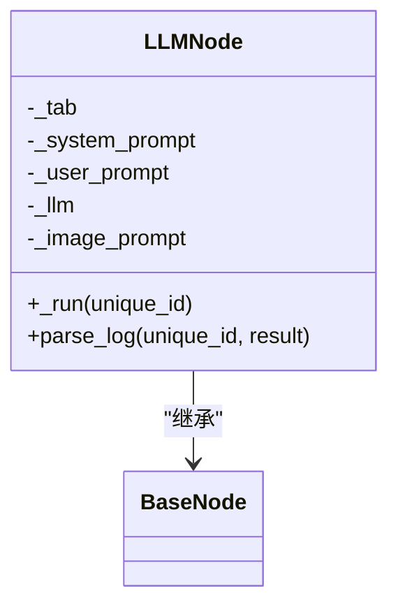

图表来源
- [src/backend/bisheng/workflow/nodes/llm/llm.py](file://src/backend/bisheng/workflow/nodes/llm/llm.py#L14-L135)

章节来源
- [src/backend/bisheng/workflow/nodes/llm/llm.py](file://src/backend/bisheng/workflow/nodes/llm/llm.py#L14-L135)

### Code 节点
- 核心能力
  - 解析用户提供的 Python 代码，提取 import、函数、类与全局变量，编译并执行 main 方法。
  - 支持 ref 类型输入从上游节点变量中引用。
  - 对输出键进行白名单校验，确保返回结构符合预期。
- 输入输出
  - 输入：code_input（含常量与 ref）、code、code_output（期望输出键）。
  - 输出：main 返回值中被 code_output 白名单过滤后的键值。
- 日志
  - 记录解析后的输入参数与最终输出。

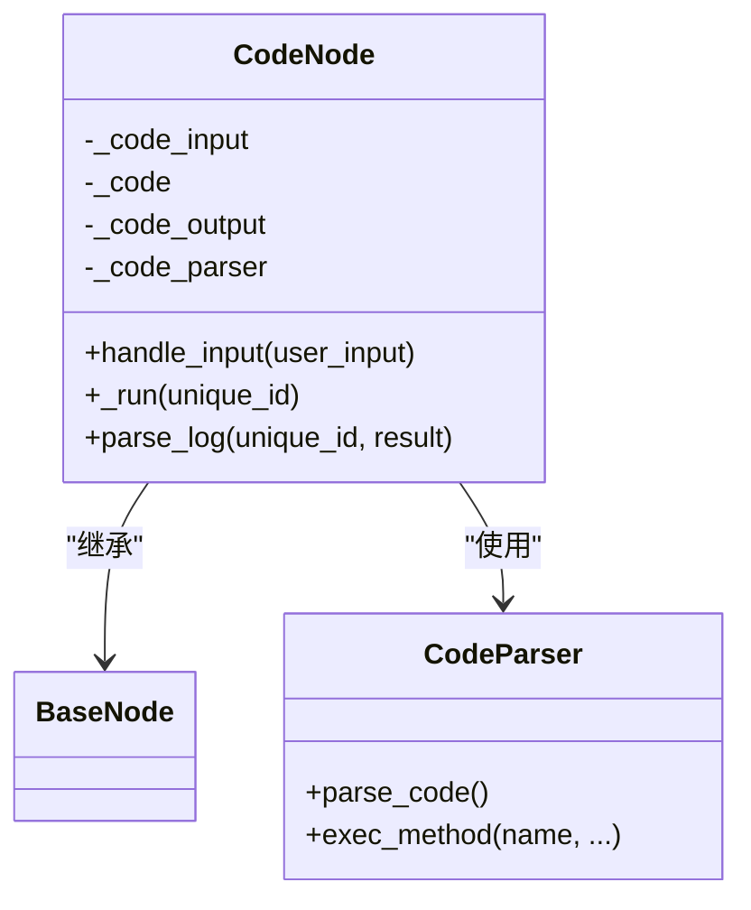

图表来源
- [src/backend/bisheng/workflow/nodes/code/code.py](file://src/backend/bisheng/workflow/nodes/code/code.py#L7-L63)
- [src/backend/bisheng/workflow/nodes/code/code_parse.py](file://src/backend/bisheng/workflow/nodes/code/code_parse.py#L7-L127)

章节来源
- [src/backend/bisheng/workflow/nodes/code/code.py](file://src/backend/bisheng/workflow/nodes/code/code.py#L7-L63)
- [src/backend/bisheng/workflow/nodes/code/code_parse.py](file://src/backend/bisheng/workflow/nodes/code/code_parse.py#L7-L127)

### Condition 节点
- 核心能力
  - 多条件分支评估，命中后根据 sourceHandle 获取目标节点 ID。
  - 未命中时走默认 right_handle 分支。
- 输入输出
  - 输入：condition 配置（含变量计算与比较）。
  - 输出：设置 _next_node_id，供 GraphEngine 在条件边中使用。
- 日志
  - 记录参与比较的变量键值。

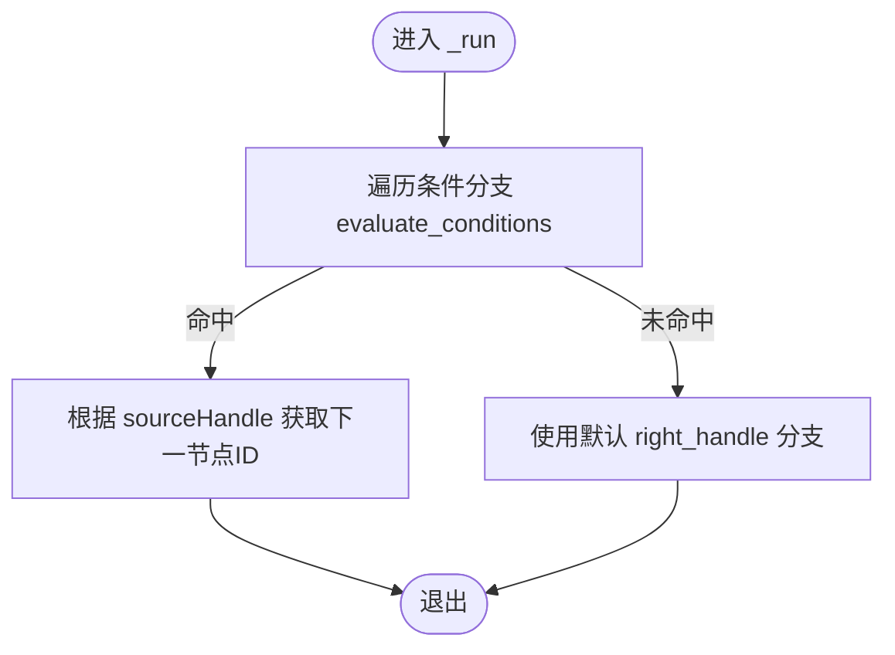

图表来源
- [src/backend/bisheng/workflow/nodes/condition/condition.py](file://src/backend/bisheng/workflow/nodes/condition/condition.py#L19-L47)

章节来源
- [src/backend/bisheng/workflow/nodes/condition/condition.py](file://src/backend/bisheng/workflow/nodes/condition/condition.py#L8-L47)

### Output 节点
- 核心能力
  - 支持三种交互类型：直接输出、用户输入、选项选择。
  - 选择交互时，根据用户选择决定下一节点；非选择交互则按边直连。
  - 可将输出消息中的模板变量解析为真实值，并生成文件分享链接。
- 输入输出
  - 输入：handle_input 接收用户输入并写入全局变量。
  - 输出：发送消息事件（普通/输入/选择），并返回 message 与 output_result。
- 日志
  - 记录输出消息模板解析结果与用户输入结果（当存在）。

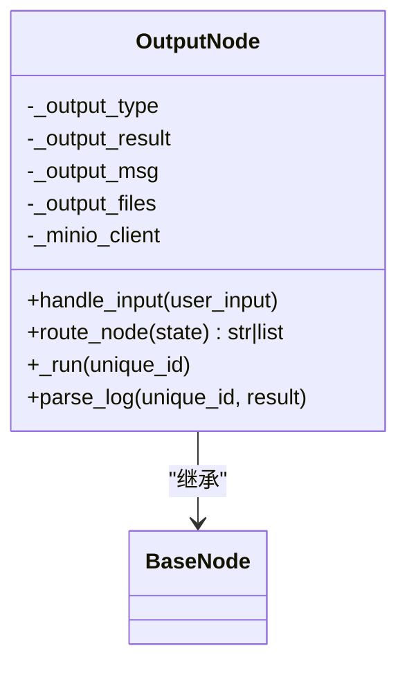

图表来源
- [src/backend/bisheng/workflow/nodes/output/output.py](file://src/backend/bisheng/workflow/nodes/output/output.py#L10-L137)

章节来源
- [src/backend/bisheng/workflow/nodes/output/output.py](file://src/backend/bisheng/workflow/nodes/output/output.py#L10-L137)

### Tool 节点
- 核心能力
  - 通过 tool_key 定位工具，初始化 ToolExecutor 后执行 invoke。
  - 支持模板变量解析工具输入参数。
- 输入输出
  - 输入：除 output 外的参数经模板解析后作为工具输入。
  - 输出：工具返回值封装为 output 字段。
- 日志
  - 记录工具输入键值与输出。

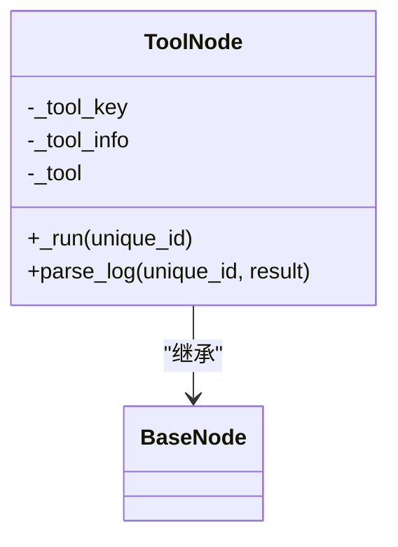

图表来源
- [src/backend/bisheng/workflow/nodes/tool/tool.py](file://src/backend/bisheng/workflow/nodes/tool/tool.py#L10-L73)

章节来源
- [src/backend/bisheng/workflow/nodes/tool/tool.py](file://src/backend/bisheng/workflow/nodes/tool/tool.py#L10-L73)

### Input 节点
- 核心能力
  - 支持对话输入与表单输入两种模式；表单模式下可对文件进行保留原始、抽取文本或入库知识库三种解析模式。
  - 文件入库：将分块文本与元数据写入 Milvus 与 ES，并记录文档元信息供下游检索使用。
  - 推荐问题：基于历史对话与推荐 LLM 生成候选问题，通过回调下发给前端。
- 输入输出
  - 输出：用户输入文本、文件元数据、文件路径、图片文件路径、抽取文本等，按解析模式返回。
- 日志
  - 过滤掉文件元数据不直接记录，仅记录非文件字段的变量。

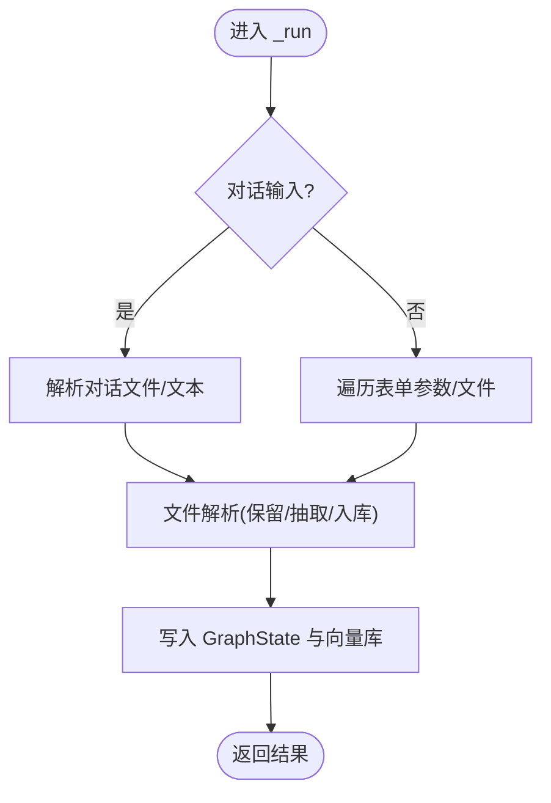

图表来源
- [src/backend/bisheng/workflow/nodes/input/input.py](file://src/backend/bisheng/workflow/nodes/input/input.py#L174-L216)
- [src/backend/bisheng/workflow/nodes/input/input.py](file://src/backend/bisheng/workflow/nodes/input/input.py#L264-L347)

章节来源
- [src/backend/bisheng/workflow/nodes/input/input.py](file://src/backend/bisheng/workflow/nodes/input/input.py#L33-L347)

### 图引擎与依赖关系管理
- 边与节点构建
  - 通过 EdgeManage 解析边集合，建立节点映射与 fan-in/fan-out 关系。
  - 条件节点与选择交互 Output 节点使用条件边，其余节点按 fan-in 数量决定是否需要等待。
- 条件路由
  - ConditionNode.route_node 返回下一节点 ID；OutputNode.route_node 根据用户选择返回。
- 并行与等待
  - 多路 fan-in 时，GraphEngine 会区分需要等待与无需等待的前置节点，避免并发冲突。
- Fake Output 节点
  - Output 节点之后插入 fake 节点以处理中断与后续条件边。

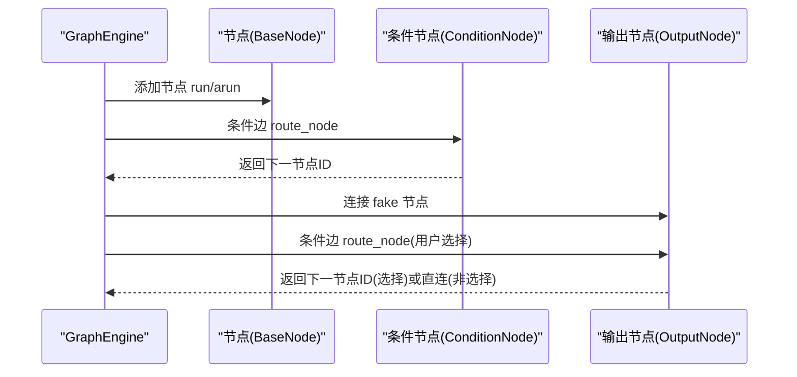

图表来源
- [src/backend/bisheng/workflow/graph/graph_engine.py](file://src/backend/bisheng/workflow/graph/graph_engine.py#L76-L118)
- [src/backend/bisheng/workflow/nodes/condition/condition.py](file://src/backend/bisheng/workflow/nodes/condition/condition.py#L45-L47)
- [src/backend/bisheng/workflow/nodes/output/output.py](file://src/backend/bisheng/workflow/nodes/output/output.py#L57-L62)

章节来源
- [src/backend/bisheng/workflow/graph/graph_engine.py](file://src/backend/bisheng/workflow/graph/graph_engine.py#L76-L118)
- [src/backend/bisheng/workflow/nodes/condition/condition.py](file://src/backend/bisheng/workflow/nodes/condition/condition.py#L8-L47)
- [src/backend/bisheng/workflow/nodes/output/output.py](file://src/backend/bisheng/workflow/nodes/output/output.py#L54-L62)

### Prompt 模板解析
- 规则
  - 模板变量必须为 {{#key#}} 形式，支持 histories/query/context 特殊变量与 node_id.key 的跨节点引用。
- 能力
  - extract：提取模板中的变量键。
  - format：将变量键替换为 GraphState 中的实际值，支持移除模板标记。

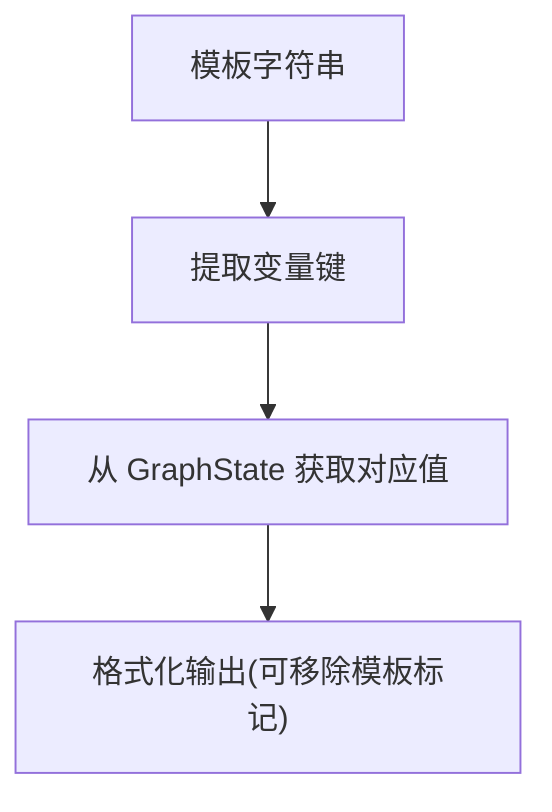

图表来源
- [src/backend/bisheng/workflow/nodes/prompt_template.py](file://src/backend/bisheng/workflow/nodes/prompt_template.py#L8-L49)
- [src/backend/bisheng/workflow/nodes/base.py](file://src/backend/bisheng/workflow/nodes/base.py#L143-L158)

章节来源
- [src/backend/bisheng/workflow/nodes/prompt_template.py](file://src/backend/bisheng/workflow/nodes/prompt_template.py#L8-L49)
- [src/backend/bisheng/workflow/nodes/base.py](file://src/backend/bisheng/workflow/nodes/base.py#L143-L158)

## 依赖关系分析
- 节点类型枚举与数据模型
  - NodeType 定义所有节点类型；BaseNodeData/NodeGroupParams/NodeParams 描述节点参数与分组。
- 工厂与节点实现
  - NodeFactory 依赖 NODE_CLASS_MAP；各节点均继承 BaseNode 并覆盖 _run。
- 图引擎耦合
  - GraphEngine 依赖 NodeFactory、EdgeManage、GraphState；根据节点类型决定添加条件边或普通边。
- 回调与事件
  - BaseCallback 为所有节点回调事件的抽象基类，具体实现由前端或服务侧订阅。

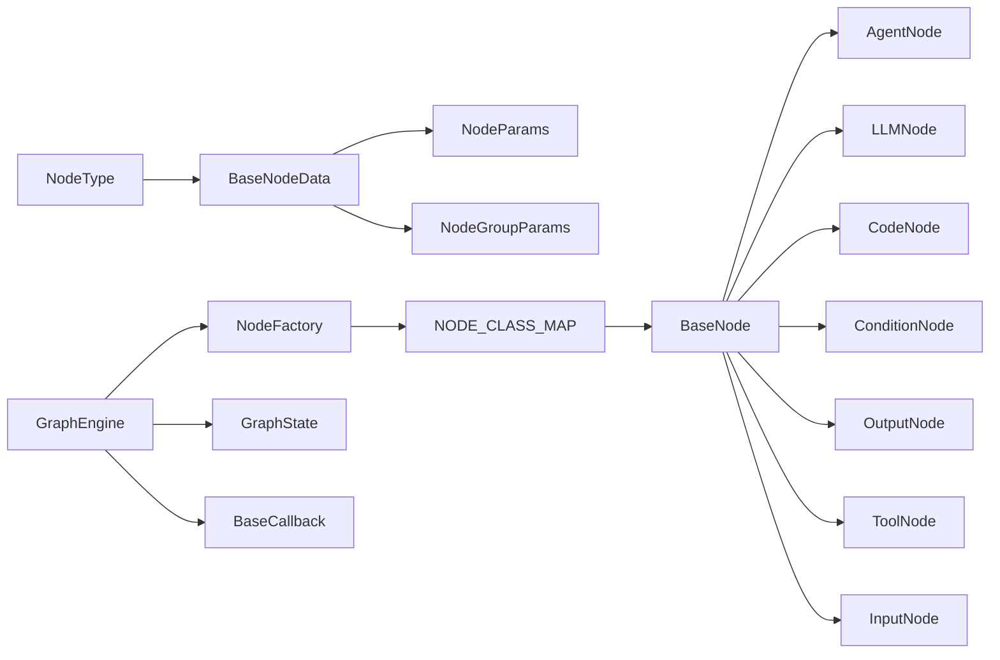

图表来源
- [src/backend/bisheng/workflow/common/node.py](file://src/backend/bisheng/workflow/common/node.py#L8-L73)
- [src/backend/bisheng/workflow/nodes/node_manage.py](file://src/backend/bisheng/workflow/nodes/node_manage.py#L16-L44)
- [src/backend/bisheng/workflow/nodes/base.py](file://src/backend/bisheng/workflow/nodes/base.py#L20-L230)
- [src/backend/bisheng/workflow/graph/graph_engine.py](file://src/backend/bisheng/workflow/graph/graph_engine.py#L27-L200)
- [src/backend/bisheng/workflow/graph/graph_state.py](file://src/backend/bisheng/workflow/graph/graph_state.py#L8-L109)
- [src/backend/bisheng/workflow/callback/base_callback.py](file://src/backend/bisheng/workflow/callback/base_callback.py#L8-L47)

章节来源
- [src/backend/bisheng/workflow/common/node.py](file://src/backend/bisheng/workflow/common/node.py#L8-L73)
- [src/backend/bisheng/workflow/nodes/node_manage.py](file://src/backend/bisheng/workflow/nodes/node_manage.py#L16-L44)
- [src/backend/bisheng/workflow/nodes/base.py](file://src/backend/bisheng/workflow/nodes/base.py#L20-L230)
- [src/backend/bisheng/workflow/graph/graph_engine.py](file://src/backend/bisheng/workflow/graph/graph_engine.py#L27-L200)
- [src/backend/bisheng/workflow/graph/graph_state.py](file://src/backend/bisheng/workflow/graph/graph_state.py#L8-L109)
- [src/backend/bisheng/workflow/callback/base_callback.py](file://src/backend/bisheng/workflow/callback/base_callback.py#L8-L47)

## 性能考量
- 并发与等待策略
  - 多路 fan-in 时，GraphEngine 会区分是否需要等待，避免不必要的阻塞；仅在必要时连接等待边。
- 向量检索与存储
  - Input 节点入库时，Milvus 与 ES 并行写入，注意控制 chunk 大小与元数据字段，减少网络与 IO 压力。
- 回调与日志
  - 避免在回调中做重 IO 操作；将大对象序列化延迟到前端渲染或异步任务。
- 模板解析
  - 大量变量替换时，优先复用已解析变量映射，减少重复查找。

## 故障排查指南
- 常见异常与定位
  - 未知节点类型：NodeFactory 在实例化时抛出异常，检查 NodeType 与 NODE_CLASS_MAP 是否匹配。
  - 节点停止：BaseNode.stop 设置 stop_flag 后，run 将抛出忽略异常，确认外部控制信号。
  - 最大步数限制：超过 max_steps 抛出忽略异常，检查工作流是否存在环或死循环。
  - 条件节点未命中：确认 right_handle 是否配置，默认分支需确保可达。
  - Code 节点输出校验失败：main 返回值必须为 dict 且包含 code_output 白名单键。
- 调试建议
  - 开启回调事件监听，观察 on_node_start/on_node_end 与 on_stream_over，定位耗时环节。
  - 使用 parse_log 输出关键参数与工具调用详情，辅助复盘。
  - 对文件解析与向量入库，关注分块大小与元数据一致性。

章节来源
- [src/backend/bisheng/workflow/nodes/base.py](file://src/backend/bisheng/workflow/nodes/base.py#L189-L226)
- [src/backend/bisheng/workflow/nodes/node_manage.py](file://src/backend/bisheng/workflow/nodes/node_manage.py#L39-L43)
- [src/backend/bisheng/workflow/nodes/code/code.py](file://src/backend/bisheng/workflow/nodes/code/code.py#L54-L62)
- [src/backend/bisheng/workflow/nodes/condition/condition.py](file://src/backend/bisheng/workflow/nodes/condition/condition.py#L30-L35)

## 结论
Bisheng 工作流节点系统以工厂模式实现节点注册与实例化，以 BaseNode 为统一基座，结合 GraphEngine 的条件边与并行等待策略，形成高扩展、可维护的工作流执行框架。通过回调与全局状态，系统实现了可观测与可交互的执行过程。开发者可基于现有节点扩展新类型，遵循参数校验、日志记录与错误处理的最佳实践，即可快速构建复杂业务流程。

## 附录：自定义节点开发指南
- 节点接口实现
  - 继承 BaseNode，实现 _run(unique_id) 与可选 parse_log。
  - 如为条件节点，实现 route_node(state) 返回下一节点 ID。
  - 如为交互节点，实现 get_input_schema 并在 handle_input 中更新 node_params。
- 参数与模板
  - 在构造函数中解析 node_params，使用 PromptTemplateParser 处理模板变量。
  - 对外部输入进行参数校验与类型转换，必要时抛出明确异常。
- 日志与回调
  - 在 parse_log 中记录关键参数、工具调用与中间变量，便于审计与排障。
  - 通过回调上报流式消息与最终结果，保持前后端一致的交互体验。
- 错误处理
  - 对外部依赖（如 LLM、工具、向量库）进行异常捕获与包装，避免中断整个工作流。
- 注册与测试
  - 在 NODE_CLASS_MAP 中注册新节点类型，编写单元测试覆盖正常与异常路径。
  - 在 GraphEngine 中验证条件边与 fan-in/fan-out 行为。

章节来源
- [src/backend/bisheng/workflow/nodes/base.py](file://src/backend/bisheng/workflow/nodes/base.py#L82-L135)
- [src/backend/bisheng/workflow/nodes/prompt_template.py](file://src/backend/bisheng/workflow/nodes/prompt_template.py#L8-L49)
- [src/backend/bisheng/workflow/nodes/node_manage.py](file://src/backend/bisheng/workflow/nodes/node_manage.py#L16-L44)