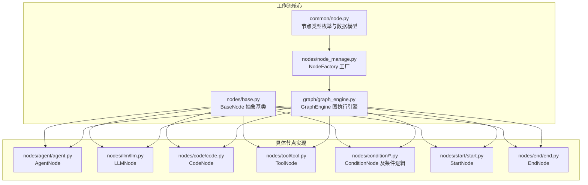
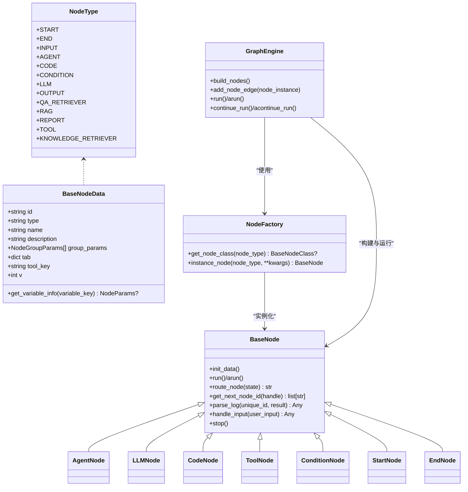
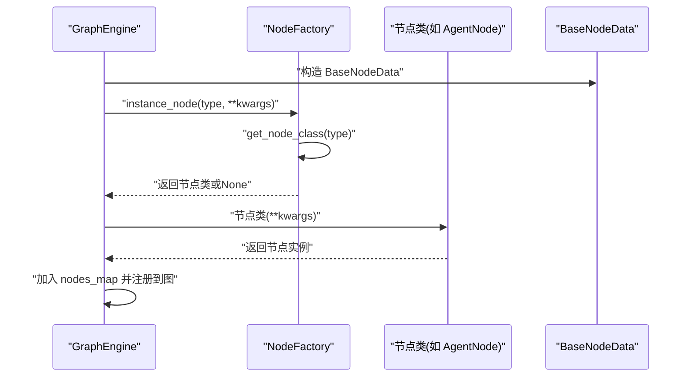
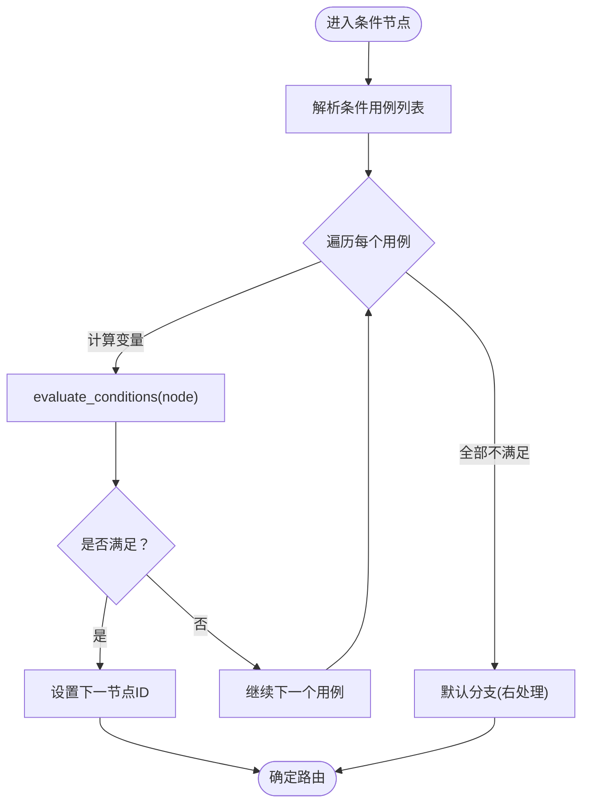
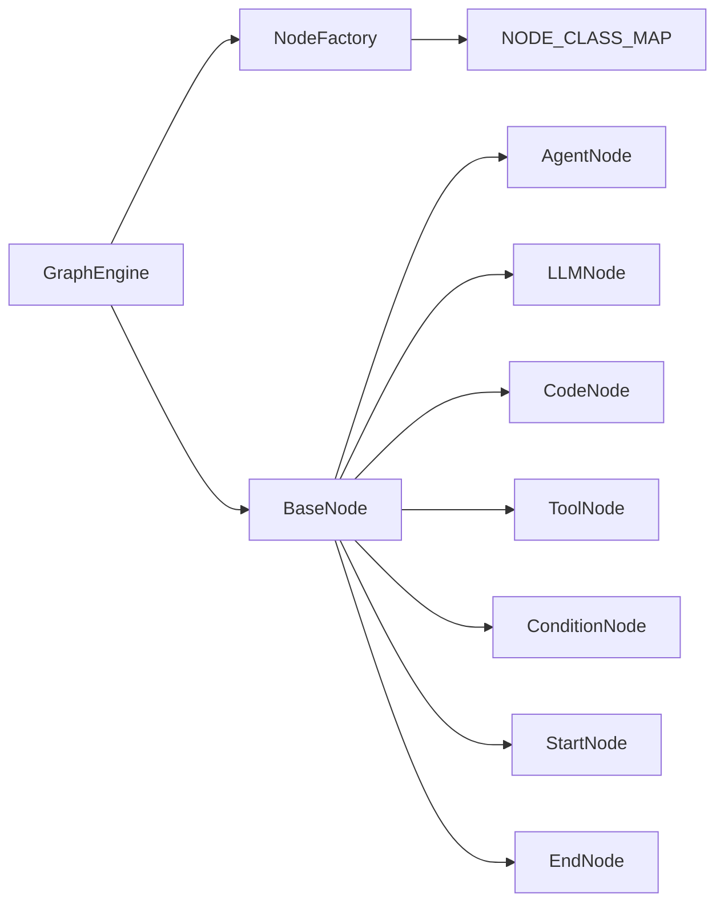

# 节点工厂系统

<cite>
**本文引用的文件**
- [src/backend/bisheng/workflow/nodes/node_manage.py](file://src/backend/bisheng/workflow/nodes/node_manage.py)
- [src/backend/bisheng/workflow/common/node.py](file://src/backend/bisheng/workflow/common/node.py)
- [src/backend/bisheng/workflow/graph/graph_engine.py](file://src/backend/bisheng/workflow/graph/graph_engine.py)
- [src/backend/bisheng/workflow/nodes/base.py](file://src/backend/bisheng/workflow/nodes/base.py)
- [src/backend/bisheng/workflow/nodes/agent/agent.py](file://src/backend/bisheng/workflow/nodes/agent/agent.py)
- [src/backend/bisheng/workflow/nodes/llm/llm.py](file://src/backend/bisheng/workflow/nodes/llm/llm.py)
- [src/backend/bisheng/workflow/nodes/code/code.py](file://src/backend/bisheng/workflow/nodes/code/code.py)
- [src/backend/bisheng/workflow/nodes/tool/tool.py](file://src/backend/bisheng/workflow/nodes/tool/tool.py)
- [src/backend/bisheng/workflow/nodes/condition/condition.py](file://src/backend/bisheng/workflow/nodes/condition/condition.py)
- [src/backend/bisheng/workflow/nodes/condition/conidition_case.py](file://src/backend/bisheng/workflow/nodes/condition/conidition_case.py)
- [src/backend/bisheng/workflow/nodes/start/start.py](file://src/backend/bisheng/workflow/nodes/start/start.py)
- [src/backend/bisheng/workflow/nodes/end/end.py](file://src/backend/bisheng/workflow/nodes/end/end.py)
</cite>

## 目录
1. [简介](#简介)
2. [项目结构](#项目结构)
3. [核心组件](#核心组件)
4. [架构总览](#架构总览)
5. [详细组件分析](#详细组件分析)
6. [依赖关系分析](#依赖关系分析)
7. [性能考量](#性能考量)
8. [故障排查指南](#故障排查指南)
9. [结论](#结论)
10. [附录](#附录)

## 简介
本文件面向 Bisheng 的“节点工厂系统”，系统性阐述 NodeManage（即 NodeFactory）的设计与实现，重点覆盖以下方面：
- 节点工厂模式的应用与节点类型映射表
- 节点类型的动态注册与发现机制
- 节点实例化流程：节点数据解析、参数验证、依赖注入
- 各类节点类型的工厂方法与注册方式：Agent 节点、LLM 节点、Code 节点、Condition 节点等
- 节点类型映射表、节点创建缓存、节点生命周期管理
- 扩展最佳实践：自定义节点注册、工厂方法重写、错误处理策略
- 调试与性能优化建议

## 项目结构
节点工厂系统位于后端工作流模块中，核心文件如下：
- 工厂与类型定义：node_manage.py、common/node.py
- 图执行引擎：graph_engine.py
- 基类与通用能力：nodes/base.py
- 具体节点实现：agent/agent.py、llm/llm.py、code/code.py、tool/tool.py、condition/*、start/start.py、end/end.py

图表来源
- [src/backend/bisheng/workflow/nodes/node_manage.py](file://src/backend/bisheng/workflow/nodes/node_manage.py#L1-L44)
- [src/backend/bisheng/workflow/common/node.py](file://src/backend/bisheng/workflow/common/node.py#L1-L73)
- [src/backend/bisheng/workflow/graph/graph_engine.py](file://src/backend/bisheng/workflow/graph/graph_engine.py#L1-L388)
- [src/backend/bisheng/workflow/nodes/base.py](file://src/backend/bisheng/workflow/nodes/base.py#L1-L230)
- [src/backend/bisheng/workflow/nodes/agent/agent.py](file://src/backend/bisheng/workflow/nodes/agent/agent.py#L1-L405)
- [src/backend/bisheng/workflow/nodes/llm/llm.py](file://src/backend/bisheng/workflow/nodes/llm/llm.py#L1-L135)
- [src/backend/bisheng/workflow/nodes/code/code.py](file://src/backend/bisheng/workflow/nodes/code/code.py#L1-L63)
- [src/backend/bisheng/workflow/nodes/tool/tool.py](file://src/backend/bisheng/workflow/nodes/tool/tool.py#L1-L73)
- [src/backend/bisheng/workflow/nodes/condition/condition.py](file://src/backend/bisheng/workflow/nodes/condition/condition.py#L1-L46)
- [src/backend/bisheng/workflow/nodes/condition/conidition_case.py](file://src/backend/bisheng/workflow/nodes/condition/conidition_case.py#L52-L85)
- [src/backend/bisheng/workflow/nodes/start/start.py](file://src/backend/bisheng/workflow/nodes/start/start.py#L1-L95)
- [src/backend/bisheng/workflow/nodes/end/end.py](file://src/backend/bisheng/workflow/nodes/end/end.py#L1-L8)

章节来源
- [src/backend/bisheng/workflow/nodes/node_manage.py](file://src/backend/bisheng/workflow/nodes/node_manage.py#L1-L44)
- [src/backend/bisheng/workflow/common/node.py](file://src/backend/bisheng/workflow/common/node.py#L1-L73)
- [src/backend/bisheng/workflow/graph/graph_engine.py](file://src/backend/bisheng/workflow/graph/graph_engine.py#L1-L388)

## 核心组件
- 节点类型枚举与数据模型：定义了 NodeType 枚举以及 BaseNodeData、NodeGroupParams、NodeParams 等数据结构，用于描述节点元信息与参数。
- 工厂类 NodeFactory：通过 NODE_CLASS_MAP 将节点类型字符串映射到具体节点类，并提供实例化入口。
- 图执行引擎 GraphEngine：负责从工作流数据构建节点实例、连接边、编译图并驱动执行。
- 基类 BaseNode：统一节点初始化、参数解析、日志记录、回调、变量引用、停止控制等通用能力。

章节来源
- [src/backend/bisheng/workflow/common/node.py](file://src/backend/bisheng/workflow/common/node.py#L1-L73)
- [src/backend/bisheng/workflow/nodes/node_manage.py](file://src/backend/bisheng/workflow/nodes/node_manage.py#L1-L44)
- [src/backend/bisheng/workflow/graph/graph_engine.py](file://src/backend/bisheng/workflow/graph/graph_engine.py#L200-L251)
- [src/backend/bisheng/workflow/nodes/base.py](file://src/backend/bisheng/workflow/nodes/base.py#L20-L230)

## 架构总览
节点工厂系统采用“工厂 + 映射表 + 执行引擎”的分层设计：
- 映射层：NODE_CLASS_MAP 提供节点类型到类的静态映射。
- 工厂层：NodeFactory 提供获取类与实例化的能力。
- 执行层：GraphEngine 解析工作流数据，调用 NodeFactory 创建节点实例，构建图并驱动运行。
- 能力层：BaseNode 提供统一的生命周期、参数解析、日志与回调接口。

图表来源
- [src/backend/bisheng/workflow/common/node.py](file://src/backend/bisheng/workflow/common/node.py#L8-L26)
- [src/backend/bisheng/workflow/common/node.py](file://src/backend/bisheng/workflow/common/node.py#L48-L73)
- [src/backend/bisheng/workflow/nodes/node_manage.py](file://src/backend/bisheng/workflow/nodes/node_manage.py#L33-L44)
- [src/backend/bisheng/workflow/graph/graph_engine.py](file://src/backend/bisheng/workflow/graph/graph_engine.py#L27-L71)
- [src/backend/bisheng/workflow/nodes/base.py](file://src/backend/bisheng/workflow/nodes/base.py#L20-L230)
- [src/backend/bisheng/workflow/nodes/agent/agent.py](file://src/backend/bisheng/workflow/nodes/agent/agent.py#L50-L139)
- [src/backend/bisheng/workflow/nodes/llm/llm.py](file://src/backend/bisheng/workflow/nodes/llm/llm.py#L14-L66)
- [src/backend/bisheng/workflow/nodes/code/code.py](file://src/backend/bisheng/workflow/nodes/code/code.py#L7-L37)
- [src/backend/bisheng/workflow/nodes/tool/tool.py](file://src/backend/bisheng/workflow/nodes/tool/tool.py#L10-L34)
- [src/backend/bisheng/workflow/nodes/condition/condition.py](file://src/backend/bisheng/workflow/nodes/condition/condition.py#L8-L46)
- [src/backend/bisheng/workflow/nodes/start/start.py](file://src/backend/bisheng/workflow/nodes/start/start.py#L17-L75)
- [src/backend/bisheng/workflow/nodes/end/end.py](file://src/backend/bisheng/workflow/nodes/end/end.py#L4-L7)

## 详细组件分析

### NodeFactory 工厂类
- 设计要点
  - 使用 NODE_CLASS_MAP 将字符串节点类型映射到具体节点类，实现静态注册与发现。
  - 提供 get_node_class 与 instance_node 两个入口，前者用于查询类，后者完成实例化并传入通用上下文参数。
- 实例化流程
  - GraphEngine 在构建节点时，先将 BaseNodeData 转换为模型对象，再调用 NodeFactory.instance_node 完成实例化。
  - 实例化参数包含：节点数据、用户ID、工作流ID、全局状态、目标边集合、最大步数、回调、工作流名称等。
- 错误处理
  - 当节点类型未在映射表中时，抛出异常，提示未知节点类型。

图表来源
- [src/backend/bisheng/workflow/graph/graph_engine.py](file://src/backend/bisheng/workflow/graph/graph_engine.py#L200-L251)
- [src/backend/bisheng/workflow/nodes/node_manage.py](file://src/backend/bisheng/workflow/nodes/node_manage.py#L33-L44)

章节来源
- [src/backend/bisheng/workflow/nodes/node_manage.py](file://src/backend/bisheng/workflow/nodes/node_manage.py#L16-L44)
- [src/backend/bisheng/workflow/graph/graph_engine.py](file://src/backend/bisheng/workflow/graph/graph_engine.py#L200-L251)

### BaseNode 抽象基类
- 参数解析与注入
  - init_data 统一从 group_params 中提取节点参数到 node_params。
  - 支持变量模板解析与图片附件拼接，便于后续节点引用其他节点输出。
- 生命周期与回调
  - run/async run 提供统一入口，包含停止标志检查、最大步数限制、回调事件触发、结果写入全局状态等。
  - parse_log 提供默认空实现，子类可按需输出参数、工具调用、变量等日志。
- 条件路由与边连接
  - get_next_node_id 根据目标边的 sourceHandle 计算下一跳节点列表。
  - is_condition_node 用于识别条件节点，参与图的条件边构建。

章节来源
- [src/backend/bisheng/workflow/nodes/base.py](file://src/backend/bisheng/workflow/nodes/base.py#L68-L230)

### AgentNode（智能体节点）
- 初始化阶段
  - 解析系统/用户提示词模板，提取变量并缓存。
  - 选择推理模型与代理执行器类型，准备工具与知识检索工具。
  - 支持批量变量执行与链路日志记录。
- 运行阶段
  - _run_once 构造 HumanMessage，结合历史消息与图片附件调用代理执行器。
  - 输出结果写入全局状态，并通过回调向前端推送流式结果。
- 日志与工具调用
  - parse_log 汇总系统/用户提示、推理内容、工具调用明细与最终变量输出。

章节来源
- [src/backend/bisheng/workflow/nodes/agent/agent.py](file://src/backend/bisheng/workflow/nodes/agent/agent.py#L50-L405)

### LLMNode（大模型节点）
- 初始化阶段
  - 解析系统/用户提示词模板，提取变量。
  - 获取 LLMService 的推理实例，支持温度等参数注入。
- 运行阶段
  - 单次或批量执行，构造 System/HumanMessage，调用 LLM 执行器。
  - 将结果写入全局状态并推送流式结束事件。

章节来源
- [src/backend/bisheng/workflow/nodes/llm/llm.py](file://src/backend/bisheng/workflow/nodes/llm/llm.py#L14-L135)

### CodeNode（代码节点）
- 初始化阶段
  - 从 node_params 读取代码输入、代码主体与输出字段定义。
  - 通过 CodeParser 解析并校验代码结构。
- 运行阶段
  - 解析输入参数（支持引用其他节点输出），执行主方法并校验输出键值。
  - 输出结果写入全局状态。

章节来源
- [src/backend/bisheng/workflow/nodes/code/code.py](file://src/backend/bisheng/workflow/nodes/code/code.py#L7-L63)

### ToolNode（工具节点）
- 初始化阶段
  - 通过 tool_key 查询工具元信息，不存在则报错。
  - 延迟初始化工具实例，注入工作流上下文与用户信息。
- 运行阶段
  - 解析模板参数，调用工具执行器并返回输出。
  - parse_log 输出输入参数与输出。

章节来源
- [src/backend/bisheng/workflow/nodes/tool/tool.py](file://src/backend/bisheng/workflow/nodes/tool/tool.py#L10-L73)

### ConditionNode（条件节点）
- 初始化阶段
  - 从 node_params 中解析条件列表，构造 ConditionCases 列表。
- 运行阶段
  - 遍历条件用例，计算变量值并判断是否满足条件。
  - 若无匹配条件，默认走“默认分支”；否则根据命中用例确定下一节点。
- 路由接口
  - route_node 返回下一分支节点ID，配合图引擎的条件边进行路由。

图表来源
- [src/backend/bisheng/workflow/nodes/condition/condition.py](file://src/backend/bisheng/workflow/nodes/condition/condition.py#L19-L46)
- [src/backend/bisheng/workflow/nodes/condition/conidition_case.py](file://src/backend/bisheng/workflow/nodes/condition/conidition_case.py#L71-L85)

章节来源
- [src/backend/bisheng/workflow/nodes/condition/condition.py](file://src/backend/bisheng/workflow/nodes/condition/condition.py#L8-L46)
- [src/backend/bisheng/workflow/nodes/condition/conidition_case.py](file://src/backend/bisheng/workflow/nodes/condition/conidition_case.py#L63-L85)

### StartNode 与 EndNode
- StartNode：初始化当前时间、聊天历史记忆、引导语与问题，返回预设变量与用户信息。
- EndNode：空实现，作为流程终止节点。

章节来源
- [src/backend/bisheng/workflow/nodes/start/start.py](file://src/backend/bisheng/workflow/nodes/start/start.py#L17-L95)
- [src/backend/bisheng/workflow/nodes/end/end.py](file://src/backend/bisheng/workflow/nodes/end/end.py#L4-L7)

## 依赖关系分析
- 节点类型映射表
  - NODE_CLASS_MAP 将 NodeType 值映射到具体节点类，新增节点类型只需在此处注册即可被工厂识别。
- 工厂与执行引擎耦合
  - GraphEngine 在构建节点时直接依赖 NodeFactory，二者通过节点类型字符串解耦。
- 基类与子类内聚
  - BaseNode 提供统一能力，各节点仅关注自身业务逻辑，内聚度高、扩展性强。
- 条件节点与图引擎协作
  - 条件节点通过 route_node 与图引擎的 add_conditional_edges 协作，实现分支路由。

图表来源
- [src/backend/bisheng/workflow/nodes/node_manage.py](file://src/backend/bisheng/workflow/nodes/node_manage.py#L16-L30)
- [src/backend/bisheng/workflow/graph/graph_engine.py](file://src/backend/bisheng/workflow/graph/graph_engine.py#L200-L251)
- [src/backend/bisheng/workflow/nodes/base.py](file://src/backend/bisheng/workflow/nodes/base.py#L20-L230)

章节来源
- [src/backend/bisheng/workflow/nodes/node_manage.py](file://src/backend/bisheng/workflow/nodes/node_manage.py#L16-L30)
- [src/backend/bisheng/workflow/graph/graph_engine.py](file://src/backend/bisheng/workflow/graph/graph_engine.py#L76-L118)

## 性能考量
- 实例化成本
  - NodeFactory 仅做类查找与构造，实例化成本低；若需延迟加载资源（如工具、模型），可在节点内部惰性初始化以降低启动开销。
- 缓存与复用
  - 对于外部服务（如 LLM、工具执行器），建议在节点内部或上层服务层引入缓存与连接池，避免重复创建。
- 日志与回调
  - 流式回调与日志聚合可能带来额外开销，建议在高频场景下减少不必要的日志字段或合并日志批次。
- 执行路径
  - 条件节点与多输入汇聚会增加图的复杂度，建议在设计阶段尽量简化分支数量，避免过深的 fan-in。

## 故障排查指南
- 未知节点类型
  - 现象：实例化时报“未知节点类型”异常。
  - 排查：确认 NodeType 值与 NODE_CLASS_MAP 的键一致，且对应节点类已导入。
- 参数缺失或格式错误
  - 现象：节点初始化失败或运行时报错。
  - 排查：检查 BaseNodeData.group_params 是否完整，节点参数类型与必填项是否满足。
- 条件节点未命中
  - 现象：条件节点未按预期路由。
  - 排查：核对 ConditionCases 的 operator 与 conditions，确认变量引用是否正确。
- 回调与流式输出异常
  - 现象：前端未收到流式事件或日志不完整。
  - 排查：确认 BaseCallback 的实现与 GraphEngine 的回调配置，检查 parse_log 输出结构。

章节来源
- [src/backend/bisheng/workflow/nodes/node_manage.py](file://src/backend/bisheng/workflow/nodes/node_manage.py#L40-L43)
- [src/backend/bisheng/workflow/nodes/base.py](file://src/backend/bisheng/workflow/nodes/base.py#L206-L223)
- [src/backend/bisheng/workflow/nodes/condition/condition.py](file://src/backend/bisheng/workflow/nodes/condition/condition.py#L19-L46)

## 结论
节点工厂系统通过“类型映射 + 工厂 + 执行引擎”的清晰分层，实现了节点类型的静态注册与动态实例化，具备良好的扩展性与可维护性。结合 BaseNode 的统一生命周期与回调机制，能够支撑 Agent、LLM、Code、Tool、Condition 等多种节点类型的协同执行。建议在扩展新节点时遵循现有模式，确保参数解析、依赖注入与日志输出的一致性，并在性能敏感场景中注意资源复用与日志优化。

## 附录

### 自定义节点注册与扩展最佳实践
- 新增节点类型
  - 在 NodeType 中添加新枚举值。
  - 在 NODE_CLASS_MAP 中注册新类型到节点类。
  - 在节点类中实现 _run 与 parse_log，并在需要时重写 handle_input、route_node 等。
- 工厂方法重写
  - 如需差异化实例化行为，可在 NodeFactory 中新增分支或装饰器包装，但需保持与 GraphEngine 的参数契约一致。
- 错误处理策略
  - 在节点内部捕获并转换为可读异常，避免泄露底层细节。
  - 对关键资源（模型、工具）增加降级与重试策略，提升鲁棒性。
- 调试与可观测性
  - 通过 parse_log 输出关键参数与中间结果，便于回溯。
  - 在回调中输出流式事件，帮助定位执行卡点。

章节来源
- [src/backend/bisheng/workflow/common/node.py](file://src/backend/bisheng/workflow/common/node.py#L8-L26)
- [src/backend/bisheng/workflow/nodes/node_manage.py](file://src/backend/bisheng/workflow/nodes/node_manage.py#L16-L30)
- [src/backend/bisheng/workflow/nodes/base.py](file://src/backend/bisheng/workflow/nodes/base.py#L82-L107)