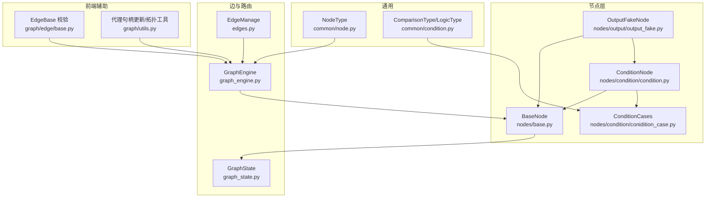
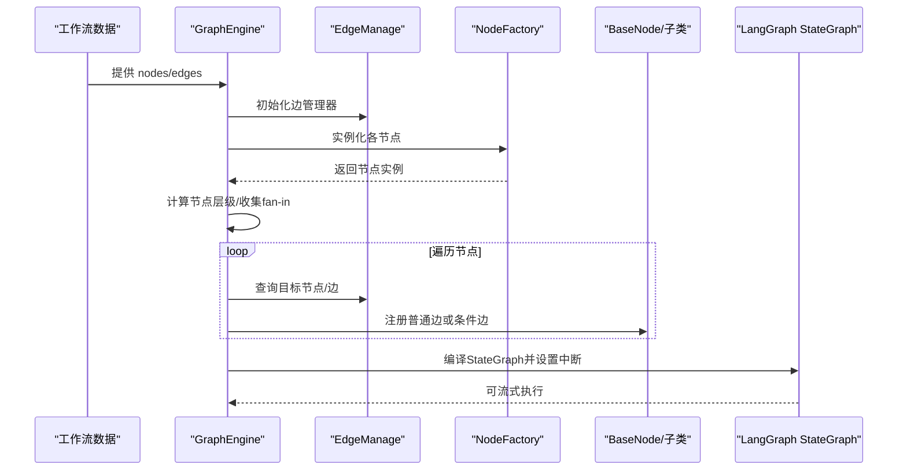
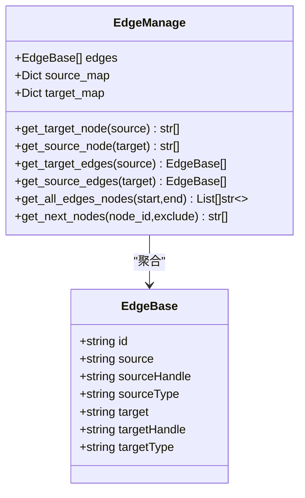
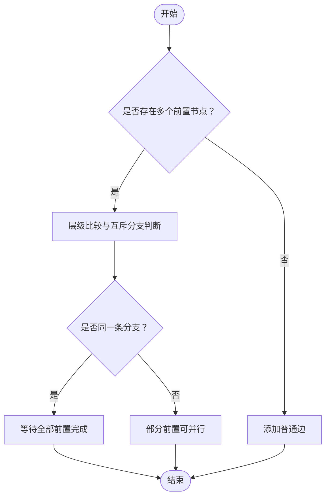
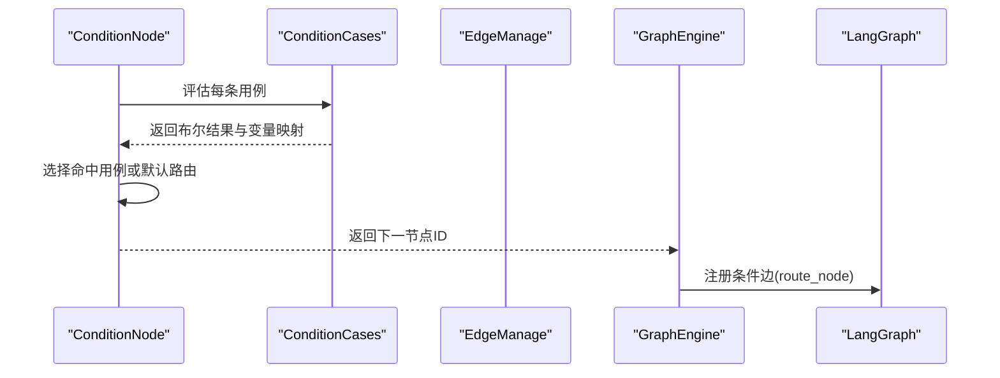
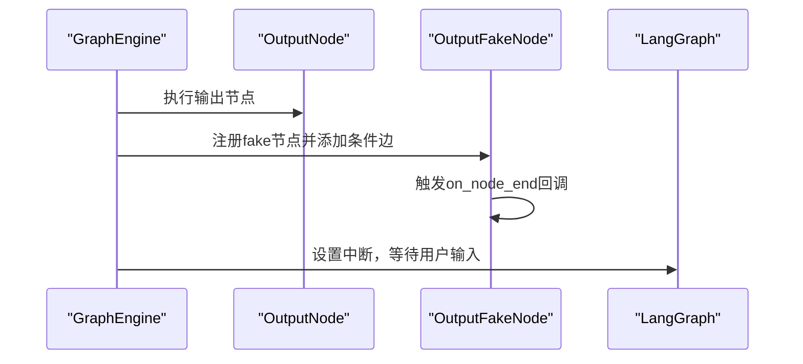
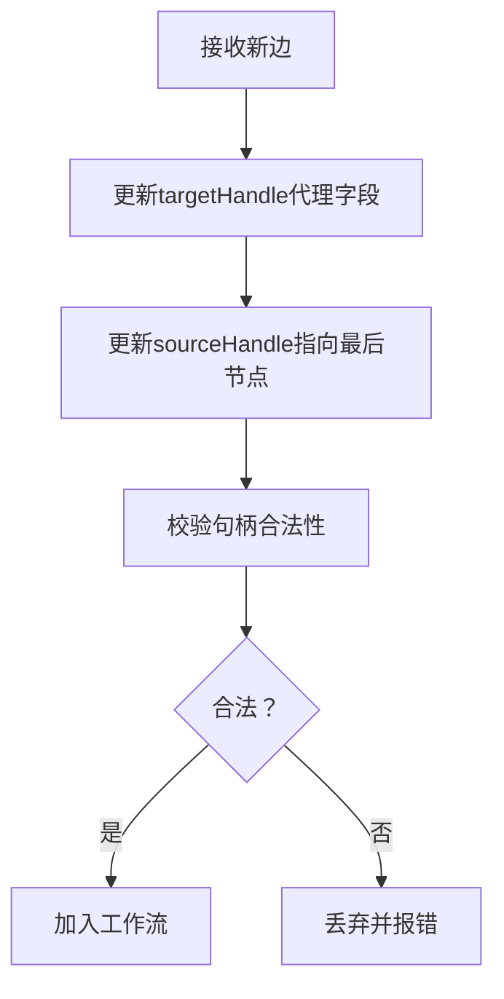
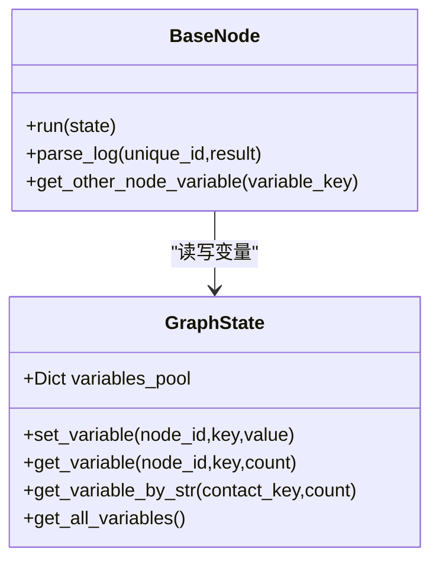
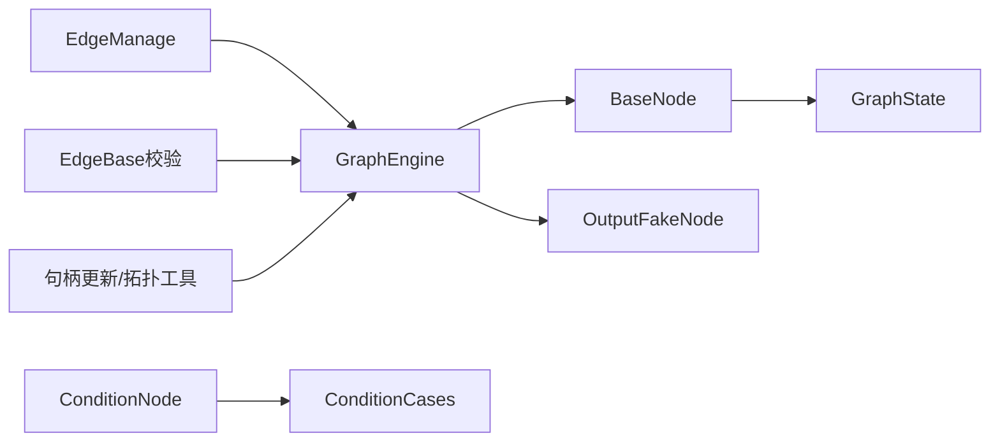

# 工作流边和路由

<cite>
**本文引用的文件**   
- [src/backend/bisheng/workflow/edges/edges.py](file://src/backend/bisheng/workflow/edges/edges.py)
- [src/backend/bisheng/workflow/graph/graph_engine.py](file://src/backend/bisheng/workflow/graph/graph_engine.py)
- [src/backend/bisheng/workflow/nodes/base.py](file://src/backend/bisheng/workflow/nodes/base.py)
- [src/backend/bisheng/workflow/nodes/condition/condition.py](file://src/backend/bisheng/workflow/nodes/condition/condition.py)
- [src/backend/bisheng/workflow/nodes/condition/conidition_case.py](file://src/backend/bisheng/workflow/nodes/condition/conidition_case.py)
- [src/backend/bisheng/workflow/nodes/output/output_fake.py](file://src/backend/bisheng/workflow/nodes/output/output_fake.py)
- [src/backend/bisheng/workflow/common/node.py](file://src/backend/bisheng/workflow/common/node.py)
- [src/backend/bisheng/workflow/common/condition.py](file://src/backend/bisheng/workflow/common/condition.py)
- [src/backend/bisheng/workflow/graph/graph_state.py](file://src/backend/bisheng/workflow/graph/graph_state.py)
- [src/backend/bisheng/graph/edge/base.py](file://src/backend/bisheng/graph/edge/base.py)
- [src/backend/bisheng/graph/utils.py](file://src/backend/bisheng/graph/utils.py)
</cite>

## 目录
1. [引言](#引言)
2. [项目结构](#项目结构)
3. [核心组件](#核心组件)
4. [架构总览](#架构总览)
5. [详细组件分析](#详细组件分析)
6. [依赖分析](#依赖分析)
7. [性能考虑](#性能考虑)
8. [故障排查指南](#故障排查指南)
9. [结论](#结论)
10. [附录](#附录)

## 引言
本文件面向 Bisheng 工作流“边与路由”子系统，系统性阐述 EdgeManage 的设计与实现，覆盖边的定义、连接关系维护与查询、不同边类型的处理（普通边、条件边、虚假输出边）、路由算法（单入多出、多入单出、多入多出）以及条件节点的路由决策机制。同时给出运行时动态修改、路由规则灵活配置与实时调整的实现思路，并提供扩展指南，帮助开发者在不破坏现有模型的前提下，自定义路由逻辑与特殊连接关系。

## 项目结构
围绕“边与路由”的核心代码主要分布在以下模块：
- 边与图构建：workflow/edges、workflow/graph
- 节点基类与路由接口：workflow/nodes/base.py
- 条件节点与条件表达式：workflow/nodes/condition/*
- 输出与中断处理：workflow/nodes/output/*
- 图状态与变量池：workflow/graph/graph_state.py
- 前端边校验与代理句柄更新：graph/edge/base.py、graph/utils.py
- 节点类型枚举：workflow/common/node.py
- 比较与逻辑运算常量：workflow/common/condition.py

图表来源
- [src/backend/bisheng/workflow/edges/edges.py](file://src/backend/bisheng/workflow/edges/edges.py#L18-L105)
- [src/backend/bisheng/workflow/graph/graph_engine.py](file://src/backend/bisheng/workflow/graph/graph_engine.py#L27-L287)
- [src/backend/bisheng/workflow/nodes/base.py](file://src/backend/bisheng/workflow/nodes/base.py#L20-L230)
- [src/backend/bisheng/workflow/nodes/condition/condition.py](file://src/backend/bisheng/workflow/nodes/condition/condition.py#L8-L47)
- [src/backend/bisheng/workflow/nodes/condition/conidition_case.py](file://src/backend/bisheng/workflow/nodes/condition/conidition_case.py#L63-L86)
- [src/backend/bisheng/workflow/nodes/output/output_fake.py](file://src/backend/bisheng/workflow/nodes/output/output_fake.py#L7-L33)
- [src/backend/bisheng/workflow/common/node.py](file://src/backend/bisheng/workflow/common/node.py#L8-L26)
- [src/backend/bisheng/workflow/common/condition.py](file://src/backend/bisheng/workflow/common/condition.py#L1-L20)
- [src/backend/bisheng/workflow/graph/graph_state.py](file://src/backend/bisheng/workflow/graph/graph_state.py#L8-L109)
- [src/backend/bisheng/graph/edge/base.py](file://src/backend/bisheng/graph/edge/base.py#L30-L68)
- [src/backend/bisheng/graph/utils.py](file://src/backend/bisheng/graph/utils.py#L189-L249)

章节来源
- [src/backend/bisheng/workflow/edges/edges.py](file://src/backend/bisheng/workflow/edges/edges.py#L1-L105)
- [src/backend/bisheng/workflow/graph/graph_engine.py](file://src/backend/bisheng/workflow/graph/graph_engine.py#L1-L388)
- [src/backend/bisheng/workflow/nodes/base.py](file://src/backend/bisheng/workflow/nodes/base.py#L1-L230)
- [src/backend/bisheng/workflow/nodes/condition/condition.py](file://src/backend/bisheng/workflow/nodes/condition/condition.py#L1-L47)
- [src/backend/bisheng/workflow/nodes/condition/conidition_case.py](file://src/backend/bisheng/workflow/nodes/condition/conidition_case.py#L1-L86)
- [src/backend/bisheng/workflow/nodes/output/output_fake.py](file://src/backend/bisheng/workflow/nodes/output/output_fake.py#L1-L33)
- [src/backend/bisheng/workflow/common/node.py](file://src/backend/bisheng/workflow/common/node.py#L1-L73)
- [src/backend/bisheng/workflow/common/condition.py](file://src/backend/bisheng/workflow/common/condition.py#L1-L20)
- [src/backend/bisheng/workflow/graph/graph_state.py](file://src/backend/bisheng/workflow/graph/graph_state.py#L1-L109)
- [src/backend/bisheng/graph/edge/base.py](file://src/backend/bisheng/graph/edge/base.py#L30-L68)
- [src/backend/bisheng/graph/utils.py](file://src/backend/bisheng/graph/utils.py#L189-L249)

## 核心组件
- EdgeManage：以邻接映射维护边的源/目标索引，提供目标节点、源节点、边集、全路径分支、下游可达节点等查询能力；支持基于 handle 的路由选择。
- GraphEngine：将工作流图转换为 LangGraph StateGraph，负责节点级别计算、fan-in 处理、条件边注册、输出中断与用户输入回调。
- BaseNode：所有节点的抽象基类，提供统一的执行入口、日志记录、变量池访问、输入处理、路由接口 route_node 等。
- ConditionNode/ConditionCases：条件节点与条件用例，支持多条件组合（AND/OR）、多种比较操作（等于/包含/正则等），并根据匹配结果确定下一跳。
- OutputFakeNode：用于输出节点的“假节点”包装，配合中断机制等待用户输入并触发后续路由。
- GraphState：全局变量池与历史消息内存，支撑跨节点数据传递与模板变量解析。
- 边与句柄校验：前端/后端共同保证边的 sourceHandle/targetHandle 合法性与代理字段一致性。

章节来源
- [src/backend/bisheng/workflow/edges/edges.py](file://src/backend/bisheng/workflow/edges/edges.py#L18-L105)
- [src/backend/bisheng/workflow/graph/graph_engine.py](file://src/backend/bisheng/workflow/graph/graph_engine.py#L27-L287)
- [src/backend/bisheng/workflow/nodes/base.py](file://src/backend/bisheng/workflow/nodes/base.py#L20-L230)
- [src/backend/bisheng/workflow/nodes/condition/condition.py](file://src/backend/bisheng/workflow/nodes/condition/condition.py#L8-L47)
- [src/backend/bisheng/workflow/nodes/condition/conidition_case.py](file://src/backend/bisheng/workflow/nodes/condition/conidition_case.py#L63-L86)
- [src/backend/bisheng/workflow/nodes/output/output_fake.py](file://src/backend/bisheng/workflow/nodes/output/output_fake.py#L7-L33)
- [src/backend/bisheng/workflow/graph/graph_state.py](file://src/backend/bisheng/workflow/graph/graph_state.py#L8-L109)
- [src/backend/bisheng/graph/edge/base.py](file://src/backend/bisheng/graph/edge/base.py#L30-L68)

## 架构总览
下图展示从工作流数据到 LangGraph 执行图的构建流程，以及边管理在其中的关键作用。

图表来源
- [src/backend/bisheng/workflow/graph/graph_engine.py](file://src/backend/bisheng/workflow/graph/graph_engine.py#L72-L287)
- [src/backend/bisheng/workflow/edges/edges.py](file://src/backend/bisheng/workflow/edges/edges.py#L18-L105)

## 详细组件分析

### EdgeManage 设计与实现
- 数据结构
  - edges：存储标准化的 EdgeBase 列表
  - source_map：source -> [EdgeBase] 映射
  - target_map：target -> [EdgeBase] 映射
- 关键查询
  - get_target_node/get_source_node：按节点查邻接
  - get_target_edges/get_source_edges：按节点查边集
  - get_all_edges_nodes：从起点到终点的所有分支节点序列（DFS+回溯）
  - get_next_nodes：从某节点出发的可达下游节点（含排除列表）
- 路由依据
  - 结合 BaseNode.get_next_node_id 使用 target_edges 中的 sourceHandle 匹配，定位具体下一跳

图表来源
- [src/backend/bisheng/workflow/edges/edges.py](file://src/backend/bisheng/workflow/edges/edges.py#L6-L105)

章节来源
- [src/backend/bisheng/workflow/edges/edges.py](file://src/backend/bisheng/workflow/edges/edges.py#L18-L105)

### 路由算法与场景处理
- 单输入多输出
  - 通过 EdgeManage.get_target_node 获取直接下游节点集合
  - BaseNode.get_next_node_id 依据 target_edges 的 sourceHandle 进行精确匹配，确保仅返回与当前 handle 对应的目标
- 多输入单输出
  - 通过 nodes_fan_in 统计每个节点的前置来源
  - parse_fan_in_node 判断是否需要等待全部前置完成（互斥结束/条件节点场景除外）
- 多输入多输出
  - 在 add_node_edge 中对 fan-in>1 的节点进行分组处理：区分需要等待与可并行的上游
  - 对条件节点与输出节点采用条件边注册，避免无谓等待

图表来源
- [src/backend/bisheng/workflow/graph/graph_engine.py](file://src/backend/bisheng/workflow/graph/graph_engine.py#L119-L177)

章节来源
- [src/backend/bisheng/workflow/graph/graph_engine.py](file://src/backend/bisheng/workflow/graph/graph_engine.py#L76-L177)

### 条件节点路由与表达式解析
- 条件节点
  - ConditionNode 维护条件用例列表，逐条评估，命中即确定下一跳
  - 若未命中任何条件，使用默认路由（如“right_handle”）
- 条件用例
  - 支持 AND/OR 逻辑组合
  - 支持多种比较操作（等于、包含、正则、空值等）
  - 将参与比较的变量值写入变量池，便于日志与调试
- 路由决策
  - ConditionNode.route_node 返回下一节点 ID，GraphEngine 以条件边注册到 LangGraph

图表来源
- [src/backend/bisheng/workflow/nodes/condition/condition.py](file://src/backend/bisheng/workflow/nodes/condition/condition.py#L19-L47)
- [src/backend/bisheng/workflow/nodes/condition/conidition_case.py](file://src/backend/bisheng/workflow/nodes/condition/conidition_case.py#L63-L86)
- [src/backend/bisheng/workflow/graph/graph_engine.py](file://src/backend/bisheng/workflow/graph/graph_engine.py#L96-L108)

章节来源
- [src/backend/bisheng/workflow/nodes/condition/condition.py](file://src/backend/bisheng/workflow/nodes/condition/condition.py#L8-L47)
- [src/backend/bisheng/workflow/nodes/condition/conidition_case.py](file://src/backend/bisheng/workflow/nodes/condition/conidition_case.py#L11-L86)
- [src/backend/bisheng/workflow/common/condition.py](file://src/backend/bisheng/workflow/common/condition.py#L1-L20)

### 虚假输出边与用户交互
- 输出节点后置一个 Fake 节点，用于在中断前生成正确的日志与输入 Schema
- GraphEngine 在 OUTPUT 节点后添加条件边，等待用户输入
- OutputFakeNode.run 触发回调事件，通知上层准备接收用户输入

图表来源
- [src/backend/bisheng/workflow/graph/graph_engine.py](file://src/backend/bisheng/workflow/graph/graph_engine.py#L88-L100)
- [src/backend/bisheng/workflow/nodes/output/output_fake.py](file://src/backend/bisheng/workflow/nodes/output/output_fake.py#L15-L33)

章节来源
- [src/backend/bisheng/workflow/nodes/output/output_fake.py](file://src/backend/bisheng/workflow/nodes/output/output_fake.py#L7-L33)
- [src/backend/bisheng/workflow/graph/graph_engine.py](file://src/backend/bisheng/workflow/graph/graph_engine.py#L88-L100)

### 句柄校验与代理句柄更新
- 句柄合法性
  - 校验 sourceHandle.baseClasses 与 targetHandle.inputTypes 或类型匹配
- 代理句柄
  - 更新 targetHandle 的 fieldName/id/proxy/inputTypes
  - 更新 sourceHandle 的 id 指向最后一个节点
- 前端清理无效边
  - 校验 sourceHandle/targetHandle 是否仍与节点模板一致，不一致则移除

图表来源
- [src/backend/bisheng/graph/edge/base.py](file://src/backend/bisheng/graph/edge/base.py#L30-L68)
- [src/backend/bisheng/graph/utils.py](file://src/backend/bisheng/graph/utils.py#L189-L249)

章节来源
- [src/backend/bisheng/graph/edge/base.py](file://src/backend/bisheng/graph/edge/base.py#L30-L68)
- [src/backend/bisheng/graph/utils.py](file://src/backend/bisheng/graph/utils.py#L189-L249)

### 全局变量池与跨节点数据
- GraphState 提供 set/get 变量接口，支持数组/字典索引访问与历史消息拼接
- BaseNode 在执行完成后将结果写入全局变量池，供其他节点通过变量名引用

图表来源
- [src/backend/bisheng/workflow/graph/graph_state.py](file://src/backend/bisheng/workflow/graph/graph_state.py#L8-L109)
- [src/backend/bisheng/workflow/nodes/base.py](file://src/backend/bisheng/workflow/nodes/base.py#L108-L112)

章节来源
- [src/backend/bisheng/workflow/graph/graph_state.py](file://src/backend/bisheng/workflow/graph/graph_state.py#L43-L109)
- [src/backend/bisheng/workflow/nodes/base.py](file://src/backend/bisheng/workflow/nodes/base.py#L108-L112)

## 依赖分析
- EdgeManage 与 GraphEngine
  - GraphEngine 在初始化阶段创建 EdgeManage，并在构建节点边时频繁调用其查询方法
- BaseNode 与 EdgeManage
  - BaseNode 通过 target_edges 与 EdgeManage 的 handle 匹配实现精确路由
- ConditionNode 与 ConditionCases
  - ConditionNode 依赖 ConditionCases 完成条件求值与变量收集
- GraphEngine 与 OutputFakeNode
  - GraphEngine 为输出节点附加 fake 节点并注册条件边
- 前端与后端
  - 前端负责边的合法性校验与代理句柄更新，后端负责执行期的条件边与中断处理

图表来源
- [src/backend/bisheng/workflow/edges/edges.py](file://src/backend/bisheng/workflow/edges/edges.py#L18-L105)
- [src/backend/bisheng/workflow/graph/graph_engine.py](file://src/backend/bisheng/workflow/graph/graph_engine.py#L27-L287)
- [src/backend/bisheng/workflow/nodes/base.py](file://src/backend/bisheng/workflow/nodes/base.py#L20-L230)
- [src/backend/bisheng/workflow/nodes/condition/condition.py](file://src/backend/bisheng/workflow/nodes/condition/condition.py#L8-L47)
- [src/backend/bisheng/workflow/nodes/condition/conidition_case.py](file://src/backend/bisheng/workflow/nodes/condition/conidition_case.py#L63-L86)
- [src/backend/bisheng/workflow/nodes/output/output_fake.py](file://src/backend/bisheng/workflow/nodes/output/output_fake.py#L7-L33)
- [src/backend/bisheng/graph/edge/base.py](file://src/backend/bisheng/graph/edge/base.py#L30-L68)
- [src/backend/bisheng/graph/utils.py](file://src/backend/bisheng/graph/utils.py#L189-L249)

章节来源
- [src/backend/bisheng/workflow/edges/edges.py](file://src/backend/bisheng/workflow/edges/edges.py#L18-L105)
- [src/backend/bisheng/workflow/graph/graph_engine.py](file://src/backend/bisheng/workflow/graph/graph_engine.py#L27-L287)
- [src/backend/bisheng/workflow/nodes/base.py](file://src/backend/bisheng/workflow/nodes/base.py#L20-L230)
- [src/backend/bisheng/workflow/nodes/condition/condition.py](file://src/backend/bisheng/workflow/nodes/condition/condition.py#L8-L47)
- [src/backend/bisheng/workflow/nodes/condition/conidition_case.py](file://src/backend/bisheng/workflow/nodes/condition/conidition_case.py#L63-L86)
- [src/backend/bisheng/workflow/nodes/output/output_fake.py](file://src/backend/bisheng/workflow/nodes/output/output_fake.py#L7-L33)
- [src/backend/bisheng/graph/edge/base.py](file://src/backend/bisheng/graph/edge/base.py#L30-L68)
- [src/backend/bisheng/graph/utils.py](file://src/backend/bisheng/graph/utils.py#L189-L249)

## 性能考虑
- 边查询复杂度
  - source_map/target_map 基于哈希表，查询近似 O(1)
  - get_all_edges_nodes 采用 DFS 回溯，最坏情况下指数级（分支树），建议限制工作流深度或启用拓扑排序检测环路
- fan-in 并行优化
  - parse_fan_in_node 通过层级比较与互斥分支判断减少不必要的等待，提升吞吐
- 执行期开销
  - 条件边注册与中断回调会引入额外调度成本，建议在条件分支较少时使用普通边
- 变量池访问
  - get_variable_by_str 支持数组/字典索引，注意避免深层嵌套导致的查找开销

## 故障排查指南
- “节点必须至少有一条边”
  - 触发位置：GraphEngine.add_node_edge
  - 排查要点：确认节点在 EdgeManage 中存在对应源/目标映射
- “图包含环路，无法进行拓扑排序”
  - 触发位置：graph/utils.py 的拓扑排序函数
  - 排查要点：检查 get_all_edges_nodes 的递归终止条件与已访问节点标记
- “句柄不合法”
  - 触发位置：graph/edge/base.py 的句柄校验
  - 排查要点：核对 sourceHandle.baseClasses 与 targetHandle.inputTypes 的兼容性
- “变量索引越界或类型不支持”
  - 触发位置：GraphState.get_variable_by_str
  - 排查要点：确认 contact_key 的格式与变量实际类型（数组/字典）

章节来源
- [src/backend/bisheng/workflow/graph/graph_engine.py](file://src/backend/bisheng/workflow/graph/graph_engine.py#L84-L86)
- [src/backend/bisheng/graph/utils.py](file://src/backend/bisheng/graph/utils.py#L79-L100)
- [src/backend/bisheng/graph/edge/base.py](file://src/backend/bisheng/graph/edge/base.py#L50-L62)
- [src/backend/bisheng/workflow/graph/graph_state.py](file://src/backend/bisheng/workflow/graph/graph_state.py#L58-L83)

## 结论
EdgeManage 作为边与路由的核心数据结构，提供了高效、可扩展的邻接查询能力；结合 GraphEngine 的 fan-in 分析与条件边注册，实现了对复杂工作流（单入多出、多入单出、多入多出、条件与输出中断）的稳健支持。通过 GraphState 的全局变量池与 BaseNode 的统一执行框架，系统在保证灵活性的同时，也兼顾了可观测性与可调试性。对于扩展需求，建议遵循“新增节点类型/条件用例/句柄校验”的最小改动原则，确保与现有模型兼容。

## 附录
- 节点类型枚举：START/END/INPUT/CONDITION/OUTPUT/FAKE_OUTPUT 等
- 比较与逻辑运算常量：EQUAL/CONTAINS/REGEX/AND/OR 等

章节来源
- [src/backend/bisheng/workflow/common/node.py](file://src/backend/bisheng/workflow/common/node.py#L8-L26)
- [src/backend/bisheng/workflow/common/condition.py](file://src/backend/bisheng/workflow/common/condition.py#L1-L20)