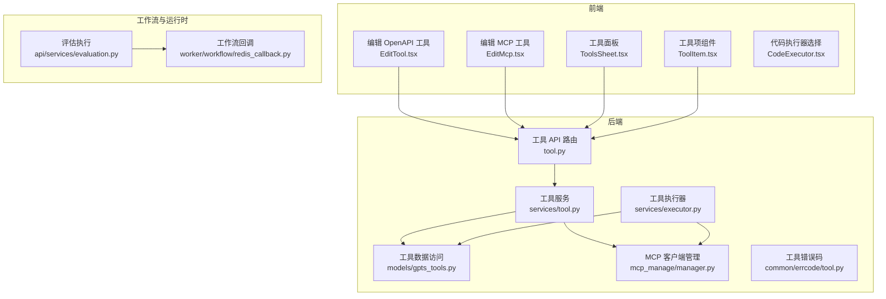
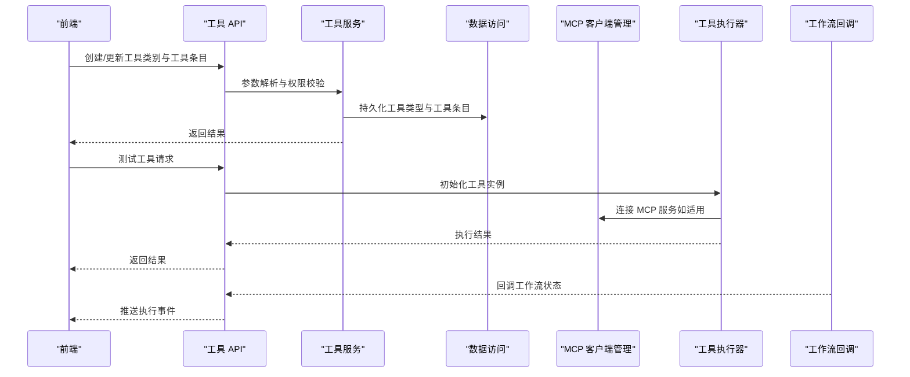
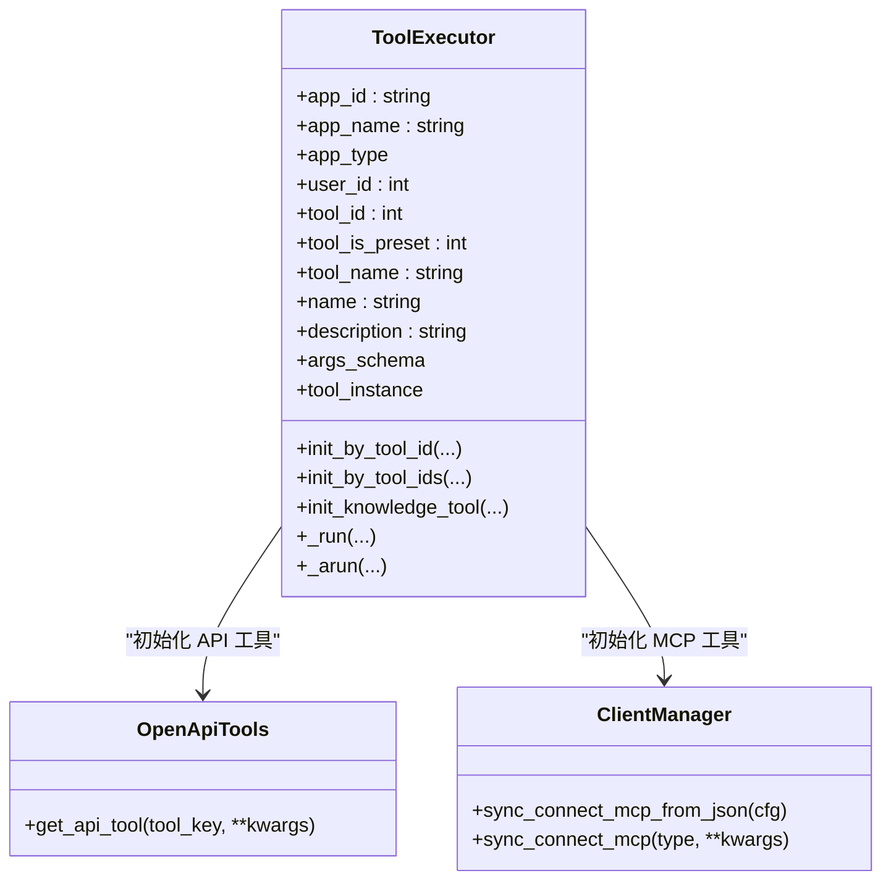
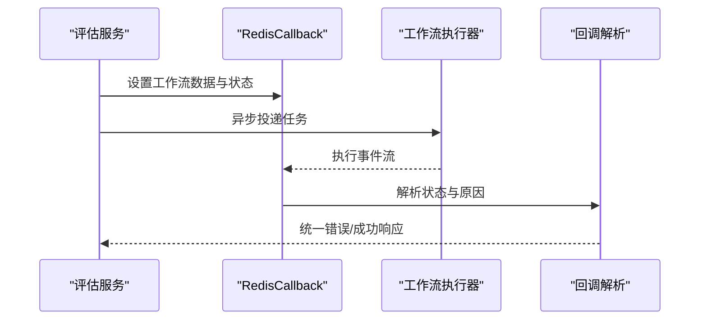
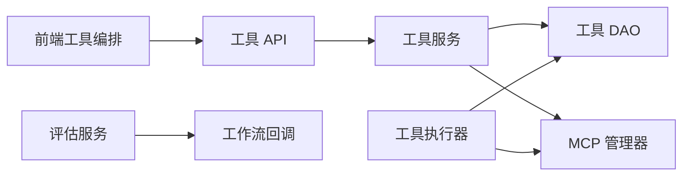

# 工具系统

<cite>
**本文引用的文件**
- [src/backend/bisheng/tool/api/tool.py](file://src/backend/bisheng/tool/api/tool.py)
- [src/backend/bisheng/tool/domain/schemas.py](file://src/backend/bisheng/tool/domain/schemas.py)
- [src/backend/bisheng/tool/domain/const.py](file://src/backend/bisheng/tool/domain/const.py)
- [src/backend/bisheng/tool/domain/models/gpts_tools.py](file://src/backend/bisheng/tool/domain/models/gpts_tools.py)
- [src/backend/bisheng/tool/domain/services/tool.py](file://src/backend/bisheng/tool/domain/services/tool.py)
- [src/backend/bisheng/tool/domain/services/executor.py](file://src/backend/bisheng/tool/domain/services/executor.py)
- [src/backend/bisheng/mcp_manage/manager.py](file://src/backend/bisheng/mcp_manage/manager.py)
- [src/backend/bisheng/common/errcode/tool.py](file://src/backend/bisheng/common/errcode/tool.py)
- [src/backend/bisheng/tool/domain/langchain/knowledge.py](file://src/backend/bisheng/tool/domain/langchain/knowledge.py)
- [src/backend/bisheng/tool/domain/langchain/linsight_knowledge.py](file://src/backend/bisheng/tool/domain/langchain/linsight_knowledge.py)
- [src/backend/bisheng_langchain/gpts/tools/code_interpreter/e2b_executor.py](file://src/backend/bisheng_langchain/gpts/tools/code_interpreter/e2b_executor.py)
- [src/frontend/platform/src/pages/BuildPage/tools/EditTool.tsx](file://src/frontend/platform/src/pages/BuildPage/tools/EditTool.tsx)
- [src/frontend/platform/src/pages/BuildPage/tools/EditMcp.tsx](file://src/frontend/platform/src/pages/BuildPage/tools/EditMcp.tsx)
- [src/frontend/platform/src/pages/BuildPage/tools/builtInTool/CodeExecutor.tsx](file://src/frontend/platform/src/pages/BuildPage/tools/builtInTool/CodeExecutor.tsx)
- [src/frontend/platform/src/components/bs-comp/sheets/ToolsSheet.tsx](file://src/frontend/platform/src/components/bs-comp/sheets/ToolsSheet.tsx)
- [src/frontend/client/src/components/Tools/ToolItem.tsx](file://src/frontend/client/src/components/Tools/ToolItem.tsx)
- [src/backend/bisheng/worker/workflow/redis_callback.py](file://src/backend/bisheng/worker/workflow/redis_callback.py)
- [src/backend/bisheng/api/services/evaluation.py](file://src/backend/bisheng/api/services/evaluation.py)
</cite>

## 目录
1. [简介](#简介)
2. [项目结构](#项目结构)
3. [核心组件](#核心组件)
4. [架构总览](#架构总览)
5. [详细组件分析](#详细组件分析)
6. [依赖分析](#依赖分析)
7. [性能考虑](#性能考虑)
8. [故障排查指南](#故障排查指南)
9. [结论](#结论)
10. [附录](#附录)

## 简介
本文件面向 Bisheng 工具系统，系统性阐述工具架构设计理念、工具注册与生命周期管理、工具分类与实现方式（内置工具、第三方工具集成、自定义工具开发）、工具执行的安全机制（沙箱隔离、权限控制、资源限制）、工具与工作流的集成方式（参数传递、结果处理、错误恢复），并提供工具开发最佳实践与扩展生态的指导。

## 项目结构
工具系统主要由后端 API 层、领域模型与服务层、执行器与 MCP 客户端、前端工具编排界面组成，并与工作流引擎、审计日志、遥测系统协同。

图表来源
- [src/backend/bisheng/tool/api/tool.py](file://src/backend/bisheng/tool/api/tool.py#L1-L132)
- [src/backend/bisheng/tool/domain/services/tool.py](file://src/backend/bisheng/tool/domain/services/tool.py#L1-L515)
- [src/backend/bisheng/tool/domain/services/executor.py](file://src/backend/bisheng/tool/domain/services/executor.py#L1-L305)
- [src/backend/bisheng/tool/domain/models/gpts_tools.py](file://src/backend/bisheng/tool/domain/models/gpts_tools.py#L1-L463)
- [src/backend/bisheng/mcp_manage/manager.py](file://src/backend/bisheng/mcp_manage/manager.py#L1-L56)
- [src/backend/bisheng/common/errcode/tool.py](file://src/backend/bisheng/common/errcode/tool.py#L1-L51)
- [src/frontend/platform/src/pages/BuildPage/tools/EditTool.tsx](file://src/frontend/platform/src/pages/BuildPage/tools/EditTool.tsx#L1-L301)
- [src/frontend/platform/src/pages/BuildPage/tools/EditMcp.tsx](file://src/frontend/platform/src/pages/BuildPage/tools/EditMcp.tsx#L255-L421)
- [src/frontend/platform/src/components/bs-comp/sheets/ToolsSheet.tsx](file://src/frontend/platform/src/components/bs-comp/sheets/ToolsSheet.tsx#L39-L59)
- [src/frontend/client/src/components/Tools/ToolItem.tsx](file://src/frontend/client/src/components/Tools/ToolItem.tsx#L1-L20)
- [src/backend/bisheng/api/services/evaluation.py](file://src/backend/bisheng/api/services/evaluation.py#L241-L258)
- [src/backend/bisheng/worker/workflow/redis_callback.py](file://src/backend/bisheng/worker/workflow/redis_callback.py#L156-L176)

章节来源
- [src/backend/bisheng/tool/api/tool.py](file://src/backend/bisheng/tool/api/tool.py#L1-L132)
- [src/backend/bisheng/tool/domain/services/tool.py](file://src/backend/bisheng/tool/domain/services/tool.py#L1-L515)
- [src/backend/bisheng/tool/domain/services/executor.py](file://src/backend/bisheng/tool/domain/services/executor.py#L1-L305)
- [src/backend/bisheng/tool/domain/models/gpts_tools.py](file://src/backend/bisheng/tool/domain/models/gpts_tools.py#L1-L463)
- [src/backend/bisheng/mcp_manage/manager.py](file://src/backend/bisheng/mcp_manage/manager.py#L1-L56)
- [src/backend/bisheng/common/errcode/tool.py](file://src/backend/bisheng/common/errcode/tool.py#L1-L51)
- [src/frontend/platform/src/pages/BuildPage/tools/EditTool.tsx](file://src/frontend/platform/src/pages/BuildPage/tools/EditTool.tsx#L1-L301)
- [src/frontend/platform/src/pages/BuildPage/tools/EditMcp.tsx](file://src/frontend/platform/src/pages/BuildPage/tools/EditMcp.tsx#L255-L421)
- [src/frontend/platform/src/components/bs-comp/sheets/ToolsSheet.tsx](file://src/frontend/platform/src/components/bs-comp/sheets/ToolsSheet.tsx#L39-L59)
- [src/frontend/client/src/components/Tools/ToolItem.tsx](file://src/frontend/client/src/components/Tools/ToolItem.tsx#L1-L20)
- [src/backend/bisheng/api/services/evaluation.py](file://src/backend/bisheng/api/services/evaluation.py#L241-L258)
- [src/backend/bisheng/worker/workflow/redis_callback.py](file://src/backend/bisheng/worker/workflow/redis_callback.py#L156-L176)

## 核心组件
- 工具 API 路由：提供工具列表查询、新增/更新/删除、配置更新、Schema 解析与测试、MCP 刷新等接口。
- 工具服务：负责工具可见性过滤、权限校验、Schema 解析（OpenAPI/MCP）、工具类型与工具条目的增删改、审计日志钩子、MCP 工具刷新。
- 工具执行器：封装 LangChain BaseTool，按工具类型（预置/自定义 API/MCP）动态初始化具体工具实例，统一记录调用遥测。
- 数据模型：持久化工具类别与工具条目，支持预置、API 自定义、MCP 三类，含敏感信息脱敏与额外配置存储。
- MCP 客户端管理：根据配置自动选择 SSE/STDIO/STREAMABLE 客户端连接 MCP 服务并列举工具。
- 前端工具编排：提供工具导入、编辑、测试、刷新、选择与拖拽排序等交互能力。
- 工作流与运行时：通过回调监听工具执行状态，支持评估任务触发与结果监听。

章节来源
- [src/backend/bisheng/tool/api/tool.py](file://src/backend/bisheng/tool/api/tool.py#L1-L132)
- [src/backend/bisheng/tool/domain/services/tool.py](file://src/backend/bisheng/tool/domain/services/tool.py#L1-L515)
- [src/backend/bisheng/tool/domain/services/executor.py](file://src/backend/bisheng/tool/domain/services/executor.py#L1-L305)
- [src/backend/bisheng/tool/domain/models/gpts_tools.py](file://src/backend/bisheng/tool/domain/models/gpts_tools.py#L1-L463)
- [src/backend/bisheng/mcp_manage/manager.py](file://src/backend/bisheng/mcp_manage/manager.py#L1-L56)

## 架构总览
工具系统采用“路由-服务-执行器-客户端/数据库”的分层架构，结合前端可视化编排与工作流回调，形成从“工具定义—工具加载—工具执行—结果反馈”的闭环。

图表来源
- [src/backend/bisheng/tool/api/tool.py](file://src/backend/bisheng/tool/api/tool.py#L1-L132)
- [src/backend/bisheng/tool/domain/services/tool.py](file://src/backend/bisheng/tool/domain/services/tool.py#L1-L515)
- [src/backend/bisheng/tool/domain/services/executor.py](file://src/backend/bisheng/tool/domain/services/executor.py#L1-L305)
- [src/backend/bisheng/mcp_manage/manager.py](file://src/backend/bisheng/mcp_manage/manager.py#L1-L56)
- [src/backend/bisheng/worker/workflow/redis_callback.py](file://src/backend/bisheng/worker/workflow/redis_callback.py#L156-L176)

## 详细组件分析

### 工具 API 与路由
- 提供工具列表、新增、更新、删除、配置更新、Schema 解析（OpenAPI/MCP）、测试、MCP 刷新、预设工具列表等接口。
- 对 OpenAPI Schema 支持从 URL 下载或直接上传；对 MCP Schema 支持解析并列举可用工具。
- 测试接口支持普通 API 工具与 MCP 工具的即时验证。

章节来源
- [src/backend/bisheng/tool/api/tool.py](file://src/backend/bisheng/tool/api/tool.py#L1-L132)

### 工具服务与权限控制
- 可见性与权限：根据用户身份与访问资源，返回可读/可写工具集合；管理员与创建者拥有写权限。
- Schema 解析：OpenAPI/MCP 解析失败抛出对应错误码；URL 需以 http/https 开头。
- 工具类型维护：新增/更新工具类型时进行名称长度与重复性校验；更新时支持增量变更与工具条目同步。
- 审计与钩子：新增/更新/删除工具类型均触发审计日志与组资源关联更新。
- MCP 刷新：批量刷新用户拥有的 MCP 工具类型，捕获异常并返回失败列表。

章节来源
- [src/backend/bisheng/tool/domain/services/tool.py](file://src/backend/bisheng/tool/domain/services/tool.py#L1-L515)
- [src/backend/bisheng/common/errcode/tool.py](file://src/backend/bisheng/common/errcode/tool.py#L1-L51)

### 工具数据模型与分类
- 工具类别（GptsToolsType）：包含名称、Logo、描述、服务器根地址、认证方式与密钥、OpenAPI/MCP Schema、额外配置等。
- 工具条目（GptsTools）：属于某个工具类别，包含工具键、描述、参数、额外配置等。
- 分类枚举（ToolPresetType）：预置（PRESET）、API 自定义（API）、MCP（MCP）。
- 认证枚举（AuthMethod/AuthType）：无认证、API Key；Basic、Bearer、Custom。
- 敏感信息脱敏：对预置工具的 extra 字段进行脱敏处理。

章节来源
- [src/backend/bisheng/tool/domain/models/gpts_tools.py](file://src/backend/bisheng/tool/domain/models/gpts_tools.py#L1-L463)
- [src/backend/bisheng/tool/domain/const.py](file://src/backend/bisheng/tool/domain/const.py#L1-L19)

### 工具执行器与生命周期
- 动态初始化：根据工具类型分别初始化预置工具、API 工具（OpenApiTools）与 MCP 工具（McpTool）。
- 参数解析：API 工具从工具与工具类别合并 extra，结合 server_host、认证方式与密钥生成工具参数；MCP 工具从输入 Schema 构造参数。
- 包装回调：统一注入 LangChain 的回调参数（config/run_manager），并记录调用遥测事件。
- 知识库工具：支持基于 Milvus/ES 向量检索的知识库工具初始化。

图表来源
- [src/backend/bisheng/tool/domain/services/executor.py](file://src/backend/bisheng/tool/domain/services/executor.py#L1-L305)
- [src/backend/bisheng/mcp_manage/manager.py](file://src/backend/bisheng/mcp_manage/manager.py#L1-L56)

章节来源
- [src/backend/bisheng/tool/domain/services/executor.py](file://src/backend/bisheng/tool/domain/services/executor.py#L1-L305)

### MCP 客户端管理
- 根据配置自动识别客户端类型（SSE/STDIO/STREAMABLE），解析首个 mcpServers 条目并建立连接。
- 支持异步/同步两种连接方式，便于在不同上下文中使用。

章节来源
- [src/backend/bisheng/mcp_manage/manager.py](file://src/backend/bisheng/mcp_manage/manager.py#L1-L56)

### 前端工具编排与交互
- 编辑 OpenAPI 工具：支持从 URL 导入 Schema、填写认证信息、参数位置与名称、保存与测试。
- 编辑 MCP 工具：粘贴 MCP 配置，解析并列出可用工具，支持保存与刷新。
- 工具面板：支持默认内置工具与自定义工具切换、搜索、添加/移除工具、拖拽排序。
- 工具项组件：点击安装/卸载工具，统一入口管理。

章节来源
- [src/frontend/platform/src/pages/BuildPage/tools/EditTool.tsx](file://src/frontend/platform/src/pages/BuildPage/tools/EditTool.tsx#L1-L301)
- [src/frontend/platform/src/pages/BuildPage/tools/EditMcp.tsx](file://src/frontend/platform/src/pages/BuildPage/tools/EditMcp.tsx#L255-L421)
- [src/frontend/platform/src/components/bs-comp/sheets/ToolsSheet.tsx](file://src/frontend/platform/src/components/bs-comp/sheets/ToolsSheet.tsx#L39-L59)
- [src/frontend/client/src/components/Tools/ToolItem.tsx](file://src/frontend/client/src/components/Tools/ToolItem.tsx#L1-L20)

### 工具执行的安全机制
- 认证与授权：工具类别支持 Basic/Bearer/Custom 认证方式与 API Key；前端表单对参数长度与必填项进行校验；服务端对写权限进行访问控制。
- Schema 校验：OpenAPI/MCP Schema 必须可解析且 URL 以 http/https 开头；解析失败抛出明确错误码。
- 沙箱执行（代码解释器）：E2B 沙箱支持可复用沙箱与一次性沙箱模式，输出 stdout/stderr/error 与文件列表，避免直接执行宿主环境命令。
- 资源限制：通过外部沙箱与客户端类型选择实现资源隔离；MCP 工具调用受客户端连接与服务端超时控制影响。

章节来源
- [src/backend/bisheng/tool/domain/const.py](file://src/backend/bisheng/tool/domain/const.py#L1-L19)
- [src/backend/bisheng/tool/domain/services/tool.py](file://src/backend/bisheng/tool/domain/services/tool.py#L176-L266)
- [src/backend/bisheng_langchain/gpts/tools/code_interpreter/e2b_executor.py](file://src/backend/bisheng_langchain/gpts/tools/code_interpreter/e2b_executor.py#L39-L98)

### 工具与工作流的集成
- 评估任务触发：通过评估服务初始化工作流，设置 WAITING 状态并投递到队列节点，监听回调事件。
- 回调解析：根据回调原因解析失败场景（重试次数超限、等待用户输入超时、节点参数错误、版本更新等），构建统一错误响应。
- 结果处理：同步轮询回调事件，提取最终输入事件作为答案。

图表来源
- [src/backend/bisheng/api/services/evaluation.py](file://src/backend/bisheng/api/services/evaluation.py#L241-L258)
- [src/backend/bisheng/worker/workflow/redis_callback.py](file://src/backend/bisheng/worker/workflow/redis_callback.py#L156-L176)

章节来源
- [src/backend/bisheng/api/services/evaluation.py](file://src/backend/bisheng/api/services/evaluation.py#L241-L258)
- [src/backend/bisheng/worker/workflow/redis_callback.py](file://src/backend/bisheng/worker/workflow/redis_callback.py#L156-L176)

### 工具开发最佳实践
- 接口设计
  - 使用统一的工具类型与工具条目模型，确保工具元数据与参数规范一致。
  - 对外暴露清晰的 Schema（OpenAPI/MCP），便于前端可视化导入与测试。
- 错误处理
  - 明确错误码与异常路径，前端与后端协同给出可读提示。
  - 对 URL 下载、Schema 解析、MCP 连接等关键步骤增加兜底与重试策略。
- 性能优化
  - 复用沙箱与 MCP 客户端，减少频繁初始化开销。
  - 对工具列表与类型查询进行分页与缓存，降低数据库压力。
- 安全
  - 对预置工具的 extra 字段进行脱敏存储与传输。
  - 严格校验认证参数与 URL 规范，避免越权与注入风险。

## 依赖分析
工具系统各模块之间耦合度适中，API 层仅依赖服务层；服务层依赖 DAO 与 MCP 管理器；执行器依赖服务层与 MCP 管理器；前端通过 API 与服务层交互。

图表来源
- [src/backend/bisheng/tool/api/tool.py](file://src/backend/bisheng/tool/api/tool.py#L1-L132)
- [src/backend/bisheng/tool/domain/services/tool.py](file://src/backend/bisheng/tool/domain/services/tool.py#L1-L515)
- [src/backend/bisheng/tool/domain/services/executor.py](file://src/backend/bisheng/tool/domain/services/executor.py#L1-L305)
- [src/backend/bisheng/mcp_manage/manager.py](file://src/backend/bisheng/mcp_manage/manager.py#L1-L56)
- [src/backend/bisheng/api/services/evaluation.py](file://src/backend/bisheng/api/services/evaluation.py#L241-L258)
- [src/backend/bisheng/worker/workflow/redis_callback.py](file://src/backend/bisheng/worker/workflow/redis_callback.py#L156-L176)

章节来源
- [src/backend/bisheng/tool/api/tool.py](file://src/backend/bisheng/tool/api/tool.py#L1-L132)
- [src/backend/bisheng/tool/domain/services/tool.py](file://src/backend/bisheng/tool/domain/services/tool.py#L1-L515)
- [src/backend/bisheng/tool/domain/services/executor.py](file://src/backend/bisheng/tool/domain/services/executor.py#L1-L305)
- [src/backend/bisheng/mcp_manage/manager.py](file://src/backend/bisheng/mcp_manage/manager.py#L1-L56)
- [src/backend/bisheng/api/services/evaluation.py](file://src/backend/bisheng/api/services/evaluation.py#L241-L258)
- [src/backend/bisheng/worker/workflow/redis_callback.py](file://src/backend/bisheng/worker/workflow/redis_callback.py#L156-L176)

## 性能考虑
- 工具初始化批量化：通过工具 ID 列表批量加载工具与类型映射，减少多次数据库查询。
- 执行回调与遥测：统一包装工具执行，减少重复样板代码，提升可观测性。
- 沙箱与 MCP 复用：在需要时保持沙箱与 MCP 客户端长连接，降低冷启动成本。
- 前端渲染优化：工具面板支持搜索与分页，避免一次性渲染大量工具项。

## 故障排查指南
- 工具 Schema 解析失败
  - 检查是否为合法 JSON/YAML；确认 URL 以 http/https 开头；查看对应错误码定位问题。
- MCP 工具刷新失败
  - 查看刷新返回的失败列表，逐项检查 MCP 服务连通性与配置正确性。
- 工具测试报错
  - 核对认证方式与密钥、参数位置与名称、请求参数格式；必要时在前端“测试”功能中逐步验证。
- 工作流执行异常
  - 关注回调解析中的错误类型（超限、超时、参数错误、版本更新），根据提示修复工作流节点或参数。

章节来源
- [src/backend/bisheng/common/errcode/tool.py](file://src/backend/bisheng/common/errcode/tool.py#L1-L51)
- [src/backend/bisheng/tool/domain/services/tool.py](file://src/backend/bisheng/tool/domain/services/tool.py#L379-L420)
- [src/backend/bisheng/worker/workflow/redis_callback.py](file://src/backend/bisheng/worker/workflow/redis_callback.py#L156-L176)

## 结论
Bisheng 工具系统通过清晰的分层设计与标准化的工具类型/Schema，实现了内置工具、第三方工具（OpenAPI/MCP）与自定义工具的统一管理与执行。配合前端可视化编排、工作流回调与遥测审计，形成了从“定义—加载—执行—反馈”的完整闭环。建议在实际落地中重点关注 Schema 规范、认证与授权、沙箱与客户端复用、以及错误与可观测性的完善。

## 附录
- 工具类型与工具条目字段参考：名称、Logo、描述、工具键、类别、是否预置、额外配置、认证方式与密钥、OpenAPI/MCP Schema 等。
- 前端工具面板支持：默认内置工具与自定义工具切换、搜索、添加/移除、拖拽排序；代码执行器支持本地与 E2B 沙箱模式选择。
- 知识库工具：支持基于 Milvus/ES 的向量检索工具初始化，便于在工作流中组合使用。