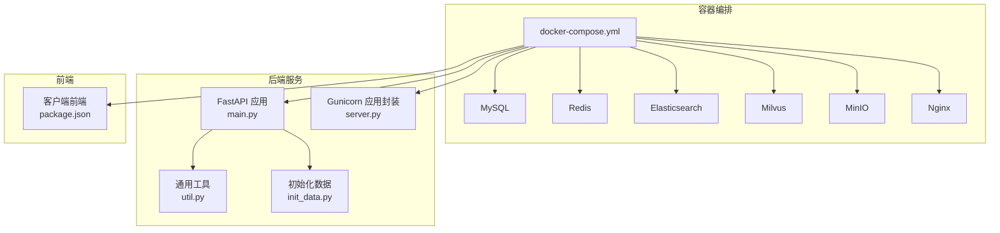
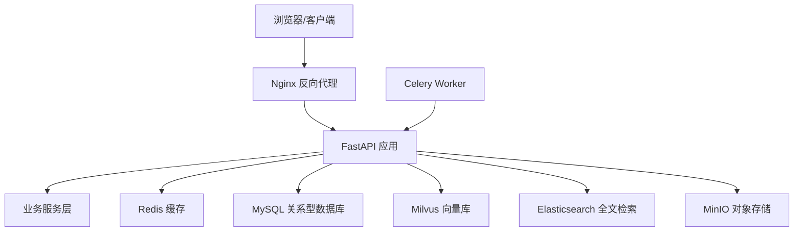
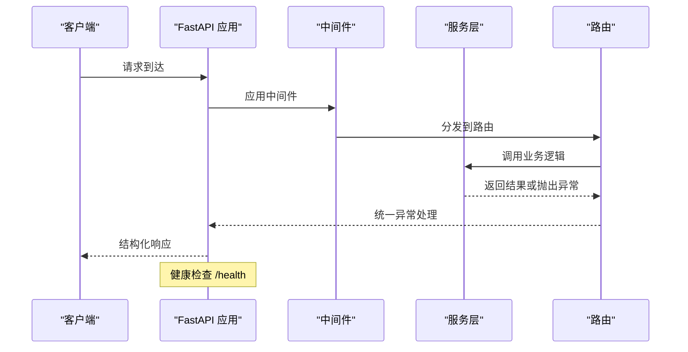
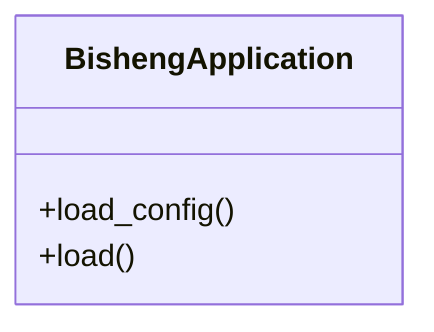
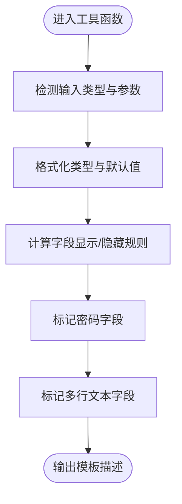
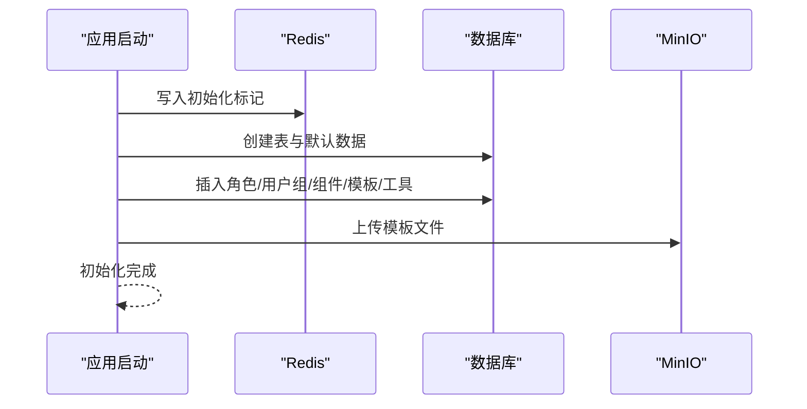
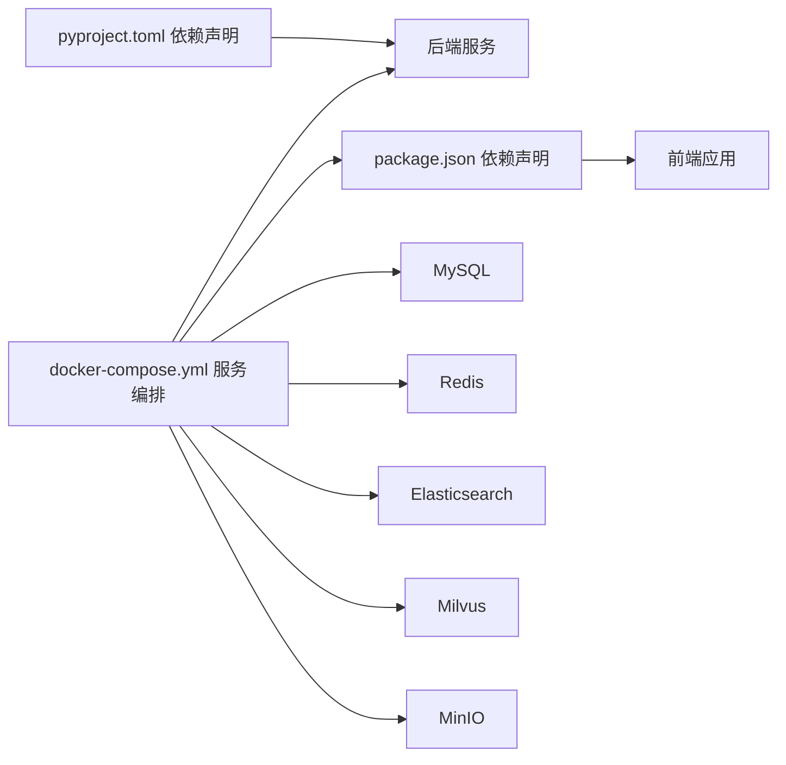

# 开发者指南

<cite>
**本文引用的文件**
- [README.md](file://README.md)
- [docker-compose.yml](file://docker/docker-compose.yml)
- [pyproject.toml](file://src/backend/pyproject.toml)
- [main.py](file://src/backend/bisheng/main.py)
- [server.py](file://src/backend/bisheng/server.py)
- [util.py](file://src/backend/bisheng/utils/util.py)
- [init_data.py](file://src/backend/bisheng/common/init_data.py)
- [package.json（前端客户端）](file://src/frontend/client/package.json)
- [ci.yml](file://.github/workflows/ci.yml)
- [CODE_OF_CONDUCT.md](file://CODE_OF_CONDUCT.md)
</cite>

## 目录
1. [简介](#简介)
2. [项目结构](#项目结构)
3. [核心组件](#核心组件)
4. [架构总览](#架构总览)
5. [详细组件分析](#详细组件分析)
6. [依赖关系分析](#依赖关系分析)
7. [性能与可维护性建议](#性能与可维护性建议)
8. [调试与开发工具指南](#调试与开发工具指南)
9. [贡献流程与规范](#贡献流程与规范)
10. [故障排查](#故障排查)
11. [结语](#结语)

## 简介
本指南面向希望参与 Bisheng 项目的开发者，覆盖从环境搭建、代码规范、贡献流程到调试与性能优化的全流程。Bisheng 是面向企业场景的大模型应用 DevOps 平台，采用前后端分离架构，后端基于 FastAPI，前端基于 React/Vite，并通过 Docker Compose 提供一键部署能力。

## 项目结构
项目采用多模块分层组织：
- 后端（Python/FastAPI）：位于 src/backend，包含 API、服务层、领域模型、工具与缓存等子模块。
- 前端（React/Vite）：位于 src/frontend，包含客户端与平台端两套前端工程。
- 容器编排：位于 docker，提供 MySQL、Redis、Elasticsearch、Milvus、MinIO 等依赖服务的编排。
- 工作流与 CI：位于 .github/workflows，定义构建与发布流水线。

图表来源
- [docker-compose.yml](file://docker/docker-compose.yml#L1-L201)
- [main.py](file://src/backend/bisheng/main.py#L1-L113)
- [server.py](file://src/backend/bisheng/server.py#L1-L21)
- [util.py](file://src/backend/bisheng/utils/util.py#L1-L558)
- [init_data.py](file://src/backend/bisheng/common/init_data.py#L1-L174)
- [package.json（前端客户端）](file://src/frontend/client/package.json#L1-L157)

章节来源
- [README.md](file://README.md#L60-L87)
- [docker-compose.yml](file://docker/docker-compose.yml#L1-L201)

## 核心组件
- 应用入口与生命周期：后端通过 FastAPI 应用入口创建应用，注册中间件、异常处理器与路由，并在 lifespan 中完成上下文初始化、服务初始化与默认数据注入。
- 服务封装：提供 Gunicorn 应用封装类，便于以生产方式启动服务。
- 工具库：提供模板构建、类型格式化、重试装饰器、MD5 计算、文件读取与压缩等通用能力。
- 初始化流程：在首次启动时写入 Redis 标记，创建数据库表、角色权限、用户组、默认组件与模板、预置工具与分类，并上传模板文件至 MinIO。

章节来源
- [main.py](file://src/backend/bisheng/main.py#L64-L113)
- [server.py](file://src/backend/bisheng/server.py#L4-L21)
- [util.py](file://src/backend/bisheng/utils/util.py#L22-L324)
- [init_data.py](file://src/backend/bisheng/common/init_data.py#L26-L151)

## 架构总览
后端采用 FastAPI + Uvicorn/Gunicorn 的组合，结合 Celery 异步任务；前端通过 Vite 构建，Nginx 作为反向代理。容器编排统一管理数据库、缓存、搜索引擎、向量库与对象存储。

图表来源
- [docker-compose.yml](file://docker/docker-compose.yml#L41-L123)
- [main.py](file://src/backend/bisheng/main.py#L67-L102)

## 详细组件分析

### 后端应用与中间件
- 异常处理：统一处理 HTTP 异常、请求验证错误与业务错误码，返回结构化的响应。
- 中间件：启用 CORS、自定义中间件与 WebSocket 日志中间件。
- 生命周期：在 lifespan 钩子中完成上下文初始化、服务初始化、默认数据注入、清理资源与线程池关闭。
- 健康检查：提供 /health 接口用于健康探测。

图表来源
- [main.py](file://src/backend/bisheng/main.py#L21-L102)

章节来源
- [main.py](file://src/backend/bisheng/main.py#L21-L102)

### 服务封装与启动
- Gunicorn 封装类：通过继承 BaseApplication，按需设置配置项并加载应用实例，便于生产部署。
- 生产启动：后端支持以 Uvicorn 单进程或 Gunicorn 多进程方式运行。

图表来源
- [server.py](file://src/backend/bisheng/server.py#L4-L21)

章节来源
- [server.py](file://src/backend/bisheng/server.py#L4-L21)

### 工具库与通用能力
- 模板构建：根据函数/类/方法签名生成前端可用的模板描述与字段元数据。
- 类型与默认值处理：对可选类型、列表、映射等进行格式化，自动识别必填字段与密码字段。
- 重试机制：提供同步与异步重试装饰器，支持延迟与异常返回策略。
- 文件与压缩：支持大文件 MD5 计算、目录遍历与 ZIP 打包。

图表来源
- [util.py](file://src/backend/bisheng/utils/util.py#L22-L324)

章节来源
- [util.py](file://src/backend/bisheng/utils/util.py#L22-L324)

### 初始化流程与默认数据
- 初始化顺序：Redis 标记去重 -> 创建数据库表 -> 角色与权限 -> 用户组 -> 默认用户 -> 组件与模板 -> 预置工具与分类 -> 配置初始化 -> 仪表盘数据。
- MinIO 模板文件上传：为工作流报告生成准备模板文档。

图表来源
- [init_data.py](file://src/backend/bisheng/common/init_data.py#L26-L151)

章节来源
- [init_data.py](file://src/backend/bisheng/common/init_data.py#L26-L151)

## 依赖关系分析
- 后端依赖：FastAPI、Celery、Redis、SQLModel、Alembic、LangChain 生态、向量库与全文检索客户端、MinIO、OpenAI 等。
- 前端依赖：React、Vite、TailwindCSS、TanStack React Query、i18n、PDF/Markdown 渲染等。
- 容器编排：MySQL、Redis、Elasticsearch、Milvus、MinIO、Nginx，以及后端与 Celery Worker 服务。

图表来源
- [pyproject.toml](file://src/backend/pyproject.toml#L1-L87)
- [package.json（前端客户端）](file://src/frontend/client/package.json#L1-L157)
- [docker-compose.yml](file://docker/docker-compose.yml#L1-L201)

章节来源
- [pyproject.toml](file://src/backend/pyproject.toml#L1-L87)
- [package.json（前端客户端）](file://src/frontend/client/package.json#L1-L157)
- [docker-compose.yml](file://docker/docker-compose.yml#L1-L201)

## 性能与可维护性建议
- 异步与并发：优先使用异步 I/O 与线程池，避免阻塞；对大文件处理使用异步流式读取。
- 缓存策略：合理利用 Redis 缓存热点数据，减少重复计算与数据库压力。
- 重试与熔断：对外部调用使用指数退避重试，必要时引入熔断与超时控制。
- 日志与追踪：开启结构化日志与链路追踪，定位性能瓶颈与异常根因。
- 数据库：使用 SQLModel 进行模型定义与迁移，避免复杂 SQL；索引与查询计划定期审查。
- 前端：按需加载与懒加载组件，减少首屏体积；使用 React Query 缓存与预取策略。

## 调试与开发工具指南
- 后端调试
  - 使用 Uvicorn 在本地快速启动，开启 debug 模式查看内存分配与异常堆栈。
  - 在异常处理器中捕获未处理异常，确保返回一致的错误结构。
  - 利用中间件记录请求与 WebSocket 事件，辅助定位问题。
- 前端调试
  - 使用 Vite 的热更新与源码映射，结合浏览器开发者工具定位问题。
  - Jest 单测与 React Testing Library 进行组件级测试。
- 容器与集成
  - 通过 docker-compose 启动完整栈，访问 http://localhost:3001 进行端到端验证。
  - 使用 Nginx 日志与后端健康检查接口判断服务状态。

章节来源
- [main.py](file://src/backend/bisheng/main.py#L77-L102)
- [docker-compose.yml](file://docker/docker-compose.yml#L79-L123)

## 贡献流程与规范
- 行为准则
  - 遵循社区行为准则，保持尊重与包容，禁止骚扰与歧视性言论。
- 分支与提交
  - 建议采用特性分支开发，提交信息清晰描述变更内容与动机。
- Pull Request
  - PR 需附带变更说明、影响范围评估与测试结果；至少一名维护者审核通过后合并。
- 代码质量
  - 遵循统一的编码风格与注释规范；新增功能必须配套单元测试与集成测试。
- 发布与 CI
  - CI 流水线负责构建与推送多平台镜像，确保构建产物一致性。

章节来源
- [CODE_OF_CONDUCT.md](file://CODE_OF_CONDUCT.md#L1-L126)
- [ci.yml](file://.github/workflows/ci.yml#L1-L188)

## 故障排查
- 启动失败
  - 检查容器健康检查与端口占用；确认数据库连接字符串与凭据正确。
- 权限与初始化
  - 若角色/用户组未创建，确认初始化标记是否被正确写入与释放。
- 外部服务
  - 对接 OpenAI、MinIO、Elasticsearch 时，核对网络连通与认证配置。
- 日志与追踪
  - 查看后端异常处理器输出与中间件日志，定位具体错误位置。

章节来源
- [docker-compose.yml](file://docker/docker-compose.yml#L15-L201)
- [init_data.py](file://src/backend/bisheng/common/init_data.py#L26-L151)
- [main.py](file://src/backend/bisheng/main.py#L21-L102)

## 结语
本指南提供了从环境搭建到贡献落地的完整路径。建议新开发者先从 docker-compose 快速跑通全栈，再逐步深入后端服务与前端工程，最后参与 CI/CD 与测试体系完善，共同提升 Bisheng 的稳定性与可扩展性。