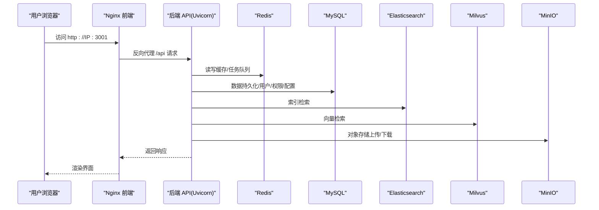
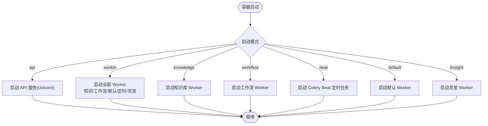
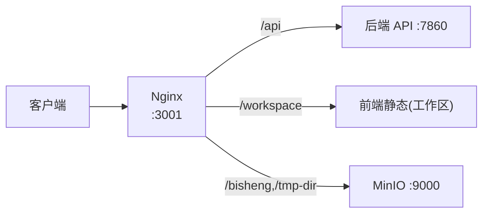
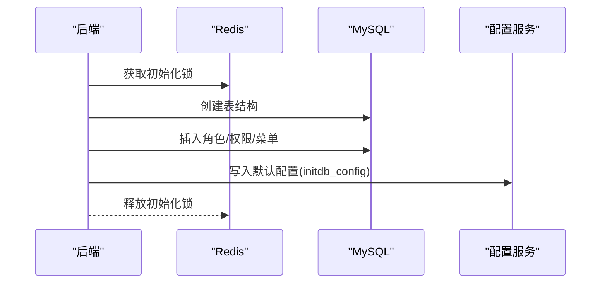
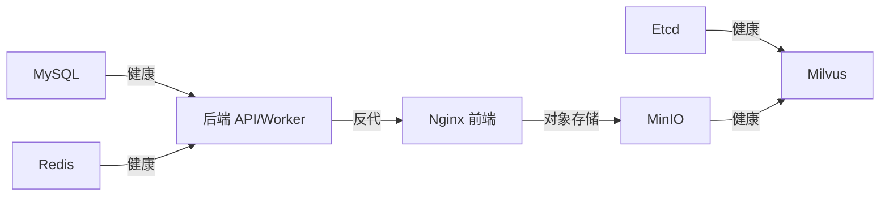

# 快速开始

<cite>
**本文引用的文件**
- [README.md](file://README.md)
- [docker-compose.yml](file://docker/docker-compose.yml)
- [config.yaml](file://docker/bisheng/config/config.yaml)
- [entrypoint.sh](file://docker/bisheng/entrypoint.sh)
- [nginx.conf](file://docker/nginx/nginx.conf)
- [default.conf](file://docker/nginx/conf.d/default.conf)
- [my.cnf](file://docker/mysql/conf/my.cnf)
- [redis.conf](file://docker/redis/redis.conf)
- [Dockerfile（后端）](file://src/backend/Dockerfile)
- [Dockerfile（前端）](file://src/frontend/Dockerfile)
- [initdb_config.yaml](file://src/backend/bisheng/initdb_config.yaml)
- [config_service.py](file://src/backend/bisheng/common/services/config_service.py)
- [examples.py](file://src/backend/bisheng/core/context/examples.py)
</cite>

## 目录
1. [简介](#简介)
2. [项目结构](#项目结构)
3. [核心组件](#核心组件)
4. [架构总览](#架构总览)
5. [详细组件分析](#详细组件分析)
6. [依赖关系分析](#依赖关系分析)
7. [性能与资源建议](#性能与资源建议)
8. [首次启动与基础配置](#首次启动与基础配置)
9. [常见问题排查](#常见问题排查)
10. [结论](#结论)

## 简介
本指南面向希望快速部署并运行 Bisheng 平台的用户，覆盖安装前置条件、系统准备、下载与安装步骤、首次启动与基础配置，以及常见问题排查。平台采用多容器编排，包含后端 API、前端静态站点、数据库、缓存、向量检索、对象存储与文档在线预览等组件。

## 项目结构
- 后端服务：基于 Python 的 FastAPI 应用，通过 Uvicorn 提供 API，并配合 Celery Worker 处理异步任务。
- 前端服务：基于 Nginx 提供静态资源与反向代理，统一暴露 3001 端口。
- 数据与缓存：MySQL、Redis、Elasticsearch、Milvus、MinIO。
- 配置与入口：Compose 文件定义服务与端口映射；后端入口脚本负责启动 API 或各类 Worker；前端 Dockerfile 构建静态站点并复制至 Nginx。

```mermaid
graph TB
subgraph "宿主机"
Browser["浏览器<br/>端口 3001"]
end
subgraph "容器编排"
FE["Nginx 前端<br/>:3001 -> /api -> backend:7860"]
BE["后端 API<br/>Uvicorn:7860"]
BK["后端 Worker<br/>Celery"]
MySQL["MySQL 8.0<br/>:3306"]
Redis["Redis 7.0<br/>:6379"]
ES["Elasticsearch<br/>:9200/9300"]
MinIO["MinIO 对象存储<br/>:9000/9001"]
Milvus["Milvus Standalone<br/>:19530/9091"]
Etcd["Etcd<br/>:2379"]
end
Browser --> FE --> BE
BE <- --> MySQL
BE <- --> Redis
BE --> ES
BE --> MinIO
BE --> Milvus
BE -.-> BK
Milvus --- Etcd
FE --> MinIO
```

图表来源
- [docker-compose.yml](file://docker/docker-compose.yml#L1-L201)
- [nginx.conf](file://docker/nginx/nginx.conf#L1-L32)
- [default.conf](file://docker/nginx/conf.d/default.conf#L1-L65)
- [entrypoint.sh](file://docker/bisheng/entrypoint.sh#L1-L67)

章节来源
- [docker-compose.yml](file://docker/docker-compose.yml#L1-L201)
- [nginx.conf](file://docker/nginx/nginx.conf#L1-L32)
- [default.conf](file://docker/nginx/conf.d/default.conf#L1-L65)
- [entrypoint.sh](file://docker/bisheng/entrypoint.sh#L1-L67)

## 核心组件
- 后端 API 服务：提供 REST 接口与健康检查，监听 7860 端口。
- 后端 Worker：处理知识库、工作流、灵思等异步任务，支持多队列与定时任务。
- 前端 Nginx：反向代理 /api 到后端，静态资源托管，WebSocket 支持。
- 数据与缓存：MySQL、Redis、Elasticsearch、Milvus、MinIO。
- 配置中心：后端配置文件集中管理数据库、缓存、向量存储、对象存储、日志等。

章节来源
- [config.yaml](file://docker/bisheng/config/config.yaml#L1-L88)
- [entrypoint.sh](file://docker/bisheng/entrypoint.sh#L1-L67)
- [docker-compose.yml](file://docker/docker-compose.yml#L1-L201)

## 架构总览
下图展示从浏览器到后端 API、再到数据库与外部组件的数据流与交互关系。



图表来源
- [docker-compose.yml](file://docker/docker-compose.yml#L1-L201)
- [default.conf](file://docker/nginx/conf.d/default.conf#L46-L59)
- [config.yaml](file://docker/bisheng/config/config.yaml#L34-L57)

## 详细组件分析

### 后端 API 与 Worker
- 启动模式：入口脚本支持 api、worker、knowledge、workflow、beat、default、linsight 等模式，通过命令行参数选择。
- API 服务：使用 Uvicorn 启动，多进程以提升并发能力。
- Worker：按队列拆分任务类型，分别处理知识库、工作流、默认任务与定时任务；同时启动灵思 Worker。



图表来源
- [entrypoint.sh](file://docker/bisheng/entrypoint.sh#L32-L66)

章节来源
- [entrypoint.sh](file://docker/bisheng/entrypoint.sh#L1-L67)

### 前端 Nginx 配置
- 监听 3001 端口，静态资源分别指向平台与工作区。
- /api 路径转发到后端 7860 端口，启用 WebSocket 升级头。
- /workspace 与 /bisheng、/tmp-dir 路径转发到 MinIO。



图表来源
- [default.conf](file://docker/nginx/conf.d/default.conf#L19-L65)

章节来源
- [nginx.conf](file://docker/nginx/nginx.conf#L1-L32)
- [default.conf](file://docker/nginx/conf.d/default.conf#L1-L65)

### 数据库与缓存初始化
- MySQL：字符集与排序规则配置，健康检查。
- Redis：默认关闭保护模式以便本地开发，可根据需要调整。
- 初始化流程：首次启动后端会创建数据库表、角色与默认菜单权限，并写入系统配置。



图表来源
- [my.cnf](file://docker/mysql/conf/my.cnf#L1-L13)
- [redis.conf](file://docker/redis/redis.conf#L111-L111)
- [initdb_config.yaml](file://src/backend/bisheng/initdb_config.yaml#L1-L81)
- [config_service.py](file://src/backend/bisheng/common/services/config_service.py#L107-L123)

章节来源
- [my.cnf](file://docker/mysql/conf/my.cnf#L1-L13)
- [redis.conf](file://docker/redis/redis.conf#L111-L111)
- [initdb_config.yaml](file://src/backend/bisheng/initdb_config.yaml#L1-L81)
- [config_service.py](file://src/backend/bisheng/common/services/config_service.py#L107-L123)

## 依赖关系分析
- Compose 服务间依赖：后端 API 与 Worker 依赖 MySQL 与 Redis 健康；前端依赖后端；Milvus 依赖 Etcd 与 MinIO。
- 环境变量：后端通过环境变量注入 Milvus、ES、MinIO 等连接参数，避免硬编码。
- 健康检查：各服务均配置健康检查，确保容器状态稳定。



图表来源
- [docker-compose.yml](file://docker/docker-compose.yml#L73-L77)
- [docker-compose.yml](file://docker/docker-compose.yml#L150-L154)
- [docker-compose.yml](file://docker/docker-compose.yml#L189-L194)

章节来源
- [docker-compose.yml](file://docker/docker-compose.yml#L1-L201)

## 性能与资源建议
- 硬件建议：最低 4 核虚拟 CPU、16 GB 内存；推荐 18 虚拟核、48 GB 内存。
- Docker 与 Compose：Docker 19.03.9+，Docker Compose 1.25.1+。
- 端口占用：3001（前端）、3306（MySQL）、6379（Redis）、9200/9300（ES）、9000/9001（MinIO）、19530/9091（Milvus）、2379（Etcd）。
- 网络与安全：确保宿主机防火墙放行上述端口；生产环境建议开启 TLS 与访问控制。

章节来源
- [README.md](file://README.md#L60-L66)
- [docker-compose.yml](file://docker/docker-compose.yml#L6-L21)
- [docker-compose.yml](file://docker/docker-compose.yml#L128-L135)
- [docker-compose.yml](file://docker/docker-compose.yml#L162-L169)
- [docker-compose.yml](file://docker/docker-compose.yml#L195-L198)

## 首次启动与基础配置

### 步骤 1：准备系统与环境
- 安装并启动 Docker 与 Docker Compose。
- 准备至少 16 GB 内存与 4 核 CPU；推荐更高规格。
- 开放必要端口（3001、3306、6379、9200、9000、9001、19530、9091、2379）。

章节来源
- [README.md](file://README.md#L60-L66)

### 步骤 2：下载与进入安装目录
- 使用 Git 克隆仓库或下载 ZIP 包，进入 docker 目录。

章节来源
- [README.md](file://README.md#L67-L77)

### 步骤 3：启动服务
- 执行 Compose 命令启动所有服务。

章节来源
- [README.md](file://README.md#L78-L81)
- [docker-compose.yml](file://docker/docker-compose.yml#L80-L81)

### 步骤 4：访问与注册
- 浏览器访问 http://IP:3001，出现登录页后进行用户注册。
- 首个注册用户将成为系统管理员。

章节来源
- [README.md](file://README.md#L82-L84)

### 步骤 5：基础配置
- 数据库连接：后端配置文件中包含数据库 URL，如需修改密码请同步更新。
- 缓存与队列：Redis 地址与队列路由已内置，可按需扩展。
- 向量与索引：Milvus 与 Elasticsearch 地址通过环境变量注入，MinIO 作为对象存储。
- 日志：后端日志输出到容器内指定路径，便于排查。

章节来源
- [config.yaml](file://docker/bisheng/config/config.yaml#L1-L88)
- [docker-compose.yml](file://docker/docker-compose.yml#L48-L58)
- [docker-compose.yml](file://docker/docker-compose.yml#L124-L135)
- [docker-compose.yml](file://docker/docker-compose.yml#L156-L169)
- [docker-compose.yml](file://docker/docker-compose.yml#L176-L198)

## 常见问题排查

- 无法访问前端页面
  - 检查 Nginx 是否正常，确认 3001 端口未被占用。
  - 查看 Nginx 配置是否正确转发 /api 到后端。
  - 参考：[default.conf](file://docker/nginx/conf.d/default.conf#L46-L59)

- 后端 API 无法启动或健康检查失败
  - 确认 MySQL 与 Redis 已健康运行。
  - 检查后端日志与健康检查命令。
  - 参考：[docker-compose.yml](file://docker/docker-compose.yml#L67-L72)

- 数据库初始化异常
  - 首次启动后端会创建表与默认配置；若失败，检查 Redis 锁与数据库权限。
  - 参考：[config_service.py](file://src/backend/bisheng/common/services/config_service.py#L107-L123)，[examples.py](file://src/backend/bisheng/core/context/examples.py#L150-L185)

- Redis 保护模式导致连接问题
  - 默认配置关闭了保护模式以便本地开发；生产环境建议开启并设置密码。
  - 参考：[redis.conf](file://docker/redis/redis.conf#L111-L111)

- MySQL 字符集与排序规则
  - 确保字符集为 utf8mb4，排序规则为 utf8mb4_unicode_ci。
  - 参考：[my.cnf](file://docker/mysql/conf/my.cnf#L7-L12)

- 对象存储与文档预览
  - MinIO 默认凭据与端口映射；如需变更，请同步更新后端配置。
  - 参考：[docker-compose.yml](file://docker/docker-compose.yml#L156-L169)，[config.yaml](file://docker/bisheng/config/config.yaml#L44-L57)

- 健康检查与依赖顺序
  - 后端依赖 MySQL 与 Redis 健康；Milvus 依赖 Etcd 与 MinIO。
  - 参考：[docker-compose.yml](file://docker/docker-compose.yml#L73-L77)，[docker-compose.yml](file://docker/docker-compose.yml#L189-L194)

## 结论
通过本指南，您可以在满足硬件与软件前置条件的前提下，使用 Docker Compose 快速完成 Bisheng 平台的部署。首次启动后，访问前端页面完成用户注册与初始配置。遇到问题时，可依据健康检查、日志与配置文件定位根因。生产环境建议进一步加固网络与安全策略，并根据业务规模调整资源配额。