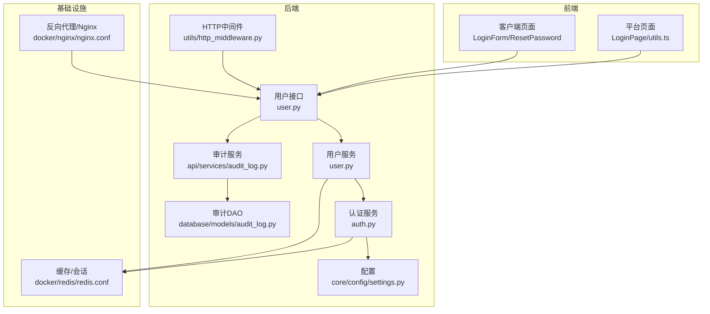
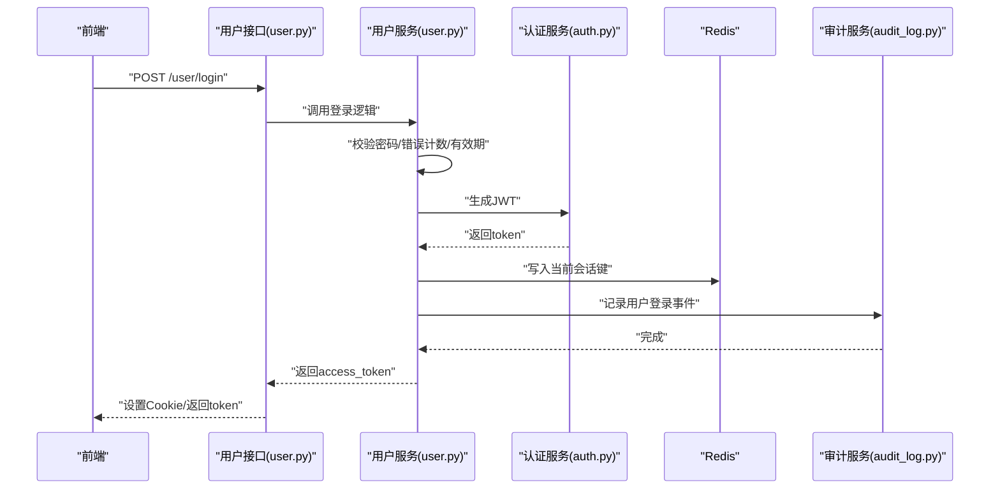
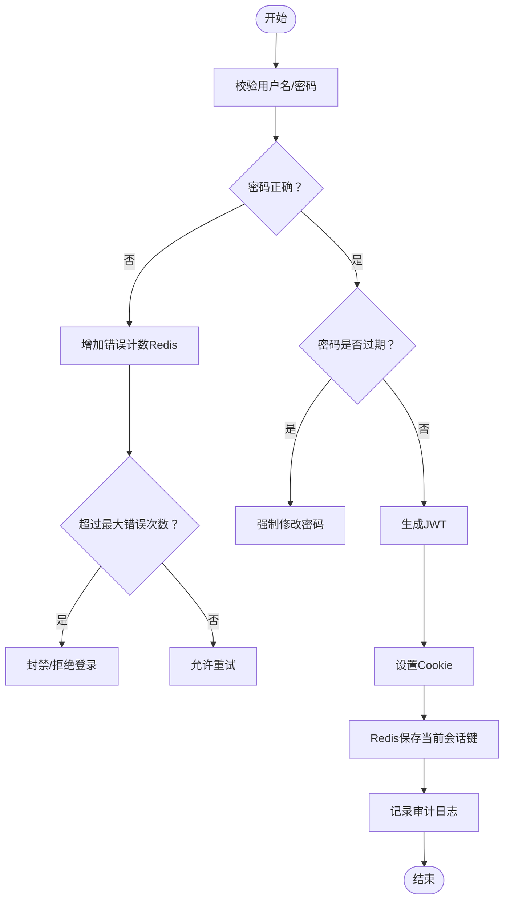
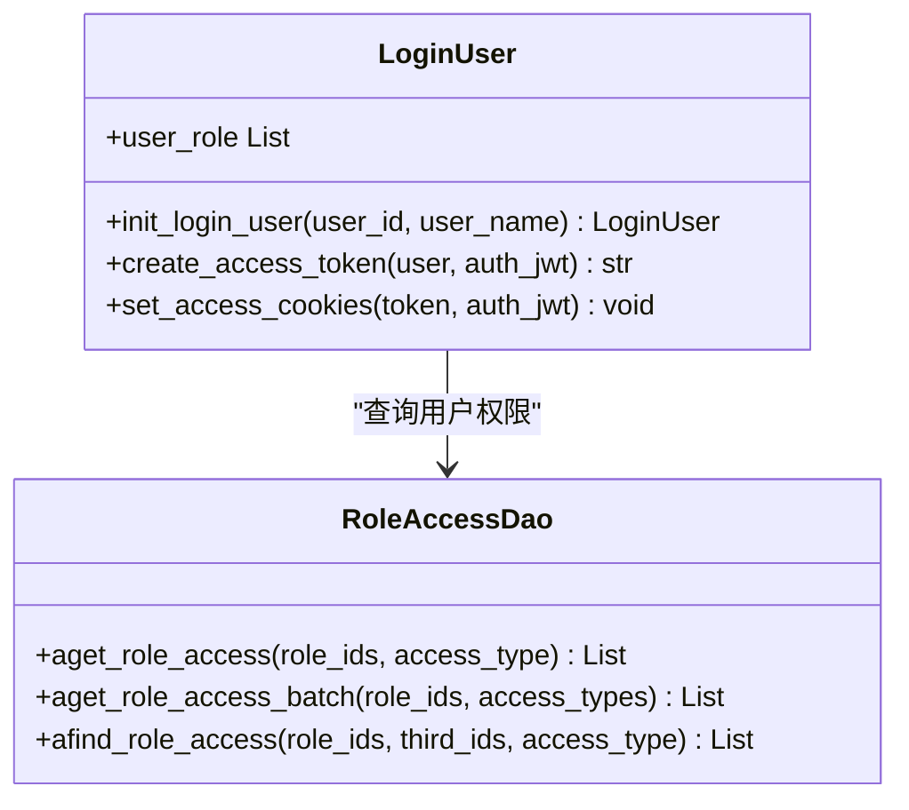
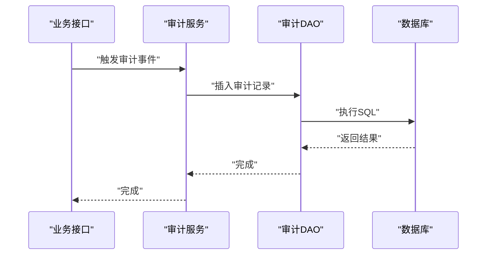
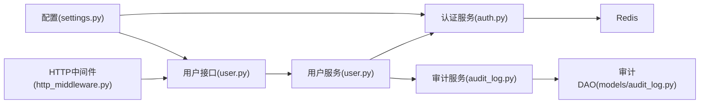

# 安全问题

<cite>
**本文引用的文件**
- [src/backend/bisheng/user/domain/services/auth.py](file://src/backend/bisheng/user/domain/services/auth.py)
- [src/backend/bisheng/user/domain/services/user.py](file://src/backend/bisheng/user/domain/services/user.py)
- [src/backend/bisheng/user/api/user.py](file://src/backend/bisheng/user/api/user.py)
- [src/backend/bisheng/database/models/audit_log.py](file://src/backend/bisheng/database/models/audit_log.py)
- [src/backend/bisheng/api/services/audit_log.py](file://src/backend/bisheng/api/services/audit_log.py)
- [src/backend/bisheng/core/config/settings.py](file://src/backend/bisheng/core/config/settings.py)
- [src/backend/bisheng/services/auth/utils.py](file://src/backend/bisheng/services/auth/utils.py)
- [src/backend/bisheng/utils/http_middleware.py](file://src/backend/bisheng/utils/http_middleware.py)
- [src/backend/bisheng/user/domain/const.py](file://src/backend/bisheng/user/domain/const.py)
- [docker/nginx/nginx.conf](file://docker/nginx/nginx.conf)
- [src/frontend/client/nginx.conf](file://src/frontend/client/nginx.conf)
- [docker/redis/redis.conf](file://docker/redis/redis.conf)
- [src/frontend/platform/src/pages/LoginPage/utils.ts](file://src/frontend/platform/src/pages/LoginPage/utils.ts)
- [src/frontend/platform/src/pages/LoginPage/resetPwd.tsx](file://src/frontend/platform/src/pages/LoginPage/resetPwd.tsx)
- [src/frontend/client/src/components/Auth/LoginForm.tsx](file://src/frontend/client/src/components/Auth/LoginForm.tsx)
- [src/frontend/client/src/components/Auth/ResetPassword.tsx](file://src/frontend/client/src/components/Auth/ResetPassword.tsx)
- [SECURITY.md](file://SECURITY.md)
</cite>

## 目录
1. [简介](#简介)
2. [项目结构](#项目结构)
3. [核心组件](#核心组件)
4. [架构总览](#架构总览)
5. [详细组件分析](#详细组件分析)
6. [依赖关系分析](#依赖关系分析)
7. [性能与安全特性](#性能与安全特性)
8. [故障排除指南](#故障排除指南)
9. [结论](#结论)
10. [附录](#附录)

## 简介
本指南聚焦于 Bisheng 的安全问题与故障排除，覆盖认证授权、权限控制、会话管理、数据泄露风险与安全配置错误等主题。文档从代码实现出发，结合系统架构与日志审计，提供可操作的诊断方法、安全日志分析技巧、入侵检测与异常行为识别建议，并给出 API 安全配置、传输加密、敏感信息保护、安全审计与应急响应流程的最佳实践。

## 项目结构
后端采用 FastAPI + SQLModel 架构，前端使用 Vite/Vue。安全相关的关键位置包括：
- 认证与会话：用户登录、JWT 生成与 Cookie 设置、密码校验与错误计数、Redis 会话存储
- 权限控制：基于角色的访问控制（RBAC），资源权限映射
- 审计日志：统一的审计日志服务与模型，记录用户行为与系统事件
- 配置与中间件：全局请求追踪、日志格式化、Cookie 安全属性
- 前端安全：密码加密传输、表单校验、重置流程

图表来源
- [src/backend/bisheng/user/api/user.py](file://src/backend/bisheng/user/api/user.py#L107-L109)
- [src/backend/bisheng/user/domain/services/auth.py](file://src/backend/bisheng/user/domain/services/auth.py#L24-L65)
- [src/backend/bisheng/user/domain/services/user.py](file://src/backend/bisheng/user/domain/services/user.py#L145-L169)
- [src/backend/bisheng/api/services/audit_log.py](file://src/backend/bisheng/api/services/audit_log.py#L510-L517)
- [src/backend/bisheng/database/models/audit_log.py](file://src/backend/bisheng/database/models/audit_log.py#L94-L136)
- [src/backend/bisheng/core/config/settings.py](file://src/backend/bisheng/core/config/settings.py#L185-L196)
- [src/backend/bisheng/utils/http_middleware.py](file://src/backend/bisheng/utils/http_middleware.py#L12-L33)
- [docker/nginx/nginx.conf](file://docker/nginx/nginx.conf#L1-L32)
- [docker/redis/redis.conf](file://docker/redis/redis.conf#L188-L275)

章节来源
- [src/backend/bisheng/user/api/user.py](file://src/backend/bisheng/user/api/user.py#L107-L109)
- [src/backend/bisheng/user/domain/services/auth.py](file://src/backend/bisheng/user/domain/services/auth.py#L24-L65)
- [src/backend/bisheng/user/domain/services/user.py](file://src/backend/bisheng/user/domain/services/user.py#L145-L169)
- [src/backend/bisheng/api/services/audit_log.py](file://src/backend/bisheng/api/services/audit_log.py#L510-L517)
- [src/backend/bisheng/database/models/audit_log.py](file://src/backend/bisheng/database/models/audit_log.py#L94-L136)
- [src/backend/bisheng/core/config/settings.py](file://src/backend/bisheng/core/config/settings.py#L185-L196)
- [src/backend/bisheng/utils/http_middleware.py](file://src/backend/bisheng/utils/http_middleware.py#L12-L33)
- [docker/nginx/nginx.conf](file://docker/nginx/nginx.conf#L1-L32)
- [docker/redis/redis.conf](file://docker/redis/redis.conf#L188-L275)

## 核心组件
- 认证与会话
  - JWT 令牌生成与 Cookie 设置，包含过期时间、签发者、安全属性（secure、httponly、samesite）
  - 登录成功后写入 Redis 当前会话键，用于会话管理与并发控制
  - 密码校验与错误次数限制，支持密码有效期检查
- 权限控制
  - 基于角色的资源访问控制，按类型批量查询用户权限并提取第三方资源 ID
- 审计日志
  - 统一的审计日志服务，记录用户登录、资源变更、会话消息等事件
  - 支持按用户组、操作人、时间范围、事件类型过滤查询
- 配置与中间件
  - Cookie 安全配置项集中管理；HTTP 中间件注入 Trace-ID、处理时长与请求日志
- 前端安全
  - 登录密码加密传输（RSA），重置密码流程与表单校验

章节来源
- [src/backend/bisheng/user/domain/services/auth.py](file://src/backend/bisheng/user/domain/services/auth.py#L24-L65)
- [src/backend/bisheng/user/domain/services/user.py](file://src/backend/bisheng/user/domain/services/user.py#L63-L86)
- [src/backend/bisheng/user/api/user.py](file://src/backend/bisheng/user/api/user.py#L78-L92)
- [src/backend/bisheng/api/services/audit_log.py](file://src/backend/bisheng/api/services/audit_log.py#L510-L517)
- [src/backend/bisheng/database/models/audit_log.py](file://src/backend/bisheng/database/models/audit_log.py#L94-L136)
- [src/backend/bisheng/core/config/settings.py](file://src/backend/bisheng/core/config/settings.py#L185-L196)
- [src/backend/bisheng/utils/http_middleware.py](file://src/backend/bisheng/utils/http_middleware.py#L12-L33)
- [src/frontend/platform/src/pages/LoginPage/utils.ts](file://src/frontend/platform/src/pages/LoginPage/utils.ts#L5-L17)

## 架构总览
下图展示登录与会话管理的关键交互路径，以及审计日志与权限控制的参与点。

图表来源
- [src/backend/bisheng/user/api/user.py](file://src/backend/bisheng/user/api/user.py#L107-L109)
- [src/backend/bisheng/user/domain/services/user.py](file://src/backend/bisheng/user/domain/services/user.py#L145-L169)
- [src/backend/bisheng/user/domain/services/auth.py](file://src/backend/bisheng/user/domain/services/auth.py#L258-L270)
- [src/backend/bisheng/api/services/audit_log.py](file://src/backend/bisheng/api/services/audit_log.py#L510-L517)

## 详细组件分析

### 组件A：认证与会话管理
- JWT 生成与 Cookie 设置
  - 使用对称算法生成访问令牌，设置过期时间与签发者
  - 将令牌写入 Cookie，启用 HttpOnly、Secure（可配置）、SameSite 等安全属性
- 登录流程
  - 校验用户密码，支持密码有效期检查
  - 成功后生成 JWT 并写入 Cookie，同时在 Redis 中持久化当前会话键，延长有效时间
  - 记录审计日志“用户登录”
- 密码错误与防暴力破解
  - 失败计数通过 Redis 键进行统计，结合配置窗口与最大错误次数进行封禁策略
- 会话管理
  - 使用 Redis 存储当前会话键，便于并发登录与会话校验

图表来源
- [src/backend/bisheng/user/domain/services/user.py](file://src/backend/bisheng/user/domain/services/user.py#L74-L86)
- [src/backend/bisheng/user/domain/services/auth.py](file://src/backend/bisheng/user/domain/services/auth.py#L34-L58)
- [src/backend/bisheng/user/api/user.py](file://src/backend/bisheng/user/api/user.py#L78-L92)
- [src/backend/bisheng/api/services/audit_log.py](file://src/backend/bisheng/api/services/audit_log.py#L510-L517)

章节来源
- [src/backend/bisheng/user/domain/services/auth.py](file://src/backend/bisheng/user/domain/services/auth.py#L24-L65)
- [src/backend/bisheng/user/domain/services/user.py](file://src/backend/bisheng/user/domain/services/user.py#L63-L86)
- [src/backend/bisheng/user/api/user.py](file://src/backend/bisheng/user/api/user.py#L78-L92)
- [src/backend/bisheng/api/services/audit_log.py](file://src/backend/bisheng/api/services/audit_log.py#L510-L517)

### 组件B：权限控制与资源访问
- 角色与访问类型
  - 按角色批量查询用户权限，支持异步与同步查询
  - 可按访问类型筛选第三方资源 ID 列表，用于后续鉴权
- 资源权限匹配
  - 提供同步/异步查询接口，支持多类型资源与访问类型的组合

图表来源
- [src/backend/bisheng/database/models/role_access.py](file://src/backend/bisheng/database/models/role_access.py#L85-L151)
- [src/backend/bisheng/user/domain/services/auth.py](file://src/backend/bisheng/user/domain/services/auth.py#L251-L281)

章节来源
- [src/backend/bisheng/database/models/role_access.py](file://src/backend/bisheng/database/models/role_access.py#L85-L151)
- [src/backend/bisheng/user/domain/services/auth.py](file://src/backend/bisheng/user/domain/services/auth.py#L251-L281)

### 组件C：审计日志与合规
- 审计日志模型
  - 支持按用户组、操作人、时间范围、事件类型过滤查询
  - 提供 JSON 字段存储用户组集合，便于多组过滤
- 审计服务
  - 用户登录、资源创建/更新/删除、会话消息、仪表盘等事件均有记录入口
  - 支持导出会话消息到对象存储，便于合规留存

图表来源
- [src/backend/bisheng/api/services/audit_log.py](file://src/backend/bisheng/api/services/audit_log.py#L510-L517)
- [src/backend/bisheng/database/models/audit_log.py](file://src/backend/bisheng/database/models/audit_log.py#L94-L136)

章节来源
- [src/backend/bisheng/api/services/audit_log.py](file://src/backend/bisheng/api/services/audit_log.py#L33-L56)
- [src/backend/bisheng/database/models/audit_log.py](file://src/backend/bisheng/database/models/audit_log.py#L94-L136)

### 组件D：API 安全与传输加密
- Cookie 安全配置
  - 包含 max_age、path、domain、secure、httponly、samesite、jwt_token_expire_time、jwt_iss 等字段
- Nginx 配置
  - 后端 Nginx 默认未启用 SSL，前端 Nginx 提供注释化的 SSL 示例与安全头建议
- Redis 安全
  - TLS/SSL、客户端证书、协议版本与密码套件等可配置项存在注释示例，建议启用

章节来源
- [src/backend/bisheng/core/config/settings.py](file://src/backend/bisheng/core/config/settings.py#L185-L196)
- [docker/nginx/nginx.conf](file://docker/nginx/nginx.conf#L1-L32)
- [src/frontend/client/nginx.conf](file://src/frontend/client/nginx.conf#L1-L76)
- [docker/redis/redis.conf](file://docker/redis/redis.conf#L188-L275)

### 组件E：前端安全与敏感信息保护
- 登录加密
  - 前端获取公钥后使用 RSA 加密密码再提交，避免明文传输
- 表单校验
  - 登录页与重置页均包含最小长度、复杂度与确认一致性校验
- 密码规则
  - 前端与后端均对密码强度有约束，防止弱口令

章节来源
- [src/frontend/platform/src/pages/LoginPage/utils.ts](file://src/frontend/platform/src/pages/LoginPage/utils.ts#L5-L17)
- [src/frontend/platform/src/pages/LoginPage/resetPwd.tsx](file://src/frontend/platform/src/pages/LoginPage/resetPwd.tsx#L38-L51)
- [src/frontend/client/src/components/Auth/LoginForm.tsx](file://src/frontend/client/src/components/Auth/LoginForm.tsx#L122-L145)
- [src/frontend/client/src/components/Auth/ResetPassword.tsx](file://src/frontend/client/src/components/Auth/ResetPassword.tsx#L54-L138)

## 依赖关系分析
- 认证服务依赖配置中的 jwt_secret 与 cookie_conf，依赖 Redis 进行会话持久化
- 用户服务在登录时调用认证服务生成令牌，并写入 Redis 与审计日志
- 审计服务依赖 DAO 层进行日志查询与过滤，支持多维条件检索
- 中间件为所有请求注入 Trace-ID 与处理时长，便于定位问题

图表来源
- [src/backend/bisheng/core/config/settings.py](file://src/backend/bisheng/core/config/settings.py#L185-L196)
- [src/backend/bisheng/user/domain/services/auth.py](file://src/backend/bisheng/user/domain/services/auth.py#L24-L65)
- [src/backend/bisheng/user/api/user.py](file://src/backend/bisheng/user/api/user.py#L107-L109)
- [src/backend/bisheng/user/domain/services/user.py](file://src/backend/bisheng/user/domain/services/user.py#L145-L169)
- [src/backend/bisheng/api/services/audit_log.py](file://src/backend/bisheng/api/services/audit_log.py#L510-L517)
- [src/backend/bisheng/database/models/audit_log.py](file://src/backend/bisheng/database/models/audit_log.py#L94-L136)
- [src/backend/bisheng/utils/http_middleware.py](file://src/backend/bisheng/utils/http_middleware.py#L12-L33)

章节来源
- [src/backend/bisheng/core/config/settings.py](file://src/backend/bisheng/core/config/settings.py#L185-L196)
- [src/backend/bisheng/user/domain/services/auth.py](file://src/backend/bisheng/user/domain/services/auth.py#L24-L65)
- [src/backend/bisheng/user/api/user.py](file://src/backend/bisheng/user/api/user.py#L107-L109)
- [src/backend/bisheng/user/domain/services/user.py](file://src/backend/bisheng/user/domain/services/user.py#L145-L169)
- [src/backend/bisheng/api/services/audit_log.py](file://src/backend/bisheng/api/services/audit_log.py#L510-L517)
- [src/backend/bisheng/database/models/audit_log.py](file://src/backend/bisheng/database/models/audit_log.py#L94-L136)
- [src/backend/bisheng/utils/http_middleware.py](file://src/backend/bisheng/utils/http_middleware.py#L12-L33)

## 性能与安全特性
- 性能
  - 异步审计日志与资源组查询，减少阻塞
  - 中间件统一注入 Trace-ID，便于链路追踪与性能分析
- 安全
  - JWT Cookie 安全属性可配置；Redis 会话键延长有效期以提升用户体验但需配合安全策略
  - 前端密码加密传输，后端密码有效期与错误计数策略降低暴力破解风险
  - 审计日志支持导出，满足合规要求

[本节为通用讨论，无需列出具体文件来源]

## 故障排除指南

### 认证授权问题
- 用户认证失败
  - 检查用户名/密码是否正确，确认密码有效期是否过期
  - 查看 Redis 中的错误计数键与当前会话键是否存在
  - 核对 Cookie 安全属性（secure、httponly、samesite）与浏览器环境
- 角色权限验证错误
  - 确认用户角色与资源访问类型映射是否正确
  - 使用批量权限查询接口核对返回的第三方资源 ID 列表
- 会话管理异常
  - 检查 Redis 会话键是否过期或被清理
  - 确认 JWT 过期时间与 Cookie 配置一致

章节来源
- [src/backend/bisheng/user/domain/services/user.py](file://src/backend/bisheng/user/domain/services/user.py#L63-L86)
- [src/backend/bisheng/user/domain/services/auth.py](file://src/backend/bisheng/user/domain/services/auth.py#L34-L58)
- [src/backend/bisheng/user/api/user.py](file://src/backend/bisheng/user/api/user.py#L78-L92)
- [src/backend/bisheng/user/domain/const.py](file://src/backend/bisheng/user/domain/const.py#L1-L4)
- [src/backend/bisheng/core/config/settings.py](file://src/backend/bisheng/core/config/settings.py#L185-L196)

### 权限控制异常
- 现象
  - 用户无法访问特定资源或功能
- 排查步骤
  - 获取用户角色列表与权限映射
  - 对比资源访问类型与第三方资源 ID，确认是否存在匹配
  - 若为管理员，检查用户组与资源组的交集是否为空

章节来源
- [src/backend/bisheng/database/models/role_access.py](file://src/backend/bisheng/database/models/role_access.py#L85-L151)
- [src/backend/bisheng/api/services/audit_log.py](file://src/backend/bisheng/api/services/audit_log.py#L554-L597)

### 数据泄露风险
- 现象
  - 日志中出现敏感字段或会话信息
- 排查步骤
  - 检查审计日志导出流程，确保仅导出必要字段
  - 核对对象存储上传与访问策略，避免敏感数据外泄
  - 前端仅传输加密后的密码，避免明文泄露

章节来源
- [src/backend/bisheng/api/services/audit_log.py](file://src/backend/bisheng/api/services/audit_log.py#L756-L800)
- [src/frontend/platform/src/pages/LoginPage/utils.ts](file://src/frontend/platform/src/pages/LoginPage/utils.ts#L5-L17)

### 安全配置错误
- Nginx 未启用 HTTPS
  - 建议参考前端 Nginx 配置中的 SSL 注释示例，启用 TLS 并设置安全头
- Redis 未启用 TLS/SSL
  - 参考 Redis 配置中的 TLS 注释项，启用服务端与客户端证书校验
- Cookie 安全属性不当
  - 在生产环境应启用 secure 与 httponly，合理设置 SameSite

章节来源
- [src/frontend/client/nginx.conf](file://src/frontend/client/nginx.conf#L34-L76)
- [docker/redis/redis.conf](file://docker/redis/redis.conf#L188-L275)
- [src/backend/bisheng/core/config/settings.py](file://src/backend/bisheng/core/config/settings.py#L185-L196)

### 安全日志分析与入侵检测
- 审计日志查询
  - 按用户组、操作人、时间范围、事件类型过滤
  - 关注异常登录、批量资源变更、高危操作等事件
- 异常行为识别
  - 结合中间件注入的 Trace-ID 与处理时长，定位慢请求与异常流量
  - 监控 Redis 会话键与错误计数键的异常波动

章节来源
- [src/backend/bisheng/api/services/audit_log.py](file://src/backend/bisheng/api/services/audit_log.py#L33-L56)
- [src/backend/bisheng/database/models/audit_log.py](file://src/backend/bisheng/database/models/audit_log.py#L94-L136)
- [src/backend/bisheng/utils/http_middleware.py](file://src/backend/bisheng/utils/http_middleware.py#L12-L33)

### API 安全配置与敏感信息保护
- API Key 与令牌
  - 使用强随机密钥，定期轮换
  - 严格限制 API Key 的使用范围与过期时间
- 传输加密
  - 强制启用 HTTPS，禁用不安全协议
  - 前端使用 RSA 公钥加密密码，后端严格校验
- 审计与合规
  - 定期导出会话与操作日志，保留合规证据

章节来源
- [src/backend/bisheng/services/auth/utils.py](file://src/backend/bisheng/services/auth/utils.py#L25-L63)
- [src/backend/bisheng/services/settings/auth.py](file://src/backend/bisheng/services/settings/auth.py#L13-L74)
- [src/frontend/platform/src/pages/LoginPage/utils.ts](file://src/frontend/platform/src/pages/LoginPage/utils.ts#L5-L17)
- [src/backend/bisheng/api/services/audit_log.py](file://src/backend/bisheng/api/services/audit_log.py#L756-L800)

### 安全审计日志解读与应急响应
- 日志解读
  - 用户登录事件：确认 IP、时间、用户组与登录方式
  - 资源变更事件：核对对象类型、ID、名称与操作类型
- 应急响应
  - 快速冻结可疑账户，撤销相关令牌
  - 回溯 Trace-ID，定位异常请求链路
  - 检查 Redis 会话状态与审计日志，评估影响范围

章节来源
- [src/backend/bisheng/api/services/audit_log.py](file://src/backend/bisheng/api/services/audit_log.py#L510-L517)
- [src/backend/bisheng/utils/http_middleware.py](file://src/backend/bisheng/utils/http_middleware.py#L12-L33)

## 结论
Bisheng 在认证、权限、审计与前端传输方面具备较为完善的安全基础。建议在生产环境中进一步强化以下方面：启用 Nginx 与 Redis 的 TLS/SSL、严格配置 Cookie 安全属性、加强 API Key 管理与轮换、完善入侵检测与告警机制，并持续进行安全审计与渗透测试，以保障系统的整体安全性与合规性。

[本节为总结性内容，无需列出具体文件来源]

## 附录
- 参考安全文档：[SECURITY.md](file://SECURITY.md)

[本节为补充说明，无需列出具体文件来源]