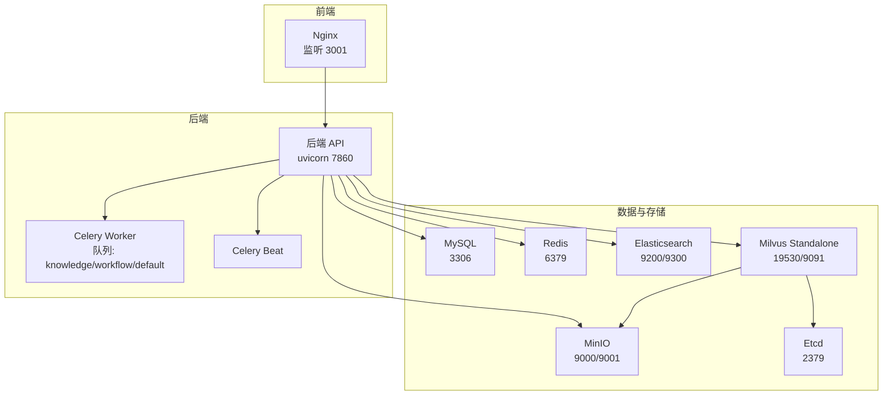
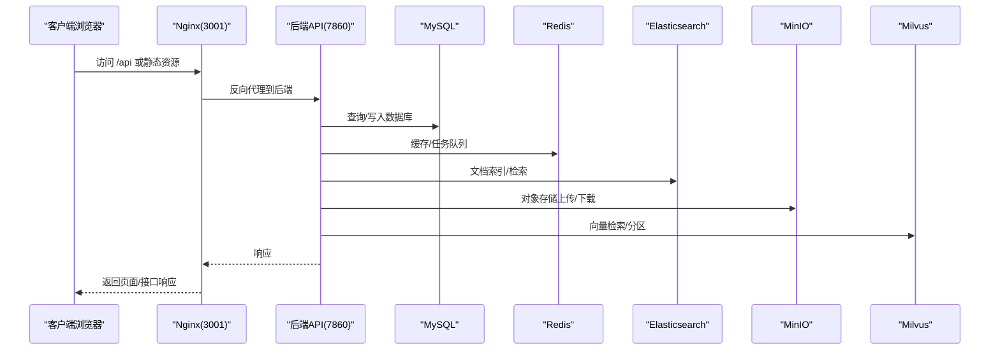
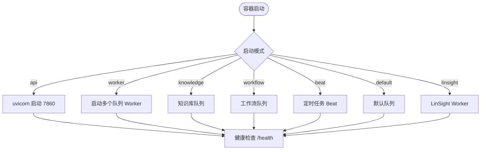
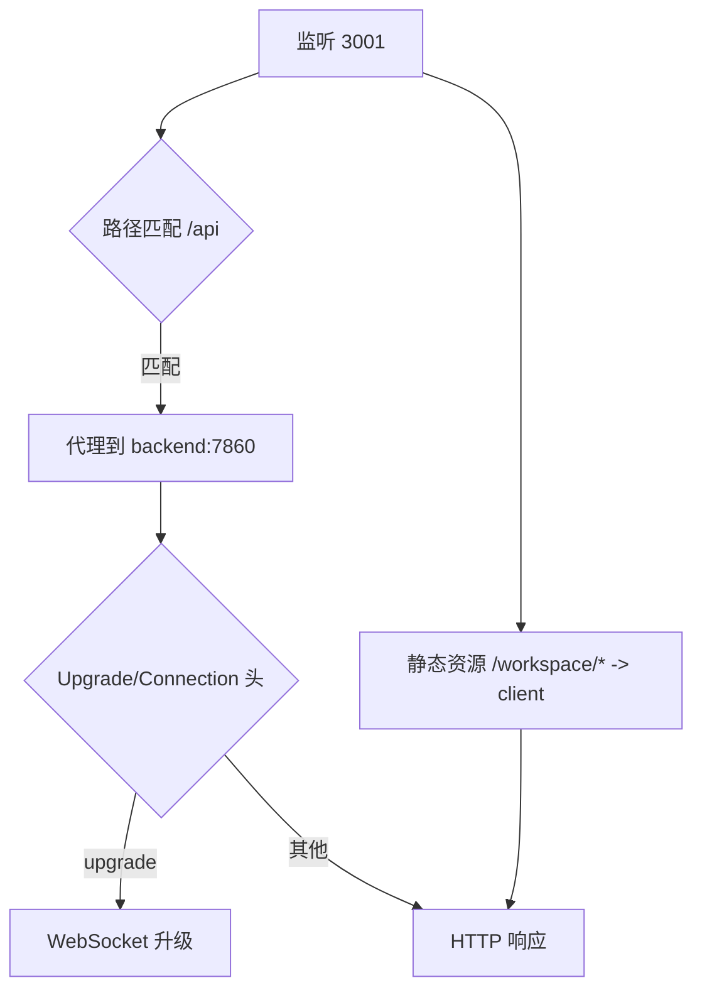
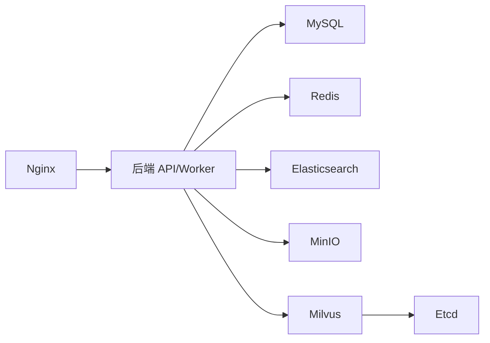

# 安装部署问题

<cite>
**本文引用的文件**
- [docker-compose.yml](file://docker/docker-compose.yml)
- [docker-compose-ft.yml](file://docker/docker-compose-ft.yml)
- [docker-compose-uns.yml](file://docker/docker-compose-uns.yml)
- [docker-compose-office.yml](file://docker/docker-compose-office.yml)
- [entrypoint.sh](file://docker/bisheng/entrypoint.sh)
- [config.yaml](file://docker/bisheng/config/config.yaml)
- [nginx.conf](file://docker/nginx/nginx.conf)
- [default.conf](file://docker/nginx/conf.d/default.conf)
- [websocket.conf](file://docker/nginx/conf.d/websocket.conf)
- [my.cnf](file://docker/mysql/conf/my.cnf)
- [redis.conf](file://docker/redis/redis.conf)
- [README.md](file://README.md)
</cite>

## 目录
1. [简介](#简介)
2. [项目结构](#项目结构)
3. [核心组件](#核心组件)
4. [架构总览](#架构总览)
5. [详细组件分析](#详细组件分析)
6. [依赖关系分析](#依赖关系分析)
7. [性能注意事项](#性能注意事项)
8. [故障排除指南](#故障排除指南)
9. [结论](#结论)
10. [附录](#附录)

## 简介
本指南聚焦于 Bisheng 在 Docker 环境中的安装与部署问题排查，覆盖容器启动失败、依赖服务连接异常、端口冲突、权限问题、Docker Compose 配置验证、服务健康检查、网络连通性测试与日志分析方法，并提供针对不同操作系统的安装建议（权限设置、环境变量与系统资源限制）。同时，解释容器间通信问题的诊断与修复，包括数据库连接、Redis 连接、Nginx 配置问题。

## 项目结构
Bisheng 使用多服务 Docker Compose 编排，包含后端 API、Worker、前端 Nginx、数据库 MySQL、缓存 Redis、搜索引擎 Elasticsearch、对象存储 MinIO、向量库 Milvus 以及 etcd 等组件。各服务通过健康检查与依赖关系保证启动顺序与可用性；Nginx 提供反向代理与 WebSocket 支持；后端通过入口脚本启动 Uvicorn API 与 Celery Worker。

图表来源
- [docker-compose.yml](file://docker/docker-compose.yml#L1-L201)
- [default.conf](file://docker/nginx/conf.d/default.conf#L46-L59)
- [entrypoint.sh](file://docker/bisheng/entrypoint.sh#L32-L66)

章节来源
- [docker-compose.yml](file://docker/docker-compose.yml#L1-L201)
- [README.md](file://README.md#L58-L86)

## 核心组件
- 后端 API 与 Worker
  - 通过入口脚本选择启动模式：api、worker、knowledge、workflow、beat、default、linsight。
  - API 使用 Uvicorn 在 7860 端口启动，Worker 启动多个队列以处理异步任务。
- Nginx 反向代理
  - 监听 3001，代理 /api 到后端 7860，支持 WebSocket 升级头。
  - 提供静态资源与跨域头配置。
- 数据与缓存
  - MySQL 8.0，字符集与排序规则配置；Redis 7.0.4，禁用保护模式以便容器内访问。
  - Elasticsearch 8.12.0，Milvus 2.5.10 与 Etcd 3.5.5 组成向量检索与对象存储依赖。
- 配置与环境变量
  - 后端配置文件集中管理数据库、Redis、Celery、向量库、对象存储与日志。
  - 大部分外部依赖地址通过环境变量注入，便于在 Compose 中统一管理。

章节来源
- [entrypoint.sh](file://docker/bisheng/entrypoint.sh#L1-L67)
- [config.yaml](file://docker/bisheng/config/config.yaml#L1-L88)
- [docker-compose.yml](file://docker/docker-compose.yml#L41-L123)
- [default.conf](file://docker/nginx/conf.d/default.conf#L19-L64)
- [websocket.conf](file://docker/nginx/conf.d/websocket.conf#L17-L28)

## 架构总览
下图展示从浏览器到后端 API 的典型请求链路，以及后端与依赖服务的交互。

图表来源
- [docker-compose.yml](file://docker/docker-compose.yml#L41-L123)
- [default.conf](file://docker/nginx/conf.d/default.conf#L46-L59)
- [config.yaml](file://docker/bisheng/config/config.yaml#L34-L57)

## 详细组件分析

### 后端 API 与 Worker 启动流程
- 入口脚本根据参数选择启动模式：
  - api：启动 Uvicorn 服务。
  - worker：并行启动知识库、工作流、默认任务与 Beat。
  - 其他模式：分别启动对应专用 Worker。
- 健康检查
  - 后端 API 健康检查访问本地 7860/health。
  - Redis 通过 redis-cli ping 检查。
  - MySQL 通过 mysql 客户端命令检查。
  - Milvus 通过 9091/healthz 检查。
  - MinIO 通过 9000/live 检查。
  - Etcd 通过 etcdctl endpoint health 检查。

图表来源
- [entrypoint.sh](file://docker/bisheng/entrypoint.sh#L32-L66)
- [docker-compose.yml](file://docker/docker-compose.yml#L67-L78)

章节来源
- [entrypoint.sh](file://docker/bisheng/entrypoint.sh#L1-L67)
- [docker-compose.yml](file://docker/docker-compose.yml#L67-L78)

### Nginx 代理与 WebSocket 配置
- 监听 3001，代理 /api 到后端 7860，设置升级头以支持 WebSocket。
- 静态资源映射到前端构建产物，支持 gzip 与缓存控制。
- WebSocket 配置独立于 default.conf，便于 HTTPS 场景。

图表来源
- [default.conf](file://docker/nginx/conf.d/default.conf#L19-L64)
- [websocket.conf](file://docker/nginx/conf.d/websocket.conf#L17-L28)
- [nginx.conf](file://docker/nginx/nginx.conf#L1-L32)

章节来源
- [default.conf](file://docker/nginx/conf.d/default.conf#L1-L65)
- [websocket.conf](file://docker/nginx/conf.d/websocket.conf#L1-L29)
- [nginx.conf](file://docker/nginx/nginx.conf#L1-L32)

### 数据库与缓存配置要点
- MySQL
  - 字符集与排序规则配置，确保全文检索与存储一致性。
  - 环境变量中设置 root 密码与数据库名，需与后端配置保持一致。
- Redis
  - 禁用保护模式以便容器内直接访问。
  - 支持普通、集群与哨兵模式配置，密码可加密存储。

章节来源
- [my.cnf](file://docker/mysql/conf/my.cnf#L1-L13)
- [redis.conf](file://docker/redis/redis.conf#L111-L111)
- [config.yaml](file://docker/bisheng/config/config.yaml#L1-L23)

### 向量库与对象存储
- Milvus 依赖 Etcd 与 MinIO，健康检查端口分别为 9091 与 9000。
- Elasticsearch 通过 URL 与 SSL 验证配置注入，支持基础认证。
- MinIO 提供对象存储能力，后端通过配置项对接。

章节来源
- [docker-compose.yml](file://docker/docker-compose.yml#L124-L201)
- [config.yaml](file://docker/bisheng/config/config.yaml#L34-L57)

## 依赖关系分析
- 服务依赖
  - 后端 API 与 Worker 依赖 MySQL 与 Redis 健康。
  - 前端 Nginx 依赖后端 API。
  - Milvus 依赖 Etcd 与 MinIO。
- 环境变量注入
  - 大多数外部服务地址通过环境变量注入，避免硬编码，便于多环境切换。

图表来源
- [docker-compose.yml](file://docker/docker-compose.yml#L73-L123)

章节来源
- [docker-compose.yml](file://docker/docker-compose.yml#L73-L123)

## 性能注意事项
- 资源与并发
  - 后端 API 使用多进程（workers 8），需确保宿主机 CPU 与内存充足。
  - Worker 并发与队列数量可根据任务类型调整。
- 存储与 I/O
  - MySQL、Redis、Milvus、ES 与 MinIO 的数据卷路径需挂载到持久化磁盘。
- 网络与超时
  - Nginx 对后端代理设置了较长读取超时，适合大文件上传与长任务。
- GPU 推理服务（可选）
  - 微调推理服务（FT）启用 GPU 设备直通，需满足硬件与驱动要求。

章节来源
- [entrypoint.sh](file://docker/bisheng/entrypoint.sh#L34-L34)
- [docker-compose.yml](file://docker/docker-compose.yml#L44-L45)
- [docker-compose-ft.yml](file://docker/docker-compose-ft.yml#L24-L31)

## 故障排除指南

### 一、Docker 容器启动失败
- 常见原因
  - 依赖服务未就绪（MySQL/Redis 未健康）。
  - 端口被占用（3306/6379/7860/9200/9000/9091/19530/3001）。
  - 权限不足（数据卷目录无写权限）。
  - 环境变量缺失或错误（如数据库密码、对象存储凭据）。
- 排查步骤
  - 查看容器状态与日志
    - docker compose ps
    - docker compose logs <service>
  - 验证 Compose 健康检查
    - docker compose ps 显示服务健康状态
  - 检查端口占用
    - netstat -tulpn | grep -E "(3306|6379|7860|9200|9000|9091|19530|3001)"
  - 校验数据卷权限
    - 确认宿主机目录对容器 UID 可写
  - 校验环境变量
    - 确认 config.yaml 与 docker-compose.yml 中的环境变量一致

章节来源
- [docker-compose.yml](file://docker/docker-compose.yml#L15-L21)
- [docker-compose.yml](file://docker/docker-compose.yml#L34-L39)
- [docker-compose.yml](file://docker/docker-compose.yml#L67-L72)
- [docker-compose.yml](file://docker/docker-compose.yml#L170-L174)
- [docker-compose.yml](file://docker/docker-compose.yml#L189-L194)

### 二、依赖服务连接异常
- MySQL
  - 症状：后端无法连接数据库或初始化失败。
  - 排查：
    - 校验 root 密码与数据库名是否与 config.yaml 一致。
    - 检查 my.cnf 字符集与排序规则是否正确。
    - 使用 mysql 客户端从容器内连通性测试。
- Redis
  - 症状：任务队列堆积、缓存不可用。
  - 排查：
    - 确认 Redis 已禁用保护模式且端口可达。
    - 使用 redis-cli ping 验证。
    - 如使用集群/哨兵，请核对配置与密码。
- Elasticsearch
  - 症状：搜索/索引失败。
  - 排查：
    - 校验 URL 与 SSL 验证配置。
    - 如启用基础认证，确认用户名/密码正确。
- MinIO/Milvus/Etcd
  - 症状：向量检索/对象存储异常。
  - 排查：
    - 校验端口与健康检查。
    - 确认 Milvus 依赖的 Etcd 与 MinIO 均健康。

章节来源
- [config.yaml](file://docker/bisheng/config/config.yaml#L3-L4)
- [config.yaml](file://docker/bisheng/config/config.yaml#L8-L22)
- [my.cnf](file://docker/mysql/conf/my.cnf#L7-L12)
- [redis.conf](file://docker/redis/redis.conf#L111-L111)
- [docker-compose.yml](file://docker/docker-compose.yml#L124-L201)

### 三、端口冲突
- 现象：容器启动时报端口冲突。
- 解决：
  - 修改 docker-compose.yml 中的 host:container 端口映射。
  - 或释放宿主机上占用该端口的服务。
- 常见冲突端口
  - 3306（MySQL）、6379（Redis）、7860（后端 API）、9200/9300（ES）、9000/9001（MinIO）、9091（Milvus）、19530（Milvus）、3001（Nginx）。

章节来源
- [docker-compose.yml](file://docker/docker-compose.yml#L6-L7)
- [docker-compose.yml](file://docker/docker-compose.yml#L26-L27)
- [docker-compose.yml](file://docker/docker-compose.yml#L44-L45)
- [docker-compose.yml](file://docker/docker-compose.yml#L128-L129)
- [docker-compose.yml](file://docker/docker-compose.yml#L162-L164)
- [docker-compose.yml](file://docker/docker-compose.yml#L195-L197)
- [docker-compose.yml](file://docker/docker-compose.yml#L113-L114)

### 四、权限问题
- 症状：容器内无法写入数据卷、日志文件创建失败。
- 排查与修复：
  - 确保宿主机数据目录对运行容器的 UID/GID 可写。
  - 检查 DOCKER_VOLUME_DIRECTORY 挂载路径是否存在且权限正确。
  - 重启容器后再次验证。

章节来源
- [docker-compose.yml](file://docker/docker-compose.yml#L12-L14)
- [docker-compose.yml](file://docker/docker-compose.yml#L30-L32)
- [docker-compose.yml](file://docker/docker-compose.yml#L59-L62)
- [docker-compose.yml](file://docker/docker-compose.yml#L133-L135)
- [docker-compose.yml](file://docker/docker-compose.yml#L185-L187)
- [docker-compose.yml](file://docker/docker-compose.yml#L165-L167)

### 五、Docker Compose 配置验证
- 健康检查
  - 使用 docker compose ps 查看各服务健康状态。
  - 如健康检查失败，查看对应日志定位问题。
- 环境变量
  - 确认 config.yaml 中的环境变量占位与 docker-compose.yml 注入一致。
- 依赖关系
  - 后端 API/Worker 依赖 MySQL/Redis 健康；前端依赖后端 API。

章节来源
- [docker-compose.yml](file://docker/docker-compose.yml#L73-L77)
- [docker-compose.yml](file://docker/docker-compose.yml#L103-L107)
- [docker-compose.yml](file://docker/docker-compose.yml#L121-L122)

### 六、服务健康检查
- 常用健康检查端点
  - 后端 API：/health
  - Redis：ping
  - MySQL：mysql 客户端
  - Milvus：9091/healthz
  - MinIO：9000/minio/health/live
  - Etcd：etcdctl endpoint health
- 手动验证
  - 在宿主机 curl 对应端点，或从容器内部 curl 测试连通性。

章节来源
- [docker-compose.yml](file://docker/docker-compose.yml#L15-L21)
- [docker-compose.yml](file://docker/docker-compose.yml#L34-L39)
- [docker-compose.yml](file://docker/docker-compose.yml#L67-L72)
- [docker-compose.yml](file://docker/docker-compose.yml#L170-L174)
- [docker-compose.yml](file://docker/docker-compose.yml#L189-L194)

### 七、网络连接测试
- 从 Nginx 访问后端 API
  - curl -H "Upgrade: websocket" -H "Connection: Upgrade" http://localhost:3001/api
- 从后端容器访问依赖服务
  - 使用服务名（如 mysql、redis、elasticsearch、minio、milvus）进行连通性测试。
- WebSocket 支持
  - 确认 default.conf 或 websocket.conf 中的升级头配置正确。

章节来源
- [default.conf](file://docker/nginx/conf.d/default.conf#L46-L59)
- [websocket.conf](file://docker/nginx/conf.d/websocket.conf#L17-L28)

### 八、日志分析方法
- 定位日志位置
  - 后端日志：config.yaml 中 sink 指向的数据卷路径。
  - Nginx：error.log 与 access.log。
  - MySQL/Redis/Milvus/ES/MinIO：容器标准输出或日志卷。
- 分析步骤
  - 关注启动阶段的连接错误、权限错误与健康检查失败。
  - 结合时间戳与 trace_id 追踪请求链路。

章节来源
- [config.yaml](file://docker/bisheng/config/config.yaml#L71-L87)
- [nginx.conf](file://docker/nginx/nginx.conf#L5-L22)

### 九、不同操作系统下的安装问题
- Linux（通用）
  - 确保 Docker 与 Docker Compose 版本满足最低要求。
  - 配置防火墙放行所需端口。
  - 设置持久化卷目录权限。
- macOS
  - 注意 Docker Desktop 的资源分配与文件共享性能。
  - 如使用 Apple Silicon，确认镜像架构兼容。
- Windows
  - 使用 WSL2 后端以获得更好的 Docker 性能。
  - 注意路径分隔符与大小写敏感性。

章节来源
- [README.md](file://README.md#L60-L65)

### 十、容器间通信问题诊断与修复
- 问题类型
  - DNS 解析失败（服务名不可达）。
  - 端口未开放或被防火墙拦截。
  - 网络隔离导致无法访问。
- 诊断步骤
  - 在后端容器内使用 nslookup 或 dig 验证服务名解析。
  - 使用 telnet 或 nc 测试端口连通性。
  - 检查 docker-compose 网络配置与 expose/ports 映射。
- 修复建议
  - 使用服务名而非 IP 访问依赖服务。
  - 确保依赖服务健康检查通过后再启动上游服务。
  - 如需跨主机通信，检查宿主机防火墙策略。

章节来源
- [docker-compose.yml](file://docker/docker-compose.yml#L73-L77)
- [docker-compose.yml](file://docker/docker-compose.yml#L103-L107)

### 十一、数据库连接问题
- 症状：后端启动即报数据库连接失败。
- 排查要点
  - config.yaml 中 database_url 与 docker-compose 环境变量一致。
  - MySQL 字符集与排序规则配置正确。
  - 容器内可使用 mysql 客户端从后端容器连通测试。

章节来源
- [config.yaml](file://docker/bisheng/config/config.yaml#L3-L4)
- [my.cnf](file://docker/mysql/conf/my.cnf#L7-L12)
- [docker-compose.yml](file://docker/docker-compose.yml#L15-L21)

### 十二、Redis 连接问题
- 症状：任务无法入队、缓存不可用。
- 排查要点
  - Redis 保护模式关闭，端口可达。
  - config.yaml 中 redis_url 与 celery_redis_url 正确。
  - 如使用集群/哨兵，核对配置与密码。

章节来源
- [redis.conf](file://docker/redis/redis.conf#L111-L111)
- [config.yaml](file://docker/bisheng/config/config.yaml#L8-L25)

### 十三、Nginx 配置问题
- 症状：页面空白、接口 404、WebSocket 无法升级。
- 排查要点
  - 确认监听端口 3001 与 location 规则正确。
  - /api 代理到 backend:7860，且升级头已设置。
  - 静态资源路径与 alias 配置一致。
- 修复建议
  - 检查 default.conf 与 websocket.conf 的合并加载顺序。
  - 确认 include /etc/nginx/conf.d/*.conf 生效。

章节来源
- [default.conf](file://docker/nginx/conf.d/default.conf#L19-L64)
- [websocket.conf](file://docker/nginx/conf.d/websocket.conf#L17-L28)
- [nginx.conf](file://docker/nginx/nginx.conf#L31-L31)

### 十四、微调推理服务（FT）与文档服务（Unstructured/Office）
- FT 服务
  - GPU 设备直通，shm_size 足够，端口 8000。
  - 基座模型与微调输出目录需挂载到宿主机。
- Unstructured 服务
  - 健康检查端口 10001，OCR/RT 服务地址按需配置。
- Office 文档服务
  - OnlyOffice 默认端口 80，JWT 可按需开启。

章节来源
- [docker-compose-ft.yml](file://docker/docker-compose-ft.yml#L1-L31)
- [docker-compose-uns.yml](file://docker/docker-compose-uns.yml#L1-L22)
- [docker-compose-office.yml](file://docker/docker-compose-office.yml#L1-L15)

## 结论
通过健康检查、端口与权限校验、环境变量一致性检查、网络连通性测试与日志分析，可快速定位并解决 Bisheng 在 Docker 环境中的安装部署问题。建议在生产环境中进一步完善资源配额、持久化卷权限与安全策略，并结合监控与告警体系持续保障系统稳定运行。

## 附录
- 快速检查清单
  - docker compose ps 是否全部 healthy
  - 端口映射是否与宿主机冲突
  - 数据卷目录权限是否正确
  - config.yaml 与 docker-compose.yml 环境变量是否一致
  - Nginx 代理与 WebSocket 升级头配置是否正确
  - MySQL/Redis/Milvus/ES/MinIO 健康检查是否通过