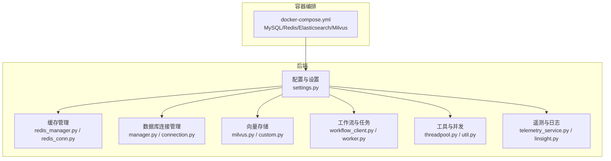
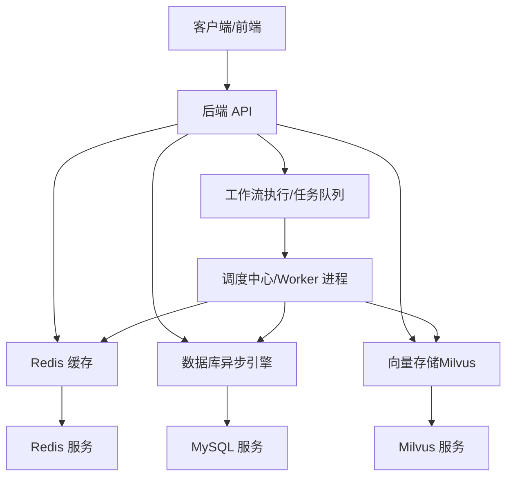
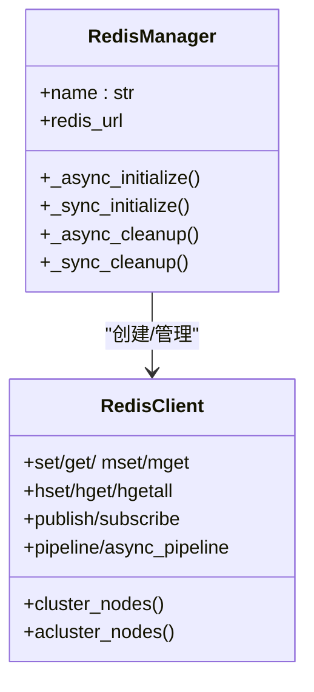
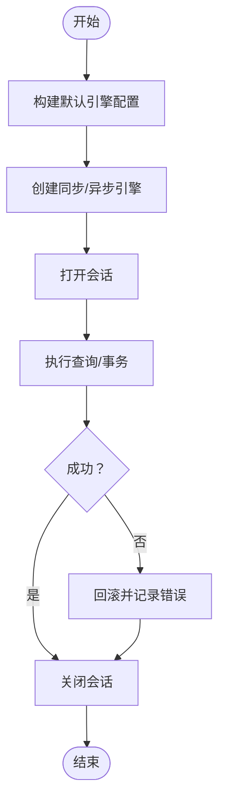
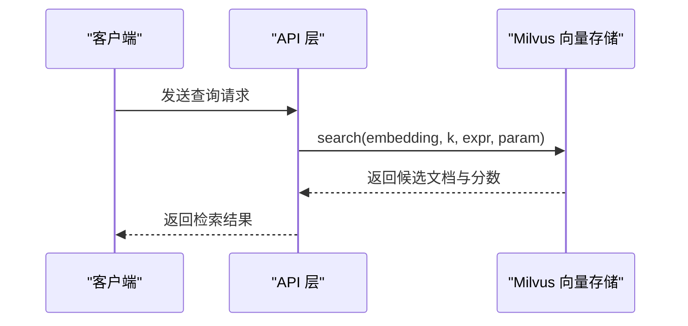
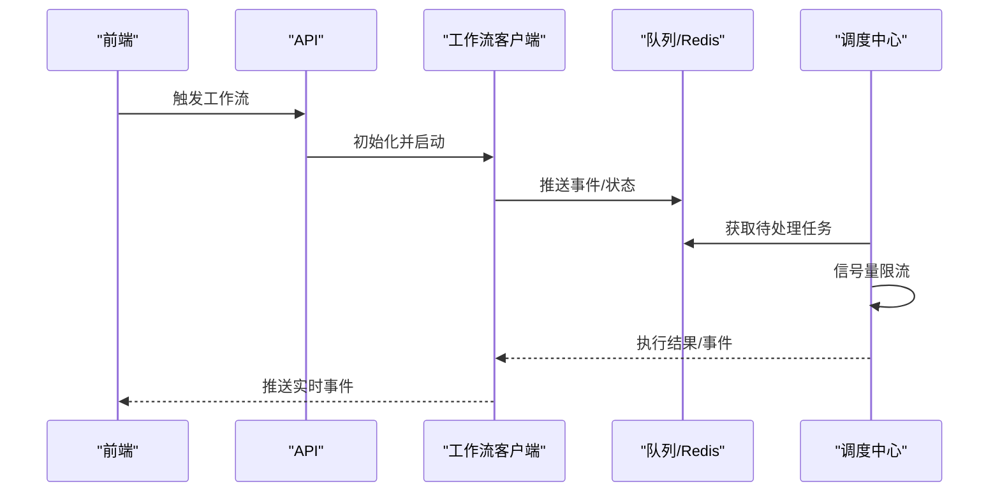
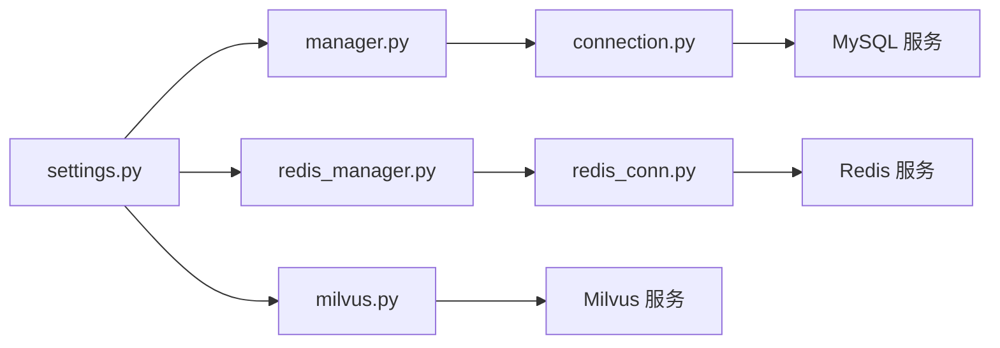

# 性能问题

<cite>
**本文引用的文件**
- [docker-compose.yml](file://docker/docker-compose.yml)
- [settings.py](file://src/backend/bisheng/core/config/settings.py)
- [redis_conn.py](file://src/backend/bisheng/core/cache/redis_conn.py)
- [redis_manager.py](file://src/backend/bisheng/core/cache/redis_manager.py)
- [connection.py](file://src/backend/bisheng/core/database/connection.py)
- [manager.py](file://src/backend/bisheng/core/database/manager.py)
- [milvus.py](file://src/backend/bisheng_langchain/vectorstores/milvus.py)
- [custom.py](file://src/backend/bisheng/interface/vector_store/custom.py)
- [workflow_client.py](file://src/backend/bisheng/chat/clients/workflow_client.py)
- [worker.py](file://src/backend/bisheng/linsight/worker.py)
- [threadpool.py](file://src/backend/bisheng/utils/threadpool.py)
- [util.py](file://src/backend/bisheng/utils/util.py)
- [linsight.py](file://src/backend/bisheng/linsight/api/endpoints/linsight.py)
- [telemetry_service.py](file://src/backend/bisheng/common/services/telemetry/telemetry_service.py)
- [group_resource.py](file://src/backend/bisheng/database/models/group_resource.py)
</cite>

## 目录
1. [简介](#简介)
2. [项目结构](#项目结构)
3. [核心组件](#核心组件)
4. [架构总览](#架构总览)
5. [详细组件分析](#详细组件分析)
6. [依赖关系分析](#依赖关系分析)
7. [性能考量](#性能考量)
8. [故障排除指南](#故障排除指南)
9. [结论](#结论)
10. [附录](#附录)

## 简介
本指南聚焦于 Bisheng 的性能问题排查与优化，覆盖数据库查询慢、向量检索延迟、缓存命中率低、CPU 使用异常等常见瓶颈，并结合系统中的 Redis、Milvus、数据库连接池、工作流执行与并发控制等模块，给出可操作的诊断步骤、优化策略与监控指标解读。文档同时提供性能测试与基准测试方法建议，帮助在不同环境（开发、容器化）中定位与解决性能问题。

## 项目结构
Bisheng 后端采用分层设计：配置与上下文管理（settings、context）、缓存（Redis）、数据库（SQLModel + SQLAlchemy 异步引擎）、向量存储（Milvus LangChain 封装）、工作流与任务执行（Celery/异步队列）、前端与 API 入口。容器编排通过 docker-compose 提供 MySQL、Redis、Elasticsearch、Milvus 等依赖服务。

图表来源
- [docker-compose.yml](file://docker/docker-compose.yml#L1-L201)
- [settings.py](file://src/backend/bisheng/core/config/settings.py#L210-L346)
- [redis_manager.py](file://src/backend/bisheng/core/cache/redis_manager.py#L1-L82)
- [redis_conn.py](file://src/backend/bisheng/core/cache/redis_conn.py#L1-L515)
- [manager.py](file://src/backend/bisheng/core/database/manager.py#L1-L174)
- [connection.py](file://src/backend/bisheng/core/database/connection.py#L1-L175)
- [milvus.py](file://src/backend/bisheng_langchain/vectorstores/milvus.py#L123-L213)
- [custom.py](file://src/backend/bisheng/interface/vector_store/custom.py#L52-L113)
- [workflow_client.py](file://src/backend/bisheng/chat/clients/workflow_client.py#L161-L186)
- [worker.py](file://src/backend/bisheng/linsight/worker.py#L117-L240)
- [threadpool.py](file://src/backend/bisheng/utils/threadpool.py#L105-L133)
- [util.py](file://src/backend/bisheng/utils/util.py#L346-L433)
- [telemetry_service.py](file://src/backend/bisheng/common/services/telemetry/telemetry_service.py#L17-L54)
- [linsight.py](file://src/backend/bisheng/linsight/api/endpoints/linsight.py#L292-L307)

章节来源
- [docker-compose.yml](file://docker/docker-compose.yml#L1-L201)
- [settings.py](file://src/backend/bisheng/core/config/settings.py#L210-L346)

## 核心组件
- 配置与设置：集中管理数据库、Redis、向量存储、对象存储、工作流与 Celery 等配置项，支持从环境变量注入与解密。
- 缓存（Redis）：统一的 Redis 客户端封装，支持单机、哨兵、集群模式；提供同步/异步接口与批量操作、管道等。
- 数据库：基于 SQLAlchemy 异步引擎与 SQLModel，提供连接池默认参数与健康检查、表初始化能力。
- 向量存储（Milvus）：LangChain 封装 Milvus，内置默认搜索参数（nprobe/ef/search_k），支持分区键过滤与一致性级别。
- 工作流与任务：工作流客户端负责事件推送与状态清理；Linsight 调度中心通过信号量限制并发，队列消费与节点心跳。
- 并发与线程池：通用线程池管理器，支持同步/异步任务提交与回收。
- 遥测与日志：事件结构化索引映射，按 trace_id 记录应用处理时长等指标，便于性能追踪。

章节来源
- [settings.py](file://src/backend/bisheng/core/config/settings.py#L210-L346)
- [redis_conn.py](file://src/backend/bisheng/core/cache/redis_conn.py#L1-L515)
- [redis_manager.py](file://src/backend/bisheng/core/cache/redis_manager.py#L1-L82)
- [connection.py](file://src/backend/bisheng/core/database/connection.py#L1-L175)
- [manager.py](file://src/backend/bisheng/core/database/manager.py#L1-L174)
- [milvus.py](file://src/backend/bisheng_langchain/vectorstores/milvus.py#L123-L213)
- [custom.py](file://src/backend/bisheng/interface/vector_store/custom.py#L52-L113)
- [workflow_client.py](file://src/backend/bisheng/chat/clients/workflow_client.py#L161-L186)
- [worker.py](file://src/backend/bisheng/linsight/worker.py#L117-L240)
- [threadpool.py](file://src/backend/bisheng/utils/threadpool.py#L105-L133)
- [util.py](file://src/backend/bisheng/utils/util.py#L346-L433)
- [telemetry_service.py](file://src/backend/bisheng/common/services/telemetry/telemetry_service.py#L17-L54)
- [linsight.py](file://src/backend/bisheng/linsight/api/endpoints/linsight.py#L292-L307)

## 架构总览
下图展示后端关键组件与外部依赖之间的交互，以及性能相关的关键路径（缓存、数据库、向量检索、工作流执行）。

图表来源
- [docker-compose.yml](file://docker/docker-compose.yml#L1-L201)
- [settings.py](file://src/backend/bisheng/core/config/settings.py#L236-L256)
- [redis_manager.py](file://src/backend/bisheng/core/cache/redis_manager.py#L48-L82)
- [manager.py](file://src/backend/bisheng/core/database/manager.py#L98-L174)
- [milvus.py](file://src/backend/bisheng_langchain/vectorstores/milvus.py#L123-L213)
- [worker.py](file://src/backend/bisheng/linsight/worker.py#L117-L240)

## 详细组件分析

### 缓存（Redis）与性能
- 连接与池化：支持单机、哨兵、集群模式；提供同步/异步连接池与连接复用；批量写入使用管道提升吞吐。
- 命中率与过期策略：通过统一的 set/get/mget 接口与 TTL 控制，建议对热点数据设置合理过期时间，避免缓存雪崩。
- 分布式场景：集群模式下按 key 定位节点，减少跨节点访问；注意键空间分布均衡。

图表来源
- [redis_manager.py](file://src/backend/bisheng/core/cache/redis_manager.py#L10-L82)
- [redis_conn.py](file://src/backend/bisheng/core/cache/redis_conn.py#L18-L515)

章节来源
- [redis_conn.py](file://src/backend/bisheng/core/cache/redis_conn.py#L1-L515)
- [redis_manager.py](file://src/backend/bisheng/core/cache/redis_manager.py#L1-L82)

### 数据库连接池与查询性能
- 默认连接池参数：池大小、溢出、超时、预 ping、回收周期等；SQLite 使用静态池，MySQL 设置字符集。
- 异步会话：提供异步/同步会话上下文管理，异常回滚与关闭确保资源释放。
- 健康检查：通过简单查询验证连接可用性，便于容器健康检查。

图表来源
- [connection.py](file://src/backend/bisheng/core/database/connection.py#L40-L175)
- [manager.py](file://src/backend/bisheng/core/database/manager.py#L64-L95)

章节来源
- [connection.py](file://src/backend/bisheng/core/database/connection.py#L1-L175)
- [manager.py](file://src/backend/bisheng/core/database/manager.py#L1-L174)

### 向量检索（Milvus）与性能
- 搜索参数：内置默认搜索参数（nprobe/ef/search_k），支持分区键过滤与元数据表达式组合。
- 查询流程：根据 embedding 执行 search，输出文档与分数；支持 limit/fetch_k 控制返回数量。
- 索引与一致性：支持多种索引类型与一致性级别，建议根据数据规模与查询模式选择合适索引与 ef/nprobe。

图表来源
- [milvus.py](file://src/backend/bisheng_langchain/vectorstores/milvus.py#L683-L966)
- [custom.py](file://src/backend/bisheng/interface/vector_store/custom.py#L52-L113)

章节来源
- [milvus.py](file://src/backend/bisheng_langchain/vectorstores/milvus.py#L123-L213)
- [milvus.py](file://src/backend/bisheng_langchain/vectorstores/milvus.py#L683-L966)
- [custom.py](file://src/backend/bisheng/interface/vector_store/custom.py#L52-L113)

### 工作流执行与并发控制
- 工作流客户端：持续监听工作流事件，完成后清理状态与对象，避免资源泄漏。
- 调度中心：通过信号量限制每进程最大并发数，默认值可按节点资源调整；队列消费与节点心跳保障稳定性。
- 任务路由：Celery 路由区分知识库与工作流任务队列，降低相互干扰。

图表来源
- [workflow_client.py](file://src/backend/bisheng/chat/clients/workflow_client.py#L161-L186)
- [worker.py](file://src/backend/bisheng/linsight/worker.py#L117-L240)
- [settings.py](file://src/backend/bisheng/core/config/settings.py#L129-L166)

章节来源
- [workflow_client.py](file://src/backend/bisheng/chat/clients/workflow_client.py#L161-L186)
- [worker.py](file://src/backend/bisheng/linsight/worker.py#L117-L240)
- [settings.py](file://src/backend/bisheng/core/config/settings.py#L129-L166)

### 并发与线程池
- 线程池管理器：支持同步/异步任务提交、取消与回收；适合 CPU 密集或阻塞型任务的并发控制。
- 重试装饰器：提供同步/异步重试，可配置次数与延迟，缓解瞬时失败。

章节来源
- [threadpool.py](file://src/backend/bisheng/utils/threadpool.py#L105-L133)
- [util.py](file://src/backend/bisheng/utils/util.py#L388-L433)

### 遥测与性能指标
- 事件索引映射：包含 event_id、event_type、trace_id、timestamp、user_context、event_data 等字段，便于聚合分析。
- 应用处理时长：端点记录开始/结束时间，计算毫秒级处理时长，用于性能追踪与报警阈值设定。

章节来源
- [telemetry_service.py](file://src/backend/bisheng/common/services/telemetry/telemetry_service.py#L17-L54)
- [linsight.py](file://src/backend/bisheng/linsight/api/endpoints/linsight.py#L292-L307)

## 依赖关系分析
- 配置驱动：settings 统一注入数据库/Redis/Milvus 等连接参数，docker-compose 提供服务地址与环境变量。
- 缓存与数据库：高频读取优先走 Redis；写入后及时失效或更新相关键；批量写入使用管道。
- 向量检索：根据业务需求调整 ef/nprobe 与索引类型；对大集合建议分区键过滤与元数据表达式组合。
- 工作流：通过 Celery 队列与调度中心实现异步执行；并发通过信号量限制，避免资源争用。

图表来源
- [settings.py](file://src/backend/bisheng/core/config/settings.py#L236-L256)
- [manager.py](file://src/backend/bisheng/core/database/manager.py#L98-L174)
- [connection.py](file://src/backend/bisheng/core/database/connection.py#L1-L175)
- [redis_manager.py](file://src/backend/bisheng/core/cache/redis_manager.py#L48-L82)
- [redis_conn.py](file://src/backend/bisheng/core/cache/redis_conn.py#L1-L515)
- [milvus.py](file://src/backend/bisheng_langchain/vectorstores/milvus.py#L123-L213)
- [docker-compose.yml](file://docker/docker-compose.yml#L1-L201)

章节来源
- [settings.py](file://src/backend/bisheng/core/config/settings.py#L210-L346)
- [docker-compose.yml](file://docker/docker-compose.yml#L1-L201)

## 性能考量
- 缓存策略
  - 热点数据设置短 TTL，避免陈旧；冷数据设置长 TTL 或不设置。
  - 批量写入使用 mset/pipeline，减少 RTT。
  - 对大对象序列化需评估内存与网络开销。
- 数据库连接池
  - 根据并发与查询复杂度调整 pool_size/max_overflow；启用 pool_pre_ping 与合理 pool_recycle。
  - 异步查询优先，避免阻塞主线程。
- 向量检索
  - 根据数据规模与召回率要求调整 ef/nprobe；对高维向量考虑索引类型与归一化。
  - 使用分区键与元数据表达式缩小搜索范围。
- 工作流与并发
  - 通过信号量限制每进程并发；根据 CPU/内存资源动态调整。
  - 任务路由分离，避免长耗时任务阻塞其他队列。
- 日志与遥测
  - 结构化事件记录 trace_id 与处理时长，建立性能基线与告警阈值。

[本节为通用指导，无需列出具体文件来源]

## 故障排除指南

### 1. 数据库查询慢
- 现象
  - 接口响应时间长、数据库连接超时或队列积压。
- 诊断步骤
  - 查看数据库健康检查是否通过；确认连接池参数是否合理。
  - 检查慢查询日志与执行计划（如适用）。
  - 关注事务回滚与异常日志，定位异常事务。
- 优化建议
  - 调整连接池大小与回收周期；启用预 ping。
  - 将复杂查询拆分为多个简单查询；必要时引入只读副本。
  - 对频繁查询的字段建立索引；避免全表扫描。

章节来源
- [manager.py](file://src/backend/bisheng/core/database/manager.py#L64-L95)
- [connection.py](file://src/backend/bisheng/core/database/connection.py#L40-L97)
- [group_resource.py](file://src/backend/bisheng/database/models/group_resource.py#L128-L157)

### 2. 向量检索延迟高
- 现象
  - 检索响应时间长、召回率波动。
- 诊断步骤
  - 检查 Milvus 服务健康状态与连接参数。
  - 对比不同索引类型与 ef/nprobe 参数下的延迟与准确率。
  - 使用分区键与元数据表达式缩小搜索范围。
- 优化建议
  - 根据数据规模选择合适索引；对高维向量启用归一化。
  - 减少每次检索返回的文档数量；分页或 top-k 优化。
  - 在检索前进行文本过滤与预筛选，降低无效查询。

章节来源
- [milvus.py](file://src/backend/bisheng_langchain/vectorstores/milvus.py#L123-L213)
- [milvus.py](file://src/backend/bisheng_langchain/vectorstores/milvus.py#L683-L966)
- [custom.py](file://src/backend/bisheng/interface/vector_store/custom.py#L52-L113)

### 3. 缓存命中率低
- 现象
  - Redis 内存占用高但命中率低、CPU 使用率升高。
- 诊断步骤
  - 通过 info 命令查看命中率、内存使用与连接数。
  - 检查键空间分布与过期策略，识别冷热数据。
- 优化建议
  - 热点数据设置短 TTL；冷数据延长 TTL 或淘汰。
  - 使用 pipeline 批量写入；避免大对象频繁序列化。
  - 对分布式部署，确保键分布均匀，减少跨节点访问。

章节来源
- [redis_conn.py](file://src/backend/bisheng/core/cache/redis_conn.py#L135-L173)
- [redis_manager.py](file://src/backend/bisheng/core/cache/redis_manager.py#L48-L82)

### 4. CPU 使用率异常
- 现象
  - 单核 CPU 使用率接近 100%，整体吞吐下降。
- 诊断步骤
  - 检查工作流并发是否过高；观察调度中心信号量是否被频繁 acquire/release。
  - 查看线程池任务是否阻塞或未及时回收。
- 优化建议
  - 降低每进程最大并发；根据 CPU 核心数与负载动态调整。
  - 将阻塞型任务迁移到异步执行或专用队列。
  - 使用重试装饰器处理瞬时失败，避免重复计算。

章节来源
- [worker.py](file://src/backend/bisheng/linsight/worker.py#L117-L240)
- [threadpool.py](file://src/backend/bisheng/utils/threadpool.py#L105-L133)
- [util.py](file://src/backend/bisheng/utils/util.py#L388-L433)

### 5. 内存占用过高
- 现象
  - 进程内存持续增长、触发 OOM。
- 诊断步骤
  - 检查 Redis 大对象与过期键清理；确认 pipeline 执行是否正确。
  - 关注数据库会话是否正确关闭，避免连接泄漏。
- 优化建议
  - 使用 UNLINK/异步清理大对象；定期清理过期键。
  - 限制单次批量操作的数据量；分批处理。
  - 合理设置连接池上限与回收周期。

章节来源
- [redis_conn.py](file://src/backend/bisheng/core/cache/redis_conn.py#L348-L360)
- [connection.py](file://src/backend/bisheng/core/database/connection.py#L156-L175)

### 6. 性能监控指标解读
- Redis
  - 命中率：命中/（命中+未命中）；低命中率提示缓存穿透或过期策略不当。
  - 内存使用：关注 used_memory、fragmentation_ratio；碎片率过高建议重启或启用主动碎片整理。
- Milvus
  - 查询耗时：对比不同 ef/nprobe 下的延迟与准确率；关注集合大小与索引类型。
  - 连接与队列：检查连接数与队列长度，避免过载。
- 数据库
  - 连接池使用：活跃连接数、等待时间、超时次数；异常增多需调大池或优化查询。
  - 健康检查：容器健康检查失败需检查连接参数与服务可达性。
- 遥测与日志
  - trace_id + 处理时长：建立基线与阈值，异常波动即刻报警。

章节来源
- [telemetry_service.py](file://src/backend/bisheng/common/services/telemetry/telemetry_service.py#L17-L54)
- [linsight.py](file://src/backend/bisheng/linsight/api/endpoints/linsight.py#L292-L307)
- [docker-compose.yml](file://docker/docker-compose.yml#L1-L201)

### 7. 缓存策略优化、数据库索引调优与向量存储配置
- 缓存策略
  - 读多写少场景：提高命中率；写后失效或延时更新。
  - 大对象：压缩或分片存储；避免频繁序列化。
- 数据库索引
  - 高频过滤字段建立索引；复合索引遵循最左匹配原则。
  - 定期分析执行计划，剔除冗余索引。
- 向量存储
  - 根据数据规模与查询模式选择索引类型；调整 ef/nprobe 平衡延迟与准确率。
  - 使用分区键与元数据表达式缩小搜索范围。

章节来源
- [redis_conn.py](file://src/backend/bisheng/core/cache/redis_conn.py#L135-L173)
- [milvus.py](file://src/backend/bisheng_langchain/vectorstores/milvus.py#L123-L213)
- [group_resource.py](file://src/backend/bisheng/database/models/group_resource.py#L128-L157)

### 8. 工作流执行优化、并发处理调优与资源分配建议
- 并发控制
  - 通过信号量限制每进程最大并发；根据 CPU/内存资源动态调整。
  - 任务路由分离，避免长耗时任务阻塞其他队列。
- 资源分配
  - 后端与 worker 服务独立部署，按角色分配 CPU/内存。
  - 容器健康检查失败时自动重启，保障可用性。

章节来源
- [worker.py](file://src/backend/bisheng/linsight/worker.py#L117-L240)
- [settings.py](file://src/backend/bisheng/core/config/settings.py#L129-L166)
- [docker-compose.yml](file://docker/docker-compose.yml#L67-L107)

### 9. 性能测试方法与基准测试工具使用
- 测试方法
  - 压力测试：逐步增加并发与请求速率，观察延迟与错误率变化。
  - 回归测试：固定场景对比优化前后指标（延迟、吞吐、错误率）。
- 基准工具
  - 数据库：使用标准基准工具生成稳定负载；关注连接池与查询计划。
  - 缓存：模拟真实访问模式，测量命中率与延迟。
  - 向量检索：构造不同规模与维度的向量集，对比索引与参数组合。
  - 工作流：模拟真实工作流执行路径，评估队列与并发限制效果。

[本节为通用指导，无需列出具体文件来源]

## 结论
通过对 Redis、数据库、Milvus、工作流与并发控制等关键模块的系统性分析与优化，可有效缓解 Bisheng 的性能瓶颈。建议以配置为中心，结合容器化部署与健康检查，建立完善的监控与告警体系，并通过压力测试与回归测试持续验证优化效果。

[本节为总结性内容，无需列出具体文件来源]

## 附录
- 关键配置项参考
  - 数据库连接：见连接池参数与异步引擎转换逻辑。
  - Redis 连接：见单机/哨兵/集群模式与连接池参数。
  - Milvus 搜索参数：见默认 nprobe/ef/search_k。
  - Celery 路由与定时任务：见任务路由与计划任务配置。

章节来源
- [connection.py](file://src/backend/bisheng/core/database/connection.py#L40-L97)
- [redis_conn.py](file://src/backend/bisheng/core/cache/redis_conn.py#L20-L56)
- [milvus.py](file://src/backend/bisheng_langchain/vectorstores/milvus.py#L123-L213)
- [settings.py](file://src/backend/bisheng/core/config/settings.py#L129-L166)