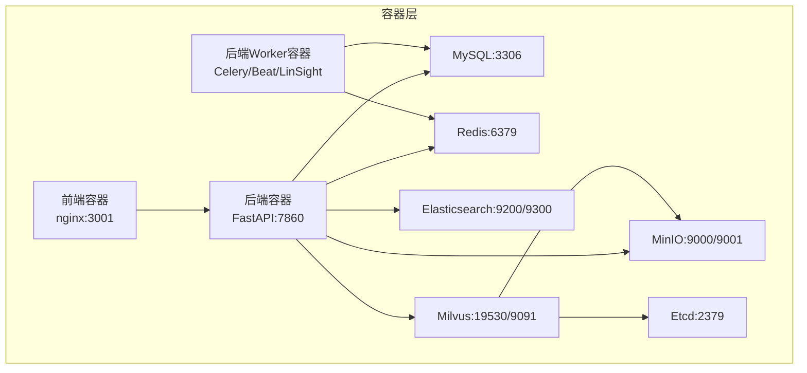
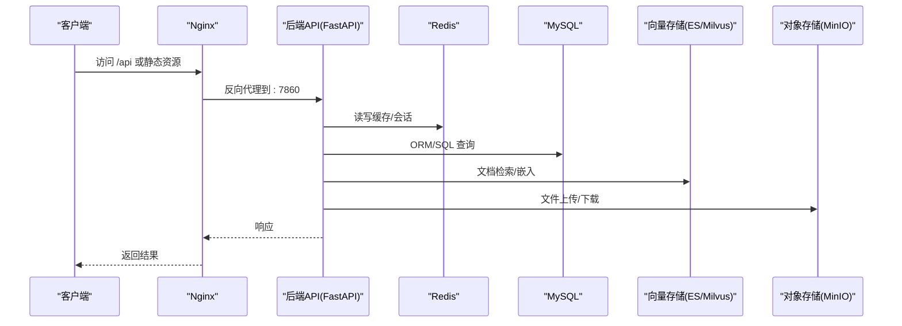
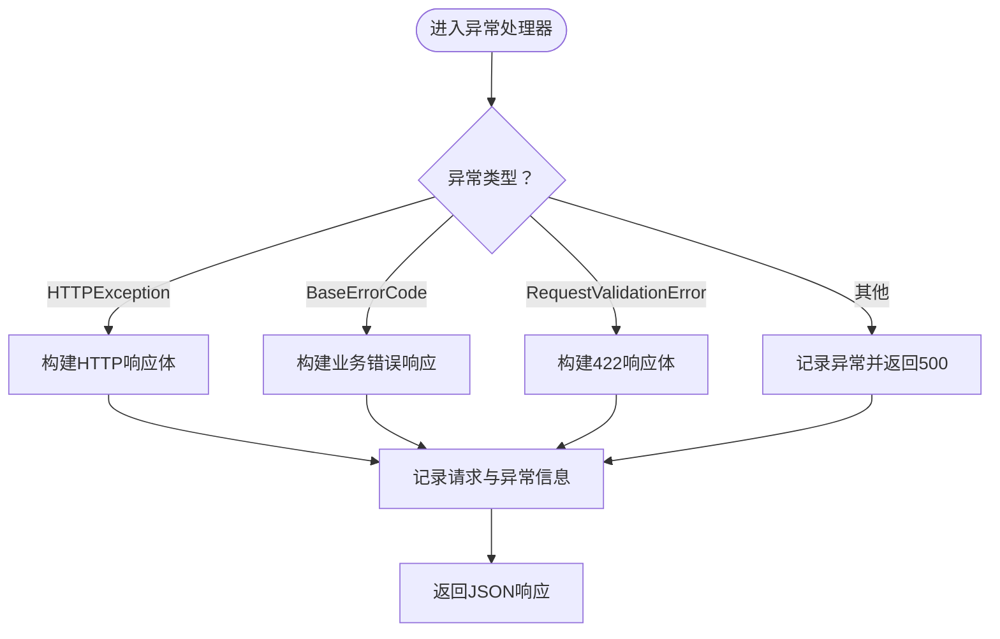
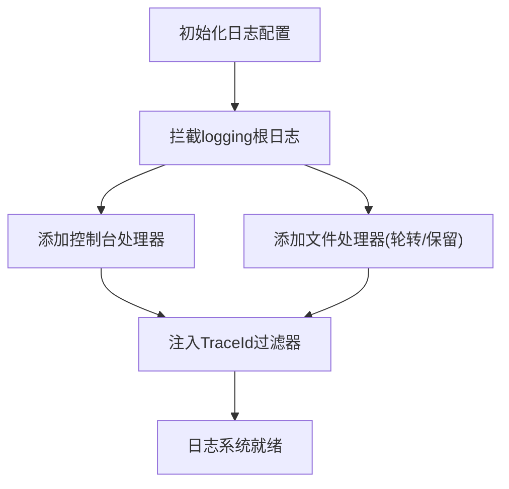
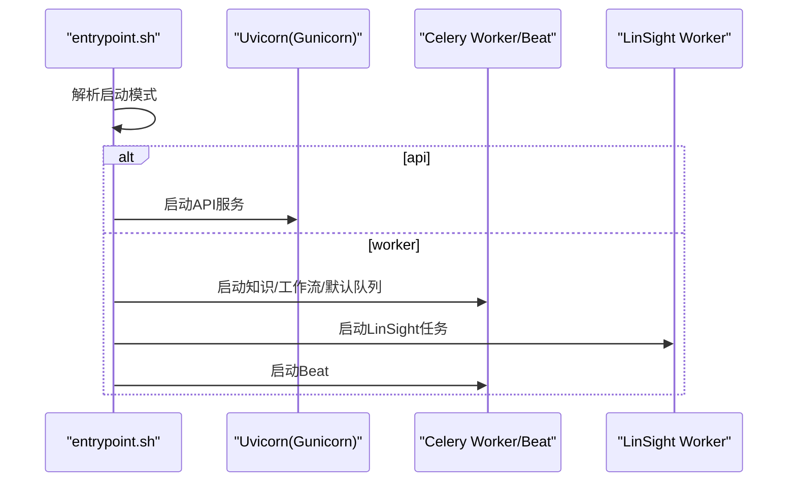
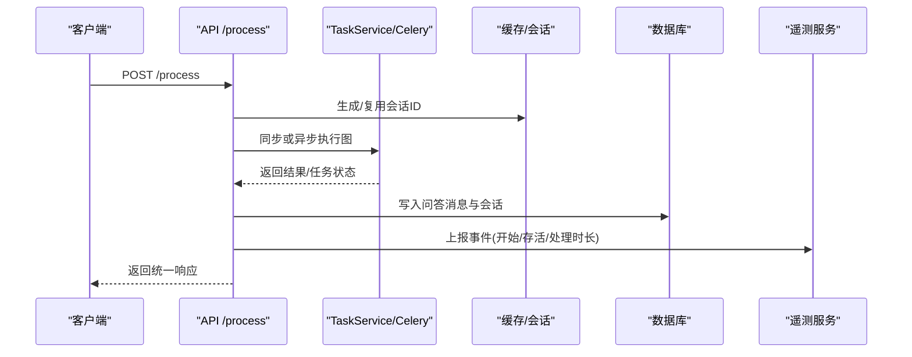
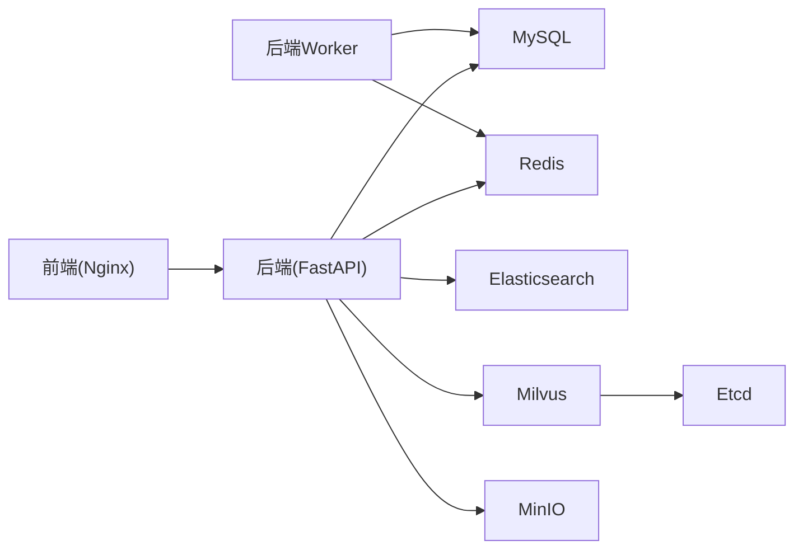

# 故障排除

<cite>
**本文引用的文件**   
- [README.md](file://README.md)
- [SECURITY.md](file://SECURITY.md)
- [docker-compose.yml](file://docker/docker-compose.yml)
- [config.yaml](file://docker/bisheng/config/config.yaml)
- [main.py](file://src/backend/bisheng/main.py)
- [server.py](file://src/backend/bisheng/server.py)
- [logger.py](file://src/backend/bisheng/core/logger.py)
- [settings.py](file://src/backend/bisheng/core/config/settings.py)
- [auth.py](file://src/backend/bisheng/common/exceptions/auth.py)
- [exceptions.py](file://src/backend/bisheng/utils/exceptions.py)
- [base.py](file://src/backend/bisheng/common/errcode/base.py)
- [endpoints.py](file://src/backend/bisheng/api/v1/endpoints.py)
- [entrypoint.sh](file://docker/bisheng/entrypoint.sh)
- [nginx.conf](file://docker/nginx/nginx.conf)
- [default.conf](file://docker/nginx/conf.d/default.conf)
</cite>

## 目录
1. [简介](#简介)
2. [项目结构](#项目结构)
3. [核心组件](#核心组件)
4. [架构总览](#架构总览)
5. [详细组件分析](#详细组件分析)
6. [依赖关系分析](#依赖关系分析)
7. [性能考量](#性能考量)
8. [故障排除指南](#故障排除指南)
9. [结论](#结论)
10. [附录](#附录)

## 简介
本指南面向运维与平台工程师，聚焦 Bisheng 在企业级场景下的故障排除与运维保障。内容覆盖安装部署、性能瓶颈、配置错误、集成故障、日志与监控、性能调优、安全加固、恢复与备份、高可用与应急响应等。文档以仓库现有实现为依据，结合容器编排与后端服务特性，提供可操作的诊断步骤与优化建议。

## 项目结构
Bisheng 采用前后端分离与多服务容器化部署。后端基于 FastAPI，前端通过 Nginx 提供静态资源与反向代理；数据库、缓存、向量检索与对象存储由 Docker Compose 统一编排。关键目录与文件如下：
- docker/docker-compose.yml：后端、前端、数据库、缓存、ES、Milvus、MinIO、Etcd 的编排与健康检查
- docker/bisheng/config/config.yaml：应用配置（数据库、Redis、Celery、向量存储、对象存储、日志）
- src/backend/bisheng/main.py：FastAPI 应用入口、异常处理、中间件、健康检查端点
- docker/bisheng/entrypoint.sh：启动模式选择（API/Worker/Beat/LinSight），并发与队列配置
- docker/nginx/conf.d/default.conf：API 与静态资源代理、WebSocket 升级、跨域与头部安全
- src/backend/bisheng/core/logger.py：日志拦截与多处理器配置
- src/backend/bisheng/core/config/settings.py：配置模型与解密逻辑、环境变量注入

图表来源
- [docker-compose.yml](file://docker/docker-compose.yml#L1-L201)
- [default.conf](file://docker/nginx/conf.d/default.conf#L46-L59)

章节来源
- [docker-compose.yml](file://docker/docker-compose.yml#L1-L201)
- [config.yaml](file://docker/bisheng/config/config.yaml#L1-L88)
- [main.py](file://src/backend/bisheng/main.py#L64-L102)
- [entrypoint.sh](file://docker/bisheng/entrypoint.sh#L32-L66)
- [nginx.conf](file://docker/nginx/nginx.conf#L14-L32)
- [default.conf](file://docker/nginx/conf.d/default.conf#L1-L65)

## 核心组件
- 应用入口与异常处理：统一异常映射、HTTP/校验错误、业务错误码封装、健康检查端点
- 日志系统：Loguru 多处理器、TraceId 追踪、根日志拦截、访问日志降噪
- 配置体系：数据库/Redis/Celery/向量存储/对象存储/日志配置模型与环境变量注入
- 启动与工作进程：entrypoint.sh 支持多种启动模式与并发参数
- 反向代理：Nginx 负责静态资源、API 代理、WebSocket 升级、跨域与安全头

章节来源
- [main.py](file://src/backend/bisheng/main.py#L21-L49)
- [logger.py](file://src/backend/bisheng/core/logger.py#L51-L98)
- [settings.py](file://src/backend/bisheng/core/config/settings.py#L23-L346)
- [entrypoint.sh](file://docker/bisheng/entrypoint.sh#L1-L67)
- [default.conf](file://docker/nginx/conf.d/default.conf#L46-L59)

## 架构总览
后端服务通过 Uvicorn/Gunicorn 承载 API，Celery Worker/Beat/LinSight 处理异步任务，Nginx 提供静态资源与反向代理。外部依赖包括 MySQL、Redis、Elasticsearch、Milvus、MinIO、Etcd。健康检查贯穿各服务，便于自动恢复与状态观测。

图表来源
- [docker-compose.yml](file://docker/docker-compose.yml#L41-L123)
- [default.conf](file://docker/nginx/conf.d/default.conf#L46-L65)
- [main.py](file://src/backend/bisheng/main.py#L77-L79)

## 详细组件分析

### 异常与错误处理
- 统一异常映射：HTTPException、请求校验错误、业务错误码、通用异常均被规范化返回
- 业务错误码：提供 SSE 事件、WebSocket 关闭消息等序列化能力
- JWT 认证异常：独立异常类型，便于 401 响应处理
- 工具异常：忽略类、消息类、文件解析、ETL 等异常类型

图表来源
- [main.py](file://src/backend/bisheng/main.py#L21-L49)
- [base.py](file://src/backend/bisheng/common/errcode/base.py#L9-L97)
- [auth.py](file://src/backend/bisheng/common/exceptions/auth.py#L1-L16)
- [exceptions.py](file://src/backend/bisheng/utils/exceptions.py#L1-L36)

章节来源
- [main.py](file://src/backend/bisheng/main.py#L21-L49)
- [base.py](file://src/backend/bisheng/common/errcode/base.py#L9-L97)
- [auth.py](file://src/backend/bisheng/common/exceptions/auth.py#L1-L16)
- [exceptions.py](file://src/backend/bisheng/utils/exceptions.py#L1-L36)

### 日志与追踪
- TraceId：上下文变量注入，统一日志追踪
- 根日志拦截：logging 到 loguru 的桥接，降低噪音
- 多处理器：控制台与文件处理器，支持按级别与格式过滤
- 访问日志降噪：针对第三方库访问日志设置 INFO 级别

图表来源
- [logger.py](file://src/backend/bisheng/core/logger.py#L51-L98)

章节来源
- [logger.py](file://src/backend/bisheng/core/logger.py#L51-L98)
- [config.yaml](file://docker/bisheng/config/config.yaml#L63-L88)

### 配置与启动
- 配置模型：数据库、Redis、Celery、向量存储、对象存储、日志、工作流、Cookie、ETL 等
- 解密逻辑：数据库与 Redis 密码在加载时解密，避免明文存储
- 启动模式：entrypoint.sh 支持 api、worker、knowledge、workflow、beat、default、linsight
- 并发与队列：Worker 数量、线程池、队列路由、定时任务计划

图表来源
- [entrypoint.sh](file://docker/bisheng/entrypoint.sh#L32-L66)
- [server.py](file://src/backend/bisheng/server.py#L4-L21)
- [settings.py](file://src/backend/bisheng/core/config/settings.py#L129-L167)

章节来源
- [settings.py](file://src/backend/bisheng/core/config/settings.py#L23-L346)
- [entrypoint.sh](file://docker/bisheng/entrypoint.sh#L1-L67)
- [server.py](file://src/backend/bisheng/server.py#L4-L21)

### API 流程与 Telemetry
- /process 接口：同步/异步执行工作流，记录会话与 Telemetry 事件
- 文件上传：MinIO 存储，支持图标与工作流资源
- 配置管理：管理员可更新系统配置与前端配置

图表来源
- [endpoints.py](file://src/backend/bisheng/api/v1/endpoints.py#L174-L350)

章节来源
- [endpoints.py](file://src/backend/bisheng/api/v1/endpoints.py#L157-L350)

## 依赖关系分析
- 后端依赖：FastAPI、Loguru、Celery、Pydantic 配置模型、数据库驱动、向量存储客户端、对象存储 SDK
- 容器依赖：MySQL、Redis、Elasticsearch、Milvus、MinIO、Etcd、Nginx
- 健康检查：各服务通过 healthcheck 检测运行状态，失败自动重启

图表来源
- [docker-compose.yml](file://docker/docker-compose.yml#L1-L201)

章节来源
- [docker-compose.yml](file://docker/docker-compose.yml#L1-L201)

## 性能考量
- 日志级别与噪音控制：通过 logger.py 将第三方访问日志提升至 INFO，减少噪声
- 并发与队列：entrypoint.sh 中知识库/工作流/默认队列的并发与线程数可根据负载调整
- 缓存策略：Redis 作为主要缓存，需关注键空间与过期策略；内存缓存用于回退
- 数据库与索引：MySQL 连接参数与查询优化；ES/Milvus 的分片与副本、查询超时
- 对象存储：MinIO 的桶策略与生命周期，避免冷热不均导致延迟

章节来源
- [logger.py](file://src/backend/bisheng/core/logger.py#L63-L70)
- [entrypoint.sh](file://docker/bisheng/entrypoint.sh#L8-L30)
- [config.yaml](file://docker/bisheng/config/config.yaml#L6-L25)

## 故障排除指南

### 一、安装部署问题
- 症状：容器启动失败或健康检查失败
  - 排查要点
    - 数据库连接：确认 MySQL 环境变量与密码一致，必要时同步修改配置文件
    - 缓存连接：Redis 地址与认证是否正确
    - 向量存储：ES/Milvus 地址与认证配置
    - 对象存储：MinIO 端点与凭据
  - 参考文件
    - [docker-compose.yml](file://docker/docker-compose.yml#L2-L21)
    - [config.yaml](file://docker/bisheng/config/config.yaml#L3-L54)

- 症状：首次访问页面空白或 404
  - 排查要点
    - Nginx 代理：确认 /api 与静态资源路径映射
    - 健康检查：后端 /health 是否返回 OK
  - 参考文件
    - [default.conf](file://docker/nginx/conf.d/default.conf#L46-L65)
    - [main.py](file://src/backend/bisheng/main.py#L77-L79)

- 症状：权限不足或无法登录
  - 排查要点
    - JWT 与 Cookie 配置、登录方法
    - 认证异常处理与 401 响应
  - 参考文件
    - [settings.py](file://src/backend/bisheng/core/config/settings.py#L198-L258)
    - [auth.py](file://src/backend/bisheng/common/exceptions/auth.py#L1-L16)
    - [main.py](file://src/backend/bisheng/main.py#L92-L94)

章节来源
- [docker-compose.yml](file://docker/docker-compose.yml#L2-L21)
- [config.yaml](file://docker/bisheng/config/config.yaml#L3-L54)
- [default.conf](file://docker/nginx/conf.d/default.conf#L46-L65)
- [main.py](file://src/backend/bisheng/main.py#L77-L79)
- [settings.py](file://src/backend/bisheng/core/config/settings.py#L198-L258)
- [auth.py](file://src/backend/bisheng/common/exceptions/auth.py#L1-L16)

### 二、性能瓶颈
- 症状：接口响应慢、CPU/内存占用高
  - 排查要点
    - 日志级别：确认未过度开启 DEBUG
    - 并发参数：entrypoint.sh 中 worker 线程与数量
    - 缓存命中率：Redis 使用情况与过期策略
    - 数据库慢查询：连接池与 SQL 优化
  - 参考文件
    - [logger.py](file://src/backend/bisheng/core/logger.py#L51-L98)
    - [entrypoint.sh](file://docker/bisheng/entrypoint.sh#L8-L30)
    - [config.yaml](file://docker/bisheng/config/config.yaml#L6-L25)

- 症状：向量检索延迟高
  - 排查要点
    - ES/Milvus 配置与副本/分片
    - 查询超时与重试策略
  - 参考文件
    - [config.yaml](file://docker/bisheng/config/config.yaml#L35-L42)
    - [settings.py](file://src/backend/bisheng/core/config/settings.py#L65-L94)

章节来源
- [logger.py](file://src/backend/bisheng/core/logger.py#L51-L98)
- [entrypoint.sh](file://docker/bisheng/entrypoint.sh#L8-L30)
- [config.yaml](file://docker/bisheng/config/config.yaml#L6-L42)
- [settings.py](file://src/backend/bisheng/core/config/settings.py#L65-L94)

### 三、配置错误
- 症状：数据库/Redis 密码解密失败或连接异常
  - 排查要点
    - settings 加载时对密码进行解密，确认密文格式与密钥一致
  - 参考文件
    - [settings.py](file://src/backend/bisheng/core/config/settings.py#L262-L283)
    - [settings.py](file://src/backend/bisheng/core/config/settings.py#L287-L323)

- 症状：对象存储不可用
  - 排查要点
    - MinIO 端点、凭据、公共桶与临时桶配置
  - 参考文件
    - [config.yaml](file://docker/bisheng/config/config.yaml#L45-L56)

章节来源
- [settings.py](file://src/backend/bisheng/core/config/settings.py#L262-L283)
- [settings.py](file://src/backend/bisheng/core/config/settings.py#L287-L323)
- [config.yaml](file://docker/bisheng/config/config.yaml#L45-L56)

### 四、集成故障
- 症状：WebSocket/代理升级失败
  - 排查要点
    - Nginx map $http_upgrade 与 $connection_upgrade 配置
    - 反向代理头与版本
  - 参考文件
    - [default.conf](file://docker/nginx/conf.d/default.conf#L2-L6)
    - [default.conf](file://docker/nginx/conf.d/default.conf#L46-L59)

- 症状：静态资源缓存导致页面不更新
  - 排查要点
    - Nginx 对 index.html 的缓存禁用头
  - 参考文件
    - [default.conf](file://docker/nginx/conf.d/default.conf#L24-L29)
    - [default.conf](file://docker/nginx/conf.d/default.conf#L37-L42)

章节来源
- [default.conf](file://docker/nginx/conf.d/default.conf#L2-L6)
- [default.conf](file://docker/nginx/conf.d/default.conf#L24-L29)
- [default.conf](file://docker/nginx/conf.d/default.conf#L37-L42)
- [default.conf](file://docker/nginx/conf.d/default.conf#L46-L59)

### 五、错误诊断与工具
- 日志分析
  - 控制台与文件日志：查看 trace_id 关联请求链路
  - 统一日志格式：包含时间、级别、模块行号、TraceId
- 监控指标
  - 健康检查：后端 /health、各服务 healthcheck
  - 访问日志：Nginx access_log 观察 4xx/5xx 与响应时长
- 调试技巧
  - 开启 debug 模式（settings.debug）与 tracemalloc 快照
  - API 层异常统一处理，便于定位业务错误码

章节来源
- [config.yaml](file://docker/bisheng/config/config.yaml#L63-L88)
- [main.py](file://src/backend/bisheng/main.py#L77-L79)
- [docker-compose.yml](file://docker/docker-compose.yml#L67-L72)
- [endpoints.py](file://src/backend/bisheng/api/v1/endpoints.py#L54-L61)

### 六、性能调优策略
- 数据库优化
  - 连接池大小与超时、慢查询日志、索引优化
- 缓存配置
  - Redis 集群/哨兵模式与密码解密
  - 缓存键空间与过期策略
- 资源分配建议
  - Worker 并发与线程数按任务类型拆分
  - Nginx worker_connections 与 keepalive_timeout

章节来源
- [config.yaml](file://docker/bisheng/config/config.yaml#L11-L22)
- [entrypoint.sh](file://docker/bisheng/entrypoint.sh#L8-L30)
- [nginx.conf](file://docker/nginx/nginx.conf#L9-L11)
- [nginx.conf](file://docker/nginx/nginx.conf#L27-L28)

### 七、安全加固
- 报告流程：私有渠道报告安全问题，遵循披露政策与修复窗口
- 支持版本：仅主干与开发提交受支持
- 配置安全：避免明文密码，使用加密串与环境变量注入
- 访问控制：Nginx 安全头、CORS、Cookie 属性
- 数据保护：对象存储桶策略与证书校验开关

章节来源
- [SECURITY.md](file://SECURITY.md#L1-L40)
- [settings.py](file://src/backend/bisheng/core/config/settings.py#L15-L21)
- [config.yaml](file://docker/bisheng/config/config.yaml#L3-L54)
- [default.conf](file://docker/nginx/conf.d/default.conf#L57-L58)

### 八、系统恢复与备份
- 备份策略
  - 数据库：定期快照与增量备份
  - 缓存：持久化策略与集群一致性
  - 对象存储：桶生命周期与跨区域复制
- 恢复流程
  - 逐项恢复：先 ES/Milvus，再 MinIO，最后数据库与后端
  - 服务重启：确保健康检查通过后再放量
- 高可用部署
  - 多副本与滚动更新
  - 负载均衡与健康探针

章节来源
- [docker-compose.yml](file://docker/docker-compose.yml#L1-L201)
- [config.yaml](file://docker/bisheng/config/config.yaml#L45-L56)

### 九、运维标准流程与应急响应
- 标准流程
  - 发现问题 → 现场处置 → 影响评估 → 修复验证 → 复盘归档
- 应急响应
  - 快速隔离：停止异常队列或限流
  - 降级策略：关闭非关键功能、启用缓存回退
  - 通知机制：按级别上报与公告

章节来源
- [README.md](file://README.md#L60-L87)

## 结论
本指南基于仓库现有实现，梳理了 Bisheng 的部署、运行、监控与维护关键路径。建议在生产环境中：
- 严格使用加密串与环境变量注入
- 合理配置缓存与并发参数
- 建立完善的日志与健康检查体系
- 制定安全与灾备预案并定期演练

## 附录
- 快速检查清单
  - 所有服务健康检查通过
  - /health 返回 OK
  - 日志中无大量 ERROR/WARNING
  - Nginx 反代与 WebSocket 升级正常
  - Redis/MySQL/ES/Milvus/MinIO 连接正常
  - Celery 队列消费正常且无积压