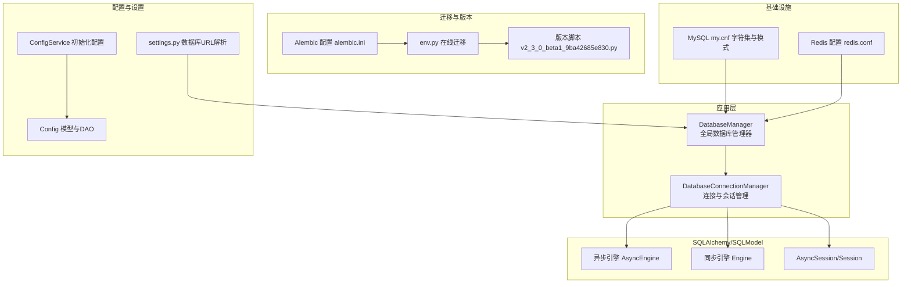
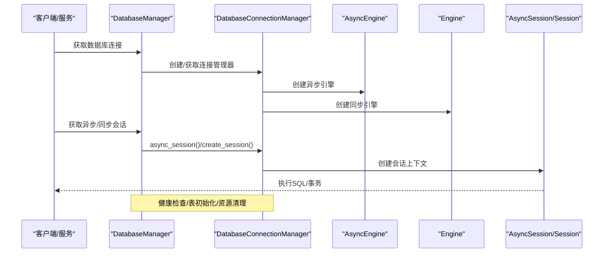
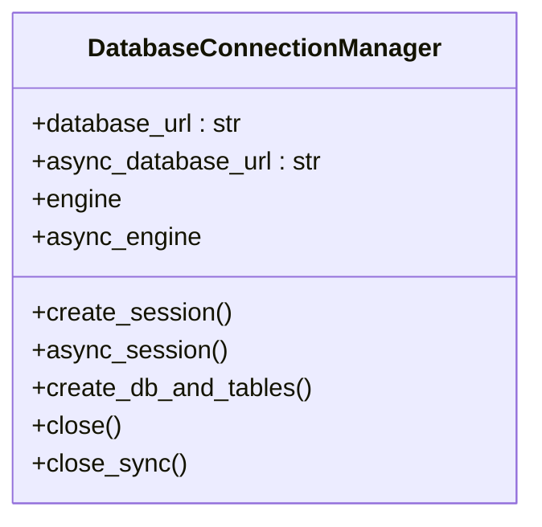
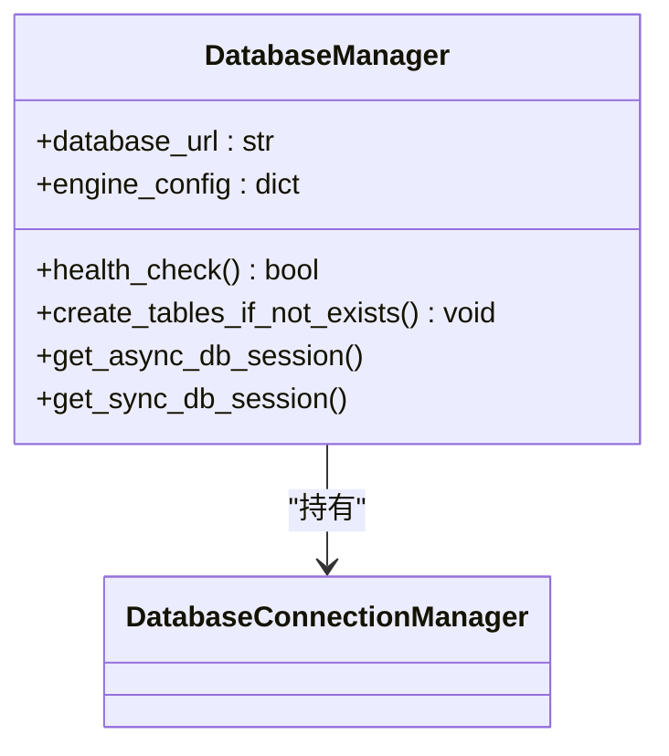
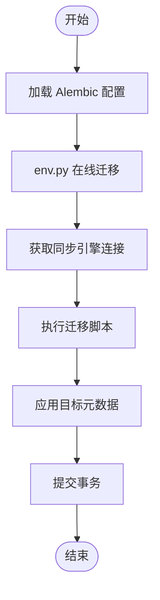
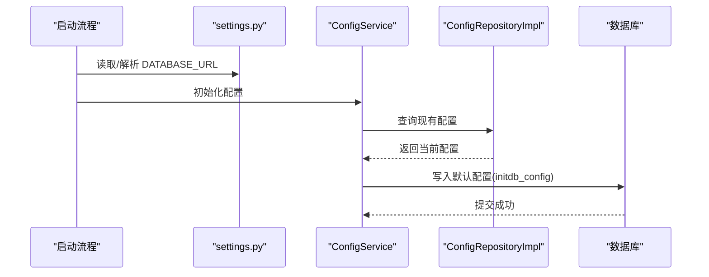
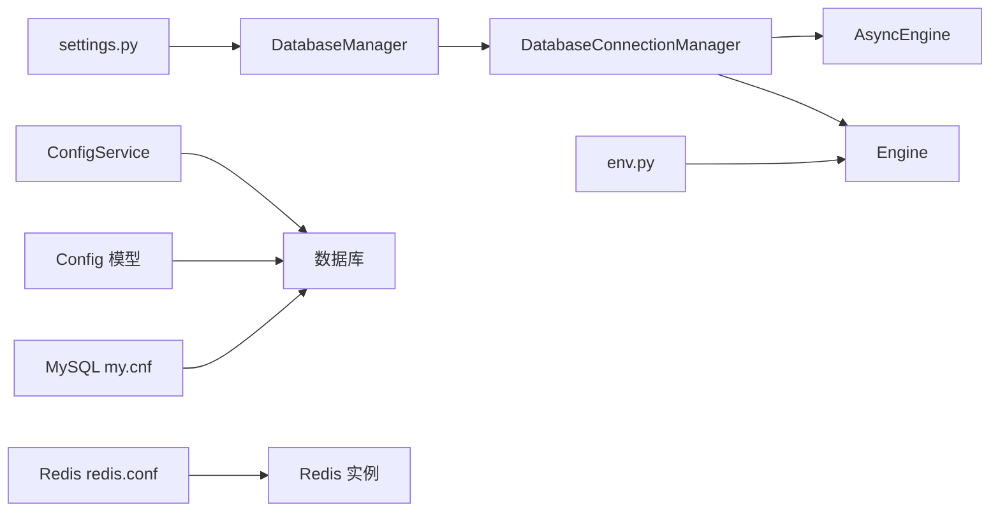

# 数据库问题

<cite>
**本文引用的文件**
- [src/backend/bisheng/core/database/manager.py](file://src/backend/bisheng/core/database/manager.py)
- [src/backend/bisheng/core/database/connection.py](file://src/backend/bisheng/core/database/connection.py)
- [src/backend/alembic.ini](file://src/backend/alembic.ini)
- [src/backend/bisheng/core/database/alembic/env.py](file://src/backend/bisheng/core/database/alembic/env.py)
- [src/backend/bisheng/core/database/alembic/versions/v2_3_0_beta1_9ba42685e830.py](file://src/backend/bisheng/core/database/alembic/versions/v2_3_0_beta1_9ba42685e830.py)
- [docker/mysql/conf/my.cnf](file://docker/mysql/conf/my.cnf)
- [src/backend/bisheng/core/config/settings.py](file://src/backend/bisheng/core/config/settings.py)
- [src/backend/bisheng/common/models/config.py](file://src/backend/bisheng/common/models/config.py)
- [src/backend/bisheng/common/services/config_service.py](file://src/backend/bisheng/common/services/config_service.py)
- [src/backend/bisheng/common/repositories/implementations/base_repository_impl.py](file://src/backend/bisheng/common/repositories/implementations/base_repository_impl.py)
- [docker/redis/redis.conf](file://docker/redis/redis.conf)
</cite>

## 目录
1. [简介](#简介)
2. [项目结构](#项目结构)
3. [核心组件](#核心组件)
4. [架构总览](#架构总览)
5. [详细组件分析](#详细组件分析)
6. [依赖关系分析](#依赖关系分析)
7. [性能考量](#性能考量)
8. [故障排除指南](#故障排除指南)
9. [结论](#结论)
10. [附录](#附录)

## 简介
本指南聚焦于 Bisheng 的数据库相关问题与排障实践，覆盖数据库连接失败、表结构不一致、数据迁移错误、事务处理异常、Alembic 版本管理问题、数据库锁等待与死锁检测、性能监控与慢查询分析、索引优化策略、备份恢复与主从同步、高可用配置以及连接池与事务隔离级别的配置与调优。文档以代码为依据，结合实际可操作的流程图与时序图，帮助研发与运维人员快速定位并解决问题。

## 项目结构
Bisheng 的数据库层由“全局连接管理器 + 连接管理器 + 异步/同步引擎 + 会话上下文 + Alembic 迁移”构成，并通过配置服务与设置模块注入数据库 URL。MySQL 与 Redis 提供了容器化部署的默认配置，便于在本地或生产环境进行验证与排障。

图表来源
- [src/backend/bisheng/core/database/manager.py](file://src/backend/bisheng/core/database/manager.py#L1-L174)
- [src/backend/bisheng/core/database/connection.py](file://src/backend/bisheng/core/database/connection.py#L1-L175)
- [src/backend/alembic.ini](file://src/backend/alembic.ini#L1-L148)
- [src/backend/bisheng/core/database/alembic/env.py](file://src/backend/bisheng/core/database/alembic/env.py#L1-L50)
- [src/backend/bisheng/core/database/alembic/versions/v2_3_0_beta1_9ba42685e830.py](file://src/backend/bisheng/core/database/alembic/versions/v2_3_0_beta1_9ba42685e830.py#L1-L46)
- [src/backend/bisheng/core/config/settings.py](file://src/backend/bisheng/core/config/settings.py#L260-L283)
- [src/backend/bisheng/common/services/config_service.py](file://src/backend/bisheng/common/services/config_service.py#L86-L123)
- [src/backend/bisheng/common/models/config.py](file://src/backend/bisheng/common/models/config.py#L24-L64)
- [docker/mysql/conf/my.cnf](file://docker/mysql/conf/my.cnf#L1-L12)
- [docker/redis/redis.conf](file://docker/redis/redis.conf#L1797-L1821)

章节来源
- [src/backend/bisheng/core/database/manager.py](file://src/backend/bisheng/core/database/manager.py#L1-L174)
- [src/backend/bisheng/core/database/connection.py](file://src/backend/bisheng/core/database/connection.py#L1-L175)
- [src/backend/alembic.ini](file://src/backend/alembic.ini#L1-L148)
- [src/backend/bisheng/core/database/alembic/env.py](file://src/backend/bisheng/core/database/alembic/env.py#L1-L50)
- [src/backend/bisheng/core/database/alembic/versions/v2_3_0_beta1_9ba42685e830.py](file://src/backend/bisheng/core/database/alembic/versions/v2_3_0_beta1_9ba42685e830.py#L1-L46)
- [docker/mysql/conf/my.cnf](file://docker/mysql/conf/my.cnf#L1-L12)
- [src/backend/bisheng/core/config/settings.py](file://src/backend/bisheng/core/config/settings.py#L260-L283)
- [src/backend/bisheng/common/models/config.py](file://src/backend/bisheng/common/models/config.py#L24-L64)
- [src/backend/bisheng/common/services/config_service.py](file://src/backend/bisheng/common/services/config_service.py#L86-L123)
- [docker/redis/redis.conf](file://docker/redis/redis.conf#L1797-L1821)

## 核心组件
- 全局数据库管理器：负责生命周期管理、健康检查、表初始化、统一获取连接实例。
- 连接管理器：负责异步/同步引擎创建、连接池配置、会话上下文、资源释放。
- Alembic 迁移：通过 env.py 在线连接数据库执行迁移；版本脚本定义增删字段与数据迁移。
- 配置系统：settings 解析数据库 URL（含密码解密），ConfigService 初始化默认配置，Config 模型持久化配置。
- 基础设施：MySQL 字符集与 SQL 模式配置；Redis 慢日志与延迟监控配置。

章节来源
- [src/backend/bisheng/core/database/manager.py](file://src/backend/bisheng/core/database/manager.py#L1-L174)
- [src/backend/bisheng/core/database/connection.py](file://src/backend/bisheng/core/database/connection.py#L1-L175)
- [src/backend/bisheng/core/database/alembic/env.py](file://src/backend/bisheng/core/database/alembic/env.py#L1-L50)
- [src/backend/bisheng/core/database/alembic/versions/v2_3_0_beta1_9ba42685e830.py](file://src/backend/bisheng/core/database/alembic/versions/v2_3_0_beta1_9ba42685e830.py#L1-L46)
- [src/backend/bisheng/core/config/settings.py](file://src/backend/bisheng/core/config/settings.py#L260-L283)
- [src/backend/bisheng/common/models/config.py](file://src/backend/bisheng/common/models/config.py#L24-L64)
- [src/backend/bisheng/common/services/config_service.py](file://src/backend/bisheng/common/services/config_service.py#L86-L123)
- [docker/mysql/conf/my.cnf](file://docker/mysql/conf/my.cnf#L1-L12)
- [docker/redis/redis.conf](file://docker/redis/redis.conf#L1797-L1821)

## 架构总览
下图展示数据库层在应用中的交互路径：请求进入后通过全局管理器获取连接，使用异步/同步会话执行 SQL，迁移通过 Alembic 在线连接执行，配置通过配置服务与模型持久化。

图表来源
- [src/backend/bisheng/core/database/manager.py](file://src/backend/bisheng/core/database/manager.py#L1-L174)
- [src/backend/bisheng/core/database/connection.py](file://src/backend/bisheng/core/database/connection.py#L1-L175)

## 详细组件分析

### 组件A：数据库连接与会话管理
- 责任边界：异步/同步引擎创建、连接池参数、会话上下文、异常回滚、资源释放。
- 关键点：
  - 默认连接池大小、超时、预 ping、回收时间。
  - MySQL 字符集与 UTF8MB4 设置。
  - 同步/异步 URL 转换与驱动选择。
  - 会话异常自动回滚与关闭。
- 复杂度与性能：连接池参数直接影响吞吐与内存占用；预 ping 可减少失效连接；回收时间避免长时间占用。

图表来源
- [src/backend/bisheng/core/database/connection.py](file://src/backend/bisheng/core/database/connection.py#L17-L175)

章节来源
- [src/backend/bisheng/core/database/connection.py](file://src/backend/bisheng/core/database/connection.py#L1-L175)

### 组件B：全局数据库管理器
- 责任边界：应用上下文注册、健康检查、表初始化、统一获取连接实例。
- 关键点：
  - 健康检查通过简单查询验证连接可用性。
  - 表初始化封装 SQLModel 元数据创建。
  - 提供异步/同步会话便捷入口。

图表来源
- [src/backend/bisheng/core/database/manager.py](file://src/backend/bisheng/core/database/manager.py#L1-L174)

章节来源
- [src/backend/bisheng/core/database/manager.py](file://src/backend/bisheng/core/database/manager.py#L1-L174)

### 组件C：Alembic 迁移与版本
- 责任边界：在线迁移、目标元数据、版本脚本执行。
- 关键点：
  - env.py 使用同步引擎连接数据库执行迁移。
  - 版本脚本定义列增删、数据迁移与注释。
  - alembic.ini 控制脚本位置、模板、日志级别。

图表来源
- [src/backend/alembic.ini](file://src/backend/alembic.ini#L1-L148)
- [src/backend/bisheng/core/database/alembic/env.py](file://src/backend/bisheng/core/database/alembic/env.py#L1-L50)
- [src/backend/bisheng/core/database/alembic/versions/v2_3_0_beta1_9ba42685e830.py](file://src/backend/bisheng/core/database/alembic/versions/v2_3_0_beta1_9ba42685e830.py#L1-L46)

章节来源
- [src/backend/alembic.ini](file://src/backend/alembic.ini#L1-L148)
- [src/backend/bisheng/core/database/alembic/env.py](file://src/backend/bisheng/core/database/alembic/env.py#L1-L50)
- [src/backend/bisheng/core/database/alembic/versions/v2_3_0_beta1_9ba42685e830.py](file://src/backend/bisheng/core/database/alembic/versions/v2_3_0_beta1_9ba42685e830.py#L1-L46)

### 组件D：配置与初始化
- 责任边界：数据库 URL 解析与密码解密、默认配置写入、配置模型与 DAO。
- 关键点：
  - settings 中对 DATABASE_URL 的解析与密码解密。
  - ConfigService 将默认配置写入数据库，避免重复初始化。
  - Config 模型包含字符集与排序规则配置。

图表来源
- [src/backend/bisheng/core/config/settings.py](file://src/backend/bisheng/core/config/settings.py#L260-L283)
- [src/backend/bisheng/common/services/config_service.py](file://src/backend/bisheng/common/services/config_service.py#L86-L123)
- [src/backend/bisheng/common/models/config.py](file://src/backend/bisheng/common/models/config.py#L24-L64)

章节来源
- [src/backend/bisheng/core/config/settings.py](file://src/backend/bisheng/core/config/settings.py#L260-L283)
- [src/backend/bisheng/common/services/config_service.py](file://src/backend/bisheng/common/services/config_service.py#L86-L123)
- [src/backend/bisheng/common/models/config.py](file://src/backend/bisheng/common/models/config.py#L24-L64)

## 依赖关系分析
- DatabaseManager 依赖 DatabaseConnectionManager 提供引擎与会话。
- DatabaseConnectionManager 依赖 SQLAlchemy/SQLModel 创建引擎与会话。
- Alembic env.py 通过同步引擎连接数据库执行迁移。
- 配置服务与模型依赖数据库会话完成初始化写入。
- MySQL/Redis 容器配置影响字符集、SQL 模式与慢日志阈值。

图表来源
- [src/backend/bisheng/core/database/manager.py](file://src/backend/bisheng/core/database/manager.py#L1-L174)
- [src/backend/bisheng/core/database/connection.py](file://src/backend/bisheng/core/database/connection.py#L1-L175)
- [src/backend/bisheng/core/database/alembic/env.py](file://src/backend/bisheng/core/database/alembic/env.py#L1-L50)
- [src/backend/bisheng/core/config/settings.py](file://src/backend/bisheng/core/config/settings.py#L260-L283)
- [src/backend/bisheng/common/services/config_service.py](file://src/backend/bisheng/common/services/config_service.py#L86-L123)
- [src/backend/bisheng/common/models/config.py](file://src/backend/bisheng/common/models/config.py#L24-L64)
- [docker/mysql/conf/my.cnf](file://docker/mysql/conf/my.cnf#L1-L12)
- [docker/redis/redis.conf](file://docker/redis/redis.conf#L1797-L1821)

章节来源
- [src/backend/bisheng/core/database/manager.py](file://src/backend/bisheng/core/database/manager.py#L1-L174)
- [src/backend/bisheng/core/database/connection.py](file://src/backend/bisheng/core/database/connection.py#L1-L175)
- [src/backend/bisheng/core/database/alembic/env.py](file://src/backend/bisheng/core/database/alembic/env.py#L1-L50)
- [src/backend/bisheng/core/config/settings.py](file://src/backend/bisheng/core/config/settings.py#L260-L283)
- [src/backend/bisheng/common/services/config_service.py](file://src/backend/bisheng/common/services/config_service.py#L86-L123)
- [src/backend/bisheng/common/models/config.py](file://src/backend/bisheng/common/models/config.py#L24-L64)
- [docker/mysql/conf/my.cnf](file://docker/mysql/conf/my.cnf#L1-L12)
- [docker/redis/redis.conf](file://docker/redis/redis.conf#L1797-L1821)

## 性能考量
- 连接池参数
  - pool_size：并发连接上限。
  - max_overflow：溢出连接数。
  - pool_timeout：获取连接超时。
  - pool_pre_ping：连接复用前校验。
  - pool_recycle：连接回收周期。
- MySQL 字符集与排序规则
  - UTF8MB4 字符集与排序规则需与应用一致，避免转换开销与索引失效。
- Redis 慢日志
  - slowlog-log-slower-than 与 slowlog-max-len 影响慢查询定位粒度。
- 索引优化
  - 对高频过滤/连接/排序字段建立合适索引，避免全表扫描。
  - 定期分析表统计信息与执行计划，剔除冗余索引。

[本节为通用指导，无需列出章节来源]

## 故障排除指南

### 一、数据库连接失败
- 排查步骤
  - 检查 DATABASE_URL 是否正确（含主机、端口、用户名、密码、库名）。
  - 若使用密码，确认 settings 中的解密逻辑是否生效。
  - 使用健康检查接口验证连接可用性。
  - 查看连接池参数是否过小导致超时。
- 常见原因
  - URL 格式错误或驱动不匹配（pymysql/aiomysql、psycopg2/asyncpg）。
  - MySQL 字符集/排序规则不一致导致连接异常。
  - 连接池耗尽或回收时间过短。
- 处理建议
  - 调整 pool_size/max_overflow/pool_timeout/pool_pre_ping。
  - 确保数据库字符集为 utf8mb4 并与应用一致。
  - 在容器环境中核对网络连通与端口映射。

章节来源
- [src/backend/bisheng/core/config/settings.py](file://src/backend/bisheng/core/config/settings.py#L260-L283)
- [src/backend/bisheng/core/database/manager.py](file://src/backend/bisheng/core/database/manager.py#L64-L82)
- [src/backend/bisheng/core/database/connection.py](file://src/backend/bisheng/core/database/connection.py#L40-L64)
- [docker/mysql/conf/my.cnf](file://docker/mysql/conf/my.cnf#L1-L12)

### 二、表结构不一致与迁移错误
- 排查步骤
  - 使用 Alembic 在线迁移，确认 env.py 已正确连接数据库。
  - 检查版本脚本是否已执行，downgrade 是否可逆。
  - 核对目标元数据与实际表结构差异。
- 常见原因
  - 迁移脚本未执行或执行中断。
  - 不同环境的元数据不一致。
  - down_rev/branch_labels/depends_on 配置错误。
- 处理建议
  - 优先执行升级脚本，再执行降级脚本进行回滚验证。
  - 使用 Alembic 标记已应用的版本，避免重复执行。
  - 在测试环境先验证迁移脚本。

章节来源
- [src/backend/bisheng/core/database/alembic/env.py](file://src/backend/bisheng/core/database/alembic/env.py#L29-L49)
- [src/backend/bisheng/core/database/alembic/versions/v2_3_0_beta1_9ba42685e830.py](file://src/backend/bisheng/core/database/alembic/versions/v2_3_0_beta1_9ba42685e830.py#L20-L46)
- [src/backend/alembic.ini](file://src/backend/alembic.ini#L1-L148)

### 三、事务处理异常
- 排查步骤
  - 检查会话异常是否触发回滚与关闭。
  - 确认提交/刷新时机，避免脏读或丢失更新。
  - 核对并发场景下的锁竞争。
- 常见原因
  - 业务异常未捕获导致事务未回滚。
  - 长事务占用锁资源，引发阻塞。
  - 未正确使用异步/同步会话上下文。
- 处理建议
  - 明确异常边界，确保异常路径回滚。
  - 缩短事务时间，拆分大事务。
  - 使用合适的隔离级别与锁策略。

章节来源
- [src/backend/bisheng/core/database/connection.py](file://src/backend/bisheng/core/database/connection.py#L100-L140)
- [src/backend/bisheng/common/repositories/implementations/base_repository_impl.py](file://src/backend/bisheng/common/repositories/implementations/base_repository_impl.py#L116-L156)

### 四、Alembic 版本管理问题
- 排查步骤
  - 检查 alembic.ini 的 script_location 与 prepend_sys_path。
  - 确认 env.py 中 target_metadata 与应用模型一致。
  - 核对版本文件命名与日期模板。
- 常见原因
  - 脚本路径不正确导致找不到版本文件。
  - target_metadata 未指向应用模型元数据。
  - 版本文件命名冲突或缺失。
- 处理建议
  - 统一版本文件命名规范，必要时调整 file_template。
  - 确保 env.py 与应用模型元数据一致。

章节来源
- [src/backend/alembic.ini](file://src/backend/alembic.ini#L1-L148)
- [src/backend/bisheng/core/database/alembic/env.py](file://src/backend/bisheng/core/database/alembic/env.py#L16-L26)

### 五、数据库锁等待与死锁检测
- 排查步骤
  - 分析长事务与热点行锁。
  - 检查索引覆盖情况，避免隐式锁。
  - 结合慢查询日志定位热点 SQL。
- 常见原因
  - 未命中索引导致全表扫描与共享锁扩大。
  - 事务内多次更新不同行，顺序不当引发循环等待。
  - 锁粒度过大或隔离级别过高。
- 处理建议
  - 优化索引覆盖与查询条件。
  - 规范事务顺序，减少跨行锁竞争。
  - 降低隔离级别或缩短事务时间。

[本节为通用指导，无需列出章节来源]

### 六、数据库性能监控、慢查询分析与索引优化
- 排查步骤
  - 开启慢查询日志，设定合理阈值。
  - 分析执行计划，识别全表扫描与临时表。
  - 监控连接池利用率与等待时间。
- 建议
  - 使用慢日志阈值与最大长度配合定位问题 SQL。
  - 对高频查询添加复合索引，避免回表。
  - 定期维护统计信息，保持执行计划稳定。

章节来源
- [docker/redis/redis.conf](file://docker/redis/redis.conf#L1797-L1821)

### 七、数据备份恢复、主从同步与高可用
- 排查步骤
  - 备份：导出结构与数据，验证完整性与可恢复性。
  - 恢复：在新实例上按顺序导入结构与数据。
  - 主从：配置复制参数，监控复制延迟与重连。
  - 高可用：结合哨兵/集群与自动故障转移。
- 建议
  - 定期演练备份恢复流程。
  - 监控复制 backlog 与断线重连。
  - 生产环境启用只读副本分流读流量。

[本节为通用指导，无需列出章节来源]

### 八、连接池配置、事务隔离级别与并发控制
- 排查步骤
  - 连接池：根据 QPS 调整 pool_size/max_overflow/pool_timeout。
  - 隔离级别：在业务允许范围内降低隔离级别以减少锁竞争。
  - 并发控制：使用乐观锁或分布式锁避免竞态。
- 建议
  - 通过压测确定最优连接池参数。
  - 采用幂等设计与补偿机制应对并发异常。
  - 对关键路径使用短事务与批量提交。

[本节为通用指导，无需列出章节来源]

## 结论
通过对数据库连接、迁移、事务、性能与高可用的系统化排查与优化，可显著提升 Bisheng 的数据库稳定性与可维护性。建议在开发与运维流程中固化以下实践：严格的迁移流程、完善的连接池与隔离级别配置、持续的慢查询与索引治理、定期的备份恢复演练与主从监控。

[本节为总结性内容，无需列出章节来源]

## 附录
- 关键流程图与时序图请参考前述章节中的可视化图示。
- 如需进一步定位具体异常，建议结合日志与数据库审计工具进行交叉验证。

[本节为补充说明，无需列出章节来源]