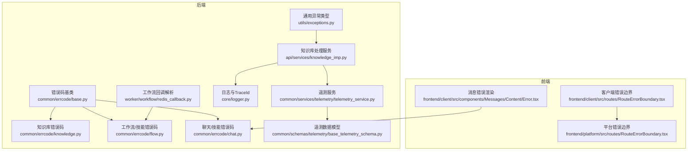
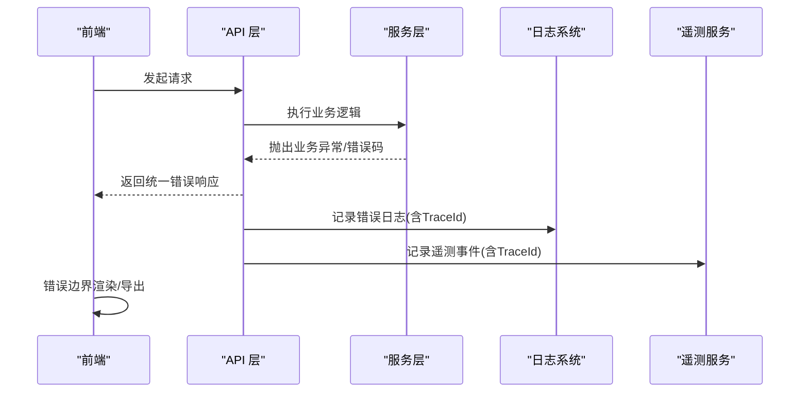
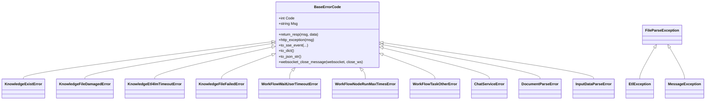
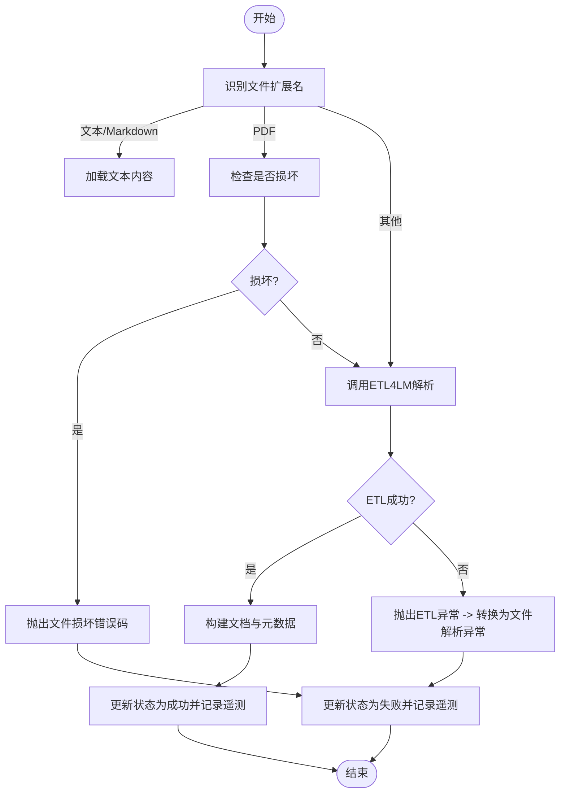
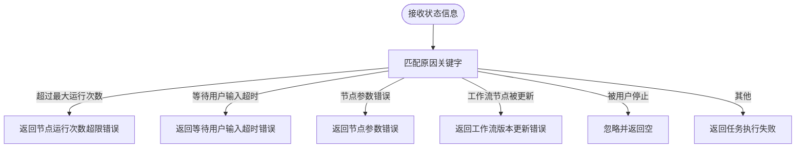
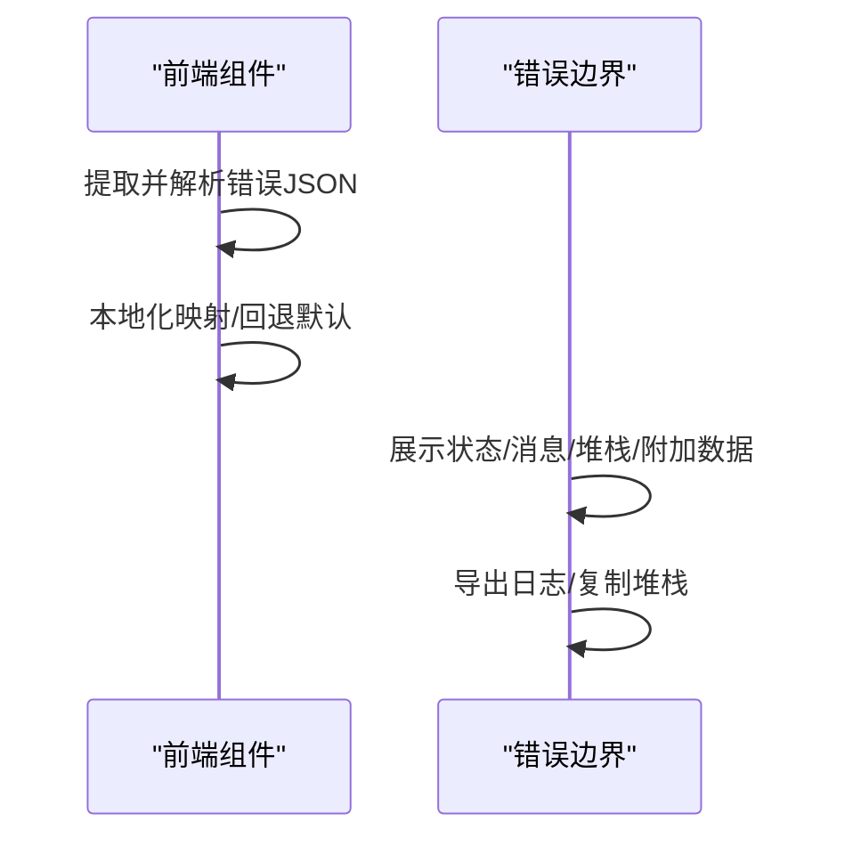
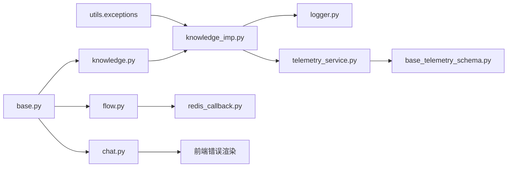

# 运行时错误

<cite>
**本文引用的文件**
- [src/backend/bisheng/common/errcode/base.py](file://src/backend/bisheng/common/errcode/base.py)
- [src/backend/bisheng/common/errcode/knowledge.py](file://src/backend/bisheng/common/errcode/knowledge.py)
- [src/backend/bisheng/common/errcode/flow.py](file://src/backend/bisheng/common/errcode/flow.py)
- [src/backend/bisheng/common/errcode/chat.py](file://src/backend/bisheng/common/errcode/chat.py)
- [src/backend/bisheng/utils/exceptions.py](file://src/backend/bisheng/utils/exceptions.py)
- [src/backend/bisheng/api/services/knowledge_imp.py](file://src/backend/bisheng/api/services/knowledge_imp.py)
- [src/backend/bisheng/worker/workflow/redis_callback.py](file://src/backend/bisheng/worker/workflow/redis_callback.py)
- [src/backend/bisheng/core/logger.py](file://src/backend/bisheng/core/logger.py)
- [src/backend/bisheng/common/services/telemetry/telemetry_service.py](file://src/backend/bisheng/common/services/telemetry/telemetry_service.py)
- [src/backend/bisheng/common/schemas/telemetry/base_telemetry_schema.py](file://src/backend/bisheng/common/schemas/telemetry/base_telemetry_schema.py)
- [src/frontend/client/src/components/Messages/Content/Error.tsx](file://src/frontend/client/src/components/Messages/Content/Error.tsx)
- [src/frontend/client/src/routes/RouteErrorBoundary.tsx](file://src/frontend/client/src/routes/RouteErrorBoundary.tsx)
- [src/frontend/platform/src/routes/RouteErrorBoundary.tsx](file://src/frontend/platform/src/routes/RouteErrorBoundary.tsx)
</cite>

## 目录
1. [简介](#简介)
2. [项目结构](#项目结构)
3. [核心组件](#核心组件)
4. [架构总览](#架构总览)
5. [详细组件分析](#详细组件分析)
6. [依赖关系分析](#依赖关系分析)
7. [性能与可维护性考量](#性能与可维护性考量)
8. [故障排除指南](#故障排除指南)
9. [结论](#结论)
10. [附录：错误码速查表](#附录错误码速查表)

## 简介
本文件面向 Bisheng 的运维与开发人员，系统化梳理运行时错误的类型、成因、诊断与修复路径，覆盖业务异常、文件解析异常、ETL 处理异常、API 调用失败、工作流执行中断、知识库处理错误等场景。文档同时提供异常堆栈分析技巧、日志定位方法、错误恢复策略以及预防措施与最佳实践。

## 项目结构
Bisheng 后端采用统一错误码体系与异常类型，前端提供错误边界与本地化展示；日志系统通过 TraceId 实现跨服务链路追踪，并结合遥测事件进行错误统计与回溯。

图表来源
- [src/backend/bisheng/common/errcode/base.py](file://src/backend/bisheng/common/errcode/base.py#L1-L97)
- [src/backend/bisheng/common/errcode/knowledge.py](file://src/backend/bisheng/common/errcode/knowledge.py#L1-L147)
- [src/backend/bisheng/common/errcode/flow.py](file://src/backend/bisheng/common/errcode/flow.py#L1-L89)
- [src/backend/bisheng/common/errcode/chat.py](file://src/backend/bisheng/common/errcode/chat.py#L1-L50)
- [src/backend/bisheng/utils/exceptions.py](file://src/backend/bisheng/utils/exceptions.py#L1-L36)
- [src/backend/bisheng/api/services/knowledge_imp.py](file://src/backend/bisheng/api/services/knowledge_imp.py#L513-L932)
- [src/backend/bisheng/worker/workflow/redis_callback.py](file://src/backend/bisheng/worker/workflow/redis_callback.py#L156-L176)
- [src/backend/bisheng/core/logger.py](file://src/backend/bisheng/core/logger.py#L1-L97)
- [src/backend/bisheng/common/services/telemetry/telemetry_service.py](file://src/backend/bisheng/common/services/telemetry/telemetry_service.py#L244-L283)
- [src/backend/bisheng/common/schemas/telemetry/base_telemetry_schema.py](file://src/backend/bisheng/common/schemas/telemetry/base_telemetry_schema.py#L35-L56)
- [src/frontend/client/src/components/Messages/Content/Error.tsx](file://src/frontend/client/src/components/Messages/Content/Error.tsx#L102-L127)
- [src/frontend/client/src/routes/RouteErrorBoundary.tsx](file://src/frontend/client/src/routes/RouteErrorBoundary.tsx#L104-L153)
- [src/frontend/platform/src/routes/RouteErrorBoundary.tsx](file://src/frontend/platform/src/routes/RouteErrorBoundary.tsx#L146-L200)

章节来源
- [src/backend/bisheng/common/errcode/base.py](file://src/backend/bisheng/common/errcode/base.py#L1-L97)
- [src/backend/bisheng/core/logger.py](file://src/backend/bisheng/core/logger.py#L1-L97)

## 核心组件
- 统一错误码基类：定义错误码、消息、HTTP/SSE/WebSocket 错误输出格式，支持返回统一响应模型。
- 业务错误码模块：按功能域划分（知识库、工作流/技能、聊天/技能），便于前端与接口层一致化处理。
- 通用异常类型：用于业务抛错、文件解析异常、ETL 异常等场景，便于捕获与转换。
- 知识库处理服务：封装文件解析、ETL 加载、异常转换与状态更新，集成遥测事件。
- 工作流回调解析：从 Redis 状态解析工作流失败原因，映射到具体错误码。
- 日志与追踪：TraceId 上下文注入，拦截标准库日志至 Loguru，便于链路关联。
- 遥测服务：异步写入 ES，记录事件与 trace_id，辅助错误复盘。

章节来源
- [src/backend/bisheng/common/errcode/base.py](file://src/backend/bisheng/common/errcode/base.py#L9-L97)
- [src/backend/bisheng/common/errcode/knowledge.py](file://src/backend/bisheng/common/errcode/knowledge.py#L1-L147)
- [src/backend/bisheng/common/errcode/flow.py](file://src/backend/bisheng/common/errcode/flow.py#L1-L89)
- [src/backend/bisheng/common/errcode/chat.py](file://src/backend/bisheng/common/errcode/chat.py#L1-L50)
- [src/backend/bisheng/utils/exceptions.py](file://src/backend/bisheng/utils/exceptions.py#L1-L36)
- [src/backend/bisheng/api/services/knowledge_imp.py](file://src/backend/bisheng/api/services/knowledge_imp.py#L513-L932)
- [src/backend/bisheng/worker/workflow/redis_callback.py](file://src/backend/bisheng/worker/workflow/redis_callback.py#L156-L176)
- [src/backend/bisheng/core/logger.py](file://src/backend/bisheng/core/logger.py#L1-L97)
- [src/backend/bisheng/common/services/telemetry/telemetry_service.py](file://src/backend/bisheng/common/services/telemetry/telemetry_service.py#L244-L283)

## 架构总览
运行时错误在后端以“异常类型/错误码”为核心，贯穿 API 层、服务层、工作流层与前端展示层。前端错误边界负责收集与导出错误信息，后端日志与遥测提供链路与事件证据。

图表来源
- [src/backend/bisheng/common/errcode/base.py](file://src/backend/bisheng/common/errcode/base.py#L24-L97)
- [src/backend/bisheng/api/services/knowledge_imp.py](file://src/backend/bisheng/api/services/knowledge_imp.py#L513-L932)
- [src/backend/bisheng/core/logger.py](file://src/backend/bisheng/core/logger.py#L1-L97)
- [src/backend/bisheng/common/services/telemetry/telemetry_service.py](file://src/backend/bisheng/common/services/telemetry/telemetry_service.py#L244-L283)
- [src/frontend/client/src/routes/RouteErrorBoundary.tsx](file://src/frontend/client/src/routes/RouteErrorBoundary.tsx#L104-L153)

## 详细组件分析

### 统一错误码与异常类型
- 基类能力：支持构造统一响应、HTTP 异常、SSE/WebSocket 错误事件、字典/JSON 序列化输出。
- 业务域错误码：知识库、工作流/技能、聊天/技能等模块化错误码，便于前端本地化与用户提示。
- 通用异常类型：业务消息异常、文件解析异常、ETL 异常，便于在服务层捕获并转换为错误码。

图表来源
- [src/backend/bisheng/common/errcode/base.py](file://src/backend/bisheng/common/errcode/base.py#L9-L97)
- [src/backend/bisheng/common/errcode/knowledge.py](file://src/backend/bisheng/common/errcode/knowledge.py#L1-L147)
- [src/backend/bisheng/common/errcode/flow.py](file://src/backend/bisheng/common/errcode/flow.py#L1-L89)
- [src/backend/bisheng/common/errcode/chat.py](file://src/backend/bisheng/common/errcode/chat.py#L1-L50)
- [src/backend/bisheng/utils/exceptions.py](file://src/backend/bisheng/utils/exceptions.py#L1-L36)

章节来源
- [src/backend/bisheng/common/errcode/base.py](file://src/backend/bisheng/common/errcode/base.py#L9-L97)
- [src/backend/bisheng/utils/exceptions.py](file://src/backend/bisheng/utils/exceptions.py#L1-L36)

### 知识库处理流程与异常转换
- 文件解析阶段：根据扩展名选择解析器；PDF 损坏检测；ETL4LM 解析；异常转换为文件解析异常或业务错误码。
- 状态更新与遥测：失败时更新文件状态、记录失败原因、上报解析事件。

图表来源
- [src/backend/bisheng/api/services/knowledge_imp.py](file://src/backend/bisheng/api/services/knowledge_imp.py#L513-L932)
- [src/backend/bisheng/common/errcode/knowledge.py](file://src/backend/bisheng/common/errcode/knowledge.py#L35-L94)
- [src/backend/bisheng/utils/exceptions.py](file://src/backend/bisheng/utils/exceptions.py#L20-L36)

章节来源
- [src/backend/bisheng/api/services/knowledge_imp.py](file://src/backend/bisheng/api/services/knowledge_imp.py#L513-L932)

### 工作流执行失败解析
- 回调解析根据状态原因字符串匹配，映射为具体错误码（如等待用户输入超时、节点运行次数超限、节点参数错误、版本升级等）。
- 其他未知原因归类为“任务执行失败”。

图表来源
- [src/backend/bisheng/worker/workflow/redis_callback.py](file://src/backend/bisheng/worker/workflow/redis_callback.py#L156-L176)
- [src/backend/bisheng/common/errcode/flow.py](file://src/backend/bisheng/common/errcode/flow.py#L45-L83)

章节来源
- [src/backend/bisheng/worker/workflow/redis_callback.py](file://src/backend/bisheng/worker/workflow/redis_callback.py#L156-L176)

### 前端错误展示与导出
- 消息错误渲染：从错误文本中提取 JSON，优先使用错误码/类型进行本地化映射，否则显示默认文本。
- 错误边界：展示状态、消息、堆栈、附加数据；支持下载错误日志与复制堆栈。

图表来源
- [src/frontend/client/src/components/Messages/Content/Error.tsx](file://src/frontend/client/src/components/Messages/Content/Error.tsx#L102-L127)
- [src/frontend/client/src/routes/RouteErrorBoundary.tsx](file://src/frontend/client/src/routes/RouteErrorBoundary.tsx#L104-L153)
- [src/frontend/platform/src/routes/RouteErrorBoundary.tsx](file://src/frontend/platform/src/routes/RouteErrorBoundary.tsx#L146-L200)

章节来源
- [src/frontend/client/src/components/Messages/Content/Error.tsx](file://src/frontend/client/src/components/Messages/Content/Error.tsx#L102-L127)
- [src/frontend/client/src/routes/RouteErrorBoundary.tsx](file://src/frontend/client/src/routes/RouteErrorBoundary.tsx#L104-L153)
- [src/frontend/platform/src/routes/RouteErrorBoundary.tsx](file://src/frontend/platform/src/routes/RouteErrorBoundary.tsx#L146-L200)

## 依赖关系分析
- 错误码模块依赖统一基类，实现一致的序列化与传输格式。
- 服务层依赖错误码与异常类型，完成异常到错误码的转换与状态更新。
- 日志系统与遥测服务为错误复盘提供关键线索（TraceId、事件体）。

图表来源
- [src/backend/bisheng/utils/exceptions.py](file://src/backend/bisheng/utils/exceptions.py#L1-L36)
- [src/backend/bisheng/api/services/knowledge_imp.py](file://src/backend/bisheng/api/services/knowledge_imp.py#L513-L932)
- [src/backend/bisheng/common/errcode/knowledge.py](file://src/backend/bisheng/common/errcode/knowledge.py#L1-L147)
- [src/backend/bisheng/common/errcode/flow.py](file://src/backend/bisheng/common/errcode/flow.py#L1-L89)
- [src/backend/bisheng/common/errcode/chat.py](file://src/backend/bisheng/common/errcode/chat.py#L1-L50)
- [src/backend/bisheng/worker/workflow/redis_callback.py](file://src/backend/bisheng/worker/workflow/redis_callback.py#L156-L176)
- [src/backend/bisheng/core/logger.py](file://src/backend/bisheng/core/logger.py#L1-L97)
- [src/backend/bisheng/common/services/telemetry/telemetry_service.py](file://src/backend/bisheng/common/services/telemetry/telemetry_service.py#L244-L283)
- [src/backend/bisheng/common/schemas/telemetry/base_telemetry_schema.py](file://src/backend/bisheng/common/schemas/telemetry/base_telemetry_schema.py#L35-L56)
- [src/frontend/client/src/components/Messages/Content/Error.tsx](file://src/frontend/client/src/components/Messages/Content/Error.tsx#L102-L127)

章节来源
- [src/backend/bisheng/common/errcode/base.py](file://src/backend/bisheng/common/errcode/base.py#L1-L97)
- [src/backend/bisheng/common/errcode/knowledge.py](file://src/backend/bisheng/common/errcode/knowledge.py#L1-L147)
- [src/backend/bisheng/common/errcode/flow.py](file://src/backend/bisheng/common/errcode/flow.py#L1-L89)
- [src/backend/bisheng/common/errcode/chat.py](file://src/backend/bisheng/common/errcode/chat.py#L1-L50)
- [src/backend/bisheng/utils/exceptions.py](file://src/backend/bisheng/utils/exceptions.py#L1-L36)
- [src/backend/bisheng/api/services/knowledge_imp.py](file://src/backend/bisheng/api/services/knowledge_imp.py#L513-L932)
- [src/backend/bisheng/worker/workflow/redis_callback.py](file://src/backend/bisheng/worker/workflow/redis_callback.py#L156-L176)
- [src/backend/bisheng/core/logger.py](file://src/backend/bisheng/core/logger.py#L1-L97)
- [src/backend/bisheng/common/services/telemetry/telemetry_service.py](file://src/backend/bisheng/common/services/telemetry/telemetry_service.py#L244-L283)
- [src/backend/bisheng/common/schemas/telemetry/base_telemetry_schema.py](file://src/backend/bisheng/common/schemas/telemetry/base_telemetry_schema.py#L35-L56)
- [src/frontend/client/src/components/Messages/Content/Error.tsx](file://src/frontend/client/src/components/Messages/Content/Error.tsx#L102-L127)

## 性能与可维护性考量
- 错误码与异常类型集中管理，避免重复定义与不一致的错误语义。
- 日志与遥测分离：日志用于快速定位，遥测用于趋势与复盘。
- TraceId 在日志与遥测中保持一致，降低跨组件排查成本。
- 建议：对高频错误增加告警阈值与自动降级策略，避免雪崩。

[本节为通用指导，无需列出章节来源]

## 故障排除指南

### 一、业务异常（知识库/工作流/聊天）
- 症状
  - 知识库名称重复、未选择嵌入模型、段落不可修改、文件为空、文件损坏、不支持的文件类型、ETL 超时、Excel 分段过长、相似度模型未配置、问答已存在、文件解析失败、不存在的知识库/文件、元数据字段冲突/不存在/不可变、值类型转换错误。
  - 工作流/技能：版本信息缺失、当前版本不可删除、版本名重复、技能/工作流名重复、技能不存在、在线编辑限制、初始化失败、等待用户输入超时、节点运行次数超限、节点参数错误、版本升级、服务器线程满、任务执行失败、无写权限。
  - 聊天：技能已删除、未上线、未编译、后端服务异常、LLM 执行错误、文档解析失败、输入数据解析失败、工作流未上线。
- 定位步骤
  - 查看后端返回的统一错误响应中的状态码与消息。
  - 使用 TraceId 在日志中检索完整堆栈与上下文。
  - 若涉及工作流，检查回调解析结果与节点状态。
- 处理建议
  - 对于“文件损坏/不支持类型”，引导用户更换文件或修复。
  - 对于“ETL 超时”，建议提升服务资源或调整分段策略。
  - 对于“版本升级/参数错误”，提示重新拖拽节点或联系创建者。
  - 对于“服务器线程满”，稍后再试或扩容。

章节来源
- [src/backend/bisheng/common/errcode/knowledge.py](file://src/backend/bisheng/common/errcode/knowledge.py#L1-L147)
- [src/backend/bisheng/common/errcode/flow.py](file://src/backend/bisheng/common/errcode/flow.py#L1-L89)
- [src/backend/bisheng/common/errcode/chat.py](file://src/backend/bisheng/common/errcode/chat.py#L1-L50)

### 二、文件解析异常
- 症状
  - 文档预览失败、文件解析失败、PDF 损坏、Excel 分段过长、段落超长。
- 定位步骤
  - 检查知识库处理服务的日志与状态更新，确认是否抛出文件解析异常或业务错误码。
  - 关注 ETL4LM 调用是否超时或返回异常。
- 处理建议
  - 修复/替换损坏文件；优化分段规则；减少表格行数或调整分隔符。
  - 若为 ETL 超时，提升服务资源或缩短单次解析时间。

章节来源
- [src/backend/bisheng/api/services/knowledge_imp.py](file://src/backend/bisheng/api/services/knowledge_imp.py#L513-L932)
- [src/backend/bisheng/utils/exceptions.py](file://src/backend/bisheng/utils/exceptions.py#L20-L36)
- [src/backend/bisheng/common/errcode/knowledge.py](file://src/backend/bisheng/common/errcode/knowledge.py#L35-L94)

### 三、ETL 处理异常
- 症状
  - ETL 服务繁忙/超时、解析过程抛出异常。
- 定位步骤
  - 捕获 ETL 异常并转换为文件解析异常，确保状态与遥测正确上报。
- 处理建议
  - 升级 ETL 计算资源；降低并发；优化文档结构。

章节来源
- [src/backend/bisheng/api/services/knowledge_imp.py](file://src/backend/bisheng/api/services/knowledge_imp.py#L914-L932)
- [src/backend/bisheng/utils/exceptions.py](file://src/backend/bisheng/utils/exceptions.py#L29-L36)
- [src/backend/bisheng/common/errcode/knowledge.py](file://src/backend/bisheng/common/errcode/knowledge.py#L45-L47)

### 四、API 调用失败
- 症状
  - HTTP 4xx/5xx；WebSocket 关闭；SSE 错误事件。
- 定位步骤
  - 使用错误边界导出日志，复制堆栈；核对状态码与附加数据。
  - 结合 TraceId 在日志与遥测中交叉验证。
- 处理建议
  - 重试/降级；检查上游依赖可用性；必要时限流。

章节来源
- [src/backend/bisheng/common/errcode/base.py](file://src/backend/bisheng/common/errcode/base.py#L36-L97)
- [src/frontend/client/src/routes/RouteErrorBoundary.tsx](file://src/frontend/client/src/routes/RouteErrorBoundary.tsx#L104-L153)
- [src/frontend/platform/src/routes/RouteErrorBoundary.tsx](file://src/frontend/platform/src/routes/RouteErrorBoundary.tsx#L146-L200)

### 五、工作流执行中断
- 症状
  - 等待用户输入超时、节点运行次数超限、节点参数错误、版本升级、被用户停止、其他任务执行失败。
- 定位步骤
  - 依据回调解析结果判断具体原因。
- 处理建议
  - 优化节点配置与参数；控制最大运行次数；在版本升级后重新调度。

章节来源
- [src/backend/bisheng/worker/workflow/redis_callback.py](file://src/backend/bisheng/worker/workflow/redis_callback.py#L156-L176)
- [src/backend/bisheng/common/errcode/flow.py](file://src/backend/bisheng/common/errcode/flow.py#L45-L83)

### 六、知识库处理错误
- 症状
  - 文件解析失败、复制/重建限制、问答/推荐问题错误、元数据字段冲突/不可变。
- 定位步骤
  - 查看文件状态与失败原因；确认元数据字段是否内置或重复。
- 处理建议
  - 新建知识库再修改分段；避免使用内置字段名；修正元数据类型。

章节来源
- [src/backend/bisheng/common/errcode/knowledge.py](file://src/backend/bisheng/common/errcode/knowledge.py#L65-L147)

### 七、异常堆栈分析技巧与日志定位
- 技巧
  - 优先关注 TraceId，确保日志与遥测一致。
  - 区分业务异常与系统异常：前者通常由错误码描述，后者需查看堆栈。
  - 前端错误边界支持导出日志与复制堆栈，便于快速回传。
- 方法
  - 后端：启用 TraceId 过滤，结合异常捕获与统一错误响应。
  - 前端：在错误边界中导出 JSON 日志，包含状态、消息、堆栈、附加数据。

章节来源
- [src/backend/bisheng/core/logger.py](file://src/backend/bisheng/core/logger.py#L1-L97)
- [src/backend/bisheng/common/services/telemetry/telemetry_service.py](file://src/backend/bisheng/common/services/telemetry/telemetry_service.py#L244-L283)
- [src/frontend/client/src/routes/RouteErrorBoundary.tsx](file://src/frontend/client/src/routes/RouteErrorBoundary.tsx#L104-L153)
- [src/frontend/platform/src/routes/RouteErrorBoundary.tsx](file://src/frontend/platform/src/routes/RouteErrorBoundary.tsx#L146-L200)

### 八、错误恢复策略
- 重试与退避：对临时性错误（如 ETL 超时、服务器繁忙）实施指数退避重试。
- 降级与熔断：上游依赖不可用时，返回明确的错误码并降级为最小可用功能。
- 版本回滚：工作流/技能版本升级失败时，回滚到稳定版本。
- 数据修复：对元数据字段冲突/不可变问题，提供迁移工具与校验规则。

[本节为通用指导，无需列出章节来源]

### 九、常见错误的预防措施与最佳实践
- 输入校验：在上传前进行格式与大小校验，减少后续解析失败。
- 配置治理：统一分段策略、元数据字段命名规范，避免冲突。
- 监控告警：对高频错误设置阈值告警，及时扩容或修复。
- 文档与培训：向用户说明支持的文件类型与格式要求，降低人为错误。

[本节为通用指导，无需列出章节来源]

## 结论
通过统一的错误码体系、完善的异常类型、链路追踪与遥测机制，Bisheng 能够高效定位与恢复运行时错误。建议在日常运维中坚持“可观测优先、预防为主”的原则，结合本文提供的诊断与恢复策略，持续提升系统的稳定性与用户体验。

[本节为总结性内容，无需列出章节来源]

## 附录：错误码速查表
- 知识库相关：名称重复、未选嵌入模型、段落不可修改、文件为空、文件损坏、不支持类型、ETL 超时、Excel 分段过长、相似度模型未配置、问答已存在、复制/重建限制、预览失败、文件解析失败、不存在、元数据冲突/不存在/不可变、值类型转换错误。
- 工作流/技能相关：版本信息缺失、当前版本不可删除、版本名重复、技能/工作流名重复、技能不存在、在线编辑限制、初始化失败、等待用户输入超时、节点运行次数超限、节点参数错误、版本升级、服务器线程满、任务执行失败、无写权限。
- 聊天/技能相关：技能已删除、未上线、未编译、后端服务异常、LLM 执行错误、文档解析失败、输入数据解析失败、工作流未上线。

章节来源
- [src/backend/bisheng/common/errcode/knowledge.py](file://src/backend/bisheng/common/errcode/knowledge.py#L1-L147)
- [src/backend/bisheng/common/errcode/flow.py](file://src/backend/bisheng/common/errcode/flow.py#L1-L89)
- [src/backend/bisheng/common/errcode/chat.py](file://src/backend/bisheng/common/errcode/chat.py#L1-L50)