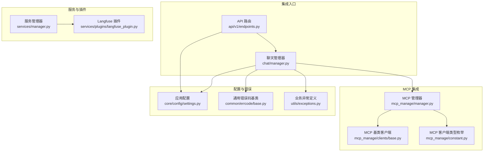
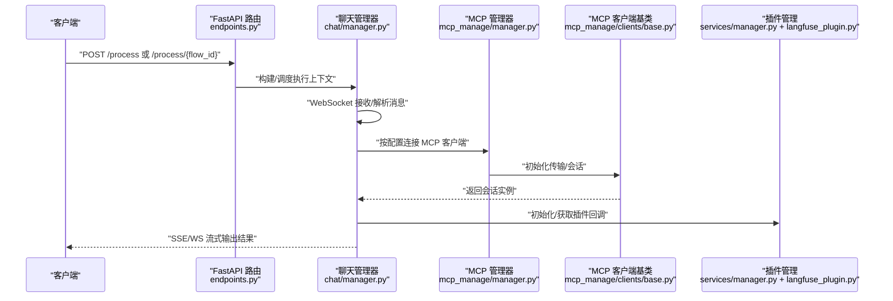
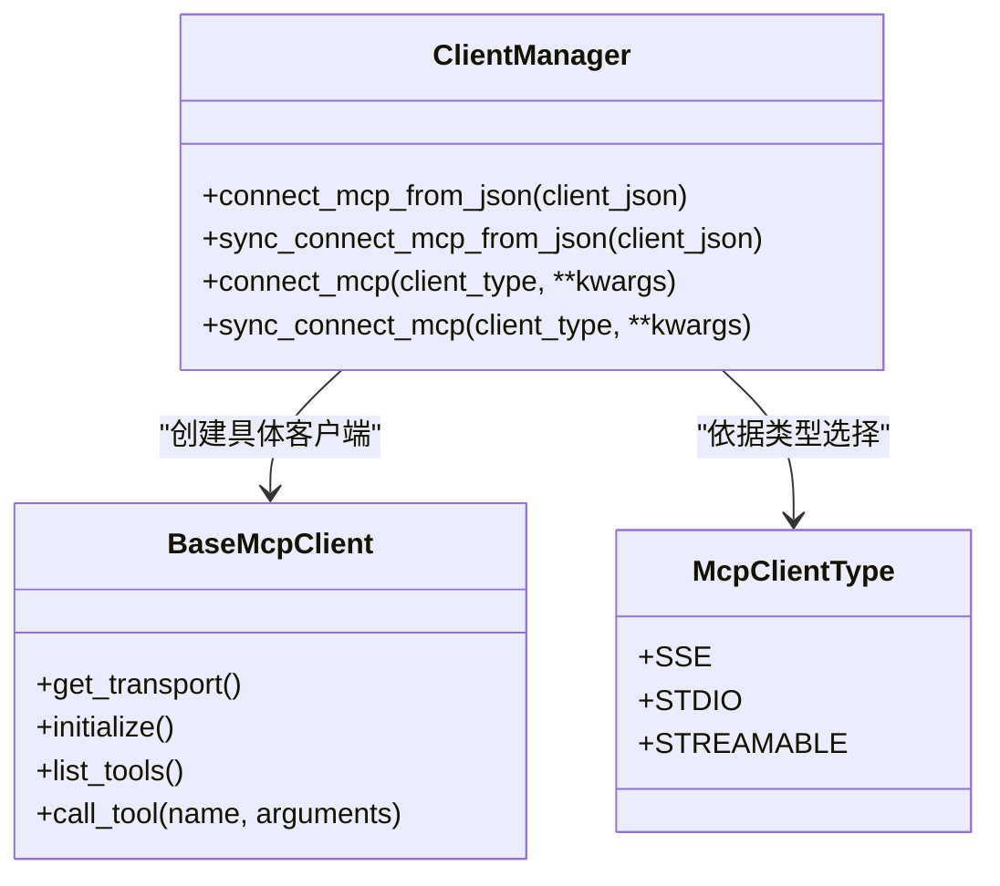
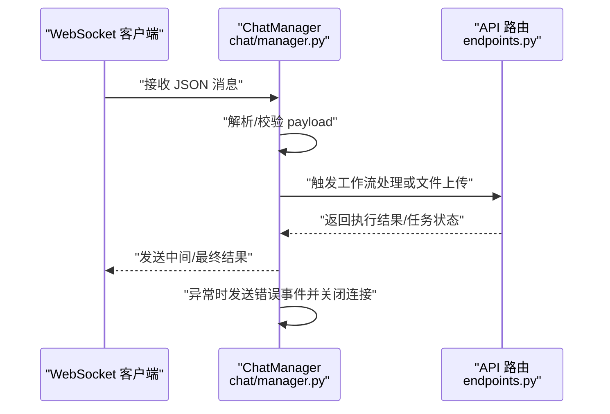
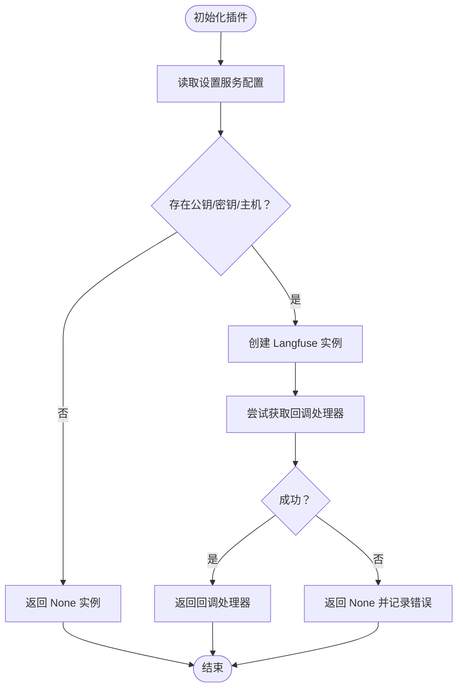
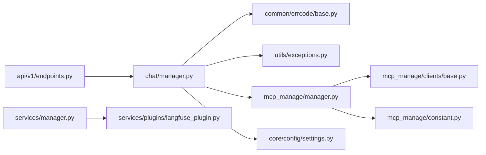

# 集成问题

<cite>
**本文引用的文件**
- [src/backend/bisheng/mcp_manage/manager.py](file://src/backend/bisheng/mcp_manage/manager.py)
- [src/backend/bisheng/mcp_manage/clients/base.py](file://src/backend/bisheng/mcp_manage/clients/base.py)
- [src/backend/bisheng/mcp_manage/constant.py](file://src/backend/bisheng/mcp_manage/constant.py)
- [src/backend/bisheng/chat/manager.py](file://src/backend/bisheng/chat/manager.py)
- [src/backend/bisheng/api/v1/endpoints.py](file://src/backend/bisheng/api/v1/endpoints.py)
- [src/backend/bisheng/services/manager.py](file://src/backend/bisheng/services/manager.py)
- [src/backend/bisheng/services/plugins/langfuse_plugin.py](file://src/backend/bisheng/services/plugins/langfuse_plugin.py)
- [src/backend/bisheng/core/config/settings.py](file://src/backend/bisheng/core/config/settings.py)
- [src/backend/bisheng/common/errcode/base.py](file://src/backend/bisheng/common/errcode/base.py)
- [src/backend/bisheng/utils/exceptions.py](file://src/backend/bisheng/utils/exceptions.py)
- [src/backend/bisheng/core/context/manager.py](file://src/backend/bisheng/core/context/manager.py)
</cite>

## 目录
1. [简介](#简介)
2. [项目结构](#项目结构)
3. [核心组件](#核心组件)
4. [架构总览](#架构总览)
5. [详细组件分析](#详细组件分析)
6. [依赖分析](#依赖分析)
7. [性能考虑](#性能考虑)
8. [故障排除指南](#故障排除指南)
9. [结论](#结论)

## 简介
本指南聚焦于 Bisheng 在集成第三方服务与插件过程中的常见问题与排障方法，覆盖以下主题：
- 第三方服务集成失败：认证、网络连通性、协议兼容性、数据格式转换
- API 调用超时与重试策略
- MCP 管理器连接问题与插件注册失败
- 插件加载异常（以 Langfuse 插件为例）
- 健康检查、重试与降级策略
- 服务发现、负载均衡与熔断器配置的排障思路

## 项目结构
围绕“集成”这一主线，后端关键目录与文件如下：
- MCP 管理与客户端：mcp_manage/manager.py、mcp_manage/clients/base.py、mcp_manage/constant.py
- 聊天与工作流集成：chat/manager.py、api/v1/endpoints.py
- 服务管理与插件：services/manager.py、services/plugins/langfuse_plugin.py
- 配置与超时/重试参数：core/config/settings.py
- 错误码与异常：common/errcode/base.py、utils/exceptions.py
- 上下文与健康检查：core/context/manager.py

图表来源
- [src/backend/bisheng/api/v1/endpoints.py](file://src/backend/bisheng/api/v1/endpoints.py#L157-L350)
- [src/backend/bisheng/chat/manager.py](file://src/backend/bisheng/chat/manager.py#L289-L446)
- [src/backend/bisheng/mcp_manage/manager.py](file://src/backend/bisheng/mcp_manage/manager.py#L10-L56)
- [src/backend/bisheng/mcp_manage/clients/base.py](file://src/backend/bisheng/mcp_manage/clients/base.py#L8-L42)
- [src/backend/bisheng/mcp_manage/constant.py](file://src/backend/bisheng/mcp_manage/constant.py#L4-L8)
- [src/backend/bisheng/services/manager.py](file://src/backend/bisheng/services/manager.py#L11-L96)
- [src/backend/bisheng/services/plugins/langfuse_plugin.py](file://src/backend/bisheng/services/plugins/langfuse_plugin.py#L1-L82)
- [src/backend/bisheng/core/config/settings.py](file://src/backend/bisheng/core/config/settings.py#L129-L166)
- [src/backend/bisheng/common/errcode/base.py](file://src/backend/bisheng/common/errcode/base.py#L9-L97)
- [src/backend/bisheng/utils/exceptions.py](file://src/backend/bisheng/utils/exceptions.py#L1-L36)

章节来源
- [src/backend/bisheng/api/v1/endpoints.py](file://src/backend/bisheng/api/v1/endpoints.py#L157-L350)
- [src/backend/bisheng/chat/manager.py](file://src/backend/bisheng/chat/manager.py#L289-L446)
- [src/backend/bisheng/mcp_manage/manager.py](file://src/backend/bisheng/mcp_manage/manager.py#L10-L56)
- [src/backend/bisheng/mcp_manage/clients/base.py](file://src/backend/bisheng/mcp_manage/clients/base.py#L8-L42)
- [src/backend/bisheng/mcp_manage/constant.py](file://src/backend/bisheng/mcp_manage/constant.py#L4-L8)
- [src/backend/bisheng/services/manager.py](file://src/backend/bisheng/services/manager.py#L11-L96)
- [src/backend/bisheng/services/plugins/langfuse_plugin.py](file://src/backend/bisheng/services/plugins/langfuse_plugin.py#L1-L82)
- [src/backend/bisheng/core/config/settings.py](file://src/backend/bisheng/core/config/settings.py#L129-L166)
- [src/backend/bisheng/common/errcode/base.py](file://src/backend/bisheng/common/errcode/base.py#L9-L97)
- [src/backend/bisheng/utils/exceptions.py](file://src/backend/bisheng/utils/exceptions.py#L1-L36)

## 核心组件
- MCP 管理器：根据 JSON 配置动态选择 SSE/STDIO/STREAMABLE 客户端，封装初始化与工具调用流程
- MCP 基类客户端：统一抽象传输初始化、会话建立、工具列表与调用
- 聊天管理器：WebSocket 接入、消息分发、任务执行、异常处理与关闭流程
- API 路由：同步/异步处理工作流、上传文件、环境与配置查询
- 服务管理器：按依赖顺序创建/更新服务实例，支持 teardown
- 插件（Langfuse）：基于设置服务动态创建回调实例，支持空实现与异常兜底
- 配置：包含 Celery 路由/定时任务、节点超时、重试次数/间隔等集成相关参数
- 错误码与异常：统一错误响应、SSE 事件、WebSocket 关闭消息；业务异常类型

章节来源
- [src/backend/bisheng/mcp_manage/manager.py](file://src/backend/bisheng/mcp_manage/manager.py#L10-L56)
- [src/backend/bisheng/mcp_manage/clients/base.py](file://src/backend/bisheng/mcp_manage/clients/base.py#L8-L42)
- [src/backend/bisheng/chat/manager.py](file://src/backend/bisheng/chat/manager.py#L86-L288)
- [src/backend/bisheng/api/v1/endpoints.py](file://src/backend/bisheng/api/v1/endpoints.py#L157-L350)
- [src/backend/bisheng/services/manager.py](file://src/backend/bisheng/services/manager.py#L11-L96)
- [src/backend/bisheng/services/plugins/langfuse_plugin.py](file://src/backend/bisheng/services/plugins/langfuse_plugin.py#L1-L82)
- [src/backend/bisheng/core/config/settings.py](file://src/backend/bisheng/core/config/settings.py#L129-L166)
- [src/backend/bisheng/common/errcode/base.py](file://src/backend/bisheng/common/errcode/base.py#L9-L97)
- [src/backend/bisheng/utils/exceptions.py](file://src/backend/bisheng/utils/exceptions.py#L1-L36)

## 架构总览
下图展示从 API 到聊天、MCP 与插件的关键交互路径。

图表来源
- [src/backend/bisheng/api/v1/endpoints.py](file://src/backend/bisheng/api/v1/endpoints.py#L157-L350)
- [src/backend/bisheng/chat/manager.py](file://src/backend/bisheng/chat/manager.py#L289-L446)
- [src/backend/bisheng/mcp_manage/manager.py](file://src/backend/bisheng/mcp_manage/manager.py#L10-L56)
- [src/backend/bisheng/mcp_manage/clients/base.py](file://src/backend/bisheng/mcp_manage/clients/base.py#L8-L42)
- [src/backend/bisheng/services/manager.py](file://src/backend/bisheng/services/manager.py#L11-L96)
- [src/backend/bisheng/services/plugins/langfuse_plugin.py](file://src/backend/bisheng/services/plugins/langfuse_plugin.py#L1-L82)

## 详细组件分析

### MCP 管理器与客户端
- 管理器职责：从 JSON 配置中解析 mcpServers，推导客户端类型（SSE/STDIO/STREAMABLE），构造对应客户端
- 客户端基类：统一 initialize 流程（建立传输、会话、initialize），提供 list_tools/call_tool 抽象
- 类型枚举：McpClientType 提供 SSE/STDIO/STREAMABLE 三种类型

图表来源
- [src/backend/bisheng/mcp_manage/manager.py](file://src/backend/bisheng/mcp_manage/manager.py#L10-L56)
- [src/backend/bisheng/mcp_manage/clients/base.py](file://src/backend/bisheng/mcp_manage/clients/base.py#L8-L42)
- [src/backend/bisheng/mcp_manage/constant.py](file://src/backend/bisheng/mcp_manage/constant.py#L4-L8)

章节来源
- [src/backend/bisheng/mcp_manage/manager.py](file://src/backend/bisheng/mcp_manage/manager.py#L10-L56)
- [src/backend/bisheng/mcp_manage/clients/base.py](file://src/backend/bisheng/mcp_manage/clients/base.py#L8-L42)
- [src/backend/bisheng/mcp_manage/constant.py](file://src/backend/bisheng/mcp_manage/constant.py#L4-L8)

### 聊天管理器与 API 集成
- WebSocket 处理：接收消息、超时控制、异常捕获、关闭清理
- 工作流执行：构建/缓存对象、准备输入、派发任务、回传结果
- 错误处理：区分业务异常与系统异常，向客户端发送错误事件并可关闭连接

图表来源
- [src/backend/bisheng/chat/manager.py](file://src/backend/bisheng/chat/manager.py#L289-L446)
- [src/backend/bisheng/api/v1/endpoints.py](file://src/backend/bisheng/api/v1/endpoints.py#L157-L350)

章节来源
- [src/backend/bisheng/chat/manager.py](file://src/backend/bisheng/chat/manager.py#L289-L446)
- [src/backend/bisheng/api/v1/endpoints.py](file://src/backend/bisheng/api/v1/endpoints.py#L157-L350)

### 插件管理与 Langfuse 插件
- 服务管理器：按依赖顺序创建服务，支持更新与 teardown
- Langfuse 插件：从设置服务读取密钥与主机，动态创建 Langfuse 实例；若未安装或缺少凭据则返回空实例；异常时记录日志并返回 None

图表来源
- [src/backend/bisheng/services/plugins/langfuse_plugin.py](file://src/backend/bisheng/services/plugins/langfuse_plugin.py#L1-L82)
- [src/backend/bisheng/services/manager.py](file://src/backend/bisheng/services/manager.py#L11-L96)

章节来源
- [src/backend/bisheng/services/plugins/langfuse_plugin.py](file://src/backend/bisheng/services/plugins/langfuse_plugin.py#L1-L82)
- [src/backend/bisheng/services/manager.py](file://src/backend/bisheng/services/manager.py#L11-L96)

## 依赖分析
- 组件耦合
  - ChatManager 依赖 API 路由与工作流执行逻辑，同时依赖错误码与异常类型进行统一处理
  - MCP 管理器依赖客户端基类与类型枚举，形成可扩展的客户端工厂
  - 服务管理器负责服务生命周期与依赖注入，Langfuse 插件通过其完成回调初始化
- 外部依赖
  - 配置模块提供超时、重试、队列路由等参数，影响集成稳定性
  - 日志与异常体系贯穿各层，便于定位集成问题

图表来源
- [src/backend/bisheng/api/v1/endpoints.py](file://src/backend/bisheng/api/v1/endpoints.py#L157-L350)
- [src/backend/bisheng/chat/manager.py](file://src/backend/bisheng/chat/manager.py#L289-L446)
- [src/backend/bisheng/common/errcode/base.py](file://src/backend/bisheng/common/errcode/base.py#L9-L97)
- [src/backend/bisheng/utils/exceptions.py](file://src/backend/bisheng/utils/exceptions.py#L1-L36)
- [src/backend/bisheng/mcp_manage/manager.py](file://src/backend/bisheng/mcp_manage/manager.py#L10-L56)
- [src/backend/bisheng/mcp_manage/clients/base.py](file://src/backend/bisheng/mcp_manage/clients/base.py#L8-L42)
- [src/backend/bisheng/mcp_manage/constant.py](file://src/backend/bisheng/mcp_manage/constant.py#L4-L8)
- [src/backend/bisheng/core/config/settings.py](file://src/backend/bisheng/core/config/settings.py#L129-L166)
- [src/backend/bisheng/services/manager.py](file://src/backend/bisheng/services/manager.py#L11-L96)
- [src/backend/bisheng/services/plugins/langfuse_plugin.py](file://src/backend/bisheng/services/plugins/langfuse_plugin.py#L1-L82)

章节来源
- [src/backend/bisheng/api/v1/endpoints.py](file://src/backend/bisheng/api/v1/endpoints.py#L157-L350)
- [src/backend/bisheng/chat/manager.py](file://src/backend/bisheng/chat/manager.py#L289-L446)
- [src/backend/bisheng/mcp_manage/manager.py](file://src/backend/bisheng/mcp_manage/manager.py#L10-L56)
- [src/backend/bisheng/mcp_manage/clients/base.py](file://src/backend/bisheng/mcp_manage/clients/base.py#L8-L42)
- [src/backend/bisheng/mcp_manage/constant.py](file://src/backend/bisheng/mcp_manage/constant.py#L4-L8)
- [src/backend/bisheng/services/manager.py](file://src/backend/bisheng/services/manager.py#L11-L96)
- [src/backend/bisheng/services/plugins/langfuse_plugin.py](file://src/backend/bisheng/services/plugins/langfuse_plugin.py#L1-L82)
- [src/backend/bisheng/core/config/settings.py](file://src/backend/bisheng/core/config/settings.py#L129-L166)
- [src/backend/bisheng/common/errcode/base.py](file://src/backend/bisheng/common/errcode/base.py#L9-L97)
- [src/backend/bisheng/utils/exceptions.py](file://src/backend/bisheng/utils/exceptions.py#L1-L36)

## 性能考虑
- 超时与重试
  - 节点最大运行步数与超时时间在配置中定义，避免单节点阻塞导致整体延迟
  - Linsight 配置提供模型调用重试次数与间隔，用于缓解第三方服务抖动
- 任务路由与队列
  - Celery 路由将知识库与工作流任务分流至不同队列，降低热点竞争
- 缓存与并发
  - 聊天管理器使用内存缓存与线程池，减少重复构建成本

章节来源
- [src/backend/bisheng/core/config/settings.py](file://src/backend/bisheng/core/config/settings.py#L129-L166)
- [src/backend/bisheng/chat/manager.py](file://src/backend/bisheng/chat/manager.py#L680-L718)

## 故障排除指南

### 一、第三方服务集成失败
- 认证失败
  - 检查设置服务中的凭据是否正确加载（如 Langfuse 的公钥/密钥/主机）
  - 若缺失凭据或导入失败，插件将返回空实例；确认依赖安装与环境变量
- 网络连通性
  - 使用健康检查接口验证下游服务可达性；结合前端健康检查策略定期刷新
  - 对于 MCP 客户端，确认传输参数（URL/命令）与类型匹配
- 协议兼容性
  - SSE/STDIO/STREAMABLE 三类客户端需与目标服务协议一致；若类型不匹配，初始化会抛出不支持的错误
- 数据格式转换
  - API 层对输入/输出进行序列化/反序列化；确保 JSON 结构与下游期望一致

章节来源
- [src/backend/bisheng/services/plugins/langfuse_plugin.py](file://src/backend/bisheng/services/plugins/langfuse_plugin.py#L1-L82)
- [src/backend/bisheng/mcp_manage/manager.py](file://src/backend/bisheng/mcp_manage/manager.py#L10-L56)
- [src/backend/bisheng/mcp_manage/constant.py](file://src/backend/bisheng/mcp_manage/constant.py#L4-L8)
- [src/backend/bisheng/api/v1/endpoints.py](file://src/backend/bisheng/api/v1/endpoints.py#L157-L350)

### 二、API 调用超时与重试
- 超时
  - 节点超时与最大步数限制在配置中设定，避免长时间阻塞
  - WebSocket 接收存在超时等待，防止阻塞循环
- 重试
  - Linsight 提供模型调用重试次数与间隔，建议在不稳定网络下适当提高重试次数
- 降级
  - 当下游不可用时，插件返回空实例并记录错误；上层应具备降级分支（如禁用追踪）

章节来源
- [src/backend/bisheng/core/config/settings.py](file://src/backend/bisheng/core/config/settings.py#L129-L166)
- [src/backend/bisheng/chat/manager.py](file://src/backend/bisheng/chat/manager.py#L289-L446)
- [src/backend/bisheng/services/plugins/langfuse_plugin.py](file://src/backend/bisheng/services/plugins/langfuse_plugin.py#L1-L82)

### 三、MCP 管理器连接问题
- 连接失败
  - 核对 mcpServers 中的 type/command 字段，确保与客户端类型匹配
  - 检查 transport 初始化是否成功，会话 initialize 是否抛错
- 工具调用失败
  - call_tool 返回失败信息字符串；上层应解析并上报给客户端
- 插件注册失败
  - 若客户端类型不受支持，管理器会抛出异常；请修正配置

章节来源
- [src/backend/bisheng/mcp_manage/manager.py](file://src/backend/bisheng/mcp_manage/manager.py#L10-L56)
- [src/backend/bisheng/mcp_manage/clients/base.py](file://src/backend/bisheng/mcp_manage/clients/base.py#L8-L42)

### 四、HTTP 客户端配置错误
- 典型问题
  - URL/证书校验/共享地址配置不一致导致连接失败
  - 文件上传/对象存储桶名与权限不匹配
- 排查步骤
  - 校验 MinIO 配置项（端点、证书校验、公有访问地址、桶名）
  - 确认上传接口对文件扩展名与大小的限制
  - 检查对象存储访问链接是否可达

章节来源
- [src/backend/bisheng/core/config/settings.py](file://src/backend/bisheng/core/config/settings.py#L102-L121)
- [src/backend/bisheng/api/v1/endpoints.py](file://src/backend/bisheng/api/v1/endpoints.py#L352-L421)

### 五、插件加载异常
- Langfuse 插件
  - 未安装或缺少凭据：返回空实例并记录日志
  - 获取回调异常：捕获异常并返回 None
- 通用插件
  - 通过服务管理器注册工厂与依赖，确保依赖服务已就绪后再创建插件实例

章节来源
- [src/backend/bisheng/services/plugins/langfuse_plugin.py](file://src/backend/bisheng/services/plugins/langfuse_plugin.py#L1-L82)
- [src/backend/bisheng/services/manager.py](file://src/backend/bisheng/services/manager.py#L11-L96)

### 六、健康检查、重试与降级策略
- 健康检查
  - 应用上下文提供健康检查接口，支持简要与详细结果
  - 前端可设置定时刷新与交互触发刷新，保证状态可见
- 重试与降级
  - 对不稳定下游采用指数退避或固定间隔重试
  - 降级：当插件不可用时，跳过追踪或使用本地回退方案

章节来源
- [src/backend/bisheng/core/context/manager.py](file://src/backend/bisheng/core/context/manager.py#L194-L224)

### 七、服务发现、负载均衡与熔断器
- 服务发现与负载均衡
  - 通过配置中心集中管理服务地址与端点；在多实例部署时结合反向代理实现均衡
- 熔断器
  - 建议在上游网关或 SDK 层引入熔断器，快速失败并隔离故障实例
  - 与健康检查联动，避免向故障实例转发请求

[本节为通用实践指导，无需特定文件引用]

## 结论
- 将“配置即契约”作为集成稳定性的基石：明确类型、URL、凭据与超时参数
- 以“可观测性”为核心：统一错误码、SSE 事件与 WebSocket 关闭消息
- 以“弹性设计”应对不确定性：重试、降级、健康检查与熔断器缺一不可
- 以“可扩展客户端”支撑多协议：MCP 客户端基类与类型枚举提供清晰扩展面