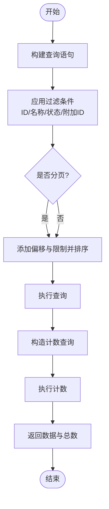

# ORM 映射与配置

<cite>
**本文引用的文件**   
- [src/backend/bisheng/common/models/base.py](file://src/backend/bisheng/common/models/base.py)
- [src/backend/bisheng/database/base.py](file://src/backend/bisheng/database/base.py)
- [src/backend/bisheng/core/database/connection.py](file://src/backend/bisheng/core/database/connection.py)
- [src/backend/bisheng/core/database/manager.py](file://src/backend/bisheng/core/database/manager.py)
- [src/backend/bisheng/database/models/assistant.py](file://src/backend/bisheng/database/models/assistant.py)
- [src/backend/bisheng/database/models/user_group.py](file://src/backend/bisheng/database/models/user_group.py)
- [src/backend/bisheng/database/models/session.py](file://src/backend/bisheng/database/models/session.py)
- [src/backend/bisheng/database/models/group.py](file://src/backend/bisheng/database/models/group.py)
- [src/backend/bisheng/database/models/flow.py](file://src/backend/bisheng/database/models/flow.py)
</cite>

## 目录
1. [简介](#简介)
2. [项目结构](#项目结构)
3. [核心组件](#核心组件)
4. [架构总览](#架构总览)
5. [详细组件分析](#详细组件分析)
6. [依赖关系分析](#依赖关系分析)
7. [性能考量](#性能考量)
8. [故障排查指南](#故障排查指南)
9. [结论](#结论)
10. [附录](#附录)

## 简介
本文件面向 Bisheng 的 ORM 映射与配置，围绕 SQLModel 基类设计、模型元数据与序列化、继承体系、数据库连接与会话管理、事务处理、模型校验与约束、以及最佳实践展开。目标是帮助开发者快速理解并正确使用 ORM 层，进行模型扩展与自定义。

## 项目结构
ORM 相关代码主要分布在以下模块：
- 模型基类与序列化：common/models/base.py
- 数据库工具与计数器：database/base.py
- 连接与会话管理：core/database/connection.py、core/database/manager.py
- 具体模型与 DAO：database/models 下的各领域模型文件

**图示来源**
- [src/backend/bisheng/common/models/base.py](file://src/backend/bisheng/common/models/base.py#L1-L20)
- [src/backend/bisheng/database/models/assistant.py](file://src/backend/bisheng/database/models/assistant.py#L1-L331)
- [src/backend/bisheng/database/models/user_group.py](file://src/backend/bisheng/database/models/user_group.py#L1-L256)
- [src/backend/bisheng/database/models/session.py](file://src/backend/bisheng/database/models/session.py#L1-L288)
- [src/backend/bisheng/database/models/group.py](file://src/backend/bisheng/database/models/group.py#L1-L105)
- [src/backend/bisheng/database/models/flow.py](file://src/backend/bisheng/database/models/flow.py#L1-L650)
- [src/backend/bisheng/core/database/connection.py](file://src/backend/bisheng/core/database/connection.py#L1-L175)
- [src/backend/bisheng/core/database/manager.py](file://src/backend/bisheng/core/database/manager.py#L1-L174)
- [src/backend/bisheng/database/base.py](file://src/backend/bisheng/database/base.py#L1-L40)

**章节来源**
- [src/backend/bisheng/common/models/base.py](file://src/backend/bisheng/common/models/base.py#L1-L20)
- [src/backend/bisheng/core/database/connection.py](file://src/backend/bisheng/core/database/connection.py#L1-L175)
- [src/backend/bisheng/core/database/manager.py](file://src/backend/bisheng/core/database/manager.py#L1-L174)
- [src/backend/bisheng/database/base.py](file://src/backend/bisheng/database/base.py#L1-L40)

## 核心组件
- SQLModel 可序列化基类：统一 from_attributes 行为与 model_dump 默认模式，简化 Pydantic 序列化。
- 数据库连接管理器：封装同步/异步引擎创建、连接池配置、会话上下文、建表与关闭资源。
- 全局数据库管理器：提供健康检查、建表、获取会话的便捷入口。
- 计数工具：提供同步与异步查询结果计数的辅助函数。
- 模型与 DAO：以 SQLModel 为基础，定义字段、索引、默认值、JSON/Text 列等，并通过 DAO 提供 CRUD 与复杂查询。

**章节来源**
- [src/backend/bisheng/common/models/base.py](file://src/backend/bisheng/common/models/base.py#L7-L20)
- [src/backend/bisheng/core/database/connection.py](file://src/backend/bisheng/core/database/connection.py#L17-L175)
- [src/backend/bisheng/core/database/manager.py](file://src/backend/bisheng/core/database/manager.py#L19-L174)
- [src/backend/bisheng/database/base.py](file://src/backend/bisheng/database/base.py#L7-L40)

## 架构总览
ORM 采用“基类 + 模型 + DAO + 会话管理”的分层设计。SQLModel 可序列化基类统一了模型行为；DAO 负责业务查询与写入；会话管理器负责连接、事务与资源回收。

**图示来源**
- [src/backend/bisheng/common/models/base.py](file://src/backend/bisheng/common/models/base.py#L7-L20)
- [src/backend/bisheng/core/database/connection.py](file://src/backend/bisheng/core/database/connection.py#L17-L175)
- [src/backend/bisheng/core/database/manager.py](file://src/backend/bisheng/core/database/manager.py#L19-L174)
- [src/backend/bisheng/database/models/assistant.py](file://src/backend/bisheng/database/models/assistant.py#L22-L331)
- [src/backend/bisheng/database/models/user_group.py](file://src/backend/bisheng/database/models/user_group.py#L12-L256)
- [src/backend/bisheng/database/models/session.py](file://src/backend/bisheng/database/models/session.py#L18-L288)
- [src/backend/bisheng/database/models/group.py](file://src/backend/bisheng/database/models/group.py#L14-L105)
- [src/backend/bisheng/database/models/flow.py](file://src/backend/bisheng/database/models/flow.py#L49-L650)

## 详细组件分析

### SQLModel 基类（SQLModelSerializable）
- 设计要点
  - 统一 model_config，开启 from_attributes，便于从数据库记录构造模型实例。
  - 提供 create_new 类方法用于便捷实例化。
  - model_dump 默认 mode='json'，确保序列化输出符合 API 规范。
- 元数据与序列化
  - 通过 ConfigDict 控制模型行为，避免在多处重复配置。
  - 与 SQLModel 的 select、Field、Column 等配合，实现字段级元数据控制（如索引、默认值、列类型）。
- 扩展建议
  - 新增模型可直接继承该基类，复用统一的序列化与构造能力。
  - 如需特殊序列化策略，可在子类中覆盖 model_dump 或新增专用方法。

**章节来源**
- [src/backend/bisheng/common/models/base.py](file://src/backend/bisheng/common/models/base.py#L7-L20)

### 数据库连接与会话管理
- 连接管理器（DatabaseConnectionManager）
  - 引擎与 URL：支持同步/异步 URL 自动转换，内置默认连接池参数（大小、超时、预 ping、回收时间），并针对 SQLite/MySQL 做特殊配置。
  - 会话：提供同步与异步上下文管理器，自动回滚与关闭，异常日志记录。
  - 建表：异步连接执行 metadata.create_all，捕获 OperationalError 并记录警告。
  - 资源：提供 close/close_sync，析构时安全释放。
- 全局管理器（DatabaseManager）
  - 提供 health_check、create_tables_if_not_exists、get_async_db_session、get_sync_db_session 等便捷接口。
  - 通过上下文管理器注册与获取实例，支持从配置服务读取数据库 URL。

**图示来源**
- [src/backend/bisheng/core/database/manager.py](file://src/backend/bisheng/core/database/manager.py#L98-L174)
- [src/backend/bisheng/core/database/connection.py](file://src/backend/bisheng/core/database/connection.py#L120-L141)

**章节来源**
- [src/backend/bisheng/core/database/connection.py](file://src/backend/bisheng/core/database/connection.py#L17-L175)
- [src/backend/bisheng/core/database/manager.py](file://src/backend/bisheng/core/database/manager.py#L19-L174)

### 计数与查询辅助
- 同步/异步计数：基于原生 select 构造 count 查询，移除 order_by 与排序后选择 from 子句首表，提升计数效率。
- UUID 工具：生成十六进制字符串作为主键备用方案。

**章节来源**
- [src/backend/bisheng/database/base.py](file://src/backend/bisheng/database/base.py#L7-L40)

### 模型与 DAO：助手（Assistant）
- 继承与表映射
  - AssistantBase 定义通用字段（名称、描述、系统提示、温度、最大 token、状态、时间戳等），部分字段使用 Text/JSON 列类型。
  - Assistant 通过 table=True 映射到表；DAO 提供创建、更新、删除、按 ID/名称/条件查询、分页与计数等方法。
- 查询与过滤
  - 支持多条件组合过滤、模糊匹配、分页与计数分离（先计总数再取数据）。
  - 提供同步与异步查询版本，异步使用 col(...) 替代属性表达式以适配异步环境。
- 事务与错误处理
  - DAO 内部使用 with/async with 管理会话生命周期，异常自动回滚并记录日志。

**图示来源**
- [src/backend/bisheng/database/models/assistant.py](file://src/backend/bisheng/database/models/assistant.py#L129-L170)

**章节来源**
- [src/backend/bisheng/database/models/assistant.py](file://src/backend/bisheng/database/models/assistant.py#L22-L331)

### 模型与 DAO：用户组（UserGroup）
- 复合主键与外键
  - 用户与分组的多对多关联，使用复合主键与外键约束，支持管理员标记与备注。
- DAO 能力
  - 获取用户所在分组/管理员身份、批量插入/删除、分页查询、批量更新等。
  - 提供异步与同步版本，保证一致性。

**章节来源**
- [src/backend/bisheng/database/models/user_group.py](file://src/backend/bisheng/database/models/user_group.py#L12-L256)

### 模型与 DAO：会话（MessageSession）
- 字段与枚举
  - 会话标识、应用类型与名称、用户与分组列表、敏感状态、反馈统计、时间戳等。
  - 敏感状态枚举用于内容审核状态。
- DAO 能力
  - 插入、删除（软删除）、单条查询、复杂过滤（时间范围、状态、反馈类型等）、分页与计数、批量更新统计字段等。
  - 自动生成分组列表（若未指定）。

**章节来源**
- [src/backend/bisheng/database/models/session.py](file://src/backend/bisheng/database/models/session.py#L18-L288)

### 模型与 DAO：分组（Group）
- 基础信息与默认分组常量
  - 分组名称唯一、带创建/更新用户字段，包含默认用户分组 ID 常量。
- DAO 能力
  - 单个/批量查询、创建/更新/删除、更新最后更新人与时间等。

**章节来源**
- [src/backend/bisheng/database/models/group.py](file://src/backend/bisheng/database/models/group.py#L14-L105)

### 模型与 DAO：流程/应用（Flow）
- 字段与校验
  - JSON 字段 data 必须包含 nodes 与 edges，否则抛出校验错误。
  - 流程类型、状态、Logo、描述、引导词等。
- DAO 能力
  - 创建/删除/更新、按 ID/名称/用户/类型/状态/关键词过滤、分页与计数、联合查询技能/助手/工作流等。
  - 提供异步与同步版本，复杂查询使用 mappings() 降低数据载荷。

**章节来源**
- [src/backend/bisheng/database/models/flow.py](file://src/backend/bisheng/database/models/flow.py#L49-L650)

## 依赖关系分析
- 组件耦合
  - DAO 依赖 SQLModel 可序列化基类与会话管理器；会话管理器依赖连接管理器；连接管理器依赖 SQLAlchemy/SQLModel。
  - 模型间通过外键与枚举建立弱耦合关系，DAO 负责跨模型的组合查询。
- 外部依赖
  - SQLAlchemy/SQLModel 提供 ORM 能力；异步引擎依赖 aiomysql/asyncpg 等驱动。
- 循环依赖
  - 通过延迟导入与模块边界控制，避免循环导入问题（例如 FlowDao 在创建时导入版本模型）。

**图示来源**
- [src/backend/bisheng/core/database/manager.py](file://src/backend/bisheng/core/database/manager.py#L98-L174)
- [src/backend/bisheng/core/database/connection.py](file://src/backend/bisheng/core/database/connection.py#L17-L175)
- [src/backend/bisheng/database/models/assistant.py](file://src/backend/bisheng/database/models/assistant.py#L65-L331)
- [src/backend/bisheng/database/models/flow.py](file://src/backend/bisheng/database/models/flow.py#L109-L650)

**章节来源**
- [src/backend/bisheng/core/database/manager.py](file://src/backend/bisheng/core/database/manager.py#L19-L174)
- [src/backend/bisheng/core/database/connection.py](file://src/backend/bisheng/core/database/connection.py#L17-L175)
- [src/backend/bisheng/database/models/assistant.py](file://src/backend/bisheng/database/models/assistant.py#L65-L331)
- [src/backend/bisheng/database/models/flow.py](file://src/backend/bisheng/database/models/flow.py#L109-L650)

## 性能考量
- 连接池与引擎参数
  - 默认池大小、超时与 pre_ping 有助于稳定高并发场景；SQLite 使用 StaticPool 限制线程与连接数。
  - MySQL 默认设置 utf8mb4，减少字符集相关问题。
- 查询优化
  - 分页与计数分离，避免一次性加载大结果集。
  - 使用 select(字段列表) 减少 data 字段传输（如 Flow 简化查询）。
  - 异步查询中使用 col(...) 替代属性表达式，提高兼容性与性能。
- 序列化
  - 统一 model_dump(mode='json')，减少序列化开销与格式不一致问题。

[本节为通用建议，无需特定文件来源]

## 故障排查指南
- 健康检查
  - 通过 DatabaseManager.health_check 执行简单查询验证连接可用性。
- 建表失败
  - create_tables_if_not_exists 捕获 OperationalError 并记录警告；确认权限与数据库可达。
- 会话异常
  - 连接管理器在异常时自动回滚并记录错误，检查日志定位问题。
- 计数异常
  - 确保 count 查询移除了排序与 order_by，避免计数结果不准确。

**章节来源**
- [src/backend/bisheng/core/database/manager.py](file://src/backend/bisheng/core/database/manager.py#L64-L96)
- [src/backend/bisheng/core/database/connection.py](file://src/backend/bisheng/core/database/connection.py#L100-L141)
- [src/backend/bisheng/database/base.py](file://src/backend/bisheng/database/base.py#L7-L40)

## 结论
Bisheng 的 ORM 层以 SQLModel 为核心，结合统一的基类、完善的会话管理与 DAO 查询能力，提供了清晰、可扩展且高性能的数据访问方案。遵循本文档的配置与最佳实践，可有效提升开发效率与系统稳定性。

[本节为总结，无需特定文件来源]

## 附录
- 最佳实践清单
  - 统一继承 SQLModel 可序列化基类，避免重复配置。
  - 使用 DAO 封装复杂查询，保持业务逻辑与数据访问分离。
  - 分页与计数分离，优先选择必要字段，避免传输大字段。
  - 异步场景使用 get_async_db_session，同步场景使用 get_sync_db_session。
  - 通过 DatabaseManager.health_check 与 create_tables_if_not_exists 管理数据库生命周期。
  - 对于 JSON/Text 字段，严格校验输入并在模型层增加字段校验器。

[本节为通用建议，无需特定文件来源]