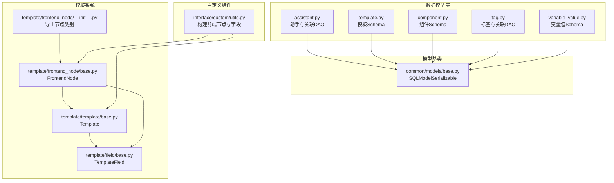
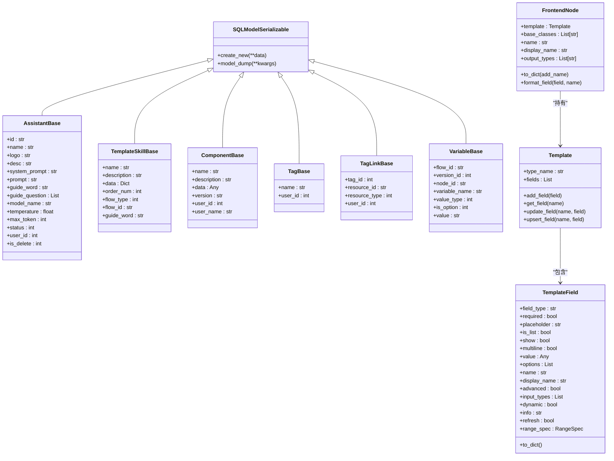
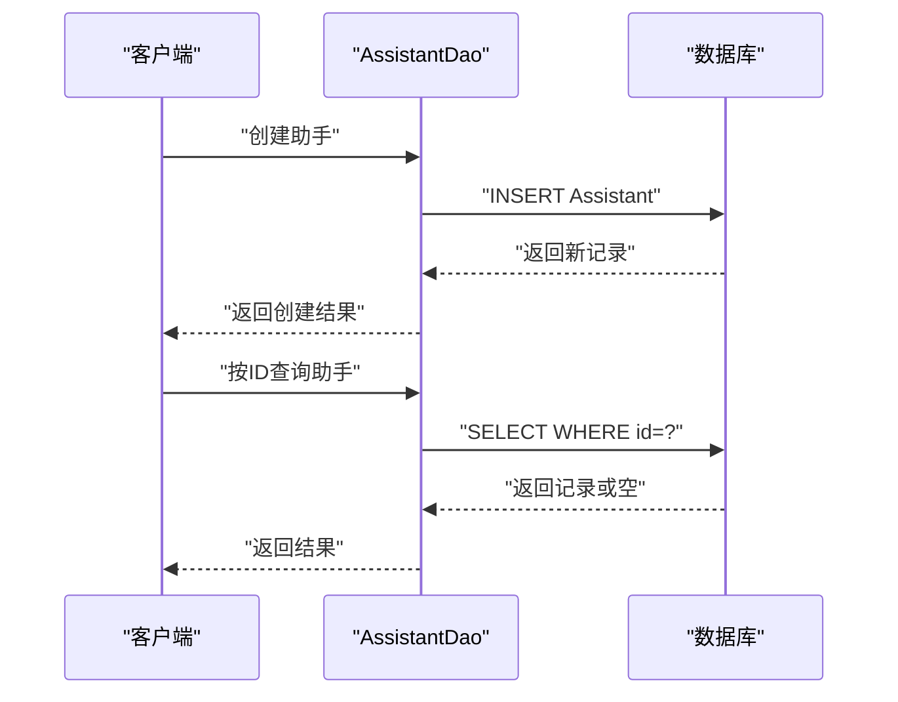
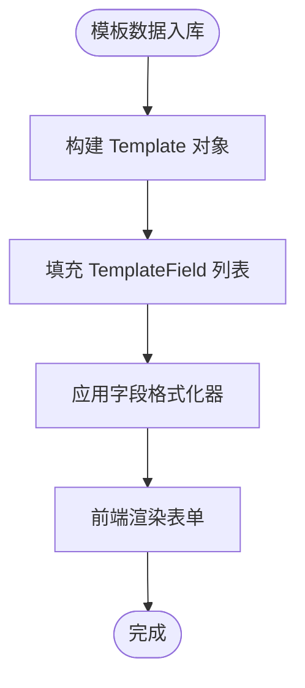
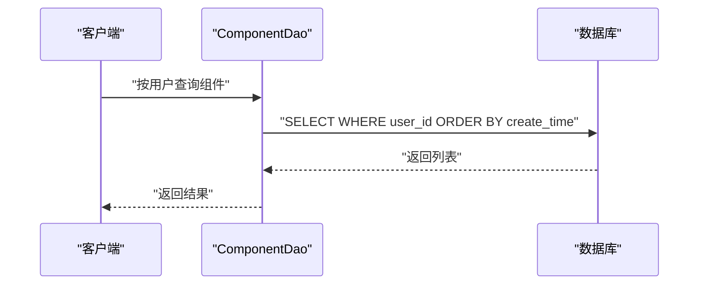
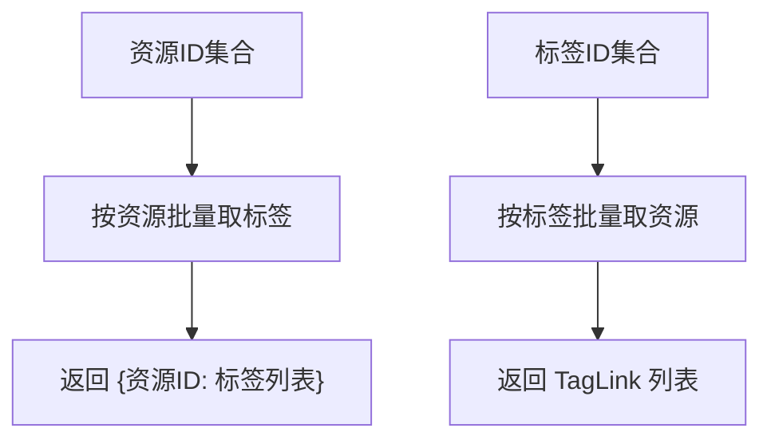
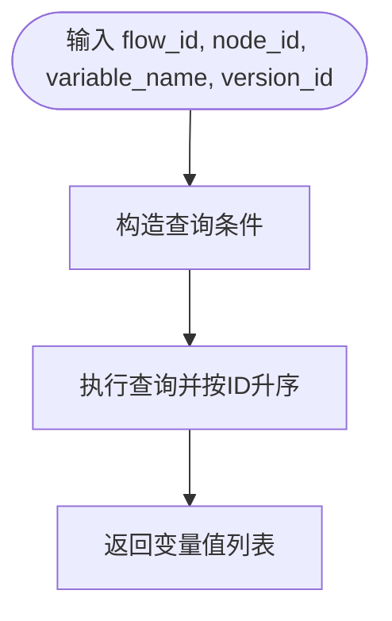
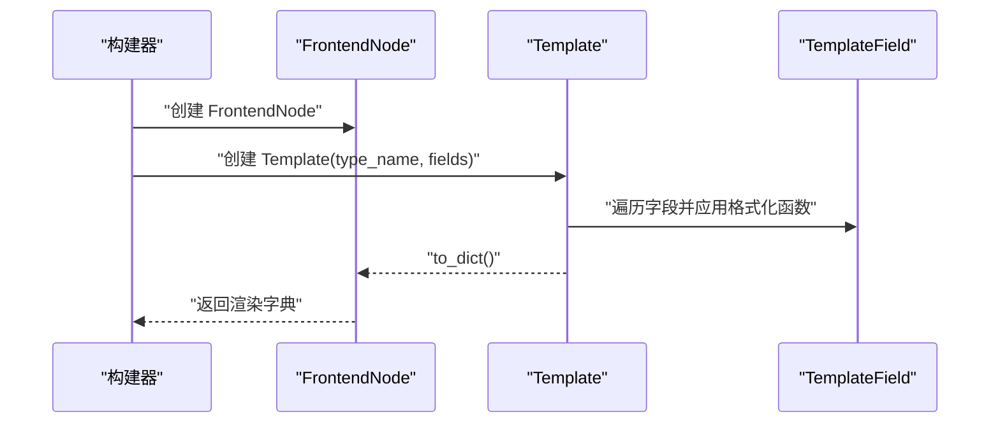
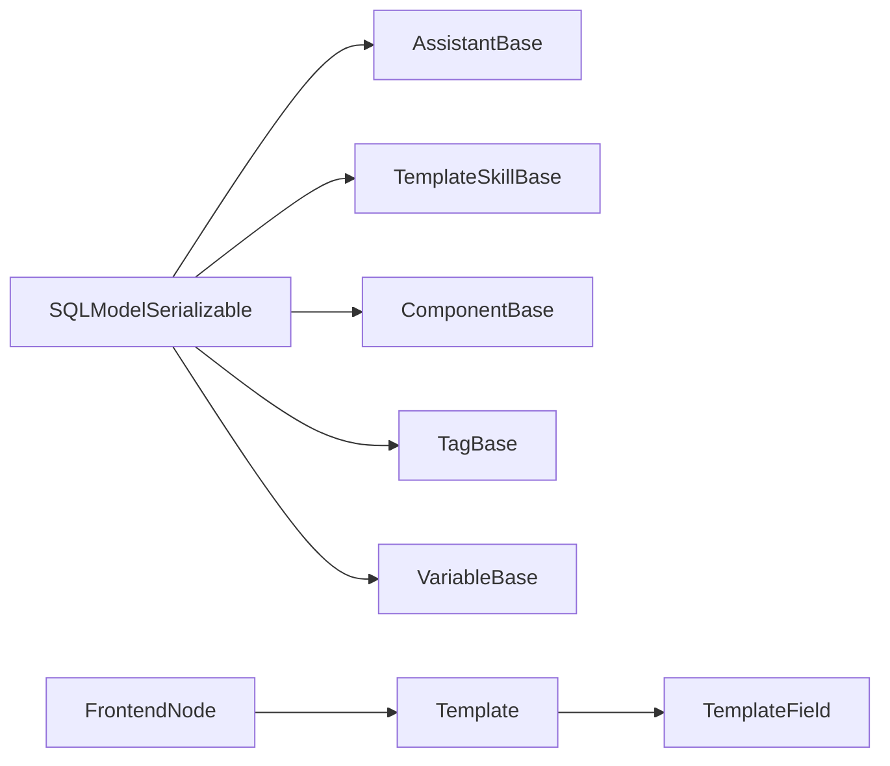

# 助手模板数据模型

<cite>
**本文引用的文件**
- [src/backend/bisheng/database/models/assistant.py](file://src/backend/bisheng/database/models/assistant.py)
- [src/backend/bisheng/database/models/template.py](file://src/backend/bisheng/database/models/template.py)
- [src/backend/bisheng/database/models/component.py](file://src/backend/bisheng/database/models/component.py)
- [src/backend/bisheng/database/models/tag.py](file://src/backend/bisheng/database/models/tag.py)
- [src/backend/bisheng/database/models/variable_value.py](file://src/backend/bisheng/database/models/variable_value.py)
- [src/backend/bisheng/common/models/base.py](file://src/backend/bisheng/common/models/base.py)
- [src/backend/bisheng/template/template/base.py](file://src/backend/bisheng/template/template/base.py)
- [src/backend/bisheng/template/field/base.py](file://src/backend/bisheng/template/field/base.py)
- [src/backend/bisheng/template/frontend_node/base.py](file://src/backend/bisheng/template/frontend_node/base.py)
- [src/backend/bisheng/template/frontend_node/__init__.py](file://src/backend/bisheng/template/frontend_node/__init__.py)
- [src/backend/bisheng/interface/custom/utils.py](file://src/backend/bisheng/interface/custom/utils.py)
</cite>

## 目录
1. [引言](#引言)
2. [项目结构](#项目结构)
3. [核心组件](#核心组件)
4. [架构总览](#架构总览)
5. [详细组件分析](#详细组件分析)
6. [依赖分析](#依赖分析)
7. [性能考虑](#性能考虑)
8. [故障排查指南](#故障排查指南)
9. [结论](#结论)
10. [附录](#附录)

## 引言
本文件面向 Bisheng 助手模板数据模型，系统性地阐述以下内容：
- 助手模型（assistant）：设计目标、配置项与行为定义
- 模板模型（template）：模板类型、字段定义与渲染机制
- 组件模型（component）：组件类型、参数规格与依赖关系
- 标签模型（tag）与变量值模型（variable_value）：元数据管理与动态配置支持
- 助手模板模型之间的组合关系与复用机制
- 助手开发与模板定制的最佳实践（性能优化与版本管理）

## 项目结构
围绕“助手模板数据模型”，后端采用 SQLModel 定义实体与 DAO 方法，前端通过模板系统（Template + TemplateField + FrontendNode）驱动可视化表单与渲染逻辑。核心模块分布如下：
- 数据模型层：assistant、template、component、tag、variable_value
- 模型基类：SQLModelSerializable 提供统一序列化与 ORM 行为
- 模板系统：Template、TemplateField、FrontendNode 及其格式化器
- 自定义组件工具：构建前端节点与模板字段的辅助方法

图表来源
- [src/backend/bisheng/database/models/assistant.py](file://src/backend/bisheng/database/models/assistant.py#L1-L331)
- [src/backend/bisheng/database/models/template.py](file://src/backend/bisheng/database/models/template.py#L1-L54)
- [src/backend/bisheng/database/models/component.py](file://src/backend/bisheng/database/models/component.py#L1-L67)
- [src/backend/bisheng/database/models/tag.py](file://src/backend/bisheng/database/models/tag.py#L1-L209)
- [src/backend/bisheng/database/models/variable_value.py](file://src/backend/bisheng/database/models/variable_value.py#L1-L106)
- [src/backend/bisheng/common/models/base.py](file://src/backend/bisheng/common/models/base.py#L1-L20)
- [src/backend/bisheng/template/template/base.py](file://src/backend/bisheng/template/template/base.py#L1-L58)
- [src/backend/bisheng/template/field/base.py](file://src/backend/bisheng/template/field/base.py#L1-L97)
- [src/backend/bisheng/template/frontend_node/base.py](file://src/backend/bisheng/template/frontend_node/base.py#L1-L261)
- [src/backend/bisheng/template/frontend_node/__init__.py](file://src/backend/bisheng/template/frontend_node/__init__.py#L1-L19)
- [src/backend/bisheng/interface/custom/utils.py](file://src/backend/bisheng/interface/custom/utils.py#L137-L296)

章节来源
- [src/backend/bisheng/database/models/assistant.py](file://src/backend/bisheng/database/models/assistant.py#L1-L331)
- [src/backend/bisheng/database/models/template.py](file://src/backend/bisheng/database/models/template.py#L1-L54)
- [src/backend/bisheng/database/models/component.py](file://src/backend/bisheng/database/models/component.py#L1-L67)
- [src/backend/bisheng/database/models/tag.py](file://src/backend/bisheng/database/models/tag.py#L1-L209)
- [src/backend/bisheng/database/models/variable_value.py](file://src/backend/bisheng/database/models/variable_value.py#L1-L106)
- [src/backend/bisheng/common/models/base.py](file://src/backend/bisheng/common/models/base.py#L1-L20)
- [src/backend/bisheng/template/template/base.py](file://src/backend/bisheng/template/template/base.py#L1-L58)
- [src/backend/bisheng/template/field/base.py](file://src/backend/bisheng/template/field/base.py#L1-L97)
- [src/backend/bisheng/template/frontend_node/base.py](file://src/backend/bisheng/template/frontend_node/base.py#L1-L261)
- [src/backend/bisheng/template/frontend_node/__init__.py](file://src/backend/bisheng/template/frontend_node/__init__.py#L1-L19)
- [src/backend/bisheng/interface/custom/utils.py](file://src/backend/bisheng/interface/custom/utils.py#L137-L296)

## 核心组件
- 助手模型（assistant）
  - 关键字段：名称、Logo、描述、系统提示词、用户可见描述、引导语、引导问题、模型名、温度、最大 Token、状态、创建者等
  - 关联实体：助手与工具/技能/知识库的多对多链接表，支持批量更新与查询
  - DAO 能力：创建、更新、软删除、按 ID/名称/权限过滤查询、分页统计、在线助手筛选等
- 模板模型（template）
  - 结构：名称、描述、数据体、排序号、模板类型（流程/助手/工作流）、所属资源 ID、引导语
  - Schema：读写/更新对象，含字段校验与类型转换
- 组件模型（component）
  - 结构：名称、描述、数据体、版本、创建者信息
  - DAO 能力：按用户检索、按名称去重查找、插入/更新/删除
- 标签模型（tag）
  - 标签与标签关联表：唯一约束保证资源-标签组合唯一
  - DAO 能力：搜索/计数、增删、按资源批量取标签、按标签批量取资源、资源-标签解绑
- 变量值模型（variable_value）
  - 结构：所属技能/工作流、版本、节点、变量名、类型（文本/列表/文件）、是否必填、值（去重逗号分隔）
  - DAO 能力：按条件查询、版本复制

章节来源
- [src/backend/bisheng/database/models/assistant.py](file://src/backend/bisheng/database/models/assistant.py#L17-L62)
- [src/backend/bisheng/database/models/template.py](file://src/backend/bisheng/database/models/template.py#L11-L53)
- [src/backend/bisheng/database/models/component.py](file://src/backend/bisheng/database/models/component.py#L11-L66)
- [src/backend/bisheng/database/models/tag.py](file://src/backend/bisheng/database/models/tag.py#L12-L44)
- [src/backend/bisheng/database/models/variable_value.py](file://src/backend/bisheng/database/models/variable_value.py#L13-L55)

## 架构总览
模板系统以“模板 + 字段 + 前端节点”为核心，驱动可视化表单生成与渲染；数据模型层负责持久化与业务查询。

图表来源
- [src/backend/bisheng/common/models/base.py](file://src/backend/bisheng/common/models/base.py#L7-L20)
- [src/backend/bisheng/database/models/assistant.py](file://src/backend/bisheng/database/models/assistant.py#L22-L42)
- [src/backend/bisheng/database/models/template.py](file://src/backend/bisheng/database/models/template.py#L11-L27)
- [src/backend/bisheng/database/models/component.py](file://src/backend/bisheng/database/models/component.py#L11-L26)
- [src/backend/bisheng/database/models/tag.py](file://src/backend/bisheng/database/models/tag.py#L12-L43)
- [src/backend/bisheng/database/models/variable_value.py](file://src/backend/bisheng/database/models/variable_value.py#L13-L25)
- [src/backend/bisheng/template/template/base.py](file://src/backend/bisheng/template/template/base.py#L8-L58)
- [src/backend/bisheng/template/field/base.py](file://src/backend/bisheng/template/field/base.py#L7-L97)
- [src/backend/bisheng/template/frontend_node/base.py](file://src/backend/bisheng/template/frontend_node/base.py#L41-L125)

## 详细组件分析

### 助手模型（assistant）
- 设计要点
  - 使用枚举控制上线/下线状态
  - 支持引导语与引导问题，便于聊天入口体验
  - 通过链接表与工具/技能/知识库建立多对多关系
- 关键 DAO 行为
  - 创建/更新/软删除
  - 按 ID/名称/权限过滤查询，支持分页与统计
  - 批量查询与在线助手筛选
- 复杂度与性能
  - 查询路径包含多条件与排序，注意索引覆盖（如 user_id、assistant_id、flow_id 等）
  - 批量操作使用一次性提交，减少往返开销

图表来源
- [src/backend/bisheng/database/models/assistant.py](file://src/backend/bisheng/database/models/assistant.py#L65-L120)

章节来源
- [src/backend/bisheng/database/models/assistant.py](file://src/backend/bisheng/database/models/assistant.py#L17-L62)
- [src/backend/bisheng/database/models/assistant.py](file://src/backend/bisheng/database/models/assistant.py#L65-L331)

### 模板模型（template）
- 结构与用途
  - TemplateSkillBase 定义模板通用字段，Template 为持久化实体
  - TemplateRead/TemplateCreate/TemplateUpdate 提供读写/更新对象
  - flow_type 标识模板类型（流程/助手/工作流），flow_id 指向具体资源
- 渲染机制
  - 与模板系统协同：Template 持有 TemplateField 列表，FrontendNode 将其转为前端可渲染字典
  - 字段格式化器（FieldFormatters）根据字段属性决定展示形态（密码、多行、文件、选项等）

图表来源
- [src/backend/bisheng/database/models/template.py](file://src/backend/bisheng/database/models/template.py#L11-L53)
- [src/backend/bisheng/template/template/base.py](file://src/backend/bisheng/template/template/base.py#L8-L58)
- [src/backend/bisheng/template/field/base.py](file://src/backend/bisheng/template/field/base.py#L7-L97)
- [src/backend/bisheng/template/frontend_node/base.py](file://src/backend/bisheng/template/frontend_node/base.py#L13-L62)

章节来源
- [src/backend/bisheng/database/models/template.py](file://src/backend/bisheng/database/models/template.py#L11-L53)
- [src/backend/bisheng/template/template/base.py](file://src/backend/bisheng/template/template/base.py#L1-L58)
- [src/backend/bisheng/template/field/base.py](file://src/backend/bisheng/template/field/base.py#L1-L97)
- [src/backend/bisheng/template/frontend_node/base.py](file://src/backend/bisheng/template/frontend_node/base.py#L1-L261)

### 组件模型（component）
- 设计要点
  - 组件数据体为 JSON/Any，支持复杂结构存储
  - 版本字段用于区分不同迭代
  - 通过 user_id 与 user_name 记录创建者信息
- DAO 能力
  - 按用户检索、按名称去重查找、插入/更新/删除

图表来源
- [src/backend/bisheng/database/models/component.py](file://src/backend/bisheng/database/models/component.py#L29-L66)

章节来源
- [src/backend/bisheng/database/models/component.py](file://src/backend/bisheng/database/models/component.py#L11-L66)

### 标签模型（tag）与标签关联（tag_link）
- 设计要点
  - 标签唯一性由 name 唯一索引保障
  - 标签与资源的多对多通过 TagLink 维护，唯一约束确保资源-标签组合唯一
- DAO 能力
  - 标签搜索/计数、增删、按资源批量取标签、按标签批量取资源、资源-标签解绑

图表来源
- [src/backend/bisheng/database/models/tag.py](file://src/backend/bisheng/database/models/tag.py#L112-L170)

章节来源
- [src/backend/bisheng/database/models/tag.py](file://src/backend/bisheng/database/models/tag.py#L12-L44)
- [src/backend/bisheng/database/models/tag.py](file://src/backend/bisheng/database/models/tag.py#L47-L209)

### 变量值模型（variable_value）
- 设计要点
  - 支持文本、列表、文件三类值，列表值自动去重并保持顺序
  - 通过 flow_id + version_id + node_id + variable_name 精确定位变量
- DAO 能力
  - 条件查询、版本复制（用于技能/工作流版本演进）

图表来源
- [src/backend/bisheng/database/models/variable_value.py](file://src/backend/bisheng/database/models/variable_value.py#L80-L89)

章节来源
- [src/backend/bisheng/database/models/variable_value.py](file://src/backend/bisheng/database/models/variable_value.py#L13-L55)
- [src/backend/bisheng/database/models/variable_value.py](file://src/backend/bisheng/database/models/variable_value.py#L65-L106)

### 模板系统：Template、TemplateField、FrontendNode
- Template
  - 职责：聚合字段、排序、格式化、序列化为前端可用字典
  - 能力：添加/更新/存在即更新字段、处理字段格式化函数
- TemplateField
  - 职责：描述字段类型、是否必填、占位符、是否列表、是否密码、选项、显示名、范围规格等
  - 能力：to_dict 序列化时剔除 None/空数组、默认显示名推导
- FrontendNode
  - 职责：承载模板、基础类、输出类型、文档链接等
  - 能力：字段格式化（密码、多行、文件、字典、模型特定值等）、类型简化与特殊字段处理

图表来源
- [src/backend/bisheng/template/template/base.py](file://src/backend/bisheng/template/template/base.py#L12-L32)
- [src/backend/bisheng/template/field/base.py](file://src/backend/bisheng/template/field/base.py#L72-L97)
- [src/backend/bisheng/template/frontend_node/base.py](file://src/backend/bisheng/template/frontend_node/base.py#L121-L125)

章节来源
- [src/backend/bisheng/template/template/base.py](file://src/backend/bisheng/template/template/base.py#L1-L58)
- [src/backend/bisheng/template/field/base.py](file://src/backend/bisheng/template/field/base.py#L1-L97)
- [src/backend/bisheng/template/frontend_node/base.py](file://src/backend/bisheng/template/frontend_node/base.py#L1-L261)

### 自定义组件与模板字段构建
- 工具方法
  - add_new_custom_field：基于字段配置创建 TemplateField 并注入到模板
  - add_code_field：为代码类字段添加专用字段
  - build_frontend_node/build_custom_component_template：构建前端节点与模板配置
- 作用
  - 将后端组件能力映射为前端可编辑的模板字段，实现“所见即所得”的配置体验

章节来源
- [src/backend/bisheng/interface/custom/utils.py](file://src/backend/bisheng/interface/custom/utils.py#L137-L296)

## 依赖分析
- 组件耦合
  - 数据模型层均继承 SQLModelSerializable，统一了 ORM/序列化行为
  - 模板系统独立于数据模型，通过 Template/TemplateField/FieldFormatters 解耦字段表现与业务数据
- 外部依赖
  - SQLModel/Pydantic 提供模型定义与验证
  - 前端通过 FrontendNode 的 to_dict 输出，结合模板系统进行渲染

图表来源
- [src/backend/bisheng/common/models/base.py](file://src/backend/bisheng/common/models/base.py#L7-L20)
- [src/backend/bisheng/database/models/assistant.py](file://src/backend/bisheng/database/models/assistant.py#L22-L42)
- [src/backend/bisheng/database/models/template.py](file://src/backend/bisheng/database/models/template.py#L11-L27)
- [src/backend/bisheng/database/models/component.py](file://src/backend/bisheng/database/models/component.py#L11-L26)
- [src/backend/bisheng/database/models/tag.py](file://src/backend/bisheng/database/models/tag.py#L12-L25)
- [src/backend/bisheng/database/models/variable_value.py](file://src/backend/bisheng/database/models/variable_value.py#L13-L25)
- [src/backend/bisheng/template/template/base.py](file://src/backend/bisheng/template/template/base.py#L8-L11)
- [src/backend/bisheng/template/field/base.py](file://src/backend/bisheng/template/field/base.py#L7-L10)
- [src/backend/bisheng/template/frontend_node/base.py](file://src/backend/bisheng/template/frontend_node/base.py#L41-L53)

## 性能考虑
- 查询优化
  - 为高频过滤字段（如 user_id、assistant_id、flow_id、tag_id、resource_id）建立索引
  - 分页查询时避免 SELECT *，仅选择必要字段
- 写入优化
  - 批量写入使用一次性事务提交，减少往返
  - 对列表型变量值进行预处理（去重、截断），降低存储冗余
- 渲染优化
  - Template 字段排序与格式化在服务端完成，前端仅做展示
  - FrontendNode 的字段格式化器按需启用，避免不必要的计算

## 故障排查指南
- 助手查询异常
  - 检查 is_delete 过滤条件与权限过滤组合
  - 确认分页参数 page/limit 合法性
- 标签关联异常
  - 确保唯一约束生效（资源-标签组合唯一）
  - 删除标签时同步清理关联表
- 变量值不一致
  - 检查 value 去重逻辑与长度限制
  - 版本复制时确认旧版本与新版本 ID 映射正确

章节来源
- [src/backend/bisheng/database/models/assistant.py](file://src/backend/bisheng/database/models/assistant.py#L130-L263)
- [src/backend/bisheng/database/models/tag.py](file://src/backend/bisheng/database/models/tag.py#L47-L209)
- [src/backend/bisheng/database/models/variable_value.py](file://src/backend/bisheng/database/models/variable_value.py#L65-L106)

## 结论
Bisheng 的助手模板数据模型以清晰的分层设计实现了“配置即数据、模板即界面”的目标。通过 SQLModel 实体与 DAO 的职责分离、模板系统与前端节点的解耦，以及标签与变量值的元数据管理，系统在易用性与扩展性之间取得了良好平衡。建议在实际落地中重点关注索引策略、批量写入与前端渲染性能，并配合版本管理与变更追踪，持续提升稳定性与可维护性。

## 附录
- 最佳实践清单
  - 模板类型与字段设计：优先使用 TemplateField 的丰富属性表达交互意图，必要时通过格式化器扩展展示形态
  - 助手配置：合理设置 temperature/max_token，结合 guide_word/guide_question 提升用户体验
  - 组件版本：以 version 字段区分迭代，配合变量值的版本复制策略
  - 标签治理：统一标签命名规范，避免重复与歧义
  - 性能优化：关注查询过滤条件与索引覆盖，批量写入合并事务，前端渲染前完成数据整理