# 数据库设计

<cite>
**本文引用的文件**
- [src/backend/bisheng/common/models/base.py](file://src/backend/bisheng/common/models/base.py)
- [src/backend/bisheng/database/base.py](file://src/backend/bisheng/database/base.py)
- [src/backend/bisheng/core/database/connection.py](file://src/backend/bisheng/core/database/connection.py)
- [src/backend/bisheng/core/database/manager.py](file://src/backend/bisheng/core/database/manager.py)
- [src/backend/bisheng/database/models/session.py](file://src/backend/bisheng/database/models/session.py)
- [src/backend/bisheng/database/models/flow.py](file://src/backend/bisheng/database/models/flow.py)
- [src/backend/bisheng/database/models/dataset.py](file://src/backend/bisheng/database/models/dataset.py)
- [src/backend/bisheng/database/models/message.py](file://src/backend/bisheng/database/models/message.py)
- [src/backend/bisheng/database/models/assistant.py](file://src/backend/bisheng/database/models/assistant.py)
- [src/backend/bisheng/database/models/user_group.py](file://src/backend/bisheng/database/models/user_group.py)
- [src/backend/bisheng/database/models/group.py](file://src/backend/bisheng/database/models/group.py)
- [src/backend/bisheng/database/models/tag.py](file://src/backend/bisheng/database/models/tag.py)
- [src/backend/bisheng/database/models/role_access.py](file://src/backend/bisheng/database/models/role_access.py)
</cite>

## 目录
1. [简介](#简介)
2. [项目结构](#项目结构)
3. [核心组件](#核心组件)
4. [架构总览](#架构总览)
5. [详细组件分析](#详细组件分析)
6. [依赖分析](#依赖分析)
7. [性能考虑](#性能考虑)
8. [故障排查指南](#故障排查指南)
9. [结论](#结论)
10. [附录](#附录)

## 简介
本文件面向 Bisheng 的数据库设计与实现，系统性阐述核心数据模型（用户模型、工作流模型、知识库模型、会话模型等）的设计理念与 SQLModel ORM 映射方式；梳理数据库关系设计（主外键、索引策略与查询优化）；解释数据迁移机制（Alembic 版本管理与迁移脚本编写）；总结数据访问模式（连接池管理、事务处理与性能优化）；并提供数据库管理员的备份、恢复与监控指导。

## 项目结构
Bisheng 的数据库层采用分层组织：
- 模型层：位于 database/models 下，以 SQLModel 定义各实体及其 DAO 访问方法
- 基础设施层：位于 core/database 与 common/models，提供连接管理、会话上下文与通用序列化基类
- 工具与辅助：位于 database/base 提供通用计数、异步计数与 UUID 工具

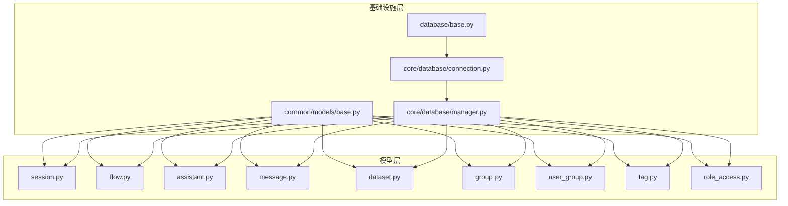

图表来源
- [src/backend/bisheng/common/models/base.py](file://src/backend/bisheng/common/models/base.py#L1-L19)
- [src/backend/bisheng/database/base.py](file://src/backend/bisheng/database/base.py#L1-L40)
- [src/backend/bisheng/core/database/connection.py](file://src/backend/bisheng/core/database/connection.py#L1-L175)
- [src/backend/bisheng/core/database/manager.py](file://src/backend/bisheng/core/database/manager.py#L1-L174)
- [src/backend/bisheng/database/models/session.py](file://src/backend/bisheng/database/models/session.py#L1-L288)
- [src/backend/bisheng/database/models/flow.py](file://src/backend/bisheng/database/models/flow.py#L1-L650)
- [src/backend/bisheng/database/models/assistant.py](file://src/backend/bisheng/database/models/assistant.py#L1-L331)
- [src/backend/bisheng/database/models/message.py](file://src/backend/bisheng/database/models/message.py#L1-L370)
- [src/backend/bisheng/database/models/dataset.py](file://src/backend/bisheng/database/models/dataset.py#L1-L92)
- [src/backend/bisheng/database/models/group.py](file://src/backend/bisheng/database/models/group.py#L1-L105)
- [src/backend/bisheng/database/models/user_group.py](file://src/backend/bisheng/database/models/user_group.py#L1-L256)
- [src/backend/bisheng/database/models/tag.py](file://src/backend/bisheng/database/models/tag.py#L1-L209)
- [src/backend/bisheng/database/models/role_access.py](file://src/backend/bisheng/database/models/role_access.py#L1-L169)

章节来源
- [src/backend/bisheng/common/models/base.py](file://src/backend/bisheng/common/models/base.py#L1-L19)
- [src/backend/bisheng/database/base.py](file://src/backend/bisheng/database/base.py#L1-L40)
- [src/backend/bisheng/core/database/connection.py](file://src/backend/bisheng/core/database/connection.py#L1-L175)
- [src/backend/bisheng/core/database/manager.py](file://src/backend/bisheng/core/database/manager.py#L1-L174)

## 核心组件
本节聚焦于关键实体与其 DAO 方法，展示 SQLModel 映射、字段类型与约束规则，并给出典型查询流程。

- 会话模型（MessageSession）
  - 主键：chat_id
  - 关键字段：flow_id、flow_type、flow_name、user_id、group_ids（JSON）、敏感状态、时间戳
  - DAO 支持插入、删除标记、按条件过滤、分页、统计、批量更新敏感状态与反馈计数
- 工作流模型（Flow）
  - 主键：id（UUID），包含名称、描述、数据（JSON）、状态、类型、引导词等
  - DAO 支持创建、删除、按用户/名称/类型/状态筛选、分页、统计、联合查询助手与技能
- 助手模型（Assistant）
  - 主键：id（UUID），包含名称、logo、描述、系统提示、模型参数、状态、用户ID等
  - DAO 支持创建/更新/删除（软删除）、按名称/用户/状态/ID集合筛选、权限关联查询
- 消息模型（ChatMessage）
  - 主键：id，包含 is_bot、source、mark_status、message、extra、type、category、flow_id、chat_id、user_id、反馈与敏感状态、时间戳
  - DAO 支持最新消息、按会话/技能查询、批量插入、删除、更新
- 知识库模型（Dataset）
  - 主键：id，包含用户ID、名称、描述、对象名等
  - DAO 支持按ID/关键词筛选、计数、增删改
- 用户组模型（UserGroup）
  - 复合主键：user_id、group_id，含是否管理员标志
  - DAO 支持查询用户所在组/管理员组、批量添加/删除、默认组加入
- 组模型（Group）
  - 主键：id，包含组名、备注、创建/更新用户
  - DAO 支持增删改查、批量查询
- 标签模型（Tag/TagLink）
  - 标签表唯一约束资源+类型+标签组合，支持资源到标签与标签到资源双向查询
- 角色权限模型（RoleAccess）
  - 权限类型枚举覆盖知识库、技能、助手、工具、工作流、看板等读写权限与前端菜单

章节来源
- [src/backend/bisheng/database/models/session.py](file://src/backend/bisheng/database/models/session.py#L1-L288)
- [src/backend/bisheng/database/models/flow.py](file://src/backend/bisheng/database/models/flow.py#L1-L650)
- [src/backend/bisheng/database/models/assistant.py](file://src/backend/bisheng/database/models/assistant.py#L1-L331)
- [src/backend/bisheng/database/models/message.py](file://src/backend/bisheng/database/models/message.py#L1-L370)
- [src/backend/bisheng/database/models/dataset.py](file://src/backend/bisheng/database/models/dataset.py#L1-L92)
- [src/backend/bisheng/database/models/user_group.py](file://src/backend/bisheng/database/models/user_group.py#L1-L256)
- [src/backend/bisheng/database/models/group.py](file://src/backend/bisheng/database/models/group.py#L1-L105)
- [src/backend/bisheng/database/models/tag.py](file://src/backend/bisheng/database/models/tag.py#L1-L209)
- [src/backend/bisheng/database/models/role_access.py](file://src/backend/bisheng/database/models/role_access.py#L1-L169)

## 架构总览
数据库访问通过全局管理器统一调度，DAO 层封装 CRUD 与复杂查询，SQLModel 提供 ORM 映射与序列化能力。

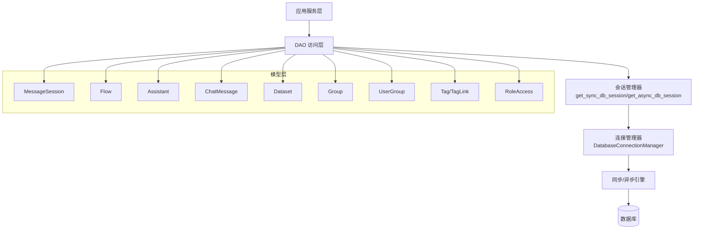

图表来源
- [src/backend/bisheng/core/database/manager.py](file://src/backend/bisheng/core/database/manager.py#L98-L174)
- [src/backend/bisheng/core/database/connection.py](file://src/backend/bisheng/core/database/connection.py#L17-L175)
- [src/backend/bisheng/database/models/session.py](file://src/backend/bisheng/database/models/session.py#L41-L288)
- [src/backend/bisheng/database/models/flow.py](file://src/backend/bisheng/database/models/flow.py#L80-L650)
- [src/backend/bisheng/database/models/assistant.py](file://src/backend/bisheng/database/models/assistant.py#L57-L331)
- [src/backend/bisheng/database/models/message.py](file://src/backend/bisheng/database/models/message.py#L49-L370)
- [src/backend/bisheng/database/models/dataset.py](file://src/backend/bisheng/database/models/dataset.py#L23-L92)
- [src/backend/bisheng/database/models/group.py](file://src/backend/bisheng/database/models/group.py#L25-L105)
- [src/backend/bisheng/database/models/user_group.py](file://src/backend/bisheng/database/models/user_group.py#L34-L256)
- [src/backend/bisheng/database/models/tag.py](file://src/backend/bisheng/database/models/tag.py#L24-L209)
- [src/backend/bisheng/database/models/role_access.py](file://src/backend/bisheng/database/models/role_access.py#L23-L169)

## 详细组件分析

### 会话模型（MessageSession）与 DAO
- 设计要点
  - 使用字符串主键 chat_id，便于前端生成与跨系统引用
  - flow_id、flow_type、flow_name 等字段用于标识所属应用类型与元信息
  - group_ids 以 JSON 存储，结合 UserGroupDao 自动补全用户所属组
  - 敏感状态与反馈计数字段用于内容治理与质量评估
  - 时间戳使用 server_default，确保一致性
- 查询与更新
  - 支持多维过滤（chat_ids、flow_ids、user_ids、反馈类型、时间范围、敏感状态、类型）
  - 分页与总数统计分离，避免重复扫描
  - 批量更新敏感状态与反馈计数，减少往返

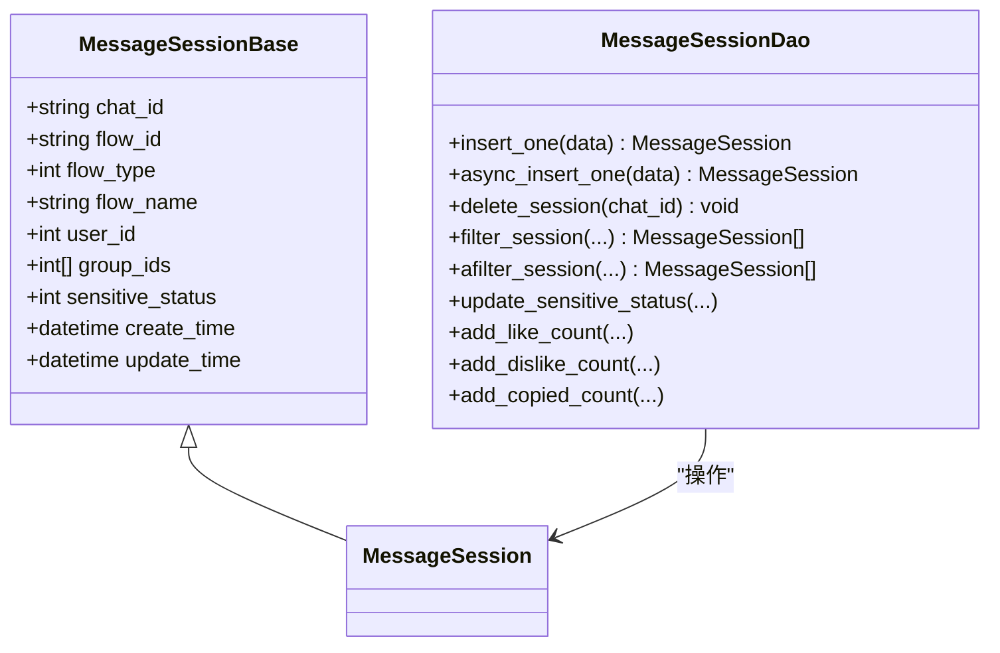

图表来源
- [src/backend/bisheng/database/models/session.py](file://src/backend/bisheng/database/models/session.py#L18-L288)

章节来源
- [src/backend/bisheng/database/models/session.py](file://src/backend/bisheng/database/models/session.py#L1-L288)

### 工作流模型（Flow）与 DAO
- 设计要点
  - 主键 id 为 UUID，避免顺序暴露与碰撞风险
  - data 字段为 JSON，承载节点与边等动态结构
  - 流程状态与类型枚举统一管理
  - 创建时自动写入默认版本记录
- 联合查询与权限
  - 与 RoleAccess 联合查询实现基于角色的可见性控制
  - 与 Assistant 联合查询统一返回“应用”列表（技能/助手/工作流）

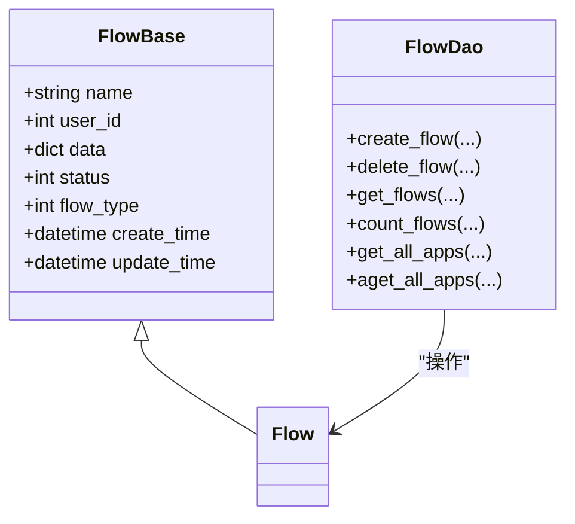

图表来源
- [src/backend/bisheng/database/models/flow.py](file://src/backend/bisheng/database/models/flow.py#L49-L650)

章节来源
- [src/backend/bisheng/database/models/flow.py](file://src/backend/bisheng/database/models/flow.py#L1-L650)

### 助手模型（Assistant）与 DAO
- 设计要点
  - 主键 id 为 UUID，便于跨系统引用
  - 包含系统提示、引导语、引导问题、模型参数、状态与删除标志
  - 通过 AssistantLink 将助手与工具、技能、知识库关联
- 权限与筛选
  - 支持按用户、名称、状态、ID 集合筛选
  - 与 RoleAccess 联合查询实现读取权限控制

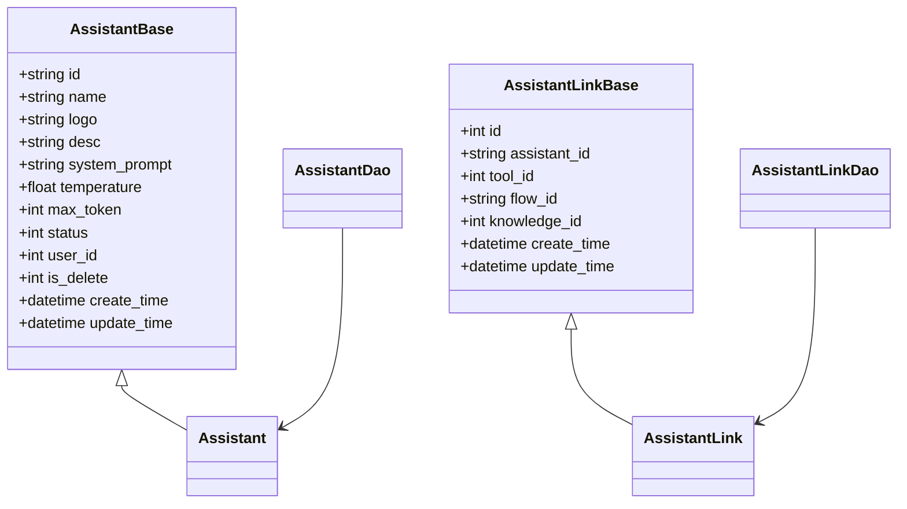

图表来源
- [src/backend/bisheng/database/models/assistant.py](file://src/backend/bisheng/database/models/assistant.py#L22-L331)

章节来源
- [src/backend/bisheng/database/models/assistant.py](file://src/backend/bisheng/database/models/assistant.py#L1-L331)

### 消息模型（ChatMessage）与 DAO
- 设计要点
  - 主键自增 id，message 字段使用 LONGTEXT，extra/files/remark 使用 TEXT/String
  - 支持按 chat_id、flow_id、category 过滤，支持最新消息与分页
  - 提供批量插入与删除接口
- 统计与聚合
  - 支持按会话分组统计点赞/踩/复制数量

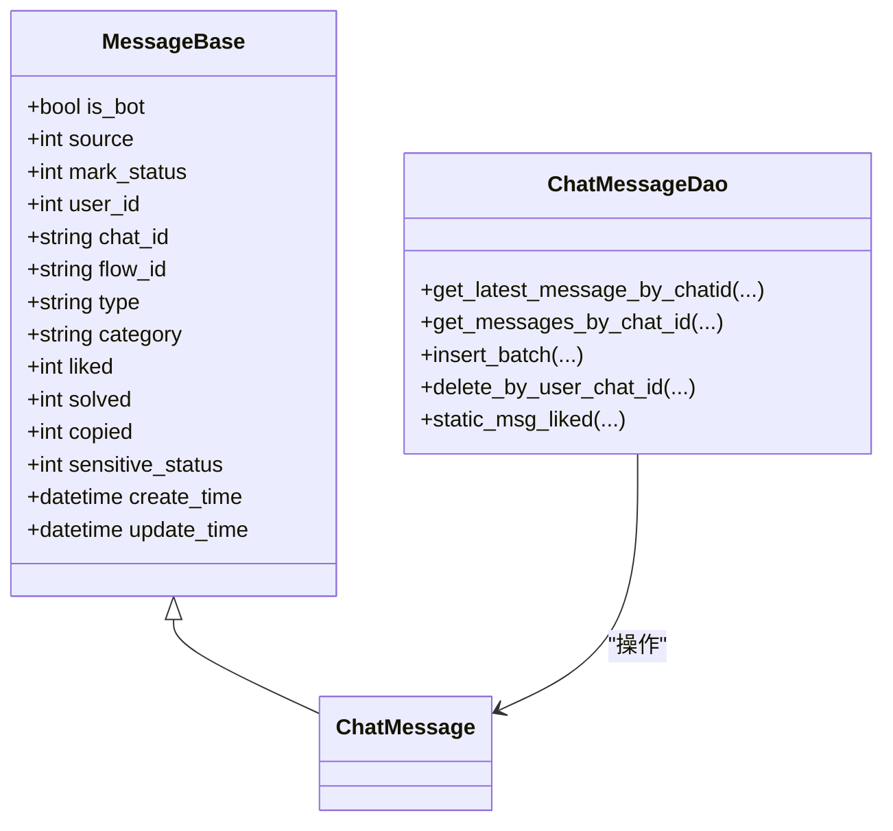

图表来源
- [src/backend/bisheng/database/models/message.py](file://src/backend/bisheng/database/models/message.py#L20-L370)

章节来源
- [src/backend/bisheng/database/models/message.py](file://src/backend/bisheng/database/models/message.py#L1-L370)

### 知识库模型（Dataset）与 DAO
- 设计要点
  - 主键自增 id，名称唯一索引
  - 支持按 ID 列表与关键词筛选、计数
- 典型用途
  - 作为 TagLink 的资源类型之一，配合标签体系实现资源标注

章节来源
- [src/backend/bisheng/database/models/dataset.py](file://src/backend/bisheng/database/models/dataset.py#L1-L92)

### 用户组与组模型（Group/UserGroup）与 DAO
- 设计要点
  - UserGroup 为复合主键（user_id, group_id），支持是否管理员标志
  - Group 为主键自增 id，组名唯一
  - 默认组常量用于新用户初始化
- 权限与默认行为
  - DAO 提供批量添加/删除用户组、默认组加入、管理员组维护等

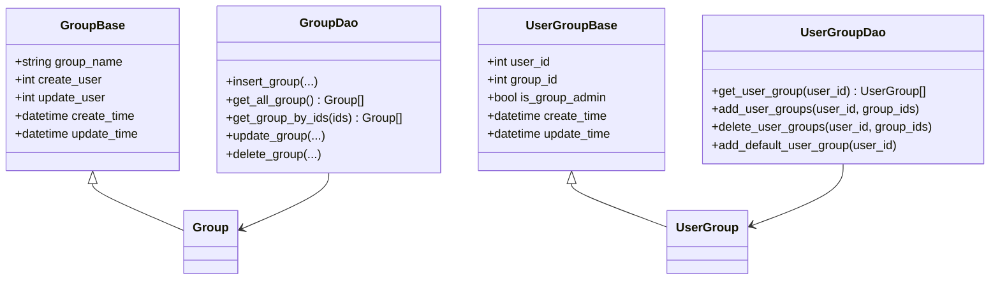

图表来源
- [src/backend/bisheng/database/models/group.py](file://src/backend/bisheng/database/models/group.py#L14-L105)
- [src/backend/bisheng/database/models/user_group.py](file://src/backend/bisheng/database/models/user_group.py#L12-L256)

章节来源
- [src/backend/bisheng/database/models/group.py](file://src/backend/bisheng/database/models/group.py#L1-L105)
- [src/backend/bisheng/database/models/user_group.py](file://src/backend/bisheng/database/models/user_group.py#L1-L256)

### 标签与资源关联（Tag/TagLink）与 DAO
- 设计要点
  - 标签唯一约束资源+类型+标签，避免重复关联
  - 支持按资源批量查询标签、按标签批量查询资源
- 应用场景
  - 与 Dataset、Flow、Assistant 等资源解耦关联，提升检索灵活性

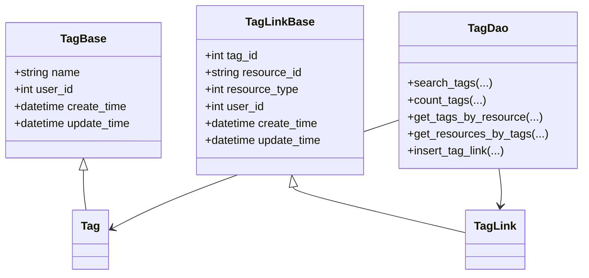

图表来源
- [src/backend/bisheng/database/models/tag.py](file://src/backend/bisheng/database/models/tag.py#L12-L209)

章节来源
- [src/backend/bisheng/database/models/tag.py](file://src/backend/bisheng/database/models/tag.py#L1-L209)

### 角色权限（RoleAccess）与 DAO
- 设计要点
  - 权限类型枚举覆盖知识库、技能、助手、工具、工作流、看板等读写权限与前端菜单
  - 支持按角色/类型批量查询、判断与刷新权限
- 与工作流/助手的联合查询
  - 通过 RoleAccess 实现基于角色的资源可见性控制

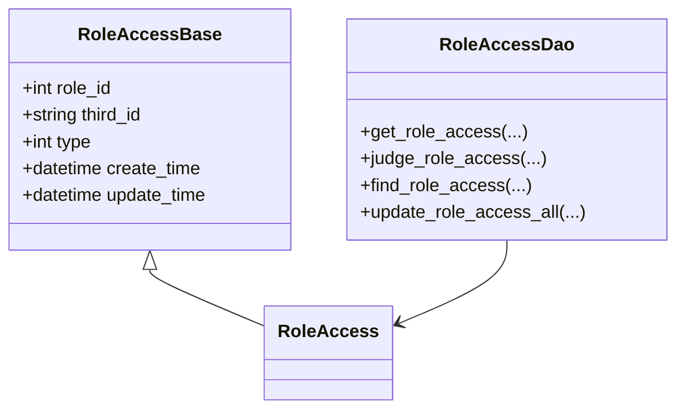

图表来源
- [src/backend/bisheng/database/models/role_access.py](file://src/backend/bisheng/database/models/role_access.py#L13-L169)

章节来源
- [src/backend/bisheng/database/models/role_access.py](file://src/backend/bisheng/database/models/role_access.py#L1-L169)

### 数据库关系设计与索引策略
- 主外键关系
  - UserGroup.user_id 引用用户表（未在本仓库直接展示，但外键声明明确）
  - UserGroup.group_id 引用 Group.id
  - TagLink.resource_id 可指向多种资源（如 Flow.id、Assistant.id、Dataset.id），由 resource_type 区分
  - RoleAccess.third_id 与资源类型对应，形成灵活的授权模型
- 索引策略
  - 多处字段建立索引（如 flow_id、user_id、chat_id、create_time 等）以支撑高频过滤与排序
  - TagLink 使用唯一约束（resource_id, resource_type, tag_id）避免重复关联
- 查询优化建议
  - 对高频过滤字段（flow_id、user_id、chat_id、create_time）保持索引
  - 分页查询使用 offset/limit 并配合 order_by，避免全表扫描
  - 统计与明细分离，先统计总数再取明细

章节来源
- [src/backend/bisheng/database/models/user_group.py](file://src/backend/bisheng/database/models/user_group.py#L12-L36)
- [src/backend/bisheng/database/models/tag.py](file://src/backend/bisheng/database/models/tag.py#L42-L44)
- [src/backend/bisheng/database/models/role_access.py](file://src/backend/bisheng/database/models/role_access.py#L13-L25)

### 数据迁移机制（Alembic）
- 版本管理
  - 项目提供 Alembic 配置与迁移目录，遵循标准版本命名与变更记录
- 迁移脚本编写
  - 建议通过 SQLModel 定义模型后，使用 Alembic autogenerate 生成迁移脚本
  - 对于复杂变更（如索引重建、字符集调整），需手动编写迁移脚本并审慎测试
- 最佳实践
  - 在开发环境先行验证，生产环境执行前进行回滚演练
  - 对大表变更采用分批处理与停机窗口规划

章节来源
- [src/backend/bisheng/core/database/connection.py](file://src/backend/bisheng/core/database/connection.py#L142-L154)

### 数据访问模式与最佳实践
- 连接池管理
  - 默认配置：pool_size=100、max_overflow=20、pool_timeout=30、pool_pre_ping=True、pool_recycle=3600
  - SQLite 使用 StaticPool，MySQL 设置 charset=utf8mb4
- 事务处理
  - DAO 方法内显式提交与回滚，异常时保证资源释放
  - 异步/同步会话分别管理，避免混用导致阻塞
- 性能优化
  - 使用分页与总数分离查询，避免一次性加载大量数据
  - 对热点字段建立索引，避免 SELECT *，仅选择必要列
  - 批量插入/更新，减少网络往返

章节来源
- [src/backend/bisheng/core/database/connection.py](file://src/backend/bisheng/core/database/connection.py#L40-L97)
- [src/backend/bisheng/core/database/manager.py](file://src/backend/bisheng/core/database/manager.py#L144-L174)
- [src/backend/bisheng/database/base.py](file://src/backend/bisheng/database/base.py#L7-L32)

### 数据库管理员指导
- 备份
  - 生产库定期全量备份，增量日志保留至少 7 天
  - 备份文件加密存储，访问权限最小化
- 恢复
  - 恢复前验证版本兼容性与完整性校验
  - 恢复演练每年至少一次，记录耗时与问题点
- 监控
  - 关注连接池利用率、慢查询、锁等待与死锁
  - 建立告警阈值（连接数、超时、错误率、磁盘空间）

## 依赖分析
- 组件耦合
  - DAO 依赖会话管理器与 SQLModel，不直接依赖具体驱动
  - UserGroupDao 与 GroupDao 协同完成用户分组管理
  - TagDao 与 TagLinkDao 解耦标签与资源的多对多关系
- 外部依赖
  - SQLAlchemy/SQLModel 提供 ORM 与连接管理
  - Alembic 提供迁移能力

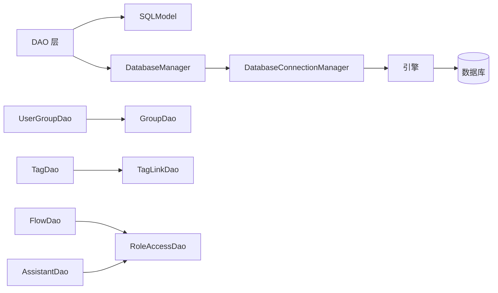

图表来源
- [src/backend/bisheng/core/database/manager.py](file://src/backend/bisheng/core/database/manager.py#L98-L174)
- [src/backend/bisheng/core/database/connection.py](file://src/backend/bisheng/core/database/connection.py#L17-L175)
- [src/backend/bisheng/database/models/user_group.py](file://src/backend/bisheng/database/models/user_group.py#L53-L256)
- [src/backend/bisheng/database/models/tag.py](file://src/backend/bisheng/database/models/tag.py#L47-L209)
- [src/backend/bisheng/database/models/flow.py](file://src/backend/bisheng/database/models/flow.py#L109-L650)
- [src/backend/bisheng/database/models/assistant.py](file://src/backend/bisheng/database/models/assistant.py#L65-L331)

章节来源
- [src/backend/bisheng/core/database/manager.py](file://src/backend/bisheng/core/database/manager.py#L1-L174)
- [src/backend/bisheng/core/database/connection.py](file://src/backend/bisheng/core/database/connection.py#L1-L175)
- [src/backend/bisheng/database/models/user_group.py](file://src/backend/bisheng/database/models/user_group.py#L1-L256)
- [src/backend/bisheng/database/models/tag.py](file://src/backend/bisheng/database/models/tag.py#L1-L209)
- [src/backend/bisheng/database/models/flow.py](file://src/backend/bisheng/database/models/flow.py#L1-L650)
- [src/backend/bisheng/database/models/assistant.py](file://src/backend/bisheng/database/models/assistant.py#L1-L331)

## 性能考虑
- 连接池参数调优
  - 根据并发请求峰值调整 pool_size 与 max_overflow
  - 启用 pool_pre_ping 与合理 pool_recycle，避免僵尸连接
- 查询优化
  - 为高频过滤字段建立索引，避免全表扫描
  - 分页查询使用覆盖索引，减少回表
- 写入优化
  - 批量插入/更新，合并事务提交
  - 避免大字段频繁更新，必要时拆表或延迟更新

## 故障排查指南
- 连接失败
  - 检查数据库 URL、驱动适配（aiomysql/asyncpg）与网络连通性
  - 查看连接池配置与超时设置
- 死锁/锁等待
  - 分析慢查询与长事务，缩短事务时间
  - 重试逻辑与幂等设计
- 迁移失败
  - 检查 Alembic 版本与目标数据库版本兼容性
  - 手动修正迁移脚本中的语法差异

章节来源
- [src/backend/bisheng/core/database/connection.py](file://src/backend/bisheng/core/database/connection.py#L32-L97)
- [src/backend/bisheng/core/database/manager.py](file://src/backend/bisheng/core/database/manager.py#L64-L95)

## 结论
Bisheng 的数据库设计以 SQLModel 为核心，围绕会话、工作流、助手、消息、知识库、用户组、标签与权限构建了清晰的数据模型与 DAO 访问层。通过统一的连接管理与会话上下文，实现了高可用与可扩展的数据库访问模式。配合合理的索引策略与迁移机制，能够满足生产环境的稳定性与演进需求。

## 附录
- 序列图：会话过滤与统计流程
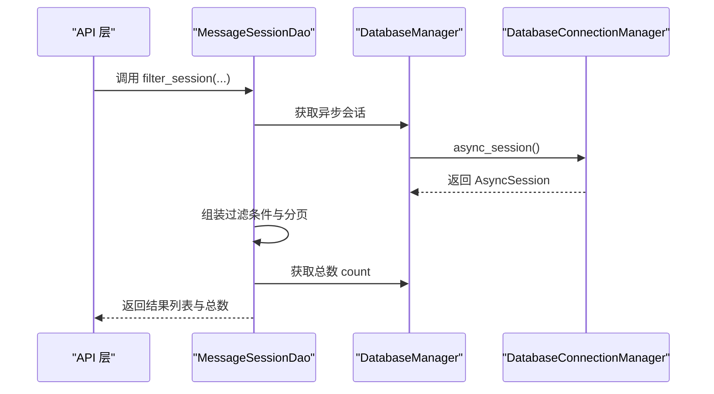

图表来源
- [src/backend/bisheng/database/models/session.py](file://src/backend/bisheng/database/models/session.py#L134-L235)
- [src/backend/bisheng/core/database/manager.py](file://src/backend/bisheng/core/database/manager.py#L144-L157)