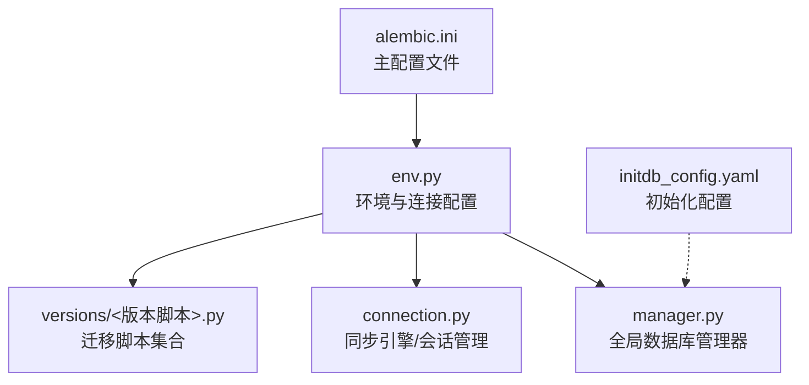
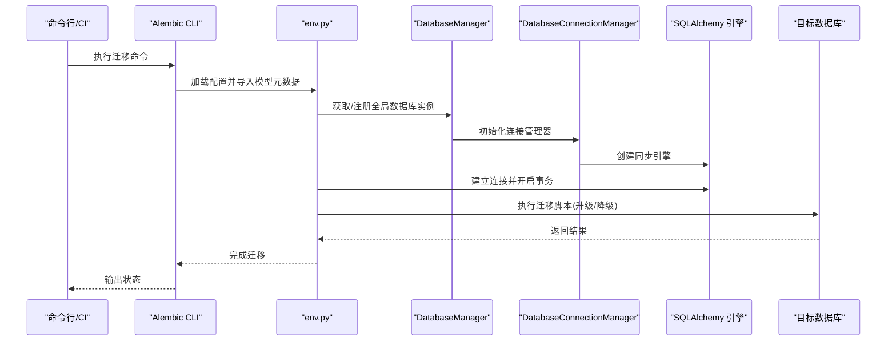
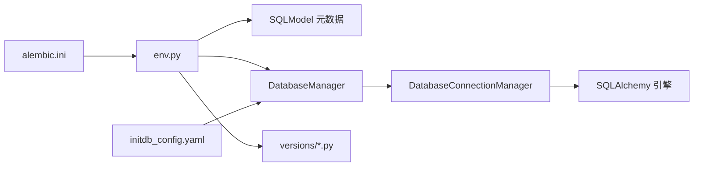

# 数据迁移管理

<cite>
**本文引用的文件**
- [src/backend/alembic.ini](file://src/backend/alembic.ini)
- [src/backend/bisheng/core/database/alembic/env.py](file://src/backend/bisheng/core/database/alembic/env.py)
- [src/backend/bisheng/core/database/alembic/versions/v2_3_0_beta1_9ba42685e830.py](file://src/backend/bisheng/core/database/alembic/versions/v2_3_0_beta1_9ba42685e830.py)
- [src/backend/bisheng/core/database/alembic/README.md](file://src/backend/bisheng/core/database/alembic/README.md)
- [src/backend/bisheng/core/database/connection.py](file://src/backend/bisheng/core/database/connection.py)
- [src/backend/bisheng/core/database/manager.py](file://src/backend/bisheng/core/database/manager.py)
- [src/backend/bisheng/initdb_config.yaml](file://src/backend/bisheng/initdb_config.yaml)
</cite>

## 目录
1. [引言](#引言)
2. [项目结构](#项目结构)
3. [核心组件](#核心组件)
4. [架构总览](#架构总览)
5. [详细组件分析](#详细组件分析)
6. [依赖关系分析](#依赖关系分析)
7. [性能考量](#性能考量)
8. [故障排除指南](#故障排除指南)
9. [结论](#结论)
10. [附录](#附录)

## 引言
本文件面向数据库管理员与开发工程师，系统性阐述 Bisheng 项目的数据库迁移管理方案，重点覆盖 Alembic 迁移框架的配置与使用、版本管理策略、迁移脚本编写规范、生产环境迁移最佳实践以及故障排除与维护指南。文档同时结合项目中的 initdb_config.yaml，说明数据库初始化与系统配置的关系。

## 项目结构
Bisheng 的数据库迁移以 Alembic 为核心，采用单库配置模式，通过 env.py 将 Alembic 与项目内的数据库连接管理器集成，确保迁移在统一的连接与事务上下文中执行。迁移脚本位于 versions 目录，遵循版本命名与元数据约定；README 提供常用命令速查；initdb_config.yaml 则用于系统初始化阶段的数据与配置注入。

图表来源
- [src/backend/alembic.ini](file://src/backend/alembic.ini#L1-L148)
- [src/backend/bisheng/core/database/alembic/env.py](file://src/backend/bisheng/core/database/alembic/env.py#L1-L50)
- [src/backend/bisheng/core/database/connection.py](file://src/backend/bisheng/core/database/connection.py#L1-L175)
- [src/backend/bisheng/core/database/manager.py](file://src/backend/bisheng/core/database/manager.py#L1-L174)
- [src/backend/bisheng/initdb_config.yaml](file://src/backend/bisheng/initdb_config.yaml#L1-L81)

章节来源
- [src/backend/alembic.ini](file://src/backend/alembic.ini#L1-L148)
- [src/backend/bisheng/core/database/alembic/README.md](file://src/backend/bisheng/core/database/alembic/README.md#L1-L57)

## 核心组件
- Alembic 主配置：定义脚本位置、文件模板、日志级别与路径分隔符等。
- 环境脚本：将 Alembic 与项目数据库连接管理器对接，实现在线迁移与事务封装。
- 连接管理：统一创建同步/异步引擎、会话、连接池参数，并支持表级创建。
- 全局管理器：提供健康检查、表创建、会话获取等能力，贯穿应用生命周期。
- 版本脚本：具体迁移逻辑，包含升级/降级两段式实现，确保幂等与可逆。
- 初始化配置：系统启动时的配置注入，与数据库初始化流程协同。

章节来源
- [src/backend/bisheng/core/database/alembic/env.py](file://src/backend/bisheng/core/database/alembic/env.py#L1-L50)
- [src/backend/bisheng/core/database/connection.py](file://src/backend/bisheng/core/database/connection.py#L1-L175)
- [src/backend/bisheng/core/database/manager.py](file://src/backend/bisheng/core/database/manager.py#L1-L174)
- [src/backend/bisheng/core/database/alembic/versions/v2_3_0_beta1_9ba42685e830.py](file://src/backend/bisheng/core/database/alembic/versions/v2_3_0_beta1_9ba42685e830.py#L1-L46)
- [src/backend/bisheng/initdb_config.yaml](file://src/backend/bisheng/initdb_config.yaml#L1-L81)

## 架构总览
下图展示了 Alembic 在 Bisheng 中的运行时架构：Alembic 通过 env.py 获取数据库连接，借助全局管理器与连接管理器完成引擎与会话的创建，随后在事务中执行迁移脚本。

图表来源
- [src/backend/bisheng/core/database/alembic/env.py](file://src/backend/bisheng/core/database/alembic/env.py#L29-L49)
- [src/backend/bisheng/core/database/manager.py](file://src/backend/bisheng/core/database/manager.py#L98-L142)
- [src/backend/bisheng/core/database/connection.py](file://src/backend/bisheng/core/database/connection.py#L66-L97)

## 详细组件分析

### Alembic 配置与环境
- 主配置文件 alembic.ini
  - 脚本位置与文件模板：通过 script_location 指定迁移脚本根目录，file_template 可按日期时间前缀生成文件名，便于追踪与排序。
  - 日志与路径：loggers/handlers/formatters 定义日志输出；path_separator 控制多路径分隔符。
  - 数据库 URL：可通过 env.py 动态注入，避免硬编码于配置文件。
- 环境脚本 env.py
  - 加载日志配置；
  - 设置 target_metadata 为项目模型元数据；
  - 在线迁移：通过全局数据库管理器获取同步引擎，建立连接并开启事务，执行迁移。

章节来源
- [src/backend/alembic.ini](file://src/backend/alembic.ini#L1-L148)
- [src/backend/bisheng/core/database/alembic/env.py](file://src/backend/bisheng/core/database/alembic/env.py#L1-L50)

### 迁移版本管理与脚本示例
- 版本脚本命名与元数据
  - 版本脚本文件名通常包含版本标识与描述，revision/down_revision/branch_labels/depends_on 等字段用于版本链路与依赖声明。
- 示例脚本解析
  - 升级：新增列、数据迁移、删除旧列等；保证幂等与可回滚。
  - 降级：逆向恢复列、回填数据、删除新增列等；确保数据一致性。
- 版本策略建议
  - 版本号：建议采用语义化版本或时间戳前缀，配合文件模板统一风格。
  - 分支策略：主干优先，复杂变更可考虑分支并在合并后清理。
  - 回滚机制：每个升级脚本必须配套降级脚本；对破坏性变更需谨慎评估。

章节来源
- [src/backend/bisheng/core/database/alembic/versions/v2_3_0_beta1_9ba42685e830.py](file://src/backend/bisheng/core/database/alembic/versions/v2_3_0_beta1_9ba42685e830.py#L1-L46)

### 数据库连接与全局管理
- 连接管理器
  - 同步/异步引擎分离，自动转换驱动协议；
  - 默认连接池参数（大小、超时、预检、回收）与 MySQL/SQLite 特殊配置；
  - 提供同步/异步会话上下文，异常自动回滚并关闭。
- 全局管理器
  - 提供健康检查、表创建（如初始化）、会话获取；
  - 通过应用上下文注册与获取，确保生命周期一致。

章节来源
- [src/backend/bisheng/core/database/connection.py](file://src/backend/bisheng/core/database/connection.py#L1-L175)
- [src/backend/bisheng/core/database/manager.py](file://src/backend/bisheng/core/database/manager.py#L1-L174)

### 初始化配置与数据库初始化
- initdb_config.yaml
  - 包含系统运行所需的各类配置项（如知识库、LLM 请求、默认操作者、密码安全、登录方式、验证码、环境变量、工作流、灵思模块等），用于系统初始化阶段的配置注入。
  - 与数据库初始化流程协同：在首次部署或重置环境中，先加载配置，再执行表结构创建与数据填充。
- 建议
  - 将敏感配置置于环境变量或密钥管理，避免硬编码；
  - 初始化脚本应具备幂等性，避免重复执行导致异常。

章节来源
- [src/backend/bisheng/initdb_config.yaml](file://src/backend/bisheng/initdb_config.yaml#L1-L81)

### 迁移脚本编写规范
- 结构要求
  - 必须包含 upgrade() 与 downgrade() 两个函数；
  - 明确 revision、down_revision、branch_labels、depends_on。
- 写法建议
  - 升级：先增后删，尽量保持数据不丢失；对已有数据进行显式迁移；
  - 降级：与升级相反，确保可逆；
  - 幂等：多次执行不应产生副作用；
  - 可测试：在隔离环境验证脚本逻辑。
- 数据转换
  - 使用原生 SQL 或 SQLAlchemy DDL/DML 实现字段重命名、类型转换、默认值设置、索引重建等；
  - 对 JSON/文本字段的迁移需注意编码与长度限制。
- 约束调整
  - 外键、唯一性、非空等约束变更需分步执行，避免锁表与失败。

章节来源
- [src/backend/bisheng/core/database/alembic/versions/v2_3_0_beta1_9ba42685e830.py](file://src/backend/bisheng/core/database/alembic/versions/v2_3_0_beta1_9ba42685e830.py#L20-L45)

### 生产环境迁移最佳实践
- 风险控制
  - 严格审阅迁移脚本，必要时进行小范围灰度；
  - 在低峰时段执行，预留回滚窗口；
  - 对关键业务表执行前先做快照或副本。
- 备份与验证
  - 迁移前导出结构与关键数据；
  - 迁移后执行健康检查与抽样验证。
- 自动化与可观测性
  - CI/CD 中集成迁移步骤与回滚策略；
  - 记录迁移日志与告警，监控失败与耗时。
- 回滚策略
  - 使用 downgrade 指定版本回退；
  - 如遇重大问题，准备手工修复脚本与数据恢复。

章节来源
- [src/backend/bisheng/core/database/alembic/README.md](file://src/backend/bisheng/core/database/alembic/README.md#L1-L57)
- [src/backend/bisheng/core/database/manager.py](file://src/backend/bisheng/core/database/manager.py#L64-L95)

## 依赖关系分析
- 配置层：alembic.ini 作为入口，env.py 作为桥接，加载项目模型元数据；
- 运行时层：env.py 通过全局管理器获取连接管理器，创建同步引擎并开启事务；
- 脚本层：versions 下的版本脚本按顺序执行，受 Alembic 版本表控制；
- 初始化层：initdb_config.yaml 与数据库初始化流程协同，确保系统配置与表结构就绪。

图表来源
- [src/backend/alembic.ini](file://src/backend/alembic.ini#L1-L148)
- [src/backend/bisheng/core/database/alembic/env.py](file://src/backend/bisheng/core/database/alembic/env.py#L1-L50)
- [src/backend/bisheng/core/database/manager.py](file://src/backend/bisheng/core/database/manager.py#L1-L174)
- [src/backend/bisheng/core/database/connection.py](file://src/backend/bisheng/core/database/connection.py#L1-L175)
- [src/backend/bisheng/initdb_config.yaml](file://src/backend/bisheng/initdb_config.yaml#L1-L81)

## 性能考量
- 连接池与超时
  - 合理设置 pool_size、max_overflow、pool_timeout、pool_pre_ping 与 pool_recycle，避免高并发下的连接争用与过期连接。
- 异步与同步
  - 在迁移场景优先使用同步引擎（env.py 已实现），避免异步上下文带来的复杂性；仅在应用层使用异步会话。
- 大表变更
  - 对大表的索引、列、约束变更应拆分为多个小步，减少锁竞争与长事务。
- 日志与监控
  - 降低日志级别至 INFO，避免迁移过程中的冗余输出影响性能。

## 故障排除指南
- 常见问题
  - 数据库连接失败：检查 alembic.ini 中的数据库 URL 注入逻辑与 env.py 的连接管理器初始化。
  - 权限不足：确认数据库用户具备 DDL 与 DML 权限。
  - 版本冲突：使用 heads/history/current 查看状态，必要时手动清理 Alembic 版本表或指定目标版本。
  - 迁移卡住：检查是否存在长事务或锁等待，适当缩短迁移步骤。
- 排障步骤
  - 使用 heads/current/history 确认当前版本；
  - 使用 --sql 生成 SQL 文件离线审阅；
  - 通过 downgrade 指定版本回退，再逐版本修复；
  - 启用更详细的日志定位异常。
- 维护建议
  - 定期备份数据库；
  - 对关键迁移脚本建立回归测试；
  - 在 CI 中增加迁移健康检查步骤。

章节来源
- [src/backend/bisheng/core/database/alembic/README.md](file://src/backend/bisheng/core/database/alembic/README.md#L1-L57)
- [src/backend/bisheng/core/database/manager.py](file://src/backend/bisheng/core/database/manager.py#L64-L95)

## 结论
Bisheng 的数据库迁移体系以 Alembic 为核心，结合项目自研的数据库连接与全局管理器，实现了可控、可观测且可回滚的迁移流程。通过规范化的版本管理、严格的编写与测试流程以及生产级的风险控制与回滚策略，能够有效保障数据库演进的安全与稳定。配合 initdb_config.yaml 的初始化配置，系统可在新环境快速完成结构与配置的就绪。

## 附录
- 常用命令速查（来自迁移说明文档）
  - 创建迁移脚本：alembic revision -m "描述信息"
  - 自动生成迁移脚本：alembic revision --autogenerate -m "描述信息"
  - 应用到最新版本：alembic upgrade head
  - 应用到指定版本：alembic upgrade <版本号>
  - 回滚一步：alembic downgrade -1
  - 回滚到指定版本：alembic downgrade <版本号>
  - 查看当前版本：alembic current
  - 查看迁移历史：alembic history
  - 查看未应用的迁移：alembic heads
  - 生成 SQL 文件：alembic upgrade head --sql > upgrade.sql

章节来源
- [src/backend/bisheng/core/database/alembic/README.md](file://src/backend/bisheng/core/database/alembic/README.md#L1-L57)