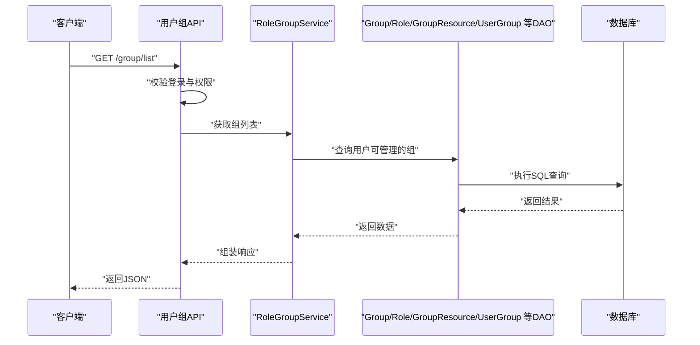
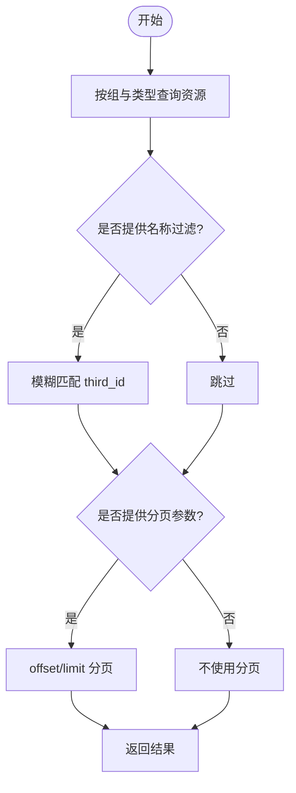
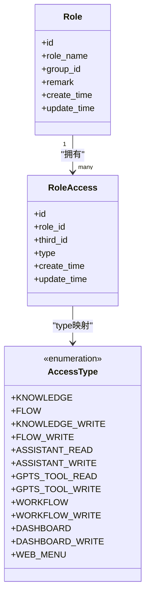
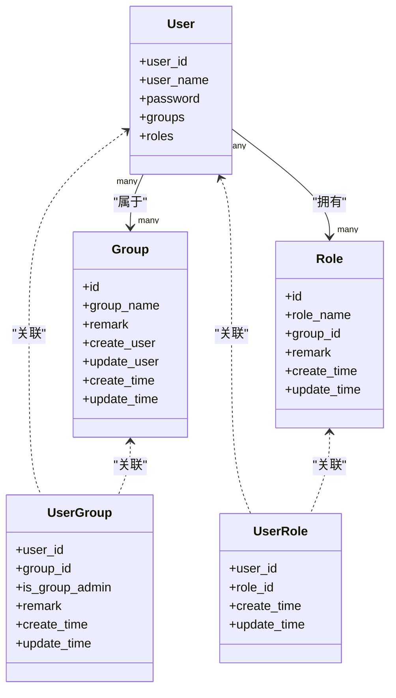
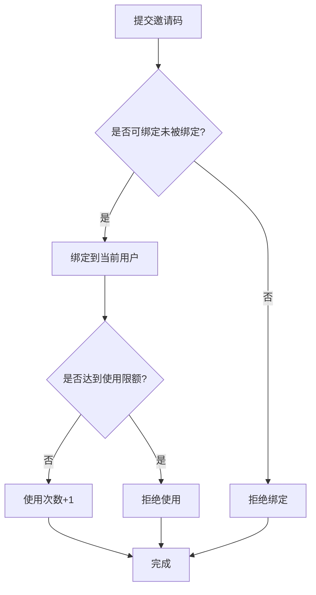
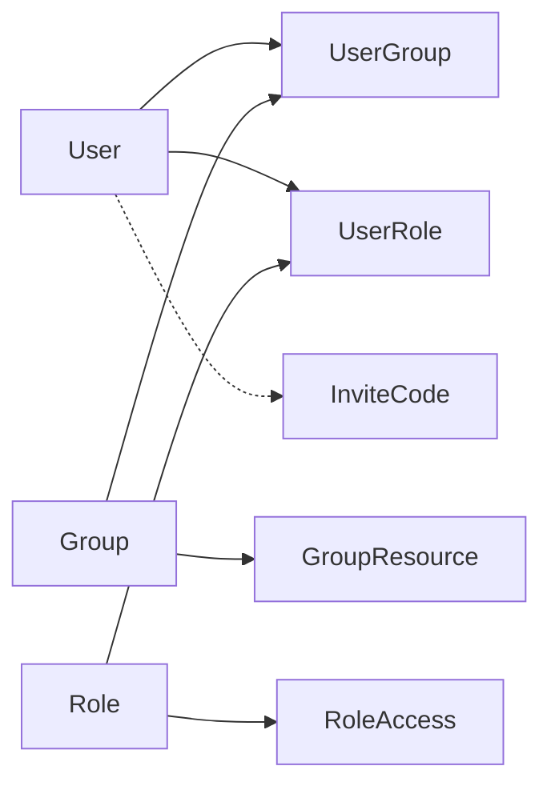

# 权限控制数据模型

<cite>
**本文引用的文件**
- [group.py](file://src/backend/bisheng/database/models/group.py)
- [group_resource.py](file://src/backend/bisheng/database/models/group_resource.py)
- [role.py](file://src/backend/bisheng/database/models/role.py)
- [role_access.py](file://src/backend/bisheng/database/models/role_access.py)
- [invite_code.py](file://src/backend/bisheng/database/models/invite_code.py)
- [user_group.py](file://src/backend/bisheng/database/models/user_group.py)
- [user_role.py](file://src/backend/bisheng/user/domain/models/user_role.py)
- [user.py](file://src/backend/bisheng/user/domain/models/user.py)
- [constants.py](file://src/backend/bisheng/database/constants.py)
- [usergroup.py](file://src/backend/bisheng/api/v1/usergroup.py)
- [invite_code.py](file://src/backend/bisheng/api/v1/invite_code.py)
</cite>

## 目录
1. [引言](#引言)
2. [项目结构](#项目结构)
3. [核心组件](#核心组件)
4. [架构总览](#架构总览)
5. [详细组件分析](#详细组件分析)
6. [依赖分析](#依赖分析)
7. [性能考虑](#性能考虑)
8. [故障排除指南](#故障排除指南)
9. [结论](#结论)
10. [附录](#附录)

## 引言
本文件面向系统管理员与开发人员，系统性梳理 Bisheng 的权限控制数据模型与实现，重点覆盖以下方面：
- 用户组模型（group）与组资源模型（group_resource）：组织架构与资源分配机制
- 角色模型（role）与角色访问模型（role_access）：RBAC 实现、权限矩阵与访问控制策略
- 邀请码模型（invite_code）：用户邀请流程与权限继承机制
- 权限模型间的层级关系与继承规则
- 最佳实践与故障排除指引

## 项目结构
权限控制相关的核心代码位于后端模块的 database/models 与 user/domain 下，并通过 API 层进行对外暴露。下图展示与权限控制直接相关的数据模型与服务层关系。

```mermaid
graph TB
subgraph "数据模型"
U["User<br/>用户"]
G["Group<br/>用户组"]
UG["UserGroup<br/>用户-组关联"]
R["Role<br/>角色"]
UR["UserRole<br/>用户-角色关联"]
RA["RoleAccess<br/>角色-访问授权"]
GR["GroupResource<br/>组-资源授权"]
IC["InviteCode<br/>邀请码"]
end
subgraph "服务与API"
S1["RoleGroupService<br/>用户组与角色服务"]
S2["InviteCodeService<br/>邀请码服务"]
API1["/group/*<br/>用户组API"]
API2["/invite/*<br/>邀请码API"]
end
U < --> UG
G < --> UG
U < --> UR
R < --> UR
R < --> RA
G < --> GR
U -.-> IC
S1 --> G
S1 --> R
S1 --> GR
S2 --> IC
API1 --> S1
API2 --> S2
```

图表来源
- [user.py](file://src/backend/bisheng/user/domain/models/user.py#L39-L48)
- [group.py](file://src/backend/bisheng/database/models/group.py#L25-L27)
- [user_group.py](file://src/backend/bisheng/database/models/user_group.py#L34-L35)
- [role.py](file://src/backend/bisheng/database/models/role.py#L24-L26)
- [user_role.py](file://src/backend/bisheng/user/domain/models/user_role.py#L32-L33)
- [role_access.py](file://src/backend/bisheng/database/models/role_access.py#L23-L24)
- [group_resource.py](file://src/backend/bisheng/database/models/group_resource.py#L31-L32)
- [invite_code.py](file://src/backend/bisheng/database/models/invite_code.py#L28-L29)
- [usergroup.py](file://src/backend/bisheng/api/v1/usergroup.py#L16-L38)
- [invite_code.py](file://src/backend/bisheng/api/v1/invite_code.py#L9-L27)

章节来源
- [user.py](file://src/backend/bisheng/user/domain/models/user.py#L39-L48)
- [group.py](file://src/backend/bisheng/database/models/group.py#L25-L27)
- [user_group.py](file://src/backend/bisheng/database/models/user_group.py#L34-L35)
- [role.py](file://src/backend/bisheng/database/models/role.py#L24-L26)
- [user_role.py](file://src/backend/bisheng/user/domain/models/user_role.py#L32-L33)
- [role_access.py](file://src/backend/bisheng/database/models/role_access.py#L23-L24)
- [group_resource.py](file://src/backend/bisheng/database/models/group_resource.py#L31-L32)
- [invite_code.py](file://src/backend/bisheng/database/models/invite_code.py#L28-L29)
- [usergroup.py](file://src/backend/bisheng/api/v1/usergroup.py#L16-L38)
- [invite_code.py](file://src/backend/bisheng/api/v1/invite_code.py#L9-L27)

## 核心组件
本节从数据模型角度，逐项解析权限控制的关键表结构与DAO方法，帮助读者建立“模型—关系—行为”的整体认知。

- 用户组（Group）
  - 字段要点：唯一名称、创建/更新用户、时间戳等
  - 关键DAO：查询、插入、批量查询、删除、更新等
  - 默认组常量：存在默认用户组标识，用于新用户加入默认组

- 组资源（GroupResource）
  - 资源类型枚举：知识库、技能、助手、工具、工作流、看板、工作站等
  - 关键DAO：单条/批量插入、按组/按资源类型查询、按资源ID查询归属组、批量删除、全量查询、批量更新

- 角色（Role）
  - 唯一约束：同一用户组内角色名唯一
  - 关键DAO：按组列表/计数、插入、删除（级联清理用户角色与角色访问）、按ID查询、异步查询、按组删除（级联清理）

- 角色访问（RoleAccess）
  - 访问类型枚举：知识库读写、技能读写、助手读写、工具读写、工作流读写、看板读写、前端菜单等
  - 关键DAO：按角色/类型批量查询、判断某角色是否具备某资源的某类型访问权、批量查询、批量更新（先清后增）

- 用户-组（UserGroup）
  - 关系：多对多中间表，支持普通成员与组管理员两种身份
  - 关键DAO：按用户查组、按组查用户、设置/删除管理员、默认组加入、批量替换用户组等

- 用户-角色（UserRole）
  - 关系：多对多中间表，承载用户的角色集合
  - 关键DAO：按用户/角色查询、设置超级管理员、批量添加/删除用户角色

- 邀请码（InviteCode）
  - 字段要点：批次、限额、已用次数、绑定用户、创建者
  - 关键DAO：批量创建、查询用户有效绑定码、绑定、使用、撤销使用

章节来源
- [group.py](file://src/backend/bisheng/database/models/group.py#L14-L105)
- [group_resource.py](file://src/backend/bisheng/database/models/group_resource.py#L12-L181)
- [role.py](file://src/backend/bisheng/database/models/role.py#L14-L125)
- [role_access.py](file://src/backend/bisheng/database/models/role_access.py#L13-L169)
- [user_group.py](file://src/backend/bisheng/database/models/user_group.py#L12-L256)
- [user_role.py](file://src/backend/bisheng/user/domain/models/user_role.py#L13-L110)
- [invite_code.py](file://src/backend/bisheng/database/models/invite_code.py#L10-L106)
- [constants.py](file://src/backend/bisheng/database/constants.py#L3-L6)

## 架构总览
下图展示权限控制在系统中的数据流与调用链：API 接收请求，校验登录与权限，调用服务层，服务层通过 DAO 操作数据库模型，最终返回结果。



图表来源
- [usergroup.py](file://src/backend/bisheng/api/v1/usergroup.py#L19-L38)
- [group.py](file://src/backend/bisheng/database/models/group.py#L62-L65)
- [user_group.py](file://src/backend/bisheng/database/models/user_group.py#L75-L81)

章节来源
- [usergroup.py](file://src/backend/bisheng/api/v1/usergroup.py#L19-L38)
- [group.py](file://src/backend/bisheng/database/models/group.py#L62-L65)
- [user_group.py](file://src/backend/bisheng/database/models/user_group.py#L75-L81)

## 详细组件分析

### 用户组模型（Group）与组资源模型（GroupResource）
- 设计要点
  - 用户组作为组织的基本单位，支持创建、更新、删除、查询全部与按ID批量查询
  - 组资源模型以“组+资源类型+资源ID”三元组记录资源授权，支持按组/资源类型/名称模糊查询、按资源ID反查归属组、批量删除与更新
  - 资源类型枚举覆盖知识库、技能、助手、工具、工作流、看板、工作站等，便于统一管理与扩展

- 数据流与控制流
  - 组资源查询时可叠加名称过滤与分页参数；资源归属查询支持按资源类型与资源ID精确匹配
  - 批量操作（插入、删除、更新）均提供同步与异步版本，满足不同场景下的性能需求



图表来源
- [group_resource.py](file://src/backend/bisheng/database/models/group_resource.py#L74-L87)
- [group_resource.py](file://src/backend/bisheng/database/models/group_resource.py#L100-L116)

章节来源
- [group.py](file://src/backend/bisheng/database/models/group.py#L44-L105)
- [group_resource.py](file://src/backend/bisheng/database/models/group_resource.py#L12-L181)

### 角色模型（Role）与角色访问模型（RoleAccess）的 RBAC 实现
- 设计要点
  - 角色与用户组强关联，且同一用户组内角色名唯一，避免重复定义
  - 角色访问以“角色+资源类型+资源ID”记录授权，支持多种访问类型（读/写/菜单等）
  - 提供批量查询、批量判断、批量查询与批量更新（先清后增）能力，确保权限变更原子性

- 权限矩阵与访问控制策略
  - 通过 RoleAccess.type 映射到具体资源类型的读/写权限或前端菜单限制
  - 判断某角色是否具备某资源的访问权限时，同时校验角色ID集合、资源类型与资源ID



图表来源
- [role.py](file://src/backend/bisheng/database/models/role.py#L24-L26)
- [role_access.py](file://src/backend/bisheng/database/models/role_access.py#L23-L24)
- [role_access.py](file://src/backend/bisheng/database/models/role_access.py#L49-L66)

章节来源
- [role.py](file://src/backend/bisheng/database/models/role.py#L14-L125)
- [role_access.py](file://src/backend/bisheng/database/models/role_access.py#L13-L169)

### 用户-组与用户-角色（UserGroup、UserRole）
- 设计要点
  - UserGroup 支持普通成员与组管理员两种身份，提供按用户查组、按组查用户、设置/删除管理员、默认组加入等功能
  - UserRole 作为用户角色的多对多桥接，支持批量添加/删除用户角色，以及设置超级管理员

- 权限继承与边界
  - 用户通过 UserGroup 进入组，再通过 UserRole 获得角色，从而间接获得 RoleAccess 中的权限
  - 超级管理员（AdminRole）不受用户组限制，可通过 UserRole 直接授予



图表来源
- [user.py](file://src/backend/bisheng/user/domain/models/user.py#L39-L47)
- [user_group.py](file://src/backend/bisheng/database/models/user_group.py#L34-L35)
- [user_role.py](file://src/backend/bisheng/user/domain/models/user_role.py#L32-L33)
- [role.py](file://src/backend/bisheng/database/models/role.py#L24-L26)

章节来源
- [user.py](file://src/backend/bisheng/user/domain/models/user.py#L18-L48)
- [user_group.py](file://src/backend/bisheng/database/models/user_group.py#L12-L256)
- [user_role.py](file://src/backend/bisheng/user/domain/models/user_role.py#L13-L110)
- [constants.py](file://src/backend/bisheng/database/constants.py#L3-L6)

### 邀请码模型（InviteCode）与权限继承机制
- 设计要点
  - 邀请码包含批次、限额、已用次数、绑定用户、创建者等字段
  - 支持批量创建、查询用户有效绑定码、绑定、使用、撤销使用等操作
  - 绑定后，用户可获得默认角色或进一步的角色/组权限（由业务流程决定）

- 流程图（绑定与使用）


图表来源
- [invite_code.py](file://src/backend/bisheng/database/models/invite_code.py#L66-L90)

章节来源
- [invite_code.py](file://src/backend/bisheng/database/models/invite_code.py#L10-L106)
- [invite_code.py](file://src/backend/bisheng/api/v1/invite_code.py#L12-L47)

### API 使用与权限校验示例
- 用户组 API
  - 列表、创建、更新、删除、设置用户组、查询用户所在组、查询组内用户、设置组管理员、更新组最后修改人、查询组资源、查询组内角色、查询管理资源等
  - 多处接口对“是否为组管理员”进行校验，非管理员无权访问

- 邀请码 API
  - 创建批次邀请码（仅管理员）、绑定邀请码（登录用户）、查询可用次数（登录用户）

章节来源
- [usergroup.py](file://src/backend/bisheng/api/v1/usergroup.py#L19-L185)
- [invite_code.py](file://src/backend/bisheng/api/v1/invite_code.py#L12-L47)

## 依赖分析
- 内部依赖
  - User 模型通过 Relationship 关联 Group 与 Role，体现用户-组-角色的三层关系
  - RoleDao 在删除角色时会级联删除 UserRole 与 RoleAccess，保证数据一致性
  - UserGroupDao 支持默认组加入与批量替换用户组，配合默认组常量 DefaultGroup

- 外部依赖
  - 数据库 ORM 使用 SQLModel 与 SQLAlchemy，DAO 方法统一通过 get_sync_db_session/get_async_db_session 获取会话
  - 常量 AdminRole/DefaultRole 控制超级管理员与默认角色的行为边界



图表来源
- [user.py](file://src/backend/bisheng/user/domain/models/user.py#L46-L47)
- [role.py](file://src/backend/bisheng/database/models/role.py#L90-L92)
- [user_group.py](file://src/backend/bisheng/database/models/user_group.py#L223-L230)
- [constants.py](file://src/backend/bisheng/database/constants.py#L3-L6)

章节来源
- [user.py](file://src/backend/bisheng/user/domain/models/user.py#L46-L47)
- [role.py](file://src/backend/bisheng/database/models/role.py#L90-L92)
- [user_group.py](file://src/backend/bisheng/database/models/user_group.py#L223-L230)
- [constants.py](file://src/backend/bisheng/database/constants.py#L3-L6)

## 性能考虑
- 查询优化
  - 多处 DAO 方法提供分页参数（offset/limit），建议在大数据量场景下开启分页
  - 按组/按资源类型/按资源ID的过滤条件尽量组合使用，减少扫描范围
- 批量操作
  - 批量插入/删除/更新可显著降低网络往返与事务开销，优先使用批量版本
- 异步支持
  - 同步与异步 DAO 并存，高并发场景建议优先使用异步 DAO 以提升吞吐

## 故障排除指南
- 常见问题与定位
  - 无法查看用户组列表：确认当前用户是否为组管理员；非管理员将触发未授权错误
  - 设置用户组失败：检查传入的组ID列表是否为空；空列表将触发参数错误
  - 删除角色失败：确认角色是否存在且未被其他用户持有；删除会级联清理用户角色与角色访问
  - 绑定/使用邀请码失败：检查邀请码是否未被绑定、是否超过使用限额；根据返回状态判断原因
- 审计与日志
  - API 层对关键操作（如创建邀请码、绑定邀请码）记录请求IP与参数，便于审计与回溯

章节来源
- [usergroup.py](file://src/backend/bisheng/api/v1/usergroup.py#L24-L35)
- [usergroup.py](file://src/backend/bisheng/api/v1/usergroup.py#L80-L82)
- [role.py](file://src/backend/bisheng/database/models/role.py#L87-L92)
- [invite_code.py](file://src/backend/bisheng/api/v1/invite_code.py#L20-L27)
- [invite_code.py](file://src/backend/bisheng/api/v1/invite_code.py#L36-L38)

## 结论
Bisheng 的权限控制采用清晰的三层模型（用户-组-角色）与细粒度的授权（角色-资源-类型）相结合的方式，既满足组织架构的灵活编排，又保障了资源访问的精细化控制。通过默认组、超级管理员、组资源与角色访问的协同，系统实现了可审计、可扩展、可维护的权限体系。建议在生产环境中遵循最小权限原则与定期审计策略，确保安全与合规。

## 附录
- 最佳实践清单
  - 最小权限原则：为角色分配完成任务所需的最少权限，避免授予不必要的读写或菜单权限
  - 定期审计：周期性核对用户-角色、角色-访问、组-资源的对应关系，清理无效授权
  - 变更流程：角色与权限变更应走审批流程，保留变更记录与回滚预案
  - 默认策略：新用户自动加入默认组，避免遗漏；邀请码使用需受控，防止滥用
- 常用操作路径参考
  - 新建用户并赋予默认角色：参见用户创建与默认角色添加的 DAO 方法
  - 批量设置用户组：参见用户组批量替换方法
  - 批量更新角色权限：参见角色访问批量更新方法（先清后增）