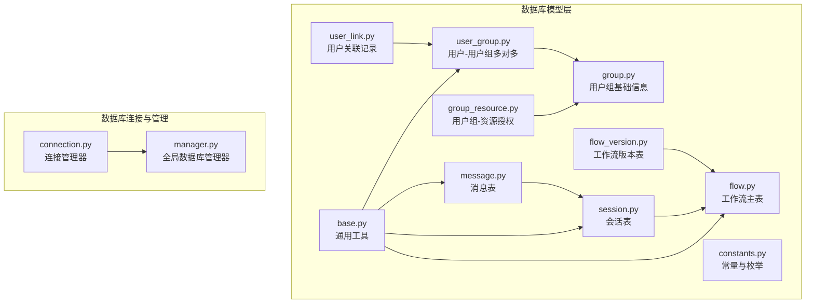
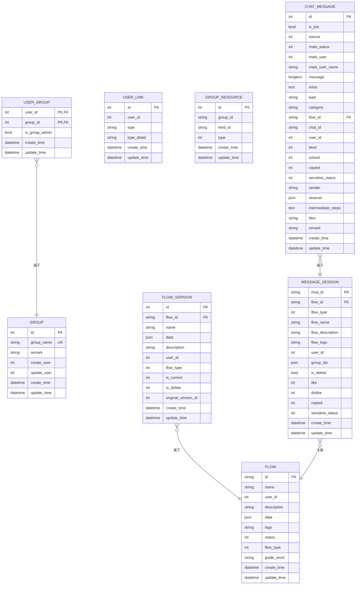
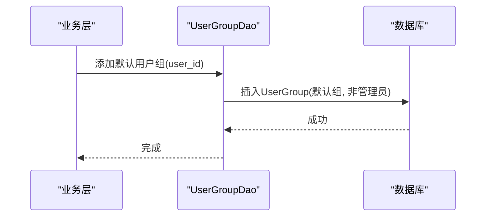
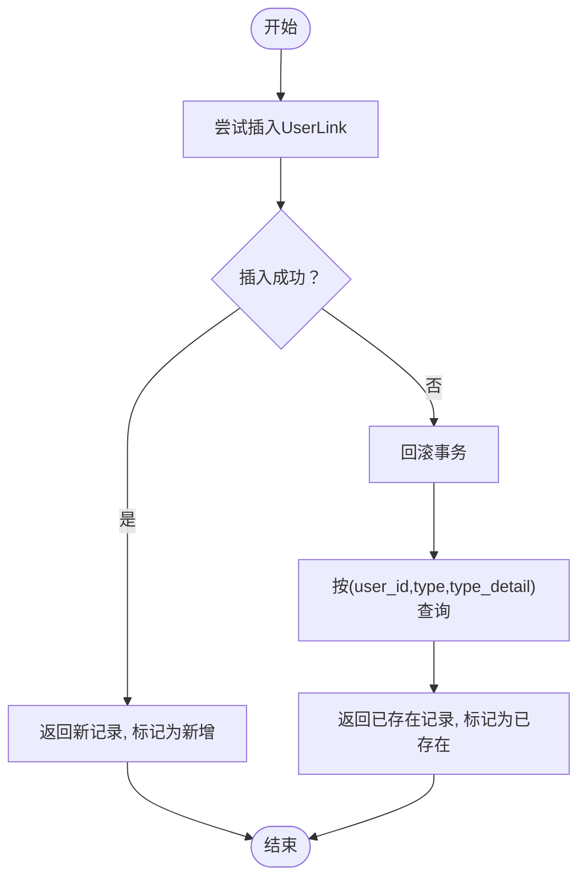
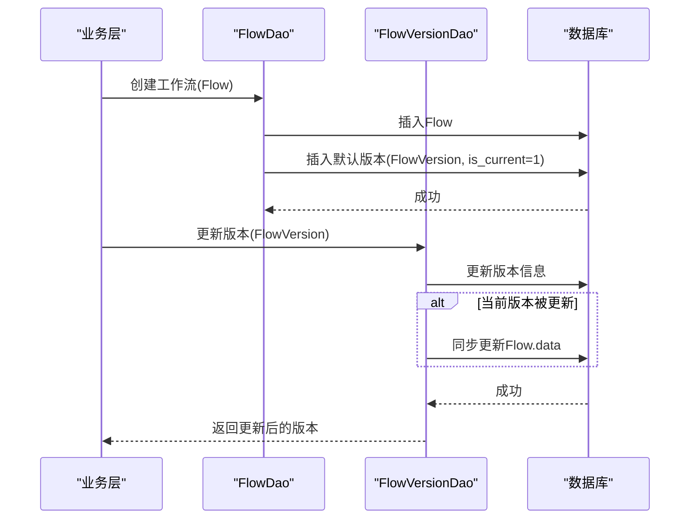
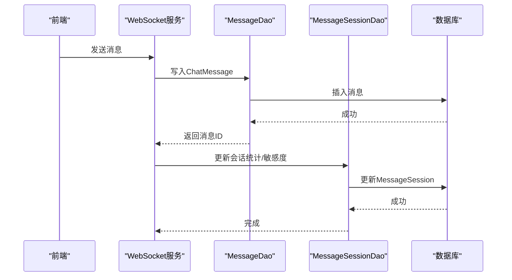
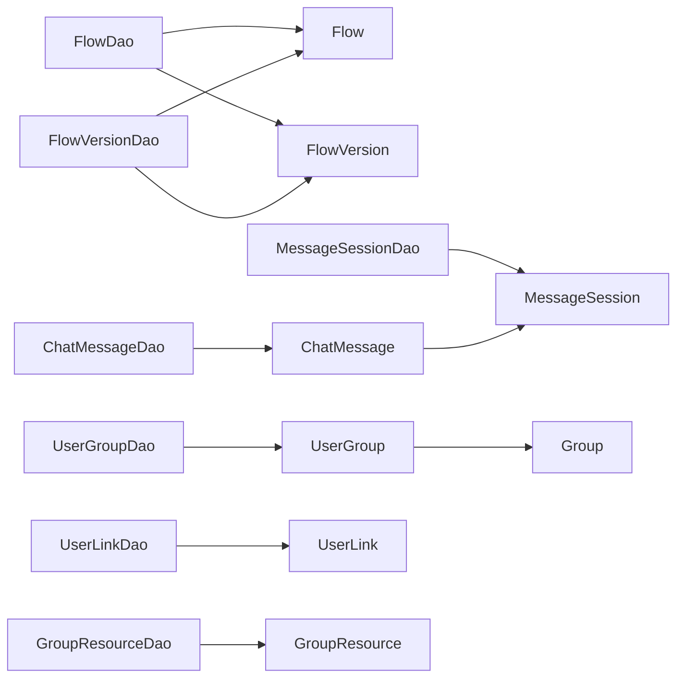

# 核心数据模型

<cite>
**本文引用的文件**
- [src/backend/bisheng/database/models/user_group.py](file://src/backend/bisheng/database/models/user_group.py)
- [src/backend/bisheng/database/models/user_link.py](file://src/backend/bisheng/database/models/user_link.py)
- [src/backend/bisheng/database/models/group.py](file://src/backend/bisheng/database/models/group.py)
- [src/backend/bisheng/database/models/group_resource.py](file://src/backend/bisheng/database/models/group_resource.py)
- [src/backend/bisheng/database/models/flow.py](file://src/backend/bisheng/database/models/flow.py)
- [src/backend/bisheng/database/models/flow_version.py](file://src/backend/bisheng/database/models/flow_version.py)
- [src/backend/bisheng/database/models/session.py](file://src/backend/bisheng/database/models/session.py)
- [src/backend/bisheng/database/models/message.py](file://src/backend/bisheng/database/models/message.py)
- [src/backend/bisheng/database/base.py](file://src/backend/bisheng/database/base.py)
- [src/backend/bisheng/database/constants.py](file://src/backend/bisheng/database/constants.py)
- [src/backend/bisheng/core/database/connection.py](file://src/backend/bisheng/core/database/connection.py)
- [src/backend/bisheng/core/database/manager.py](file://src/backend/bisheng/core/database/manager.py)
</cite>

## 目录
1. [简介](#简介)
2. [项目结构](#项目结构)
3. [核心组件](#核心组件)
4. [架构总览](#架构总览)
5. [详细组件分析](#详细组件分析)
6. [依赖分析](#依赖分析)
7. [性能考虑](#性能考虑)
8. [故障排查指南](#故障排查指南)
9. [结论](#结论)
10. [附录](#附录)

## 简介
本文件聚焦于 Bisheng 的核心数据模型，围绕以下主题进行系统化技术文档：
- 用户相关模型：用户与用户组的多对多关系设计与实现（user_group、user_link），以及用户分组资源授权（group_resource）。
- 工作流相关模型：flow 与 flow_version 的版本控制机制、状态管理与数据一致性策略。
- 会话与消息模型：实时通信的数据结构、消息持久化策略与检索优化。
- 模型间关联关系、外键约束与级联行为。
- 使用示例与最佳实践、数据验证规则与业务约束。
- 扩展与定制指导原则。

## 项目结构
本节概览与数据库模型直接相关的目录与文件组织方式，便于定位与理解模型边界与职责。

**图表来源**
- [src/backend/bisheng/database/models/user_group.py](file://src/backend/bisheng/database/models/user_group.py#L1-L256)
- [src/backend/bisheng/database/models/user_link.py](file://src/backend/bisheng/database/models/user_link.py#L1-L74)
- [src/backend/bisheng/database/models/group.py](file://src/backend/bisheng/database/models/group.py#L1-L105)
- [src/backend/bisheng/database/models/group_resource.py](file://src/backend/bisheng/database/models/group_resource.py#L1-L181)
- [src/backend/bisheng/database/models/flow.py](file://src/backend/bisheng/database/models/flow.py#L1-L650)
- [src/backend/bisheng/database/models/flow_version.py](file://src/backend/bisheng/database/models/flow_version.py#L1-L237)
- [src/backend/bisheng/database/models/session.py](file://src/backend/bisheng/database/models/session.py#L1-L288)
- [src/backend/bisheng/database/models/message.py](file://src/backend/bisheng/database/models/message.py#L1-L370)
- [src/backend/bisheng/database/base.py](file://src/backend/bisheng/database/base.py#L1-L40)
- [src/backend/bisheng/database/constants.py](file://src/backend/bisheng/database/constants.py#L1-L13)
- [src/backend/bisheng/core/database/connection.py](file://src/backend/bisheng/core/database/connection.py#L1-L175)
- [src/backend/bisheng/core/database/manager.py](file://src/backend/bisheng/core/database/manager.py#L1-L174)

**章节来源**
- [src/backend/bisheng/database/models/user_group.py](file://src/backend/bisheng/database/models/user_group.py#L1-L256)
- [src/backend/bisheng/database/models/flow.py](file://src/backend/bisheng/database/models/flow.py#L1-L650)
- [src/backend/bisheng/database/models/session.py](file://src/backend/bisheng/database/models/session.py#L1-L288)
- [src/backend/bisheng/core/database/connection.py](file://src/backend/bisheng/core/database/connection.py#L1-L175)

## 核心组件
本节从“模型-DAO-查询”三个维度梳理关键组件，并给出使用路径与要点。

- 用户与用户组（user_group）
  - 模型：UserGroup（复合主键 user_id、group_id，带 is_group_admin 字段）
  - DAO：UserGroupDao 提供用户所在组、管理员组、批量增删改查等方法
  - 关系：与 Group 表通过 group_id 外键关联；删除策略为 CASCADE
  - 默认组：新增用户时可自动加入默认用户组
  - 参考路径：[UserGroup 模型与 DAO](file://src/backend/bisheng/database/models/user_group.py#L34-L256)

- 用户关联记录（user_link）
  - 模型：UserLink（唯一性由数据库约束保证）
  - DAO：UserLinkDao 支持按类型查询、去重插入、删除
  - 场景：用户与第三方类型的绑定（如外部账号、授权类型等）
  - 参考路径：[UserLink 模型与 DAO](file://src/backend/bisheng/database/models/user_link.py#L13-L74)

- 用户组（group）
  - 模型：Group（包含组名、备注、时间戳等）
  - DAO：GroupDao 提供查询、创建、更新、删除、异步查询等
  - 默认组常量：DefaultGroup
  - 参考路径：[Group 模型与 DAO](file://src/backend/bisheng/database/models/group.py#L25-L105)

- 用户组-资源授权（group_resource）
  - 模型：GroupResource（资源类型枚举 ResourceTypeEnum）
  - DAO：GroupResourceDao 支持按组/资源类型查询、批量写入、删除、归属查询
  - 参考路径：[GroupResource 模型与 DAO](file://src/backend/bisheng/database/models/group_resource.py#L31-L181)

- 工作流（flow）
  - 模型：Flow（主键 id，状态、类型、描述、logo、引导语、data JSON）
  - 枚举：FlowStatus、FlowType、AppEnum
  - DAO：FlowDao 提供创建、删除、查询、分页、在线列表、权限过滤、统计、聚合等
  - 数据校验：data 必须为 JSON 且包含 nodes、edges
  - 参考路径：[Flow 模型与 DAO](file://src/backend/bisheng/database/models/flow.py#L49-L650)

- 工作流版本（flow_version）
  - 模型：FlowVersion（外键 flow_id，name、is_current、is_delete、original_version_id、data JSON）
  - DAO：FlowVersionDao 提供版本创建、更新、当前版本切换、删除、列表查询、计数等
  - 数据校验：同上，必须包含 nodes、edges
  - 参考路径：[FlowVersion 模型与 DAO](file://src/backend/bisheng/database/models/flow_version.py#L16-L237)

- 会话（session）
  - 模型：MessageSession（chat_id 主键，flow_id、flow_type、flow_name、flow_description、flow_logo、user_id、group_ids JSON、敏感度、反馈统计等）
  - DAO：MessageSessionDao 提供插入、删除标记、查询、过滤、统计、反馈计数更新、应用信息同步等
  - 参考路径：[MessageSession 模型与 DAO](file://src/backend/bisheng/database/models/session.py#L18-L288)

- 消息（message）
  - 模型：ChatMessage（id 主键，chat_id、flow_id、user_id、is_bot、category、type、message、files、extra、中间步骤、敏感度、标记等）
  - DAO：ChatMessageDao 提供最新消息、按会话查询、批量插入、删除、更新、过滤、统计等
  - 参考路径：[ChatMessage 模型与 DAO](file://src/backend/bisheng/database/models/message.py#L20-L370)

- 基础工具与常量
  - base.py：通用计数、异步计数、uuid_hex 工具
  - constants.py：默认角色、超级管理员角色、消息分类枚举
  - 参考路径：[基础工具](file://src/backend/bisheng/database/base.py#L1-L40)、[常量与枚举](file://src/backend/bisheng/database/constants.py#L1-L13)

**章节来源**
- [src/backend/bisheng/database/models/user_group.py](file://src/backend/bisheng/database/models/user_group.py#L1-L256)
- [src/backend/bisheng/database/models/user_link.py](file://src/backend/bisheng/database/models/user_link.py#L1-L74)
- [src/backend/bisheng/database/models/group.py](file://src/backend/bisheng/database/models/group.py#L1-L105)
- [src/backend/bisheng/database/models/group_resource.py](file://src/backend/bisheng/database/models/group_resource.py#L1-L181)
- [src/backend/bisheng/database/models/flow.py](file://src/backend/bisheng/database/models/flow.py#L1-L650)
- [src/backend/bisheng/database/models/flow_version.py](file://src/backend/bisheng/database/models/flow_version.py#L1-L237)
- [src/backend/bisheng/database/models/session.py](file://src/backend/bisheng/database/models/session.py#L1-L288)
- [src/backend/bisheng/database/models/message.py](file://src/backend/bisheng/database/models/message.py#L1-L370)
- [src/backend/bisheng/database/base.py](file://src/backend/bisheng/database/base.py#L1-L40)
- [src/backend/bisheng/database/constants.py](file://src/backend/bisheng/database/constants.py#L1-L13)

## 架构总览
下图展示核心模型之间的关系、外键约束与典型交互流程。

**图表来源**
- [src/backend/bisheng/database/models/user_group.py](file://src/backend/bisheng/database/models/user_group.py#L12-L36)
- [src/backend/bisheng/database/models/group.py](file://src/backend/bisheng/database/models/group.py#L14-L28)
- [src/backend/bisheng/database/models/user_link.py](file://src/backend/bisheng/database/models/user_link.py#L13-L26)
- [src/backend/bisheng/database/models/group_resource.py](file://src/backend/bisheng/database/models/group_resource.py#L21-L33)
- [src/backend/bisheng/database/models/flow.py](file://src/backend/bisheng/database/models/flow.py#L49-L83)
- [src/backend/bisheng/database/models/flow_version.py](file://src/backend/bisheng/database/models/flow_version.py#L16-L51)
- [src/backend/bisheng/database/models/session.py](file://src/backend/bisheng/database/models/session.py#L18-L43)
- [src/backend/bisheng/database/models/message.py](file://src/backend/bisheng/database/models/message.py#L20-L52)

## 详细组件分析

### 用户与用户组（user_group）多对多关系
- 设计要点
  - 复合主键（user_id, group_id）确保唯一性
  - is_group_admin 区分普通成员与管理员
  - 删除策略：外键 ondelete=CASCADE，删除用户或组时级联清理
  - 默认组：新增用户时自动加入默认用户组（DefaultGroup）
- 典型流程
  - 新增用户后，调用添加默认用户组方法
  - 查询用户所在组、管理员组，支持分页与批量查询
  - 批量迁移用户到新组或清空旧组
- 最佳实践
  - 在业务层统一入口处理用户组变更，避免重复或遗漏
  - 对管理员组的批量删除需谨慎，建议先查询再删除
- 参考路径
  - [UserGroup 模型与 DAO](file://src/backend/bisheng/database/models/user_group.py#L34-L256)
  - [默认组常量](file://src/backend/bisheng/database/constants.py#L10-L13)

**图表来源**
- [src/backend/bisheng/database/models/user_group.py](file://src/backend/bisheng/database/models/user_group.py#L223-L231)

**章节来源**
- [src/backend/bisheng/database/models/user_group.py](file://src/backend/bisheng/database/models/user_group.py#L1-L256)
- [src/backend/bisheng/database/constants.py](file://src/backend/bisheng/database/constants.py#L10-L13)

### 用户关联记录（user_link）
- 设计要点
  - 唯一性约束：通过数据库约束防止重复插入
  - DAO 提供“尝试插入-捕获异常-回滚并查询”的幂等逻辑
  - 支持按类型批量查询、删除
- 使用场景
  - 绑定第三方账号、授权类型、外部 ID 等
- 最佳实践
  - 插入前先查询是否存在，减少异常开销
  - 删除时精确匹配 user_id、type、type_detail
- 参考路径
  - [UserLink 模型与 DAO](file://src/backend/bisheng/database/models/user_link.py#L13-L74)

**图表来源**
- [src/backend/bisheng/database/models/user_link.py](file://src/backend/bisheng/database/models/user_link.py#L37-L65)

**章节来源**
- [src/backend/bisheng/database/models/user_link.py](file://src/backend/bisheng/database/models/user_link.py#L1-L74)

### 工作流（flow）与版本（flow_version）模型
- 版本控制机制
  - 创建工作流时自动创建默认版本（name=v0，is_current=1）
  - 更新版本时若 is_current=1，同步更新 Flow.data
  - 切换当前版本时，先设置新版本为当前，再取消其他版本的当前标记
  - 删除版本时仅软删除（is_delete=1），禁止删除正在使用的版本
- 状态管理
  - Flow.status：OFFLINE/ONLINE
  - FlowVersion.is_current/is_delete：当前版本与逻辑删除
- 数据校验
  - data 字段必须为 JSON，且包含 nodes、edges
- 典型流程
  - 创建工作流 -> 自动创建默认版本 -> 发布上线 -> 修改内容 -> 新建版本 -> 切换当前版本
- 最佳实践
  - 版本命名规范（如 v0/v1/v2...），便于追踪
  - 上线前先预览，确认 is_current 正确
  - 大字段 data 查询时优先走简要信息接口，避免全量传输
- 参考路径
  - [Flow 模型与 DAO](file://src/backend/bisheng/database/models/flow.py#L49-L650)
  - [FlowVersion 模型与 DAO](file://src/backend/bisheng/database/models/flow_version.py#L16-L237)

**图表来源**
- [src/backend/bisheng/database/models/flow.py](file://src/backend/bisheng/database/models/flow.py#L112-L149)
- [src/backend/bisheng/database/models/flow_version.py](file://src/backend/bisheng/database/models/flow_version.py#L71-L102)

**章节来源**
- [src/backend/bisheng/database/models/flow.py](file://src/backend/bisheng/database/models/flow.py#L1-L650)
- [src/backend/bisheng/database/models/flow_version.py](file://src/backend/bisheng/database/models/flow_version.py#L1-L237)

### 会话与消息模型
- 会话（MessageSession）
  - chat_id 为主键，flow_id+flow_type 标识所属应用
  - group_ids 记录可见的用户组集合
  - 敏感度、点赞/点踩/复制统计字段
  - 支持删除标记（is_delete），用于软删除
- 消息（ChatMessage）
  - chat_id 聚合消息，按 create_time 排序
  - category 与 type 用于区分问题/回答/工具调用等
  - files、extra、receiver 等扩展字段
  - 支持按会话、类型、时间范围等条件检索
- 实时通信与持久化
  - 消息持久化：前端 WebSocket 推送的消息在后端以 ChatMessage 形式入库
  - 会话元信息：MessageSession 记录会话基本信息与统计
- 最佳实践
  - 分页拉取历史消息时，限制数量并按时间倒序
  - 对大文本字段（message、intermediate_steps）注意存储与查询性能
  - 对敏感内容进行审核，及时更新 sensitive_status
- 参考路径
  - [MessageSession 模型与 DAO](file://src/backend/bisheng/database/models/session.py#L18-L288)
  - [ChatMessage 模型与 DAO](file://src/backend/bisheng/database/models/message.py#L20-L370)

**图表来源**
- [src/backend/bisheng/database/models/message.py](file://src/backend/bisheng/database/models/message.py#L275-L288)
- [src/backend/bisheng/database/models/session.py](file://src/backend/bisheng/database/models/session.py#L238-L244)

**章节来源**
- [src/backend/bisheng/database/models/session.py](file://src/backend/bisheng/database/models/session.py#L1-L288)
- [src/backend/bisheng/database/models/message.py](file://src/backend/bisheng/database/models/message.py#L1-L370)

### 用户组-资源授权（group_resource）
- 设计要点
  - third_id 表示具体资源 ID（知识库、技能、助手、工作流等）
  - type 使用枚举 ResourceTypeEnum 精确分类
  - 支持按组、类型、名称模糊查询，批量写入与删除
- 典型流程
  - 将某资源授权给多个用户组 -> 查询归属组 -> 批量删除或更新
- 最佳实践
  - 资源授权与回收需成对操作，避免悬挂授权
  - 名称搜索配合分页，提升查询效率
- 参考路径
  - [GroupResource 模型与 DAO](file://src/backend/bisheng/database/models/group_resource.py#L31-L181)

**章节来源**
- [src/backend/bisheng/database/models/group_resource.py](file://src/backend/bisheng/database/models/group_resource.py#L1-L181)

## 依赖分析
- 组件耦合
  - Flow 与 FlowVersion 强耦合：版本变更直接影响 Flow.data
  - MessageSession 与 Flow 弱耦合：通过 flow_id/flow_type 关联
  - ChatMessage 与 MessageSession 强耦合：按 chat_id 聚合
  - UserGroup 与 Group 强耦合：外键约束 + 级联删除
  - UserLink 与业务类型解耦：通过 type/type_detail 承载业务含义
- 外部依赖
  - 数据库连接：通过 DatabaseConnectionManager 与 DatabaseManager 管理
  - 异步/同步会话：统一通过 get_sync_db_session/get_async_db_session 获取
- 参考路径
  - [连接管理](file://src/backend/bisheng/core/database/connection.py#L1-L175)
  - [全局管理器](file://src/backend/bisheng/core/database/manager.py#L1-L174)

**图表来源**
- [src/backend/bisheng/database/models/flow.py](file://src/backend/bisheng/database/models/flow.py#L109-L149)
- [src/backend/bisheng/database/models/flow_version.py](file://src/backend/bisheng/database/models/flow_version.py#L57-L102)
- [src/backend/bisheng/database/models/session.py](file://src/backend/bisheng/database/models/session.py#L45-L91)
- [src/backend/bisheng/database/models/message.py](file://src/backend/bisheng/database/models/message.py#L73-L141)
- [src/backend/bisheng/database/models/user_group.py](file://src/backend/bisheng/database/models/user_group.py#L53-L120)
- [src/backend/bisheng/database/models/user_link.py](file://src/backend/bisheng/database/models/user_link.py#L28-L74)
- [src/backend/bisheng/database/models/group_resource.py](file://src/backend/bisheng/database/models/group_resource.py#L49-L181)

**章节来源**
- [src/backend/bisheng/core/database/connection.py](file://src/backend/bisheng/core/database/connection.py#L1-L175)
- [src/backend/bisheng/core/database/manager.py](file://src/backend/bisheng/core/database/manager.py#L1-L174)

## 性能考虑
- 查询优化
  - 大字段 data、message、intermediate_steps 等建议在列表/聚合接口中避免 SELECT 全量
  - 使用索引列（flow_id、chat_id、user_id、create_time）进行过滤与排序
  - 分页查询时限制 page_size，避免一次性加载过多数据
- 写入优化
  - 批量插入 ChatMessage 时使用 add_all，减少往返
  - 版本切换时先更新 FlowVersion，再同步 Flow.data，避免并发不一致
- 连接池
  - 合理配置连接池大小与超时，避免高并发下的连接争用
  - 异步/同步会话分离，避免阻塞
- 参考路径
  - [批量插入](file://src/backend/bisheng/database/models/message.py#L291-L299)
  - [连接池配置](file://src/backend/bisheng/core/database/connection.py#L40-L64)

## 故障排查指南
- 版本切换失败
  - 现象：切换当前版本返回失败
  - 排查：确认目标版本未被软删除；检查是否同时存在多个 is_current=1 的版本
  - 参考路径：[切换当前版本](file://src/backend/bisheng/database/models/flow_version.py#L205-L236)
- 重复插入 UserLink
  - 现象：插入报唯一约束冲突
  - 排查：采用 DAO 的幂等插入逻辑，先查询后插入
  - 参考路径：[幂等插入](file://src/backend/bisheng/database/models/user_link.py#L37-L65)
- 会话/消息查询为空
  - 现象：按 chat_id 查询不到消息
  - 排查：确认 chat_id 是否正确；检查 include_delete 参数；确认分页参数
  - 参考路径：[消息查询](file://src/backend/bisheng/database/models/message.py#L192-L215)
- 用户组变更未生效
  - 现象：用户仍属于旧组
  - 排查：确认是否执行了清空旧组再添加新组；检查 is_group_admin 标记
  - 参考路径：[用户组变更](file://src/backend/bisheng/database/models/user_group.py#L126-L150)

**章节来源**
- [src/backend/bisheng/database/models/flow_version.py](file://src/backend/bisheng/database/models/flow_version.py#L205-L236)
- [src/backend/bisheng/database/models/user_link.py](file://src/backend/bisheng/database/models/user_link.py#L37-L65)
- [src/backend/bisheng/database/models/message.py](file://src/backend/bisheng/database/models/message.py#L192-L215)
- [src/backend/bisheng/database/models/user_group.py](file://src/backend/bisheng/database/models/user_group.py#L126-L150)

## 结论
本文档系统化梳理了 Bisheng 的核心数据模型，覆盖用户与用户组的多对多关系、工作流的版本控制与状态管理、会话与消息的数据结构与持久化策略，并给出了依赖关系、性能优化与故障排查建议。遵循本文的最佳实践与扩展指导，可在保证数据一致性的同时，提升系统的可维护性与扩展性。

## 附录
- 数据验证规则与业务约束
  - Flow/FlowVersion.data：必须为 JSON，且包含 nodes、edges
  - UserLink：唯一性由数据库约束保证，DAO 提供幂等插入
  - MessageSession：group_ids 为空时自动填充用户所在组
- 使用示例与最佳实践
  - 工作流：创建即生成默认版本；修改内容新建版本；切换当前版本后再发布
  - 会话：首次创建时自动补齐 group_ids；删除会话仅标记 is_delete
  - 用户组：批量迁移用户时先清空旧组再添加新组
- 扩展与定制指导
  - 新增模型：遵循 SQLModel 基类与序列化模式，提供同步/异步 DAO 方法
  - 外键与级联：明确 ondelete 策略，避免数据孤岛
  - 枚举与常量：集中管理，保持一致性