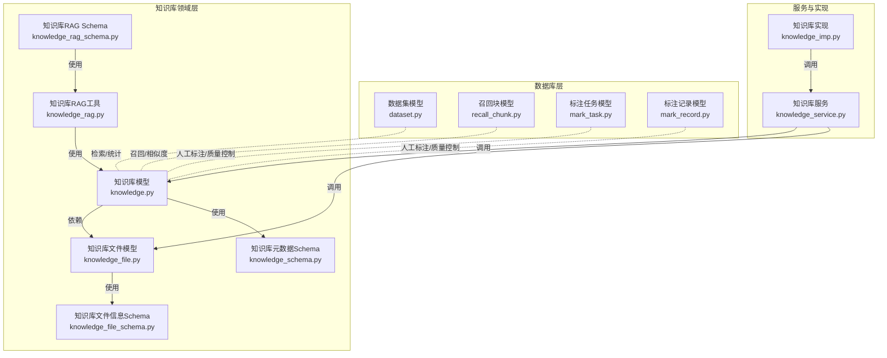
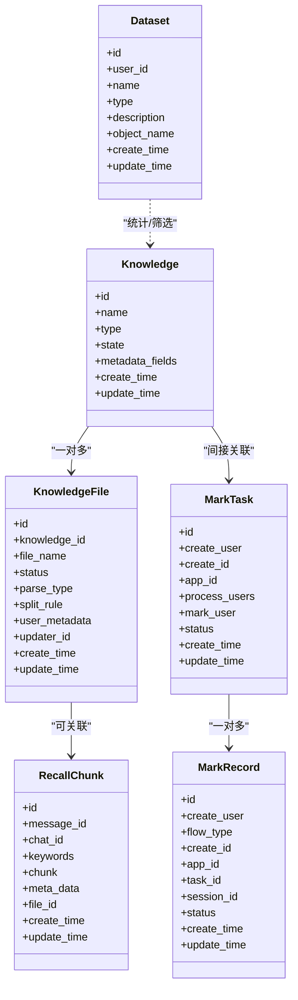
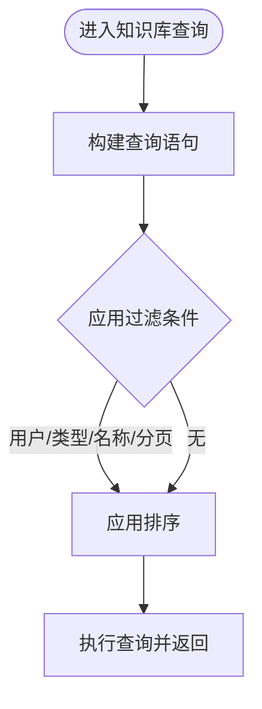
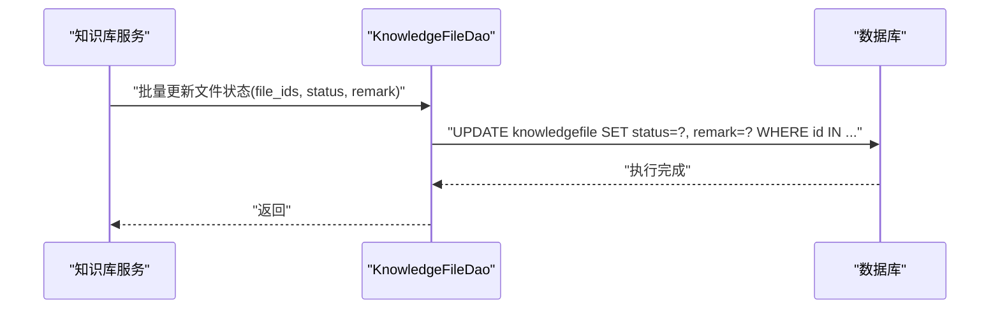
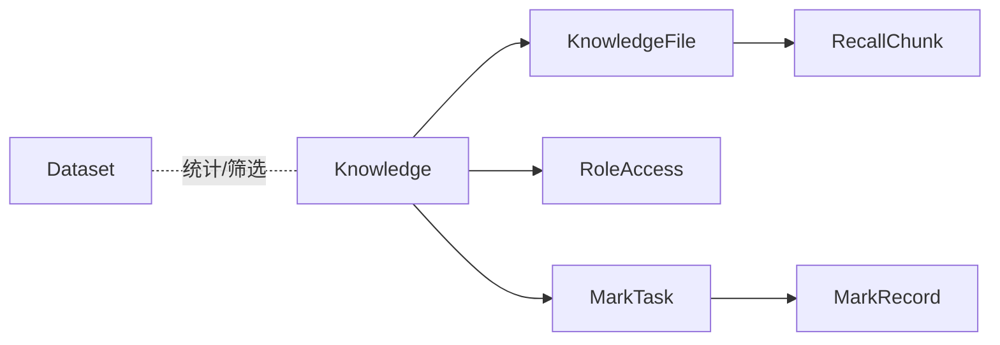

# 知识库数据模型

<cite>
**本文引用的文件**
- [知识库模型（knowledge）](file://src/backend/bisheng/knowledge/domain/models/knowledge.py)
- [知识库文件模型（knowledge_file）](file://src/backend/bisheng/knowledge/domain/models/knowledge_file.py)
- [数据集模型（dataset）](file://src/backend/bisheng/database/models/dataset.py)
- [召回块模型（recall_chunk）](file://src/backend/bisheng/database/models/recall_chunk.py)
- [标注任务模型（mark_task）](file://src/backend/bisheng/database/models/mark_task.py)
- [标注记录模型（mark_record）](file://src/backend/bisheng/database/models/mark_record.py)
- [知识库元数据与文件Schema](file://src/backend/bisheng/knowledge/domain/schemas/knowledge_schema.py)
- [知识库文件信息Schema](file://src/backend/bisheng/knowledge/domain/schemas/knowledge_file_schema.py)
- [知识库领域服务（knowledge_service）](file://src/backend/bisheng/knowledge/domain/services/knowledge_service.py)
- [知识库实现（knowledge_imp）](file://src/backend/bisheng/api/services/knowledge_imp.py)
- [知识库RAG工具（knowledge_rag）](file://src/backend/bisheng/knowledge/domain/knowledge_rag.py)
- [知识库RAG Schema](file://src/backend/bisheng/knowledge/domain/schemas/knowledge_rag_schema.py)
- [脚本：知识库数据转换（knowledge_data_convert.py）](file://src/backend/bisheng/script/knowledge_data_convert.py)
</cite>

## 目录
1. [引言](#引言)
2. [项目结构](#项目结构)
3. [核心组件](#核心组件)
4. [架构总览](#架构总览)
5. [详细组件分析](#详细组件分析)
6. [依赖关系分析](#依赖关系分析)
7. [性能考虑](#性能考虑)
8. [故障排查指南](#故障排查指南)
9. [结论](#结论)
10. [附录](#附录)

## 引言
本文件系统性梳理 Bisheng 知识库相关数据模型，覆盖知识库主模型、知识库文件模型、数据集模型、召回块模型以及标注任务与标注记录模型，并解释它们之间的数据流转与同步机制。同时给出最佳实践与性能优化建议，帮助开发者在构建与维护知识库能力时具备清晰的数据层认知。

## 项目结构
知识库数据模型主要分布在以下位置：
- 领域模型与DAO：位于知识库领域层，包含知识库、知识库文件、元数据与文件Schema等
- 数据库模型：位于数据库层，包含数据集、召回块等通用模型
- 标注模型：位于数据库层，包含标注任务与标注记录
- 服务与实现：位于知识库服务层与API实现层，负责业务编排与持久化
- RAG工具与Schema：用于检索增强生成场景下的数据组织与查询

图表来源
- [知识库模型（knowledge）](file://src/backend/bisheng/knowledge/domain/models/knowledge.py#L1-L532)
- [知识库文件模型（knowledge_file）](file://src/backend/bisheng/knowledge/domain/models/knowledge_file.py#L1-L590)
- [数据集模型（dataset）](file://src/backend/bisheng/database/models/dataset.py#L1-L92)
- [召回块模型（recall_chunk）](file://src/backend/bisheng/database/models/recall_chunk.py#L1-L39)
- [标注任务模型（mark_task）](file://src/backend/bisheng/database/models/mark_task.py#L1-L134)
- [标注记录模型（mark_record）](file://src/backend/bisheng/database/models/mark_record.py#L1-L112)
- [知识库元数据与文件Schema](file://src/backend/bisheng/knowledge/domain/schemas/knowledge_schema.py#L1-L83)
- [知识库文件信息Schema](file://src/backend/bisheng/knowledge/domain/schemas/knowledge_file_schema.py#L1-L22)
- [知识库领域服务（knowledge_service）](file://src/backend/bisheng/knowledge/domain/services/knowledge_service.py)
- [知识库实现（knowledge_imp）](file://src/backend/bisheng/api/services/knowledge_imp.py)
- [知识库RAG工具（knowledge_rag）](file://src/backend/bisheng/knowledge/domain/knowledge_rag.py)
- [知识库RAG Schema](file://src/backend/bisheng/knowledge/domain/schemas/knowledge_rag_schema.py)

章节来源
- [知识库模型（knowledge）](file://src/backend/bisheng/knowledge/domain/models/knowledge.py#L1-L532)
- [知识库文件模型（knowledge_file）](file://src/backend/bisheng/knowledge/domain/models/knowledge_file.py#L1-L590)
- [数据集模型（dataset）](file://src/backend/bisheng/database/models/dataset.py#L1-L92)
- [召回块模型（recall_chunk）](file://src/backend/bisheng/database/models/recall_chunk.py#L1-L39)
- [标注任务模型（mark_task）](file://src/backend/bisheng/database/models/mark_task.py#L1-L134)
- [标注记录模型（mark_record）](file://src/backend/bisheng/database/models/mark_record.py#L1-L112)
- [知识库元数据与文件Schema](file://src/backend/bisheng/knowledge/domain/schemas/knowledge_schema.py#L1-L83)
- [知识库文件信息Schema](file://src/backend/bisheng/knowledge/domain/schemas/knowledge_file_schema.py#L1-L22)
- [知识库领域服务（knowledge_service）](file://src/backend/bisheng/knowledge/domain/services/knowledge_service.py)
- [知识库实现（knowledge_imp）](file://src/backend/bisheng/api/services/knowledge_imp.py)
- [知识库RAG工具（knowledge_rag）](file://src/backend/bisheng/knowledge/domain/knowledge_rag.py)
- [知识库RAG Schema](file://src/backend/bisheng/knowledge/domain/schemas/knowledge_rag_schema.py)

## 核心组件
- 知识库主模型（knowledge）
  - 负责知识库的基本属性、状态管理、元数据字段配置、权限控制与分页查询
  - 支持异步/同步更新状态、按用户过滤、按名称/描述/文件名模糊匹配、统计计数等
- 知识库文件模型（knowledge_file）
  - 负责单个文件的解析状态、解析类型、切分规则、用户自定义元数据、更新人信息等
  - 提供批量状态更新、重复文件检测、基于元数据字段的过滤、QA条目管理等
- 数据集模型（dataset）
  - 负责数据集的基础信息（名称、描述、对象名等），提供按ID列表、关键词过滤、分页查询与统计
- 召回块模型（recall_chunk）
  - 存储消息级召回块文本、关键词、元数据、文件ID等，支撑检索与相似度计算
- 标注任务与标注记录（mark_task / mark_record）
  - 标注任务模型定义任务状态枚举与查询接口；标注记录模型记录标注会话、状态与统计
- 知识库RAG工具与Schema
  - 提供检索增强生成场景下的数据组织、查询与结果封装

章节来源
- [知识库模型（knowledge）](file://src/backend/bisheng/knowledge/domain/models/knowledge.py#L18-L76)
- [知识库文件模型（knowledge_file）](file://src/backend/bisheng/knowledge/domain/models/knowledge_file.py#L16-L114)
- [数据集模型（dataset）](file://src/backend/bisheng/database/models/dataset.py#L11-L38)
- [召回块模型（recall_chunk）](file://src/backend/bisheng/database/models/recall_chunk.py#L10-L39)
- [标注任务模型（mark_task）](file://src/backend/bisheng/database/models/mark_task.py#L13-L34)
- [标注记录模型（mark_record）](file://src/backend/bisheng/database/models/mark_record.py#L13-L35)
- [知识库RAG工具（knowledge_rag）](file://src/backend/bisheng/knowledge/domain/knowledge_rag.py)
- [知识库RAG Schema](file://src/backend/bisheng/knowledge/domain/schemas/knowledge_rag_schema.py)

## 架构总览
知识库数据模型围绕“知识库-文件-元数据-标注-RAG”形成闭环：
- 知识库主模型承载知识库维度的元数据与状态
- 知识库文件模型承载文件维度的状态与用户元数据
- 数据集模型提供数据集层面的统计与筛选
- 召回块模型支撑检索与相似度计算
- 标注任务与标注记录保障人工标注流程与质量控制
- RAG工具与Schema将上述模型整合到检索增强生成流程中

图表来源
- [知识库模型（knowledge）](file://src/backend/bisheng/knowledge/domain/models/knowledge.py#L74-L76)
- [知识库文件模型（knowledge_file）](file://src/backend/bisheng/knowledge/domain/models/knowledge_file.py#L106-L114)
- [数据集模型（dataset）](file://src/backend/bisheng/database/models/dataset.py#L23-L24)
- [召回块模型（recall_chunk）](file://src/backend/bisheng/database/models/recall_chunk.py#L23-L24)
- [标注任务模型（mark_task）](file://src/backend/bisheng/database/models/mark_task.py#L32-L33)
- [标注记录模型（mark_record）](file://src/backend/bisheng/database/models/mark_record.py#L33-L34)

## 详细组件分析

### 知识库主模型（knowledge）
- 设计要点
  - 状态枚举：未发布、已发布、复制中、重建中、失败
  - 类型枚举：普通知识库、问答知识库、私有知识库
  - 元数据字段：JSON结构，支持字符串/数字/时间三类字段类型，字段名校验规则
  - 权限控制：通过用户名与角色访问控制（RoleAccess）结合用户角色判断是否可见
  - 查询与统计：支持按用户、类型、名称/描述/文件名模糊匹配、分页排序、总数统计
  - 状态更新：支持同步/异步更新状态与更新时间
- 关键方法与职责
  - 用户知识库查询、总数统计、权限判定、按条件过滤、删除与清空
  - 异步/同步DAO方法，确保高并发下的状态一致性
- 复杂度与性能
  - 过滤与排序涉及多条件组合，建议对常用过滤字段建立索引
  - 模糊匹配可能影响性能，建议配合分页与缓存策略

图表来源
- [知识库模型（knowledge）](file://src/backend/bisheng/knowledge/domain/models/knowledge.py#L182-L220)
- [知识库模型（knowledge）](file://src/backend/bisheng/knowledge/domain/models/knowledge.py#L222-L264)

章节来源
- [知识库模型（knowledge）](file://src/backend/bisheng/knowledge/domain/models/knowledge.py#L18-L76)
- [知识库模型（knowledge）](file://src/backend/bisheng/knowledge/domain/models/knowledge.py#L296-L371)
- [知识库模型（knowledge）](file://src/backend/bisheng/knowledge/domain/models/knowledge.py#L374-L481)

### 知识库文件模型（knowledge_file）
- 设计要点
  - 文件解析状态：处理中、成功、失败、重建中、等待、超时
  - 解析类型：本地解析、UNS服务解析、ETL4LM解析等
  - 切分规则：JSON或Text存储，支持复杂结构
  - 用户元数据：JSON结构，支持动态扩展
  - 更新人信息：记录最后更新者ID与姓名
- 关键方法与职责
  - 批量状态更新、重复文件检测、按条件筛选、统计计数、元数据字段过滤
  - QA条目管理：插入、批量插入、状态批量更新、按知识库ID统计
- 复杂度与性能
  - 元数据字段过滤采用原生SQL拼接，注意参数绑定与SQL注入防护
  - 常用查询建议建立复合索引（knowledge_id + status）

图表来源
- [知识库文件模型（knowledge_file）](file://src/backend/bisheng/knowledge/domain/models/knowledge_file.py#L327-L353)

章节来源
- [知识库文件模型（knowledge_file）](file://src/backend/bisheng/knowledge/domain/models/knowledge_file.py#L16-L114)
- [知识库文件模型（knowledge_file）](file://src/backend/bisheng/knowledge/domain/models/knowledge_file.py#L130-L186)
- [知识库文件模型（knowledge_file）](file://src/backend/bisheng/knowledge/domain/models/knowledge_file.py#L244-L317)
- [知识库文件模型（knowledge_file）](file://src/backend/bisheng/knowledge/domain/models/knowledge_file.py#L355-L411)
- [知识库文件模型（knowledge_file）](file://src/backend/bisheng/knowledge/domain/models/knowledge_file.py#L431-L589)

### 数据集模型（dataset）
- 设计要点
  - 基础字段：创建者ID、名称、类型、描述、对象名等
  - 查询与统计：按ID列表、关键词过滤、分页排序、总数统计
- 使用场景
  - 作为检索/统计的外部数据集来源，与知识库模型协同进行数据筛选与聚合

章节来源
- [数据集模型（dataset）](file://src/backend/bisheng/database/models/dataset.py#L11-L38)
- [数据集模型（dataset）](file://src/backend/bisheng/database/models/dataset.py#L40-L92)

### 召回块模型（recall_chunk）
- 设计要点
  - 存储消息级召回块文本、关键词、元数据、文件ID等
  - 支持按ID与服务端查询，便于检索与相似度计算
- 使用场景
  - 与向量库/关键词检索结合，支撑RAG流程中的召回阶段

章节来源
- [召回块模型（recall_chunk）](file://src/backend/bisheng/database/models/recall_chunk.py#L10-L39)

### 标注任务与标注记录（mark_task / mark_record）
- 设计要点
  - 标注任务：创建人、创建ID、应用ID、处理人员集合、标注人、状态枚举、时间戳
  - 标注记录：创建人、流程类型、创建ID、应用ID、任务ID、会话ID、状态枚举、时间戳
  - 支持按任务ID查询、按会话过滤、统计与删除
- 使用场景
  - 人工标注流程与质量控制，支持任务分配、进度跟踪与统计

章节来源
- [标注任务模型（mark_task）](file://src/backend/bisheng/database/models/mark_task.py#L13-L34)
- [标注任务模型（mark_task）](file://src/backend/bisheng/database/models/mark_task.py#L41-L133)
- [标注记录模型（mark_record）](file://src/backend/bisheng/database/models/mark_record.py#L13-L35)
- [标注记录模型（mark_record）](file://src/backend/bisheng/database/models/mark_record.py#L37-L111)

### 知识库元数据与文件Schema
- 设计要点
  - 元数据字段：字段名、字段类型、更新时间戳，字段名需满足正则约束
  - 文件用户元数据：字段名、字段值、更新时间戳
  - 请求体：新增/更新元数据字段、修改文件元数据
- 使用场景
  - 动态扩展知识库文件的元数据维度，支撑高级筛选与统计

章节来源
- [知识库元数据与文件Schema](file://src/backend/bisheng/knowledge/domain/schemas/knowledge_schema.py#L18-L83)
- [知识库文件信息Schema](file://src/backend/bisheng/knowledge/domain/schemas/knowledge_file_schema.py#L8-L22)

### 知识库RAG工具与Schema
- 设计要点
  - RAG工具：封装检索增强生成场景下的数据组织与查询
  - RAG Schema：定义RAG流程中的输入输出结构
- 使用场景
  - 将知识库与召回块模型整合到RAG流程中，提升检索质量与稳定性

章节来源
- [知识库RAG工具（knowledge_rag）](file://src/backend/bisheng/knowledge/domain/knowledge_rag.py)
- [知识库RAG Schema](file://src/backend/bisheng/knowledge/domain/schemas/knowledge_rag_schema.py)

## 依赖关系分析
- 组件耦合
  - 知识库主模型依赖知识库文件DAO以支持按文件名联动过滤与统计
  - 标注任务与标注记录通过任务ID与会话ID与知识库/文件产生弱耦合
  - 数据集模型与知识库模型在统计与筛选层面存在协作关系
- 外部依赖
  - 数据库连接管理、SQLModel ORM、枚举与JSON字段
  - 角色访问控制（RoleAccess）与用户/角色DAO用于权限判定

图表来源
- [知识库模型（knowledge）](file://src/backend/bisheng/knowledge/domain/models/knowledge.py#L12-L16)
- [知识库文件模型（knowledge_file）](file://src/backend/bisheng/knowledge/domain/models/knowledge_file.py#L1-L14)
- [召回块模型（recall_chunk）](file://src/backend/bisheng/database/models/recall_chunk.py#L10-L16)
- [标注任务模型（mark_task）](file://src/backend/bisheng/database/models/mark_task.py#L19-L25)
- [标注记录模型（mark_record）](file://src/backend/bisheng/database/models/mark_record.py#L19-L26)
- [数据集模型（dataset）](file://src/backend/bisheng/database/models/dataset.py#L11-L16)

## 性能考虑
- 索引设计
  - 常用过滤字段（如 user_id、name、knowledge_id、status、file_name）建议建立索引
  - 复合索引可用于高频查询（如 knowledge_id + status）
- 查询优化
  - 分页查询必须配合排序字段，避免全表扫描
  - 模糊匹配应限制范围与长度，必要时引入缓存
- 写入优化
  - 批量状态更新优先使用批量UPDATE，减少事务次数
  - 元数据字段过滤使用参数化SQL，避免拼接导致的性能与安全问题
- 异步化
  - 对于耗时的状态更新与统计，优先使用异步DAO方法
- 缓存策略
  - 对热点知识库与文件列表增加缓存层，降低数据库压力

## 故障排查指南
- 知识库权限异常
  - 确认用户角色与角色访问控制配置是否正确
  - 检查管理员角色标识与权限判定逻辑
- 文件状态不一致
  - 核对批量状态更新是否成功提交
  - 检查解析类型与状态枚举映射
- 标注任务/记录异常
  - 核对任务ID与会话ID的对应关系
  - 检查状态枚举与过滤条件
- 元数据字段校验失败
  - 字段名需满足正则约束，检查新增/更新请求体

章节来源
- [知识库模型（knowledge）](file://src/backend/bisheng/knowledge/domain/models/knowledge.py#L296-L371)
- [知识库文件模型（knowledge_file）](file://src/backend/bisheng/knowledge/domain/models/knowledge_file.py#L327-L353)
- [标注任务模型（mark_task）](file://src/backend/bisheng/database/models/mark_task.py#L105-L133)
- [标注记录模型（mark_record）](file://src/backend/bisheng/database/models/mark_record.py#L100-L111)
- [知识库元数据与文件Schema](file://src/backend/bisheng/knowledge/domain/schemas/knowledge_schema.py#L25-L33)

## 结论
Bisheng 知识库数据模型以“知识库-文件-元数据-标注-RAG”为核心，通过明确的状态枚举、权限控制与查询接口，实现了从数据入库到检索增强的完整链路。建议在生产环境中强化索引与缓存策略，规范元数据字段命名与校验，完善标注流程的质量控制，以获得更稳定与高性能的知识库能力。

## 附录
- 数据操作最佳实践
  - 新增/更新知识库与文件时，确保元数据字段符合类型与命名规范
  - 批量更新状态前先做幂等校验，避免重复提交
  - 对高频查询结果进行缓存，减少数据库压力
  - 在RAG流程中，结合召回块与向量库进行多路召回与重排
- 同步机制说明
  - 知识库状态更新与文件状态更新通过DAO层统一提交，保证事务一致性
  - 标注任务与记录通过任务ID与会话ID进行弱关联，便于统计与追踪
  - 数据集模型与知识库模型在统计与筛选层面协同，支持跨模型聚合

章节来源
- [知识库实现（knowledge_imp）](file://src/backend/bisheng/api/services/knowledge_imp.py)
- [知识库领域服务（knowledge_service）](file://src/backend/bisheng/knowledge/domain/services/knowledge_service.py)
- [脚本：知识库数据转换（knowledge_data_convert.py）](file://src/backend/bisheng/script/knowledge_data_convert.py)