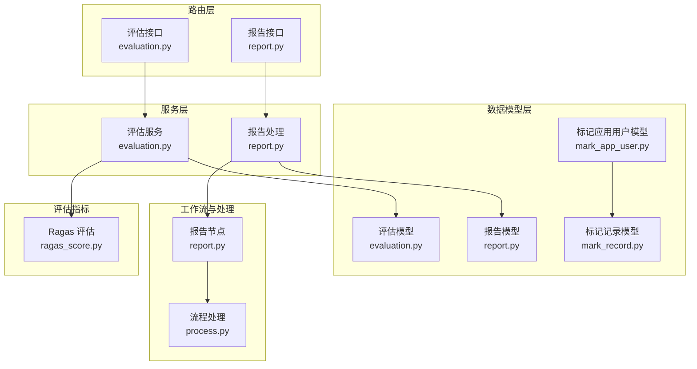
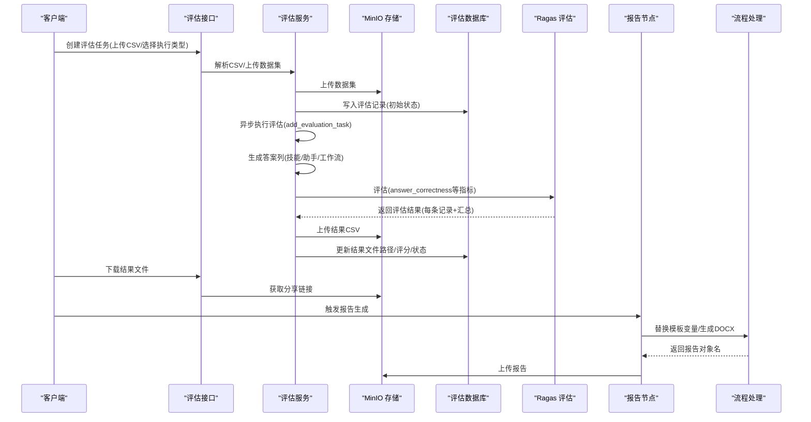
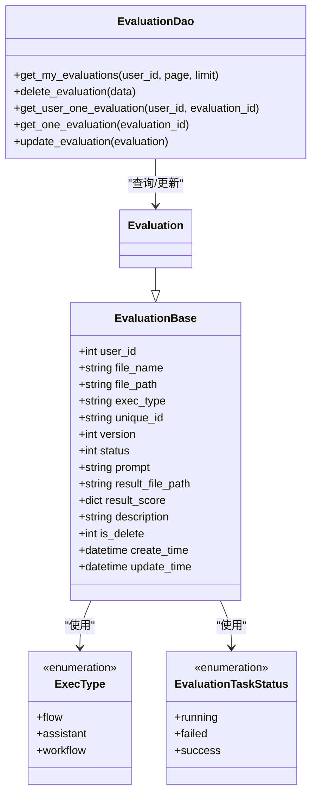
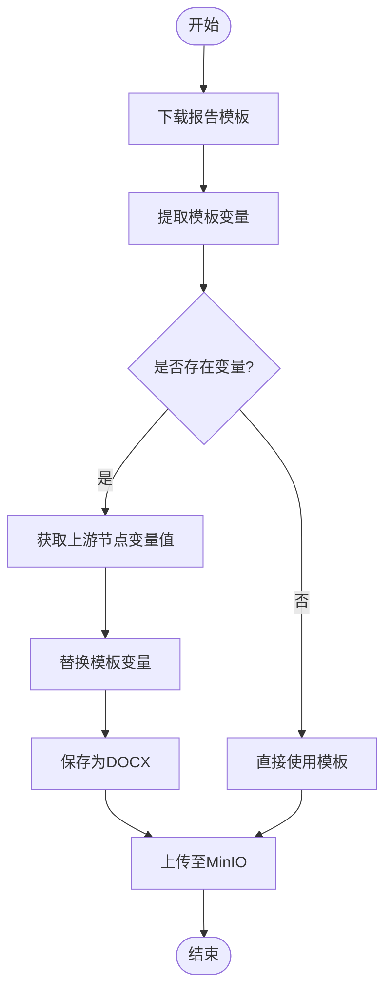
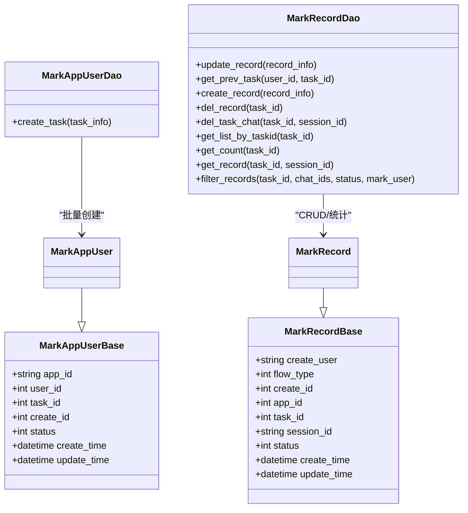
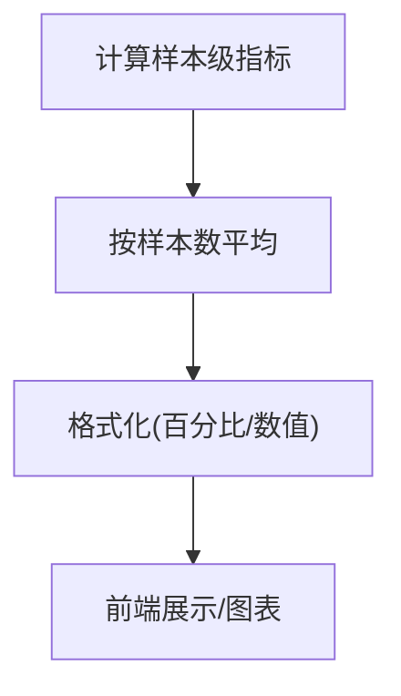
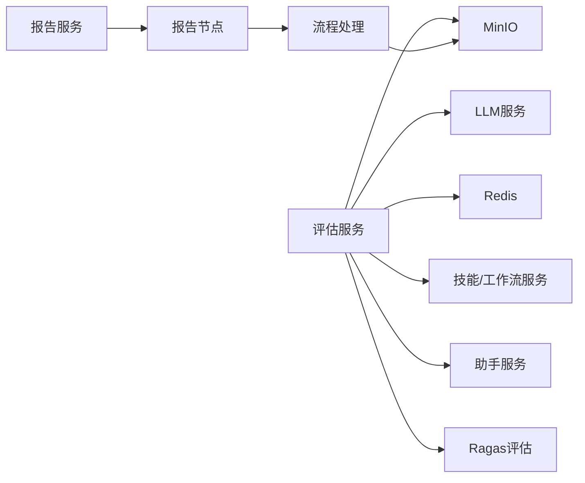

# 评估报告数据模型

<cite>
**本文档引用的文件**
- [evaluation.py](file://src/backend/bisheng/api/v1/evaluation.py)
- [report.py](file://src/backend/bisheng/api/v1/report.py)
- [evaluation.py](file://src/backend/bisheng/api/services/evaluation.py)
- [evaluation.py](file://src/backend/bisheng/database/models/evaluation.py)
- [report.py](file://src/backend/bisheng/database/models/report.py)
- [mark_app_user.py](file://src/backend/bisheng/database/models/mark_app_user.py)
- [mark_record.py](file://src/backend/bisheng/database/models/mark_record.py)
- [report.py](file://src/backend/bisheng/workflow/nodes/report/report.py)
- [process.py](file://src/backend/bisheng/processing/process.py)
- [ragas_score.py](file://src/backend/bisheng_langchain/rag/scoring/ragas_score.py)
- [index.tsx](file://src/frontend/platform/src/pages/EvaluationPage/index.tsx)
- [types.ts](file://src/frontend/platform/src/pages/EvaluationPage/types.ts)
</cite>

## 目录
1. [引言](#引言)
2. [项目结构](#项目结构)
3. [核心组件](#核心组件)
4. [架构总览](#架构总览)
5. [详细组件分析](#详细组件分析)
6. [依赖关系分析](#依赖关系分析)
7. [性能考虑](#性能考虑)
8. [故障排查指南](#故障排查指南)
9. [结论](#结论)
10. [附录](#附录)

## 引言
本技术文档围绕 Bisheng 的评估报告数据模型展开，系统性阐述评估模型（evaluation）、报告模型（report）与标记应用用户模型（mark_app_user）的设计与实现，覆盖评估指标与评分标准、结果记录、报告生成策略与数据格式、标记应用用户反馈收集与应用效果追踪、统计分析与可视化支持、配置指南与数据质量保障措施，并为数据分析师提供评估数据挖掘与趋势分析的实用建议。

## 项目结构
后端采用 FastAPI 路由层与服务层分离设计：
- 路由层：负责 HTTP 接口定义与参数校验
- 服务层：封装业务逻辑，包括评估任务执行、报告生成回调、存储上传等
- 数据模型层：基于 SQLModel 定义实体与 DAO 查询方法
- 前端展示层：提供评估任务列表、状态与结果展示、下载链接等

图表来源
- [evaluation.py](file://src/backend/bisheng/api/v1/evaluation.py#L1-L104)
- [report.py](file://src/backend/bisheng/api/v1/report.py#L1-L80)
- [evaluation.py](file://src/backend/bisheng/api/services/evaluation.py#L1-L426)
- [evaluation.py](file://src/backend/bisheng/database/models/evaluation.py#L1-L98)
- [report.py](file://src/backend/bisheng/database/models/report.py#L1-L42)
- [mark_app_user.py](file://src/backend/bisheng/database/models/mark_app_user.py#L1-L36)
- [mark_record.py](file://src/backend/bisheng/database/models/mark_record.py#L1-L112)
- [report.py](file://src/backend/bisheng/workflow/nodes/report/report.py#L26-L52)
- [process.py](file://src/backend/bisheng/processing/process.py#L207-L230)
- [ragas_score.py](file://src/backend/bisheng_langchain/rag/scoring/ragas_score.py#L130-L144)

章节来源
- [evaluation.py](file://src/backend/bisheng/api/v1/evaluation.py#L1-L104)
- [report.py](file://src/backend/bisheng/api/v1/report.py#L1-L80)

## 核心组件
- 评估模型（Evaluation）
  - 字段：用户ID、文件名与路径、执行类型（技能/助手/工作流）、唯一标识、版本、状态、提示词、结果文件路径、最终评分、错误描述、软删除标志、时间戳
  - 枚举：执行类型（ExecType）、任务状态（EvaluationTaskStatus）
  - DAO：分页查询、按用户过滤、按ID查询、更新、逻辑删除
- 报告模型（Report）
  - 字段：技能ID、报告文件名、模板名、版本键（前端模板唯一键）、新版本键、对象名（MinIO 对象名）、删除状态、时间戳
  - 提供回调接口接收 Office 生成的报告并持久化
- 标记应用用户模型（MarkAppUser）
  - 字段：应用ID、用户ID、任务ID、创建者ID、状态、时间戳
  - DAO：批量创建任务
- 标记记录模型（MarkRecord）
  - 字段：创建用户、流程类型、创建者ID、应用ID、任务ID、会话ID、状态、时间戳
  - DAO：按任务查询、统计标注人数、按条件过滤、删除任务聊天记录等

章节来源
- [evaluation.py](file://src/backend/bisheng/database/models/evaluation.py#L12-L98)
- [report.py](file://src/backend/bisheng/database/models/report.py#L10-L42)
- [mark_app_user.py](file://src/backend/bisheng/database/models/mark_app_user.py#L12-L36)
- [mark_record.py](file://src/backend/bisheng/database/models/mark_record.py#L13-L112)

## 架构总览
评估与报告的端到端流程如下：
- 评估任务创建：上传 CSV 数据集，选择执行类型（技能/助手/工作流），提交后异步执行
- 执行阶段：根据执行类型调用对应服务，生成答案列；结合人类提示词与 LLM 进行 Ragas 评估
- 结果记录：计算汇总指标（召回、精确率、F1），生成 CSV 结果并上传 MinIO，更新评估记录
- 报告生成：通过报告节点读取模板变量，替换生成最终 DOCX，回调接口接收 Office 生成的报告并持久化

图表来源
- [evaluation.py](file://src/backend/bisheng/api/v1/evaluation.py#L28-L77)
- [evaluation.py](file://src/backend/bisheng/api/services/evaluation.py#L303-L425)
- [ragas_score.py](file://src/backend/bisheng_langchain/rag/scoring/ragas_score.py#L130-L144)
- [report.py](file://src/backend/bisheng/workflow/nodes/report/report.py#L26-L52)
- [process.py](file://src/backend/bisheng/processing/process.py#L207-L230)

## 详细组件分析

### 评估模型（Evaluation）设计
- 评估指标与评分标准
  - 指标：召回（answer_recall）、精确率（answer_precision）、F1（answer_f1）
  - 计算方式：对每条样本计算指标，汇总时按样本数平均（百分比格式）
  - 评分字段：result_score 以 JSON 形式存储，包含上述指标的汇总值
- 评分记录与结果文件
  - 结果文件：生成 CSV 并上传 MinIO，记录文件路径
  - 状态流转：running → success 或 failed，失败时记录简要错误描述
- 执行类型与版本
  - 支持三种执行类型：技能（flow）、助手（assistant）、工作流（workflow）
  - 版本字段用于关联具体技能/工作流版本，便于结果回溯

图表来源
- [evaluation.py](file://src/backend/bisheng/database/models/evaluation.py#L24-L98)

章节来源
- [evaluation.py](file://src/backend/bisheng/database/models/evaluation.py#L12-L98)
- [evaluation.py](file://src/backend/bisheng/api/services/evaluation.py#L373-L418)

### 报告模型（Report）结构与生成策略
- 报告类型与生成策略
  - 报告类型：基于模板的 DOCX 报告
  - 生成策略：从 MinIO 下载模板，提取变量，从上游节点获取变量值，替换后生成最终 DOCX
  - 版本管理：支持版本键与新版本键，便于前端模板迭代与回滚
- 数据格式与存储
  - 模板与对象名：template_name、object_name 分别记录模板与生成报告的对象名
  - 回调机制：Office 生成完成后回调后端，写入对象名并更新版本键
- 生成流程
  - 节点执行：报告节点解析模板变量，分类文本，替换并保存
  - 流程处理：将生成的报告上传至 MinIO，返回分享链接供前端下载

图表来源
- [report.py](file://src/backend/bisheng/workflow/nodes/report/report.py#L26-L52)
- [process.py](file://src/backend/bisheng/processing/process.py#L207-L230)

章节来源
- [report.py](file://src/backend/bisheng/database/models/report.py#L10-L42)
- [report.py](file://src/backend/bisheng/api/v1/report.py#L18-L79)
- [report.py](file://src/backend/bisheng/workflow/nodes/report/report.py#L26-L52)
- [process.py](file://src/backend/bisheng/processing/process.py#L207-L230)

### 标记应用用户模型（MarkAppUser）设计
- 用户反馈收集与应用效果追踪
  - 标记应用用户：记录应用ID、用户ID、任务ID、创建者ID、状态、时间戳
  - 标记记录：记录会话ID、状态、创建用户、流程类型等，支持按任务统计标注人数与按条件过滤
  - 批量创建：支持一次性创建多个标记任务，便于大规模标注场景
- 应用效果追踪
  - 通过 MarkRecord 统计每个任务的标注分布与完成情况
  - 可结合前端筛选器按状态、标注人等维度进行效果分析

图表来源
- [mark_app_user.py](file://src/backend/bisheng/database/models/mark_app_user.py#L12-L36)
- [mark_record.py](file://src/backend/bisheng/database/models/mark_record.py#L19-L112)

章节来源
- [mark_app_user.py](file://src/backend/bisheng/database/models/mark_app_user.py#L12-L36)
- [mark_record.py](file://src/backend/bisheng/database/models/mark_record.py#L19-L112)

### 评估数据的统计分析与可视化支持
- 指标汇总与展示
  - 后端计算每条样本的召回、精确率、F1，并按样本数平均得到汇总值
  - 前端展示时按指标标签映射显示，支持百分比格式
- 可视化支持
  - 前端仪表盘组件支持除法类指标的百分比格式化
  - 可扩展图表组件以支持趋势分析与对比分析

图表来源
- [evaluation.py](file://src/backend/bisheng/api/services/evaluation.py#L390-L408)
- [index.tsx](file://src/frontend/platform/src/pages/EvaluationPage/index.tsx#L183-L212)
- [types.ts](file://src/frontend/platform/src/pages/EvaluationPage/types.ts#L21-L37)

章节来源
- [evaluation.py](file://src/backend/bisheng/api/services/evaluation.py#L390-L408)
- [index.tsx](file://src/frontend/platform/src/pages/EvaluationPage/index.tsx#L183-L212)
- [types.ts](file://src/frontend/platform/src/pages/EvaluationPage/types.ts#L21-L37)

## 依赖关系分析
- 评估服务依赖
  - LLM 服务：获取评估用 LLM 对象
  - MinIO：上传/下载 CSV 与结果文件
  - Redis：进度缓存
  - 技能/助手/工作流服务：执行输入问题并获取答案
  - Ragas：执行评估并生成指标
- 报告生成依赖
  - 报告节点：解析模板变量并生成 DOCX
  - 流程处理：将生成的报告上传至 MinIO 并返回分享链接

图表来源
- [evaluation.py](file://src/backend/bisheng/api/services/evaluation.py#L303-L425)
- [report.py](file://src/backend/bisheng/workflow/nodes/report/report.py#L26-L52)
- [process.py](file://src/backend/bisheng/processing/process.py#L207-L230)

章节来源
- [evaluation.py](file://src/backend/bisheng/api/services/evaluation.py#L303-L425)
- [report.py](file://src/backend/bisheng/workflow/nodes/report/report.py#L26-L52)
- [process.py](file://src/backend/bisheng/processing/process.py#L207-L230)

## 性能考虑
- 异步执行与后台任务
  - 评估任务通过后台任务队列执行，避免阻塞请求线程
- 进度上报
  - 使用 Redis 缓存当前任务进度，前端轮询或 WebSocket 实时展示
- 文件上传与下载
  - CSV/结果文件与报告均通过 MinIO 上传/下载，注意网络带宽与并发控制
- 指标计算
  - 使用 Pandas/NumPy 进行向量化计算，减少 Python 循环开销
- 缓存与复用
  - 用户名缓存、Redis 进度缓存、MinIO 对象缓存可提升整体性能

## 故障排查指南
- 评估任务失败
  - 查看评估记录中的错误描述字段，定位具体异常
  - 检查 MinIO 是否可用、Redis 连接是否正常
  - 确认执行类型对应的上游服务是否可用（技能/助手/工作流）
- 报告生成失败
  - 检查模板变量是否正确提取与替换
  - 确认 Office 回调地址可达且签名有效
- 数据质量问题
  - CSV 必须包含 question 与 ground_truth 列，且至少两列
  - 上传编码需兼容 UTF-8，必要时进行转码

章节来源
- [evaluation.py](file://src/backend/bisheng/api/services/evaluation.py#L420-L425)
- [evaluation.py](file://src/backend/bisheng/api/v1/evaluation.py#L18-L77)
- [report.py](file://src/backend/bisheng/api/v1/report.py#L18-L47)

## 结论
本评估报告数据模型以清晰的实体与服务边界实现了从数据集上传、评估执行、结果记录到报告生成的完整闭环。通过标准化的评估指标与版本化报告管理，既满足了结果可追溯性，也为后续的数据分析与可视化提供了坚实基础。标记应用用户模型进一步完善了用户反馈与应用效果追踪能力，有助于持续优化评估体系。

## 附录

### 评估系统的配置指南
- MinIO 配置
  - 确保评估数据集、结果文件与报告对象名的存储桶权限与访问策略正确
- Redis 配置
  - 保证进度缓存键空间合理，避免过期策略导致进度丢失
- LLM 评估模型
  - 评估前确保 LLM 服务可用，提示词（prompt）符合评估目标
- 报告模板
  - 模板变量命名需与上游节点输出一致，避免替换失败

### 数据质量保证措施
- CSV 校验
  - 必须包含 question 与 ground_truth 列，且至少两列
  - 自动去除全空行与全空列，确保数据整洁
- 错误限制
  - 失败时错误描述截断至 500 字符，避免超长日志
- 版本控制
  - 评估记录与报告均支持版本键，便于回溯与对比

### 数据分析与趋势分析建议
- 指标对比
  - 按执行类型（技能/助手/工作流）对比 F1、召回、精确率变化趋势
- 时间序列分析
  - 将评估结果按创建时间聚合，观察指标随版本演进的趋势
- 标注效果追踪
  - 结合 MarkRecord 的标注统计，分析不同标注人的标注质量与效率
- 可视化建议
  - 使用前端仪表盘组件对关键指标进行百分比格式化展示
  - 支持多维度筛选（执行类型、版本、时间范围）

章节来源
- [evaluation.py](file://src/backend/bisheng/api/services/evaluation.py#L178-L187)
- [evaluation.py](file://src/backend/bisheng/api/services/evaluation.py#L420-L425)
- [types.ts](file://src/frontend/platform/src/pages/EvaluationPage/types.ts#L21-L37)