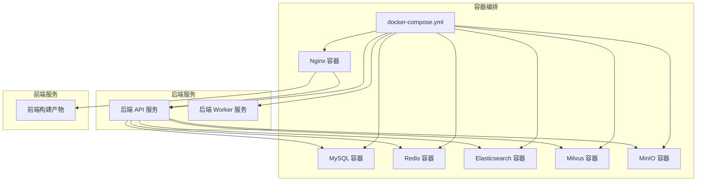
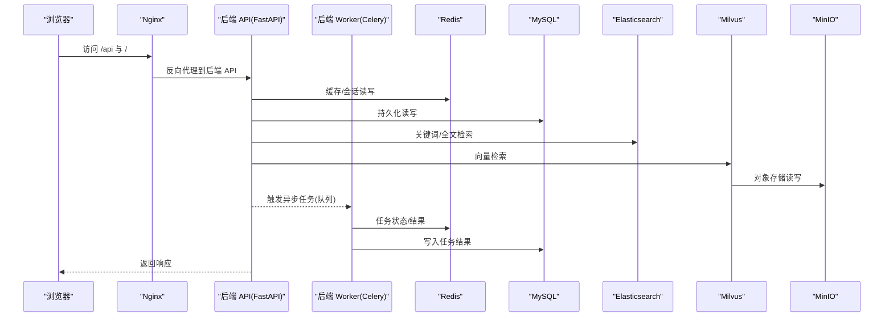
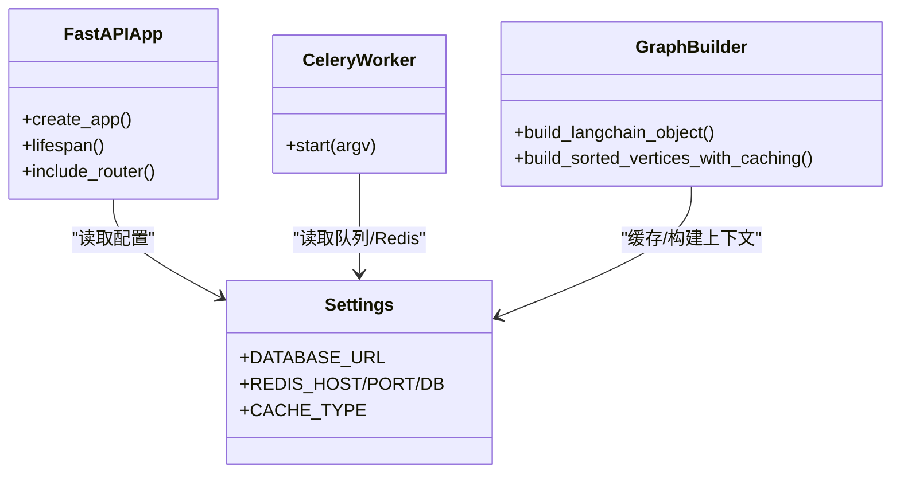
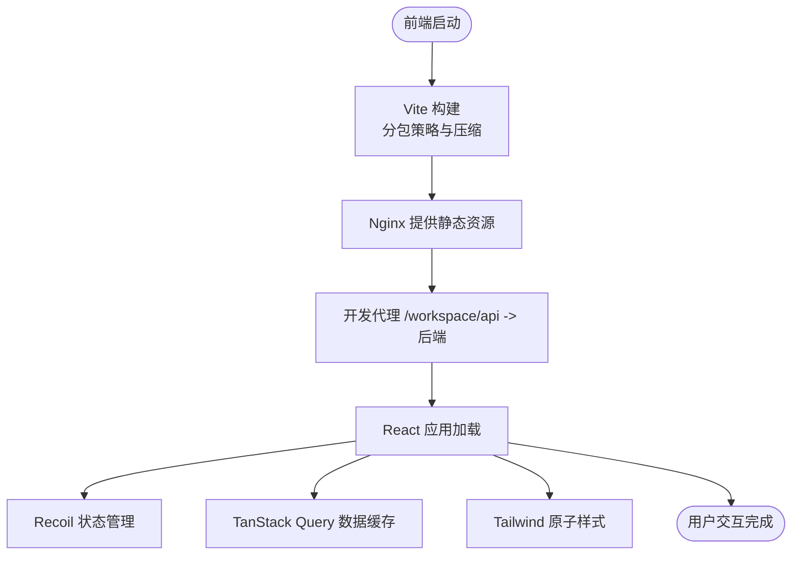
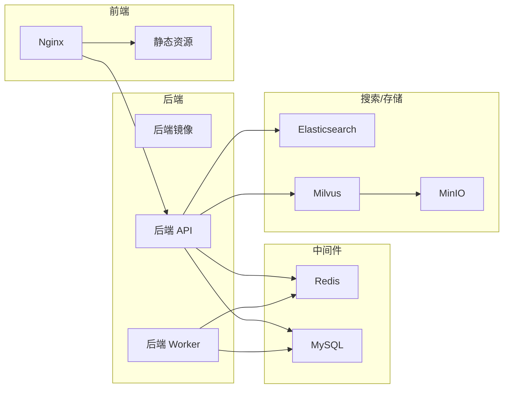
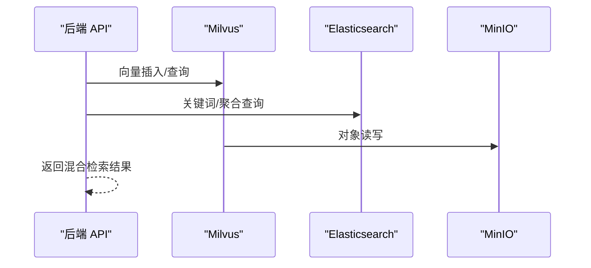
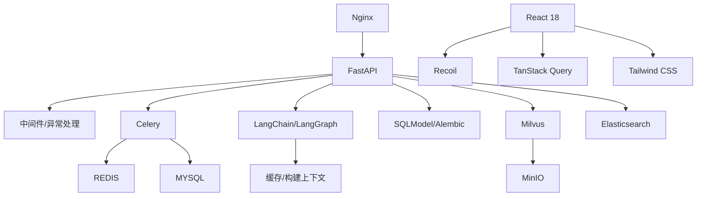

# 技术栈选型

<cite>
**本文引用的文件**   
- [docker-compose.yml](file://docker/docker-compose.yml)
- [Dockerfile（后端）](file://src/backend/Dockerfile)
- [Dockerfile（前端）](file://src/frontend/Dockerfile)
- [nginx.conf（前端）](file://src/frontend/client/nginx.conf)
- [nginx.conf（通用）](file://docker/nginx/nginx.conf)
- [package.json（前端客户端）](file://src/frontend/client/package.json)
- [vite.config.ts（前端客户端）](file://src/frontend/client/vite.config.ts)
- [main.py（后端入口）](file://src/backend/bisheng/main.py)
- [run_celery.py（后端任务）](file://src/backend/bisheng/run_celery.py)
- [settings.py（后端配置）](file://src/backend/bisheng/core/config/settings.py)
- [base.py（后端设置基类）](file://src/backend/bisheng/services/settings/base.py)
- [constants.py（向量存储常量）](file://src/backend/bisheng/interface/vector_store/constants.py)
- [test_es.py（向量存储测试）](file://src/backend/test/test_es.py)
- [langchain_openai.patch（补丁）](file://src/backend/bisheng/patches/langchain_openai.patch)
</cite>

## 目录
1. [引言](#引言)
2. [项目结构](#项目结构)
3. [核心组件](#核心组件)
4. [架构总览](#架构总览)
5. [详细组件分析](#详细组件分析)
6. [依赖关系分析](#依赖关系分析)
7. [性能考虑](#性能考虑)
8. [故障排查指南](#故障排查指南)
9. [结论](#结论)
10. [附录](#附录)

## 引言
本文件面向 Bisheng 平台的技术栈选型与实施策略，系统阐述后端（FastAPI、Celery、LangChain、LangGraph、SQLModel、Redis、MySQL）、前端（React 18、Recoil、TanStack Query、Tailwind CSS）、容器化（Docker、Docker Compose、Nginx）以及第三方服务（Milvus、Elasticsearch、MinIO）的选型理由、应用场景、版本兼容性、性能对比与替代方案评估。文档同时提供代码级架构图与流程图，帮助读者快速理解平台整体实现。

## 项目结构
Bisheng 采用前后端分离与多服务编排的架构：后端基于 FastAPI 提供 API 与异步任务（Celery），前端使用 React 18 配合状态管理与数据缓存工具链，容器层通过 Docker Compose 统一编排 MySQL、Redis、Elasticsearch、Milvus、MinIO 与 Nginx 等基础设施。

图表来源
- [docker-compose.yml](file://docker/docker-compose.yml#L1-L201)

章节来源
- [docker-compose.yml](file://docker/docker-compose.yml#L1-L201)

## 核心组件
- 后端框架与运行时
  - FastAPI：提供高性能异步 API、中间件与异常处理；支持健康检查端点与 CORS。
  - Celery：异步任务队列，承载知识入库、工作流等耗时任务。
  - LangChain/LangGraph：可视化工作流与智能体执行引擎，支持节点图构建与拓扑排序。
  - SQLModel：ORM/ODM 能力，结合 Alembic 进行数据库迁移。
  - Redis：缓存与会话状态存储，支撑高频读取与任务队列。
  - MySQL：持久化存储，配合 FastAPI 初始化与 Alembic 迁移。
- 前端框架与工具链
  - React 18：函数式组件与并发特性，提升交互体验。
  - Recoil：细粒度状态管理，降低全局状态复杂度。
  - TanStack Query（React Query）：服务端状态管理与缓存，统一数据获取与更新策略。
  - Tailwind CSS：原子化样式工具，提升开发效率与一致性。
- 容器化与网关
  - Docker/Docker Compose：镜像构建与服务编排。
  - Nginx：反向代理与静态资源分发，统一入口与路由转发。
- 第三方服务
  - Milvus：向量检索与相似度搜索。
  - Elasticsearch：关键词检索与全文搜索。
  - MinIO：对象存储，作为 Milvus 的底层存储后端。

章节来源
- [main.py（后端入口）](file://src/backend/bisheng/main.py#L64-L102)
- [run_celery.py（后端任务）](file://src/backend/bisheng/run_celery.py#L1-L13)
- [settings.py（后端配置）](file://src/backend/bisheng/core/config/settings.py#L214-L258)
- [base.py（后端设置基类）](file://src/backend/bisheng/services/settings/base.py#L18-L56)
- [constants.py（向量存储常量）](file://src/backend/bisheng/interface/vector_store/constants.py#L1-L6)
- [test_es.py（向量存储测试）](file://src/backend/test/test_es.py#L1-L46)
- [package.json（前端客户端）](file://src/frontend/client/package.json#L22-L114)
- [vite.config.ts（前端客户端）](file://src/frontend/client/vite.config.ts#L17-L312)
- [Dockerfile（后端）](file://src/backend/Dockerfile#L1-L19)
- [Dockerfile（前端）](file://src/frontend/Dockerfile#L1-L12)
- [nginx.conf（前端）](file://src/frontend/client/nginx.conf#L26-L32)
- [nginx.conf（通用）](file://docker/nginx/nginx.conf#L14-L32)

## 架构总览
下图展示从浏览器到后端 API、再到第三方服务的典型调用路径，以及容器编排中的服务依赖关系。

图表来源
- [docker-compose.yml](file://docker/docker-compose.yml#L41-L123)
- [main.py（后端入口）](file://src/backend/bisheng/main.py#L64-L102)
- [run_celery.py（后端任务）](file://src/backend/bisheng/run_celery.py#L1-L13)

## 详细组件分析

### 后端技术栈选型与应用
- FastAPI
  - 选型理由：高性能、自动生成 OpenAPI 文档、类型安全、内置中间件与异常处理。
  - 应用场景：REST API、WebSocket 日志中间件、健康检查端点、CORS 放通。
  - 兼容性：与 ORJSONResponse、CORSMiddleware、WebSocketLoggingMiddleware 协同。
- Celery
  - 选型理由：成熟异步任务框架，支持多队列与线程池，适合知识入库与工作流后台任务。
  - 应用场景：队列配置、并发参数、任务启动脚本。
- LangChain/LangGraph
  - 选型理由：可视化工作流与智能体生态完善，支持节点图构建、拓扑排序与缓存。
  - 应用场景：图构建、节点执行、中间步骤收集与流式输出。
- SQLModel/MySQL
  - 选型理由：Pythonic ORM，支持 Pydantic 模型与 Alembic 迁移。
  - 应用场景：模型定义、初始化数据、迁移脚本。
- Redis
  - 选型理由：低延迟缓存、会话存储、任务队列。
  - 应用场景：配置项、过期时间、缓存键空间。
- 补丁与兼容
  - 通过补丁适配特定库行为，确保推理内容等特性可用。

图表来源
- [main.py（后端入口）](file://src/backend/bisheng/main.py#L64-L102)
- [run_celery.py（后端任务）](file://src/backend/bisheng/run_celery.py#L1-L13)
- [settings.py（后端配置）](file://src/backend/bisheng/core/config/settings.py#L214-L258)
- [base.py（后端设置基类）](file://src/backend/bisheng/services/settings/base.py#L18-L56)
- [interface/run.py（图构建）](file://src/backend/bisheng/interface/run.py#L9-L36)

章节来源
- [main.py（后端入口）](file://src/backend/bisheng/main.py#L64-L102)
- [run_celery.py（后端任务）](file://src/backend/bisheng/run_celery.py#L1-L13)
- [settings.py（后端配置）](file://src/backend/bisheng/core/config/settings.py#L214-L258)
- [base.py（后端设置基类）](file://src/backend/bisheng/services/settings/base.py#L18-L56)
- [langchain_openai.patch（补丁）](file://src/backend/bisheng/patches/langchain_openai.patch)

### 前端技术栈选型与应用
- React 18
  - 选型理由：并发渲染、Suspense、自动批处理，提升交互性能。
  - 应用场景：页面组件、工作流编辑器、对话界面。
- Recoil
  - 选型理由：细粒度状态管理、与 React Hooks 协同良好。
  - 应用场景：用户会话、表单状态、工作流变量。
- TanStack Query（React Query）
  - 选型理由：服务端状态管理、缓存失效、重试与乐观更新。
  - 应用场景：API 请求封装、列表/详情页数据拉取。
- Tailwind CSS
  - 选型理由：原子化样式、主题一致、易于维护。
  - 应用场景：UI 组件样式、暗色模式支持。
- 构建与开发
  - Vite：快速冷启、热更新、插件生态。
  - PWA：离线能力与安装体验。
  - Polyfills：兼容旧环境。
- 开发代理与路由
  - 本地开发代理到后端 API，支持 WebSocket。

图表来源
- [vite.config.ts（前端客户端）](file://src/frontend/client/vite.config.ts#L17-L312)
- [package.json（前端客户端）](file://src/frontend/client/package.json#L22-L114)
- [nginx.conf（前端）](file://src/frontend/client/nginx.conf#L26-L32)

章节来源
- [package.json（前端客户端）](file://src/frontend/client/package.json#L22-L114)
- [vite.config.ts（前端客户端）](file://src/frontend/client/vite.config.ts#L17-L312)
- [nginx.conf（前端）](file://src/frontend/client/nginx.conf#L26-L32)

### 容器化技术选型与策略
- Docker
  - 后端镜像：基于官方 Python 镜像，使用 uv 安装依赖，打补丁后启动。
  - 前端镜像：多阶段构建，先安装依赖再构建，最终由 Nginx 提供静态资源。
- Docker Compose
  - 服务编排：MySQL、Redis、Elasticsearch、Milvus（含 etcd）、MinIO、后端 API、后端 Worker、前端 Nginx。
  - 健康检查：各服务配置健康检查，保证启动顺序与稳定性。
  - 环境变量：集中注入第三方服务地址、认证与存储参数。
- Nginx
  - 通用配置：HTTP 基础日志、MIME 类型、keepalive。
  - 前端配置：反向代理 /api 到后端，限制上传大小，支持 gzip（可选）。

图表来源
- [docker-compose.yml](file://docker/docker-compose.yml#L1-L201)
- [Dockerfile（后端）](file://src/backend/Dockerfile#L1-L19)
- [Dockerfile（前端）](file://src/frontend/Dockerfile#L1-L12)
- [nginx.conf（通用）](file://docker/nginx/nginx.conf#L14-L32)

章节来源
- [docker-compose.yml](file://docker/docker-compose.yml#L1-L201)
- [Dockerfile（后端）](file://src/backend/Dockerfile#L1-L19)
- [Dockerfile（前端）](file://src/frontend/Dockerfile#L1-L12)
- [nginx.conf（通用）](file://docker/nginx/nginx.conf#L14-L32)

### 第三方服务集成选型
- Milvus
  - 选型理由：企业级向量数据库，支持分区、副本与高并发查询。
  - 应用场景：向量检索、相似度匹配、RAG 场景。
  - 集成方式：通过环境变量配置连接参数，与 MinIO 结合提供对象存储。
- Elasticsearch
  - 选型理由：成熟的全文检索与聚合能力，适合关键词检索与报表。
  - 应用场景：关键词搜索、日志检索、统计分析。
  - 集成方式：通过环境变量配置 URL 与认证参数。
- MinIO
  - 选型理由：S3 兼容的对象存储，轻量易部署，适合作为 Milvus 后端。
  - 应用场景：向量数据与元数据对象存储。
  - 集成方式：通过环境变量配置 endpoint、访问密钥与证书校验。

图表来源
- [docker-compose.yml](file://docker/docker-compose.yml#L48-L58)
- [constants.py（向量存储常量）](file://src/backend/bisheng/interface/vector_store/constants.py#L1-L6)
- [test_es.py（向量存储测试）](file://src/backend/test/test_es.py#L14-L46)

章节来源
- [docker-compose.yml](file://docker/docker-compose.yml#L48-L58)
- [constants.py（向量存储常量）](file://src/backend/bisheng/interface/vector_store/constants.py#L1-L6)
- [test_es.py（向量存储测试）](file://src/backend/test/test_es.py#L14-L46)

## 依赖关系分析
- 后端依赖
  - FastAPI 依赖中间件与异常处理器；Celery 依赖 Redis/MySQL；LangGraph 依赖缓存与构建上下文；SQLModel 依赖 Alembic 迁移。
- 前端依赖
  - React 18 与 Recoil、TanStack Query、Tailwind CSS；Vite 插件链路决定打包体积与性能。
- 容器依赖
  - 后端服务依赖 MySQL、Redis、ES、Milvus、MinIO；前端 Nginx 依赖后端 API；Milvus 依赖 etcd 与 MinIO。

图表来源
- [main.py（后端入口）](file://src/backend/bisheng/main.py#L64-L102)
- [run_celery.py（后端任务）](file://src/backend/bisheng/run_celery.py#L1-L13)
- [settings.py（后端配置）](file://src/backend/bisheng/core/config/settings.py#L214-L258)
- [package.json（前端客户端）](file://src/frontend/client/package.json#L22-L114)
- [docker-compose.yml](file://docker/docker-compose.yml#L41-L123)

章节来源
- [main.py（后端入口）](file://src/backend/bisheng/main.py#L64-L102)
- [run_celery.py（后端任务）](file://src/backend/bisheng/run_celery.py#L1-L13)
- [settings.py（后端配置）](file://src/backend/bisheng/core/config/settings.py#L214-L258)
- [package.json（前端客户端）](file://src/frontend/client/package.json#L22-L114)
- [docker-compose.yml](file://docker/docker-compose.yml#L41-L123)

## 性能考虑
- 后端
  - FastAPI 使用 ORJSONResponse 与中间件优化请求处理；Celery 多队列与线程池提升吞吐；LangGraph 缓存与拓扑构建减少重复计算。
  - 建议：根据负载调整 Celery 并发与队列数量；对热点数据增加 Redis 缓存；对大模型调用启用流式输出。
- 前端
  - Vite 分包策略按功能域拆分 vendor、i18n、虚拟化、Markdown 处理等；开启压缩与 SourceMap 控制；PWA 提升离线体验。
  - 建议：对长列表使用虚拟化；对图片与字体资源启用 CDN；合理设置缓存头。
- 容器与网络
  - Nginx 作为反向代理与静态资源服务器，建议启用 gzip 与 keepalive；Milvus/ES/MinIO 与后端在同一网络内以降低延迟。
  - 建议：为 Milvus 配置合适的 compaction 与快照参数；为 ES 设置合理的分片与副本；为 MinIO 启用纠删码与跨域配置。

## 故障排查指南
- 健康检查失败
  - 检查 docker-compose 中各服务 healthcheck 配置与依赖顺序；确认端口映射与容器日志。
- 后端 API 异常
  - 查看 FastAPI 异常处理器返回的错误码与消息；核对中间件日志与 WebSocket 日志。
- Celery 任务未执行
  - 检查队列名称、并发参数与 Redis/MySQL 连接；确认 worker 启动命令与环境变量。
- 前端无法访问后端
  - 校验 Nginx 反代规则与 /workspace/api 代理；确认 Vite 开发代理与后端 CORS 配置。
- 向量/全文检索异常
  - 校验 Milvus/ES 连接参数与认证；确认 MinIO endpoint 与证书配置；查看测试脚本中的迁移流程。

章节来源
- [docker-compose.yml](file://docker/docker-compose.yml#L15-L21)
- [docker-compose.yml](file://docker/docker-compose.yml#L67-L72)
- [docker-compose.yml](file://docker/docker-compose.yml#L100-L107)
- [main.py（后端入口）](file://src/backend/bisheng/main.py#L21-L49)
- [nginx.conf（前端）](file://src/frontend/client/nginx.conf#L26-L32)
- [test_es.py（向量存储测试）](file://src/backend/test/test_es.py#L14-L46)

## 结论
Bisheng 平台在技术栈选择上强调“高性能、可扩展、易维护”：后端以 FastAPI 为核心，结合 Celery 实现异步任务，LangChain/LangGraph 支撑可视化工作流；前端以 React 18 为基础，配合 Recoil 与 TanStack Query 提升交互与数据管理效率；容器化通过 Docker Compose 统一编排，Nginx 提供稳定入口；第三方服务中 Milvus/Elasticsearch/MinIO 形成向量与全文检索的完整闭环。该选型在当前版本与部署环境下具备良好的兼容性与可运维性，建议在后续版本中持续关注依赖升级与性能优化。

## 附录
- 版本兼容性要点
  - 后端：Python 3.10、uv 包管理、FastAPI、Celery、SQLModel、LangChain/LangGraph。
  - 前端：Node 20、React 18、Recoil、TanStack Query、Tailwind CSS、Vite。
  - 容器：Docker Compose、Nginx、MySQL 8.0、Redis 7.0、Elasticsearch 8.12、Milvus 2.5、MinIO。
- 替代方案评估
  - Web 框架：FastAPI 已满足需求；如需 GraphQL 可引入 Strawberry 或 Ariadne。
  - 缓存：Redis 已覆盖需求；若追求无状态可考虑内存缓存或外部缓存服务。
  - 搜索：Elasticsearch 已覆盖关键词与全文；向量检索可替换为 Pinecone/Qdrant 等云原生服务。
  - 存储：MinIO 已满足对象存储；可替换为 AWS S3/阿里 OSS 等云存储。
  - 前端状态：Recoil 已满足细粒度状态；可替换为 Zustand/Jotai 等更轻量方案。
  - 前端数据缓存：TanStack Query 已满足服务端状态；可替换为 SWR/React Query v5。